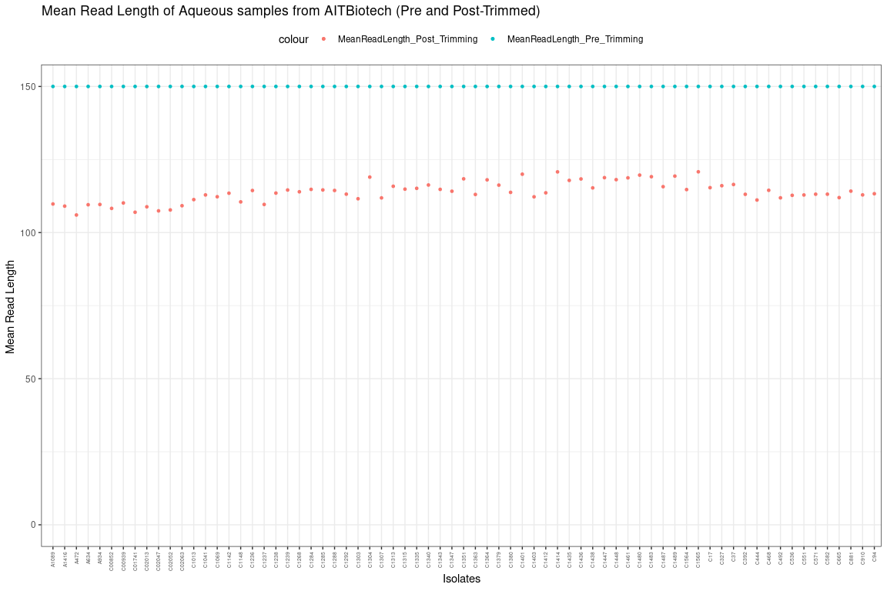
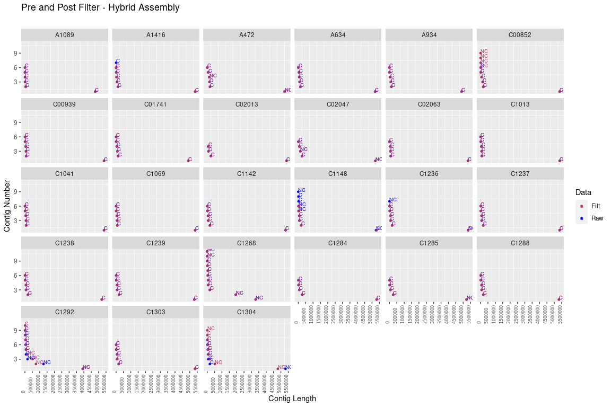
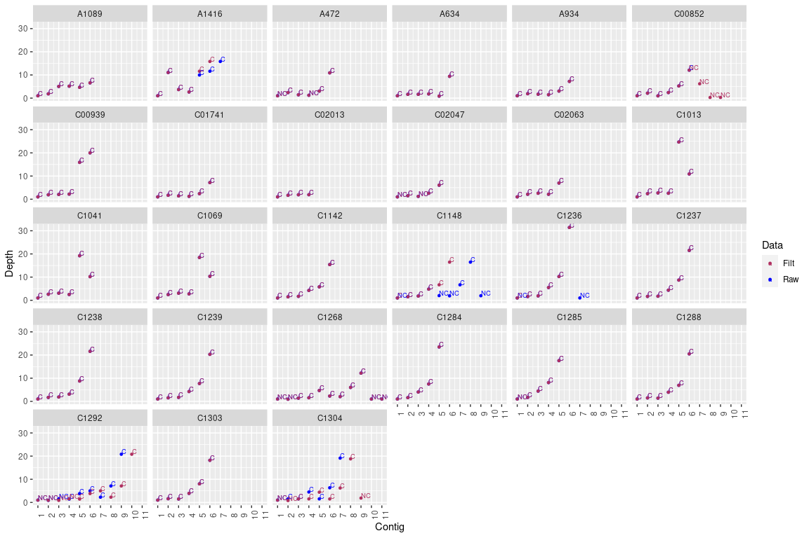

### Step 1: Raw read analysis fastqc and multiqc

I wrote a shell script (available here: https://github.com/ramadatta/Scripts/blob/master/Shell/mob_typer_OnEachContig.sh) with mobtyper which breaks an assembly into single contig fasta file and run mobtyper on each contig seperately. By doing so, we can know which specific contig has what Inc group. 


```bash
#Location -
# cd /storage/data/DATA4/analysis/30_Aqueous_Env_11F_data_analysis

###################################################################

# Step 1.fastqc on Raw Reads 
##############################

mkdir 1_Rawdata

cd 1_Rawdata

# 11F data - 12 samples
mkdir 11F
cd 11F

# Copying softlinks of the raw data files
ln -s /storage/data/DATA2/Sequencing_Company_Metadata/AITBiotech/May2021/X401SC20093883-Z01-F005/raw_data/*/*.fq.gz /storage/data/DATA4/analysis/30_Aqueous_Env_11F_data_analysis/1_Rawdata/11F

# Moving into fastq files into respective folders
for d in $(ls *.gz | cut -f1 -d "_"  | sort -u); do mkdir $d; mv "$d"_*.gz $d; done

# Repeating the above steps on Env data - 59 samples
mkdir Env
cd Env

# Copying softlinks of the raw data files
ln -s /storage/data/DATA2/Sequencing_Company_Metadata/AITBiotech/Mar2021/QSG2006080005_Batch_4/X401SC20093883-Z01-F004/raw_data/*/*.fq.gz /storage/data/DATA4/analysis/30_Aqueous_Env_11F_data_analysis/1_Rawdata/Env/

# Moving into fastq files into respective folders
for d in $(ls *.gz | cut -f1 -d "_"  | sort -u); do mkdir $d; mv "$d"_*.gz $d; done 

# Run fastqc on the raw reads (Env + 11F)
time for d in $(ls -d */| sed 's/\///g'); do echo $d; cd $d; /storage/apps/FastQC/fastqc -t 48 *.fq.gz; cd ..; done

#combine all fastqc reports using multiqc
cd 1_Rawdata

multiqc .

# Unzip the gz files - because these are softlinks we write to  an other file
cd 11F

time for x in $(ls -d */ | tr -d '/'); 
do 
cd $x; 
echo $x; 
  for d in $(ls *.fq.gz); 
  do 
  base=`echo $d | sed 's/.fq.gz//'`; 
  gunzip -c $d >"$base".fq & 
  done; 
cd ..;
done

cd Env

time for x in $(ls -d */ | tr -d '/'); 
  do 
  cd $x;
  echo $x; 
  for d in $(ls *.fq.gz); 
    do base=`echo $d | sed 's/.fq.gz//'`; 
    gunzip -c $d >"$base".fq & 
    done;
  cd ..;  
  done

# Observations from raw fastq: Adapters are present in many sequences. So, trimmed them using BBMAP.
# But base quality of all the samples looking high (above Q30).

# For generating read stats - Run this on both Env and 11F folders
$ time for d in $(ls */*fq); do echo $d; perl /storage/apps/SNP_Validation_Scripts/tools/Q20_Q30_Stats_wo_functions.pl $d & done 

$ pwd
#/storage/data/DATA4/analysis/30_Aqueous_Env_11F_data_analysis/1_Rawdata

$ cat */Q30_Q20_readstats.txt >rawData_Q30_Q20_readstats.txt

# Run qualStats.R script with the rawData_Q30_Q20_readstats.txt as an input. This should generate "_Pre-Trimmed_aggregated_stats.txt" file

$ pwd
# /storage/data/DATA4/analysis/30_Aqueous_Env_11F_data_analysis/2_Cleandata/illumina_bbmap_trimmed

# Run qualStats.R script with the rawData_Q30_Q20_readstats.txt as an input. This should generate "_Pre-Trimmed_aggregated_stats.txt" file

# Run qualStats.R script with the filtData_Q30_Q20_readstats.txt as an input. This should generate "_Post-Trimmed_aggregated_stats.txt" file

# Now combine both Raw and Filt Data using qualStats_aggregated.R script

```

### Step 2: Pre-process Illumina reads 

Now let us trim the raw data from illumina.


```bash

# Step 2. Adapter trimming using BBDuk 
######################################

# 11F
time for d in $(ls -d */); 
do 
  echo $d; 
  subdir=`echo $d`; 
  cd $subdir; 
  R1=`ls *_1.fq | sed 's/.fq//g'`; R2=`ls *_2.fq | sed 's/.fq//g'`; 
  echo "$R1 $R2"; 
  /storage/apps/bbmap/bbduk.sh -Xmx6g in1=$R1.fq in2=$R2.fq out1=$R1\_bbmap_adaptertrimmed.fq out2=$R2\_bbmap_adaptertrimmed.fq ref=/storage/apps/bbmap/resources/adapters.fa ktrim=r k=23 mink=11 hdist=1 qtrim=rl trimq=30 minavgquality=30; 
  cd ..; 
done

# Env
time for d in $(ls -d */); 
do 
  echo $d; 
  subdir=`echo $d`; 
  cd $subdir; R1=`ls *_1.fq | sed 's/.fq//g'`; R2=`ls *_2.fq | sed 's/.fq//g'`; echo "$R1 $R2"; 
  /storage/apps/bbmap/bbduk.sh -Xmx6g in1=$R1.fq in2=$R2.fq out1=$R1\_bbmap_adaptertrimmed.fq out2=$R2\_bbmap_adaptertrimmed.fq ref=/storage/apps/bbmap/resources/adapters.fa ktrim=r k=23 mink=11 hdist=1 qtrim=rl trimq=30 minavgquality=30;
  cd ..; 
done

# Manually copied the bbmap command log into adapter_trimming.log

mkdir ../2_CleanData

# move the adapter trimmed files into another directory
 mv */*bbmap_adaptertrimmed.fq /storage/data/DATA4/analysis/30_Aqueous_Env_11F_data_analysis/2_CleanData/illumina_bbmap_trimmed/11F
 mv */*bbmap_adaptertrimmed.fq /storage/data/DATA4/analysis/30_Aqueous_Env_11F_data_analysis/2_CleanData/illumina_bbmap_trimmed/Env

# move to specific folder
for d in $(ls *.fq| awk -F_ '{print $1}' | sort -u); do echo $d; mkdir $d; mv "$d"_*.fq $d; done

# Run fastqc on the raw reads (Env + 11F)
time for d in $(ls -d */| sed 's/\///g'); do echo $d; cd $d; /storage/apps/FastQC/fastqc -t 48 *.fq; cd ..; done

#combine all fastqc reports using multiqc
cd 1_Rawdata

multiqc .
```


```r
library(tidyr)
library(dplyr)

library(ggplot2)
library(scales)

setwd("/data02/Analysis/Projects/8_Aqueos_samples/1_ReadData_Stats_Raw_vs_Filt")

stats <- read.csv("Aqueous_samples_AITBiotech_Pre_AND_Post_Trimming_Stats.csv", header = TRUE, sep = ",")
head(stats)
```

```
##   Isolate                 Species TotalReads_Pre_Trimming
## 1   A1089 Enterobacter_hormaechei                12757560
## 2   A1416   Klebsiella_pneumoniae                12235664
## 3    A472   Klebsiella_pneumoniae                10061770
## 4    A634        Escherichia_coli                 8450694
## 5    A934        Escherichia_coli                 9026364
## 6  C00852   Klebsiella_pneumoniae                12641538
##   TotalBases_Pre_Trimming Q20Bases_Pre_Trimming Q30Bases_Pre_Trimming
## 1              1913634000            1874265319            1791552951
## 2              1835349600            1796888071            1716845675
## 3              1509265500            1474313726            1403773632
## 4              1267604100            1242111402            1187258438
## 5              1353954600            1324942219            1265124809
## 6              1896230700            1855434658            1771569441
##   MeanReadLength_Pre_Trimming Q20_Prcnt_Pre_Trimming Q30_Prcnt_Pre_Trimming
## 1                         150              0.9794273              0.9362046
## 2                         150              0.9790440              0.9354325
## 3                         150              0.9768419              0.9301038
## 4                         150              0.9798891              0.9366161
## 5                         150              0.9785721              0.9343923
## 6                         150              0.9784857              0.9342584
##   Genome_Coverage_Pre_Trimming TotalReads_Post_Trimming
## 1                     347.9335                 12529502
## 2                     333.6999                 12027466
## 3                     274.4119                  9865566
## 4                     230.4735                  8319246
## 5                     246.1736                  8844716
## 6                     344.7692                 12414322
##   TotalBases_Post_Trimming Q20Bases_Post_Trimming Q30Bases_Post_Trimming
## 1               1375579433             1375579433             1341097211
## 2               1311638924             1311638924             1278571566
## 3               1045936174             1045936174             1018033881
## 4                911184123              911184123              887677579
## 5                969497917              969497917              944605887
## 6               1344149350             1344149350             1309890341
##   MeanReadLength_Post_Trimming Q20_Prcnt_Post_Trimming Q30_Prcnt_Post_Trimming
## 1                     109.7872                       1               0.9749326
## 2                     109.0536                       1               0.9747893
## 3                     106.0189                       1               0.9733231
## 4                     109.5272                       1               0.9742022
## 5                     109.6132                       1               0.9743248
## 6                     108.2741                       1               0.9745125
##   Genome_Coverage_Post_Trimming
## 1                      250.1054
## 2                      238.4798
## 3                      190.1702
## 4                      165.6698
## 5                      176.2723
## 6                      244.3908
```

```r
############--------CHANGE THESE VARIABLES---IMPORTANT!!------##########

samples_or_project_name <- "Aqueous"
seqCompany <- "AITBiotech" #Internal/AITBiotech
seqData_trimmed_or_not <- "Pre and Post-Trimmed" # use "Raw data" before trimming else use "After Trimming with Q30 score"  
genomeSize <- 5500000 


# Plotting

###----> Genome Coverage

ggplot(stats[order(pmax(stats$Genome_Coverage_Pre_Trimming, stats$Genome_Coverage_Post_Trimming)),], aes (x=factor(Isolate, levels=Isolate), Genome_Coverage)) +  
  geom_point(aes(y=Genome_Coverage_Pre_Trimming, color = "Genome_Coverage_Pre_Trimming"), size=1) + 
  geom_point(aes(y=Genome_Coverage_Post_Trimming, color = "Genome_Coverage_Post_Trimming"), size=1) +
  theme_bw() +
  theme(axis.text.x = element_text(angle = 90, vjust = 0.5, hjust=1, size=5),legend.position = "top") + #Rotating and spacing axis labels
  expand_limits(x = c(0, NA), y = c(0, NA)) +
  xlab("Isolates") +
  ylab("Genome Coverage ") +
  ggtitle(paste0("Genome Coverage of ",samples_or_project_name," samples from ",seqCompany," (",seqData_trimmed_or_not,")")) #+ 
```

<!-- -->

```r
#  facet_wrap(~Species,scales = "free_x", nrow = 2) # ggtitle("Genome Coverage of Steno Samples from AITBiotech (After Trimming)")

ggsave("GenomeCoverage.png",dpi = 600, width = 8, height = 6, units = "in")

###----> Total Reads

ggplot(stats[order(pmax(stats$TotalReads_Pre_Trimming, stats$TotalReads_Post_Trimming)),], aes (x=factor(Isolate, levels=Isolate), Total_Reads)) +  
  geom_point(aes (y= TotalReads_Pre_Trimming, color = "TotalReads_Pre_Trimming"), size=1) + 
  geom_point(aes(y=TotalReads_Post_Trimming, color = "TotalReads_Post_Trimming"), size=1) +
  theme_bw() +
  theme(axis.text.x = element_text(angle = 90, vjust = 0.5, hjust=1, size=5),legend.position = "top") + #Rotating and spacing axis labels
  expand_limits(x = c(0, NA), y = c(0, NA)) +
  scale_y_continuous(labels = unit_format(unit = "M", scale = 1e-6)) + ## need to load "scales" library - very readable
  xlab("Isolates") +
  ylab("Total Reads") +
  ggtitle(paste0("Total Reads of ",samples_or_project_name," samples from ",seqCompany," (",seqData_trimmed_or_not,")"))
```

<!-- -->

```r
ggsave("TotalReads.png",dpi = 600, width = 8, height = 6, units = "in")

###----> Mean Read length

ggplot(stats[order(pmax(stats$MeanReadLength_Pre_Trimming, stats$MeanReadLength_Post_Trimming)),], aes (x=factor(Isolate, levels=Isolate), MeanReadLength)) +  
  geom_point(aes (y= MeanReadLength_Pre_Trimming, color = "MeanReadLength_Pre_Trimming"), size=1) + 
  geom_point(aes(y=MeanReadLength_Post_Trimming, color = "MeanReadLength_Post_Trimming"), size=1) +
  theme_bw() +
  theme(axis.text.x = element_text(angle = 90, vjust = 0.5, hjust=1, size=5),legend.position = "top") + #Rotating and spacing axis labels
  expand_limits(x = c(0, NA), y = c(0, NA)) +
  xlab("Isolates") +
  ylab("Mean Read Length ") +
  ggtitle(paste0("Mean Read Length of ",samples_or_project_name," samples from ",seqCompany," (",seqData_trimmed_or_not,")"))
```

<!-- -->

```r
ggsave("MeanReadLength.png",dpi = 600, width = 8, height = 6, units = "in")

  
###----> Total Bases

ggplot(stats[order(pmax(stats$TotalBases_Pre_Trimming, stats$TotalBases_Post_Trimming)),], aes (x=factor(Isolate, levels=Isolate), TotalBases)) +  
  geom_point(aes (y= TotalBases_Pre_Trimming, color = "TotalBases_Pre_Trimming"), size=1) + 
  geom_point(aes(y=TotalBases_Post_Trimming, color = "TotalBases_Post_Trimming"), size=1) +
  theme_bw() +
    theme(axis.text.x = element_text(angle = 90, vjust = 0.5, hjust=1, size=5),legend.position = "top") + #Rotating and spacing axis labels
  expand_limits(x = c(0, NA), y = c(0, NA)) +
  scale_y_continuous(labels = unit_format(unit = "MB", scale = 1e-6)) + ## need to load "scales" library - very readable
  xlab("Isolates") +
  ylab("Total Bases") +
  ggtitle(paste0("Total Bases of ",samples_or_project_name," samples from ",seqCompany," (",seqData_trimmed_or_not,")"))
```

<!-- -->

```r
ggsave("TotalBases.png",dpi = 600, width = 8, height = 6, units = "in")
```

### Step 3: Pre-process Nanopore reads 

Initially, nanopore reads were trimmed off from barcodes using `qcat` and further filtered by `filtlong`.
and the resulting cleaned data from both illumina and nanopore is given as input to `unicycler`
```
cat FC1/fastq_pass/*.fastq | qcat -b FC1_demultiplex -k RBK004 --detect-middle --trim
```

Another filtering step was performed to produce higher quality reads using filtlong tool.


```bash

# Copying Nanopore trimmed and filtered data from Nanopore harddisk
cd 2_CleanData
mkdir nanopore_qcat_adaptertrimmed
cd nanopore_qcat_adaptertrimmed
mkdir 11F
mkdir Env

# Filtering long reads by quality

# According to this post (https://github.com/rrwick/Unicycler/issues/118) in unicycler issues, 
# unicycler can get choked with large amount of nanopore data. So we filter the long reads using filtlong  

#Filtlong was installed in unicycler-env using conda. So activating this environment first

conda activate unicycler-env

time for d in $(ls *.fastq | sed 's/.fastq//g'); 
do 
filtlong --min_length 1000 --keep_percent 90 --target_bases 500000000 "$d".fastq > "$d".filtlong.fastq & 
done
```

### Step 3a: Generate Nanopore Read statistics
Now that we have both raw and filtered fastq files run bbtools statswrapper.sh


```bash
time statswrapper.sh *.fastq >bbstats_wrapper.txt 
```

### Step 3b: Generate R plots

Let us load the **bbstats_wrapper.txt** file into R and generate some figures from the data using R ggplot function.


```r
setwd("/data02/Analysis/Projects/8_Aqueos_samples/11F/bbstats/")

library(dplyr)
library(ggplot2)
library(ggunchained)
library(kableExtra)

bbstats <- read.table("bbstats_wrapper.txt", sep = "\t", header = TRUE)

# Since the table is very big outputting the contents into table with scroll bar
head(bbstats) %>%
  kbl() %>%
   kable_paper() %>%
  scroll_box(width = "100%", height = "200px")
```

<div style="border: 1px solid #ddd; padding: 0px; overflow-y: scroll; height:200px; overflow-x: scroll; width:100%; "><table class=" lightable-paper" style='font-family: "Arial Narrow", arial, helvetica, sans-serif; margin-left: auto; margin-right: auto;'>
 <thead>
  <tr>
   <th style="text-align:right;position: sticky; top:0; background-color: #FFFFFF;"> n_scaffolds </th>
   <th style="text-align:right;position: sticky; top:0; background-color: #FFFFFF;"> n_contigs </th>
   <th style="text-align:right;position: sticky; top:0; background-color: #FFFFFF;"> scaf_bp </th>
   <th style="text-align:right;position: sticky; top:0; background-color: #FFFFFF;"> contig_bp </th>
   <th style="text-align:right;position: sticky; top:0; background-color: #FFFFFF;"> gap_pct </th>
   <th style="text-align:right;position: sticky; top:0; background-color: #FFFFFF;"> scaf_L50 </th>
   <th style="text-align:right;position: sticky; top:0; background-color: #FFFFFF;"> scaf_N50 </th>
   <th style="text-align:right;position: sticky; top:0; background-color: #FFFFFF;"> ctg_L50 </th>
   <th style="text-align:right;position: sticky; top:0; background-color: #FFFFFF;"> ctg_N50 </th>
   <th style="text-align:right;position: sticky; top:0; background-color: #FFFFFF;"> scaf_L90 </th>
   <th style="text-align:right;position: sticky; top:0; background-color: #FFFFFF;"> scaf_N90 </th>
   <th style="text-align:right;position: sticky; top:0; background-color: #FFFFFF;"> ctg_L90 </th>
   <th style="text-align:right;position: sticky; top:0; background-color: #FFFFFF;"> ctg_N90 </th>
   <th style="text-align:right;position: sticky; top:0; background-color: #FFFFFF;"> scaf_max </th>
   <th style="text-align:right;position: sticky; top:0; background-color: #FFFFFF;"> ctg_max </th>
   <th style="text-align:right;position: sticky; top:0; background-color: #FFFFFF;"> scaf_n_gt50K </th>
   <th style="text-align:right;position: sticky; top:0; background-color: #FFFFFF;"> scaf_pct_gt50K </th>
   <th style="text-align:right;position: sticky; top:0; background-color: #FFFFFF;"> gc_avg </th>
   <th style="text-align:right;position: sticky; top:0; background-color: #FFFFFF;"> gc_std </th>
   <th style="text-align:left;position: sticky; top:0; background-color: #FFFFFF;"> filename </th>
   <th style="text-align:left;position: sticky; top:0; background-color: #FFFFFF;"> Sample </th>
   <th style="text-align:left;position: sticky; top:0; background-color: #FFFFFF;"> Path </th>
  </tr>
 </thead>
<tbody>
  <tr>
   <td style="text-align:right;"> 7518 </td>
   <td style="text-align:right;"> 7518 </td>
   <td style="text-align:right;"> 82157895 </td>
   <td style="text-align:right;"> 82157895 </td>
   <td style="text-align:right;"> 0 </td>
   <td style="text-align:right;"> 1198 </td>
   <td style="text-align:right;"> 20696 </td>
   <td style="text-align:right;"> 1198 </td>
   <td style="text-align:right;"> 20696 </td>
   <td style="text-align:right;"> 4189 </td>
   <td style="text-align:right;"> 5129 </td>
   <td style="text-align:right;"> 4189 </td>
   <td style="text-align:right;"> 5129 </td>
   <td style="text-align:right;"> 119488 </td>
   <td style="text-align:right;"> 119488 </td>
   <td style="text-align:right;"> 135 </td>
   <td style="text-align:right;"> 10.168 </td>
   <td style="text-align:right;"> 0.54364 </td>
   <td style="text-align:right;"> 0.04361 </td>
   <td style="text-align:left;"> A1089_NP </td>
   <td style="text-align:left;"> A1089 </td>
   <td style="text-align:left;"> /storage/data/DATA4/analysis/30_Aqueous_Env_11F_data_analysis/2_AdapterTrimmed_bbduk_Q30/nanopore_qcat_adaptertrimmed_filtlong/11F/A1089_Nanopore.fastq </td>
  </tr>
  <tr>
   <td style="text-align:right;"> 4475 </td>
   <td style="text-align:right;"> 4475 </td>
   <td style="text-align:right;"> 73944083 </td>
   <td style="text-align:right;"> 73944083 </td>
   <td style="text-align:right;"> 0 </td>
   <td style="text-align:right;"> 1014 </td>
   <td style="text-align:right;"> 22956 </td>
   <td style="text-align:right;"> 1014 </td>
   <td style="text-align:right;"> 22956 </td>
   <td style="text-align:right;"> 3176 </td>
   <td style="text-align:right;"> 8100 </td>
   <td style="text-align:right;"> 3176 </td>
   <td style="text-align:right;"> 8100 </td>
   <td style="text-align:right;"> 119488 </td>
   <td style="text-align:right;"> 119488 </td>
   <td style="text-align:right;"> 133 </td>
   <td style="text-align:right;"> 11.121 </td>
   <td style="text-align:right;"> 0.54459 </td>
   <td style="text-align:right;"> 0.03822 </td>
   <td style="text-align:left;"> A1089_NP.filtlong </td>
   <td style="text-align:left;"> A1089 </td>
   <td style="text-align:left;"> /storage/data/DATA4/analysis/30_Aqueous_Env_11F_data_analysis/2_AdapterTrimmed_bbduk_Q30/nanopore_qcat_adaptertrimmed_filtlong/11F/A1089_Nanopore.filtlong.fastq </td>
  </tr>
  <tr>
   <td style="text-align:right;"> 135106 </td>
   <td style="text-align:right;"> 135106 </td>
   <td style="text-align:right;"> 1442374512 </td>
   <td style="text-align:right;"> 1442374512 </td>
   <td style="text-align:right;"> 0 </td>
   <td style="text-align:right;"> 21266 </td>
   <td style="text-align:right;"> 19686 </td>
   <td style="text-align:right;"> 21266 </td>
   <td style="text-align:right;"> 19686 </td>
   <td style="text-align:right;"> 76962 </td>
   <td style="text-align:right;"> 5405 </td>
   <td style="text-align:right;"> 76962 </td>
   <td style="text-align:right;"> 5405 </td>
   <td style="text-align:right;"> 167349 </td>
   <td style="text-align:right;"> 167349 </td>
   <td style="text-align:right;"> 2473 </td>
   <td style="text-align:right;"> 11.611 </td>
   <td style="text-align:right;"> 0.54790 </td>
   <td style="text-align:right;"> 0.05361 </td>
   <td style="text-align:left;"> A1416_NP </td>
   <td style="text-align:left;"> A1416 </td>
   <td style="text-align:left;"> /storage/data/DATA4/analysis/30_Aqueous_Env_11F_data_analysis/2_AdapterTrimmed_bbduk_Q30/nanopore_qcat_adaptertrimmed_filtlong/11F/A1416_Nanopore.fastq </td>
  </tr>
  <tr>
   <td style="text-align:right;"> 18128 </td>
   <td style="text-align:right;"> 18128 </td>
   <td style="text-align:right;"> 500097148 </td>
   <td style="text-align:right;"> 500097148 </td>
   <td style="text-align:right;"> 0 </td>
   <td style="text-align:right;"> 5447 </td>
   <td style="text-align:right;"> 30520 </td>
   <td style="text-align:right;"> 5447 </td>
   <td style="text-align:right;"> 30520 </td>
   <td style="text-align:right;"> 14425 </td>
   <td style="text-align:right;"> 15937 </td>
   <td style="text-align:right;"> 14425 </td>
   <td style="text-align:right;"> 15937 </td>
   <td style="text-align:right;"> 167349 </td>
   <td style="text-align:right;"> 167349 </td>
   <td style="text-align:right;"> 1461 </td>
   <td style="text-align:right;"> 19.792 </td>
   <td style="text-align:right;"> 0.55250 </td>
   <td style="text-align:right;"> 0.03752 </td>
   <td style="text-align:left;"> A1416_NP.filtlong </td>
   <td style="text-align:left;"> A1416 </td>
   <td style="text-align:left;"> /storage/data/DATA4/analysis/30_Aqueous_Env_11F_data_analysis/2_AdapterTrimmed_bbduk_Q30/nanopore_qcat_adaptertrimmed_filtlong/11F/A1416_Nanopore.filtlong.fastq </td>
  </tr>
  <tr>
   <td style="text-align:right;"> 25032 </td>
   <td style="text-align:right;"> 25032 </td>
   <td style="text-align:right;"> 349105749 </td>
   <td style="text-align:right;"> 349105749 </td>
   <td style="text-align:right;"> 0 </td>
   <td style="text-align:right;"> 4072 </td>
   <td style="text-align:right;"> 25524 </td>
   <td style="text-align:right;"> 4072 </td>
   <td style="text-align:right;"> 25524 </td>
   <td style="text-align:right;"> 14526 </td>
   <td style="text-align:right;"> 7422 </td>
   <td style="text-align:right;"> 14526 </td>
   <td style="text-align:right;"> 7422 </td>
   <td style="text-align:right;"> 153451 </td>
   <td style="text-align:right;"> 153451 </td>
   <td style="text-align:right;"> 1039 </td>
   <td style="text-align:right;"> 19.769 </td>
   <td style="text-align:right;"> 0.55321 </td>
   <td style="text-align:right;"> 0.04948 </td>
   <td style="text-align:left;"> A472_NP </td>
   <td style="text-align:left;"> A472 </td>
   <td style="text-align:left;"> /storage/data/DATA4/analysis/30_Aqueous_Env_11F_data_analysis/2_AdapterTrimmed_bbduk_Q30/nanopore_qcat_adaptertrimmed_filtlong/11F/A472_Nanopore.fastq </td>
  </tr>
  <tr>
   <td style="text-align:right;"> 16698 </td>
   <td style="text-align:right;"> 16698 </td>
   <td style="text-align:right;"> 314218586 </td>
   <td style="text-align:right;"> 314218586 </td>
   <td style="text-align:right;"> 0 </td>
   <td style="text-align:right;"> 3502 </td>
   <td style="text-align:right;"> 27360 </td>
   <td style="text-align:right;"> 3502 </td>
   <td style="text-align:right;"> 27360 </td>
   <td style="text-align:right;"> 11711 </td>
   <td style="text-align:right;"> 8186 </td>
   <td style="text-align:right;"> 11711 </td>
   <td style="text-align:right;"> 8186 </td>
   <td style="text-align:right;"> 153451 </td>
   <td style="text-align:right;"> 153451 </td>
   <td style="text-align:right;"> 1003 </td>
   <td style="text-align:right;"> 21.218 </td>
   <td style="text-align:right;"> 0.55385 </td>
   <td style="text-align:right;"> 0.04438 </td>
   <td style="text-align:left;"> A472_NP.filtlong </td>
   <td style="text-align:left;"> A472 </td>
   <td style="text-align:left;"> /storage/data/DATA4/analysis/30_Aqueous_Env_11F_data_analysis/2_AdapterTrimmed_bbduk_Q30/nanopore_qcat_adaptertrimmed_filtlong/11F/A472_Nanopore.filtlong.fastq </td>
  </tr>
</tbody>
</table></div>

```r
# Subsetting columns to a smaller dataframe for ease of analysis
bbstats_filtered <- bbstats %>% select(n_contigs, contig_bp, ctg_N50,ctg_max,filename,Sample)

#renaming column names
colnames(bbstats_filtered) <- c("ReadCount","Totalbases", "N50","LongestRead","Filename", "Sample")

# Since the table is small outputting the contents into kable table
 head(bbstats_filtered) %>%
  kbl() %>%
  kable_classic_2(full_width = F)
```

<table class=" lightable-classic-2" style='font-family: "Arial Narrow", "Source Sans Pro", sans-serif; width: auto !important; margin-left: auto; margin-right: auto;'>
 <thead>
  <tr>
   <th style="text-align:right;"> ReadCount </th>
   <th style="text-align:right;"> Totalbases </th>
   <th style="text-align:right;"> N50 </th>
   <th style="text-align:right;"> LongestRead </th>
   <th style="text-align:left;"> Filename </th>
   <th style="text-align:left;"> Sample </th>
  </tr>
 </thead>
<tbody>
  <tr>
   <td style="text-align:right;"> 7518 </td>
   <td style="text-align:right;"> 82157895 </td>
   <td style="text-align:right;"> 20696 </td>
   <td style="text-align:right;"> 119488 </td>
   <td style="text-align:left;"> A1089_NP </td>
   <td style="text-align:left;"> A1089 </td>
  </tr>
  <tr>
   <td style="text-align:right;"> 4475 </td>
   <td style="text-align:right;"> 73944083 </td>
   <td style="text-align:right;"> 22956 </td>
   <td style="text-align:right;"> 119488 </td>
   <td style="text-align:left;"> A1089_NP.filtlong </td>
   <td style="text-align:left;"> A1089 </td>
  </tr>
  <tr>
   <td style="text-align:right;"> 135106 </td>
   <td style="text-align:right;"> 1442374512 </td>
   <td style="text-align:right;"> 19686 </td>
   <td style="text-align:right;"> 167349 </td>
   <td style="text-align:left;"> A1416_NP </td>
   <td style="text-align:left;"> A1416 </td>
  </tr>
  <tr>
   <td style="text-align:right;"> 18128 </td>
   <td style="text-align:right;"> 500097148 </td>
   <td style="text-align:right;"> 30520 </td>
   <td style="text-align:right;"> 167349 </td>
   <td style="text-align:left;"> A1416_NP.filtlong </td>
   <td style="text-align:left;"> A1416 </td>
  </tr>
  <tr>
   <td style="text-align:right;"> 25032 </td>
   <td style="text-align:right;"> 349105749 </td>
   <td style="text-align:right;"> 25524 </td>
   <td style="text-align:right;"> 153451 </td>
   <td style="text-align:left;"> A472_NP </td>
   <td style="text-align:left;"> A472 </td>
  </tr>
  <tr>
   <td style="text-align:right;"> 16698 </td>
   <td style="text-align:right;"> 314218586 </td>
   <td style="text-align:right;"> 27360 </td>
   <td style="text-align:right;"> 153451 </td>
   <td style="text-align:left;"> A472_NP.filtlong </td>
   <td style="text-align:left;"> A472 </td>
  </tr>
</tbody>
</table>

```r
# Parsing data  
bbstats_filtered <- bbstats_filtered %>% 
      mutate(data = case_when(grepl("_NP.filtlong", Filename) ~ "Filtered",
                              grepl("_NP", Filename, ignore.case = TRUE) ~"Raw")) %>% 
          select(-Filename) 

# Since the table is small outputting the contents into kable table
 head(bbstats_filtered) %>%
  kbl() %>%
  kable_classic_2(full_width = F)
```

<table class=" lightable-classic-2" style='font-family: "Arial Narrow", "Source Sans Pro", sans-serif; width: auto !important; margin-left: auto; margin-right: auto;'>
 <thead>
  <tr>
   <th style="text-align:right;"> ReadCount </th>
   <th style="text-align:right;"> Totalbases </th>
   <th style="text-align:right;"> N50 </th>
   <th style="text-align:right;"> LongestRead </th>
   <th style="text-align:left;"> Sample </th>
   <th style="text-align:left;"> data </th>
  </tr>
 </thead>
<tbody>
  <tr>
   <td style="text-align:right;"> 7518 </td>
   <td style="text-align:right;"> 82157895 </td>
   <td style="text-align:right;"> 20696 </td>
   <td style="text-align:right;"> 119488 </td>
   <td style="text-align:left;"> A1089 </td>
   <td style="text-align:left;"> Raw </td>
  </tr>
  <tr>
   <td style="text-align:right;"> 4475 </td>
   <td style="text-align:right;"> 73944083 </td>
   <td style="text-align:right;"> 22956 </td>
   <td style="text-align:right;"> 119488 </td>
   <td style="text-align:left;"> A1089 </td>
   <td style="text-align:left;"> Filtered </td>
  </tr>
  <tr>
   <td style="text-align:right;"> 135106 </td>
   <td style="text-align:right;"> 1442374512 </td>
   <td style="text-align:right;"> 19686 </td>
   <td style="text-align:right;"> 167349 </td>
   <td style="text-align:left;"> A1416 </td>
   <td style="text-align:left;"> Raw </td>
  </tr>
  <tr>
   <td style="text-align:right;"> 18128 </td>
   <td style="text-align:right;"> 500097148 </td>
   <td style="text-align:right;"> 30520 </td>
   <td style="text-align:right;"> 167349 </td>
   <td style="text-align:left;"> A1416 </td>
   <td style="text-align:left;"> Filtered </td>
  </tr>
  <tr>
   <td style="text-align:right;"> 25032 </td>
   <td style="text-align:right;"> 349105749 </td>
   <td style="text-align:right;"> 25524 </td>
   <td style="text-align:right;"> 153451 </td>
   <td style="text-align:left;"> A472 </td>
   <td style="text-align:left;"> Raw </td>
  </tr>
  <tr>
   <td style="text-align:right;"> 16698 </td>
   <td style="text-align:right;"> 314218586 </td>
   <td style="text-align:right;"> 27360 </td>
   <td style="text-align:right;"> 153451 </td>
   <td style="text-align:left;"> A472 </td>
   <td style="text-align:left;"> Filtered </td>
  </tr>
</tbody>
</table>

```r
#N50 Dumbbell plot 
ggplot(bbstats_filtered, aes(x=N50, y=reorder(Sample,N50))) + 
  geom_line(aes(group = Sample))+
  geom_point(aes(color=data), size=1) +
  theme_light()+
  theme(legend.position="top", axis.text.x = element_text(angle = 90, hjust = 1, size = 6), axis.text.y = element_text(angle = 0, hjust = 1, size = 5)) +
  scale_color_brewer(palette="Dark2", direction=-1) +
  scale_x_continuous(breaks = scales::pretty_breaks(n = 20)) +
  labs(x="N50",
       y="Sample",
       title = "N50 Pre and Post trimming (Nanopore)")
```

<!-- -->

```r
#TotalBases Dumbbell plot
ggplot(bbstats_filtered, aes(x=Totalbases, y=reorder(Sample,Totalbases))) + 
  geom_line(aes(group = Sample))+
  geom_point(aes(color=data), size=1) +
  theme_light()+
  theme(legend.position="top", axis.text.x = element_text(angle = 90, hjust = 1, size = 6), axis.text.y = element_text(angle = 0, hjust = 1, size = 5)) +
  scale_color_brewer(palette="Dark2", direction=-1) +
  scale_x_continuous(breaks = scales::pretty_breaks(n = 20)) +
  labs(x="Totalbases",
       y="Sample",
       title = "Totalbases Pre and Post trimming (Nanopore)")
```

<!-- -->

```r
#ReadCounts Dumbbell plot
ggplot(bbstats_filtered, aes(x=ReadCount, y=reorder(Sample,ReadCount))) + 
  geom_line(aes(group = Sample))+
  geom_point(aes(color=data), size=1) +
  theme_light()+
  theme(legend.position="top", axis.text.x = element_text(angle = 90, hjust = 1, size = 6), axis.text.y = element_text(angle = 0, hjust = 1, size = 5)) +
  scale_color_brewer(palette="Dark2", direction=-1) +
  scale_x_continuous(breaks = scales::pretty_breaks(n = 20)) +
  labs(x="ReadCount",
       y="Sample",
       title = "ReadCount Pre and Post trimming (Nanopore)")
```

<!-- -->

```r
#LongestRead Dumbbell plot
ggplot(bbstats_filtered, aes(x=LongestRead, y=reorder(Sample,LongestRead))) + 
  geom_line(aes(group = Sample))+
  geom_point(aes(color=data), size=1) +
  theme_light()+
  theme(legend.position="top", axis.text.x = element_text(angle = 90, hjust = 1, size = 6), axis.text.y = element_text(angle = 0, hjust = 1, size = 5)) +
  scale_color_brewer(palette="Dark2", direction=-1) +
  scale_x_continuous(breaks = scales::pretty_breaks(n = 20)) +
  labs(x="Read Length",
       y="Sample",
       title = "LongestRead Pre and Post trimming (Nanopore)")
```

<!-- -->

## Easy Way to combine multiple figures into single figure

We will write the all the ggplot functions into respective ggplot variable and then provides all the plots to the function ggarrange() [in ggpubr] as below. We can create a common unique legend for multiple plots.


```r
#N50 Dumbbell plot 
N50_dumb <- ggplot(bbstats_filtered, aes(x=N50, y=reorder(Sample,N50))) + 
  geom_line(aes(group = Sample))+
  geom_point(aes(color=data), size=1) +
  theme_light()+
  theme(legend.position="top", axis.text.x = element_text(angle = 90, hjust = 1, size = 6), axis.text.y = element_text(angle = 0, hjust = 1, size = 5)) +
  scale_color_brewer(palette="Dark2", direction=-1) +
  scale_x_continuous(breaks = scales::pretty_breaks(n = 20)) +
  labs(x="N50",
       y="Sample",
       title = "N50 Pre and Post trimming (Nanopore)")
#class(N50_dumb)

#TotalBases
TB_dumb <- ggplot(bbstats_filtered, aes(x=Totalbases, y=reorder(Sample,Totalbases))) + 
  geom_line(aes(group = Sample))+
  geom_point(aes(color=data), size=1) +
  theme_light()+
  theme(legend.position="top", axis.text.x = element_text(angle = 90, hjust = 1, size = 6), axis.text.y = element_text(angle = 0, hjust = 1, size = 5)) +
  scale_color_brewer(palette="Dark2", direction=-1) +
  scale_x_continuous(breaks = scales::pretty_breaks(n = 20)) +
  labs(x="Totalbases",
       y="Sample",
       title = "Totalbases Pre and Post trimming (Nanopore)")

#ReadCounts
RC_dumb <- ggplot(bbstats_filtered, aes(x=ReadCount, y=reorder(Sample,ReadCount))) + 
  geom_line(aes(group = Sample))+
  geom_point(aes(color=data), size=1) +
  theme_light()+
  theme(legend.position="top", axis.text.x = element_text(angle = 90, hjust = 1, size = 6), axis.text.y = element_text(angle = 0, hjust = 1, size = 5)) +
  scale_color_brewer(palette="Dark2", direction=-1) +
  scale_x_continuous(breaks = scales::pretty_breaks(n = 20)) +
  labs(x="ReadCount",
       y="Sample",
       title = "ReadCount Pre and Post trimming (Nanopore)")

#LongestRead
LongCong_dumb <- ggplot(bbstats_filtered, aes(x=LongestRead, y=reorder(Sample,LongestRead))) + 
  geom_line(aes(group = Sample))+
  geom_point(aes(color=data), size=1) +
  theme_light()+
  theme(legend.position="top", axis.text.x = element_text(angle = 90, hjust = 1, size = 6), axis.text.y = element_text(angle = 0, hjust = 1, size = 5)) +
  scale_color_brewer(palette="Dark2", direction=-1) +
  scale_x_continuous(breaks = scales::pretty_breaks(n = 20)) +
  labs(x="Read Length",
       y="Sample",
       title = "LongestRead Pre and Post trimming (Nanopore)")

library(ggpubr)

ggarrange(RC_dumb, TB_dumb, 
          labels = c("A", "B"),
          ncol = 2, nrow = 1,common.legend = TRUE)
```

<!-- -->

```r
ggsave("bbstats_nanopore1.png",dpi = 300, width = 20, height = 10, units = "in") 

ggarrange(N50_dumb, LongCong_dumb, 
          labels = c("C","D"),
          ncol = 2, nrow = 1,common.legend = TRUE)
```

<!-- -->

```r
# To save in a high quality figure can use the following command
ggsave("bbstats_nanopore2.png",dpi = 300, width = 20, height = 10, units = "in")
```


### Step 4: Unicycler assembly 

The `filtlong` nanopore data are transferred to another folder: `2_Cleandata/nanopore_qcat_adaptertrimmed_filtlong`

The resulting cleaned data from both illumina and nanopore is given as input to `unicycler`. Created commands of all the samples and ran the commands file as below:


```bash
time ./unicycler_assembly_filtlong_cmds.sh 
```

### Data Visualization of `qcat filtered data` vs `qcat filtered - filtlong filtered data` from Unicycler Assemblies

Compare the contigs generated from two filtering steps.


```r
setwd("/data02/Analysis/Projects/8_Aqueos_samples/11F/Comp_RawFilt_Unicycler_Assemblies")

library(ggplot2)
library(dplyr)
library(RColorBrewer)
library(ggthemes)
library(paletteer)
library(kableExtra)

inptable <- read.table("Cmp_RawFilt_Assemblies.txt", sep = "\t", header = TRUE)
head(inptable) %>% 
  kbl(caption = "Head sample output") %>%
   kable_classic_2(full_width = F)
```

<table class=" lightable-classic-2" style='font-family: "Arial Narrow", "Source Sans Pro", sans-serif; width: auto !important; margin-left: auto; margin-right: auto;'>
<caption>Head sample output</caption>
 <thead>
  <tr>
   <th style="text-align:left;"> SampleName </th>
   <th style="text-align:right;"> Contig </th>
   <th style="text-align:right;"> Length </th>
   <th style="text-align:right;"> Depth </th>
   <th style="text-align:left;"> Rotation </th>
   <th style="text-align:left;"> Data </th>
  </tr>
 </thead>
<tbody>
  <tr>
   <td style="text-align:left;"> A1089 </td>
   <td style="text-align:right;"> 1 </td>
   <td style="text-align:right;"> 4763789 </td>
   <td style="text-align:right;"> 1.00 </td>
   <td style="text-align:left;"> C </td>
   <td style="text-align:left;"> Raw </td>
  </tr>
  <tr>
   <td style="text-align:left;"> A1089 </td>
   <td style="text-align:right;"> 2 </td>
   <td style="text-align:right;"> 51479 </td>
   <td style="text-align:right;"> 1.84 </td>
   <td style="text-align:left;"> C </td>
   <td style="text-align:left;"> Raw </td>
  </tr>
  <tr>
   <td style="text-align:left;"> A1089 </td>
   <td style="text-align:right;"> 3 </td>
   <td style="text-align:right;"> 9140 </td>
   <td style="text-align:right;"> 5.04 </td>
   <td style="text-align:left;"> C </td>
   <td style="text-align:left;"> Raw </td>
  </tr>
  <tr>
   <td style="text-align:left;"> A1089 </td>
   <td style="text-align:right;"> 4 </td>
   <td style="text-align:right;"> 4664 </td>
   <td style="text-align:right;"> 5.15 </td>
   <td style="text-align:left;"> C </td>
   <td style="text-align:left;"> Raw </td>
  </tr>
  <tr>
   <td style="text-align:left;"> A1089 </td>
   <td style="text-align:right;"> 5 </td>
   <td style="text-align:right;"> 2494 </td>
   <td style="text-align:right;"> 4.65 </td>
   <td style="text-align:left;"> C </td>
   <td style="text-align:left;"> Raw </td>
  </tr>
  <tr>
   <td style="text-align:left;"> A1089 </td>
   <td style="text-align:right;"> 6 </td>
   <td style="text-align:right;"> 2317 </td>
   <td style="text-align:right;"> 6.58 </td>
   <td style="text-align:left;"> C </td>
   <td style="text-align:left;"> Raw </td>
  </tr>
</tbody>
</table>

```r
filt<- inptable %>% filter(!SampleName %in% c("C02052"))
head(filt) %>% 
  kbl(caption = "Head sample output") %>%
   kable_classic_2(full_width = F)
```

<table class=" lightable-classic-2" style='font-family: "Arial Narrow", "Source Sans Pro", sans-serif; width: auto !important; margin-left: auto; margin-right: auto;'>
<caption>Head sample output</caption>
 <thead>
  <tr>
   <th style="text-align:left;"> SampleName </th>
   <th style="text-align:right;"> Contig </th>
   <th style="text-align:right;"> Length </th>
   <th style="text-align:right;"> Depth </th>
   <th style="text-align:left;"> Rotation </th>
   <th style="text-align:left;"> Data </th>
  </tr>
 </thead>
<tbody>
  <tr>
   <td style="text-align:left;"> A1089 </td>
   <td style="text-align:right;"> 1 </td>
   <td style="text-align:right;"> 4763789 </td>
   <td style="text-align:right;"> 1.00 </td>
   <td style="text-align:left;"> C </td>
   <td style="text-align:left;"> Raw </td>
  </tr>
  <tr>
   <td style="text-align:left;"> A1089 </td>
   <td style="text-align:right;"> 2 </td>
   <td style="text-align:right;"> 51479 </td>
   <td style="text-align:right;"> 1.84 </td>
   <td style="text-align:left;"> C </td>
   <td style="text-align:left;"> Raw </td>
  </tr>
  <tr>
   <td style="text-align:left;"> A1089 </td>
   <td style="text-align:right;"> 3 </td>
   <td style="text-align:right;"> 9140 </td>
   <td style="text-align:right;"> 5.04 </td>
   <td style="text-align:left;"> C </td>
   <td style="text-align:left;"> Raw </td>
  </tr>
  <tr>
   <td style="text-align:left;"> A1089 </td>
   <td style="text-align:right;"> 4 </td>
   <td style="text-align:right;"> 4664 </td>
   <td style="text-align:right;"> 5.15 </td>
   <td style="text-align:left;"> C </td>
   <td style="text-align:left;"> Raw </td>
  </tr>
  <tr>
   <td style="text-align:left;"> A1089 </td>
   <td style="text-align:right;"> 5 </td>
   <td style="text-align:right;"> 2494 </td>
   <td style="text-align:right;"> 4.65 </td>
   <td style="text-align:left;"> C </td>
   <td style="text-align:left;"> Raw </td>
  </tr>
  <tr>
   <td style="text-align:left;"> A1089 </td>
   <td style="text-align:right;"> 6 </td>
   <td style="text-align:right;"> 2317 </td>
   <td style="text-align:right;"> 6.58 </td>
   <td style="text-align:left;"> C </td>
   <td style="text-align:left;"> Raw </td>
  </tr>
</tbody>
</table>

### Plotting Contigs and Length of the contigs


```r
# Compare Lengths of Contigs and Rotation from both assemblies
ggplot(filt,aes(x=Contig,y=Length,color=Data))+
  geom_point(size = 1) +
  scale_color_manual(values=c("maroon", "blue")) + 
  #scale_color_paletteer_d(ggsci, nrc_npg)+
  geom_text(aes(label=Rotation),hjust=0, vjust=0, size=2.5) +
  theme(axis.text.x = element_text(angle = 90)) +
  scale_x_continuous(breaks = scales::pretty_breaks(n = 10)) +
  facet_wrap(~ SampleName)
```

<!-- -->

### Plot 2: 

Plotting Length of the contigs on X-axis and Contig names on the Y-axis. This looks more informative.

* Observation 1: Assemblies C1148 and C1236 have circular chromosomal assemblies with the filtered data. Are they big than the raw chromosomal contigs ? Yes. Looks like filtered data is leveraging more here than using all the raw data.

* Observation 2: The raw and filtered nanopore reads did not make much difference in the chromsome contigs but had some influence on the small plasmid regions. For example, A1416 could generate an extra circular contig but filtered data could not generate. Another example, C00852 contig has more non-circular contigs from filtered data than the Raw data assemblies.

* Observation 3: Overall filtering reads seems beneficial by:
  * Reducing complexity in creating graphs using unicycler
  * Generating similar assembled contigs like that of Raw data
  * On contrast, sometimes there is chance the assembly might miss a smaller plasmid.


```r
# Compare Length of the contigs from both assemblies
ggplot(filt,aes(x=Length,y=Contig,color=Data))+
  geom_point(size = 1) +
  scale_color_manual(values=c("maroon", "blue")) + 
  #scale_color_paletteer_d(ggsci, nrc_npg)+
  geom_text(aes(label=Rotation),hjust=0, vjust=0, size=2.5) +
 # theme(axis.text.x = element_text(angle = 90)) +
  scale_x_continuous(breaks = scales::pretty_breaks(n = 10)) +
  facet_wrap(~ SampleName) + labs(x="Contig Length",
                                  y="Contig Number",
                                  title = "Pre and Post Filter - Hybrid Assembly", 
                                  subtitle="") + 
  theme(panel.grid.major = element_blank(),
        axis.text.x = element_text(aes(label=Rotation),hjust=0, vjust=0, size=6,angle = 90),
        legend.position = "right") 
```

<!-- -->

###  Plot 3

Just plotting for information sake. The Depth (kmer coverage generated by spades tool) of the contigs from the assemblies is more or less same for both Raw data and filtered data assemblies.


```r
# Compare Depths and Rotation from both assemblies
ggplot(filt,aes(x=Contig,y=Depth,color=Data))+
  geom_point(size = 1) +
  scale_color_manual(values=c("maroon", "blue")) + 
  #scale_color_paletteer_d(ggsci, nrc_npg)+
  geom_text(aes(label=Rotation),hjust=0, vjust=0, size=2.5) +
  theme(axis.text.x = element_text(angle = 90)) +
  scale_x_continuous(breaks = scales::pretty_breaks(n = 10)) +
  facet_wrap(~ SampleName)
```

<!-- -->

###  Plot 4

Just plotting for information sake


```r
# Compare Depths and Rotation from both assemblies
ggplot(filt,aes(x=Length,y=Depth,color=Data))+
  geom_point(size = 1) +
  scale_color_manual(values=c("maroon", "blue")) + 
  #scale_color_paletteer_d(ggsci, nrc_npg)+
  geom_text(aes(label=Rotation),hjust=0, vjust=0, size=2.5) +
  theme(axis.text.x = element_text(angle = 90)) +
  scale_x_continuous(breaks = scales::pretty_breaks(n = 10)) +
  facet_wrap(~ SampleName)
```

<!-- -->


### Step 5a: Assembly Downstream - renaming assemblies

The resulting cleaned data from both illumina and nanopore is given as input to `unicycler`. Unicycler assembly command was created for all the input files illumina and nanopore reads for each sample in the file: `unicycler_assembly_filtlong_cmds.sh`.

Note: Spades has some problem with python 3.6 in the base conda environment, so created a new environment **`unicycler-env`** with correct tool versions.

The assembly results are found in the `3_Unicycler_post_filtlong` folder


```bash
conda activate unicycler-env 

time bash unicycler_assembly_filtlong_cmds.sh

conda deactivate

#Copy and rename the assemblies
cd ../3_Unicycler_post_filtlong

for d in $(ls */assembly.fasta); do prefix=`echo "$d" | cut -f1 -d "/"`; cp "$d" "$prefix"_unicycler_contigs.fasta; done

# Move fasta files into seperate folder
mkdir ../4_Unicycler_Assemblies
mv *contigs.fasta ../4_Unicycler_Assemblies/
cd ../4_Unicycler_Assemblies/
```

### Step 5b: Assembly Downstream - Filter contigs

Filter for contigs >1kb using bioawk installed in server


```bash

for d in $(ls *.fasta | sed 's/_contigs.fasta//g' ); 
do 
  echo $d; 
   sed 's/ /_/g' "$d"_contigs.fasta  | /storage/apps/bioawk/bioawk -c fastx 'length($seq) >=1000 {print "\>"$name"\n"$seq}' >$d.gte1kb.contigs.fasta; 
done

mkdir gteq1kb
mv *gte1kb* gteq1kb/
mkdir full_assembly
mv *.fasta full_assembly/
```

### Step 5c: Assembly Downstream - Plot assembly stats


```r
# In BASH
# $ cd gteq1kb

# This is plotting the stats
# $statswrapper.sh *.fasta >gteq1kb_assemblies_summary_stats.txt


library(tidyr)
library(dplyr)

library(ggplot2)
library(scales)

setwd("/data02/Analysis/Projects/8_Aqueos_samples/2Assembly_Stats")

stats <- read.csv("full_gteq1kb_combined.csv", header = TRUE, sep = ",")
head(stats)
```

```
##   Isolate                 Species n_contigs_full_assembly
## 1   A1089 Enterobacter_hormaechei                       6
## 2   A1416   Klebsiella_pneumoniae                       6
## 3    A472   Klebsiella_pneumoniae                       6
## 4    A634        Escherichia_coli                       6
## 5    A934        Escherichia_coli                       6
## 6  C00852   Klebsiella_pneumoniae                       9
##   contig_bp_full_assembly ctg_N50_full_assembly ctg_max_full_assembly
## 1                 4833883               4763789               4763789
## 2                 5594658               5364093               5364093
## 3                 5809597               5248982               5248982
## 4                 5545198               5206955               5206955
## 5                 5175498               4898574               4898574
## 6                 5780086               5362112               5362112
##   n_contigs_gteq1kb contig_bp_gteq1kb ctg_N50_gteq1kb ctg_max_gteq1kb
## 1                 6           4833883         4763789         4763789
## 2                 6           5594658         5364093         5364093
## 3                 6           5809597         5248982         5248982
## 4                 6           5545198         5206955         5206955
## 5                 6           5175498         4898574         4898574
## 6                 7           5779319         5362112         5362112
```

```r
############--------CHANGE THESE VARIABLES---IMPORTANT!!------##########

samples_or_project_name <- "Aqueous"
seqCompany <- "AITBiotech" #Internal/AITBiotech
seqData_trimmed_or_not <- "Full and gteq1kb assemblies" # use "Raw data" before trimming else use "After Trimming with Q30 score"  
genomeSize <- 5500000

# Plotting

###----> Number_of_Contigs

ggplot(stats[order(pmax(stats$n_contigs_full_assembly, stats$n_contigs_gteq1kb)),], aes (x=factor(Isolate, levels=Isolate), Contigs_per_Assembly)) +  
  geom_point(aes (y= n_contigs_full_assembly, color = "n_contigs_full_assembly"), size=1) + 
  geom_point(aes(y=n_contigs_gteq1kb, color = "n_contigs_gteq1kb"), size=1) +
  theme(axis.text.x = element_text(angle = 90, vjust = 0.5, hjust=1, size=5),legend.position = "top") + #Rotating and spacing axis labels
  scale_y_continuous(breaks = scales::pretty_breaks(n=20))  +
  expand_limits(x = c(0, NA), y = c(0, NA)) +
  xlab("Isolates") +
  ylab("Contigs_per_Assembly ") + 
  ggtitle(paste0("Contigs per Assembly from ",samples_or_project_name," data"," (",seqData_trimmed_or_not,")")) + # ggtitle("Genome Coverage of Steno Samples from AITBiotech (After Trimming)") +
 facet_wrap(~Species, scale="free_x")
```

<!-- -->

```r
ggsave("Contigs_per_Assembly.png",dpi = 600, width = 12, height = 6, units = "in")

###----> Assembly Size

ggplot(stats[order(pmax(stats$contig_bp_full_assembly, stats$contig_bp_gteq1kb)),], aes (x=factor(Isolate, levels=Isolate), AssemblySize)) +  
  geom_point(aes (y= contig_bp_full_assembly, color = "contig_bp_full_assembly"), size=1) + 
  geom_point(aes(y=contig_bp_gteq1kb, color = "contig_bp_gteq1kb"), size=1) +
  theme(axis.text.x = element_text(angle = 90, vjust = 0.5, hjust=1, size=5),legend.position = "top") + #Rotating and spacing axis labels
  expand_limits(x = c(0, NA), y = c(0, NA)) +
  scale_y_continuous(labels = unit_format(unit = "MB", scale = 1e-6)) + ## need to load "scales" library - very readable
  xlab("Isolates") +
  ylab("AssemblySize") +
  ggtitle(paste0("Assembly Size ",samples_or_project_name," data"," (",seqData_trimmed_or_not,")")) + # ggtitle("Genome Coverage of Steno Samples from AITBiotech (After Trimming)")
facet_wrap(~Species, scale="free_x")
```

<!-- -->

```r
ggsave("AssemblySize.png",dpi = 600, width = 12, height = 6, units = "in")

###----> N50 Size

ggplot(stats[order(pmax(stats$ctg_N50_full_assembly, stats$ctg_N50_gteq1kb)),], aes (x=factor(Isolate, levels=Isolate), N50Size)) +  
  geom_point(aes (y= ctg_N50_full_assembly, color = "ctg_N50_full_assembly"), size=1) + 
  geom_point(aes(y=ctg_N50_gteq1kb, color = "ctg_N50_gteq1kb"), size=1) +
  theme(axis.text.x = element_text(angle = 90, vjust = 0.5, hjust=1, size=5),legend.position = "top") + #Rotating and spacing axis labels
  expand_limits(x = c(0, NA), y = c(0, NA)) +
  scale_y_continuous(labels = unit_format(unit = "MB", scale = 1e-6)) + ## need to load "scales" library - very readable
  xlab("Isolates") +
  ylab("N50Size") +
  ggtitle(paste0("N50 Size ",samples_or_project_name," data"," (",seqData_trimmed_or_not,")")) + # ggtitle("Genome Coverage of Steno Samples from AITBiotech (After Trimming)")
facet_wrap(~Species, scale="free_x")
```

<!-- -->

```r
ggsave("N50Size.png",dpi = 600, width = 12, height = 6, units = "in")

#ctg_max

###----> Max Contig Size

ggplot(stats[order(pmax(stats$ctg_max_full_assembly, stats$ctg_max_gteq1kb)),], aes (x=factor(Isolate, levels=Isolate), LargestContigSize)) +  
  geom_point(aes (y= ctg_max_full_assembly, color = "ctg_max_full_assembly"), size=1) + 
  geom_point(aes(y=ctg_max_gteq1kb, color = "ctg_max_gteq1kb"), size=1) +
  theme(axis.text.x = element_text(angle = 90, vjust = 0.5, hjust=1, size=5),legend.position = "top") + #Rotating and spacing axis labels
  expand_limits(x = c(0, NA), y = c(0, NA)) +
  scale_y_continuous(labels = unit_format(unit = "MB", scale = 1e-6)) + ## need to load "scales" library - very readable
  xlab("Isolates") +
  ylab("Largest Contig Size") +
  ggtitle(paste0("Largest Contig Size ",samples_or_project_name," data"," (",seqData_trimmed_or_not,")")) + # ggtitle("Genome Coverage of Steno Samples from AITBiotech (After Trimming)")
facet_wrap(~Species, scale="free_x")
```

<!-- -->

```r
ggsave("LargestContigSize.png",dpi = 600, width = 12, height = 6, units = "in")
```


### Step 6a: Assembly Downstream - MLST


```bash

cd gteq1kb

# This is plotting the stats
statswrapper.sh *.fasta >gteq1kb_assemblies_summary_stats.txt

mlst *contigs.fasta | grep ".fasta" >>log_mlst_2.19

mkdir ../../5_MLST
mv log_mlst ../../5_MLST/

```


```r
setwd("/data02/Analysis/Projects/8_Aqueos_samples/3mlst")

mlst_log <- read.table("log_mlst",sep = "\t", header = FALSE,fill = TRUE)
head(mlst_log)
```

```
##                                      V1          V2  V3       V4       V5
## 1  A1089_unicycler.gte1kb.contigs.fasta    ecloacae 114 dnaA(53) fusA(35)
## 2  A1416_unicycler.gte1kb.contigs.fasta kpneumoniae 147  gapA(3)  infB(4)
## 3   A472_unicycler.gte1kb.contigs.fasta kpneumoniae 307  gapA(4)  infB(1)
## 4   A634_unicycler.gte1kb.contigs.fasta       ecoli 648  adk(92)  fumC(4)
## 5   A934_unicycler.gte1kb.contigs.fasta       ecoli 617  adk(10) fumC(11)
## 6 C00852_unicycler.gte1kb.contigs.fasta kpneumoniae 307  gapA(4)  infB(1)
##         V6       V7       V8       V9      V10
## 1 gyrB(20) leuS(44) pyrG(45)  rplB(4)  rpoB(6)
## 2   mdh(6)   pgi(1)  phoE(7)  rpoB(4) tonB(38)
## 3   mdh(2)  pgi(52)  phoE(1)  rpoB(1)  tonB(7)
## 4 gyrB(87)  icd(96)  mdh(70) purA(58)  recA(2)
## 5  gyrB(4)   icd(8)   mdh(8) purA(13) recA(73)
## 6   mdh(2)  pgi(52)  phoE(1)  rpoB(1)  tonB(7)
```

```r
names(mlst_log) <- c("filename", "organism", "ST", "gene1", "gene2", "gene3", "gene4", "gene5", "gene6", "gene7")
head(mlst_log)
```

```
##                                filename    organism  ST    gene1    gene2
## 1  A1089_unicycler.gte1kb.contigs.fasta    ecloacae 114 dnaA(53) fusA(35)
## 2  A1416_unicycler.gte1kb.contigs.fasta kpneumoniae 147  gapA(3)  infB(4)
## 3   A472_unicycler.gte1kb.contigs.fasta kpneumoniae 307  gapA(4)  infB(1)
## 4   A634_unicycler.gte1kb.contigs.fasta       ecoli 648  adk(92)  fumC(4)
## 5   A934_unicycler.gte1kb.contigs.fasta       ecoli 617  adk(10) fumC(11)
## 6 C00852_unicycler.gte1kb.contigs.fasta kpneumoniae 307  gapA(4)  infB(1)
##      gene3    gene4    gene5    gene6    gene7
## 1 gyrB(20) leuS(44) pyrG(45)  rplB(4)  rpoB(6)
## 2   mdh(6)   pgi(1)  phoE(7)  rpoB(4) tonB(38)
## 3   mdh(2)  pgi(52)  phoE(1)  rpoB(1)  tonB(7)
## 4 gyrB(87)  icd(96)  mdh(70) purA(58)  recA(2)
## 5  gyrB(4)   icd(8)   mdh(8) purA(13) recA(73)
## 6   mdh(2)  pgi(52)  phoE(1)  rpoB(1)  tonB(7)
```

```r
library(ggplot2)

ggplot(mlst_log, aes(x=factor(ST))) +
  geom_bar(stat="count", width=0.1, fill="tomato3") +
  geom_text(stat='count',aes(label=..count..),vjust=-1,size=3) +
  theme_minimal() + ggtitle("Aqueous Sample data MLST Results") + # for the main title
  xlab("Sequence Type") + # for the x axis label
  ylab("Count") + 
  facet_wrap(~ organism,scales = "free_x")
```

<!-- -->

```r
ggsave("MLST.png",dpi = 600, width = 8, height = 6, units = "in")

# Don't map a variable to y
ggplot(mlst_log, aes(x=factor(organism)))+
  geom_bar(stat="count", width=0.1, fill="tomato3") +
  geom_text(stat='count',aes(label=..count..),vjust=-1,size=3) +
  theme_minimal() + ggtitle("Aqueous Sample data Species Counts") + # for the main title
  xlab("Species") + # for the x axis label
  ylab("Count")
```

<!-- -->

```r
ggsave("organism.png",dpi = 600, width = 8, height = 6, units = "in")
```

### Step 6b: Assembly Downstream - CGE - Bacterial analysis pipeline


```bash
mkdir ../6_CGE

# Download the metadataform here: https://cge.cbs.dtu.dk/tools/client/testUploader/batch/php/metadataform.xlsx
# (a template can be taken from /storage/data/DATA4/analysis/23_Stenotrophomonas_maltophilia_NovogeneAIT_2020/6_CGE)

# Fill the form with the sample details using the following login details:

# Go to webpage: https://cge.cbs.dtu.dk/services/cge/

# Login Details: ramadatta.88 - nb9GxPxm

# Upload the metadataform and fasta files (gteq1kb size) - Click Submit! Provide email address to get intimated by CGE server when the data processing is done.
# Wait for results!

```


### Step 6c: Assembly Downstream - CGE - Resfinder4.1

Although Resfinder is part of CGE-BAPS, only version 2.1 is used for finding the resistance genes. So, we downloaded the resfinder4.1 version locally on the server which is fast to detect resistance genes.

Running resfinder on all assembly fasta - default setting is coverage length of the sequence is 60% and identity 80%


```bash

time for d in $(ls *.fasta); 
do 
echo $d; 
time python3 /storage/apps/run_resfinder.py -o "$d"_resfinder_outdir -s "Other" -l 0.6 -t 0.8 --acquired -ifa $d & done

```

### Step 6c: Generate cge_resistance similar to BAPs format

Here ResFinder_results_tab.txt results are taken from each directory | remove spaces | unwanted columns removed | trimmed unnecessary texts | filtered the AMR genes which has coverage and identity >=80% | extracted unique records | collapsed the genes for each of the sample


```bash

awk '{print FILENAME "\t" $0}' */ResFinder_results_tab.txt  | tr ' ' '_' | cut -f1-9 -d "       " | sed -e 's/_unicycler.gte1kb.contigs.fasta_resfinder_outdir\/ResFinder_results_tab.txt//g' | awk '$3>=80 && $5>=80'| awk '{print $1 "\t" $2}' | sort -u | grep -v 'Resistance_gene' | groupBy -g 1 -c 2 -o collapse  >cge_resfinder_resistome.tab

# head(cge_resfinder_resistome.tab) 

#A1089	blaACT-16,blaOXA-181,fosA,mdf(A),OqxA,OqxB,qnrS1
#A1416	aac(6')-Ib-cr,aadA16,ARR-3,blaCTX-M-15,blaSHV-11,...

mv *resfinder* ../../6_CGE/Resfinder4.1/
```


### Step 6c: Assembly Downstream - Kraken2 

Kraken2 for species calling on adapter trimmed reads of illumina. 


```bash

cd 2_CleanData/illumina_bbmap_trimmed/11F # Also did this on Env samples

$ time for d in $(ls -d */ | tr -d '/'); 
do 
  echo $d; 
  cd $d; 
  R1=`ls *_1_*.fq | sed 's/.fq//g'`; R2=`ls *_2_*.fq | sed 's/.fq//g'`; 
  echo "$R1 $R2"; 
  kraken2 --db /storage/apps/Kraken2/Kraken2_db/minikraken_8GB_20200312 --threads 48 --report "$d"_kraken2_report --paired "$R1".fq "$R2".fq --output "$d"_kraken2_result; 
  cd ../; 
done

--> Top species

for d in $(ls */*report); do echo $d; egrep -m1 "\sS\s" $d; done >>ALL_kraken2_report_top1species 
for d in $(ls */*report); do echo $d; egrep -m2 "\sS\s" $d; done >>ALL_kraken2_report_top2species

mkdir ../7_KRAKEN2
mv *kraken2* ../7_KRAKEN2
mv */*kraken2* ../7_KRAKEN2

```


### Step 6: Assembly Downstream - Species and ST summary from CGE, MLST, Kraken2


```r
setwd("/data02/Analysis/Projects/8_Aqueos_samples/5_Species_ST_exploration/")
library(ggplot2)
library(dplyr)
library(kableExtra)
library(reshape2)


Sp_ST_df <- read.csv("Species_ST_Combined.csv",sep = ",", header = TRUE)
#head(Sp_ST_df) 

head(Sp_ST_df) %>% 
  kbl(caption = "Head sample output") %>%
  kable_classic_2(full_width = F)
```

<table class=" lightable-classic-2" style='font-family: "Arial Narrow", "Source Sans Pro", sans-serif; width: auto !important; margin-left: auto; margin-right: auto;'>
<caption>Head sample output</caption>
 <thead>
  <tr>
   <th style="text-align:left;"> Sample </th>
   <th style="text-align:left;"> SampleType </th>
   <th style="text-align:left;"> Fasta </th>
   <th style="text-align:left;"> MLST_Species </th>
   <th style="text-align:left;"> Kraken2_Species </th>
   <th style="text-align:left;"> CGE_Species </th>
   <th style="text-align:left;"> MLST_ST </th>
   <th style="text-align:left;"> CGE_ST </th>
   <th style="text-align:left;"> Species_Agreement </th>
   <th style="text-align:left;"> ST_Agreement </th>
  </tr>
 </thead>
<tbody>
  <tr>
   <td style="text-align:left;"> A1089 </td>
   <td style="text-align:left;"> 11F </td>
   <td style="text-align:left;"> A1089_unicycler.gte1kb.contigs.fasta </td>
   <td style="text-align:left;"> Enterobacter cloacae </td>
   <td style="text-align:left;"> Enterobacter hormaechei </td>
   <td style="text-align:left;"> Unknown </td>
   <td style="text-align:left;"> 114 </td>
   <td style="text-align:left;"> Unknown_ST </td>
   <td style="text-align:left;"> No </td>
   <td style="text-align:left;"> No </td>
  </tr>
  <tr>
   <td style="text-align:left;"> A1416 </td>
   <td style="text-align:left;"> 11F </td>
   <td style="text-align:left;"> A1416_unicycler.gte1kb.contigs.fasta </td>
   <td style="text-align:left;"> Klebsiella pneumoniae </td>
   <td style="text-align:left;"> Klebsiella pneumoniae </td>
   <td style="text-align:left;"> Klebsiella pneumoniae </td>
   <td style="text-align:left;"> 147 </td>
   <td style="text-align:left;"> 147 </td>
   <td style="text-align:left;"> Yes </td>
   <td style="text-align:left;"> Yes </td>
  </tr>
  <tr>
   <td style="text-align:left;"> A472 </td>
   <td style="text-align:left;"> 11F </td>
   <td style="text-align:left;"> A472_unicycler.gte1kb.contigs.fasta </td>
   <td style="text-align:left;"> Klebsiella pneumoniae </td>
   <td style="text-align:left;"> Klebsiella pneumoniae </td>
   <td style="text-align:left;"> Klebsiella pneumoniae </td>
   <td style="text-align:left;"> 307 </td>
   <td style="text-align:left;"> 307 </td>
   <td style="text-align:left;"> Yes </td>
   <td style="text-align:left;"> Yes </td>
  </tr>
  <tr>
   <td style="text-align:left;"> A634 </td>
   <td style="text-align:left;"> 11F </td>
   <td style="text-align:left;"> A634_unicycler.gte1kb.contigs.fasta </td>
   <td style="text-align:left;"> Escherichia coli </td>
   <td style="text-align:left;"> Escherichia coli </td>
   <td style="text-align:left;"> Escherichia coli </td>
   <td style="text-align:left;"> 648 </td>
   <td style="text-align:left;"> 648 </td>
   <td style="text-align:left;"> Yes </td>
   <td style="text-align:left;"> Yes </td>
  </tr>
  <tr>
   <td style="text-align:left;"> A934 </td>
   <td style="text-align:left;"> 11F </td>
   <td style="text-align:left;"> A934_unicycler.gte1kb.contigs.fasta </td>
   <td style="text-align:left;"> Escherichia coli </td>
   <td style="text-align:left;"> Escherichia coli </td>
   <td style="text-align:left;"> Escherichia coli </td>
   <td style="text-align:left;"> 617 </td>
   <td style="text-align:left;"> 617 </td>
   <td style="text-align:left;"> Yes </td>
   <td style="text-align:left;"> Yes </td>
  </tr>
  <tr>
   <td style="text-align:left;"> C00852 </td>
   <td style="text-align:left;"> 11F </td>
   <td style="text-align:left;"> C00852_unicycler.gte1kb.contigs.fasta </td>
   <td style="text-align:left;"> Klebsiella pneumoniae </td>
   <td style="text-align:left;"> Klebsiella pneumoniae </td>
   <td style="text-align:left;"> Klebsiella pneumoniae </td>
   <td style="text-align:left;"> 307 </td>
   <td style="text-align:left;"> 307 </td>
   <td style="text-align:left;"> Yes </td>
   <td style="text-align:left;"> Yes </td>
  </tr>
</tbody>
</table>

```r
# Plot species from all the three tools by "SampleType"

# Comparison of Species Assignment by CGE, MLST, Kraken2

#theme_bw()  looks good!

Sp_ST_df %>% 
  select(Sample,SampleType,MLST_Species,CGE_Species,Kraken2_Species) %>% 
  reshape2::melt(id.vars = c("Sample","SampleType"), variable.name = "Tool", value.name = "Species") %>% 
  mutate_all(~gsub("_Species", "", .)) %>% 
  ggplot(aes(x=factor(Species))) +
 # geom_bar(stat="count", width=0.1) +
  geom_bar(aes(fill = SampleType),position = "dodge", stat = "count", width=0.1) +
  geom_text(stat='count',aes(label=..count..),vjust=0,size=3) + #vjust was -1 before
  theme_bw() +
  facet_wrap(~ Tool,scales = "free_x", ncol = 1) + 
  labs(x="Species",
       y = "Isolate Count",
       title = "Comparison of Species Assignment by CGE, MLST, Kraken2",
       subtitle = "")
```

<!-- -->

```r
ggsave("Species_from_CGE_MLST_Kraken2.png",dpi = 600, width = 12, height = 6, units = "in")

##############------Exploring themes START------##############################

# Default theme

# p1 <- Sp_ST_df %>% 
#   select(Sample,SampleType,MLST_Species,CGE_Species,Kraken2_Species) %>% 
#   melt(id.vars = c("Sample","SampleType"), variable.name = "Tool", value.name = "Species") %>% 
#   mutate_all(~gsub("_Species", "", .)) %>% 
#   ggplot(aes(x=factor(Species),fill=Tool)) +
#  # geom_bar(stat="count", width=0.1) +
#   geom_bar(position = "dodge", stat = "count", width=0.1) +
#   geom_text(stat='count',aes(label=..count..),vjust=-1,size=3) +
#   facet_wrap(~ Tool,scales = "free_x", ncol = 1) + 
#   labs(x="Species",
#        y = "Isolate Count",
#        title = "Comparison of Species Assignment by CGE, MLST, Kraken2",
#        subtitle = "")

# p1 + 	theme_gray()
# p1 + 	theme_linedraw()
# p1 + 	theme_minimal()
# p1 + 	theme_test()


##############------Exploring themes END------##############################

# Comparison of ST Assignment by CGE, MLST

Sp_ST_df %>% 
  select(Sample,SampleType,MLST_ST,CGE_ST) %>% 
  reshape2::melt(id.vars = c("Sample","SampleType"), variable.name = "Tool", value.name = "ST") %>% 
  mutate_all(~gsub("_ST", "", .)) %>% 
  ggplot(aes(x=factor(ST))) +
 # geom_bar(stat="count", width=0.1) +
  geom_bar(aes(fill = SampleType),position = "dodge", stat = "count", width=0.1) +
  geom_text(stat='count',aes(label=..count..),vjust=0,size=3) +
  theme_bw() +
  facet_wrap(~ Tool,scales = "free_x", ncol=1) + 
  labs(x="ST",
       y = "Isolate Count",
       title = "Comparison of ST Assignment by CGE, MLST",
       subtitle = "") + 
 # guides(fill=guide_legend(ncol=2)) +
  theme(panel.grid.major = element_blank(),
       # axis.text.x = element_text(hjust=0, vjust=0, size=10,angle = 0),
        legend.position = "right") 
```

<!-- -->

```r
ggsave("ST_from_CGE_MLST.png",dpi = 600, width = 12, height = 6, units = "in")

# Not using these plots for now
# ggplot(Sp_ST_df, aes(x=factor(MLST_ST))) +
#   geom_bar(stat="count", width=0.1, fill="tomato3") +
#   geom_text(stat='count',aes(label=..count..),vjust=-1,size=3) +
#   theme_minimal() + ggtitle("Aqueous Sample data ST per Species from MLST") + # for the main title
#   xlab("Sequence Type") + # for the x axis label
#   ylab("Count") +
#   facet_wrap(~ MLST_Species,scales = "free_x")
#
# ggplot(Sp_ST_df, aes(x=factor(CGE_ST))) +
#   geom_bar(stat="count", width=0.1, fill="steelblue") +
#   geom_text(stat='count',aes(label=..count..),vjust=-1,size=3) +
#   theme_minimal() + ggtitle("Aqueous Sample data ST per Species from CGE") + # for the main title
#   xlab("Sequence Type") + # for the x axis label
#   ylab("Count") +
#   facet_wrap(~ CGE_Species,scales = "free_x")
#
# ggsave("MLST.png",dpi = 600, width = 8, height = 6, units = "in")

# Don't map a variable to y
# ggplot(mlst_log, aes(x=factor(organism)))+
#   geom_bar(stat="count", width=0.1, fill="tomato3") +
#   geom_text(stat='count',aes(label=..count..),vjust=-1,size=3) +
#   theme_minimal() + ggtitle("Aqueous Sample data Species Counts") + # for the main title
#   xlab("Species") + # for the x axis label
#   ylab("Count")
# 
# ggsave("organism.png",dpi = 600, width = 8, height = 6, units = "in")
```

### Step 7a: Non compulsory - PCA plot based on resistome


```r
setwd("/data02/Analysis/Projects/8_Aqueos_samples/6_PCA_plot_by_resistance")

# R TIPS ----
# TIP 014 | Intro to PCA in R ----
# - PCA - Principal Component Analysis
# - Interactively Visualizing PCA
#
#  For Weekly R-Tips, Sign Up Here: https://mailchi.mp/business-science/r-tips-newsletter

# LIBRARIES ----

library(broom)
library(ggfortify)
library(plotly)
library(tidyverse)
library(janitor)
library(kableExtra)

# DATA ----
cge_df <- read.table("cge_resfinder_resistome.tab",sep = "\t", header = TRUE)

head(cge_df) %>% 
  kbl(caption = "Head sample output") %>%
  kable_classic_2(full_width = F)
```

<table class=" lightable-classic-2" style='font-family: "Arial Narrow", "Source Sans Pro", sans-serif; width: auto !important; margin-left: auto; margin-right: auto;'>
<caption>Head sample output</caption>
 <thead>
  <tr>
   <th style="text-align:left;"> SampleName </th>
   <th style="text-align:left;"> SampleType </th>
   <th style="text-align:left;"> Species </th>
   <th style="text-align:left;"> resistance </th>
  </tr>
 </thead>
<tbody>
  <tr>
   <td style="text-align:left;"> A1089 </td>
   <td style="text-align:left;"> 11F </td>
   <td style="text-align:left;"> Enterobacter hormaechei </td>
   <td style="text-align:left;"> blaACT-16,blaOXA-181,fosA,mdf(A),OqxA,OqxB,qnrS1 </td>
  </tr>
  <tr>
   <td style="text-align:left;"> A1416 </td>
   <td style="text-align:left;"> 11F </td>
   <td style="text-align:left;"> Klebsiella pneumoniae </td>
   <td style="text-align:left;"> aac(6')-Ib-cr,aadA16,ARR-3,blaCTX-M-15,blaSHV-11,blaSHV-67,blaTEM-1C,dfrA27,fosA,mdf(A),mph(A),OqxA,OqxB,qacE,qnrB6,sul1,tet(A) </td>
  </tr>
  <tr>
   <td style="text-align:left;"> A472 </td>
   <td style="text-align:left;"> 11F </td>
   <td style="text-align:left;"> Klebsiella pneumoniae </td>
   <td style="text-align:left;"> aac(3)-IIa,aac(6')-Ib-cr,aadA1,aadA2,aph(3')-Ia,aph(3'')-Ib,aph(6)-Id,blaCTX-M-15,blaDHA-1,blaOXA-1,blaOXA-48,blaSHV-106,blaSHV-28,blaTEM-1B,catB3,dfrA1,dfrA12,dfrA14,floR,fosA,mdf(A),OqxA,OqxB,qnrB1,qnrB4,qnrS1,sul1,sul2,sul3,tet(A) </td>
  </tr>
  <tr>
   <td style="text-align:left;"> A634 </td>
   <td style="text-align:left;"> 11F </td>
   <td style="text-align:left;"> Escherichia coli </td>
   <td style="text-align:left;"> aac(6')-Ib-cr,aadA5,blaCMY-2,blaCTX-M-27,blaDHA-1,blaOXA-1,blaOXA-48,catB3,dfrA17,erm(B),mdf(A),mph(A),qacE,qnrB4,sitABCD,sul1,tet(B) </td>
  </tr>
  <tr>
   <td style="text-align:left;"> A934 </td>
   <td style="text-align:left;"> 11F </td>
   <td style="text-align:left;"> Escherichia coli </td>
   <td style="text-align:left;"> blaCMY-145,blaOXA-181,formA,mdf(A),mph(A),qnrS1,tet(B) </td>
  </tr>
  <tr>
   <td style="text-align:left;"> C00852 </td>
   <td style="text-align:left;"> 11F </td>
   <td style="text-align:left;"> Klebsiella pneumoniae </td>
   <td style="text-align:left;"> aac(3)-IIa,aac(6')-Ib-cr,aadA1,aadA2,aph(3')-Ia,aph(6)-Id,blaCTX-M-15,blaDHA-1,blaOXA-1,blaOXA-48,blaSHV-106,blaSHV-28,blaTEM-1B,catB3,dfrA1,dfrA12,dfrA14,floR,fosA,mdf(A),OqxA,OqxB,qnrB1,qnrB4,qnrS1,sul1,sul3,tet(A) </td>
  </tr>
</tbody>
</table>

```r
# DATA WRANGLING ----
# - dplyr is covered in DS4B 101-R Weeks 2 & 3

# * Extract Target (Y) ----
y_tbl <- cge_df %>%
  select(SampleName,Species,SampleType) %>%
  rowid_to_column()

head(y_tbl) %>% 
  kbl(caption = "Head sample output") %>%
  kable_classic_2(full_width = F)
```

<table class=" lightable-classic-2" style='font-family: "Arial Narrow", "Source Sans Pro", sans-serif; width: auto !important; margin-left: auto; margin-right: auto;'>
<caption>Head sample output</caption>
 <thead>
  <tr>
   <th style="text-align:right;"> rowid </th>
   <th style="text-align:left;"> SampleName </th>
   <th style="text-align:left;"> Species </th>
   <th style="text-align:left;"> SampleType </th>
  </tr>
 </thead>
<tbody>
  <tr>
   <td style="text-align:right;"> 1 </td>
   <td style="text-align:left;"> A1089 </td>
   <td style="text-align:left;"> Enterobacter hormaechei </td>
   <td style="text-align:left;"> 11F </td>
  </tr>
  <tr>
   <td style="text-align:right;"> 2 </td>
   <td style="text-align:left;"> A1416 </td>
   <td style="text-align:left;"> Klebsiella pneumoniae </td>
   <td style="text-align:left;"> 11F </td>
  </tr>
  <tr>
   <td style="text-align:right;"> 3 </td>
   <td style="text-align:left;"> A472 </td>
   <td style="text-align:left;"> Klebsiella pneumoniae </td>
   <td style="text-align:left;"> 11F </td>
  </tr>
  <tr>
   <td style="text-align:right;"> 4 </td>
   <td style="text-align:left;"> A634 </td>
   <td style="text-align:left;"> Escherichia coli </td>
   <td style="text-align:left;"> 11F </td>
  </tr>
  <tr>
   <td style="text-align:right;"> 5 </td>
   <td style="text-align:left;"> A934 </td>
   <td style="text-align:left;"> Escherichia coli </td>
   <td style="text-align:left;"> 11F </td>
  </tr>
  <tr>
   <td style="text-align:right;"> 6 </td>
   <td style="text-align:left;"> C00852 </td>
   <td style="text-align:left;"> Klebsiella pneumoniae </td>
   <td style="text-align:left;"> 11F </td>
  </tr>
</tbody>
</table>

```r
# unique(cge_df$mlst) # Not dealing with MLST

# * Encode Features (X) ----
x_tbl <- cge_df %>%
  
  # Add Row ID to maintain order
  rowid_to_column() %>%
  
  # Encoding of MLST - not required for now
  # mutate(
  #   mlst_308 = str_detect(mlst, "308") %>% as.numeric(),
  #   mlst_Unknown  = str_detect(mlst, "Unknown") %>% as.numeric(),
  #   mlst_1654  = str_detect(mlst, "1654") %>% as.numeric(),
  #   mlst_2613  = str_detect(mlst, "2613") %>% as.numeric()
  # ) %>%
  
  # select(-mlst) %>%
  
  # Encoding of SampleType 
  #  mutate(
  #  SampleType_11F = str_detect(SampleType, "11F") %>% as.numeric(),
  #  SampleType_Env = str_detect(SampleType, "Env") %>% as.numeric(),
  # ) %>%
  
  # Encoding of Species
  #  mutate(
  #  SampleType_SM = str_detect(SampleType, "Serratia marcescens") %>% as.numeric(),
  #  SampleType_KP = str_detect(SampleType, "Klebsiella pneumoniae") %>% as.numeric(),
  #  SampleType_ER = str_detect(SampleType, "Enterobacter roggenkampii") %>% as.numeric(),
  #  SampleType_EH = str_detect(SampleType, "Enterobacter hormaechei") %>% as.numeric(),
  #  SampleType_EC = str_detect(SampleType, "Escherichia coli") %>% as.numeric(),
  #  SampleType_RP = str_detect(SampleType, "Raoultella planticola") %>% as.numeric(), 
  # ) %>%
  # select(-mlst) %>%
  
  # Resistance split
  filter(!(is.na(resistance)|resistance=="")) %>% 
  mutate(rn = row_number()) %>% 
  separate_rows(resistance,sep = ",") %>%
  mutate(i1 = 1) %>% 
  pivot_wider(names_from = resistance, values_from = i1, values_fill = list(i1 = 0)) %>%
  select(-rn, -SampleName,Species,SampleType)

#x_tbl 
#x_tbl %>% glimpse()

x_tbl_Janitor = janitor::clean_names(x_tbl)

# See how the names are changed by janitor package
#data.frame(mymsa = colnames(x_tbl), x = colnames(x_tbl_Janitor))

#x_tbl_Janitor %>% glimpse()

# PCA  ----
# - Modeling the Principal Components
# - Modeling & Machine Learning is covered in DS4B 101-R Week 6

#str(x_tbl)
#summary(x_tbl_Janitor)
#str(x_tbl_Janitor)

# Check if the columns are all numeric

#is.numeric(as.matrix(x_tbl_Janitor))
#which(!grepl('^[0-9]',x_tbl_Janitor))

#Remove all the columns which have a constant variance.
nums <- unlist(lapply(x_tbl_Janitor, is.numeric))
#nums

x_tbl_Janitor_new <- x_tbl_Janitor[, nums]
x_tbl_Janitor_new <- x_tbl_Janitor_new[, apply(x_tbl_Janitor_new, 2, var) != 0]

#x_tbl_Janitor_new

fit_pca <- prcomp(
  formula = ~ . - rowid,
  data    = x_tbl_Janitor_new,
  scale.  = TRUE)

#fit_pca 


fit_pca %>% tidy() %>% head() %>% 
  kbl(caption = "Head sample output") %>%
  kable_classic_2(full_width = F)
```

<table class=" lightable-classic-2" style='font-family: "Arial Narrow", "Source Sans Pro", sans-serif; width: auto !important; margin-left: auto; margin-right: auto;'>
<caption>Head sample output</caption>
 <thead>
  <tr>
   <th style="text-align:left;"> row </th>
   <th style="text-align:right;"> PC </th>
   <th style="text-align:right;"> value </th>
  </tr>
 </thead>
<tbody>
  <tr>
   <td style="text-align:left;"> 1 </td>
   <td style="text-align:right;"> 1 </td>
   <td style="text-align:right;"> 1.1023859 </td>
  </tr>
  <tr>
   <td style="text-align:left;"> 1 </td>
   <td style="text-align:right;"> 2 </td>
   <td style="text-align:right;"> 0.2785346 </td>
  </tr>
  <tr>
   <td style="text-align:left;"> 1 </td>
   <td style="text-align:right;"> 3 </td>
   <td style="text-align:right;"> -4.4553044 </td>
  </tr>
  <tr>
   <td style="text-align:left;"> 1 </td>
   <td style="text-align:right;"> 4 </td>
   <td style="text-align:right;"> -4.8573154 </td>
  </tr>
  <tr>
   <td style="text-align:left;"> 1 </td>
   <td style="text-align:right;"> 5 </td>
   <td style="text-align:right;"> -0.5470816 </td>
  </tr>
  <tr>
   <td style="text-align:left;"> 1 </td>
   <td style="text-align:right;"> 6 </td>
   <td style="text-align:right;"> 1.6425681 </td>
  </tr>
</tbody>
</table>

```r
# VISUALIZE PCA ggbiplot----
# - Visualization with ggplot is covered in DSRB 101-R Week 4
# library(devtools)
# install_github("vqv/ggbiplot")
# 
# library(ggbiplot)
# 
# ggbp <- ggbiplot(fit_pca)
# ggbp <- ggbiplot(fit_pca, labels=rownames(y_tbl$SampleName))
# plotly::ggplotly(ggbp)

# VISUALIZE PCA ----
# - Visualization with ggplot is covered in DSRB 101-R Week 4

# Autoplot 1

library(factoextra)
library(ggforce)

g <- autoplot(
  object = fit_pca,
  x = 2,
  y = 3,
  
  # Labels
  data = y_tbl,
  label = TRUE,
  label.label = "SampleName",
  label.size = 3,
  
  colour = 'Species',
  
  # LOADINGS
  loadings.label = FALSE,
  loadings.label.size = 2,
  
  scale = 0,
  
  frame = TRUE,
  frame.type = 'norm',
  #frame.colour = 'Species'
) +
  labs(title = "Visualizing Resistome of Aqueous samples as PCA plot in R") +
  theme_bw() +   
  ggforce::geom_mark_ellipse(aes(fill = Species,
                        color = Species)) +
  theme(legend.position = 'bottom') #+
  #coord_equal()

g
```

```
## Warning: Computation failed in `stat_ellipse()`:
## the leading minor of order 2 is not positive definite
```

<!-- -->

```r
#class(g)
#plotly::ggplotly(g)
```

### Step 7b: CPgeneProfiler output

Let's check if any cocarriage genes are present


```r
# library(CPgeneProfiler)
# 
# cpblast("/data02/Analysis/Projects/8_Aqueos_samples/2Assembly","/home/prakki/sw/CPgeneProfiler/CPGP_29092020/db")
# filt_blast()
# cocarriage()
# cpprofile()
# upsetR_plot()
# plot_conlen()
# assemblystat("/data02/Analysis/Projects/8_Aqueos_samples/2Assembly")
# cp_summarize()
```

### Step 7c: CGE Resistome plot


```r
setwd("/data02/Analysis/Projects/8_Aqueos_samples/4_CGE_Resfinder4.1")

library(splitstackshape)
library(dplyr)
library(stringr)
library(qdapTools)
library(ggplot2)
library(reshape2)
library(tidyr)
library(RColorBrewer)

cge_log <- read.table("cge_resistome_species_ST.txt",sep = "\t", header = TRUE, quote="")

head(cge_log) %>% 
  kbl() %>%
   kable_paper() %>%
  scroll_box(width = "100%", height = "200px")
```

<div style="border: 1px solid #ddd; padding: 0px; overflow-y: scroll; height:200px; overflow-x: scroll; width:100%; "><table class=" lightable-paper" style='font-family: "Arial Narrow", arial, helvetica, sans-serif; margin-left: auto; margin-right: auto;'>
 <thead>
  <tr>
   <th style="text-align:left;position: sticky; top:0; background-color: #FFFFFF;"> sample_name </th>
   <th style="text-align:left;position: sticky; top:0; background-color: #FFFFFF;"> SampleType </th>
   <th style="text-align:left;position: sticky; top:0; background-color: #FFFFFF;"> Species </th>
   <th style="text-align:left;position: sticky; top:0; background-color: #FFFFFF;"> resistance </th>
   <th style="text-align:left;position: sticky; top:0; background-color: #FFFFFF;"> ST </th>
  </tr>
 </thead>
<tbody>
  <tr>
   <td style="text-align:left;"> A1089 </td>
   <td style="text-align:left;"> 11F </td>
   <td style="text-align:left;"> Enterobacter hormaechei </td>
   <td style="text-align:left;"> blaACT-16,blaOXA-181,fosA,mdf(A),OqxA,OqxB,qnrS1 </td>
   <td style="text-align:left;"> 114 </td>
  </tr>
  <tr>
   <td style="text-align:left;"> A1416 </td>
   <td style="text-align:left;"> 11F </td>
   <td style="text-align:left;"> Klebsiella pneumoniae </td>
   <td style="text-align:left;"> aac(6')-Ib-cr,aadA16,ARR-3,blaCTX-M-15,blaSHV-11,blaSHV-67,blaTEM-1C,dfrA27,fosA,mdf(A),mph(A),OqxA,OqxB,qacE,qnrB6,sul1,tet(A) </td>
   <td style="text-align:left;"> 147 </td>
  </tr>
  <tr>
   <td style="text-align:left;"> A472 </td>
   <td style="text-align:left;"> 11F </td>
   <td style="text-align:left;"> Klebsiella pneumoniae </td>
   <td style="text-align:left;"> aac(3)-IIa,aac(6')-Ib-cr,aadA1,aadA2,aph(3')-Ia,aph(3'')-Ib,aph(6)-Id,blaCTX-M-15,blaDHA-1,blaOXA-1,blaOXA-48,blaSHV-106,blaSHV-28,blaTEM-1B,catB3,dfrA1,dfrA12,dfrA14,floR,fosA,mdf(A),OqxA,OqxB,qnrB1,qnrB4,qnrS1,sul1,sul2,sul3,tet(A) </td>
   <td style="text-align:left;"> 307 </td>
  </tr>
  <tr>
   <td style="text-align:left;"> A634 </td>
   <td style="text-align:left;"> 11F </td>
   <td style="text-align:left;"> Escherichia coli </td>
   <td style="text-align:left;"> aac(6')-Ib-cr,aadA5,blaCMY-2,blaCTX-M-27,blaDHA-1,blaOXA-1,blaOXA-48,catB3,dfrA17,erm(B),mdf(A),mph(A),qacE,qnrB4,sitABCD,sul1,tet(B) </td>
   <td style="text-align:left;"> 648 </td>
  </tr>
  <tr>
   <td style="text-align:left;"> A934 </td>
   <td style="text-align:left;"> 11F </td>
   <td style="text-align:left;"> Escherichia coli </td>
   <td style="text-align:left;"> blaCMY-145,blaOXA-181,formA,mdf(A),mph(A),qnrS1,tet(B) </td>
   <td style="text-align:left;"> 617 </td>
  </tr>
  <tr>
   <td style="text-align:left;"> C00852 </td>
   <td style="text-align:left;"> 11F </td>
   <td style="text-align:left;"> Klebsiella pneumoniae </td>
   <td style="text-align:left;"> aac(3)-IIa,aac(6')-Ib-cr,aadA1,aadA2,aph(3')-Ia,aph(6)-Id,blaCTX-M-15,blaDHA-1,blaOXA-1,blaOXA-48,blaSHV-106,blaSHV-28,blaTEM-1B,catB3,dfrA1,dfrA12,dfrA14,floR,fosA,mdf(A),OqxA,OqxB,qnrB1,qnrB4,qnrS1,sul1,sul3,tet(A) </td>
   <td style="text-align:left;"> 307 </td>
  </tr>
</tbody>
</table></div>

```r
# Resistant Genes Presence Absence Matrix
# cge_rest_split <- cSplit(cge_log, "resistance", ",")
# head(cge_rest_split)
# 
# df1 <- cge_rest_split %>% arrange(ST) %>% select("sample_name","ST",contains("resistance_"))
# #df1 <- cge_rest_split %>% select("sample_name",contains("resistance_"))
# head(df1)
# df1 <- as.data.frame(df1)
# class(df1)
# df1
# res <- cbind(df1[1:2], mtabulate(as.data.frame(t(df1[-1:-2])))) # Print ST too
# #res <- cbind(df1[1], mtabulate(as.data.frame(t(df1[-1]))))
# res
# row.names(res) <- NULL
# res

##---------------PREVALENCE OF Resistant Genes-START----------##

sample_ARG_long <- as.data.frame(separate_rows(cge_log, resistance, sep=','))
head(sample_ARG_long) %>% 
  kbl(caption = "Head sample output") %>%
  kable_classic_2(full_width = F)
```

<table class=" lightable-classic-2" style='font-family: "Arial Narrow", "Source Sans Pro", sans-serif; width: auto !important; margin-left: auto; margin-right: auto;'>
<caption>Head sample output</caption>
 <thead>
  <tr>
   <th style="text-align:left;"> sample_name </th>
   <th style="text-align:left;"> SampleType </th>
   <th style="text-align:left;"> Species </th>
   <th style="text-align:left;"> resistance </th>
   <th style="text-align:left;"> ST </th>
  </tr>
 </thead>
<tbody>
  <tr>
   <td style="text-align:left;"> A1089 </td>
   <td style="text-align:left;"> 11F </td>
   <td style="text-align:left;"> Enterobacter hormaechei </td>
   <td style="text-align:left;"> blaACT-16 </td>
   <td style="text-align:left;"> 114 </td>
  </tr>
  <tr>
   <td style="text-align:left;"> A1089 </td>
   <td style="text-align:left;"> 11F </td>
   <td style="text-align:left;"> Enterobacter hormaechei </td>
   <td style="text-align:left;"> blaOXA-181 </td>
   <td style="text-align:left;"> 114 </td>
  </tr>
  <tr>
   <td style="text-align:left;"> A1089 </td>
   <td style="text-align:left;"> 11F </td>
   <td style="text-align:left;"> Enterobacter hormaechei </td>
   <td style="text-align:left;"> fosA </td>
   <td style="text-align:left;"> 114 </td>
  </tr>
  <tr>
   <td style="text-align:left;"> A1089 </td>
   <td style="text-align:left;"> 11F </td>
   <td style="text-align:left;"> Enterobacter hormaechei </td>
   <td style="text-align:left;"> mdf(A) </td>
   <td style="text-align:left;"> 114 </td>
  </tr>
  <tr>
   <td style="text-align:left;"> A1089 </td>
   <td style="text-align:left;"> 11F </td>
   <td style="text-align:left;"> Enterobacter hormaechei </td>
   <td style="text-align:left;"> OqxA </td>
   <td style="text-align:left;"> 114 </td>
  </tr>
  <tr>
   <td style="text-align:left;"> A1089 </td>
   <td style="text-align:left;"> 11F </td>
   <td style="text-align:left;"> Enterobacter hormaechei </td>
   <td style="text-align:left;"> OqxB </td>
   <td style="text-align:left;"> 114 </td>
  </tr>
</tbody>
</table>

```r
tail(sample_ARG_long) %>% 
  kbl(caption = "Tail sample output") %>%
  kable_classic_2(full_width = F)
```

<table class=" lightable-classic-2" style='font-family: "Arial Narrow", "Source Sans Pro", sans-serif; width: auto !important; margin-left: auto; margin-right: auto;'>
<caption>Tail sample output</caption>
 <thead>
  <tr>
   <th style="text-align:left;">   </th>
   <th style="text-align:left;"> sample_name </th>
   <th style="text-align:left;"> SampleType </th>
   <th style="text-align:left;"> Species </th>
   <th style="text-align:left;"> resistance </th>
   <th style="text-align:left;"> ST </th>
  </tr>
 </thead>
<tbody>
  <tr>
   <td style="text-align:left;"> 838 </td>
   <td style="text-align:left;"> C94 </td>
   <td style="text-align:left;"> Env </td>
   <td style="text-align:left;"> Escherichia coli </td>
   <td style="text-align:left;"> formA </td>
   <td style="text-align:left;"> 10 </td>
  </tr>
  <tr>
   <td style="text-align:left;"> 839 </td>
   <td style="text-align:left;"> C94 </td>
   <td style="text-align:left;"> Env </td>
   <td style="text-align:left;"> Escherichia coli </td>
   <td style="text-align:left;"> mdf(A) </td>
   <td style="text-align:left;"> 10 </td>
  </tr>
  <tr>
   <td style="text-align:left;"> 840 </td>
   <td style="text-align:left;"> C94 </td>
   <td style="text-align:left;"> Env </td>
   <td style="text-align:left;"> Escherichia coli </td>
   <td style="text-align:left;"> mph(A) </td>
   <td style="text-align:left;"> 10 </td>
  </tr>
  <tr>
   <td style="text-align:left;"> 841 </td>
   <td style="text-align:left;"> C94 </td>
   <td style="text-align:left;"> Env </td>
   <td style="text-align:left;"> Escherichia coli </td>
   <td style="text-align:left;"> sul2 </td>
   <td style="text-align:left;"> 10 </td>
  </tr>
  <tr>
   <td style="text-align:left;"> 842 </td>
   <td style="text-align:left;"> C94 </td>
   <td style="text-align:left;"> Env </td>
   <td style="text-align:left;"> Escherichia coli </td>
   <td style="text-align:left;"> sul3 </td>
   <td style="text-align:left;"> 10 </td>
  </tr>
  <tr>
   <td style="text-align:left;"> 843 </td>
   <td style="text-align:left;"> C94 </td>
   <td style="text-align:left;"> Env </td>
   <td style="text-align:left;"> Escherichia coli </td>
   <td style="text-align:left;"> tet(A) </td>
   <td style="text-align:left;"> 10 </td>
  </tr>
</tbody>
</table>

```r
#unique(sample_ARG_long$resistance) 

# We are loading another file with all the resistant genes and their categories to plot the prevalence

ARG_Cat <- read.csv("ARG_Categories.csv",sep = ",", header = TRUE, check.names = FALSE)
head(ARG_Cat) %>% 
  kbl(caption = "Head sample output") %>%
  kable_classic_2(full_width = F)
```

<table class=" lightable-classic-2" style='font-family: "Arial Narrow", "Source Sans Pro", sans-serif; width: auto !important; margin-left: auto; margin-right: auto;'>
<caption>Head sample output</caption>
 <thead>
  <tr>
   <th style="text-align:left;"> resistance </th>
   <th style="text-align:left;"> category </th>
  </tr>
 </thead>
<tbody>
  <tr>
   <td style="text-align:left;"> blaACT-16 </td>
   <td style="text-align:left;"> Beta-lactam </td>
  </tr>
  <tr>
   <td style="text-align:left;"> blaOXA-181 </td>
   <td style="text-align:left;"> Carbapenem </td>
  </tr>
  <tr>
   <td style="text-align:left;"> fosA </td>
   <td style="text-align:left;"> Fosfomycin </td>
  </tr>
  <tr>
   <td style="text-align:left;"> mdf(A) </td>
   <td style="text-align:left;"> Macrolide,_Aminoglycoside,_Tetracycline,_Fluoroquinolone,_Phenicol,_Rifamycin </td>
  </tr>
  <tr>
   <td style="text-align:left;"> OqxA </td>
   <td style="text-align:left;"> Quinolone </td>
  </tr>
  <tr>
   <td style="text-align:left;"> OqxB </td>
   <td style="text-align:left;"> Quinolone </td>
  </tr>
</tbody>
</table>

```r
# Vlookup in R using the dplyr package
sample_ARG_Cat_long <- as.data.frame(sample_ARG_long %>% right_join(ARG_Cat, by = 'resistance')%>% drop_na()) 
head(sample_ARG_Cat_long) %>% 
  kbl(caption = "Head sample output") %>%
  kable_classic_2(full_width = F)
```

<table class=" lightable-classic-2" style='font-family: "Arial Narrow", "Source Sans Pro", sans-serif; width: auto !important; margin-left: auto; margin-right: auto;'>
<caption>Head sample output</caption>
 <thead>
  <tr>
   <th style="text-align:left;"> sample_name </th>
   <th style="text-align:left;"> SampleType </th>
   <th style="text-align:left;"> Species </th>
   <th style="text-align:left;"> resistance </th>
   <th style="text-align:left;"> ST </th>
   <th style="text-align:left;"> category </th>
  </tr>
 </thead>
<tbody>
  <tr>
   <td style="text-align:left;"> A1089 </td>
   <td style="text-align:left;"> 11F </td>
   <td style="text-align:left;"> Enterobacter hormaechei </td>
   <td style="text-align:left;"> blaACT-16 </td>
   <td style="text-align:left;"> 114 </td>
   <td style="text-align:left;"> Beta-lactam </td>
  </tr>
  <tr>
   <td style="text-align:left;"> A1089 </td>
   <td style="text-align:left;"> 11F </td>
   <td style="text-align:left;"> Enterobacter hormaechei </td>
   <td style="text-align:left;"> blaOXA-181 </td>
   <td style="text-align:left;"> 114 </td>
   <td style="text-align:left;"> Carbapenem </td>
  </tr>
  <tr>
   <td style="text-align:left;"> A1089 </td>
   <td style="text-align:left;"> 11F </td>
   <td style="text-align:left;"> Enterobacter hormaechei </td>
   <td style="text-align:left;"> fosA </td>
   <td style="text-align:left;"> 114 </td>
   <td style="text-align:left;"> Fosfomycin </td>
  </tr>
  <tr>
   <td style="text-align:left;"> A1089 </td>
   <td style="text-align:left;"> 11F </td>
   <td style="text-align:left;"> Enterobacter hormaechei </td>
   <td style="text-align:left;"> mdf(A) </td>
   <td style="text-align:left;"> 114 </td>
   <td style="text-align:left;"> Macrolide,_Aminoglycoside,_Tetracycline,_Fluoroquinolone,_Phenicol,_Rifamycin </td>
  </tr>
  <tr>
   <td style="text-align:left;"> A1089 </td>
   <td style="text-align:left;"> 11F </td>
   <td style="text-align:left;"> Enterobacter hormaechei </td>
   <td style="text-align:left;"> OqxA </td>
   <td style="text-align:left;"> 114 </td>
   <td style="text-align:left;"> Quinolone </td>
  </tr>
  <tr>
   <td style="text-align:left;"> A1089 </td>
   <td style="text-align:left;"> 11F </td>
   <td style="text-align:left;"> Enterobacter hormaechei </td>
   <td style="text-align:left;"> OqxB </td>
   <td style="text-align:left;"> 114 </td>
   <td style="text-align:left;"> Quinolone </td>
  </tr>
</tbody>
</table>

```r
# Frequency of ARG classification
ARG_Cat_Counts <- sample_ARG_Cat_long %>% 
  select(sample_name,category) %>% 
  distinct() %>%  # remove duplicates
  drop_na() %>% # remove NA
  count(category)  #unique counts

cols <- c("Gene_Classification","Prevalence")
colnames(ARG_Cat_Counts) <- cols

ARG_Cat_Counts %>% 
  kbl(caption = "Prevalence") %>%
  kable_classic_2(full_width = F)
```

<table class=" lightable-classic-2" style='font-family: "Arial Narrow", "Source Sans Pro", sans-serif; width: auto !important; margin-left: auto; margin-right: auto;'>
<caption>Prevalence</caption>
 <thead>
  <tr>
   <th style="text-align:left;"> Gene_Classification </th>
   <th style="text-align:right;"> Prevalence </th>
  </tr>
 </thead>
<tbody>
  <tr>
   <td style="text-align:left;"> Aminoglycoside </td>
   <td style="text-align:right;"> 61 </td>
  </tr>
  <tr>
   <td style="text-align:left;"> Beta-lactam </td>
   <td style="text-align:right;"> 70 </td>
  </tr>
  <tr>
   <td style="text-align:left;"> Carbapenem </td>
   <td style="text-align:right;"> 64 </td>
  </tr>
  <tr>
   <td style="text-align:left;"> Disinfectant </td>
   <td style="text-align:right;"> 8 </td>
  </tr>
  <tr>
   <td style="text-align:left;"> Fluoroquinolone_and_aminoglycoside </td>
   <td style="text-align:right;"> 65 </td>
  </tr>
  <tr>
   <td style="text-align:left;"> Fosfomycin </td>
   <td style="text-align:right;"> 23 </td>
  </tr>
  <tr>
   <td style="text-align:left;"> Macrolide </td>
   <td style="text-align:right;"> 6 </td>
  </tr>
  <tr>
   <td style="text-align:left;"> Macrolide,_Aminoglycoside,_Tetracycline,_Fluoroquinolone,_Phenicol,_Rifamycin </td>
   <td style="text-align:right;"> 22 </td>
  </tr>
  <tr>
   <td style="text-align:left;"> Phenicol </td>
   <td style="text-align:right;"> 62 </td>
  </tr>
  <tr>
   <td style="text-align:left;"> Quinolone </td>
   <td style="text-align:right;"> 69 </td>
  </tr>
  <tr>
   <td style="text-align:left;"> Rifampicin </td>
   <td style="text-align:right;"> 2 </td>
  </tr>
  <tr>
   <td style="text-align:left;"> Sulphonamide </td>
   <td style="text-align:right;"> 15 </td>
  </tr>
  <tr>
   <td style="text-align:left;"> Tetracycline </td>
   <td style="text-align:right;"> 62 </td>
  </tr>
  <tr>
   <td style="text-align:left;"> Trimethoprim </td>
   <td style="text-align:right;"> 17 </td>
  </tr>
</tbody>
</table>

```r
# Plot the Resistant gene prevalence

ggplot(ARG_Cat_Counts,
       aes(
         x = reorder(Gene_Classification, Prevalence),
         y = Prevalence,
         fill = Gene_Classification
       )) +  # Using default colors
  geom_bar(stat = "identity", width = 0.4) + coord_flip() +
  ggtitle("Prevalence of Resistant Genes in Aqueous Samples") + # for the main title
  xlab("ARG Classification") + # for the x axis label
  ylab("No of Isolates") +
  geom_text(
    aes(label = Prevalence),
    vjust = -0.09,
    hjust = 0.07,
    position = position_dodge(width = 0.9),
    size = 3
  ) +
  theme(legend.position = "none")
```

<!-- -->

```r
ggsave("cge_gene_classification_hq.png",dpi = 100, width = 9, height = 4, units = "in")

##---------------PREVALENCE OF ARG-END---------##

##---------------FULL RESISTOME = CLASSIFICATION-PREVALENCE OF ARG----------##

head(sample_ARG_Cat_long) %>% 
  kbl(caption = "Head sample output") %>%
  kable_classic_2(full_width = F)
```

<table class=" lightable-classic-2" style='font-family: "Arial Narrow", "Source Sans Pro", sans-serif; width: auto !important; margin-left: auto; margin-right: auto;'>
<caption>Head sample output</caption>
 <thead>
  <tr>
   <th style="text-align:left;"> sample_name </th>
   <th style="text-align:left;"> SampleType </th>
   <th style="text-align:left;"> Species </th>
   <th style="text-align:left;"> resistance </th>
   <th style="text-align:left;"> ST </th>
   <th style="text-align:left;"> category </th>
  </tr>
 </thead>
<tbody>
  <tr>
   <td style="text-align:left;"> A1089 </td>
   <td style="text-align:left;"> 11F </td>
   <td style="text-align:left;"> Enterobacter hormaechei </td>
   <td style="text-align:left;"> blaACT-16 </td>
   <td style="text-align:left;"> 114 </td>
   <td style="text-align:left;"> Beta-lactam </td>
  </tr>
  <tr>
   <td style="text-align:left;"> A1089 </td>
   <td style="text-align:left;"> 11F </td>
   <td style="text-align:left;"> Enterobacter hormaechei </td>
   <td style="text-align:left;"> blaOXA-181 </td>
   <td style="text-align:left;"> 114 </td>
   <td style="text-align:left;"> Carbapenem </td>
  </tr>
  <tr>
   <td style="text-align:left;"> A1089 </td>
   <td style="text-align:left;"> 11F </td>
   <td style="text-align:left;"> Enterobacter hormaechei </td>
   <td style="text-align:left;"> fosA </td>
   <td style="text-align:left;"> 114 </td>
   <td style="text-align:left;"> Fosfomycin </td>
  </tr>
  <tr>
   <td style="text-align:left;"> A1089 </td>
   <td style="text-align:left;"> 11F </td>
   <td style="text-align:left;"> Enterobacter hormaechei </td>
   <td style="text-align:left;"> mdf(A) </td>
   <td style="text-align:left;"> 114 </td>
   <td style="text-align:left;"> Macrolide,_Aminoglycoside,_Tetracycline,_Fluoroquinolone,_Phenicol,_Rifamycin </td>
  </tr>
  <tr>
   <td style="text-align:left;"> A1089 </td>
   <td style="text-align:left;"> 11F </td>
   <td style="text-align:left;"> Enterobacter hormaechei </td>
   <td style="text-align:left;"> OqxA </td>
   <td style="text-align:left;"> 114 </td>
   <td style="text-align:left;"> Quinolone </td>
  </tr>
  <tr>
   <td style="text-align:left;"> A1089 </td>
   <td style="text-align:left;"> 11F </td>
   <td style="text-align:left;"> Enterobacter hormaechei </td>
   <td style="text-align:left;"> OqxB </td>
   <td style="text-align:left;"> 114 </td>
   <td style="text-align:left;"> Quinolone </td>
  </tr>
</tbody>
</table>

```r
# For plotting purpose
sample_ARG_Cat_long <-
  sample_ARG_Cat_long %>%
  mutate(Species_ST = paste0(Species, "_", ST))

# This will order according to the contents inside each facet grid

sample_ARG_Cat_long$resistance <-
  factor(sample_ARG_Cat_long$resistance,
         levels = unique(sample_ARG_Cat_long$resistance)) 

#---------Palettes----------------##
# colourCount = length(unique(sample_ARG_Cat_long$category))
# getPalette <- colorRampPalette(brewer.pal(name="Dark2", n = 8))(colourCount)
# 
# c25 <- c(
#   "maroon", "black", "gold1", "brown", "#CAB2D6", # lt purple
#   "steelblue4",
#   "dodgerblue2", "yellow4",
#    "skyblue2",
#   "green4",
#   "deeppink1",
#   "#FF7F00", # orange
#   "#6A3D9A", # purple
#   "#E31A1C", # red,
#   "blue1", "#FB9A99", # lt pink
#   "palegreen2",
#     "#FDBF6F", # lt orange
#   "gray70", "green1",
#     "yellow3", "khaki2",
#   "darkorange4", "orchid1","darkturquoise")
#---------Palettes END----------------##
c25 <- c(
  "dodgerblue2", "#E31A1C", # red
  "green4",
  "#6A3D9A", # purple
  "#FF7F00", # orange
  "black", "gold1",
  "skyblue2", "#FB9A99", # lt pink
  "palegreen2",
  "#CAB2D6", # lt purple
  "#FDBF6F", # lt orange
  "maroon",
  "gray70", "khaki2",
  "orchid1", "deeppink1", "blue1", "steelblue4",
  "darkturquoise", "green1", "yellow4", "yellow3",
  "darkorange4", "brown"
)

#nb.cols <- length(unique(sample_ARG_Cat_long$category))
#b25 <- colorRampPalette(brewer.pal(8, "Accent"))(nb.cols) # Set2, Accent, Paired

ggplot(sample_ARG_Cat_long,
       aes(sample_name, resistance, fill = category)) +
  geom_tile(colour = "white", size = 0.1) +
  facet_grid(category ~ Species_ST, scales = "free", space = "free") +
  labs(
    x = "Sample",
    y = "Gene nomenclature",
    title = "Resistance Gene Heatmap (from Resfinder)",
    subtitle = "",
    fill = "Gene Classification"
  ) +
  scale_fill_manual(values = c25) + #Paired and Set3
  theme(
    panel.grid.major = element_blank(),
    axis.text.x = element_text(
      angle = 90,
      hjust = 1,
      size = 6
    ),
    axis.text.y = element_text(
      angle = 0,
      hjust = 1,
      size = 7
    ),
    legend.position = "none",
    strip.text.y.right = element_text(angle = 0),
    strip.text.x.top = element_text(angle = 90)
  )
```

<!-- -->

```r
ggsave("abricate_Resistome_hq.png",dpi = 300, width = 20, height = 10, units = "in")

##----------------Species Classification----------##
# This was already done before. So not touching this code again
# head(sample_ARG_Cat_long)
# 
# ss <-
#   sample_ARG_Cat_long %>% 
#   select(sample_name, Species, ST) %>% 
#   distinct(sample_name, Species, .keep_all = TRUE) %>%  
#   count(Species, ST) %>% 
#   rename(SampleCount = n)
# 
# ss
# 
# # Minimal theme + blue fill color
# p<-ggplot(data=ss, aes(x=ST, y=SampleCount)) +
#   geom_bar(stat="identity", width = 0.25,fill="steelblue")+
#   theme_minimal() +labs(x="Specimen Site",
#                         y="Sample Count",
#                         title = "Specimen Site between Institutions", 
#                         subtitle=""
#   ) + 
#   geom_text(aes(label = SampleCount),vjust=-0.5, position = position_dodge(width=0.9),size=4)+
#   theme(legend.position = "right")
# p
# 
# ggsave("cge_mlst.png",dpi = 100, width = 5, height = 5, units = "in")
# 
# ss <- sample_ARG_Cat_long %>% select(sample_name,species) %>% distinct(sample_name, species, .keep_all = TRUE) %>%  count(species) %>% rename(SampleCount = n)
# 
# ss
# # Minimal theme + blue fill color
# p<-ggplot(data=ss, aes(x=species, y=SampleCount)) +
#   geom_bar(stat="identity", width = 0.05,fill="steelblue")+
#   theme_minimal() +labs(x="Species",
#                         y="Sample Count",
#                         title = "Specimen Site between Institutions", 
#                         subtitle=""
#   ) + 
#   geom_text(aes(label = SampleCount),vjust=-0.3, position = position_dodge(width=0.9),size=4)+
#   theme(legend.position = "right")
# p
# 
# ggsave("cge_species.png",dpi = 100, width = 5, height = 5, units = "in")
```

### Step 8: Core genome analysis - Prokka/Roary

Kraken2 for species calling on adapter trimmed reads of illumina. 


```bash

Moving forward, can I confirm with you that for the core genome analysis, I go ahead with Kraken2 species 
assignments and combine all the genomes from all the ST and run the analysis since the ST is quite fragmented?
So, leaving aside 1 sample which is  "Raoultella planticola", I will have N=69 samples which includes:

Serratia : 43 samples
Klebsiella: 17 samples
Enterobacter: 5 samples
Ecoli: 4 samples

mkdir 9_Prokka
cd 9_Prokka

mkdir Serratia_marcescens
mkdir Klebsiella_pneumoniae
mkdir Enterobacter_Species
mkdir Escherichia_coli

cd Serratia_marcescens

# created a list file with serratia unicycler assemblies 
wc -l Serratia_marcescens_unicycler_assemblies.list

# Copy the softlinks of the Serratia assembly fasta files 
$ for d in $(cat Serratia_marcescens_unicycler_assemblies.list ); do echo $d; ln -s /storage/data/DATA4/analysis/30_Aqueous_Env_11F_data_analysis/4_Unicycler_Assemblies/gteq1kb/$d .; done

# Since we are not performing coregenome by ST, we do not need to segregate fasta files by ST

# Run Prokka
# A duplicate local version Prokka called "Prokka2" is created in same folder to circumvent maxcontig length ID error
# by increasing from 37 (prokka script) to 50 (prokka2 script)

$ for d in $(ls *.fasta | sed 's/_unicycler.gte1kb.contigs.fasta//g'); 
do 
echo "$d"; 
prokka2 --force --cpus 32 --outdir "$d"_prokka_out --prefix "$d" "$d"_unicycler.gte1kb.contigs.fasta >>prokka_log 2>>prokka_error; 
done

mkdir ../9_Roary

cp */*.gff ../9_Roary/Serratia_marcescens

#9. Roary
########

$ time roary -e --mafft -g 60000 -p 48 -cd 95 *.gff

$ mkdir ../11_SNP_Validation

# --> Create a list of all the samples according to Species (uusually it is by ST type) to be SNP validated
# If according to STs, then this oneliner generates list of files with the sample IDs according to the ST assigned by MLST tool
# Make sure there is a tab delimted space when using the fgrep

#for d in $(cat ../5_MLST/log_mlst | awk '{print $3}' | sort -u);do
#num=`grep -P "\t$d\t" ../5_MLST/log_mlst | wc -l`;
#grep -P "\t$d\t" ../5_MLST/log_mlst | awk '{print $1 "\t" $3}' | sed 's/_spades.*//g' >list_PAE_ST"$d"_"$num"samples;
#done

#$ cp list_PAE_ST*samples ../11_SNP_Validation/
$ mkdir ../../10_SNP_Validation/Serratia_marcescens
$ cp core_gene_alignment.aln  ../../10_SNP_Validation/Serratia_marcescens
$ ls *.gff | sed 's/.gff//g' >../../10_SNP_Validation/Serratia_marcescens/list_SM_43samples

#10. SNP Validation
###################

$ cd ../../10_SNP_Validation/Serratia_marcescens

$ cp /storage/apps/SNP_Validation_Scripts/tools/snpvalidation.sh .

In the snpvalidation.sh script, change the path of the directory for R1 and R2 to run snippy. For example, for wenjian project here I have put:

/storage/data/DATA4/analysis/24_Wenjian_data_analysis/2_AdapterTrimmed_bbduk_Q30/$d/"$d"*_1_bbmap_adaptertrimmed.fastq #---> for R1 
/storage/data/DATA4/analysis/24_Wenjian_data_analysis/2_AdapterTrimmed_bbduk_Q30/$d/"$d"*_2_bbmap_adaptertrimmed.fastq #---> for R2 

#For this project, i softlinked put all the samples under same folder "for_snippy"

$ time ./snpvalidation.sh list_SM_43samples

11. Gubbins (We no more do padding before gubbins) &&  Calculate SNP difference
#################################################################################

# Once the snpvalidation is done, change directory into the PAE_ST308_179samples, and run gubbins

$ cd /storage/data/DATA4/analysis/30_Aqueous_Env_11F_data_analysis/10_SNP_Validation/Serratia_marcescens/SM_43samples

$ mkdir Gubbins

$ cp core_gene_alignment_withConsensus_convertXtoN_convertgaptoLittleN_editedByGATK_renamed.fasta Gubbins/

$ cd Gubbins/

# Convert the consensus alignment into one liner fasta format

$ perl /storage/apps/SNP_Validation_Scripts/tools/convertFastatoOneLine.pl core_gene_alignment_withConsensus_convertXtoN_convertgaptoLittleN_editedByGATK_renamed.fasta

# Assuming consensus is on top remove consensus sequence from the above fasta file
sed '1,2d' core_gene_alignment_withConsensus_convertXtoN_convertgaptoLittleN_editedByGATK_renamed.fasta_OneLine.fasta >>core_gene_alignment_woConsensus_editedByGATK_renamed.fasta

# Gubbins - Filter recombination
$ time run_gubbins.py --prefix postGubbins --filter_percentage 100 --threads 48 core_gene_alignment_woConsensus_editedByGATK_renamed.fasta --verbose 

$ cp /storage/apps/SNP_Validation_Scripts/tools/dnaDist.r .

$ Rscript dnaDist.r 


#(Repeat the above steps in Gubbins for all the Species (or ST groups))

# Since it is too tiring to run each and every step, I created a shell script which run the above commands for the rest of the species. So we can run all the steps indivisually or run the below script if there are multiple Species and ST to deal with 

$ time bash runProkka_Roary_Gubbins_bySpecies.sh


12. Clustering (Did not do this for Wenjian - but documenting for reference)
############################################################################ 

# We want to cluster all the isolates which have a SNP difference  with certain threshold (for this case : 0 SNPs, Therefore my awk has $NF==0)

# The following one-liner takes the SNP difference file | takes pair1,pair2,SNP Diff | removes double quotes if any | extract pairs satisfyingSNP Diff threshold (Here 0 SNPs) | print rhe pair1, pair2 to a file

$ cat postGubbins.filtered_polymorphic_sites_melt_sorted.csv | awk -F',' '{print $2"\t"$3"\t"$4}' |  tr -d "\"" | awk '$NF==0' | awk '{print $1"\t"$2}' >pairsFile.list

# The Clustering Script will recruit the isolates if any of the isoaltes has link with another to the group

$ cp /storage/apps/PlasmidSeeker/Databases_aftr_04122019/ECCMID_2020/Deduplicated_Fasta_for_PlasmidSeeker_DB/ClustrPairs_v3.pl .

$ perl ClustrPairs_v3.pl pairsFile.list 


13. Visualization of tree using Figtree: 
#########################################


$ java -jar /storage/apps/FigTree_v1.4.3/lib/figtree.jar

File -> Open -> postGubbins.final_tree.tre

```

### Step 8b: Visualizing SNPs for various Species


```r
setwd("/data02/Analysis/Projects/8_Aqueos_samples/9_SNP_matrix/")

###This section draws cumulative SNP difference of the dataset from melt sorted file

# library(splitstackshape)
# library(dplyr)
# library(reshape2)
# library(ggplot2)
# library(gplots)
# 
# half_snp_table <- read.table("postGubbins.filtered_polymorphic_sites_SM_half_triangle.csv",sep = ",", header = TRUE)
# head(half_snp_table)
# colnames(half_snp_table) <- c("No","Sample1","Sample2","SNPDiff")
# head(half_snp_table)
# tail(half_snp_table)
# 
# half_snp_table <- na.omit(half_snp_table)
# tail(half_snp_table)
# #half_snp_table[1] <- NULL  #remove 1st column
# class(half_snp_table)
# head(half_snp_table)
# tail(half_snp_table)
# 
# half_snp_table$CSNPDiff <- cumsum(half_snp_table$SNPDiff)
# head(half_snp_table)
# tail(half_snp_table)
# 
# library(reshape)
# df_snpdifflteq10 <- half_snp_table %>% filter(SNPDiff <=15)
# head(df_snpdifflteq10)
# 
# ggplot(df_snpdifflteq10) + geom_point(aes(x = No, y = CSNPDiff), color = 'blue', size = 0.1) +
# scale_x_continuous(breaks = scales::pretty_breaks(n = 30), limits = c(0, NA)) +
# scale_y_continuous(breaks = scales::pretty_breaks(n = 20), limits = c(0, NA)) +
# ggtitle("P.aeruginosa ST308 SNPDiff Cumulative Sum (SNP Cutoff <=1)") + # for the main title +
# xlab("Pair") + # for the x axis label
# ylab("Cumulative SNP Diff Sum")
# ggplot(half_snp_table) + geom_point(aes(x = No, y = CSNPDiff), color = 'blue', size = 0.1) + scale_x_continuous(breaks = scales::pretty_breaks(n = 30), limits = c(0, NA)) + scale_y_continuous(breaks = scales::pretty_breaks(n = 20), limits = c(0, NA))

####################END

#temp = list.files(pattern="*_full_triangle.csv")
#temp

SNPDiff_MatPlot <- function(fileName, imageName, cellwidth_tmp, cellheight_tmp, Species_ST) 
{

snp_table <- read.table(fileName,sep = ",", header = TRUE)

#snp_table <- read.table(temp[i],sep = ",", header = TRUE)
head(snp_table)
colnames(snp_table) <- c("No","Sample1","Sample2","SNPDiff")
head(snp_table)
tail(snp_table)

complete_snp_table <- na.omit(snp_table)
tail(complete_snp_table)
complete_snp_table[1] <- NULL 
class(complete_snp_table)
complete_snp_table

# Unsorted SNP Heatmap
# ggplot(complete_snp_table, aes(Sample1,Sample2, fill = SNPDiff, alpha = SNPDiff)) +
#   geom_tile(colour = "black") +
#   geom_text(aes(label=SNPDiff)) +
#   scale_alpha_identity(guide = "none") +
#   coord_equal(expand = 0) +
#   theme_bw() +
#   theme(panel.grid.major = element_blank(),
#         axis.text.x = element_text(angle = 90, hjust = 1)) +
#   ggtitle("Wenjian data ST11 SNPDiff matrix") + # for the main title
#   xlab("Samples") + # for the x axis label
#   ylab("Samples")+ scale_fill_gradient(low = "white", high = "tomato3")

## To generate a heatmap with SNP Difference values and sorted by the SNP values we will use pheatmap

library(pheatmap)

wide_complete_snp_table <- acast(complete_snp_table, Sample1~Sample2, value.var="SNPDiff")
head(complete_snp_table)
head(wide_complete_snp_table)

#colfunc <- colorRampPalette(c("white","tomato3"))
colfunc <- colorRampPalette(c("#ffd662ff","#24868EFF","tomato3"))


# pheatmap(wide_complete_snp_table, display_numbers = T,number_format = "%s",color=colfunc(10), fontsize = 6, main = "P.aeruginosa ST308 SNPDiff matrix")
# 
# pheatmap(wide_complete_snp_table, display_numbers = T,number_format = "%s",color=colfunc(10),cellwidth = 15, cellheight = 12, fontsize = 6, main = "P.aeruginosa ST308 SNPDiff matrix") 
# 
# pheatmap(wide_complete_snp_table, display_numbers = T,number_format = "%s",color=colfunc(10),cellwidth = 15, cellheight = 12, fontsize = 6, border_color = "black", main = "P.aeruginosa ST308 SNPDiff matrix")

save_pheatmap_png <- function(x, filename, width=2000, height=2000, res = 200) {
  png(filename, width = width, height = height, res = res)
  grid::grid.newpage()
  grid::grid.draw(x$gtable)
  dev.off()
}

#pheatmap(wide_complete_snp_table, display_numbers = T,number_format = "%s",color=colfunc(30),cellwidth = cellwidth_tmp, cellheight = cellheight_tmp, fontsize = 8, border_color = "gray30", number_color = "black", main = paste0(Species_ST, " SNPDiff matrix"))

SNPDiff_hm <- pheatmap(wide_complete_snp_table, display_numbers = T,number_format = "%s",color=colfunc(30),cellwidth = cellwidth_tmp, cellheight = cellheight_tmp, fontsize = 8, border_color = "gray30", number_color = "black", main = paste0(Species_ST, " SNPDiff matrix"))

SNPDiff_hm
#save_pheatmap_png(SNPDiff_hm, "EntSp_SNPDiff_Matrix_pheatmap.png")
save_pheatmap_png(SNPDiff_hm, paste0(imageName,"_SNPDiff_Matrix_pheatmap.png"))
}

SNPDiff_MatPlot("postGubbins.filtered_polymorphic_sites_SM_full_triangle.csv", "SM", cellwidth_tmp=15, cellheight_tmp=12, Species_ST="Serratia marcescens") 
```

<!-- -->

```
## png 
##   2
```

```r
SNPDiff_MatPlot("postGubbins.filtered_polymorphic_sites_KP_full_triangle.csv", "KP", cellwidth_tmp=25, cellheight_tmp=25, Species_ST="Klebsiella pneumoniae") 
```

<!-- -->

```
## png 
##   2
```

```r
SNPDiff_MatPlot("postGubbins.filtered_polymorphic_sites_EC_full_triangle.csv", "EC", cellwidth_tmp=25, cellheight_tmp=25, Species_ST="Escherichia coli") 
```

<!-- -->

```
## png 
##   2
```

```r
SNPDiff_MatPlot("postGubbins.filtered_polymorphic_sites_EntSp_full_triangle.csv", "EntSp", cellwidth_tmp=25, cellheight_tmp=25, Species_ST="Enterobacter Species") 
```

<!-- -->

```
## png 
##   2
```

### Step 8c: Gubbins Tree

Lets plot gubbins tree. Can simply plot the tree using Figtree


```r
# $ perl newNames_newick.pl newNames.txt postGubbins.SM.final_tree.tre >postGubbins.SM.renamed.final_tree.tre

library(ape)
library(RCurl)

setwd("/data02/Analysis/Projects/8_Aqueos_samples/11_GubbinsTree")

list.files()
```

```
##  [1] "Enterobacter Species_Gubbins_phylotree.pdf"  
##  [2] "Escherichia coli_Gubbins_phylotree.pdf"      
##  [3] "Klebsiella pneuomoniae_Gubbins_phylotree.pdf"
##  [4] "newNames_newick.pl"                          
##  [5] "newNames.txt"                                
##  [6] "phylo1.png"                                  
##  [7] "postGubbins.EC.final_tree.tre"               
##  [8] "postGubbins.EC.renamed.final_tree.tre"       
##  [9] "postGubbins.EntSp.final_tree.tre"            
## [10] "postGubbins.EntSp.renamed.final_tree.tre"    
## [11] "postGubbins.KP.final_tree.tre"               
## [12] "postGubbins.KP.renamed.final_tree.tre"       
## [13] "postGubbins.SM.final_tree.tre"               
## [14] "postGubbins.SM.renamed.final_tree.tre"       
## [15] "Serratia marcescens_Gubbins_phylotree.pdf"
```

```r
# a tree was made using code in a previous blog post. 
# see here: http://rforbiochemists.blogspot.co.uk/2017/01/visualizing-kinome-in-r-simple-tree.html
# it's here on github
#link <- "https://raw.githubusercontent.com/brennanpincardiff/RforBiochemists/master/phyloTrees/kinaseTree_20161221"

# this will download it into R. 
# using read.tree() from ape package
PlotApePhyloTree <- function(newickFile, organism, width=30, height=30){
dev.new()
tree <- read.tree(file = newickFile)

# this tree looks quite nice in my opinion and is the starting point of this blog 
# plot(tree, "u", 
#      use.edge.length = FALSE,
#      show.tip.label = FALSE,
#      edge.color = "red")
# but lacking colours for the groups and any labels...


# it seems more traditional to draw trees from left to right. 
# plot(tree, 
#      use.edge.length = FALSE,
#      show.tip.label = FALSE,
#      edge.color = "red")


# with some names... this is slow to draw due to the names 
# plot(tree, 
#      use.edge.length = FALSE,
#      edge.color = "red",
#      cex = 0.25)


# and you can't read the names because there are >500


# to customise this tree in a way we want we need to understand a little more about trees
# we can find out more about an object by writing the name
tree
# "Phylogenetic tree with 516 tips and 514 internal nodes"

# by using the class() function
class(tree)
# "phylo"

# or by using the str() structure function
str(tree) 
# "List of 4"
# this list includes $edge, $Nnode, $ tip.label and $edge.length
# the tree$tip.label includes family designation
tree$tip.label  # 516 of these

# from the Science paper, we have seven kinase families:
# kinase categories... TK, TKL, STE, CK1, AGC, CAMK, CMGC
# with the following colours
# "red", "green", "paleblue", "orange", "yellow", "purple", "pink", "green" 


# by using the grep()function on the tree$tip.label part of the object
# we can find the tip labels that include "TK/" - i.e. tyrosine kinases
grep("_C1", tree$tip.label)  # gives a list of numbers with "TK/" in tip label
length(grep("_C1", tree$tip.label))
# thus there are 94 tip labels with that are designated TK (not TKL tyrosine kinase like)

# make a vector for each tip.label called tipcol with black on all of these...
tipcol <- rep('black', length(tree$tip.label))
tipcol
# make a vector with our list of kinase categories
kinaseCats <- c("_C1", "_C2", "_C3", "_C4", "_C5", "_C6","_C7")

# make a vector of color we want:
colorsList <-c("red", "darkgreen", "blue", "orange", "navyblue", "purple", "maroon", "green")

# replace colours where grep gives "TK" as red, etc in a loop
for(i in 1:length(kinaseCats)){
  tipcol[grep(kinaseCats[i], tree$tip.label)] <- colorsList[i]
}

# plot with edge length false to see nodes better
#plot(tree)

# plot(tree, 
#      tip.color=tipcol, 
#      cex = 0.75)

#plot.phylo(tree,tip.color=tipcol,cex = 0.75,edge.width = 2)

#plot.phylo(tree,tip.color=tipcol,cex = 0.75, main = "Serratia marcescens Gubbins Tree", font=2)

plot.phylo(tree,
           tip.color=tipcol,
           cex = 0.75,
           use.edge.length = TRUE,
           main = paste0(organism," Gubbins Phylogenetic Tree"), 
           font=2)

library(extrafont)
#font_import() # import fonts - takes some time
loadfonts()
#png("phylo1.png",width = 800, height = 800)
pdf(paste0(organism,"_Gubbins_phylotree.pdf"), family="Times New Roman", width=width, height=height)

plot.phylo(tree,
           tip.color=tipcol,
           cex = 0.3,
           use.edge.length = TRUE,
           main = paste0(organism," Gubbins Phylogenetic Tree"), 
           font=2)
dev.off()

#graphics.off()

}

PlotApePhyloTree("postGubbins.EC.renamed.final_tree.tre", "Escherichia coli", width=5, height=5)
```

```
## List of 5
##  $ edge       : int [1:6, 1:2] 5 5 6 6 7 7 1 6 2 7 ...
##  $ edge.length: num [1:6] 4.67e+03 0.00 1.51e+05 4.74e-02 4.74e-02 ...
##  $ Nnode      : int 3
##  $ tip.label  : chr [1:4] "C94_ST10_C2" "A634_ST648_C3" "C01741_ST617_C1" "A934_ST617_C1"
##  $ root.edge  : num 0
##  - attr(*, "class")= chr "phylo"
##  - attr(*, "order")= chr "cladewise"
```

```
## png 
##   2
```

```r
PlotApePhyloTree("postGubbins.EntSp.renamed.final_tree.tre", "Enterobacter Species", width=5, height=5)
```

```
## List of 5
##  $ edge       : int [1:8, 1:2] 6 6 7 7 8 8 9 9 1 7 ...
##  $ edge.length: num [1:8] 1.97e+04 0.00 2.47e+05 1.72e+03 6.26 ...
##  $ Nnode      : int 4
##  $ tip.label  : chr [1:5] "C910_ST40_C4" "A1089_ST114_C3" "C571_ST703_C2" "C1483_ST703_C1" ...
##  $ root.edge  : num 0
##  - attr(*, "class")= chr "phylo"
##  - attr(*, "order")= chr "cladewise"
```

```
## png 
##   2
```

```r
PlotApePhyloTree("postGubbins.KP.renamed.final_tree.tre", "Klebsiella pneuomoniae", width=5, height=5)
```

```
## List of 5
##  $ edge       : int [1:32, 1:2] 18 19 19 20 20 21 21 22 22 23 ...
##  $ edge.length: num [1:32] 1360.63 15649.1 15578.46 8.68 13.73 ...
##  $ Nnode      : int 16
##  $ tip.label  : chr [1:17] "C551_ST661_C4" "A1416_ST147_C9" "C1069_ST147_C2" "C1013_ST147_C2" ...
##  $ root.edge  : num 0
##  - attr(*, "class")= chr "phylo"
##  - attr(*, "order")= chr "cladewise"
```

```
## png 
##   2
```

```r
PlotApePhyloTree("postGubbins.SM.renamed.final_tree.tre", "Serratia marcescens", width=5, height=5)
```

```
## List of 5
##  $ edge       : int [1:84, 1:2] 44 45 46 47 47 48 48 46 45 49 ...
##  $ edge.length: num [1:84] 0.000049 0.000049 1.009018 0.000049 0.000049 ...
##  $ Nnode      : int 42
##  $ tip.label  : chr [1:43] "C1351_Unknown_ST_C1" "C468_Unknown_ST_C1" "C1363_Unknown_ST_C1" "C392_Unknown_ST_C1" ...
##  $ root.edge  : num 0
##  - attr(*, "class")= chr "phylo"
##  - attr(*, "order")= chr "cladewise"
```

```
## png 
##   2
```


### Step 9: plasmid data analysis

Kraken2 for species calling on adapter trimmed reads of illumina. 


```r
#Step 1: Run mobtyper
#I wrote a shell script with mobtyper which breaks an assembly into single contig fasta file and run mobtyper on each contig seperately. By doing so, we can know which specific contig has what Inc group.

##Bash
#time ./mob_typer_OnEachContig.sh &
#$ fgrep '' *_unicycler.gte1kb.contigs.fasta_Mob/*_unicycler.gte1kb.contigs.fasta.Mob_report.txt | awk -F/ '{print $2}' | tr ':' '       ' | awk '{print $1 "\t" $2 "\t" $6 "\t" $8 "\t" $14}' | sed 's/_unicycler.gte1kb.contigs.fasta.Mob_report.txt//g' | grep -v 'file_id' >Mob_Summary.txt


# Extracted below columns from the Mob typer output for all the samples
# SampleName	file_id	rep_type(s)	relaxase_type(s)	PredictedMobility

### Step 3: Generate R plots
#From the assembly.fasta, the headers were extracted and an text file **Cmp_RawFilt_Assemblies.txt** is created which is used for plotting using R ggplot function.
```

##### Let's Mob


```r
setwd("/data02/Analysis/Projects/8_Aqueos_samples/8_Mob")

library(ggplot2)
library(dplyr)
library(RColorBrewer)
library(ggthemes)
library(paletteer)
library(stringr)
library(wesanderson)
library(scales)
library(kableExtra)


MobDF <- read.table("Mob_Summary.txt",sep = "\t", header = FALSE)
head(MobDF) %>%
  kbl(caption = "Head sample output") %>%
   kable_classic_2(full_width = F)
```

<table class=" lightable-classic-2" style='font-family: "Arial Narrow", "Source Sans Pro", sans-serif; width: auto !important; margin-left: auto; margin-right: auto;'>
<caption>Head sample output</caption>
 <thead>
  <tr>
   <th style="text-align:left;"> V1 </th>
   <th style="text-align:left;"> V2 </th>
   <th style="text-align:left;"> V3 </th>
   <th style="text-align:left;"> V4 </th>
   <th style="text-align:left;"> V5 </th>
  </tr>
 </thead>
<tbody>
  <tr>
   <td style="text-align:left;"> A1089 </td>
   <td style="text-align:left;"> 1_length=4763789_depth=1.00x_circular=true </td>
   <td style="text-align:left;"> - </td>
   <td style="text-align:left;"> - </td>
   <td style="text-align:left;"> Non-mobilizable </td>
  </tr>
  <tr>
   <td style="text-align:left;"> A1089 </td>
   <td style="text-align:left;"> 2_length=51479_depth=1.84x_circular=true </td>
   <td style="text-align:left;"> IncX3,rep_cluster_1195 </td>
   <td style="text-align:left;"> MOBP </td>
   <td style="text-align:left;"> Conjugative </td>
  </tr>
  <tr>
   <td style="text-align:left;"> A1089 </td>
   <td style="text-align:left;"> 3_length=9140_depth=5.04x_circular=true </td>
   <td style="text-align:left;"> ColRNAI_rep_cluster_1987,rep_cluster_2050 </td>
   <td style="text-align:left;"> - </td>
   <td style="text-align:left;"> Mobilizable </td>
  </tr>
  <tr>
   <td style="text-align:left;"> A1089 </td>
   <td style="text-align:left;"> 4_length=4664_depth=5.15x_circular=true </td>
   <td style="text-align:left;"> ColRNAI_rep_cluster_1987 </td>
   <td style="text-align:left;"> MOBP,MOBP </td>
   <td style="text-align:left;"> Mobilizable </td>
  </tr>
  <tr>
   <td style="text-align:left;"> A1089 </td>
   <td style="text-align:left;"> 5_length=2494_depth=4.65x_circular=true </td>
   <td style="text-align:left;"> ColRNAI_rep_cluster_1987 </td>
   <td style="text-align:left;"> - </td>
   <td style="text-align:left;"> Mobilizable </td>
  </tr>
  <tr>
   <td style="text-align:left;"> A1089 </td>
   <td style="text-align:left;"> 6_length=2317_depth=6.58x_circular=true </td>
   <td style="text-align:left;"> ColRNAI_rep_cluster_1987 </td>
   <td style="text-align:left;"> - </td>
   <td style="text-align:left;"> Mobilizable </td>
  </tr>
</tbody>
</table>

```r
colnames(MobDF) <- c("sample_name", "contig",	"replicon_type",	"relaxase_type", "PredictedMobility")
head(MobDF) %>%
  kbl(caption = "Head sample output") %>%
   kable_classic_2(full_width = F)
```

<table class=" lightable-classic-2" style='font-family: "Arial Narrow", "Source Sans Pro", sans-serif; width: auto !important; margin-left: auto; margin-right: auto;'>
<caption>Head sample output</caption>
 <thead>
  <tr>
   <th style="text-align:left;"> sample_name </th>
   <th style="text-align:left;"> contig </th>
   <th style="text-align:left;"> replicon_type </th>
   <th style="text-align:left;"> relaxase_type </th>
   <th style="text-align:left;"> PredictedMobility </th>
  </tr>
 </thead>
<tbody>
  <tr>
   <td style="text-align:left;"> A1089 </td>
   <td style="text-align:left;"> 1_length=4763789_depth=1.00x_circular=true </td>
   <td style="text-align:left;"> - </td>
   <td style="text-align:left;"> - </td>
   <td style="text-align:left;"> Non-mobilizable </td>
  </tr>
  <tr>
   <td style="text-align:left;"> A1089 </td>
   <td style="text-align:left;"> 2_length=51479_depth=1.84x_circular=true </td>
   <td style="text-align:left;"> IncX3,rep_cluster_1195 </td>
   <td style="text-align:left;"> MOBP </td>
   <td style="text-align:left;"> Conjugative </td>
  </tr>
  <tr>
   <td style="text-align:left;"> A1089 </td>
   <td style="text-align:left;"> 3_length=9140_depth=5.04x_circular=true </td>
   <td style="text-align:left;"> ColRNAI_rep_cluster_1987,rep_cluster_2050 </td>
   <td style="text-align:left;"> - </td>
   <td style="text-align:left;"> Mobilizable </td>
  </tr>
  <tr>
   <td style="text-align:left;"> A1089 </td>
   <td style="text-align:left;"> 4_length=4664_depth=5.15x_circular=true </td>
   <td style="text-align:left;"> ColRNAI_rep_cluster_1987 </td>
   <td style="text-align:left;"> MOBP,MOBP </td>
   <td style="text-align:left;"> Mobilizable </td>
  </tr>
  <tr>
   <td style="text-align:left;"> A1089 </td>
   <td style="text-align:left;"> 5_length=2494_depth=4.65x_circular=true </td>
   <td style="text-align:left;"> ColRNAI_rep_cluster_1987 </td>
   <td style="text-align:left;"> - </td>
   <td style="text-align:left;"> Mobilizable </td>
  </tr>
  <tr>
   <td style="text-align:left;"> A1089 </td>
   <td style="text-align:left;"> 6_length=2317_depth=6.58x_circular=true </td>
   <td style="text-align:left;"> ColRNAI_rep_cluster_1987 </td>
   <td style="text-align:left;"> - </td>
   <td style="text-align:left;"> Mobilizable </td>
  </tr>
</tbody>
</table>

```r
MobDF_mod <- MobDF %>%
  mutate(interim = str_extract(contig, "_length=.*_depth")) %>%
  mutate(length = str_extract(interim, "[0-9]+")) %>%
  select(-interim)

head(MobDF_mod) %>%
  kbl(caption = "Head sample output") %>%
   kable_classic_2(full_width = F)
```

<table class=" lightable-classic-2" style='font-family: "Arial Narrow", "Source Sans Pro", sans-serif; width: auto !important; margin-left: auto; margin-right: auto;'>
<caption>Head sample output</caption>
 <thead>
  <tr>
   <th style="text-align:left;"> sample_name </th>
   <th style="text-align:left;"> contig </th>
   <th style="text-align:left;"> replicon_type </th>
   <th style="text-align:left;"> relaxase_type </th>
   <th style="text-align:left;"> PredictedMobility </th>
   <th style="text-align:left;"> length </th>
  </tr>
 </thead>
<tbody>
  <tr>
   <td style="text-align:left;"> A1089 </td>
   <td style="text-align:left;"> 1_length=4763789_depth=1.00x_circular=true </td>
   <td style="text-align:left;"> - </td>
   <td style="text-align:left;"> - </td>
   <td style="text-align:left;"> Non-mobilizable </td>
   <td style="text-align:left;"> 4763789 </td>
  </tr>
  <tr>
   <td style="text-align:left;"> A1089 </td>
   <td style="text-align:left;"> 2_length=51479_depth=1.84x_circular=true </td>
   <td style="text-align:left;"> IncX3,rep_cluster_1195 </td>
   <td style="text-align:left;"> MOBP </td>
   <td style="text-align:left;"> Conjugative </td>
   <td style="text-align:left;"> 51479 </td>
  </tr>
  <tr>
   <td style="text-align:left;"> A1089 </td>
   <td style="text-align:left;"> 3_length=9140_depth=5.04x_circular=true </td>
   <td style="text-align:left;"> ColRNAI_rep_cluster_1987,rep_cluster_2050 </td>
   <td style="text-align:left;"> - </td>
   <td style="text-align:left;"> Mobilizable </td>
   <td style="text-align:left;"> 9140 </td>
  </tr>
  <tr>
   <td style="text-align:left;"> A1089 </td>
   <td style="text-align:left;"> 4_length=4664_depth=5.15x_circular=true </td>
   <td style="text-align:left;"> ColRNAI_rep_cluster_1987 </td>
   <td style="text-align:left;"> MOBP,MOBP </td>
   <td style="text-align:left;"> Mobilizable </td>
   <td style="text-align:left;"> 4664 </td>
  </tr>
  <tr>
   <td style="text-align:left;"> A1089 </td>
   <td style="text-align:left;"> 5_length=2494_depth=4.65x_circular=true </td>
   <td style="text-align:left;"> ColRNAI_rep_cluster_1987 </td>
   <td style="text-align:left;"> - </td>
   <td style="text-align:left;"> Mobilizable </td>
   <td style="text-align:left;"> 2494 </td>
  </tr>
  <tr>
   <td style="text-align:left;"> A1089 </td>
   <td style="text-align:left;"> 6_length=2317_depth=6.58x_circular=true </td>
   <td style="text-align:left;"> ColRNAI_rep_cluster_1987 </td>
   <td style="text-align:left;"> - </td>
   <td style="text-align:left;"> Mobilizable </td>
   <td style="text-align:left;"> 2317 </td>
  </tr>
</tbody>
</table>

```r
tail(MobDF_mod) %>%
  kbl(caption = "Head sample output") %>%
   kable_classic_2(full_width = F)
```

<table class=" lightable-classic-2" style='font-family: "Arial Narrow", "Source Sans Pro", sans-serif; width: auto !important; margin-left: auto; margin-right: auto;'>
<caption>Head sample output</caption>
 <thead>
  <tr>
   <th style="text-align:left;">   </th>
   <th style="text-align:left;"> sample_name </th>
   <th style="text-align:left;"> contig </th>
   <th style="text-align:left;"> replicon_type </th>
   <th style="text-align:left;"> relaxase_type </th>
   <th style="text-align:left;"> PredictedMobility </th>
   <th style="text-align:left;"> length </th>
  </tr>
 </thead>
<tbody>
  <tr>
   <td style="text-align:left;"> 719 </td>
   <td style="text-align:left;"> C910 </td>
   <td style="text-align:left;"> 6_length=3433_depth=9.16x_circular=true </td>
   <td style="text-align:left;"> ColRNAI_rep_cluster_1987 </td>
   <td style="text-align:left;"> - </td>
   <td style="text-align:left;"> Non-mobilizable </td>
   <td style="text-align:left;"> 3433 </td>
  </tr>
  <tr>
   <td style="text-align:left;"> 720 </td>
   <td style="text-align:left;"> C94 </td>
   <td style="text-align:left;"> 1_length=4759584_depth=1.00x </td>
   <td style="text-align:left;"> - </td>
   <td style="text-align:left;"> - </td>
   <td style="text-align:left;"> Non-mobilizable </td>
   <td style="text-align:left;"> 4759584 </td>
  </tr>
  <tr>
   <td style="text-align:left;"> 721 </td>
   <td style="text-align:left;"> C94 </td>
   <td style="text-align:left;"> 2_length=67445_depth=1.73x_circular=true </td>
   <td style="text-align:left;"> IncL </td>
   <td style="text-align:left;">  </td>
   <td style="text-align:left;">  </td>
   <td style="text-align:left;"> 67445 </td>
  </tr>
  <tr>
   <td style="text-align:left;"> 722 </td>
   <td style="text-align:left;"> C94 </td>
   <td style="text-align:left;"> 3_length=58504_depth=1.81x_circular=true </td>
   <td style="text-align:left;"> IncY </td>
   <td style="text-align:left;"> - </td>
   <td style="text-align:left;"> Non-mobilizable </td>
   <td style="text-align:left;"> 58504 </td>
  </tr>
  <tr>
   <td style="text-align:left;"> 723 </td>
   <td style="text-align:left;"> C94 </td>
   <td style="text-align:left;"> 4_length=3926_depth=3.79x_circular=true </td>
   <td style="text-align:left;"> ColRNAI_rep_cluster_1987 </td>
   <td style="text-align:left;"> - </td>
   <td style="text-align:left;"> Non-mobilizable </td>
   <td style="text-align:left;"> 3926 </td>
  </tr>
  <tr>
   <td style="text-align:left;"> 724 </td>
   <td style="text-align:left;"> C94 </td>
   <td style="text-align:left;"> 5_length=1632_depth=0.80x </td>
   <td style="text-align:left;"> - </td>
   <td style="text-align:left;"> - </td>
   <td style="text-align:left;"> Non-mobilizable </td>
   <td style="text-align:left;"> 1632 </td>
  </tr>
</tbody>
</table>

ST information is not available in Mobtyper results. SO adding that information from CGE results for each the sample.


```r
library(kableExtra)
# lets add ST from an external file using vlookup

setwd("/data02/Analysis/Projects/8_Aqueos_samples/8_Mob")

ST <- read.table("cge_resistome_species_ST.txt",sep = "\t", header = TRUE, quote="")
head(ST) %>%
  kbl(caption = "Head sample output") %>%
   kable_classic_2(full_width = F)
```

<table class=" lightable-classic-2" style='font-family: "Arial Narrow", "Source Sans Pro", sans-serif; width: auto !important; margin-left: auto; margin-right: auto;'>
<caption>Head sample output</caption>
 <thead>
  <tr>
   <th style="text-align:left;"> sample_name </th>
   <th style="text-align:left;"> SampleType </th>
   <th style="text-align:left;"> Species </th>
   <th style="text-align:left;"> resistance </th>
   <th style="text-align:left;"> ST </th>
  </tr>
 </thead>
<tbody>
  <tr>
   <td style="text-align:left;"> A1089 </td>
   <td style="text-align:left;"> 11F </td>
   <td style="text-align:left;"> Enterobacter hormaechei </td>
   <td style="text-align:left;"> blaACT-16,blaOXA-181,fosA,mdf(A),OqxA,OqxB,qnrS1 </td>
   <td style="text-align:left;"> 114 </td>
  </tr>
  <tr>
   <td style="text-align:left;"> A1416 </td>
   <td style="text-align:left;"> 11F </td>
   <td style="text-align:left;"> Klebsiella pneumoniae </td>
   <td style="text-align:left;"> aac(6')-Ib-cr,aadA16,ARR-3,blaCTX-M-15,blaSHV-11,blaSHV-67,blaTEM-1C,dfrA27,fosA,mdf(A),mph(A),OqxA,OqxB,qacE,qnrB6,sul1,tet(A) </td>
   <td style="text-align:left;"> 147 </td>
  </tr>
  <tr>
   <td style="text-align:left;"> A472 </td>
   <td style="text-align:left;"> 11F </td>
   <td style="text-align:left;"> Klebsiella pneumoniae </td>
   <td style="text-align:left;"> aac(3)-IIa,aac(6')-Ib-cr,aadA1,aadA2,aph(3')-Ia,aph(3'')-Ib,aph(6)-Id,blaCTX-M-15,blaDHA-1,blaOXA-1,blaOXA-48,blaSHV-106,blaSHV-28,blaTEM-1B,catB3,dfrA1,dfrA12,dfrA14,floR,fosA,mdf(A),OqxA,OqxB,qnrB1,qnrB4,qnrS1,sul1,sul2,sul3,tet(A) </td>
   <td style="text-align:left;"> 307 </td>
  </tr>
  <tr>
   <td style="text-align:left;"> A634 </td>
   <td style="text-align:left;"> 11F </td>
   <td style="text-align:left;"> Escherichia coli </td>
   <td style="text-align:left;"> aac(6')-Ib-cr,aadA5,blaCMY-2,blaCTX-M-27,blaDHA-1,blaOXA-1,blaOXA-48,catB3,dfrA17,erm(B),mdf(A),mph(A),qacE,qnrB4,sitABCD,sul1,tet(B) </td>
   <td style="text-align:left;"> 648 </td>
  </tr>
  <tr>
   <td style="text-align:left;"> A934 </td>
   <td style="text-align:left;"> 11F </td>
   <td style="text-align:left;"> Escherichia coli </td>
   <td style="text-align:left;"> blaCMY-145,blaOXA-181,formA,mdf(A),mph(A),qnrS1,tet(B) </td>
   <td style="text-align:left;"> 617 </td>
  </tr>
  <tr>
   <td style="text-align:left;"> C00852 </td>
   <td style="text-align:left;"> 11F </td>
   <td style="text-align:left;"> Klebsiella pneumoniae </td>
   <td style="text-align:left;"> aac(3)-IIa,aac(6')-Ib-cr,aadA1,aadA2,aph(3')-Ia,aph(6)-Id,blaCTX-M-15,blaDHA-1,blaOXA-1,blaOXA-48,blaSHV-106,blaSHV-28,blaTEM-1B,catB3,dfrA1,dfrA12,dfrA14,floR,fosA,mdf(A),OqxA,OqxB,qnrB1,qnrB4,qnrS1,sul1,sul3,tet(A) </td>
   <td style="text-align:left;"> 307 </td>
  </tr>
</tbody>
</table>

```r
# Vlookup in R using the dplyr package
MobDF_mod_ST <- as.data.frame(MobDF_mod %>%
                                right_join(ST, by = 'sample_name') %>% 
                                select(-resistance) %>% 
                                mutate(Species_ST = paste0(Species, "_ST", ST)
                                       )
                              )
head(MobDF_mod_ST) %>%
  kbl(caption = "Head sample output") %>%
   kable_classic_2(full_width = F)
```

<table class=" lightable-classic-2" style='font-family: "Arial Narrow", "Source Sans Pro", sans-serif; width: auto !important; margin-left: auto; margin-right: auto;'>
<caption>Head sample output</caption>
 <thead>
  <tr>
   <th style="text-align:left;"> sample_name </th>
   <th style="text-align:left;"> contig </th>
   <th style="text-align:left;"> replicon_type </th>
   <th style="text-align:left;"> relaxase_type </th>
   <th style="text-align:left;"> PredictedMobility </th>
   <th style="text-align:left;"> length </th>
   <th style="text-align:left;"> SampleType </th>
   <th style="text-align:left;"> Species </th>
   <th style="text-align:left;"> ST </th>
   <th style="text-align:left;"> Species_ST </th>
  </tr>
 </thead>
<tbody>
  <tr>
   <td style="text-align:left;"> A1089 </td>
   <td style="text-align:left;"> 1_length=4763789_depth=1.00x_circular=true </td>
   <td style="text-align:left;"> - </td>
   <td style="text-align:left;"> - </td>
   <td style="text-align:left;"> Non-mobilizable </td>
   <td style="text-align:left;"> 4763789 </td>
   <td style="text-align:left;"> 11F </td>
   <td style="text-align:left;"> Enterobacter hormaechei </td>
   <td style="text-align:left;"> 114 </td>
   <td style="text-align:left;"> Enterobacter hormaechei_ST114 </td>
  </tr>
  <tr>
   <td style="text-align:left;"> A1089 </td>
   <td style="text-align:left;"> 2_length=51479_depth=1.84x_circular=true </td>
   <td style="text-align:left;"> IncX3,rep_cluster_1195 </td>
   <td style="text-align:left;"> MOBP </td>
   <td style="text-align:left;"> Conjugative </td>
   <td style="text-align:left;"> 51479 </td>
   <td style="text-align:left;"> 11F </td>
   <td style="text-align:left;"> Enterobacter hormaechei </td>
   <td style="text-align:left;"> 114 </td>
   <td style="text-align:left;"> Enterobacter hormaechei_ST114 </td>
  </tr>
  <tr>
   <td style="text-align:left;"> A1089 </td>
   <td style="text-align:left;"> 3_length=9140_depth=5.04x_circular=true </td>
   <td style="text-align:left;"> ColRNAI_rep_cluster_1987,rep_cluster_2050 </td>
   <td style="text-align:left;"> - </td>
   <td style="text-align:left;"> Mobilizable </td>
   <td style="text-align:left;"> 9140 </td>
   <td style="text-align:left;"> 11F </td>
   <td style="text-align:left;"> Enterobacter hormaechei </td>
   <td style="text-align:left;"> 114 </td>
   <td style="text-align:left;"> Enterobacter hormaechei_ST114 </td>
  </tr>
  <tr>
   <td style="text-align:left;"> A1089 </td>
   <td style="text-align:left;"> 4_length=4664_depth=5.15x_circular=true </td>
   <td style="text-align:left;"> ColRNAI_rep_cluster_1987 </td>
   <td style="text-align:left;"> MOBP,MOBP </td>
   <td style="text-align:left;"> Mobilizable </td>
   <td style="text-align:left;"> 4664 </td>
   <td style="text-align:left;"> 11F </td>
   <td style="text-align:left;"> Enterobacter hormaechei </td>
   <td style="text-align:left;"> 114 </td>
   <td style="text-align:left;"> Enterobacter hormaechei_ST114 </td>
  </tr>
  <tr>
   <td style="text-align:left;"> A1089 </td>
   <td style="text-align:left;"> 5_length=2494_depth=4.65x_circular=true </td>
   <td style="text-align:left;"> ColRNAI_rep_cluster_1987 </td>
   <td style="text-align:left;"> - </td>
   <td style="text-align:left;"> Mobilizable </td>
   <td style="text-align:left;"> 2494 </td>
   <td style="text-align:left;"> 11F </td>
   <td style="text-align:left;"> Enterobacter hormaechei </td>
   <td style="text-align:left;"> 114 </td>
   <td style="text-align:left;"> Enterobacter hormaechei_ST114 </td>
  </tr>
  <tr>
   <td style="text-align:left;"> A1089 </td>
   <td style="text-align:left;"> 6_length=2317_depth=6.58x_circular=true </td>
   <td style="text-align:left;"> ColRNAI_rep_cluster_1987 </td>
   <td style="text-align:left;"> - </td>
   <td style="text-align:left;"> Mobilizable </td>
   <td style="text-align:left;"> 2317 </td>
   <td style="text-align:left;"> 11F </td>
   <td style="text-align:left;"> Enterobacter hormaechei </td>
   <td style="text-align:left;"> 114 </td>
   <td style="text-align:left;"> Enterobacter hormaechei_ST114 </td>
  </tr>
</tbody>
</table>

```r
# how many samples have plasmids?
sample_replicon_count <- as.data.frame(MobDF_mod_ST %>%
  filter(!replicon_type == "-")  %>%
 # head() %>%
  select(sample_name,replicon_type,ST,Species_ST) %>%
  unique() %>%
  arrange(replicon_type) %>%
  group_by(sample_name) %>%
  mutate(replicon = paste0(replicon_type, collapse = ",")) %>%
  select(-replicon_type) %>%
  mutate(count = n()) %>%
  unique() %>%
  arrange(count,replicon))

head(sample_replicon_count) %>%
  kbl(caption = "Head sample output") %>%
   kable_classic_2(full_width = F)
```

<table class=" lightable-classic-2" style='font-family: "Arial Narrow", "Source Sans Pro", sans-serif; width: auto !important; margin-left: auto; margin-right: auto;'>
<caption>Head sample output</caption>
 <thead>
  <tr>
   <th style="text-align:left;"> sample_name </th>
   <th style="text-align:left;"> ST </th>
   <th style="text-align:left;"> Species_ST </th>
   <th style="text-align:left;"> replicon </th>
   <th style="text-align:right;"> count </th>
  </tr>
 </thead>
<tbody>
  <tr>
   <td style="text-align:left;"> C1480 </td>
   <td style="text-align:left;"> 703 </td>
   <td style="text-align:left;"> Enterobacter roggenkampii_ST703 </td>
   <td style="text-align:left;"> ColRNAI_rep_cluster_1987 </td>
   <td style="text-align:right;"> 1 </td>
  </tr>
  <tr>
   <td style="text-align:left;"> C1483 </td>
   <td style="text-align:left;"> 703 </td>
   <td style="text-align:left;"> Enterobacter roggenkampii_ST703 </td>
   <td style="text-align:left;"> ColRNAI_rep_cluster_1987 </td>
   <td style="text-align:right;"> 1 </td>
  </tr>
  <tr>
   <td style="text-align:left;"> C551 </td>
   <td style="text-align:left;"> 661 </td>
   <td style="text-align:left;"> Klebsiella pneumoniae_ST661 </td>
   <td style="text-align:left;"> IncFIB,IncFII,IncFII </td>
   <td style="text-align:right;"> 1 </td>
  </tr>
  <tr>
   <td style="text-align:left;"> C571 </td>
   <td style="text-align:left;"> 703 </td>
   <td style="text-align:left;"> Enterobacter roggenkampii_ST703 </td>
   <td style="text-align:left;"> ColRNAI_rep_cluster_1987,ColRNAI_rep_cluster_1993 </td>
   <td style="text-align:right;"> 2 </td>
  </tr>
  <tr>
   <td style="text-align:left;"> C1364 </td>
   <td style="text-align:left;"> 4523 </td>
   <td style="text-align:left;"> Klebsiella pneumoniae_ST4523 </td>
   <td style="text-align:left;"> IncFIB,IncH,rep_cluster_1150,IncL </td>
   <td style="text-align:right;"> 2 </td>
  </tr>
  <tr>
   <td style="text-align:left;"> A1089 </td>
   <td style="text-align:left;"> 114 </td>
   <td style="text-align:left;"> Enterobacter hormaechei_ST114 </td>
   <td style="text-align:left;"> ColRNAI_rep_cluster_1987,ColRNAI_rep_cluster_1987,rep_cluster_2050,IncX3,rep_cluster_1195 </td>
   <td style="text-align:right;"> 3 </td>
  </tr>
</tbody>
</table>

```r
write.csv(sample_replicon_count,"sample_repliconCount.csv")
```

Let us plot how many of Replicons each sample carries from the dataset.


```r
sample_replicon_count$replicon <- as.factor(sample_replicon_count$replicon)
sample_replicon_count$sample_name <- as.factor(sample_replicon_count$sample_name)

c25 <- c(
  "dodgerblue2", "#E31A1C", # red
  "green4",
  "#6A3D9A", # purple
  "#FF7F00", # orange
  "black", "gold1",
  "skyblue2", "#FB9A99", # lt pink
  "palegreen2",
  "#CAB2D6", # lt purple
  "#FDBF6F", # lt orange
  "maroon",
  "gray70", "khaki2",
  "orchid1", "deeppink1", "blue1", "steelblue4",
  "darkturquoise", "green1", "yellow4", "yellow3",
  "darkorange4", "brown"
)


# Replicon Count of Samples by Sequence Type
ggplot(sample_replicon_count,aes(reorder(x=sample_name,count),y=count,color=replicon))+
  geom_point(size = 1) +
  facet_grid(~Species_ST, scales = "free", space = "free") +
  #scale_color_brewer(palette="Set3") +
  scale_color_manual(values=c25)+
  #scale_color_manual(values=wes_palette(n=12,  name = "Darjeeling1", type = "continuous"))+
  #scale_shape_manual(values = c(0,1,2,3,4,5,6,7,8,9,10,11,12)) +
  theme(panel.grid.major = element_blank(),
        axis.text.x = element_text(angle = 90, hjust = 1, size = 6),
        axis.text.y = element_text(angle = 0, hjust = 1, size = 7),
        legend.position = "top", legend.text=element_text(size=5),strip.text.y.right = element_text(angle = 0), strip.text.x.top = element_text(angle = 90)) +
  labs(x="Sample Name",
       y="Replicon Count",
       title = "Replicon Count of Samples by Sequence Type")
```

<!-- -->

```r
ggsave("MobTyper_Replicon_count_perIsolate.png",dpi = 300, width = 20, height = 10, units = "in")
```


```r
library(kableExtra)
# Replicon Count of Samples by Sequence Type
head(sample_replicon_count) %>%
  kbl(caption = "Head sample output") %>%
   kable_classic_2(full_width = F)
```

<table class=" lightable-classic-2" style='font-family: "Arial Narrow", "Source Sans Pro", sans-serif; width: auto !important; margin-left: auto; margin-right: auto;'>
<caption>Head sample output</caption>
 <thead>
  <tr>
   <th style="text-align:left;"> sample_name </th>
   <th style="text-align:left;"> ST </th>
   <th style="text-align:left;"> Species_ST </th>
   <th style="text-align:left;"> replicon </th>
   <th style="text-align:right;"> count </th>
  </tr>
 </thead>
<tbody>
  <tr>
   <td style="text-align:left;"> C1480 </td>
   <td style="text-align:left;"> 703 </td>
   <td style="text-align:left;"> Enterobacter roggenkampii_ST703 </td>
   <td style="text-align:left;"> ColRNAI_rep_cluster_1987 </td>
   <td style="text-align:right;"> 1 </td>
  </tr>
  <tr>
   <td style="text-align:left;"> C1483 </td>
   <td style="text-align:left;"> 703 </td>
   <td style="text-align:left;"> Enterobacter roggenkampii_ST703 </td>
   <td style="text-align:left;"> ColRNAI_rep_cluster_1987 </td>
   <td style="text-align:right;"> 1 </td>
  </tr>
  <tr>
   <td style="text-align:left;"> C551 </td>
   <td style="text-align:left;"> 661 </td>
   <td style="text-align:left;"> Klebsiella pneumoniae_ST661 </td>
   <td style="text-align:left;"> IncFIB,IncFII,IncFII </td>
   <td style="text-align:right;"> 1 </td>
  </tr>
  <tr>
   <td style="text-align:left;"> C571 </td>
   <td style="text-align:left;"> 703 </td>
   <td style="text-align:left;"> Enterobacter roggenkampii_ST703 </td>
   <td style="text-align:left;"> ColRNAI_rep_cluster_1987,ColRNAI_rep_cluster_1993 </td>
   <td style="text-align:right;"> 2 </td>
  </tr>
  <tr>
   <td style="text-align:left;"> C1364 </td>
   <td style="text-align:left;"> 4523 </td>
   <td style="text-align:left;"> Klebsiella pneumoniae_ST4523 </td>
   <td style="text-align:left;"> IncFIB,IncH,rep_cluster_1150,IncL </td>
   <td style="text-align:right;"> 2 </td>
  </tr>
  <tr>
   <td style="text-align:left;"> A1089 </td>
   <td style="text-align:left;"> 114 </td>
   <td style="text-align:left;"> Enterobacter hormaechei_ST114 </td>
   <td style="text-align:left;"> ColRNAI_rep_cluster_1987,ColRNAI_rep_cluster_1987,rep_cluster_2050,IncX3,rep_cluster_1195 </td>
   <td style="text-align:right;"> 3 </td>
  </tr>
</tbody>
</table>

```r
MobDF_mod_ST_table <- as.data.frame(sample_replicon_count %>%  group_by(Species_ST) %>% count(replicon))
head(MobDF_mod_ST_table) %>%
  kbl(caption = "Head sample output") %>%
   kable_classic_2(full_width = F)
```

<table class=" lightable-classic-2" style='font-family: "Arial Narrow", "Source Sans Pro", sans-serif; width: auto !important; margin-left: auto; margin-right: auto;'>
<caption>Head sample output</caption>
 <thead>
  <tr>
   <th style="text-align:left;"> Species_ST </th>
   <th style="text-align:left;"> replicon </th>
   <th style="text-align:right;"> n </th>
  </tr>
 </thead>
<tbody>
  <tr>
   <td style="text-align:left;"> Enterobacter hormaechei_ST114 </td>
   <td style="text-align:left;"> ColRNAI_rep_cluster_1987,ColRNAI_rep_cluster_1987,rep_cluster_2050,IncX3,rep_cluster_1195 </td>
   <td style="text-align:right;"> 1 </td>
  </tr>
  <tr>
   <td style="text-align:left;"> Enterobacter roggenkampii_ST40 </td>
   <td style="text-align:left;"> ColRNAI_rep_cluster_1987,IncFIB,IncFII,IncFII </td>
   <td style="text-align:right;"> 1 </td>
  </tr>
  <tr>
   <td style="text-align:left;"> Enterobacter roggenkampii_ST703 </td>
   <td style="text-align:left;"> ColRNAI_rep_cluster_1987 </td>
   <td style="text-align:right;"> 2 </td>
  </tr>
  <tr>
   <td style="text-align:left;"> Enterobacter roggenkampii_ST703 </td>
   <td style="text-align:left;"> ColRNAI_rep_cluster_1987,ColRNAI_rep_cluster_1993 </td>
   <td style="text-align:right;"> 1 </td>
  </tr>
  <tr>
   <td style="text-align:left;"> Escherichia coli_ST10 </td>
   <td style="text-align:left;"> ColRNAI_rep_cluster_1987,IncL,IncY </td>
   <td style="text-align:right;"> 1 </td>
  </tr>
  <tr>
   <td style="text-align:left;"> Escherichia coli_ST617 </td>
   <td style="text-align:left;"> ColRNAI_rep_cluster_1885,ColRNAI_rep_cluster_1987,Inc13,IncFIA,IncFIB,IncFII,IncFIIA,IncFII,IncFIIA,rep_cluster_1195,IncI1 </td>
   <td style="text-align:right;"> 2 </td>
  </tr>
</tbody>
</table>

```r
ggplot(MobDF_mod_ST_table,aes(x=replicon,y=n,fill=replicon))+
  geom_bar(stat = "identity", width=0.4) +
  facet_grid(~Species_ST, scales = "free", space = "free") + 
  #scale_color_brewer(palette="Set3") +
  scale_color_manual(values=wes_palette(n=12,  name = "Darjeeling1", type = "continuous"))+
  #scale_shape_manual(values = c(0,1,2,3,4,5,6,7,8,9,10,11,12)) +
  geom_text(aes(label = n), vjust = -0.09, hjust = 0.07, position = position_dodge(width=0.9),  size=3)+
  theme(panel.grid.major = element_blank(),
        axis.text.x = element_text(angle = 45, hjust = 1, size = 9),
        axis.text.y = element_text(angle = 0, hjust = 1, size = 9),
        legend.position = "none", legend.text=element_text(size=7),
        strip.text.y.right = element_text(angle = 0), strip.text.x.top = element_text(angle = 90),
        plot.margin = unit(c(1,1,1,9), "cm")) +
  labs(x="Replicon combinations",
       y="Replicon Count",
       title = "Replicon Count of Samples by Sequence Type") #+ 
```

<!-- -->

```r
   # + coord_flip()

ggsave("MobTyper_Replicon_count_perIsolate2.png",dpi = 300, width = 15, height = 11.5, units = "in")
```

From the above we can understand all of our Aqueous samples have a XXX replicon and XXX replicon.

### Step 10: Gene Arrow Maps on the CP genes

Kraken2 for species calling on adapter trimmed reads of illumina. 


```bash

# SM

$ fgrep "" */*.gff | fgrep 'CDS' | sed 's/;product/\'$'\tproduct/' | sed 's/ /_/g' | awk '{print $1,$4,$5,$3,$7,$NF}' | fgrep -v 'hypothetical_protein' | sed 's/_prokka.*.gff:/\'$'\t/g' | sed 's/ + / 1 /g' | sed 's/ - / -1 /g' | sed 's/ /\'$'\t/g' >SM_Prokka_coordinates_files.gff

```


```r
setwd("/data02/Analysis/Projects/8_Aqueos_samples/10_GeneArrowMaps")
#getwd()
#files()

#Let us load the coordinates_files.gff into a dataframe

coords <- read.table("SM_Prokka_coordinates_files.gff",header = FALSE, sep = "\t", quote = "")
head(coords)
```

```
##      V1                                         V2   V3   V4  V5 V6
## 1 C1142 1_length=5313939_depth=1.00x_circular=true   70 1395 CDS  1
## 2 C1142 1_length=5313939_depth=1.00x_circular=true 1400 2500 CDS  1
## 3 C1142 1_length=5313939_depth=1.00x_circular=true 2662 3747 CDS  1
## 4 C1142 1_length=5313939_depth=1.00x_circular=true 3766 6180 CDS  1
## 5 C1142 1_length=5313939_depth=1.00x_circular=true 6305 7120 CDS  1
## 6 C1142 1_length=5313939_depth=1.00x_circular=true 7146 8087 CDS -1
##                                                       V7
## 1 product=Chromosomal_replication_initiator_protein_DnaA
## 2                product=DNA_polymerase_III_subunit_beta
## 3        product=DNA_replication_and_repair_protein_RecF
## 4                           product=DNA_gyrase_subunit_B
## 5                         product=Sugar_phosphatase_YidA
## 6     product=Delta(1)-pyrroline-2-carboxylate_reductase
```

```r
coords <- coords %>% 
unite(molecule, V1, V2, sep = "_", remove = TRUE)

names(coords) <- c("molecule","start","end","source","direction","gene")
head(coords)
```

```
##                                           molecule start  end source direction
## 1 C1142_1_length=5313939_depth=1.00x_circular=true    70 1395    CDS         1
## 2 C1142_1_length=5313939_depth=1.00x_circular=true  1400 2500    CDS         1
## 3 C1142_1_length=5313939_depth=1.00x_circular=true  2662 3747    CDS         1
## 4 C1142_1_length=5313939_depth=1.00x_circular=true  3766 6180    CDS         1
## 5 C1142_1_length=5313939_depth=1.00x_circular=true  6305 7120    CDS         1
## 6 C1142_1_length=5313939_depth=1.00x_circular=true  7146 8087    CDS        -1
##                                                     gene
## 1 product=Chromosomal_replication_initiator_protein_DnaA
## 2                product=DNA_polymerase_III_subunit_beta
## 3        product=DNA_replication_and_repair_protein_RecF
## 4                           product=DNA_gyrase_subunit_B
## 5                         product=Sugar_phosphatase_YidA
## 6     product=Delta(1)-pyrroline-2-carboxylate_reductase
```

```r
coords2 <- within(coords, rm(source))
coords2$strand[coords$direction=="1"] <- "forward"
coords2$strand[coords$direction=="-1"] <- "reverse"
head(coords2)
```

```
##                                           molecule start  end direction
## 1 C1142_1_length=5313939_depth=1.00x_circular=true    70 1395         1
## 2 C1142_1_length=5313939_depth=1.00x_circular=true  1400 2500         1
## 3 C1142_1_length=5313939_depth=1.00x_circular=true  2662 3747         1
## 4 C1142_1_length=5313939_depth=1.00x_circular=true  3766 6180         1
## 5 C1142_1_length=5313939_depth=1.00x_circular=true  6305 7120         1
## 6 C1142_1_length=5313939_depth=1.00x_circular=true  7146 8087        -1
##                                                     gene  strand
## 1 product=Chromosomal_replication_initiator_protein_DnaA forward
## 2                product=DNA_polymerase_III_subunit_beta forward
## 3        product=DNA_replication_and_repair_protein_RecF forward
## 4                           product=DNA_gyrase_subunit_B forward
## 5                         product=Sugar_phosphatase_YidA forward
## 6     product=Delta(1)-pyrroline-2-carboxylate_reductase reverse
```

```r
write.csv(coords2,file="SM_GeneArrowMaps.csv")

#load this in gamR or run ggmaps
```

### Step 11: Gene Arrow Maps on the CP genes

Wrote a script `extract_putativeCircPlasmids.sh` to extract all putative plasmids from the assemblies


```bash
bash extract_putativeCircPlasmids.sh

# Segregate Plasmids by Species
mkdir Serratia_Plasmids

for d in $(cat ../../8_Prokka/Serratia_marcescens/Serratia_marcescens_unicycler_assemblies.list | sed 's/_unicycler.gte1kb.contigs.fasta//g'); do echo $d; mv "$d"_* Serratia_Plasmids/

for d in $(cat ../../8_Prokka/Klebsiella_pneumoniae/Klebsiella_pneumoniae_unicycler_assemblies.list | sed 's/_unicycler.gte1kb.contigs.fasta//g'); do echo $d; mv "$d"_* Klebsiella_Plasmids/; done

for d in $(cat ../../8_Prokka/Enterobacter_Species/Enterobacter_Species_unicycler_assemblies.list | sed 's/_unicycler.gte1kb.contigs.fasta//g'); do echo $d; mv "$d"_* EntSp_Plasmids/; done

mv *.fa Escherichia_Plasmids/

ls -1 */*.fa | sed 's/_Plasmids\//,/g' >Plasmid_length_distr_by_species.csv
```


```r
setwd("/data02/Analysis/Projects/8_Aqueos_samples/12_Plasmids_length_distr_by_species")

#Let us load the coordinates_files.gff into a dataframe
library(dplyr)
library(stringi)
library(ggplot2)
library(ggridges)

df <- read.csv("Plasmid_length_distr_by_species.csv",header = FALSE, sep = ",")
head(df)
```

```
##      V1                                V2        V3
## 1 EntSp A1089_2_len_51479_circ_plasmid.fa   OXA-181
## 2 EntSp  A1089_3_len_9140_circ_plasmid.fa No_CPGene
## 3 EntSp  A1089_4_len_4664_circ_plasmid.fa No_CPGene
## 4 EntSp C1480_2_len_21676_circ_plasmid.fa No_CPGene
## 5 EntSp C1483_2_len_21676_circ_plasmid.fa No_CPGene
## 6 EntSp   C571_2_len_3096_circ_plasmid.fa No_CPGene
```

```r
df <- df %>% 
  mutate(interim = str_extract(V2, "_len_.*_circ")) %>% 
  mutate(length = str_extract(interim, "[0-9]+")) %>% 
  select(-interim) %>% 
  mutate(sample_name = str_extract(V2, "[^_]+")) #%>% head()
  
head(df)
```

```
##      V1                                V2        V3 length sample_name
## 1 EntSp A1089_2_len_51479_circ_plasmid.fa   OXA-181  51479       A1089
## 2 EntSp  A1089_3_len_9140_circ_plasmid.fa No_CPGene   9140       A1089
## 3 EntSp  A1089_4_len_4664_circ_plasmid.fa No_CPGene   4664       A1089
## 4 EntSp C1480_2_len_21676_circ_plasmid.fa No_CPGene  21676       C1480
## 5 EntSp C1483_2_len_21676_circ_plasmid.fa No_CPGene  21676       C1483
## 6 EntSp   C571_2_len_3096_circ_plasmid.fa No_CPGene   3096        C571
```

```r
names(df) <- c("species","contig", "CPGene", "length","sample_name")
head(df)
```

```
##   species                            contig    CPGene length sample_name
## 1   EntSp A1089_2_len_51479_circ_plasmid.fa   OXA-181  51479       A1089
## 2   EntSp  A1089_3_len_9140_circ_plasmid.fa No_CPGene   9140       A1089
## 3   EntSp  A1089_4_len_4664_circ_plasmid.fa No_CPGene   4664       A1089
## 4   EntSp C1480_2_len_21676_circ_plasmid.fa No_CPGene  21676       C1480
## 5   EntSp C1483_2_len_21676_circ_plasmid.fa No_CPGene  21676       C1483
## 6   EntSp   C571_2_len_3096_circ_plasmid.fa No_CPGene   3096        C571
```

```r
tail(df)
```

```
##      species                            contig    CPGene length sample_name
## 324 Serratia   C468_6_len_6885_circ_plasmid.fa No_CPGene   6885        C468
## 325 Serratia C492_2_len_178586_circ_plasmid.fa No_CPGene 178586        C492
## 326 Serratia  C492_3_len_71387_circ_plasmid.fa No_CPGene  71387        C492
## 327 Serratia  C492_4_len_67445_circ_plasmid.fa    OXA-48  67445        C492
## 328 Serratia  C492_5_len_15140_circ_plasmid.fa No_CPGene  15140        C492
## 329 Serratia   C492_6_len_6885_circ_plasmid.fa No_CPGene   6885        C492
```

```r
df$length <- as.numeric(df$length)

# Do not need histogram for now
# ggplot(df, aes(x=length,fill=species))+
#   geom_histogram(stat="bin", position="dodge") +
#   scale_x_continuous(labels = scales::comma,breaks = scales::pretty_breaks(n=40))+
#   facet_grid(species~.) + 
#   stat_bin(aes(y=..count.., label=ifelse(..count..==0,"",..count..)), geom="text", vjust=-0.2, size = 3) +
#   theme(panel.grid.major = element_blank(),
#         axis.text.x = element_text(angle = 90, hjust = 1, size = 9),
#         axis.text.y = element_text(angle = 0, hjust = 1, size = 9),
#         legend.position = "none", legend.text=element_text(size=7),
#        # strip.text.y.right = element_text(angle = 0), strip.text.x.top = element_text(angle = 90),
#        # plot.margin = unit(c(1,1,1,9), "cm")
#        ) +
#   labs(x="Replicon combinations",
#        y="Replicon Count",
#        title = "Replicon Count of Samples by Sequence Type") 

head(df)
```

```
##   species                            contig    CPGene length sample_name
## 1   EntSp A1089_2_len_51479_circ_plasmid.fa   OXA-181  51479       A1089
## 2   EntSp  A1089_3_len_9140_circ_plasmid.fa No_CPGene   9140       A1089
## 3   EntSp  A1089_4_len_4664_circ_plasmid.fa No_CPGene   4664       A1089
## 4   EntSp C1480_2_len_21676_circ_plasmid.fa No_CPGene  21676       C1480
## 5   EntSp C1483_2_len_21676_circ_plasmid.fa No_CPGene  21676       C1483
## 6   EntSp   C571_2_len_3096_circ_plasmid.fa No_CPGene   3096        C571
```

```r
#Plot X axis scale as continuous 
 
# ggplot(df, aes(length, sample_name)) +
#   geom_point(aes(color = CPGene),size=1) +
#   facet_grid(species~.,scales = "free_y") +
#   scale_x_continuous(labels = scales::comma, breaks = scales::pretty_breaks(n=30)) +
#   scale_color_manual(values = c("KPC-2" = "darkblue", "OXA-181" = "#FC4E07", "OXA-48" = "#00AFBB", "No_CPGene" = "#000000")) +
#   theme(panel.grid.major = element_blank(),
#         axis.text.x = element_text(angle = 90, hjust = 1, size = 9),
#         axis.text.y = element_text(angle = 0, hjust = 1, size = 7),
#         legend.position = "right", legend.text=element_text(size=7),
#        # strip.text.y.right = element_text(angle = 0), strip.text.x.top = element_text(angle = 90),
#         plot.margin = unit(c(1,1,1,1), "cm")
#        ) +
#   labs(x="Plasmid size",
#        y="Count of Plasmids",
#        title = "Plasmid Count of Aqueous Samples by Species") 

#Plot X axis scale as discrete

ggplot(df, aes(factor(length), sample_name)) +
  geom_point(aes(color = CPGene),size=1.5) +
  facet_grid(species~.,scales = "free_y") +
  #scale_x_continuous(labels = scales::comma, breaks = scales::pretty_breaks(n=30)) +
 # scale_color_manual(values = c("KPC-2" = "yellow", "OXA-181" = "purple", "OXA-48" = "#FC4E07", "No_CPGene" = "cyan4")) +
   scale_color_manual(values = c("KPC-2" = "purple", "OXA-181" = "#24868EFF", "OXA-48" = "#FC4E07", "No_CPGene" = "#ffd662ff")) +
  theme_bw() +
  theme(panel.grid.major = element_blank(),
        axis.text.x = element_text(angle = 90, hjust = 1, size = 9),
        axis.text.y = element_text(angle = 0, hjust = 1, size = 4),
        legend.position = "right", legend.text=element_text(size=7),
       # strip.text.y.right = element_text(angle = 0), strip.text.x.top = element_text(angle = 90),
        plot.margin = unit(c(1,1,1,1), "cm")
       ) +
  labs(x="Plasmid size",
       y="Sample",
       title = "CP & Non-CP plasmid presence in Aqueous Samples by Species") 
```

<!-- -->

```r
ggsave("CP_Plasmidoverview.png",dpi = 300, width = 16, height = 8, units = "in")
```


### Step 12: Plasmid exploration


```bash

#moved all serratia plasmids into a directory
for d in $(cat CP_Plasmids.list); do echo $d; mv ../"$d"_*.fa .; done
cat *.fa >Serratia_43_plasmids.fasta
dedupe.sh in=Serratia_43_plasmids.fasta out=Serratia_43_plasmids_dedup.fasta

# These plasmids exist in the non duplicates. Still looks very similar
# C492_4_len_67445_circ_plasmid
# C1347_5_len_67445_circ_plasmid
# C1363_5_len_68645_circ_plasmid
# C1379_4_len_67427_circ_plasmid
# C1401_4_len_68706_circ_plasmid
# C1288_4_len_68706_circ_plasmid
# C1292_6_len_67445_circ_plasmid
# C1239_4_len_68647_circ_plasmid
# C392_4_len_68222_circ_plasmid

# How different are they? Lets do some mash or kmer analysis

# makeblastdb -in Serratia_43_plasmids_dedup.fasta -dbtype nucl -out BlastDB/Serratia_Plasmids_DB -parse_seqids -logfile 

# blastn -db BlastDB/Serratia_Plasmids_DB -query Serratia_43_plasmids_dedup.fasta -outfmt '6 qseqid sseqid pident nident length mismatch gapopen qstart qend sstart send evalue bitscore qlen slen' -out Serratia_Plasmids_selfblastresults.txt

# Filtering with 99% cov and 99% identity
# $ awk '{print FILENAME"\t"$0}' Serratia_Plasmids_selfblastresults.txt | awk '$4>=99' | awk '{print $1"#"$2"#"$3"\t"$9-1"\t"$10"\t"$15"\t"$16}' | sort -k1,1 -k2,2n | mergeBed -c 4,5 -o distinct,distinct | awk '{print $0 "\t" ($3-$2)}' | groupBy -g 1 -c 4,5,6 -o distinct,distinct,sum | awk '{print $0 "\t" ($NF*100)/$2 "\t" ($NF*100)/$3}' | sort -nk5,5 -nk6,6 | awk '$NF>=99 && $(NF-1)>=99' | sed 's/#/\t/g' | awk '!($2==$3)' | cut -f2- >Serratia_Plasmids_selfBlastResults_QCov_Scov99_Id99.txt

# $ awk '{print $1 "\t" $2}' Serratia_Plasmids_selfBlastResults_QCov_Scov99_Id99.txt >Serratia_Plasmids_selfBlastResults_QCov_Scov99_Id99_pairs.txt

# All 9 plasmids are connected in Single component

# -----Cluster:1-------
# C1239_4_len_68647_circ_plasmid
# C392_4_len_68222_circ_plasmid
# C1292_6_len_67445_circ_plasmid
# C1379_4_len_67427_circ_plasmid
# C492_4_len_67445_circ_plasmid
# C1347_5_len_67445_circ_plasmid
# C1288_4_len_68706_circ_plasmid
# C1401_4_len_68706_circ_plasmid
# C1363_5_len_68645_circ_plasmid

# Since longest, let us take C1401_4_len_68706_circ_plasmid and check in CPE transmission dataset if it exists

# time blastn -db /storage/data/DATA4/analysis/25_5year_PlasmidEvolution/1071_Plasmids_BlastDB/Combined_1071_Circ_Plasmids.fasta.DB -query C1401_4_len_68706_circ_plasmid.fa -outfmt '6 qseqid sseqid pident nident length mismatch gapopen qstart qend sstart send evalue bitscore qlen slen' -out Serratia_Plasmids_C1401_4_len_68706_circ_vs_CPE_Tranmission_1071_Circ_Plasmids_blastresults.txt -num_threads 16 

# Filtering with 99% cov and 99% identity
# $ awk '{print FILENAME"\t"$0}' Serratia_Plasmids_selfblastresults.txt | awk '$4>=99' | awk '{print $1"#"$2"#"$3"\t"$9-1"\t"$10"\t"$15"\t"$16}' | sort -k1,1 -k2,2n | mergeBed -c 4,5 -o distinct,distinct | awk '{print $0 "\t" ($3-$2)}' | groupBy -g 1 -c 4,5,6 -o distinct,distinct,sum | awk '{print $0 "\t" ($NF*100)/$2 "\t" ($NF*100)/$3}' | sort -nk5,5 -nk6,6 | awk '$NF>=99 && $(NF-1)>=99' | sed 's/#/\t/g' | awk '!($2==$3)' | cut -f2- >Serratia_Plasmids_selfBlastResults_QCov_Scov99_Id99.txt

# But looks like it is better we use full deduped list of fasta

# $ time blastn -db /storage/data/DATA4/analysis/25_5year_PlasmidEvolution/1071_Plasmids_BlastDB/Combined_1071_Circ_Plasmids.fasta.DB -query Serratia_43_plasmids_dedup.fasta -outfmt '6 qseqid sseqid pident nident length mismatch gapopen qstart qend sstart send evalue bitscore qlen slen' -out Serratia_Plasmids_vs_CPE_Tranmission_1071_Circ_Plasmids_blastresults.txt -num_threads 64

# awk '{print FILENAME"\t"$0}' Serratia_Plasmids_vs_CPE_Tranmission_1071_Circ_Plasmids_blastresults.txt | awk '$4>=99' | awk '{print $1"#"$2"#"$3"\t"$9-1"\t"$10"\t"$15"\t"$16}' | sort -k1,1 -k2,2n | mergeBed -c 4,5 -o distinct,distinct | awk '{print $0 "\t" ($3-$2)}' | groupBy -g 1 -c 4,5,6 -o distinct,distinct,sum | awk '{print $0 "\t" ($NF*100)/$2 "\t" ($NF*100)/$3}' | sort -nk5,5 -nk6,6 | awk '$NF>=99 && $(NF-1)>=99' | sed 's/#/\t/g' | awk '!($2==$3)' | cut -f2-

# C1379_4_len_67427_circ_plasmid	batch1_08032019_ENT1213_Ctg3_len_67445_depth_4.02x_circ_blaOXA-48	67427	67445	67427	100	99.9733
# C1379_4_len_67427_circ_plasmid	batch1_08032019_ENT1214_Ctg21_len_67445_depth_2.25x_circ_blaOXA-48	67427	67445	67427	100	99.9733
# C1379_4_len_67427_circ_plasmid	batch20_11102019_ENT1240_Ctg4_len_67445_depth_1.14x_circ_blaOXA-48	67427	67445	67427	100	99.9733
# C1292_6_len_67445_circ_plasmid	batch1_08032019_ENT1213_Ctg3_len_67445_depth_4.02x_circ_blaOXA-48	67445	67445	67445	100	100
# C1292_6_len_67445_circ_plasmid	batch1_08032019_ENT1214_Ctg21_len_67445_depth_2.25x_circ_blaOXA-48	67445	67445	67445	100	100
# C1292_6_len_67445_circ_plasmid	batch20_11102019_ENT1240_Ctg4_len_67445_depth_1.14x_circ_blaOXA-48	67445	67445	67445	100	100
# C1347_5_len_67445_circ_plasmid	batch1_08032019_ENT1213_Ctg3_len_67445_depth_4.02x_circ_blaOXA-48	67445	67445	67445	100	100
# C1347_5_len_67445_circ_plasmid	batch1_08032019_ENT1214_Ctg21_len_67445_depth_2.25x_circ_blaOXA-48	67445	67445	67445	100	100
# C1347_5_len_67445_circ_plasmid	batch20_11102019_ENT1240_Ctg4_len_67445_depth_1.14x_circ_blaOXA-48	67445	67445	67445	100	100
# C492_4_len_67445_circ_plasmid	batch1_08032019_ENT1213_Ctg3_len_67445_depth_4.02x_circ_blaOXA-48	67445	67445	67445	100	100
# C492_4_len_67445_circ_plasmid	batch1_08032019_ENT1214_Ctg21_len_67445_depth_2.25x_circ_blaOXA-48	67445	67445	67445	100	100
# C492_4_len_67445_circ_plasmid	batch20_11102019_ENT1240_Ctg4_len_67445_depth_1.14x_circ_blaOXA-48	67445	67445	67445	100	100
# C392_4_len_68222_circ_plasmid	batch1_08032019_ENT1213_Ctg3_len_67445_depth_4.02x_circ_blaOXA-48	68222	67445	68222	100	101.152
# C392_4_len_68222_circ_plasmid	batch1_08032019_ENT1214_Ctg21_len_67445_depth_2.25x_circ_blaOXA-48	68222	67445	68222	100	101.152
# C392_4_len_68222_circ_plasmid	batch20_11102019_ENT1240_Ctg4_len_67445_depth_1.14x_circ_blaOXA-48	68222	67445	68222	100	101.152

# Yes! Serratia plasmids are in the CPE Transmission plasmid database


# Plasmid Phylogeny of Serratia and Klebsiella
# Took all the deduplicated plasmids fasta from both species and ran a parsnp. Not running gubbins as of now.

```


```r
library(ape)
library(RCurl)

setwd("/data02/Analysis/Projects/8_Aqueos_samples/12_Plasmids_length_distr_by_species")

list.files()
```

```
##  [1] "CP_Plasmidoverview.png"                                           
##  [2] "Danio.log"                                                        
##  [3] "Danio.perf"                                                       
##  [4] "freq.csv"                                                         
##  [5] "Klebsiella_15_plasmids_dedup.fasta"                               
##  [6] "parsnp.tree"                                                      
##  [7] "Plasmid_Count.png"                                                
##  [8] "Plasmid_length_distr_by_species.csv"                              
##  [9] "plasmids"                                                         
## [10] "S.marcescens & K.pneuomoniae_Gubbins_phylotree.pdf"               
## [11] "Screenshot from 2021-07-05 12-52-19.png"                          
## [12] "Screenshot from 2021-07-05 13-12-00.png"                          
## [13] "Serratia marcescen & Klebsiella pneuomoniae_Gubbins_phylotree.pdf"
## [14] "Serratia_43_plasmids_dedup.fasta"                                 
## [15] "SM_KP_OXA-48_Plasmids.fasta"                                      
## [16] "Thumbs.db"                                                        
## [17] "Thumbs.db:encryptable"
```

```r
# a tree was made using code in a previous blog post. 
# see here: http://rforbiochemists.blogspot.co.uk/2017/01/visualizing-kinome-in-r-simple-tree.html
# it's here on github
#link <- "https://raw.githubusercontent.com/brennanpincardiff/RforBiochemists/master/phyloTrees/kinaseTree_20161221"

# this will download it into R. 
# using read.tree() from ape package
PlotApePhyloTree <- function(newickFile, organism, width=30, height=30){
dev.new()
tree <- read.tree(file = newickFile)

# this tree looks quite nice in my opinion and is the starting point of this blog 
# plot(tree, "u", 
#      use.edge.length = FALSE,
#      show.tip.label = FALSE,
#      edge.color = "red")
# but lacking colours for the groups and any labels...


# it seems more traditional to draw trees from left to right. 
# plot(tree, 
#      use.edge.length = FALSE,
#      show.tip.label = FALSE,
#      edge.color = "red")


# with some names... this is slow to draw due to the names 
# plot(tree, 
#      use.edge.length = FALSE,
#      edge.color = "red",
#      cex = 0.25)


# and you can't read the names because there are >500


# to customise this tree in a way we want we need to understand a little more about trees
# we can find out more about an object by writing the name
tree
# "Phylogenetic tree with 516 tips and 514 internal nodes"

# by using the class() function
class(tree)
# "phylo"

# or by using the str() structure function
str(tree) 
# "List of 4"
# this list includes $edge, $Nnode, $ tip.label and $edge.length
# the tree$tip.label includes family designation
tree$tip.label  # 516 of these

# from the Science paper, we have seven kinase families:
# kinase categories... TK, TKL, STE, CK1, AGC, CAMK, CMGC
# with the following colours
# "red", "green", "paleblue", "orange", "yellow", "purple", "pink", "green" 


# by using the grep()function on the tree$tip.label part of the object
# we can find the tip labels that include "TK/" - i.e. tyrosine kinases
grep("_C1", tree$tip.label)  # gives a list of numbers with "TK/" in tip label
length(grep("_C1", tree$tip.label))
# thus there are 94 tip labels with that are designated TK (not TKL tyrosine kinase like)

# make a vector for each tip.label called tipcol with black on all of these...
tipcol <- rep('black', length(tree$tip.label))
tipcol
# make a vector with our list of kinase categories
kinaseCats <- c("Kl", "Se")

# make a vector of color we want:
colorsList <-c("red", "darkgreen", "blue", "orange", "navyblue", "purple", "maroon", "green")

# replace colours where grep gives "TK" as red, etc in a loop
for(i in 1:length(kinaseCats)){
  tipcol[grep(kinaseCats[i], tree$tip.label)] <- colorsList[i]
}

# plot with edge length false to see nodes better
#plot(tree)

# plot(tree, 
#      tip.color=tipcol, 
#      cex = 0.75)

#plot.phylo(tree,tip.color=tipcol,cex = 0.75,edge.width = 2)

#plot.phylo(tree,tip.color=tipcol,cex = 0.75, main = "Serratia marcescens Gubbins Tree", font=2)

plot.phylo(tree,
           tip.color=tipcol,
           cex = 0.75,
         #  use.edge.length = TRUE,
           main = paste0(organism," Gubbins Phylogenetic Tree"), 
           font=2)

library(extrafont)
#font_import() # import fonts - takes some time
loadfonts()
#png("phylo1.png",width = 800, height = 800)
pdf(paste0(organism,"_Gubbins_phylotree.pdf"), family="Times New Roman", width=width, height=height)

plot.phylo(tree,
           tip.color=tipcol,
           cex = 0.3,
           use.edge.length = TRUE,
           main = paste0(organism," ParSNP Phylogenetic Tree"), 
           font=2)
dev.off()

#graphics.off()

}

PlotApePhyloTree("parsnp.tree", "S.marcescens & K.pneuomoniae", width=5, height=5)
```

```
## List of 5
##  $ edge       : int [1:19, 1:2] 18 18 19 19 19 19 19 19 19 19 ...
##  $ edge.length: num [1:19] 0.115 0 0 0 0 ...
##  $ Nnode      : int 3
##  $ node.label : chr [1:3] "" "" "0.290"
##  $ tip.label  : chr [1:17] "Kl_C582_4_len_67445_circ_plasmid.fa" "Kl_C1364_3_len_67445_circ_plasmid.fa" "Kl_C02047_4_len_67445_circ_plasmid.fa" "Se_C1401_4_len_68706_circ_plasmid.fa" ...
##  - attr(*, "class")= chr "phylo"
##  - attr(*, "order")= chr "cladewise"
```

```
## png 
##   2
```

### Step 13: BEAST data analysis

We are going to provide the constant sites in BEAST xml file, so we will not append the sites to fasta sequences since this will take a long time. Rather, we provide SNP alignment (generated by Gubbins after removing recombination bases) to BEAST with constant sites in XML file.


```bash
cd /storage/data/DATA4/analysis/30_Aqueous_Env_11F_data_analysis/10_SNP_Validation/Serratia_marcescens/SM_43samples/Gubbins

$ grep '>' postGubbins.filtered_polymorphic_sites_copy.fasta | head
# >C1142
# >C1148
# >C1236
# >C1237
# >C1238
# >C1239
# >C1268
# >C1284
# >C1285
# >C1288

# Include decimal dates in a file called "IsolateDOC.txt" in the present directory. It should look like this:

# WGS_ID 	BEAST_header
# C17	C17|2019.4602739726
# C37	C37|2019.4602739726
# C94	C94|2019.47945205479
# C327	C327|2019.55616438356
# C392_Supp	C392_Supp|2019.55616438356
# C444_Supp	C444_Supp|2019.57534246575
# C468_Supp	C468_Supp|2019.57534246575
# C492_Supp	C492_Supp|2019.57534246575

# Now run perl script with postGubbins SNP file as input and provide prefix of the output file as below
perl /storage/apps/SNP_Validation_Scripts/tools/BEAST_DatesHeader.pl postGubbins.filtered_polymorphic_sites_copy.fasta postGubbins.filtered_polymorphic_sites

# Headers are now changed as required by BEAST
$ grep '>' postGubbins.filtered_polymorphic_sites_BEAST_withDates.fasta
# >C1142|2019.84383561644
# >C1148|2019.84383561644
# >C1236|2019.84383561644
# >C1237|2019.84383561644
# >C1238|2019.84383561644

# Now load this in BEAUTi to generate input XML for BEAST

Partitions Tab: Open beauti > File Import Alignment (No change in parititons) 
Tip Dates Tab: Click use tip dates > Auto-configure > use_everything after "|"> Ok
Site Model Tab: BEAST Model Test
Clock Model Tab: Strict Model 
Priors Tab: Tree > Coalescent Constant Population (Rest of the parameters: default)
MCMC Tab: 10000000
File > save XML file

# Now to append constant sites, we need to calculate the number of constant sites that we want to append

# Sometime, faidx does not work, if there are any other characters like dash ("-"). SO remove them
$ sed -i 's/-/N/g' postGubbins.filtered_polymorphic_sites_BEAST_withDates.fasta 


$ faidx -i nucleotide Serratia_Genome_HG326223.1.fasta -o Serratia_Genome_HG326223.1_faidx

$ faidx -i nucleotide postGubbins.filtered_polymorphic_sites_BEAST_withDates.fasta -o postGubbins.filtered_polymorphic_sites_BEAST_withDates_faidx

# These two files are passed to a perl script which will calculate the invariant sites to put in

perl /storage/apps/SNP_Validation_Scripts/tools/calculate_InvariantSites.pl Serratia_Genome_HG326223.1_faidx postGubbins.filtered_polymorphic_sites_BEAST_withDates_faidx 

# The above script generates this output

A:1040779,T:1029716,C:1522992,G:1520315,N:0 # Ref genome nucl stats
A:0.203523523202502,T:0.201360162165058,C:0.297819899949196,G:0.297296414683244 # Ref genome nucl proportions

core genome end: 49 # SNP alignment total bases
Reference genome size (end) is:5113802, core genome size (end): 49, Difference: 5113753 # Difference is total invariant sites


A:1040769.02734736,T:1029706.13335205,C:1522977.4068249,G:1520300.43247568 # According to above proportion, the difference calculated above is distributed
A:1040769,T:1029706,C:1522977,G:1520300 # Decimals to integer
5113752==5113753 ----> rounding is not perfect! Added 1 bases to make it equal # Check if the integer generated above add up to "Difference" we calculated above
A:1040770,T:1029706,C:1522977,G:1520300 # Add this sites to the BEAST XML generated by Beauti

# Now open XML file in text editor
Step 1: Change `<data id="postGubbins" name="alignment">` to `<data id="coreOriginal" name="alignment">`
Step 2: After </data> tag, we need to add another tag
Step 3: The invariant sites we calculated above should be pasted in the constantSiteWeights parameter with order of A-C-G-T.
So the final line should be:
<data id="postGubbins" spec="FilteredAlignment" filter="-" data="@coreOriginal" constantSiteWeights="1040770 1522977 1520300 1029706"/> 

# Thats it! Lets Load in the BEAST. 

time beast -beagle -beagle_GPU postGubbins.filtered_polymorphic_sites_BEAST_withDates_10M.xml

# To run multiple runs, I wrote a short script to run multiple BEAST runs at one go.

time bash ./multiple_Run_BEAST.sh &

```

### Step 14: Analysing BEAST results

- Once BEAST run has finished, then load the .log files into browser.
- If the multiple runs independently has ESS> 200 and Tracer looks okay, then we can select the clockRate and copy the 95% HPD interval.
- In the case of Serratia marscens 95% HPD interval	is 4.9464E-8 - 3.0419E-7 - This is the units SNPs/Site/Year
- Now, we need to calculate the SNPs/genome/year - for this we multiply the rate with it's genome size 
- This translates to 0.252949102 - 1.55556743 SNPs/genome/year for serratia species

### Step 15: Running Poisson Script to find the Transmission Plausible Isolate Pairs

We use `dnaDist_Poisson_withConnectedComp.R` script. Modify script wherever you see "###Change".
Once you Run the R Script, you will generate "Samples_ClusterNumber.txt".
