# Loading data

Click code in the right side to see the code


```r
setwd("/data02/Analysis/Projects/2_CPE_Transmission/Kmer_Comparison_ForPlasmidClustering")

library(igraph)
library(ggplot2)
library(circlize)
library(dplyr)
library(ggrepel)
library(kableExtra)
library(InteractiveComplexHeatmap)
library(ComplexHeatmap)

plasmid_similarity_df <- data.table::fread("List_1071_Plasmid_seqs_kmer_comp_Jaccard_v2.tab", header= FALSE, sep = "\t")
#head(plasmid_similarity_df)

colnames(plasmid_similarity_df) <- c("Plasmid1","Plasmid1_length","Plasmid2","Plasmid2_length", "Plasmid_similarity","Plasmid_disimilarity")
```


# Plasmid Clustering

Click code in the right side to see the code


```r
# Generate a similarity matrix
  simMatrix  <- plasmid_similarity_df %>% 
    # head() %>%
    select(Plasmid1, Plasmid2, Plasmid_similarity) %>% 
    data.table::dcast(Plasmid1~Plasmid2, value.var="Plasmid_similarity") %>% 
    replace(is.na(.), 1)
  
  simMatrix <- simMatrix %>% tibble::column_to_rownames("Plasmid1")
  
  simMatrix[is.na(simMatrix)] <- 1
  
  p1 <- Heatmap(as.matrix(simMatrix), name = "Plasmid Similarity", show_row_names = FALSE, show_column_names = FALSE)
  
Closed_CP_Plasmids_metadata_df <- data.table::fread("/data02/Analysis/Projects/2_CPE_Transmission/Reference_Excels/Closed_CP_Plasmids_metadata_07102022.csv", header= TRUE, sep = ",")
  
  Closed_CP_Plasmids_metadata_subsetdf <- Closed_CP_Plasmids_metadata_df %>%  select(Plasmid_name_filename,CP_Gene,Hospital,Sample_type,Inc_group_regrouped)

Plas_CPdf <- Closed_CP_Plasmids_metadata_subsetdf %>%  select(Plasmid_name_filename,CP_Gene)
Plas_CPdf <- Plas_CPdf %>% tibble::column_to_rownames("Plasmid_name_filename")

p2 <- Heatmap(Plas_CPdf, name = "CP Genes", show_row_names = FALSE)

#p1

#ht_list <- p1 + p2

#ht_list 
#htShiny(ht_list)


  # col_fun = colorRamp2(c(0, 0.25, 0.5, 0.75, 1), c( "#06d6a0", "#80cfba", "#ffd166", "#eda4b5", "#ef476f"))
  # #col_fun
  # Heatmap(as.matrix(simMatrix), name = "Plasmid Similarity", show_row_names = FALSE, show_column_names = FALSE,col = col_fun)
 # Heatmap(as.matrix(simMatrix), name = "Plasmid Similarity", show_row_names = FALSE, show_column_names = FALSE,col = col_fun, row_km = 7, column_km = 5)
  
    col_fun = colorRamp2(c(0, 0.25, 0.5, 0.75, 0.9, 1), c("#0232de", "#4e6dde", "#ffd166", "#fabb28", "#ef476f", "#e30742")) 
  
  Heatmap(as.matrix(simMatrix), name = "Plasmid Similarity", show_row_names = FALSE, show_column_names = FALSE,col = col_fun,
  heatmap_legend_param = list(
    title = "Plasmid Similarity", at = c(0, 0.25, 0.5, 0.75, 0.9, 1), 
    labels = c(0, 0.25, 0.5, 0.75, 0.9, 1)
  ))
```

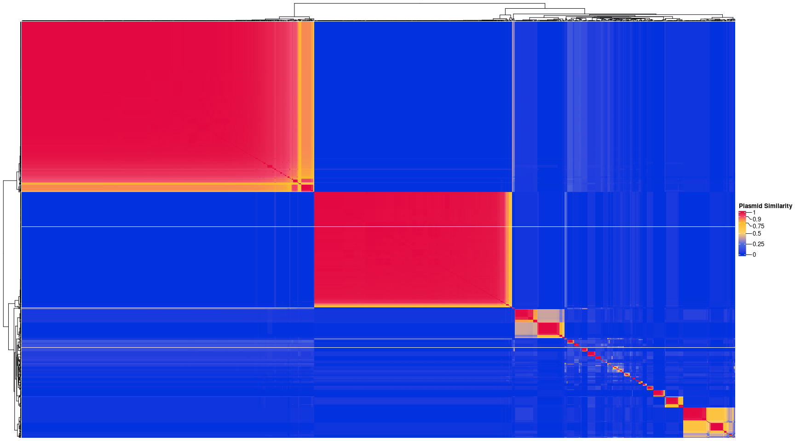<!-- -->


## Cumulative plots {.tabset}

### Histogram1

#### Plasmid Similarity histogram (Bin size 0.02)


```r
# plasmid_similarity_df %>% 
#   ggplot(aes(x=Plasmid_similarity)) +
#   geom_histogram(binwidth=0.02,color="black",fill = "#4dbfbc") +
#   scale_x_continuous(breaks = seq(0, 20, 1)) +
#   stat_bin(binwidth=0.02, geom="text", aes(label=..count..), vjust=-1.5)+
#   labs(x = "Plasmid Similarity (Jaccard)", y = "Plasmid Pair Counts") +
#   ggtitle("Histogram of Plasmid Similarity (Bin size 0.02)") +
#   theme_classic()

#NOTE: The above geom_histogram did not give me expected counts. So, I calculated ranges first and then tabled and then made the dataframe which was then supplied to ggplot to draw a plot

stack(table(cut(plasmid_similarity_df$Plasmid_similarity,breaks=seq.int(from=0,to=1,by=0.02)))) %>% 
  as.data.frame() %>% 
  rename(PlasmidPairCount=values, Range=ind) %>% 
  ggplot(aes(x=Range,y=PlasmidPairCount, label = PlasmidPairCount)) + 
  geom_col(color="black",fill = "#4dbfbc",position = "dodge") +
   geom_text(position = position_dodge(width = 1), hjust = -0.1) +
  labs(x = "Plasmid Similarity (Jaccard)", y = "Plasmid Pair Counts") +
  ggtitle("Histogram of Plasmid Similarity (Bin size 0.02)") +
  theme_classic() +
    theme(axis.text.y=element_text(size=10,  vjust = 0, hjust = 1),
        axis.text.x=element_text(size=10, angle=90, vjust = 0, hjust = 1.2),
        axis.line=element_blank(),
        axis.ticks=element_blank(),
        legend.position="top") +
  coord_flip()
```

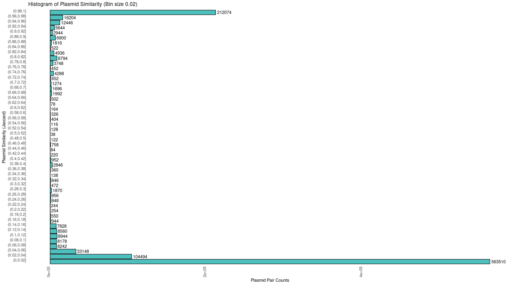<!-- -->

### Histogram2

#### Plasmid Similarity histogram (Bin size 0.05)


```r
# plasmid_similarity_df %>% 
#   ggplot(aes(x=Plasmid_similarity)) +
#   geom_histogram(binwidth=0.05,color="black",fill = "#4dbfbc") +
#   #scale_x_continuous(breaks = seq(0, 20, 1), limits = c(0, 1)) + 
#   stat_bin(binwidth=0.05, geom="text", aes(label=..count..), vjust=-1.5)+
#   labs(x = "Plasmid Similarity (Jaccard)", y = "Plasmid Pair Counts") +
#   ggtitle("Histogram of Plasmid Similarity (Bin size 0.05)") +
#   theme_classic()
# 
# plasmid_similarity_df %>% 
#   ggplot(aes(x=Plasmid_similarity)) +
# geom_histogram(
#   color="black",fill = "#4dbfbc",
#     breaks = seq(0, 1, by = 0.05), 
#     aes(fill = ..count..), position = "identity") + 
#   #scale_y_log10() +
#     scale_x_continuous(breaks = seq(0, 1, by=0.05)) +
#   stat_bin(binwidth=0.05, geom="text", aes(label=..count..), vjust=-1.5, hjust=-0.2)+
#     labs(x = "Plasmid Similarity (Jaccard)", y = "Plasmid Pair Counts") +
#   ggtitle("Histogram of Plasmid Similarity (Bin size 0.05)") +
#   theme_classic()
# 
# plasmid_similarity_df %>% 
#   ggplot(aes(x=Plasmid_similarity)) +
#     stat_bin(binwidth=0.02) +  
#     stat_bin(binwidth=0.02, geom="text", aes(label=..count..), vjust=-1.5) +
#   scale_x_continuous(breaks = seq(0, 1, by=0.02)) 

stack(table(cut(plasmid_similarity_df$Plasmid_similarity,breaks=seq.int(from=0,to=1,by=0.05)))) %>% 
  as.data.frame() %>% 
  rename(PlasmidPairCount=values, Range=ind) %>% 
  ggplot(aes(x=Range,y=PlasmidPairCount, label = PlasmidPairCount)) + 
  geom_col(color="black",fill = "#4dbfbc",position = "dodge") +
   geom_text(position = position_dodge(width = 1), hjust = -0.1) +
  labs(x = "Plasmid Similarity (Jaccard)", y = "Plasmid Pair Counts") +
  ggtitle("Histogram of Plasmid Similarity (Bin size 0.05)") +
  theme_classic() +
    theme(axis.text.y=element_text(size=10,  vjust = 0, hjust = 1),
        axis.text.x=element_text(size=10, angle=90, vjust = 0, hjust = 1.2),
        axis.line=element_blank(),
        axis.ticks=element_blank(),
        legend.position="top") +
  coord_flip()
```

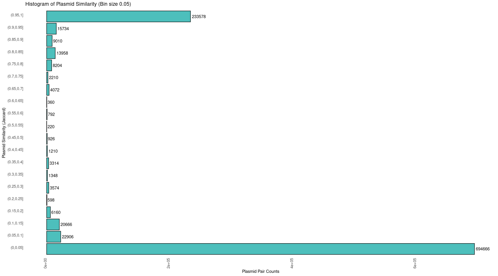<!-- -->

### Full

#### Cumulative frequency plot


```r
plasmid_similarity_df %>% 
  count(Plasmid_similarity) %>% 
  mutate(cumsum_n = cumsum(n)) %>% 
  ggplot(aes(x=Plasmid_similarity, y=cumsum_n)) +
  geom_point(color="red", size=0.1) +
  theme_classic()
```

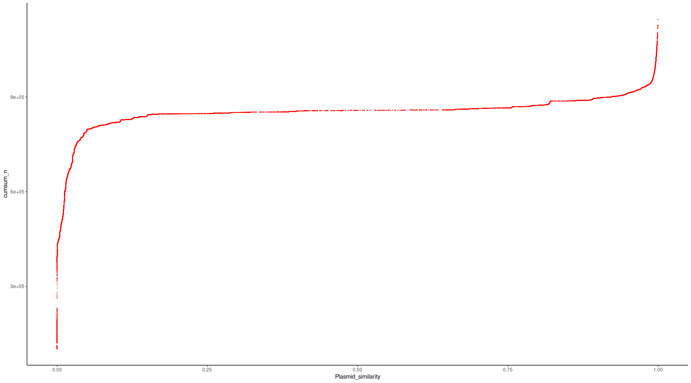<!-- -->


### Cutoff 0.97
#### Cumulative frequency plot at plasmid similarity 0.97 cutoff


```r
# Cumulative frequency plot from 0.9
plasmid_similarity_df %>% 
  count(Plasmid_similarity) %>% 
  mutate(cumsum_n = cumsum(n)) %>%
  filter(Plasmid_similarity>=0.97) %>% 
  ggplot(aes(x=Plasmid_similarity, y=cumsum_n)) +
  geom_point(color="red", size=0.1) +
  theme_classic()
```

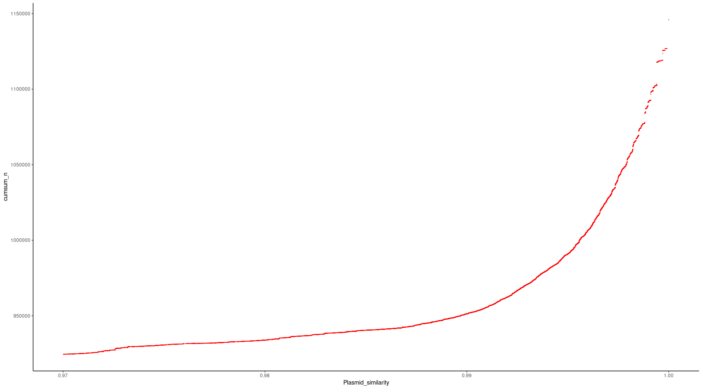<!-- -->

### Cutoff 0.9
#### Cumulative frequency plot at plasmid similarity 0.9 cutoff


```r
# Cumulative frequency plot from 0.9
plasmid_similarity_df %>% 
  count(Plasmid_similarity) %>% 
  mutate(cumsum_n = cumsum(n)) %>%
  filter(Plasmid_similarity>=0.9) %>% 
  ggplot(aes(x=Plasmid_similarity, y=cumsum_n)) +
  geom_point(color="red", size=0.1) +
  theme_classic()
```

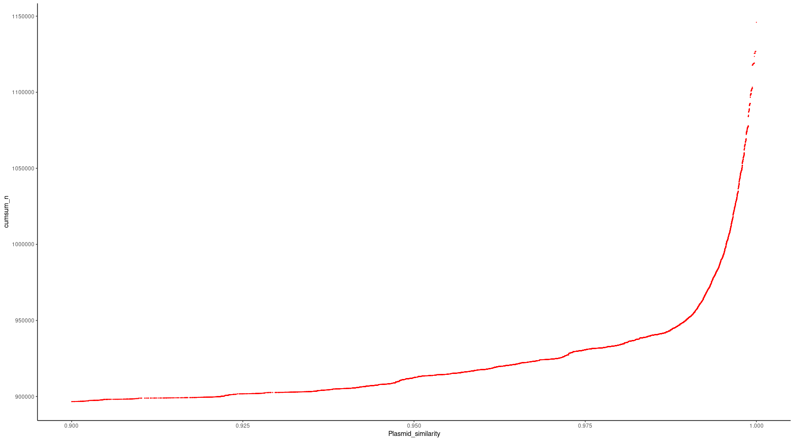<!-- -->

### Cutoff 0.8
#### Cumulative frequency plot at plasmid similarity 0.9 cutoff


```r
# Cumulative frequency plot from 0.9
plasmid_similarity_df %>% 
  count(Plasmid_similarity) %>% 
  mutate(cumsum_n = cumsum(n)) %>%
  filter(Plasmid_similarity>=0.8) %>% 
  ggplot(aes(x=Plasmid_similarity, y=cumsum_n)) +
  geom_point(color="red", size=0.1) +
  theme_classic()
```

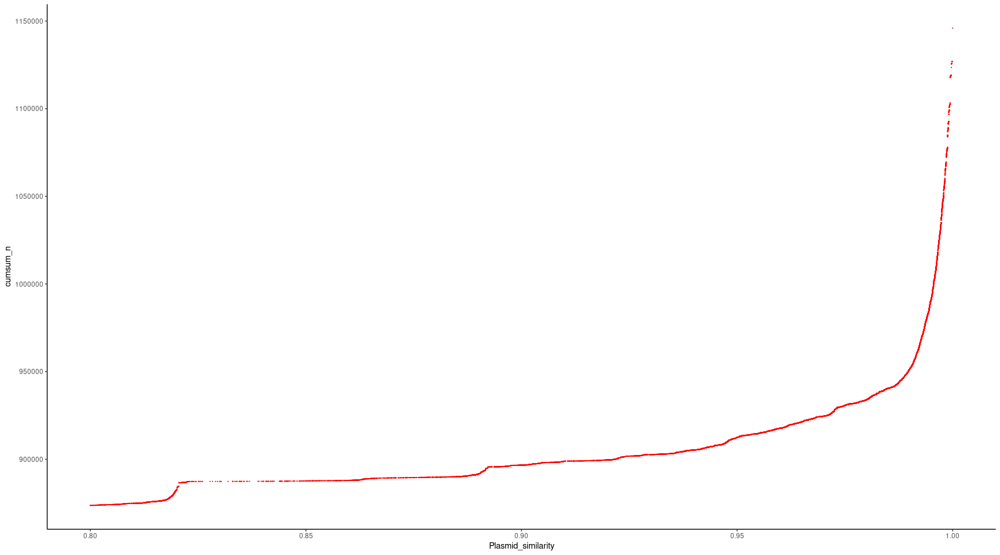<!-- -->


```r
#summary(plasmid_similarity_df)

for(sim_cutoff in seq(0.80, 1, by = 0.01)) {

Plaus_ClustrPairs <- plasmid_similarity_df %>% 
  filter(Plasmid_similarity >= sim_cutoff) %>% 
  select(Plasmid1,Plasmid2)
  nrow(Plaus_ClustrPairs)

 
  g1 <- graph.data.frame(Plaus_ClustrPairs, directed = FALSE)
  g1
  #plot(g1)
  
  #Fancy figure start
  #n = 100
  #p = 1.5/n
  #g = erdos.renyi.game(n, p)
  #coords = layout.fruchterman.reingold(g)
  #plot(g1, layout=coords, vertex.size = 3, vertex.label=NA)
  #plot(g1, vertex.label=NA, vertex.size=2, vertex.color="#0CCF02")
  #Fancy figure end
  
  
  # To generate Sample and their ClusterNumber
  cl1 <- clusters(g1)
  
  tbl1 <- cbind( V(g1)$name, cl1$membership )
  #class(tbl1)
  tbl1 <- as.data.frame(tbl1)
  colnames(tbl1) = c("sample", "Cluster")
  tbl1 <- tbl1 %>% arrange(as.numeric(Cluster)) 
  
  write.table(tbl1,file=paste0("Samples_ClusterNumber_sim_cutoff",sim_cutoff,".txt"),row.names=FALSE) # drops the rownames and write to text file
}  
```


```
awk '{print FILENAME "\t" $0}' Samples*.txt | sed -e 's/Samples_ClusterNumber_sim_cutoff//g' -e 's/.txt//g' | grep -v 'sample' | sed 's/"//g' | awk '{print $1 "\t" $2 "\t" $3}' >Combined_cutoff_0.8to1_sample_clusternumber.tab
```

## Plasmid and Cluster Count plots {.tabset}

### Table

#### Similarity Cutoff, Plasmid Counts and ClusterCounts for each cutoff


```r
cutoff_sample_clusternumber_df <- data.table::fread("Combined_cutoff_0.8to1_sample_clusternumber.tab", header= FALSE, sep = "\t")
#head(cutoff_sample_clusternumber_df)

colnames(cutoff_sample_clusternumber_df) <- c("Cutoff","Plasmid","ClusterNumber")

Cutoff_PlasmidCount <- cutoff_sample_clusternumber_df %>% 
  count(Cutoff) %>% 
  as.data.frame() %>% 
  rename(PlasmidCount=n) 

Cutoff_ClusterCount <-cutoff_sample_clusternumber_df %>% 
  group_by(Cutoff) %>% 
  summarise(max = max(ClusterNumber, na.rm=TRUE)) %>% 
  as.data.frame() %>% 
  rename(ClusterCount=max) 

Cutoff_PlasmidCount_ClusterCount <- left_join(Cutoff_PlasmidCount, Cutoff_ClusterCount, by="Cutoff")

Cutoff_PlasmidCount_ClusterCount %>% 
  kbl(caption = "Similarity Cutoff, Plasmid Counts and ClusterCounts for each cutoff") %>%
  kable_classic(full_width = F, html_font = "Cambria")
```

<table class=" lightable-classic" style="font-family: Cambria; width: auto !important; margin-left: auto; margin-right: auto;">
<caption>Similarity Cutoff, Plasmid Counts and ClusterCounts for each cutoff</caption>
 <thead>
  <tr>
   <th style="text-align:right;"> Cutoff </th>
   <th style="text-align:right;"> PlasmidCount </th>
   <th style="text-align:right;"> ClusterCount </th>
  </tr>
 </thead>
<tbody>
  <tr>
   <td style="text-align:right;"> 0.80 </td>
   <td style="text-align:right;"> 1010 </td>
   <td style="text-align:right;"> 40 </td>
  </tr>
  <tr>
   <td style="text-align:right;"> 0.81 </td>
   <td style="text-align:right;"> 1010 </td>
   <td style="text-align:right;"> 40 </td>
  </tr>
  <tr>
   <td style="text-align:right;"> 0.82 </td>
   <td style="text-align:right;"> 1009 </td>
   <td style="text-align:right;"> 40 </td>
  </tr>
  <tr>
   <td style="text-align:right;"> 0.83 </td>
   <td style="text-align:right;"> 1009 </td>
   <td style="text-align:right;"> 41 </td>
  </tr>
  <tr>
   <td style="text-align:right;"> 0.84 </td>
   <td style="text-align:right;"> 1009 </td>
   <td style="text-align:right;"> 41 </td>
  </tr>
  <tr>
   <td style="text-align:right;"> 0.85 </td>
   <td style="text-align:right;"> 1009 </td>
   <td style="text-align:right;"> 41 </td>
  </tr>
  <tr>
   <td style="text-align:right;"> 0.86 </td>
   <td style="text-align:right;"> 1006 </td>
   <td style="text-align:right;"> 40 </td>
  </tr>
  <tr>
   <td style="text-align:right;"> 0.87 </td>
   <td style="text-align:right;"> 1005 </td>
   <td style="text-align:right;"> 41 </td>
  </tr>
  <tr>
   <td style="text-align:right;"> 0.88 </td>
   <td style="text-align:right;"> 1005 </td>
   <td style="text-align:right;"> 42 </td>
  </tr>
  <tr>
   <td style="text-align:right;"> 0.89 </td>
   <td style="text-align:right;"> 1004 </td>
   <td style="text-align:right;"> 42 </td>
  </tr>
  <tr>
   <td style="text-align:right;"> 0.90 </td>
   <td style="text-align:right;"> 1001 </td>
   <td style="text-align:right;"> 43 </td>
  </tr>
  <tr>
   <td style="text-align:right;"> 0.91 </td>
   <td style="text-align:right;"> 999 </td>
   <td style="text-align:right;"> 43 </td>
  </tr>
  <tr>
   <td style="text-align:right;"> 0.92 </td>
   <td style="text-align:right;"> 997 </td>
   <td style="text-align:right;"> 45 </td>
  </tr>
  <tr>
   <td style="text-align:right;"> 0.93 </td>
   <td style="text-align:right;"> 995 </td>
   <td style="text-align:right;"> 44 </td>
  </tr>
  <tr>
   <td style="text-align:right;"> 0.94 </td>
   <td style="text-align:right;"> 990 </td>
   <td style="text-align:right;"> 46 </td>
  </tr>
  <tr>
   <td style="text-align:right;"> 0.95 </td>
   <td style="text-align:right;"> 977 </td>
   <td style="text-align:right;"> 47 </td>
  </tr>
  <tr>
   <td style="text-align:right;"> 0.96 </td>
   <td style="text-align:right;"> 962 </td>
   <td style="text-align:right;"> 45 </td>
  </tr>
  <tr>
   <td style="text-align:right;"> 0.97 </td>
   <td style="text-align:right;"> 955 </td>
   <td style="text-align:right;"> 50 </td>
  </tr>
  <tr>
   <td style="text-align:right;"> 0.98 </td>
   <td style="text-align:right;"> 949 </td>
   <td style="text-align:right;"> 52 </td>
  </tr>
  <tr>
   <td style="text-align:right;"> 0.99 </td>
   <td style="text-align:right;"> 931 </td>
   <td style="text-align:right;"> 58 </td>
  </tr>
  <tr>
   <td style="text-align:right;"> 1.00 </td>
   <td style="text-align:right;"> 468 </td>
   <td style="text-align:right;"> 74 </td>
  </tr>
</tbody>
</table>

### Plot1

#### Similarity Cutoff, Plasmid Counts and ClusterCounts for each cutoff


```r
Cutoff_PlasmidCount_ClusterCount %>% 
  ggplot(aes(PlasmidCount,ClusterCount), color=Cutoff) +
  geom_point(color="blue", size=1) +
    geom_label_repel(aes(label = Cutoff),
                  box.padding   = 0.35, 
                  point.padding = 0.5,
                  segment.color = 'grey50') +
  theme_classic()
```

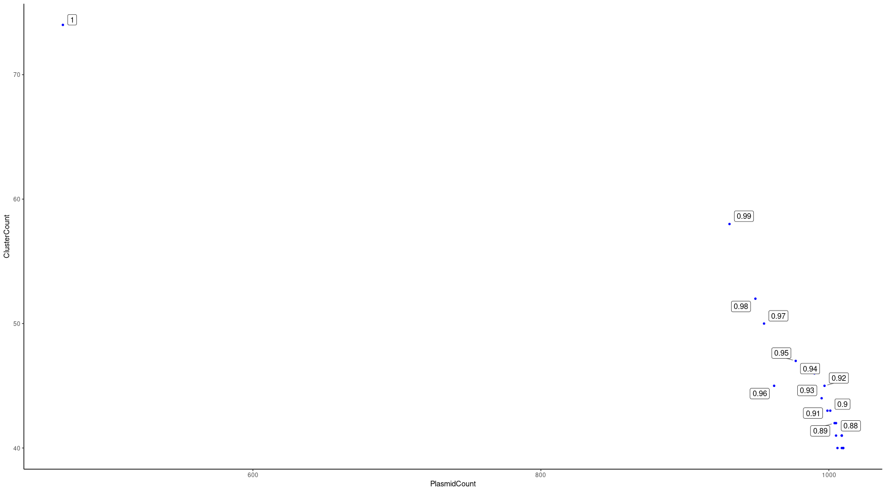<!-- -->

### Plot2

#### Similarity Cutoff, Plasmid Counts and ClusterCounts for each cutoff


```r
Cutoff_PlasmidCount_ClusterCount %>% 
  filter(Cutoff!=1) %>% 
  ggplot(aes(PlasmidCount,ClusterCount), color=Cutoff) +
  geom_point(color="blue", size=1) +
  scale_x_continuous(breaks=seq(920, 1020, 10)) +
    geom_label_repel(aes(label = Cutoff),
                  box.padding   = 0.35, 
                  point.padding = 0.5,
                  segment.color = 'grey50') +
  theme_classic()
```

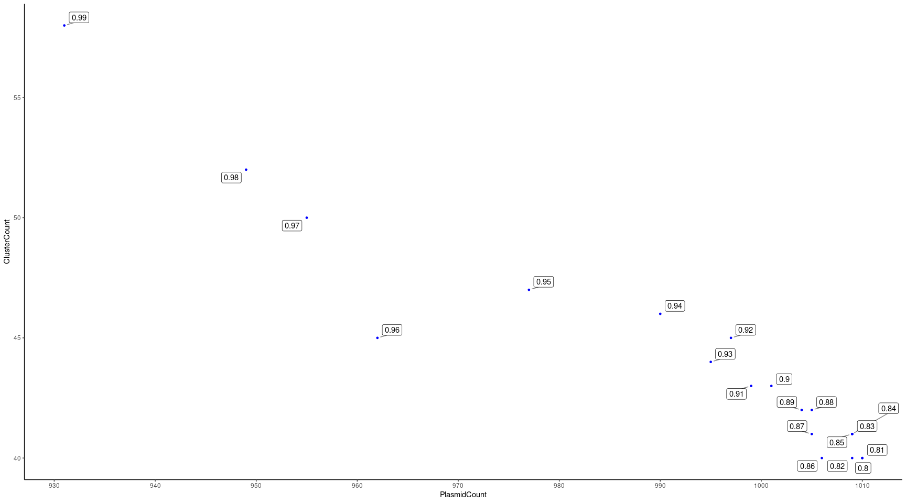<!-- -->


# Plasmid Clusters information table


```r
CP_Plasmids_meta_ClusterNumber_cutoff0.9_df <- data.table::fread("Closed_CP_Plasmids_metadata_07102022.tab", header= TRUE, sep = "\t")
#head(CP_Plasmids_meta_ClusterNumber_cutoff0.9_df)

Clusters_info_df <- CP_Plasmids_meta_ClusterNumber_cutoff0.9_df %>% 
  select(ClusterNumber_based_on_0.9_cutoff, Inc_group_regrouped, Relaxase_type_corrected, Length,ENT_ID,PID) %>% 
  group_by(ClusterNumber_based_on_0.9_cutoff) %>% 
  summarise(Inc_group_regrouped_collapse=paste(unique(Inc_group_regrouped),collapse='#'),
            Relaxase_type_corrected_collapse=paste(unique(Relaxase_type_corrected),collapse='#'),
            IsolateCount=n(),
            PatientCount = n_distinct(PID),
            PlasmidLength_Min = min(Length),
            PlasmidLength_Max = max(Length),
            ) %>% 
  rename(ClusterNum=ClusterNumber_based_on_0.9_cutoff,
         Inc_Group=Inc_group_regrouped_collapse,
         Relaxase=Relaxase_type_corrected_collapse) 

Clusters_info_df %>% 
  kbl(caption = "Plasmid Clusters information table") %>% 
  kable_classic(full_width = F, html_font = "Cambria") %>% 
  column_spec(1, width = "1px")
```

<table class=" lightable-classic" style="font-family: Cambria; width: auto !important; margin-left: auto; margin-right: auto;">
<caption>Plasmid Clusters information table</caption>
 <thead>
  <tr>
   <th style="text-align:left;"> ClusterNum </th>
   <th style="text-align:left;"> Inc_Group </th>
   <th style="text-align:left;"> Relaxase </th>
   <th style="text-align:right;"> IsolateCount </th>
   <th style="text-align:right;"> PatientCount </th>
   <th style="text-align:right;"> PlasmidLength_Min </th>
   <th style="text-align:right;"> PlasmidLength_Max </th>
  </tr>
 </thead>
<tbody>
  <tr>
   <td style="text-align:left;width: 1px; "> 1 </td>
   <td style="text-align:left;"> IncU </td>
   <td style="text-align:left;"> - </td>
   <td style="text-align:right;"> 7 </td>
   <td style="text-align:right;"> 7 </td>
   <td style="text-align:right;"> 7580 </td>
   <td style="text-align:right;"> 7580 </td>
  </tr>
  <tr>
   <td style="text-align:left;width: 1px; "> 10 </td>
   <td style="text-align:left;"> IncH </td>
   <td style="text-align:left;"> MOBH </td>
   <td style="text-align:right;"> 3 </td>
   <td style="text-align:right;"> 3 </td>
   <td style="text-align:right;"> 306281 </td>
   <td style="text-align:right;"> 315533 </td>
  </tr>
  <tr>
   <td style="text-align:left;width: 1px; "> 11 </td>
   <td style="text-align:left;"> IncR </td>
   <td style="text-align:left;"> - </td>
   <td style="text-align:right;"> 12 </td>
   <td style="text-align:right;"> 10 </td>
   <td style="text-align:right;"> 74789 </td>
   <td style="text-align:right;"> 78200 </td>
  </tr>
  <tr>
   <td style="text-align:left;width: 1px; "> 12 </td>
   <td style="text-align:left;"> IncN </td>
   <td style="text-align:left;"> MOBF </td>
   <td style="text-align:right;"> 2 </td>
   <td style="text-align:right;"> 1 </td>
   <td style="text-align:right;"> 59471 </td>
   <td style="text-align:right;"> 59567 </td>
  </tr>
  <tr>
   <td style="text-align:left;width: 1px; "> 13 </td>
   <td style="text-align:left;"> IncF </td>
   <td style="text-align:left;"> MOBP </td>
   <td style="text-align:right;"> 4 </td>
   <td style="text-align:right;"> 4 </td>
   <td style="text-align:right;"> 135212 </td>
   <td style="text-align:right;"> 135220 </td>
  </tr>
  <tr>
   <td style="text-align:left;width: 1px; "> 14 </td>
   <td style="text-align:left;"> IncL/M </td>
   <td style="text-align:left;"> MOBP </td>
   <td style="text-align:right;"> 4 </td>
   <td style="text-align:right;"> 3 </td>
   <td style="text-align:right;"> 67445 </td>
   <td style="text-align:right;"> 71114 </td>
  </tr>
  <tr>
   <td style="text-align:left;width: 1px; "> 15 </td>
   <td style="text-align:left;"> IncF </td>
   <td style="text-align:left;"> MOBF </td>
   <td style="text-align:right;"> 4 </td>
   <td style="text-align:right;"> 4 </td>
   <td style="text-align:right;"> 173234 </td>
   <td style="text-align:right;"> 180817 </td>
  </tr>
  <tr>
   <td style="text-align:left;width: 1px; "> 16 </td>
   <td style="text-align:left;"> IncA/C2 </td>
   <td style="text-align:left;"> MOBH,MOBH </td>
   <td style="text-align:right;"> 34 </td>
   <td style="text-align:right;"> 27 </td>
   <td style="text-align:right;"> 174317 </td>
   <td style="text-align:right;"> 176865 </td>
  </tr>
  <tr>
   <td style="text-align:left;width: 1px; "> 17 </td>
   <td style="text-align:left;"> IncN </td>
   <td style="text-align:left;"> MOBF </td>
   <td style="text-align:right;"> 4 </td>
   <td style="text-align:right;"> 4 </td>
   <td style="text-align:right;"> 49992 </td>
   <td style="text-align:right;"> 50752 </td>
  </tr>
  <tr>
   <td style="text-align:left;width: 1px; "> 18 </td>
   <td style="text-align:left;"> IncH </td>
   <td style="text-align:left;"> MOBH </td>
   <td style="text-align:right;"> 3 </td>
   <td style="text-align:right;"> 3 </td>
   <td style="text-align:right;"> 310749 </td>
   <td style="text-align:right;"> 312015 </td>
  </tr>
  <tr>
   <td style="text-align:left;width: 1px; "> 19 </td>
   <td style="text-align:left;"> IncL/M </td>
   <td style="text-align:left;"> MOBP </td>
   <td style="text-align:right;"> 33 </td>
   <td style="text-align:right;"> 23 </td>
   <td style="text-align:right;"> 63589 </td>
   <td style="text-align:right;"> 69945 </td>
  </tr>
  <tr>
   <td style="text-align:left;width: 1px; "> 2 </td>
   <td style="text-align:left;"> IncU#ColRNAI_all </td>
   <td style="text-align:left;"> MOBP </td>
   <td style="text-align:right;"> 405 </td>
   <td style="text-align:right;"> 203 </td>
   <td style="text-align:right;"> 67304 </td>
   <td style="text-align:right;"> 80977 </td>
  </tr>
  <tr>
   <td style="text-align:left;width: 1px; "> 20 </td>
   <td style="text-align:left;"> IncF </td>
   <td style="text-align:left;"> MOBC </td>
   <td style="text-align:right;"> 3 </td>
   <td style="text-align:right;"> 2 </td>
   <td style="text-align:right;"> 108331 </td>
   <td style="text-align:right;"> 108331 </td>
  </tr>
  <tr>
   <td style="text-align:left;width: 1px; "> 21 </td>
   <td style="text-align:left;"> IncA/C2_IncF </td>
   <td style="text-align:left;"> MOBH,MOBH </td>
   <td style="text-align:right;"> 4 </td>
   <td style="text-align:right;"> 1 </td>
   <td style="text-align:right;"> 173887 </td>
   <td style="text-align:right;"> 173888 </td>
  </tr>
  <tr>
   <td style="text-align:left;width: 1px; "> 22 </td>
   <td style="text-align:left;"> IncH </td>
   <td style="text-align:left;"> MOBH </td>
   <td style="text-align:right;"> 2 </td>
   <td style="text-align:right;"> 2 </td>
   <td style="text-align:right;"> 278408 </td>
   <td style="text-align:right;"> 291650 </td>
  </tr>
  <tr>
   <td style="text-align:left;width: 1px; "> 23 </td>
   <td style="text-align:left;"> IncA/C2 </td>
   <td style="text-align:left;"> MOBH,MOBH </td>
   <td style="text-align:right;"> 2 </td>
   <td style="text-align:right;"> 2 </td>
   <td style="text-align:right;"> 146179 </td>
   <td style="text-align:right;"> 149464 </td>
  </tr>
  <tr>
   <td style="text-align:left;width: 1px; "> 24 </td>
   <td style="text-align:left;"> IncX3 </td>
   <td style="text-align:left;"> MOBP </td>
   <td style="text-align:right;"> 7 </td>
   <td style="text-align:right;"> 6 </td>
   <td style="text-align:right;"> 51479 </td>
   <td style="text-align:right;"> 51503 </td>
  </tr>
  <tr>
   <td style="text-align:left;width: 1px; "> 25 </td>
   <td style="text-align:left;"> IncF </td>
   <td style="text-align:left;"> MOBF </td>
   <td style="text-align:right;"> 8 </td>
   <td style="text-align:right;"> 7 </td>
   <td style="text-align:right;"> 103933 </td>
   <td style="text-align:right;"> 112627 </td>
  </tr>
  <tr>
   <td style="text-align:left;width: 1px; "> 26 </td>
   <td style="text-align:left;"> rep_cluster_1195 </td>
   <td style="text-align:left;"> MOBP </td>
   <td style="text-align:right;"> 15 </td>
   <td style="text-align:right;"> 11 </td>
   <td style="text-align:right;"> 6139 </td>
   <td style="text-align:right;"> 12279 </td>
  </tr>
  <tr>
   <td style="text-align:left;width: 1px; "> 27 </td>
   <td style="text-align:left;"> IncF </td>
   <td style="text-align:left;"> MOBF </td>
   <td style="text-align:right;"> 2 </td>
   <td style="text-align:right;"> 2 </td>
   <td style="text-align:right;"> 152661 </td>
   <td style="text-align:right;"> 161498 </td>
  </tr>
  <tr>
   <td style="text-align:left;width: 1px; "> 28 </td>
   <td style="text-align:left;"> IncF </td>
   <td style="text-align:left;"> MOBF </td>
   <td style="text-align:right;"> 3 </td>
   <td style="text-align:right;"> 3 </td>
   <td style="text-align:right;"> 118971 </td>
   <td style="text-align:right;"> 122714 </td>
  </tr>
  <tr>
   <td style="text-align:left;width: 1px; "> 29 </td>
   <td style="text-align:left;"> IncF </td>
   <td style="text-align:left;"> MOBF </td>
   <td style="text-align:right;"> 2 </td>
   <td style="text-align:right;"> 2 </td>
   <td style="text-align:right;"> 113639 </td>
   <td style="text-align:right;"> 113641 </td>
  </tr>
  <tr>
   <td style="text-align:left;width: 1px; "> 3 </td>
   <td style="text-align:left;"> IncU </td>
   <td style="text-align:left;"> - </td>
   <td style="text-align:right;"> 2 </td>
   <td style="text-align:right;"> 1 </td>
   <td style="text-align:right;"> 21549 </td>
   <td style="text-align:right;"> 21549 </td>
  </tr>
  <tr>
   <td style="text-align:left;width: 1px; "> 30 </td>
   <td style="text-align:left;"> ColRNAI_all </td>
   <td style="text-align:left;"> MOBF,MOBP </td>
   <td style="text-align:right;"> 2 </td>
   <td style="text-align:right;"> 1 </td>
   <td style="text-align:right;"> 142050 </td>
   <td style="text-align:right;"> 142353 </td>
  </tr>
  <tr>
   <td style="text-align:left;width: 1px; "> 31 </td>
   <td style="text-align:left;"> IncA/C2 </td>
   <td style="text-align:left;"> MOBH,MOBH </td>
   <td style="text-align:right;"> 4 </td>
   <td style="text-align:right;"> 4 </td>
   <td style="text-align:right;"> 160819 </td>
   <td style="text-align:right;"> 164596 </td>
  </tr>
  <tr>
   <td style="text-align:left;width: 1px; "> 32 </td>
   <td style="text-align:left;"> IncU </td>
   <td style="text-align:left;"> MOBP </td>
   <td style="text-align:right;"> 25 </td>
   <td style="text-align:right;"> 16 </td>
   <td style="text-align:right;"> 78125 </td>
   <td style="text-align:right;"> 99518 </td>
  </tr>
  <tr>
   <td style="text-align:left;width: 1px; "> 33 </td>
   <td style="text-align:left;"> IncF_combinations </td>
   <td style="text-align:left;"> MOBF </td>
   <td style="text-align:right;"> 2 </td>
   <td style="text-align:right;"> 1 </td>
   <td style="text-align:right;"> 128051 </td>
   <td style="text-align:right;"> 128105 </td>
  </tr>
  <tr>
   <td style="text-align:left;width: 1px; "> 34 </td>
   <td style="text-align:left;"> IncF_IncU_IncX </td>
   <td style="text-align:left;"> MOBF,MOBF </td>
   <td style="text-align:right;"> 7 </td>
   <td style="text-align:right;"> 5 </td>
   <td style="text-align:right;"> 121423 </td>
   <td style="text-align:right;"> 123974 </td>
  </tr>
  <tr>
   <td style="text-align:left;width: 1px; "> 35 </td>
   <td style="text-align:left;"> IncN_IncU </td>
   <td style="text-align:left;"> MOBF </td>
   <td style="text-align:right;"> 8 </td>
   <td style="text-align:right;"> 6 </td>
   <td style="text-align:right;"> 70461 </td>
   <td style="text-align:right;"> 76006 </td>
  </tr>
  <tr>
   <td style="text-align:left;width: 1px; "> 36 </td>
   <td style="text-align:left;"> IncF_combinations </td>
   <td style="text-align:left;"> MOBF </td>
   <td style="text-align:right;"> 8 </td>
   <td style="text-align:right;"> 5 </td>
   <td style="text-align:right;"> 111676 </td>
   <td style="text-align:right;"> 112911 </td>
  </tr>
  <tr>
   <td style="text-align:left;width: 1px; "> 37 </td>
   <td style="text-align:left;"> IncL/M </td>
   <td style="text-align:left;"> - </td>
   <td style="text-align:right;"> 4 </td>
   <td style="text-align:right;"> 4 </td>
   <td style="text-align:right;"> 50138 </td>
   <td style="text-align:right;"> 50138 </td>
  </tr>
  <tr>
   <td style="text-align:left;width: 1px; "> 38 </td>
   <td style="text-align:left;"> IncF_combinations </td>
   <td style="text-align:left;"> MOBF </td>
   <td style="text-align:right;"> 2 </td>
   <td style="text-align:right;"> 2 </td>
   <td style="text-align:right;"> 177751 </td>
   <td style="text-align:right;"> 198148 </td>
  </tr>
  <tr>
   <td style="text-align:left;width: 1px; "> 39 </td>
   <td style="text-align:left;"> IncA/C2 </td>
   <td style="text-align:left;"> - </td>
   <td style="text-align:right;"> 2 </td>
   <td style="text-align:right;"> 1 </td>
   <td style="text-align:right;"> 88057 </td>
   <td style="text-align:right;"> 88057 </td>
  </tr>
  <tr>
   <td style="text-align:left;width: 1px; "> 4 </td>
   <td style="text-align:left;"> IncF_combinations </td>
   <td style="text-align:left;"> MOBF </td>
   <td style="text-align:right;"> 2 </td>
   <td style="text-align:right;"> 2 </td>
   <td style="text-align:right;"> 105819 </td>
   <td style="text-align:right;"> 105819 </td>
  </tr>
  <tr>
   <td style="text-align:left;width: 1px; "> 40 </td>
   <td style="text-align:left;"> IncN_IncU_IncX </td>
   <td style="text-align:left;"> MOBP </td>
   <td style="text-align:right;"> 3 </td>
   <td style="text-align:right;"> 1 </td>
   <td style="text-align:right;"> 97507 </td>
   <td style="text-align:right;"> 97513 </td>
  </tr>
  <tr>
   <td style="text-align:left;width: 1px; "> 41 </td>
   <td style="text-align:left;"> IncF </td>
   <td style="text-align:left;"> MOBF </td>
   <td style="text-align:right;"> 2 </td>
   <td style="text-align:right;"> 2 </td>
   <td style="text-align:right;"> 30320 </td>
   <td style="text-align:right;"> 60013 </td>
  </tr>
  <tr>
   <td style="text-align:left;width: 1px; "> 42 </td>
   <td style="text-align:left;"> IncF </td>
   <td style="text-align:left;"> MOBF </td>
   <td style="text-align:right;"> 4 </td>
   <td style="text-align:right;"> 3 </td>
   <td style="text-align:right;"> 63637 </td>
   <td style="text-align:right;"> 93113 </td>
  </tr>
  <tr>
   <td style="text-align:left;width: 1px; "> 43 </td>
   <td style="text-align:left;"> IncH </td>
   <td style="text-align:left;"> MOBH </td>
   <td style="text-align:right;"> 4 </td>
   <td style="text-align:right;"> 3 </td>
   <td style="text-align:right;"> 266420 </td>
   <td style="text-align:right;"> 300349 </td>
  </tr>
  <tr>
   <td style="text-align:left;width: 1px; "> 5 </td>
   <td style="text-align:left;"> IncL/M </td>
   <td style="text-align:left;"> MOBP </td>
   <td style="text-align:right;"> 28 </td>
   <td style="text-align:right;"> 21 </td>
   <td style="text-align:right;"> 82120 </td>
   <td style="text-align:right;"> 91643 </td>
  </tr>
  <tr>
   <td style="text-align:left;width: 1px; "> 6 </td>
   <td style="text-align:left;"> IncN </td>
   <td style="text-align:left;"> MOBF </td>
   <td style="text-align:right;"> 286 </td>
   <td style="text-align:right;"> 211 </td>
   <td style="text-align:right;"> 38383 </td>
   <td style="text-align:right;"> 45284 </td>
  </tr>
  <tr>
   <td style="text-align:left;width: 1px; "> 7 </td>
   <td style="text-align:left;"> IncL/M </td>
   <td style="text-align:left;"> MOBP </td>
   <td style="text-align:right;"> 6 </td>
   <td style="text-align:right;"> 6 </td>
   <td style="text-align:right;"> 82759 </td>
   <td style="text-align:right;"> 91289 </td>
  </tr>
  <tr>
   <td style="text-align:left;width: 1px; "> 8 </td>
   <td style="text-align:left;"> IncA/C2 </td>
   <td style="text-align:left;"> MOBH,MOBH </td>
   <td style="text-align:right;"> 19 </td>
   <td style="text-align:right;"> 12 </td>
   <td style="text-align:right;"> 117950 </td>
   <td style="text-align:right;"> 127481 </td>
  </tr>
  <tr>
   <td style="text-align:left;width: 1px; "> 9 </td>
   <td style="text-align:left;"> IncX3 </td>
   <td style="text-align:left;"> MOBP </td>
   <td style="text-align:right;"> 18 </td>
   <td style="text-align:right;"> 16 </td>
   <td style="text-align:right;"> 45048 </td>
   <td style="text-align:right;"> 46161 </td>
  </tr>
  <tr>
   <td style="text-align:left;width: 1px; "> Singleton </td>
   <td style="text-align:left;"> IncF_IncU#IncF#IncX3#IncA/C2_IncF#IncH#IncA/C2#rep_cluster_1195#IncF_combinations#IncN#ColRNAI_all#IncN_IncU#IncU_IncX#IncU#IncA/C2_IncN#IncN_IncU_IncX#IncI_IncU#IncR </td>
   <td style="text-align:left;"> MOBF#-#MOBF,MOBH,MOBH#MOBH,MOBH#MOBH#MOBP#MOBF,MOBF#MOBP,MOBP#MOBF,MOBH#MOBC </td>
   <td style="text-align:right;"> 70 </td>
   <td style="text-align:right;"> 62 </td>
   <td style="text-align:right;"> 6494 </td>
   <td style="text-align:right;"> 476834 </td>
  </tr>
</tbody>
</table>

```r
#write.table(Clusters_info_df,file="Clusters_info_datatable.txt",sep = "\t", row.names=FALSE) # drops the rownames and write to text file
```


# Plasmid persistence

We are trying to check how the plasmid is persistent across the year whereas the clonal cluster outbreaks are sporadic and short-lived.


```r
library(lubridate)
library(ggplot2)
library(forcats)
library(glue)

Phylodynamics_staticplot <- function(plot_title,clusterNum){
  #View(meta)
  # Subsetting to a smaller set for ease of simplicity - selecting OXA-48 Plasmids records with n=41 rows
 subset_clusterNum <- Closed_CP_Plasmids_metadata_df %>% 
  filter(ClusterNumber_based_on_0.9_cutoff==clusterNum) %>%  # Although the variable number
  mutate(Unique_Plasmid_Cluster = if_else(is.na(Clonal_cluster),paste0("Singleton_", row_number()), as.character(Clonal_cluster))) %>%  # assign unique id for NA values
    group_by(Unique_Plasmid_Cluster) %>% 
    mutate(group_id = cur_group_id())
  
subset_clusterNum$Date_of_culture <- as.Date(subset_clusterNum$Date_of_culture, format = "%d/%m/%Y")
  
#View(subset_clusterNum)
  
pd1 <- subset_clusterNum %>%
  ungroup() %>% 
  mutate(Unique_Plasmid_Cluster = forcats::fct_reorder(Unique_Plasmid_Cluster, Date_of_culture, min)) %>%
  ggplot(aes(Date_of_culture, Unique_Plasmid_Cluster,color = Lab_Species, shape= factor(Hospital))) +
  geom_line(aes(group=Unique_Plasmid_Cluster), color='black') +
  geom_point(size=3) +
  ggtitle(plot_title) +
  ylab("Cluster") + xlab("Date") +
  theme_bw() +
  theme(
    panel.grid.major = element_blank(),
    legend.position = "right",
    legend.key=element_rect(fill='gray96'),
    legend.title =element_text(size=10),
    text=element_text(size=12),
    axis.title.x = element_text(vjust = 0, size = 11),
    axis.title.y = element_text(vjust = 2, size = 11),
    axis.text.x = element_text(angle = 90, hjust = 1, size = 9),
    panel.grid.major.x = element_blank(),
    panel.grid.minor.x = element_blank())
pd1

}

Phylodynamics_dynamicplot <- function(plot_title,clusterNum){
    #View(meta)
  # Subsetting to a smaller set for ease of simplicity - selecting OXA-48 Plasmids records with n=41 rows
 subset_clusterNum <- Closed_CP_Plasmids_metadata_df %>% 
  filter(ClusterNumber_based_on_0.9_cutoff==clusterNum) %>%  # Although the variable number
  mutate(Unique_Plasmid_Cluster = if_else(is.na(Clonal_cluster),paste0("Singleton_", row_number()), as.character(Clonal_cluster))) %>%  # assign unique id for NA values
    group_by(Unique_Plasmid_Cluster) %>% 
    mutate(group_id = cur_group_id())
  
subset_clusterNum$Date_of_culture <- as.Date(subset_clusterNum$Date_of_culture, format = "%d/%m/%Y")
  
#View(subset_clusterNum)
  
pd1 <- subset_clusterNum %>%
  ungroup() %>% 
  mutate(Unique_Plasmid_Cluster = forcats::fct_reorder(Unique_Plasmid_Cluster, Date_of_culture, min)) %>%
  ggplot(aes(Date_of_culture, Unique_Plasmid_Cluster,color = Lab_Species, shape= factor(Hospital))) +
  geom_line(aes(group=Unique_Plasmid_Cluster), color='black') +
  geom_point(size=3) +
  ggtitle(plot_title) +
  ylab("Cluster") + xlab("Date") +
  theme_bw() +
  theme(
    panel.grid.major = element_blank(),
    legend.position = "right",
    legend.key=element_rect(fill='gray96'),
    legend.title =element_text(size=10),
    text=element_text(size=12),
    axis.title.x = element_text(vjust = 0, size = 11),
    axis.title.y = element_text(vjust = 2, size = 11),
    axis.text.x = element_text(angle = 90, hjust = 1, size = 9),
    panel.grid.major.x = element_blank(),
    panel.grid.minor.x = element_blank())
#pd1

pd1_plotly <- plotly::ggplotly(pd1)
pd1_plotly
}
```

## Plasmid persistence plots (Static) {.tabset}

### blaNDM-1


```r
Phylodynamics_staticplot(plot_title="Phylodynamics of blaNDM-1 gene tranmission",clusterNum=6)
```

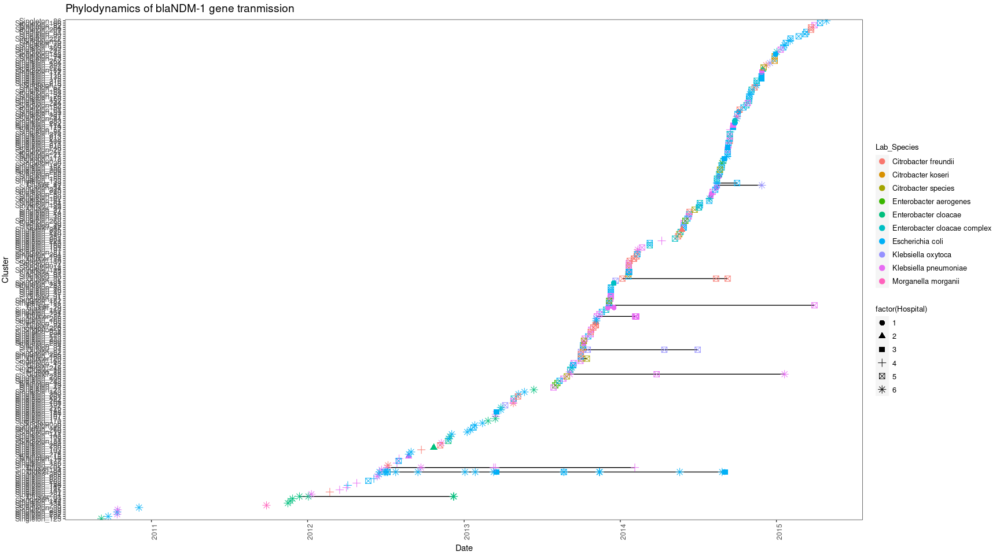<!-- -->

### blaKPC-2


```r
Phylodynamics_staticplot(plot_title="Phylodynamics of blaKPC-2 gene tranmission",clusterNum=2)
```

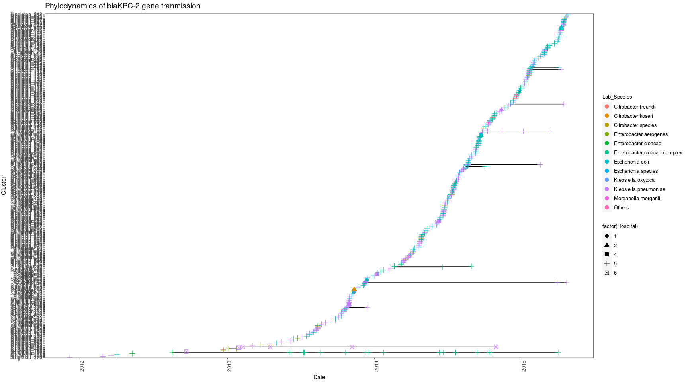<!-- -->

### blaOXA-181


```r
Phylodynamics_staticplot(plot_title="Phylodynamics of blaOXA-181 gene tranmission",clusterNum=16)
```

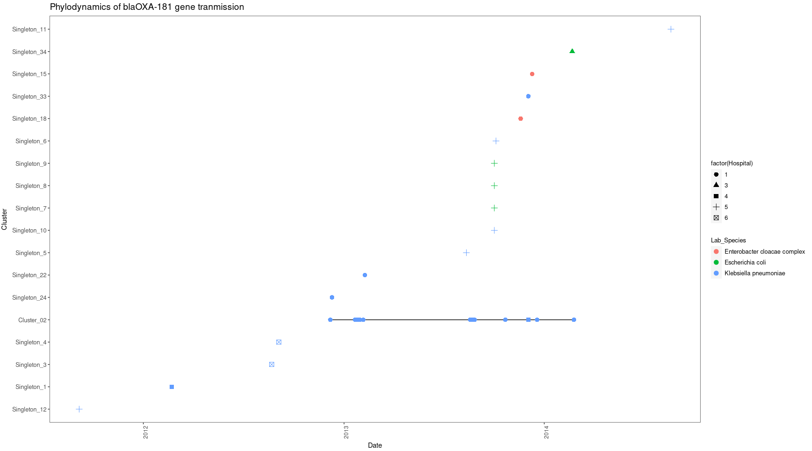<!-- -->

### blaOXA-48


```r
Phylodynamics_staticplot(plot_title="Phylodynamics of blaOXA-48 gene tranmission",clusterNum=19)
```

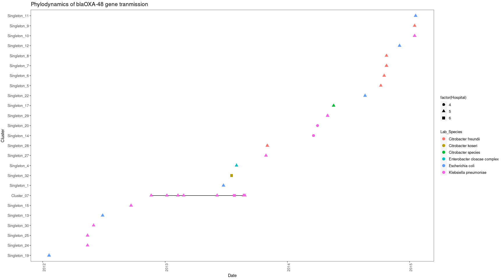<!-- -->

### blaNDM-1


```r
Phylodynamics_staticplot(plot_title="Phylodynamics of blaNDM-1 gene tranmission",clusterNum=5)
```

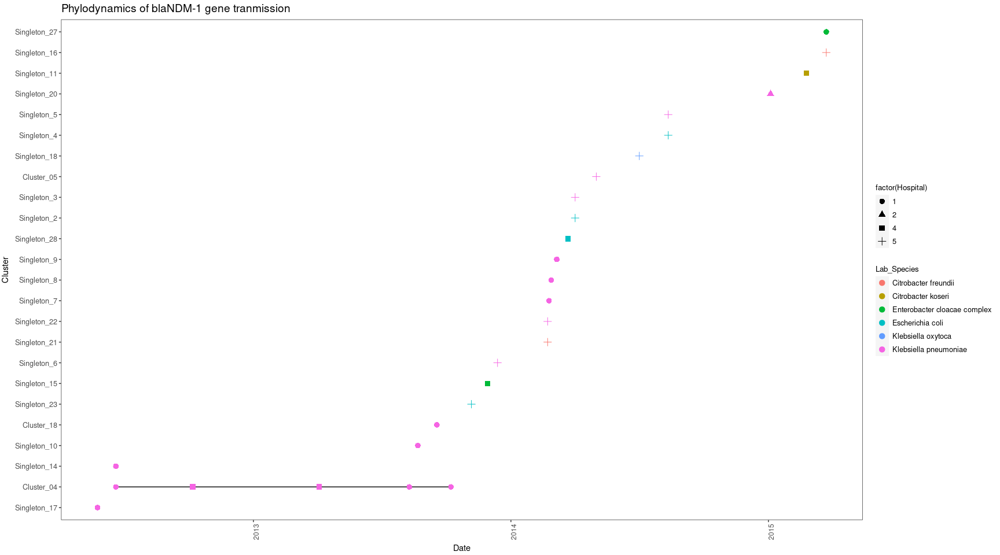<!-- -->

## Plasmid persistence plots (Dynamic) {.tabset}

### blaNDM-1


```r
Phylodynamics_dynamicplot(plot_title="Phylodynamics of blaNDM-1 gene tranmission",clusterNum=6)
```

```{=html}
<div id="htmlwidget-ead308266c717a5f6ca5" style="width:1728px;height:960px;" class="plotly html-widget"></div>
<script type="application/json" data-for="htmlwidget-ead308266c717a5f6ca5">{"x":{"data":[{"x":[15986,null,16014,null,16042,16056,null,16056,null,16283,null,16284,null,16296,null,16302,null,16339,null,16339,null,16348,null,16434],"y":[80,null,89,null,96,96,null,107,null,146,null,147,null,150,null,155,null,179,null,180,null,184,null,210],"text":["Date_of_culture: 2013-10-08<br />Unique_Plasmid_Cluster: Singleton_236<br />Lab_Species: black<br />factor(Hospital): 1<br />Unique_Plasmid_Cluster: Singleton_236",null,"Date_of_culture: 2013-11-05<br />Unique_Plasmid_Cluster: Singleton_95<br />Lab_Species: black<br />factor(Hospital): 1<br />Unique_Plasmid_Cluster: Singleton_95",null,"Date_of_culture: 2013-12-03<br />Unique_Plasmid_Cluster: Cluster_29<br />Lab_Species: black<br />factor(Hospital): 1<br />Unique_Plasmid_Cluster: Cluster_29","Date_of_culture: 2013-12-17<br />Unique_Plasmid_Cluster: Cluster_29<br />Lab_Species: black<br />factor(Hospital): 1<br />Unique_Plasmid_Cluster: Cluster_29",null,"Date_of_culture: 2013-12-17<br />Unique_Plasmid_Cluster: Singleton_131<br />Lab_Species: black<br />factor(Hospital): 1<br />Unique_Plasmid_Cluster: Singleton_131",null,"Date_of_culture: 2014-08-01<br />Unique_Plasmid_Cluster: Singleton_60<br />Lab_Species: black<br />factor(Hospital): 1<br />Unique_Plasmid_Cluster: Singleton_60",null,"Date_of_culture: 2014-08-02<br />Unique_Plasmid_Cluster: Singleton_53<br />Lab_Species: black<br />factor(Hospital): 1<br />Unique_Plasmid_Cluster: Singleton_53",null,"Date_of_culture: 2014-08-14<br />Unique_Plasmid_Cluster: Singleton_54<br />Lab_Species: black<br />factor(Hospital): 1<br />Unique_Plasmid_Cluster: Singleton_54",null,"Date_of_culture: 2014-08-20<br />Unique_Plasmid_Cluster: Singleton_55<br />Lab_Species: black<br />factor(Hospital): 1<br />Unique_Plasmid_Cluster: Singleton_55",null,"Date_of_culture: 2014-09-26<br />Unique_Plasmid_Cluster: Singleton_282<br />Lab_Species: black<br />factor(Hospital): 1<br />Unique_Plasmid_Cluster: Singleton_282",null,"Date_of_culture: 2014-09-26<br />Unique_Plasmid_Cluster: Singleton_283<br />Lab_Species: black<br />factor(Hospital): 1<br />Unique_Plasmid_Cluster: Singleton_283",null,"Date_of_culture: 2014-10-05<br />Unique_Plasmid_Cluster: Singleton_59<br />Lab_Species: black<br />factor(Hospital): 1<br />Unique_Plasmid_Cluster: Singleton_59",null,"Date_of_culture: 2014-12-30<br />Unique_Plasmid_Cluster: Singleton_183<br />Lab_Species: black<br />factor(Hospital): 1<br />Unique_Plasmid_Cluster: Singleton_183"],"type":"scatter","mode":"lines","line":{"width":1.88976377952756,"color":"rgba(0,0,0,1)","dash":"solid"},"hoveron":"points","name":"1","legendgroup":"1","showlegend":true,"xaxis":"x","yaxis":"y","hoverinfo":"text","frame":null},{"x":[15576,null,15635,null,16215,null,16404],"y":[29,null,33,null,131,null,203],"text":["Date_of_culture: 2012-08-24<br />Unique_Plasmid_Cluster: Singleton_15<br />Lab_Species: black<br />factor(Hospital): 2<br />Unique_Plasmid_Cluster: Singleton_15",null,"Date_of_culture: 2012-10-22<br />Unique_Plasmid_Cluster: Singleton_130<br />Lab_Species: black<br />factor(Hospital): 2<br />Unique_Plasmid_Cluster: Singleton_130",null,"Date_of_culture: 2014-05-25<br />Unique_Plasmid_Cluster: Singleton_265<br />Lab_Species: black<br />factor(Hospital): 2<br />Unique_Plasmid_Cluster: Singleton_265",null,"Date_of_culture: 2014-11-30<br />Unique_Plasmid_Cluster: Singleton_69<br />Lab_Species: black<br />factor(Hospital): 2<br />Unique_Plasmid_Cluster: Singleton_69"],"type":"scatter","mode":"lines","line":{"width":1.88976377952756,"color":"rgba(0,0,0,1)","dash":"solid"},"hoveron":"points","name":"(2,1)","legendgroup":"(2,1)","showlegend":true,"xaxis":"x","yaxis":"y","hoverinfo":"text","frame":null},{"x":[15782,16316,null,15782,null,16314,null,16322,null,16335,null,16335,null,16401,null,16402,null,16402],"y":[22,22,null,49,null,163,null,168,null,177,null,178,null,199,null,201,null,202],"text":["Date_of_culture: 2013-03-18<br />Unique_Plasmid_Cluster: Cluster_03<br />Lab_Species: black<br />factor(Hospital): 3<br />Unique_Plasmid_Cluster: Cluster_03","Date_of_culture: 2014-09-03<br />Unique_Plasmid_Cluster: Cluster_03<br />Lab_Species: black<br />factor(Hospital): 3<br />Unique_Plasmid_Cluster: Cluster_03",null,"Date_of_culture: 2013-03-18<br />Unique_Plasmid_Cluster: Singleton_188<br />Lab_Species: black<br />factor(Hospital): 3<br />Unique_Plasmid_Cluster: Singleton_188",null,"Date_of_culture: 2014-09-01<br />Unique_Plasmid_Cluster: Singleton_112<br />Lab_Species: black<br />factor(Hospital): 3<br />Unique_Plasmid_Cluster: Singleton_112",null,"Date_of_culture: 2014-09-09<br />Unique_Plasmid_Cluster: Singleton_246<br />Lab_Species: black<br />factor(Hospital): 3<br />Unique_Plasmid_Cluster: Singleton_246",null,"Date_of_culture: 2014-09-22<br />Unique_Plasmid_Cluster: Singleton_113<br />Lab_Species: black<br />factor(Hospital): 3<br />Unique_Plasmid_Cluster: Singleton_113",null,"Date_of_culture: 2014-09-22<br />Unique_Plasmid_Cluster: Singleton_114<br />Lab_Species: black<br />factor(Hospital): 3<br />Unique_Plasmid_Cluster: Singleton_114",null,"Date_of_culture: 2014-11-27<br />Unique_Plasmid_Cluster: Singleton_115<br />Lab_Species: black<br />factor(Hospital): 3<br />Unique_Plasmid_Cluster: Singleton_115",null,"Date_of_culture: 2014-11-28<br />Unique_Plasmid_Cluster: Singleton_116<br />Lab_Species: black<br />factor(Hospital): 3<br />Unique_Plasmid_Cluster: Singleton_116",null,"Date_of_culture: 2014-11-28<br />Unique_Plasmid_Cluster: Singleton_117<br />Lab_Species: black<br />factor(Hospital): 3<br />Unique_Plasmid_Cluster: Singleton_117"],"type":"scatter","mode":"lines","line":{"width":1.88976377952756,"color":"rgba(0,0,0,1)","dash":"solid"},"hoveron":"points","name":"(3,1)","legendgroup":"(3,1)","showlegend":true,"xaxis":"x","yaxis":"y","hoverinfo":"text","frame":null},{"x":[15392,null,15415,null,15431,null,15434,null,15455,null,15495,null,15775,15779,16105,null,15549,null,15554,null,15606,null,15780,null,16052,null,16168,null,16328,null,16328],"y":[13,null,14,null,15,null,16,null,17,null,19,null,24,24,24,null,26,null,28,null,32,null,47,null,106,null,126,null,175,null,176],"text":["Date_of_culture: 2012-02-22<br />Unique_Plasmid_Cluster: Singleton_101<br />Lab_Species: black<br />factor(Hospital): 4<br />Unique_Plasmid_Cluster: Singleton_101",null,"Date_of_culture: 2012-03-16<br />Unique_Plasmid_Cluster: Singleton_145<br />Lab_Species: black<br />factor(Hospital): 4<br />Unique_Plasmid_Cluster: Singleton_145",null,"Date_of_culture: 2012-04-01<br />Unique_Plasmid_Cluster: Singleton_167<br />Lab_Species: black<br />factor(Hospital): 4<br />Unique_Plasmid_Cluster: Singleton_167",null,"Date_of_culture: 2012-04-04<br />Unique_Plasmid_Cluster: Singleton_146<br />Lab_Species: black<br />factor(Hospital): 4<br />Unique_Plasmid_Cluster: Singleton_146",null,"Date_of_culture: 2012-04-25<br />Unique_Plasmid_Cluster: Singleton_168<br />Lab_Species: black<br />factor(Hospital): 4<br />Unique_Plasmid_Cluster: Singleton_168",null,"Date_of_culture: 2012-06-04<br />Unique_Plasmid_Cluster: Singleton_228<br />Lab_Species: black<br />factor(Hospital): 4<br />Unique_Plasmid_Cluster: Singleton_228",null,"Date_of_culture: 2013-03-11<br />Unique_Plasmid_Cluster: Cluster_05<br />Lab_Species: black<br />factor(Hospital): 4<br />Unique_Plasmid_Cluster: Cluster_05","Date_of_culture: 2013-03-15<br />Unique_Plasmid_Cluster: Cluster_05<br />Lab_Species: black<br />factor(Hospital): 4<br />Unique_Plasmid_Cluster: Cluster_05","Date_of_culture: 2014-02-04<br />Unique_Plasmid_Cluster: Cluster_05<br />Lab_Species: black<br />factor(Hospital): 4<br />Unique_Plasmid_Cluster: Cluster_05",null,"Date_of_culture: 2012-07-28<br />Unique_Plasmid_Cluster: Singleton_120<br />Lab_Species: black<br />factor(Hospital): 4<br />Unique_Plasmid_Cluster: Singleton_120",null,"Date_of_culture: 2012-08-02<br />Unique_Plasmid_Cluster: Singleton_16<br />Lab_Species: black<br />factor(Hospital): 4<br />Unique_Plasmid_Cluster: Singleton_16",null,"Date_of_culture: 2012-09-23<br />Unique_Plasmid_Cluster: Singleton_103<br />Lab_Species: black<br />factor(Hospital): 4<br />Unique_Plasmid_Cluster: Singleton_103",null,"Date_of_culture: 2013-03-16<br />Unique_Plasmid_Cluster: Singleton_107<br />Lab_Species: black<br />factor(Hospital): 4<br />Unique_Plasmid_Cluster: Singleton_107",null,"Date_of_culture: 2013-12-13<br />Unique_Plasmid_Cluster: Singleton_253<br />Lab_Species: black<br />factor(Hospital): 4<br />Unique_Plasmid_Cluster: Singleton_253",null,"Date_of_culture: 2014-04-08<br />Unique_Plasmid_Cluster: Singleton_221<br />Lab_Species: black<br />factor(Hospital): 4<br />Unique_Plasmid_Cluster: Singleton_221",null,"Date_of_culture: 2014-09-15<br />Unique_Plasmid_Cluster: Singleton_56<br />Lab_Species: black<br />factor(Hospital): 4<br />Unique_Plasmid_Cluster: Singleton_56",null,"Date_of_culture: 2014-09-15<br />Unique_Plasmid_Cluster: Singleton_57<br />Lab_Species: black<br />factor(Hospital): 4<br />Unique_Plasmid_Cluster: Singleton_57"],"type":"scatter","mode":"lines","line":{"width":1.88976377952756,"color":"rgba(0,0,0,1)","dash":"solid"},"hoveron":"points","name":"(4,1)","legendgroup":"(4,1)","showlegend":true,"xaxis":"x","yaxis":"y","hoverinfo":"text","frame":null},{"x":[15482,null,15527,15939,null,15553,null,15650,null,15669,null,15728,null,15802,null,15821,null,15822,null,15832,null,15915,null,15919,null,15924,null,15929,null,15938,null,15946,null,16156,null,15954,null,15961,15961,null,15962,null,15978,null,15979,15993,null,15979,null,15979,null,15979,null,15984,15995,16174,16252,null,15984,null,15984,null,15986,null,15988,null,15996,null,16002,null,16002,null,16003,null,16008,null,16013,16014,null,16016,16106,16106,16107,16107,16108,16108,16108,16108,null,16022,null,16028,null,16038,null,16045,16045,16045,16525,null,16045,null,16045,null,16048,null,16049,16049,16049,16049,16049,16049,null,16049,null,16049,null,16049,null,16049,null,16060,null,16076,16295,16322,null,16090,null,16090,null,16091,16091,16091,16091,16092,null,16091,null,16091,null,16091,null,16091,null,16093,null,16103,16103,null,16109,null,16111,null,16122,null,16140,null,16140,null,16199,null,16206,null,16209,null,16212,null,16219,16219,null,16219,null,16219,null,16223,null,16228,null,16231,null,16232,null,16233,null,16245,null,16255,16255,null,16257,null,16257,null,16279,null,16287,null,16293,null,16297,null,16344,null,16297,null,16297,null,16302,null,16304,null,16304,null,16308,null,16308,null,16312,null,16322,null,16322,null,16322,null,16324,null,16324,null,16327,null,16327,null,16327,null,16327,null,16345,null,16350,null,16359,null,16366,null,16369,null,16372,null,16372,null,16373,null,16377,null,16378,null,16385,null,16390,null,16390,null,16401,null,16406,null,16432,null,16432,null,16432,null,16446,null,16452,null,16458,null,16469,null,16488,null,16503,null,16506,null,16517,null,16517,null,16525,null,16538],"y":[18,null,22,22,null,27,null,34,null,36,null,42,null,52,null,54,null,55,null,56,null,60,null,61,null,62,null,63,null,64,null,65,null,66,null,68,null,70,70,null,71,null,72,null,73,73,null,74,null,75,null,76,null,77,77,77,77,null,78,null,79,null,81,null,82,null,83,null,84,null,85,null,86,null,87,null,88,88,null,92,92,92,92,92,92,92,92,92,null,93,null,94,null,95,null,97,97,97,97,null,98,null,99,null,100,null,101,101,101,101,101,101,null,102,null,103,null,104,null,105,null,108,null,109,109,109,null,110,null,111,null,112,112,112,112,112,null,113,null,114,null,115,null,116,null,117,null,118,118,null,119,null,120,null,123,null,124,null,125,null,127,null,128,null,129,null,130,null,132,132,null,133,null,134,null,135,null,136,null,137,null,138,null,139,null,140,null,141,141,null,142,null,143,null,144,null,148,null,149,null,151,null,152,null,153,null,154,null,156,null,157,null,158,null,159,null,160,null,162,null,165,null,166,null,167,null,169,null,170,null,171,null,172,null,173,null,174,null,183,null,185,null,186,null,187,null,188,null,189,null,190,null,191,null,193,null,194,null,195,null,197,null,198,null,200,null,204,null,207,null,208,null,209,null,212,null,213,null,215,null,217,null,218,null,219,null,220,null,221,null,222,null,223,null,224],"text":["Date_of_culture: 2012-05-22<br />Unique_Plasmid_Cluster: Singleton_203<br />Lab_Species: black<br />factor(Hospital): 5<br />Unique_Plasmid_Cluster: Singleton_203",null,"Date_of_culture: 2012-07-06<br />Unique_Plasmid_Cluster: Cluster_03<br />Lab_Species: black<br />factor(Hospital): 5<br />Unique_Plasmid_Cluster: Cluster_03","Date_of_culture: 2013-08-22<br />Unique_Plasmid_Cluster: Cluster_03<br />Lab_Species: black<br />factor(Hospital): 5<br />Unique_Plasmid_Cluster: Cluster_03",null,"Date_of_culture: 2012-08-01<br />Unique_Plasmid_Cluster: Singleton_177<br />Lab_Species: black<br />factor(Hospital): 5<br />Unique_Plasmid_Cluster: Singleton_177",null,"Date_of_culture: 2012-11-06<br />Unique_Plasmid_Cluster: Singleton_266<br />Lab_Species: black<br />factor(Hospital): 5<br />Unique_Plasmid_Cluster: Singleton_266",null,"Date_of_culture: 2012-11-25<br />Unique_Plasmid_Cluster: Singleton_31<br />Lab_Species: black<br />factor(Hospital): 5<br />Unique_Plasmid_Cluster: Singleton_31",null,"Date_of_culture: 2013-01-23<br />Unique_Plasmid_Cluster: Singleton_178<br />Lab_Species: black<br />factor(Hospital): 5<br />Unique_Plasmid_Cluster: Singleton_178",null,"Date_of_culture: 2013-04-07<br />Unique_Plasmid_Cluster: Singleton_127<br />Lab_Species: black<br />factor(Hospital): 5<br />Unique_Plasmid_Cluster: Singleton_127",null,"Date_of_culture: 2013-04-26<br />Unique_Plasmid_Cluster: Singleton_204<br />Lab_Species: black<br />factor(Hospital): 5<br />Unique_Plasmid_Cluster: Singleton_204",null,"Date_of_culture: 2013-04-27<br />Unique_Plasmid_Cluster: Singleton_122<br />Lab_Species: black<br />factor(Hospital): 5<br />Unique_Plasmid_Cluster: Singleton_122",null,"Date_of_culture: 2013-05-07<br />Unique_Plasmid_Cluster: Singleton_261<br />Lab_Species: black<br />factor(Hospital): 5<br />Unique_Plasmid_Cluster: Singleton_261",null,"Date_of_culture: 2013-07-29<br />Unique_Plasmid_Cluster: Singleton_47<br />Lab_Species: black<br />factor(Hospital): 5<br />Unique_Plasmid_Cluster: Singleton_47",null,"Date_of_culture: 2013-08-02<br />Unique_Plasmid_Cluster: Singleton_13<br />Lab_Species: black<br />factor(Hospital): 5<br />Unique_Plasmid_Cluster: Singleton_13",null,"Date_of_culture: 2013-08-07<br />Unique_Plasmid_Cluster: Singleton_98<br />Lab_Species: black<br />factor(Hospital): 5<br />Unique_Plasmid_Cluster: Singleton_98",null,"Date_of_culture: 2013-08-12<br />Unique_Plasmid_Cluster: Singleton_243<br />Lab_Species: black<br />factor(Hospital): 5<br />Unique_Plasmid_Cluster: Singleton_243",null,"Date_of_culture: 2013-08-21<br />Unique_Plasmid_Cluster: Singleton_105<br />Lab_Species: black<br />factor(Hospital): 5<br />Unique_Plasmid_Cluster: Singleton_105",null,"Date_of_culture: 2013-08-29<br />Unique_Plasmid_Cluster: Singleton_286<br />Lab_Species: black<br />factor(Hospital): 5<br />Unique_Plasmid_Cluster: Singleton_286",null,"Date_of_culture: 2014-03-27<br />Unique_Plasmid_Cluster: Cluster_15<br />Lab_Species: black<br />factor(Hospital): 5<br />Unique_Plasmid_Cluster: Cluster_15",null,"Date_of_culture: 2013-09-06<br />Unique_Plasmid_Cluster: Cluster_16<br />Lab_Species: black<br />factor(Hospital): 5<br />Unique_Plasmid_Cluster: Cluster_16",null,"Date_of_culture: 2013-09-13<br />Unique_Plasmid_Cluster: Cluster_17<br />Lab_Species: black<br />factor(Hospital): 5<br />Unique_Plasmid_Cluster: Cluster_17","Date_of_culture: 2013-09-13<br />Unique_Plasmid_Cluster: Cluster_17<br />Lab_Species: black<br />factor(Hospital): 5<br />Unique_Plasmid_Cluster: Cluster_17",null,"Date_of_culture: 2013-09-14<br />Unique_Plasmid_Cluster: Singleton_43<br />Lab_Species: black<br />factor(Hospital): 5<br />Unique_Plasmid_Cluster: Singleton_43",null,"Date_of_culture: 2013-09-30<br />Unique_Plasmid_Cluster: Singleton_162<br />Lab_Species: black<br />factor(Hospital): 5<br />Unique_Plasmid_Cluster: Singleton_162",null,"Date_of_culture: 2013-10-01<br />Unique_Plasmid_Cluster: Cluster_20<br />Lab_Species: black<br />factor(Hospital): 5<br />Unique_Plasmid_Cluster: Cluster_20","Date_of_culture: 2013-10-15<br />Unique_Plasmid_Cluster: Cluster_20<br />Lab_Species: black<br />factor(Hospital): 5<br />Unique_Plasmid_Cluster: Cluster_20",null,"Date_of_culture: 2013-10-01<br />Unique_Plasmid_Cluster: Singleton_163<br />Lab_Species: black<br />factor(Hospital): 5<br />Unique_Plasmid_Cluster: Singleton_163",null,"Date_of_culture: 2013-10-01<br />Unique_Plasmid_Cluster: Singleton_256<br />Lab_Species: black<br />factor(Hospital): 5<br />Unique_Plasmid_Cluster: Singleton_256",null,"Date_of_culture: 2013-10-01<br />Unique_Plasmid_Cluster: Singleton_32<br />Lab_Species: black<br />factor(Hospital): 5<br />Unique_Plasmid_Cluster: Singleton_32",null,"Date_of_culture: 2013-10-06<br />Unique_Plasmid_Cluster: Cluster_21<br />Lab_Species: black<br />factor(Hospital): 5<br />Unique_Plasmid_Cluster: Cluster_21","Date_of_culture: 2013-10-17<br />Unique_Plasmid_Cluster: Cluster_21<br />Lab_Species: black<br />factor(Hospital): 5<br />Unique_Plasmid_Cluster: Cluster_21","Date_of_culture: 2014-04-14<br />Unique_Plasmid_Cluster: Cluster_21<br />Lab_Species: black<br />factor(Hospital): 5<br />Unique_Plasmid_Cluster: Cluster_21","Date_of_culture: 2014-07-01<br />Unique_Plasmid_Cluster: Cluster_21<br />Lab_Species: black<br />factor(Hospital): 5<br />Unique_Plasmid_Cluster: Cluster_21",null,"Date_of_culture: 2013-10-06<br />Unique_Plasmid_Cluster: Singleton_33<br />Lab_Species: black<br />factor(Hospital): 5<br />Unique_Plasmid_Cluster: Singleton_33",null,"Date_of_culture: 2013-10-06<br />Unique_Plasmid_Cluster: Singleton_34<br />Lab_Species: black<br />factor(Hospital): 5<br />Unique_Plasmid_Cluster: Singleton_34",null,"Date_of_culture: 2013-10-08<br />Unique_Plasmid_Cluster: Singleton_280<br />Lab_Species: black<br />factor(Hospital): 5<br />Unique_Plasmid_Cluster: Singleton_280",null,"Date_of_culture: 2013-10-10<br />Unique_Plasmid_Cluster: Singleton_233<br />Lab_Species: black<br />factor(Hospital): 5<br />Unique_Plasmid_Cluster: Singleton_233",null,"Date_of_culture: 2013-10-18<br />Unique_Plasmid_Cluster: Singleton_173<br />Lab_Species: black<br />factor(Hospital): 5<br />Unique_Plasmid_Cluster: Singleton_173",null,"Date_of_culture: 2013-10-24<br />Unique_Plasmid_Cluster: Singleton_226<br />Lab_Species: black<br />factor(Hospital): 5<br />Unique_Plasmid_Cluster: Singleton_226",null,"Date_of_culture: 2013-10-24<br />Unique_Plasmid_Cluster: Singleton_234<br />Lab_Species: black<br />factor(Hospital): 5<br />Unique_Plasmid_Cluster: Singleton_234",null,"Date_of_culture: 2013-10-25<br />Unique_Plasmid_Cluster: Singleton_8<br />Lab_Species: black<br />factor(Hospital): 5<br />Unique_Plasmid_Cluster: Singleton_8",null,"Date_of_culture: 2013-10-30<br />Unique_Plasmid_Cluster: Singleton_220<br />Lab_Species: black<br />factor(Hospital): 5<br />Unique_Plasmid_Cluster: Singleton_220",null,"Date_of_culture: 2013-11-04<br />Unique_Plasmid_Cluster: Cluster_24<br />Lab_Species: black<br />factor(Hospital): 5<br />Unique_Plasmid_Cluster: Cluster_24","Date_of_culture: 2013-11-05<br />Unique_Plasmid_Cluster: Cluster_24<br />Lab_Species: black<br />factor(Hospital): 5<br />Unique_Plasmid_Cluster: Cluster_24",null,"Date_of_culture: 2013-11-07<br />Unique_Plasmid_Cluster: Cluster_26<br />Lab_Species: black<br />factor(Hospital): 5<br />Unique_Plasmid_Cluster: Cluster_26","Date_of_culture: 2014-02-05<br />Unique_Plasmid_Cluster: Cluster_26<br />Lab_Species: black<br />factor(Hospital): 5<br />Unique_Plasmid_Cluster: Cluster_26","Date_of_culture: 2014-02-05<br />Unique_Plasmid_Cluster: Cluster_26<br />Lab_Species: black<br />factor(Hospital): 5<br />Unique_Plasmid_Cluster: Cluster_26","Date_of_culture: 2014-02-06<br />Unique_Plasmid_Cluster: Cluster_26<br />Lab_Species: black<br />factor(Hospital): 5<br />Unique_Plasmid_Cluster: Cluster_26","Date_of_culture: 2014-02-06<br />Unique_Plasmid_Cluster: Cluster_26<br />Lab_Species: black<br />factor(Hospital): 5<br />Unique_Plasmid_Cluster: Cluster_26","Date_of_culture: 2014-02-07<br />Unique_Plasmid_Cluster: Cluster_26<br />Lab_Species: black<br />factor(Hospital): 5<br />Unique_Plasmid_Cluster: Cluster_26","Date_of_culture: 2014-02-07<br />Unique_Plasmid_Cluster: Cluster_26<br />Lab_Species: black<br />factor(Hospital): 5<br />Unique_Plasmid_Cluster: Cluster_26","Date_of_culture: 2014-02-07<br />Unique_Plasmid_Cluster: Cluster_26<br />Lab_Species: black<br />factor(Hospital): 5<br />Unique_Plasmid_Cluster: Cluster_26","Date_of_culture: 2014-02-07<br />Unique_Plasmid_Cluster: Cluster_26<br />Lab_Species: black<br />factor(Hospital): 5<br />Unique_Plasmid_Cluster: Cluster_26",null,"Date_of_culture: 2013-11-13<br />Unique_Plasmid_Cluster: Singleton_271<br />Lab_Species: black<br />factor(Hospital): 5<br />Unique_Plasmid_Cluster: Singleton_271",null,"Date_of_culture: 2013-11-19<br />Unique_Plasmid_Cluster: Singleton_164<br />Lab_Species: black<br />factor(Hospital): 5<br />Unique_Plasmid_Cluster: Singleton_164",null,"Date_of_culture: 2013-11-29<br />Unique_Plasmid_Cluster: Singleton_110<br />Lab_Species: black<br />factor(Hospital): 5<br />Unique_Plasmid_Cluster: Singleton_110",null,"Date_of_culture: 2013-12-06<br />Unique_Plasmid_Cluster: Cluster_18<br />Lab_Species: black<br />factor(Hospital): 5<br />Unique_Plasmid_Cluster: Cluster_18","Date_of_culture: 2013-12-06<br />Unique_Plasmid_Cluster: Cluster_18<br />Lab_Species: black<br />factor(Hospital): 5<br />Unique_Plasmid_Cluster: Cluster_18","Date_of_culture: 2013-12-06<br />Unique_Plasmid_Cluster: Cluster_18<br />Lab_Species: black<br />factor(Hospital): 5<br />Unique_Plasmid_Cluster: Cluster_18","Date_of_culture: 2015-03-31<br />Unique_Plasmid_Cluster: Cluster_18<br />Lab_Species: black<br />factor(Hospital): 5<br />Unique_Plasmid_Cluster: Cluster_18",null,"Date_of_culture: 2013-12-06<br />Unique_Plasmid_Cluster: Singleton_181<br />Lab_Species: black<br />factor(Hospital): 5<br />Unique_Plasmid_Cluster: Singleton_181",null,"Date_of_culture: 2013-12-06<br />Unique_Plasmid_Cluster: Singleton_182<br />Lab_Species: black<br />factor(Hospital): 5<br />Unique_Plasmid_Cluster: Singleton_182",null,"Date_of_culture: 2013-12-09<br />Unique_Plasmid_Cluster: Singleton_71<br />Lab_Species: black<br />factor(Hospital): 5<br />Unique_Plasmid_Cluster: Singleton_71",null,"Date_of_culture: 2013-12-10<br />Unique_Plasmid_Cluster: Cluster_31<br />Lab_Species: black<br />factor(Hospital): 5<br />Unique_Plasmid_Cluster: Cluster_31","Date_of_culture: 2013-12-10<br />Unique_Plasmid_Cluster: Cluster_31<br />Lab_Species: black<br />factor(Hospital): 5<br />Unique_Plasmid_Cluster: Cluster_31","Date_of_culture: 2013-12-10<br />Unique_Plasmid_Cluster: Cluster_31<br />Lab_Species: black<br />factor(Hospital): 5<br />Unique_Plasmid_Cluster: Cluster_31","Date_of_culture: 2013-12-10<br />Unique_Plasmid_Cluster: Cluster_31<br />Lab_Species: black<br />factor(Hospital): 5<br />Unique_Plasmid_Cluster: Cluster_31","Date_of_culture: 2013-12-10<br />Unique_Plasmid_Cluster: Cluster_31<br />Lab_Species: black<br />factor(Hospital): 5<br />Unique_Plasmid_Cluster: Cluster_31","Date_of_culture: 2013-12-10<br />Unique_Plasmid_Cluster: Cluster_31<br />Lab_Species: black<br />factor(Hospital): 5<br />Unique_Plasmid_Cluster: Cluster_31",null,"Date_of_culture: 2013-12-10<br />Unique_Plasmid_Cluster: Singleton_37<br />Lab_Species: black<br />factor(Hospital): 5<br />Unique_Plasmid_Cluster: Singleton_37",null,"Date_of_culture: 2013-12-10<br />Unique_Plasmid_Cluster: Singleton_42<br />Lab_Species: black<br />factor(Hospital): 5<br />Unique_Plasmid_Cluster: Singleton_42",null,"Date_of_culture: 2013-12-10<br />Unique_Plasmid_Cluster: Singleton_46<br />Lab_Species: black<br />factor(Hospital): 5<br />Unique_Plasmid_Cluster: Singleton_46",null,"Date_of_culture: 2013-12-10<br />Unique_Plasmid_Cluster: Singleton_68<br />Lab_Species: black<br />factor(Hospital): 5<br />Unique_Plasmid_Cluster: Singleton_68",null,"Date_of_culture: 2013-12-21<br />Unique_Plasmid_Cluster: Singleton_35<br />Lab_Species: black<br />factor(Hospital): 5<br />Unique_Plasmid_Cluster: Singleton_35",null,"Date_of_culture: 2014-01-06<br />Unique_Plasmid_Cluster: Cluster_32<br />Lab_Species: black<br />factor(Hospital): 5<br />Unique_Plasmid_Cluster: Cluster_32","Date_of_culture: 2014-08-13<br />Unique_Plasmid_Cluster: Cluster_32<br />Lab_Species: black<br />factor(Hospital): 5<br />Unique_Plasmid_Cluster: Cluster_32","Date_of_culture: 2014-09-09<br />Unique_Plasmid_Cluster: Cluster_32<br />Lab_Species: black<br />factor(Hospital): 5<br />Unique_Plasmid_Cluster: Cluster_32",null,"Date_of_culture: 2014-01-20<br />Unique_Plasmid_Cluster: Singleton_90<br />Lab_Species: black<br />factor(Hospital): 5<br />Unique_Plasmid_Cluster: Singleton_90",null,"Date_of_culture: 2014-01-20<br />Unique_Plasmid_Cluster: Singleton_91<br />Lab_Species: black<br />factor(Hospital): 5<br />Unique_Plasmid_Cluster: Singleton_91",null,"Date_of_culture: 2014-01-21<br />Unique_Plasmid_Cluster: Cluster_33<br />Lab_Species: black<br />factor(Hospital): 5<br />Unique_Plasmid_Cluster: Cluster_33","Date_of_culture: 2014-01-21<br />Unique_Plasmid_Cluster: Cluster_33<br />Lab_Species: black<br />factor(Hospital): 5<br />Unique_Plasmid_Cluster: Cluster_33","Date_of_culture: 2014-01-21<br />Unique_Plasmid_Cluster: Cluster_33<br />Lab_Species: black<br />factor(Hospital): 5<br />Unique_Plasmid_Cluster: Cluster_33","Date_of_culture: 2014-01-21<br />Unique_Plasmid_Cluster: Cluster_33<br />Lab_Species: black<br />factor(Hospital): 5<br />Unique_Plasmid_Cluster: Cluster_33","Date_of_culture: 2014-01-22<br />Unique_Plasmid_Cluster: Cluster_33<br />Lab_Species: black<br />factor(Hospital): 5<br />Unique_Plasmid_Cluster: Cluster_33",null,"Date_of_culture: 2014-01-21<br />Unique_Plasmid_Cluster: Singleton_128<br />Lab_Species: black<br />factor(Hospital): 5<br />Unique_Plasmid_Cluster: Singleton_128",null,"Date_of_culture: 2014-01-21<br />Unique_Plasmid_Cluster: Singleton_14<br />Lab_Species: black<br />factor(Hospital): 5<br />Unique_Plasmid_Cluster: Singleton_14",null,"Date_of_culture: 2014-01-21<br />Unique_Plasmid_Cluster: Singleton_4<br />Lab_Species: black<br />factor(Hospital): 5<br />Unique_Plasmid_Cluster: Singleton_4",null,"Date_of_culture: 2014-01-21<br />Unique_Plasmid_Cluster: Singleton_97<br />Lab_Species: black<br />factor(Hospital): 5<br />Unique_Plasmid_Cluster: Singleton_97",null,"Date_of_culture: 2014-01-23<br />Unique_Plasmid_Cluster: Singleton_118<br />Lab_Species: black<br />factor(Hospital): 5<br />Unique_Plasmid_Cluster: Singleton_118",null,"Date_of_culture: 2014-02-02<br />Unique_Plasmid_Cluster: Cluster_34<br />Lab_Species: black<br />factor(Hospital): 5<br />Unique_Plasmid_Cluster: Cluster_34","Date_of_culture: 2014-02-02<br />Unique_Plasmid_Cluster: Cluster_34<br />Lab_Species: black<br />factor(Hospital): 5<br />Unique_Plasmid_Cluster: Cluster_34",null,"Date_of_culture: 2014-02-08<br />Unique_Plasmid_Cluster: Singleton_194<br />Lab_Species: black<br />factor(Hospital): 5<br />Unique_Plasmid_Cluster: Singleton_194",null,"Date_of_culture: 2014-02-10<br />Unique_Plasmid_Cluster: Singleton_264<br />Lab_Species: black<br />factor(Hospital): 5<br />Unique_Plasmid_Cluster: Singleton_264",null,"Date_of_culture: 2014-02-21<br />Unique_Plasmid_Cluster: Singleton_191<br />Lab_Species: black<br />factor(Hospital): 5<br />Unique_Plasmid_Cluster: Singleton_191",null,"Date_of_culture: 2014-03-11<br />Unique_Plasmid_Cluster: Singleton_160<br />Lab_Species: black<br />factor(Hospital): 5<br />Unique_Plasmid_Cluster: Singleton_160",null,"Date_of_culture: 2014-03-11<br />Unique_Plasmid_Cluster: Singleton_169<br />Lab_Species: black<br />factor(Hospital): 5<br />Unique_Plasmid_Cluster: Singleton_169",null,"Date_of_culture: 2014-05-09<br />Unique_Plasmid_Cluster: Singleton_263<br />Lab_Species: black<br />factor(Hospital): 5<br />Unique_Plasmid_Cluster: Singleton_263",null,"Date_of_culture: 2014-05-16<br />Unique_Plasmid_Cluster: Singleton_257<br />Lab_Species: black<br />factor(Hospital): 5<br />Unique_Plasmid_Cluster: Singleton_257",null,"Date_of_culture: 2014-05-19<br />Unique_Plasmid_Cluster: Singleton_140<br />Lab_Species: black<br />factor(Hospital): 5<br />Unique_Plasmid_Cluster: Singleton_140",null,"Date_of_culture: 2014-05-22<br />Unique_Plasmid_Cluster: Singleton_248<br />Lab_Species: black<br />factor(Hospital): 5<br />Unique_Plasmid_Cluster: Singleton_248",null,"Date_of_culture: 2014-05-29<br />Unique_Plasmid_Cluster: Cluster_42<br />Lab_Species: black<br />factor(Hospital): 5<br />Unique_Plasmid_Cluster: Cluster_42","Date_of_culture: 2014-05-29<br />Unique_Plasmid_Cluster: Cluster_42<br />Lab_Species: black<br />factor(Hospital): 5<br />Unique_Plasmid_Cluster: Cluster_42",null,"Date_of_culture: 2014-05-29<br />Unique_Plasmid_Cluster: Singleton_49<br />Lab_Species: black<br />factor(Hospital): 5<br />Unique_Plasmid_Cluster: Singleton_49",null,"Date_of_culture: 2014-05-29<br />Unique_Plasmid_Cluster: Singleton_50<br />Lab_Species: black<br />factor(Hospital): 5<br />Unique_Plasmid_Cluster: Singleton_50",null,"Date_of_culture: 2014-06-02<br />Unique_Plasmid_Cluster: Singleton_268<br />Lab_Species: black<br />factor(Hospital): 5<br />Unique_Plasmid_Cluster: Singleton_268",null,"Date_of_culture: 2014-06-07<br />Unique_Plasmid_Cluster: Singleton_10<br />Lab_Species: black<br />factor(Hospital): 5<br />Unique_Plasmid_Cluster: Singleton_10",null,"Date_of_culture: 2014-06-10<br />Unique_Plasmid_Cluster: Singleton_38<br />Lab_Species: black<br />factor(Hospital): 5<br />Unique_Plasmid_Cluster: Singleton_38",null,"Date_of_culture: 2014-06-11<br />Unique_Plasmid_Cluster: Singleton_18<br />Lab_Species: black<br />factor(Hospital): 5<br />Unique_Plasmid_Cluster: Singleton_18",null,"Date_of_culture: 2014-06-12<br />Unique_Plasmid_Cluster: Singleton_24<br />Lab_Species: black<br />factor(Hospital): 5<br />Unique_Plasmid_Cluster: Singleton_24",null,"Date_of_culture: 2014-06-24<br />Unique_Plasmid_Cluster: Singleton_27<br />Lab_Species: black<br />factor(Hospital): 5<br />Unique_Plasmid_Cluster: Singleton_27",null,"Date_of_culture: 2014-07-04<br />Unique_Plasmid_Cluster: Cluster_44<br />Lab_Species: black<br />factor(Hospital): 5<br />Unique_Plasmid_Cluster: Cluster_44","Date_of_culture: 2014-07-04<br />Unique_Plasmid_Cluster: Cluster_44<br />Lab_Species: black<br />factor(Hospital): 5<br />Unique_Plasmid_Cluster: Cluster_44",null,"Date_of_culture: 2014-07-06<br />Unique_Plasmid_Cluster: Singleton_186<br />Lab_Species: black<br />factor(Hospital): 5<br />Unique_Plasmid_Cluster: Singleton_186",null,"Date_of_culture: 2014-07-06<br />Unique_Plasmid_Cluster: Singleton_64<br />Lab_Species: black<br />factor(Hospital): 5<br />Unique_Plasmid_Cluster: Singleton_64",null,"Date_of_culture: 2014-07-28<br />Unique_Plasmid_Cluster: Singleton_51<br />Lab_Species: black<br />factor(Hospital): 5<br />Unique_Plasmid_Cluster: Singleton_51",null,"Date_of_culture: 2014-08-05<br />Unique_Plasmid_Cluster: Singleton_240<br />Lab_Species: black<br />factor(Hospital): 5<br />Unique_Plasmid_Cluster: Singleton_240",null,"Date_of_culture: 2014-08-11<br />Unique_Plasmid_Cluster: Singleton_245<br />Lab_Species: black<br />factor(Hospital): 5<br />Unique_Plasmid_Cluster: Singleton_245",null,"Date_of_culture: 2014-08-15<br />Unique_Plasmid_Cluster: Cluster_47<br />Lab_Species: black<br />factor(Hospital): 5<br />Unique_Plasmid_Cluster: Cluster_47",null,"Date_of_culture: 2014-10-01<br />Unique_Plasmid_Cluster: Cluster_48<br />Lab_Species: black<br />factor(Hospital): 5<br />Unique_Plasmid_Cluster: Cluster_48",null,"Date_of_culture: 2014-08-15<br />Unique_Plasmid_Cluster: Singleton_133<br />Lab_Species: black<br />factor(Hospital): 5<br />Unique_Plasmid_Cluster: Singleton_133",null,"Date_of_culture: 2014-08-15<br />Unique_Plasmid_Cluster: Singleton_155<br />Lab_Species: black<br />factor(Hospital): 5<br />Unique_Plasmid_Cluster: Singleton_155",null,"Date_of_culture: 2014-08-20<br />Unique_Plasmid_Cluster: Singleton_58<br />Lab_Species: black<br />factor(Hospital): 5<br />Unique_Plasmid_Cluster: Singleton_58",null,"Date_of_culture: 2014-08-22<br />Unique_Plasmid_Cluster: Singleton_205<br />Lab_Species: black<br />factor(Hospital): 5<br />Unique_Plasmid_Cluster: Singleton_205",null,"Date_of_culture: 2014-08-22<br />Unique_Plasmid_Cluster: Singleton_206<br />Lab_Species: black<br />factor(Hospital): 5<br />Unique_Plasmid_Cluster: Singleton_206",null,"Date_of_culture: 2014-08-26<br />Unique_Plasmid_Cluster: Singleton_156<br />Lab_Species: black<br />factor(Hospital): 5<br />Unique_Plasmid_Cluster: Singleton_156",null,"Date_of_culture: 2014-08-26<br />Unique_Plasmid_Cluster: Singleton_157<br />Lab_Species: black<br />factor(Hospital): 5<br />Unique_Plasmid_Cluster: Singleton_157",null,"Date_of_culture: 2014-08-30<br />Unique_Plasmid_Cluster: Singleton_2<br />Lab_Species: black<br />factor(Hospital): 5<br />Unique_Plasmid_Cluster: Singleton_2",null,"Date_of_culture: 2014-09-09<br />Unique_Plasmid_Cluster: Singleton_21<br />Lab_Species: black<br />factor(Hospital): 5<br />Unique_Plasmid_Cluster: Singleton_21",null,"Date_of_culture: 2014-09-09<br />Unique_Plasmid_Cluster: Singleton_217<br />Lab_Species: black<br />factor(Hospital): 5<br />Unique_Plasmid_Cluster: Singleton_217",null,"Date_of_culture: 2014-09-09<br />Unique_Plasmid_Cluster: Singleton_22<br />Lab_Species: black<br />factor(Hospital): 5<br />Unique_Plasmid_Cluster: Singleton_22",null,"Date_of_culture: 2014-09-11<br />Unique_Plasmid_Cluster: Singleton_210<br />Lab_Species: black<br />factor(Hospital): 5<br />Unique_Plasmid_Cluster: Singleton_210",null,"Date_of_culture: 2014-09-11<br />Unique_Plasmid_Cluster: Singleton_211<br />Lab_Species: black<br />factor(Hospital): 5<br />Unique_Plasmid_Cluster: Singleton_211",null,"Date_of_culture: 2014-09-14<br />Unique_Plasmid_Cluster: Singleton_100<br />Lab_Species: black<br />factor(Hospital): 5<br />Unique_Plasmid_Cluster: Singleton_100",null,"Date_of_culture: 2014-09-14<br />Unique_Plasmid_Cluster: Singleton_212<br />Lab_Species: black<br />factor(Hospital): 5<br />Unique_Plasmid_Cluster: Singleton_212",null,"Date_of_culture: 2014-09-14<br />Unique_Plasmid_Cluster: Singleton_213<br />Lab_Species: black<br />factor(Hospital): 5<br />Unique_Plasmid_Cluster: Singleton_213",null,"Date_of_culture: 2014-09-14<br />Unique_Plasmid_Cluster: Singleton_214<br />Lab_Species: black<br />factor(Hospital): 5<br />Unique_Plasmid_Cluster: Singleton_214",null,"Date_of_culture: 2014-10-02<br />Unique_Plasmid_Cluster: Singleton_137<br />Lab_Species: black<br />factor(Hospital): 5<br />Unique_Plasmid_Cluster: Singleton_137",null,"Date_of_culture: 2014-10-07<br />Unique_Plasmid_Cluster: Singleton_61<br />Lab_Species: black<br />factor(Hospital): 5<br />Unique_Plasmid_Cluster: Singleton_61",null,"Date_of_culture: 2014-10-16<br />Unique_Plasmid_Cluster: Singleton_150<br />Lab_Species: black<br />factor(Hospital): 5<br />Unique_Plasmid_Cluster: Singleton_150",null,"Date_of_culture: 2014-10-23<br />Unique_Plasmid_Cluster: Singleton_62<br />Lab_Species: black<br />factor(Hospital): 5<br />Unique_Plasmid_Cluster: Singleton_62",null,"Date_of_culture: 2014-10-26<br />Unique_Plasmid_Cluster: Singleton_244<br />Lab_Species: black<br />factor(Hospital): 5<br />Unique_Plasmid_Cluster: Singleton_244",null,"Date_of_culture: 2014-10-29<br />Unique_Plasmid_Cluster: Singleton_152<br />Lab_Species: black<br />factor(Hospital): 5<br />Unique_Plasmid_Cluster: Singleton_152",null,"Date_of_culture: 2014-10-29<br />Unique_Plasmid_Cluster: Singleton_153<br />Lab_Species: black<br />factor(Hospital): 5<br />Unique_Plasmid_Cluster: Singleton_153",null,"Date_of_culture: 2014-10-30<br />Unique_Plasmid_Cluster: Singleton_70<br />Lab_Species: black<br />factor(Hospital): 5<br />Unique_Plasmid_Cluster: Singleton_70",null,"Date_of_culture: 2014-11-03<br />Unique_Plasmid_Cluster: Singleton_154<br />Lab_Species: black<br />factor(Hospital): 5<br />Unique_Plasmid_Cluster: Singleton_154",null,"Date_of_culture: 2014-11-04<br />Unique_Plasmid_Cluster: Singleton_66<br />Lab_Species: black<br />factor(Hospital): 5<br />Unique_Plasmid_Cluster: Singleton_66",null,"Date_of_culture: 2014-11-11<br />Unique_Plasmid_Cluster: Singleton_67<br />Lab_Species: black<br />factor(Hospital): 5<br />Unique_Plasmid_Cluster: Singleton_67",null,"Date_of_culture: 2014-11-16<br />Unique_Plasmid_Cluster: Singleton_215<br />Lab_Species: black<br />factor(Hospital): 5<br />Unique_Plasmid_Cluster: Singleton_215",null,"Date_of_culture: 2014-11-16<br />Unique_Plasmid_Cluster: Singleton_216<br />Lab_Species: black<br />factor(Hospital): 5<br />Unique_Plasmid_Cluster: Singleton_216",null,"Date_of_culture: 2014-11-27<br />Unique_Plasmid_Cluster: Singleton_138<br />Lab_Species: black<br />factor(Hospital): 5<br />Unique_Plasmid_Cluster: Singleton_138",null,"Date_of_culture: 2014-12-02<br />Unique_Plasmid_Cluster: Singleton_272<br />Lab_Species: black<br />factor(Hospital): 5<br />Unique_Plasmid_Cluster: Singleton_272",null,"Date_of_culture: 2014-12-28<br />Unique_Plasmid_Cluster: Singleton_262<br />Lab_Species: black<br />factor(Hospital): 5<br />Unique_Plasmid_Cluster: Singleton_262",null,"Date_of_culture: 2014-12-28<br />Unique_Plasmid_Cluster: Singleton_73<br />Lab_Species: black<br />factor(Hospital): 5<br />Unique_Plasmid_Cluster: Singleton_73",null,"Date_of_culture: 2014-12-28<br />Unique_Plasmid_Cluster: Singleton_74<br />Lab_Species: black<br />factor(Hospital): 5<br />Unique_Plasmid_Cluster: Singleton_74",null,"Date_of_culture: 2015-01-11<br />Unique_Plasmid_Cluster: Singleton_247<br />Lab_Species: black<br />factor(Hospital): 5<br />Unique_Plasmid_Cluster: Singleton_247",null,"Date_of_culture: 2015-01-17<br />Unique_Plasmid_Cluster: Singleton_109<br />Lab_Species: black<br />factor(Hospital): 5<br />Unique_Plasmid_Cluster: Singleton_109",null,"Date_of_culture: 2015-01-23<br />Unique_Plasmid_Cluster: Singleton_79<br />Lab_Species: black<br />factor(Hospital): 5<br />Unique_Plasmid_Cluster: Singleton_79",null,"Date_of_culture: 2015-02-03<br />Unique_Plasmid_Cluster: Singleton_222<br />Lab_Species: black<br />factor(Hospital): 5<br />Unique_Plasmid_Cluster: Singleton_222",null,"Date_of_culture: 2015-02-22<br />Unique_Plasmid_Cluster: Singleton_77<br />Lab_Species: black<br />factor(Hospital): 5<br />Unique_Plasmid_Cluster: Singleton_77",null,"Date_of_culture: 2015-03-09<br />Unique_Plasmid_Cluster: Singleton_80<br />Lab_Species: black<br />factor(Hospital): 5<br />Unique_Plasmid_Cluster: Singleton_80",null,"Date_of_culture: 2015-03-12<br />Unique_Plasmid_Cluster: Singleton_81<br />Lab_Species: black<br />factor(Hospital): 5<br />Unique_Plasmid_Cluster: Singleton_81",null,"Date_of_culture: 2015-03-23<br />Unique_Plasmid_Cluster: Singleton_209<br />Lab_Species: black<br />factor(Hospital): 5<br />Unique_Plasmid_Cluster: Singleton_209",null,"Date_of_culture: 2015-03-23<br />Unique_Plasmid_Cluster: Singleton_84<br />Lab_Species: black<br />factor(Hospital): 5<br />Unique_Plasmid_Cluster: Singleton_84",null,"Date_of_culture: 2015-03-31<br />Unique_Plasmid_Cluster: Singleton_82<br />Lab_Species: black<br />factor(Hospital): 5<br />Unique_Plasmid_Cluster: Singleton_82",null,"Date_of_culture: 2015-04-13<br />Unique_Plasmid_Cluster: Singleton_166<br />Lab_Species: black<br />factor(Hospital): 5<br />Unique_Plasmid_Cluster: Singleton_166"],"type":"scatter","mode":"lines","line":{"width":1.88976377952756,"color":"rgba(0,0,0,1)","dash":"solid"},"hoveron":"points","name":"(5,1)","legendgroup":"(5,1)","showlegend":true,"xaxis":"x","yaxis":"y","hoverinfo":"text","frame":null},{"x":[14858,null,14874,null,14895,null,14895,null,14896,null,14946,null,15244,null,15294,null,15300,null,15305,null,15321,15342,15681,15682,null,15349,null,15503,null,15507,null,15508,15519,15522,15526,15527,15546,15598,15708,15732,15775,15939,16022,16023,16210,16309,null,15513,null,15526,15605,null,15528,null,15577,null,15582,null,15653,null,15670,null,15673,null,15677,null,15713,null,15721,null,15731,null,15749,null,15762,null,15779,null,15780,null,15792,null,15792,null,15821,null,15833,null,15847,null,15869,null,15953,16455,null,15953,null,15958,null,16015,null,16015,null,16111,null,16112,null,16280,null,16402,null,16297,null,16309,null,16321,null,16343,null,16344,null,16374,null,16389,null,16412,null,16421,null,16437,null,16455,null,16468,null,16553],"y":[1,null,2,null,3,null,4,null,5,null,6,null,7,null,8,null,9,null,10,null,11,11,11,11,null,12,null,20,null,21,null,22,22,22,22,22,22,22,22,22,22,22,22,22,22,22,null,23,null,24,24,null,25,null,30,null,31,null,35,null,37,null,38,null,39,null,40,null,41,null,43,null,44,null,45,null,46,null,48,null,50,null,51,null,53,null,57,null,58,null,59,null,66,66,null,67,null,69,null,90,null,91,null,121,null,122,null,145,null,151,null,152,null,161,null,164,null,181,null,182,null,192,null,196,null,205,null,206,null,211,null,214,null,216,null,225],"text":["Date_of_culture: 2010-09-06<br />Unique_Plasmid_Cluster: Singleton_125<br />Lab_Species: black<br />factor(Hospital): 6<br />Unique_Plasmid_Cluster: Singleton_125",null,"Date_of_culture: 2010-09-22<br />Unique_Plasmid_Cluster: Singleton_126<br />Lab_Species: black<br />factor(Hospital): 6<br />Unique_Plasmid_Cluster: Singleton_126",null,"Date_of_culture: 2010-10-13<br />Unique_Plasmid_Cluster: Singleton_237<br />Lab_Species: black<br />factor(Hospital): 6<br />Unique_Plasmid_Cluster: Singleton_237",null,"Date_of_culture: 2010-10-13<br />Unique_Plasmid_Cluster: Singleton_238<br />Lab_Species: black<br />factor(Hospital): 6<br />Unique_Plasmid_Cluster: Singleton_238",null,"Date_of_culture: 2010-10-14<br />Unique_Plasmid_Cluster: Singleton_239<br />Lab_Species: black<br />factor(Hospital): 6<br />Unique_Plasmid_Cluster: Singleton_239",null,"Date_of_culture: 2010-12-03<br />Unique_Plasmid_Cluster: Singleton_39<br />Lab_Species: black<br />factor(Hospital): 6<br />Unique_Plasmid_Cluster: Singleton_39",null,"Date_of_culture: 2011-09-27<br />Unique_Plasmid_Cluster: Singleton_235<br />Lab_Species: black<br />factor(Hospital): 6<br />Unique_Plasmid_Cluster: Singleton_235",null,"Date_of_culture: 2011-11-16<br />Unique_Plasmid_Cluster: Singleton_134<br />Lab_Species: black<br />factor(Hospital): 6<br />Unique_Plasmid_Cluster: Singleton_134",null,"Date_of_culture: 2011-11-22<br />Unique_Plasmid_Cluster: Singleton_144<br />Lab_Species: black<br />factor(Hospital): 6<br />Unique_Plasmid_Cluster: Singleton_144",null,"Date_of_culture: 2011-11-27<br />Unique_Plasmid_Cluster: Singleton_99<br />Lab_Species: black<br />factor(Hospital): 6<br />Unique_Plasmid_Cluster: Singleton_99",null,"Date_of_culture: 2011-12-13<br />Unique_Plasmid_Cluster: Cluster_01<br />Lab_Species: black<br />factor(Hospital): 6<br />Unique_Plasmid_Cluster: Cluster_01","Date_of_culture: 2012-01-03<br />Unique_Plasmid_Cluster: Cluster_01<br />Lab_Species: black<br />factor(Hospital): 6<br />Unique_Plasmid_Cluster: Cluster_01","Date_of_culture: 2012-12-07<br />Unique_Plasmid_Cluster: Cluster_01<br />Lab_Species: black<br />factor(Hospital): 6<br />Unique_Plasmid_Cluster: Cluster_01","Date_of_culture: 2012-12-08<br />Unique_Plasmid_Cluster: Cluster_01<br />Lab_Species: black<br />factor(Hospital): 6<br />Unique_Plasmid_Cluster: Cluster_01",null,"Date_of_culture: 2012-01-10<br />Unique_Plasmid_Cluster: Singleton_284<br />Lab_Species: black<br />factor(Hospital): 6<br />Unique_Plasmid_Cluster: Singleton_284",null,"Date_of_culture: 2012-06-12<br />Unique_Plasmid_Cluster: Singleton_285<br />Lab_Species: black<br />factor(Hospital): 6<br />Unique_Plasmid_Cluster: Singleton_285",null,"Date_of_culture: 2012-06-16<br />Unique_Plasmid_Cluster: Singleton_269<br />Lab_Species: black<br />factor(Hospital): 6<br />Unique_Plasmid_Cluster: Singleton_269",null,"Date_of_culture: 2012-06-17<br />Unique_Plasmid_Cluster: Cluster_03<br />Lab_Species: black<br />factor(Hospital): 6<br />Unique_Plasmid_Cluster: Cluster_03","Date_of_culture: 2012-06-28<br />Unique_Plasmid_Cluster: Cluster_03<br />Lab_Species: black<br />factor(Hospital): 6<br />Unique_Plasmid_Cluster: Cluster_03","Date_of_culture: 2012-07-01<br />Unique_Plasmid_Cluster: Cluster_03<br />Lab_Species: black<br />factor(Hospital): 6<br />Unique_Plasmid_Cluster: Cluster_03","Date_of_culture: 2012-07-05<br />Unique_Plasmid_Cluster: Cluster_03<br />Lab_Species: black<br />factor(Hospital): 6<br />Unique_Plasmid_Cluster: Cluster_03","Date_of_culture: 2012-07-06<br />Unique_Plasmid_Cluster: Cluster_03<br />Lab_Species: black<br />factor(Hospital): 6<br />Unique_Plasmid_Cluster: Cluster_03","Date_of_culture: 2012-07-25<br />Unique_Plasmid_Cluster: Cluster_03<br />Lab_Species: black<br />factor(Hospital): 6<br />Unique_Plasmid_Cluster: Cluster_03","Date_of_culture: 2012-09-15<br />Unique_Plasmid_Cluster: Cluster_03<br />Lab_Species: black<br />factor(Hospital): 6<br />Unique_Plasmid_Cluster: Cluster_03","Date_of_culture: 2013-01-03<br />Unique_Plasmid_Cluster: Cluster_03<br />Lab_Species: black<br />factor(Hospital): 6<br />Unique_Plasmid_Cluster: Cluster_03","Date_of_culture: 2013-01-27<br />Unique_Plasmid_Cluster: Cluster_03<br />Lab_Species: black<br />factor(Hospital): 6<br />Unique_Plasmid_Cluster: Cluster_03","Date_of_culture: 2013-03-11<br />Unique_Plasmid_Cluster: Cluster_03<br />Lab_Species: black<br />factor(Hospital): 6<br />Unique_Plasmid_Cluster: Cluster_03","Date_of_culture: 2013-08-22<br />Unique_Plasmid_Cluster: Cluster_03<br />Lab_Species: black<br />factor(Hospital): 6<br />Unique_Plasmid_Cluster: Cluster_03","Date_of_culture: 2013-11-13<br />Unique_Plasmid_Cluster: Cluster_03<br />Lab_Species: black<br />factor(Hospital): 6<br />Unique_Plasmid_Cluster: Cluster_03","Date_of_culture: 2013-11-14<br />Unique_Plasmid_Cluster: Cluster_03<br />Lab_Species: black<br />factor(Hospital): 6<br />Unique_Plasmid_Cluster: Cluster_03","Date_of_culture: 2014-05-20<br />Unique_Plasmid_Cluster: Cluster_03<br />Lab_Species: black<br />factor(Hospital): 6<br />Unique_Plasmid_Cluster: Cluster_03","Date_of_culture: 2014-08-27<br />Unique_Plasmid_Cluster: Cluster_03<br />Lab_Species: black<br />factor(Hospital): 6<br />Unique_Plasmid_Cluster: Cluster_03",null,"Date_of_culture: 2012-06-22<br />Unique_Plasmid_Cluster: Singleton_184<br />Lab_Species: black<br />factor(Hospital): 6<br />Unique_Plasmid_Cluster: Singleton_184",null,"Date_of_culture: 2012-07-05<br />Unique_Plasmid_Cluster: Cluster_05<br />Lab_Species: black<br />factor(Hospital): 6<br />Unique_Plasmid_Cluster: Cluster_05","Date_of_culture: 2012-09-22<br />Unique_Plasmid_Cluster: Cluster_05<br />Lab_Species: black<br />factor(Hospital): 6<br />Unique_Plasmid_Cluster: Cluster_05",null,"Date_of_culture: 2012-07-07<br />Unique_Plasmid_Cluster: Singleton_232<br />Lab_Species: black<br />factor(Hospital): 6<br />Unique_Plasmid_Cluster: Singleton_232",null,"Date_of_culture: 2012-08-25<br />Unique_Plasmid_Cluster: Singleton_275<br />Lab_Species: black<br />factor(Hospital): 6<br />Unique_Plasmid_Cluster: Singleton_275",null,"Date_of_culture: 2012-08-30<br />Unique_Plasmid_Cluster: Singleton_174<br />Lab_Species: black<br />factor(Hospital): 6<br />Unique_Plasmid_Cluster: Singleton_174",null,"Date_of_culture: 2012-11-09<br />Unique_Plasmid_Cluster: Singleton_189<br />Lab_Species: black<br />factor(Hospital): 6<br />Unique_Plasmid_Cluster: Singleton_189",null,"Date_of_culture: 2012-11-26<br />Unique_Plasmid_Cluster: Singleton_175<br />Lab_Species: black<br />factor(Hospital): 6<br />Unique_Plasmid_Cluster: Singleton_175",null,"Date_of_culture: 2012-11-29<br />Unique_Plasmid_Cluster: Singleton_108<br />Lab_Species: black<br />factor(Hospital): 6<br />Unique_Plasmid_Cluster: Singleton_108",null,"Date_of_culture: 2012-12-03<br />Unique_Plasmid_Cluster: Singleton_141<br />Lab_Species: black<br />factor(Hospital): 6<br />Unique_Plasmid_Cluster: Singleton_141",null,"Date_of_culture: 2013-01-08<br />Unique_Plasmid_Cluster: Singleton_19<br />Lab_Species: black<br />factor(Hospital): 6<br />Unique_Plasmid_Cluster: Singleton_19",null,"Date_of_culture: 2013-01-16<br />Unique_Plasmid_Cluster: Singleton_260<br />Lab_Species: black<br />factor(Hospital): 6<br />Unique_Plasmid_Cluster: Singleton_260",null,"Date_of_culture: 2013-01-26<br />Unique_Plasmid_Cluster: Singleton_20<br />Lab_Species: black<br />factor(Hospital): 6<br />Unique_Plasmid_Cluster: Singleton_20",null,"Date_of_culture: 2013-02-13<br />Unique_Plasmid_Cluster: Singleton_6<br />Lab_Species: black<br />factor(Hospital): 6<br />Unique_Plasmid_Cluster: Singleton_6",null,"Date_of_culture: 2013-02-26<br />Unique_Plasmid_Cluster: Singleton_170<br />Lab_Species: black<br />factor(Hospital): 6<br />Unique_Plasmid_Cluster: Singleton_170",null,"Date_of_culture: 2013-03-15<br />Unique_Plasmid_Cluster: Singleton_171<br />Lab_Species: black<br />factor(Hospital): 6<br />Unique_Plasmid_Cluster: Singleton_171",null,"Date_of_culture: 2013-03-16<br />Unique_Plasmid_Cluster: Singleton_161<br />Lab_Species: black<br />factor(Hospital): 6<br />Unique_Plasmid_Cluster: Singleton_161",null,"Date_of_culture: 2013-03-28<br />Unique_Plasmid_Cluster: Singleton_142<br />Lab_Species: black<br />factor(Hospital): 6<br />Unique_Plasmid_Cluster: Singleton_142",null,"Date_of_culture: 2013-03-28<br />Unique_Plasmid_Cluster: Singleton_276<br />Lab_Species: black<br />factor(Hospital): 6<br />Unique_Plasmid_Cluster: Singleton_276",null,"Date_of_culture: 2013-04-26<br />Unique_Plasmid_Cluster: Singleton_104<br />Lab_Species: black<br />factor(Hospital): 6<br />Unique_Plasmid_Cluster: Singleton_104",null,"Date_of_culture: 2013-05-08<br />Unique_Plasmid_Cluster: Singleton_200<br />Lab_Species: black<br />factor(Hospital): 6<br />Unique_Plasmid_Cluster: Singleton_200",null,"Date_of_culture: 2013-05-22<br />Unique_Plasmid_Cluster: Singleton_143<br />Lab_Species: black<br />factor(Hospital): 6<br />Unique_Plasmid_Cluster: Singleton_143",null,"Date_of_culture: 2013-06-13<br />Unique_Plasmid_Cluster: Singleton_23<br />Lab_Species: black<br />factor(Hospital): 6<br />Unique_Plasmid_Cluster: Singleton_23",null,"Date_of_culture: 2013-09-05<br />Unique_Plasmid_Cluster: Cluster_15<br />Lab_Species: black<br />factor(Hospital): 6<br />Unique_Plasmid_Cluster: Cluster_15","Date_of_culture: 2015-01-20<br />Unique_Plasmid_Cluster: Cluster_15<br />Lab_Species: black<br />factor(Hospital): 6<br />Unique_Plasmid_Cluster: Cluster_15",null,"Date_of_culture: 2013-09-05<br />Unique_Plasmid_Cluster: Singleton_88<br />Lab_Species: black<br />factor(Hospital): 6<br />Unique_Plasmid_Cluster: Singleton_88",null,"Date_of_culture: 2013-09-10<br />Unique_Plasmid_Cluster: Singleton_249<br />Lab_Species: black<br />factor(Hospital): 6<br />Unique_Plasmid_Cluster: Singleton_249",null,"Date_of_culture: 2013-11-06<br />Unique_Plasmid_Cluster: Singleton_185<br />Lab_Species: black<br />factor(Hospital): 6<br />Unique_Plasmid_Cluster: Singleton_185",null,"Date_of_culture: 2013-11-06<br />Unique_Plasmid_Cluster: Singleton_225<br />Lab_Species: black<br />factor(Hospital): 6<br />Unique_Plasmid_Cluster: Singleton_225",null,"Date_of_culture: 2014-02-10<br />Unique_Plasmid_Cluster: Singleton_87<br />Lab_Species: black<br />factor(Hospital): 6<br />Unique_Plasmid_Cluster: Singleton_87",null,"Date_of_culture: 2014-02-11<br />Unique_Plasmid_Cluster: Singleton_197<br />Lab_Species: black<br />factor(Hospital): 6<br />Unique_Plasmid_Cluster: Singleton_197",null,"Date_of_culture: 2014-07-29<br />Unique_Plasmid_Cluster: Singleton_102<br />Lab_Species: black<br />factor(Hospital): 6<br />Unique_Plasmid_Cluster: Singleton_102",null,"Date_of_culture: 2014-11-28<br />Unique_Plasmid_Cluster: Cluster_47<br />Lab_Species: black<br />factor(Hospital): 6<br />Unique_Plasmid_Cluster: Cluster_47",null,"Date_of_culture: 2014-08-15<br />Unique_Plasmid_Cluster: Cluster_48<br />Lab_Species: black<br />factor(Hospital): 6<br />Unique_Plasmid_Cluster: Cluster_48",null,"Date_of_culture: 2014-08-27<br />Unique_Plasmid_Cluster: Singleton_30<br />Lab_Species: black<br />factor(Hospital): 6<br />Unique_Plasmid_Cluster: Singleton_30",null,"Date_of_culture: 2014-09-08<br />Unique_Plasmid_Cluster: Singleton_17<br />Lab_Species: black<br />factor(Hospital): 6<br />Unique_Plasmid_Cluster: Singleton_17",null,"Date_of_culture: 2014-09-30<br />Unique_Plasmid_Cluster: Singleton_44<br />Lab_Species: black<br />factor(Hospital): 6<br />Unique_Plasmid_Cluster: Singleton_44",null,"Date_of_culture: 2014-10-01<br />Unique_Plasmid_Cluster: Singleton_267<br />Lab_Species: black<br />factor(Hospital): 6<br />Unique_Plasmid_Cluster: Singleton_267",null,"Date_of_culture: 2014-10-31<br />Unique_Plasmid_Cluster: Singleton_52<br />Lab_Species: black<br />factor(Hospital): 6<br />Unique_Plasmid_Cluster: Singleton_52",null,"Date_of_culture: 2014-11-15<br />Unique_Plasmid_Cluster: Singleton_9<br />Lab_Species: black<br />factor(Hospital): 6<br />Unique_Plasmid_Cluster: Singleton_9",null,"Date_of_culture: 2014-12-08<br />Unique_Plasmid_Cluster: Singleton_227<br />Lab_Species: black<br />factor(Hospital): 6<br />Unique_Plasmid_Cluster: Singleton_227",null,"Date_of_culture: 2014-12-17<br />Unique_Plasmid_Cluster: Singleton_124<br />Lab_Species: black<br />factor(Hospital): 6<br />Unique_Plasmid_Cluster: Singleton_124",null,"Date_of_culture: 2015-01-02<br />Unique_Plasmid_Cluster: Singleton_72<br />Lab_Species: black<br />factor(Hospital): 6<br />Unique_Plasmid_Cluster: Singleton_72",null,"Date_of_culture: 2015-01-20<br />Unique_Plasmid_Cluster: Singleton_76<br />Lab_Species: black<br />factor(Hospital): 6<br />Unique_Plasmid_Cluster: Singleton_76",null,"Date_of_culture: 2015-02-02<br />Unique_Plasmid_Cluster: Singleton_5<br />Lab_Species: black<br />factor(Hospital): 6<br />Unique_Plasmid_Cluster: Singleton_5",null,"Date_of_culture: 2015-04-28<br />Unique_Plasmid_Cluster: Singleton_86<br />Lab_Species: black<br />factor(Hospital): 6<br />Unique_Plasmid_Cluster: Singleton_86"],"type":"scatter","mode":"lines","line":{"width":1.88976377952756,"color":"rgba(0,0,0,1)","dash":"solid"},"hoveron":"points","name":"(6,1)","legendgroup":"(6,1)","showlegend":true,"xaxis":"x","yaxis":"y","hoverinfo":"text","frame":null},{"x":[16014],"y":[89],"text":"Date_of_culture: 2013-11-05<br />Unique_Plasmid_Cluster: Singleton_95<br />Lab_Species: Citrobacter freundii<br />factor(Hospital): 1","type":"scatter","mode":"markers","marker":{"autocolorscale":false,"color":"rgba(248,118,109,1)","opacity":1,"size":11.3385826771654,"symbol":"circle","line":{"width":1.88976377952756,"color":"rgba(248,118,109,1)"}},"hoveron":"points","name":"(1,Citrobacter freundii)","legendgroup":"(1,Citrobacter freundii)","showlegend":true,"xaxis":"x","yaxis":"y","hoverinfo":"text","frame":null},{"x":[16056,16339],"y":[107,180],"text":["Date_of_culture: 2013-12-17<br />Unique_Plasmid_Cluster: Singleton_131<br />Lab_Species: Enterobacter cloacae complex<br />factor(Hospital): 1","Date_of_culture: 2014-09-26<br />Unique_Plasmid_Cluster: Singleton_283<br />Lab_Species: Enterobacter cloacae complex<br />factor(Hospital): 1"],"type":"scatter","mode":"markers","marker":{"autocolorscale":false,"color":"rgba(0,191,196,1)","opacity":1,"size":11.3385826771654,"symbol":"circle","line":{"width":1.88976377952756,"color":"rgba(0,191,196,1)"}},"hoveron":"points","name":"(1,Enterobacter cloacae complex)","legendgroup":"(1,Enterobacter cloacae complex)","showlegend":true,"xaxis":"x","yaxis":"y","hoverinfo":"text","frame":null},{"x":[16348,16434,16339],"y":[184,210,179],"text":["Date_of_culture: 2014-10-05<br />Unique_Plasmid_Cluster: Singleton_59<br />Lab_Species: Escherichia coli<br />factor(Hospital): 1","Date_of_culture: 2014-12-30<br />Unique_Plasmid_Cluster: Singleton_183<br />Lab_Species: Escherichia coli<br />factor(Hospital): 1","Date_of_culture: 2014-09-26<br />Unique_Plasmid_Cluster: Singleton_282<br />Lab_Species: Escherichia coli<br />factor(Hospital): 1"],"type":"scatter","mode":"markers","marker":{"autocolorscale":false,"color":"rgba(0,176,246,1)","opacity":1,"size":11.3385826771654,"symbol":"circle","line":{"width":1.88976377952756,"color":"rgba(0,176,246,1)"}},"hoveron":"points","name":"(1,Escherichia coli)","legendgroup":"(1,Escherichia coli)","showlegend":true,"xaxis":"x","yaxis":"y","hoverinfo":"text","frame":null},{"x":[16056,16284,16296,16302,16283,16042,15986],"y":[96,147,150,155,146,96,80],"text":["Date_of_culture: 2013-12-17<br />Unique_Plasmid_Cluster: Cluster_29<br />Lab_Species: Klebsiella pneumoniae<br />factor(Hospital): 1","Date_of_culture: 2014-08-02<br />Unique_Plasmid_Cluster: Singleton_53<br />Lab_Species: Klebsiella pneumoniae<br />factor(Hospital): 1","Date_of_culture: 2014-08-14<br />Unique_Plasmid_Cluster: Singleton_54<br />Lab_Species: Klebsiella pneumoniae<br />factor(Hospital): 1","Date_of_culture: 2014-08-20<br />Unique_Plasmid_Cluster: Singleton_55<br />Lab_Species: Klebsiella pneumoniae<br />factor(Hospital): 1","Date_of_culture: 2014-08-01<br />Unique_Plasmid_Cluster: Singleton_60<br />Lab_Species: Klebsiella pneumoniae<br />factor(Hospital): 1","Date_of_culture: 2013-12-03<br />Unique_Plasmid_Cluster: Cluster_29<br />Lab_Species: Klebsiella pneumoniae<br />factor(Hospital): 1","Date_of_culture: 2013-10-08<br />Unique_Plasmid_Cluster: Singleton_236<br />Lab_Species: Klebsiella pneumoniae<br />factor(Hospital): 1"],"type":"scatter","mode":"markers","marker":{"autocolorscale":false,"color":"rgba(231,107,243,1)","opacity":1,"size":11.3385826771654,"symbol":"circle","line":{"width":1.88976377952756,"color":"rgba(231,107,243,1)"}},"hoveron":"points","name":"(1,Klebsiella pneumoniae)","legendgroup":"(1,Klebsiella pneumoniae)","showlegend":true,"xaxis":"x","yaxis":"y","hoverinfo":"text","frame":null},{"x":[16215],"y":[131],"text":"Date_of_culture: 2014-05-25<br />Unique_Plasmid_Cluster: Singleton_265<br />Lab_Species: Citrobacter freundii<br />factor(Hospital): 2","type":"scatter","mode":"markers","marker":{"autocolorscale":false,"color":"rgba(248,118,109,1)","opacity":1,"size":11.3385826771654,"symbol":"triangle-up","line":{"width":1.88976377952756,"color":"rgba(248,118,109,1)"}},"hoveron":"points","name":"(2,Citrobacter freundii)","legendgroup":"(2,Citrobacter freundii)","showlegend":true,"xaxis":"x","yaxis":"y","hoverinfo":"text","frame":null},{"x":[15635],"y":[33],"text":"Date_of_culture: 2012-10-22<br />Unique_Plasmid_Cluster: Singleton_130<br />Lab_Species: Enterobacter cloacae<br />factor(Hospital): 2","type":"scatter","mode":"markers","marker":{"autocolorscale":false,"color":"rgba(0,191,125,1)","opacity":1,"size":11.3385826771654,"symbol":"triangle-up","line":{"width":1.88976377952756,"color":"rgba(0,191,125,1)"}},"hoveron":"points","name":"(2,Enterobacter cloacae)","legendgroup":"(2,Enterobacter cloacae)","showlegend":true,"xaxis":"x","yaxis":"y","hoverinfo":"text","frame":null},{"x":[16404],"y":[203],"text":"Date_of_culture: 2014-11-30<br />Unique_Plasmid_Cluster: Singleton_69<br />Lab_Species: Enterobacter cloacae complex<br />factor(Hospital): 2","type":"scatter","mode":"markers","marker":{"autocolorscale":false,"color":"rgba(0,191,196,1)","opacity":1,"size":11.3385826771654,"symbol":"triangle-up","line":{"width":1.88976377952756,"color":"rgba(0,191,196,1)"}},"hoveron":"points","name":"(2,Enterobacter cloacae complex)","legendgroup":"(2,Enterobacter cloacae complex)","showlegend":true,"xaxis":"x","yaxis":"y","hoverinfo":"text","frame":null},{"x":[15576],"y":[29],"text":"Date_of_culture: 2012-08-24<br />Unique_Plasmid_Cluster: Singleton_15<br />Lab_Species: Klebsiella pneumoniae<br />factor(Hospital): 2","type":"scatter","mode":"markers","marker":{"autocolorscale":false,"color":"rgba(231,107,243,1)","opacity":1,"size":11.3385826771654,"symbol":"triangle-up","line":{"width":1.88976377952756,"color":"rgba(231,107,243,1)"}},"hoveron":"points","name":"(2,Klebsiella pneumoniae)","legendgroup":"(2,Klebsiella pneumoniae)","showlegend":true,"xaxis":"x","yaxis":"y","hoverinfo":"text","frame":null},{"x":[16314,16335,16401,16402,16316,15782,15782,16322],"y":[163,177,199,201,22,22,49,168],"text":["Date_of_culture: 2014-09-01<br />Unique_Plasmid_Cluster: Singleton_112<br />Lab_Species: Escherichia coli<br />factor(Hospital): 3","Date_of_culture: 2014-09-22<br />Unique_Plasmid_Cluster: Singleton_113<br />Lab_Species: Escherichia coli<br />factor(Hospital): 3","Date_of_culture: 2014-11-27<br />Unique_Plasmid_Cluster: Singleton_115<br />Lab_Species: Escherichia coli<br />factor(Hospital): 3","Date_of_culture: 2014-11-28<br />Unique_Plasmid_Cluster: Singleton_116<br />Lab_Species: Escherichia coli<br />factor(Hospital): 3","Date_of_culture: 2014-09-03<br />Unique_Plasmid_Cluster: Cluster_03<br />Lab_Species: Escherichia coli<br />factor(Hospital): 3","Date_of_culture: 2013-03-18<br />Unique_Plasmid_Cluster: Cluster_03<br />Lab_Species: Escherichia coli<br />factor(Hospital): 3","Date_of_culture: 2013-03-18<br />Unique_Plasmid_Cluster: Singleton_188<br />Lab_Species: Escherichia coli<br />factor(Hospital): 3","Date_of_culture: 2014-09-09<br />Unique_Plasmid_Cluster: Singleton_246<br />Lab_Species: Escherichia coli<br />factor(Hospital): 3"],"type":"scatter","mode":"markers","marker":{"autocolorscale":false,"color":"rgba(0,176,246,1)","opacity":1,"size":11.3385826771654,"symbol":"square","line":{"width":1.88976377952756,"color":"rgba(0,176,246,1)"}},"hoveron":"points","name":"(3,Escherichia coli)","legendgroup":"(3,Escherichia coli)","showlegend":true,"xaxis":"x","yaxis":"y","hoverinfo":"text","frame":null},{"x":[16335,16402],"y":[178,202],"text":["Date_of_culture: 2014-09-22<br />Unique_Plasmid_Cluster: Singleton_114<br />Lab_Species: Klebsiella pneumoniae<br />factor(Hospital): 3","Date_of_culture: 2014-11-28<br />Unique_Plasmid_Cluster: Singleton_117<br />Lab_Species: Klebsiella pneumoniae<br />factor(Hospital): 3"],"type":"scatter","mode":"markers","marker":{"autocolorscale":false,"color":"rgba(231,107,243,1)","opacity":1,"size":11.3385826771654,"symbol":"square","line":{"width":1.88976377952756,"color":"rgba(231,107,243,1)"}},"hoveron":"points","name":"(3,Klebsiella pneumoniae)","legendgroup":"(3,Klebsiella pneumoniae)","showlegend":true,"xaxis":"x","yaxis":"y","hoverinfo":"text","frame":null},{"x":[15392,15606],"y":[13,32],"text":["Date_of_culture: 2012-02-22<br />Unique_Plasmid_Cluster: Singleton_101<br />Lab_Species: Citrobacter freundii<br />factor(Hospital): 4","Date_of_culture: 2012-09-23<br />Unique_Plasmid_Cluster: Singleton_103<br />Lab_Species: Citrobacter freundii<br />factor(Hospital): 4"],"type":"scatter","mode":"markers","marker":{"autocolorscale":false,"color":"rgba(248,118,109,1)","opacity":1,"size":11.3385826771654,"symbol":"cross-thin-open","line":{"width":1.88976377952756,"color":"rgba(248,118,109,1)"}},"hoveron":"points","name":"(4,Citrobacter freundii)","legendgroup":"(4,Citrobacter freundii)","showlegend":true,"xaxis":"x","yaxis":"y","hoverinfo":"text","frame":null},{"x":[16052],"y":[106],"text":"Date_of_culture: 2013-12-13<br />Unique_Plasmid_Cluster: Singleton_253<br />Lab_Species: Enterobacter cloacae complex<br />factor(Hospital): 4","type":"scatter","mode":"markers","marker":{"autocolorscale":false,"color":"rgba(0,191,196,1)","opacity":1,"size":11.3385826771654,"symbol":"cross-thin-open","line":{"width":1.88976377952756,"color":"rgba(0,191,196,1)"}},"hoveron":"points","name":"(4,Enterobacter cloacae complex)","legendgroup":"(4,Enterobacter cloacae complex)","showlegend":true,"xaxis":"x","yaxis":"y","hoverinfo":"text","frame":null},{"x":[16328,15434,15495],"y":[175,16,19],"text":["Date_of_culture: 2014-09-15<br />Unique_Plasmid_Cluster: Singleton_56<br />Lab_Species: Escherichia coli<br />factor(Hospital): 4","Date_of_culture: 2012-04-04<br />Unique_Plasmid_Cluster: Singleton_146<br />Lab_Species: Escherichia coli<br />factor(Hospital): 4","Date_of_culture: 2012-06-04<br />Unique_Plasmid_Cluster: Singleton_228<br />Lab_Species: Escherichia coli<br />factor(Hospital): 4"],"type":"scatter","mode":"markers","marker":{"autocolorscale":false,"color":"rgba(0,176,246,1)","opacity":1,"size":11.3385826771654,"symbol":"cross-thin-open","line":{"width":1.88976377952756,"color":"rgba(0,176,246,1)"}},"hoveron":"points","name":"(4,Escherichia coli)","legendgroup":"(4,Escherichia coli)","showlegend":true,"xaxis":"x","yaxis":"y","hoverinfo":"text","frame":null},{"x":[15554,16328,15780,15549,15415,15431,15455,15775,16105,15779,16168],"y":[28,176,47,26,14,15,17,24,24,24,126],"text":["Date_of_culture: 2012-08-02<br />Unique_Plasmid_Cluster: Singleton_16<br />Lab_Species: Klebsiella pneumoniae<br />factor(Hospital): 4","Date_of_culture: 2014-09-15<br />Unique_Plasmid_Cluster: Singleton_57<br />Lab_Species: Klebsiella pneumoniae<br />factor(Hospital): 4","Date_of_culture: 2013-03-16<br />Unique_Plasmid_Cluster: Singleton_107<br />Lab_Species: Klebsiella pneumoniae<br />factor(Hospital): 4","Date_of_culture: 2012-07-28<br />Unique_Plasmid_Cluster: Singleton_120<br />Lab_Species: Klebsiella pneumoniae<br />factor(Hospital): 4","Date_of_culture: 2012-03-16<br />Unique_Plasmid_Cluster: Singleton_145<br />Lab_Species: Klebsiella pneumoniae<br />factor(Hospital): 4","Date_of_culture: 2012-04-01<br />Unique_Plasmid_Cluster: Singleton_167<br />Lab_Species: Klebsiella pneumoniae<br />factor(Hospital): 4","Date_of_culture: 2012-04-25<br />Unique_Plasmid_Cluster: Singleton_168<br />Lab_Species: Klebsiella pneumoniae<br />factor(Hospital): 4","Date_of_culture: 2013-03-11<br />Unique_Plasmid_Cluster: Cluster_05<br />Lab_Species: Klebsiella pneumoniae<br />factor(Hospital): 4","Date_of_culture: 2014-02-04<br />Unique_Plasmid_Cluster: Cluster_05<br />Lab_Species: Klebsiella pneumoniae<br />factor(Hospital): 4","Date_of_culture: 2013-03-15<br />Unique_Plasmid_Cluster: Cluster_05<br />Lab_Species: Klebsiella pneumoniae<br />factor(Hospital): 4","Date_of_culture: 2014-04-08<br />Unique_Plasmid_Cluster: Singleton_221<br />Lab_Species: Klebsiella pneumoniae<br />factor(Hospital): 4"],"type":"scatter","mode":"markers","marker":{"autocolorscale":false,"color":"rgba(231,107,243,1)","opacity":1,"size":11.3385826771654,"symbol":"cross-thin-open","line":{"width":1.88976377952756,"color":"rgba(231,107,243,1)"}},"hoveron":"points","name":"(4,Klebsiella pneumoniae)","legendgroup":"(4,Klebsiella pneumoniae)","showlegend":true,"xaxis":"x","yaxis":"y","hoverinfo":"text","frame":null},{"x":[16233,16350,16385,16517,16014,16327,16093,16013,16322,16295,16109,16076,16103,16517,16008,16002,15979,16206,15832,15650,16103],"y":[139,185,195,222,88,171,117,88,109,109,119,109,118,221,87,85,75,128,56,34,118],"text":["Date_of_culture: 2014-06-12<br />Unique_Plasmid_Cluster: Singleton_24<br />Lab_Species: Citrobacter freundii<br />factor(Hospital): 5","Date_of_culture: 2014-10-07<br />Unique_Plasmid_Cluster: Singleton_61<br />Lab_Species: Citrobacter freundii<br />factor(Hospital): 5","Date_of_culture: 2014-11-11<br />Unique_Plasmid_Cluster: Singleton_67<br />Lab_Species: Citrobacter freundii<br />factor(Hospital): 5","Date_of_culture: 2015-03-23<br />Unique_Plasmid_Cluster: Singleton_84<br />Lab_Species: Citrobacter freundii<br />factor(Hospital): 5","Date_of_culture: 2013-11-05<br />Unique_Plasmid_Cluster: Cluster_24<br />Lab_Species: Citrobacter freundii<br />factor(Hospital): 5","Date_of_culture: 2014-09-14<br />Unique_Plasmid_Cluster: Singleton_100<br />Lab_Species: Citrobacter freundii<br />factor(Hospital): 5","Date_of_culture: 2014-01-23<br />Unique_Plasmid_Cluster: Singleton_118<br />Lab_Species: Citrobacter freundii<br />factor(Hospital): 5","Date_of_culture: 2013-11-04<br />Unique_Plasmid_Cluster: Cluster_24<br />Lab_Species: Citrobacter freundii<br />factor(Hospital): 5","Date_of_culture: 2014-09-09<br />Unique_Plasmid_Cluster: Cluster_32<br />Lab_Species: Citrobacter freundii<br />factor(Hospital): 5","Date_of_culture: 2014-08-13<br />Unique_Plasmid_Cluster: Cluster_32<br />Lab_Species: Citrobacter freundii<br />factor(Hospital): 5","Date_of_culture: 2014-02-08<br />Unique_Plasmid_Cluster: Singleton_194<br />Lab_Species: Citrobacter freundii<br />factor(Hospital): 5","Date_of_culture: 2014-01-06<br />Unique_Plasmid_Cluster: Cluster_32<br />Lab_Species: Citrobacter freundii<br />factor(Hospital): 5","Date_of_culture: 2014-02-02<br />Unique_Plasmid_Cluster: Cluster_34<br />Lab_Species: Citrobacter freundii<br />factor(Hospital): 5","Date_of_culture: 2015-03-23<br />Unique_Plasmid_Cluster: Singleton_209<br />Lab_Species: Citrobacter freundii<br />factor(Hospital): 5","Date_of_culture: 2013-10-30<br />Unique_Plasmid_Cluster: Singleton_220<br />Lab_Species: Citrobacter freundii<br />factor(Hospital): 5","Date_of_culture: 2013-10-24<br />Unique_Plasmid_Cluster: Singleton_234<br />Lab_Species: Citrobacter freundii<br />factor(Hospital): 5","Date_of_culture: 2013-10-01<br />Unique_Plasmid_Cluster: Singleton_256<br />Lab_Species: Citrobacter freundii<br />factor(Hospital): 5","Date_of_culture: 2014-05-16<br />Unique_Plasmid_Cluster: Singleton_257<br />Lab_Species: Citrobacter freundii<br />factor(Hospital): 5","Date_of_culture: 2013-05-07<br />Unique_Plasmid_Cluster: Singleton_261<br />Lab_Species: Citrobacter freundii<br />factor(Hospital): 5","Date_of_culture: 2012-11-06<br />Unique_Plasmid_Cluster: Singleton_266<br />Lab_Species: Citrobacter freundii<br />factor(Hospital): 5","Date_of_culture: 2014-02-02<br />Unique_Plasmid_Cluster: Cluster_34<br />Lab_Species: Citrobacter freundii<br />factor(Hospital): 5"],"type":"scatter","mode":"markers","marker":{"autocolorscale":false,"color":"rgba(248,118,109,1)","opacity":1,"size":11.3385826771654,"symbol":"square-x-open","line":{"width":1.88976377952756,"color":"rgba(248,118,109,1)"}},"hoveron":"points","name":"(5,Citrobacter freundii)","legendgroup":"(5,Citrobacter freundii)","showlegend":true,"xaxis":"x","yaxis":"y","hoverinfo":"text","frame":null},{"x":[16091,15984,16432,16090,16432],"y":[114,78,209,111,207],"text":["Date_of_culture: 2014-01-21<br />Unique_Plasmid_Cluster: Singleton_14<br />Lab_Species: Citrobacter koseri<br />factor(Hospital): 5","Date_of_culture: 2013-10-06<br />Unique_Plasmid_Cluster: Singleton_33<br />Lab_Species: Citrobacter koseri<br />factor(Hospital): 5","Date_of_culture: 2014-12-28<br />Unique_Plasmid_Cluster: Singleton_74<br />Lab_Species: Citrobacter koseri<br />factor(Hospital): 5","Date_of_culture: 2014-01-20<br />Unique_Plasmid_Cluster: Singleton_91<br />Lab_Species: Citrobacter koseri<br />factor(Hospital): 5","Date_of_culture: 2014-12-28<br />Unique_Plasmid_Cluster: Singleton_262<br />Lab_Species: Citrobacter koseri<br />factor(Hospital): 5"],"type":"scatter","mode":"markers","marker":{"autocolorscale":false,"color":"rgba(216,144,0,1)","opacity":1,"size":11.3385826771654,"symbol":"square-x-open","line":{"width":1.88976377952756,"color":"rgba(216,144,0,1)"}},"hoveron":"points","name":"(5,Citrobacter koseri)","legendgroup":"(5,Citrobacter koseri)","showlegend":true,"xaxis":"x","yaxis":"y","hoverinfo":"text","frame":null},{"x":[16245,16209,15979,16304,16406,15993,15986,15946],"y":[140,129,73,158,204,73,81,65],"text":["Date_of_culture: 2014-06-24<br />Unique_Plasmid_Cluster: Singleton_27<br />Lab_Species: Citrobacter species<br />factor(Hospital): 5","Date_of_culture: 2014-05-19<br />Unique_Plasmid_Cluster: Singleton_140<br />Lab_Species: Citrobacter species<br />factor(Hospital): 5","Date_of_culture: 2013-10-01<br />Unique_Plasmid_Cluster: Cluster_20<br />Lab_Species: Citrobacter species<br />factor(Hospital): 5","Date_of_culture: 2014-08-22<br />Unique_Plasmid_Cluster: Singleton_206<br />Lab_Species: Citrobacter species<br />factor(Hospital): 5","Date_of_culture: 2014-12-02<br />Unique_Plasmid_Cluster: Singleton_272<br />Lab_Species: Citrobacter species<br />factor(Hospital): 5","Date_of_culture: 2013-10-15<br />Unique_Plasmid_Cluster: Cluster_20<br />Lab_Species: Citrobacter species<br />factor(Hospital): 5","Date_of_culture: 2013-10-08<br />Unique_Plasmid_Cluster: Singleton_280<br />Lab_Species: Citrobacter species<br />factor(Hospital): 5","Date_of_culture: 2013-08-29<br />Unique_Plasmid_Cluster: Singleton_286<br />Lab_Species: Citrobacter species<br />factor(Hospital): 5"],"type":"scatter","mode":"markers","marker":{"autocolorscale":false,"color":"rgba(163,165,0,1)","opacity":1,"size":11.3385826771654,"symbol":"square-x-open","line":{"width":1.88976377952756,"color":"rgba(163,165,0,1)"}},"hoveron":"points","name":"(5,Citrobacter species)","legendgroup":"(5,Citrobacter species)","showlegend":true,"xaxis":"x","yaxis":"y","hoverinfo":"text","frame":null},{"x":[15919,15924,16045,16223],"y":[61,62,99,135],"text":["Date_of_culture: 2013-08-02<br />Unique_Plasmid_Cluster: Singleton_13<br />Lab_Species: Enterobacter aerogenes<br />factor(Hospital): 5","Date_of_culture: 2013-08-07<br />Unique_Plasmid_Cluster: Singleton_98<br />Lab_Species: Enterobacter aerogenes<br />factor(Hospital): 5","Date_of_culture: 2013-12-06<br />Unique_Plasmid_Cluster: Singleton_182<br />Lab_Species: Enterobacter aerogenes<br />factor(Hospital): 5","Date_of_culture: 2014-06-02<br />Unique_Plasmid_Cluster: Singleton_268<br />Lab_Species: Enterobacter aerogenes<br />factor(Hospital): 5"],"type":"scatter","mode":"markers","marker":{"autocolorscale":false,"color":"rgba(57,182,0,1)","opacity":1,"size":11.3385826771654,"symbol":"square-x-open","line":{"width":1.88976377952756,"color":"rgba(57,182,0,1)"}},"hoveron":"points","name":"(5,Enterobacter aerogenes)","legendgroup":"(5,Enterobacter aerogenes)","showlegend":true,"xaxis":"x","yaxis":"y","hoverinfo":"text","frame":null},{"x":[15669],"y":[36],"text":"Date_of_culture: 2012-11-25<br />Unique_Plasmid_Cluster: Singleton_31<br />Lab_Species: Enterobacter cloacae<br />factor(Hospital): 5","type":"scatter","mode":"markers","marker":{"autocolorscale":false,"color":"rgba(0,191,125,1)","opacity":1,"size":11.3385826771654,"symbol":"square-x-open","line":{"width":1.88976377952756,"color":"rgba(0,191,125,1)"}},"hoveron":"points","name":"(5,Enterobacter cloacae)","legendgroup":"(5,Enterobacter cloacae)","showlegend":true,"xaxis":"x","yaxis":"y","hoverinfo":"text","frame":null},{"x":[16312,16302,16366,16255,16257,16378,16038,15954,15822,16372,16297,16308,16140,16327,16390,16255,16212,16199],"y":[162,156,187,141,143,194,95,68,55,189,154,159,124,174,198,141,130,127],"text":["Date_of_culture: 2014-08-30<br />Unique_Plasmid_Cluster: Singleton_2<br />Lab_Species: Enterobacter cloacae complex<br />factor(Hospital): 5","Date_of_culture: 2014-08-20<br />Unique_Plasmid_Cluster: Singleton_58<br />Lab_Species: Enterobacter cloacae complex<br />factor(Hospital): 5","Date_of_culture: 2014-10-23<br />Unique_Plasmid_Cluster: Singleton_62<br />Lab_Species: Enterobacter cloacae complex<br />factor(Hospital): 5","Date_of_culture: 2014-07-04<br />Unique_Plasmid_Cluster: Cluster_44<br />Lab_Species: Enterobacter cloacae complex<br />factor(Hospital): 5","Date_of_culture: 2014-07-06<br />Unique_Plasmid_Cluster: Singleton_64<br />Lab_Species: Enterobacter cloacae complex<br />factor(Hospital): 5","Date_of_culture: 2014-11-04<br />Unique_Plasmid_Cluster: Singleton_66<br />Lab_Species: Enterobacter cloacae complex<br />factor(Hospital): 5","Date_of_culture: 2013-11-29<br />Unique_Plasmid_Cluster: Singleton_110<br />Lab_Species: Enterobacter cloacae complex<br />factor(Hospital): 5","Date_of_culture: 2013-09-06<br />Unique_Plasmid_Cluster: Cluster_16<br />Lab_Species: Enterobacter cloacae complex<br />factor(Hospital): 5","Date_of_culture: 2013-04-27<br />Unique_Plasmid_Cluster: Singleton_122<br />Lab_Species: Enterobacter cloacae complex<br />factor(Hospital): 5","Date_of_culture: 2014-10-29<br />Unique_Plasmid_Cluster: Singleton_152<br />Lab_Species: Enterobacter cloacae complex<br />factor(Hospital): 5","Date_of_culture: 2014-08-15<br />Unique_Plasmid_Cluster: Singleton_155<br />Lab_Species: Enterobacter cloacae complex<br />factor(Hospital): 5","Date_of_culture: 2014-08-26<br />Unique_Plasmid_Cluster: Singleton_156<br />Lab_Species: Enterobacter cloacae complex<br />factor(Hospital): 5","Date_of_culture: 2014-03-11<br />Unique_Plasmid_Cluster: Singleton_160<br />Lab_Species: Enterobacter cloacae complex<br />factor(Hospital): 5","Date_of_culture: 2014-09-14<br />Unique_Plasmid_Cluster: Singleton_214<br />Lab_Species: Enterobacter cloacae complex<br />factor(Hospital): 5","Date_of_culture: 2014-11-16<br />Unique_Plasmid_Cluster: Singleton_216<br />Lab_Species: Enterobacter cloacae complex<br />factor(Hospital): 5","Date_of_culture: 2014-07-04<br />Unique_Plasmid_Cluster: Cluster_44<br />Lab_Species: Enterobacter cloacae complex<br />factor(Hospital): 5","Date_of_culture: 2014-05-22<br />Unique_Plasmid_Cluster: Singleton_248<br />Lab_Species: Enterobacter cloacae complex<br />factor(Hospital): 5","Date_of_culture: 2014-05-09<br />Unique_Plasmid_Cluster: Singleton_263<br />Lab_Species: Enterobacter cloacae complex<br />factor(Hospital): 5"],"type":"scatter","mode":"markers","marker":{"autocolorscale":false,"color":"rgba(0,191,196,1)","opacity":1,"size":11.3385826771654,"symbol":"square-x-open","line":{"width":1.88976377952756,"color":"rgba(0,191,196,1)"}},"hoveron":"points","name":"(5,Enterobacter cloacae complex)","legendgroup":"(5,Enterobacter cloacae complex)","showlegend":true,"xaxis":"x","yaxis":"y","hoverinfo":"text","frame":null},{"x":[16091,16228,16232,16322,15984,16049,16049,16049,16219,16219,16279,16049,16373,16432,16488,16458,16503,16506,16090,16091,16091,16452,16091,16297,15961,16344,16345,16401,16359,16372,16377,16308,15979,16028,16538,16140,15996,15527,15553,15728,16045,16257,15482,16304,16092,16324,16327,16390,16322,16469,15929,16293,16219,15961,16111,15939],"y":[112,136,138,165,79,102,103,104,132,133,144,105,191,208,218,215,219,220,110,112,112,213,112,153,70,152,183,200,186,190,193,160,74,94,224,125,83,22,27,42,98,142,18,157,112,170,172,197,166,217,63,149,132,70,120,22],"text":["Date_of_culture: 2014-01-21<br />Unique_Plasmid_Cluster: Cluster_33<br />Lab_Species: Escherichia coli<br />factor(Hospital): 5","Date_of_culture: 2014-06-07<br />Unique_Plasmid_Cluster: Singleton_10<br />Lab_Species: Escherichia coli<br />factor(Hospital): 5","Date_of_culture: 2014-06-11<br />Unique_Plasmid_Cluster: Singleton_18<br />Lab_Species: Escherichia coli<br />factor(Hospital): 5","Date_of_culture: 2014-09-09<br />Unique_Plasmid_Cluster: Singleton_21<br />Lab_Species: Escherichia coli<br />factor(Hospital): 5","Date_of_culture: 2013-10-06<br />Unique_Plasmid_Cluster: Singleton_34<br />Lab_Species: Escherichia coli<br />factor(Hospital): 5","Date_of_culture: 2013-12-10<br />Unique_Plasmid_Cluster: Singleton_37<br />Lab_Species: Escherichia coli<br />factor(Hospital): 5","Date_of_culture: 2013-12-10<br />Unique_Plasmid_Cluster: Singleton_42<br />Lab_Species: Escherichia coli<br />factor(Hospital): 5","Date_of_culture: 2013-12-10<br />Unique_Plasmid_Cluster: Singleton_46<br />Lab_Species: Escherichia coli<br />factor(Hospital): 5","Date_of_culture: 2014-05-29<br />Unique_Plasmid_Cluster: Cluster_42<br />Lab_Species: Escherichia coli<br />factor(Hospital): 5","Date_of_culture: 2014-05-29<br />Unique_Plasmid_Cluster: Singleton_49<br />Lab_Species: Escherichia coli<br />factor(Hospital): 5","Date_of_culture: 2014-07-28<br />Unique_Plasmid_Cluster: Singleton_51<br />Lab_Species: Escherichia coli<br />factor(Hospital): 5","Date_of_culture: 2013-12-10<br />Unique_Plasmid_Cluster: Singleton_68<br />Lab_Species: Escherichia coli<br />factor(Hospital): 5","Date_of_culture: 2014-10-30<br />Unique_Plasmid_Cluster: Singleton_70<br />Lab_Species: Escherichia coli<br />factor(Hospital): 5","Date_of_culture: 2014-12-28<br />Unique_Plasmid_Cluster: Singleton_73<br />Lab_Species: Escherichia coli<br />factor(Hospital): 5","Date_of_culture: 2015-02-22<br />Unique_Plasmid_Cluster: Singleton_77<br />Lab_Species: Escherichia coli<br />factor(Hospital): 5","Date_of_culture: 2015-01-23<br />Unique_Plasmid_Cluster: Singleton_79<br />Lab_Species: Escherichia coli<br />factor(Hospital): 5","Date_of_culture: 2015-03-09<br />Unique_Plasmid_Cluster: Singleton_80<br />Lab_Species: Escherichia coli<br />factor(Hospital): 5","Date_of_culture: 2015-03-12<br />Unique_Plasmid_Cluster: Singleton_81<br />Lab_Species: Escherichia coli<br />factor(Hospital): 5","Date_of_culture: 2014-01-20<br />Unique_Plasmid_Cluster: Singleton_90<br />Lab_Species: Escherichia coli<br />factor(Hospital): 5","Date_of_culture: 2014-01-21<br />Unique_Plasmid_Cluster: Cluster_33<br />Lab_Species: Escherichia coli<br />factor(Hospital): 5","Date_of_culture: 2014-01-21<br />Unique_Plasmid_Cluster: Cluster_33<br />Lab_Species: Escherichia coli<br />factor(Hospital): 5","Date_of_culture: 2015-01-17<br />Unique_Plasmid_Cluster: Singleton_109<br />Lab_Species: Escherichia coli<br />factor(Hospital): 5","Date_of_culture: 2014-01-21<br />Unique_Plasmid_Cluster: Cluster_33<br />Lab_Species: Escherichia coli<br />factor(Hospital): 5","Date_of_culture: 2014-08-15<br />Unique_Plasmid_Cluster: Singleton_133<br />Lab_Species: Escherichia coli<br />factor(Hospital): 5","Date_of_culture: 2013-09-13<br />Unique_Plasmid_Cluster: Cluster_17<br />Lab_Species: Escherichia coli<br />factor(Hospital): 5","Date_of_culture: 2014-10-01<br />Unique_Plasmid_Cluster: Cluster_48<br />Lab_Species: Escherichia coli<br />factor(Hospital): 5","Date_of_culture: 2014-10-02<br />Unique_Plasmid_Cluster: Singleton_137<br />Lab_Species: Escherichia coli<br />factor(Hospital): 5","Date_of_culture: 2014-11-27<br />Unique_Plasmid_Cluster: Singleton_138<br />Lab_Species: Escherichia coli<br />factor(Hospital): 5","Date_of_culture: 2014-10-16<br />Unique_Plasmid_Cluster: Singleton_150<br />Lab_Species: Escherichia coli<br />factor(Hospital): 5","Date_of_culture: 2014-10-29<br />Unique_Plasmid_Cluster: Singleton_153<br />Lab_Species: Escherichia coli<br />factor(Hospital): 5","Date_of_culture: 2014-11-03<br />Unique_Plasmid_Cluster: Singleton_154<br />Lab_Species: Escherichia coli<br />factor(Hospital): 5","Date_of_culture: 2014-08-26<br />Unique_Plasmid_Cluster: Singleton_157<br />Lab_Species: Escherichia coli<br />factor(Hospital): 5","Date_of_culture: 2013-10-01<br />Unique_Plasmid_Cluster: Singleton_163<br />Lab_Species: Escherichia coli<br />factor(Hospital): 5","Date_of_culture: 2013-11-19<br />Unique_Plasmid_Cluster: Singleton_164<br />Lab_Species: Escherichia coli<br />factor(Hospital): 5","Date_of_culture: 2015-04-13<br />Unique_Plasmid_Cluster: Singleton_166<br />Lab_Species: Escherichia coli<br />factor(Hospital): 5","Date_of_culture: 2014-03-11<br />Unique_Plasmid_Cluster: Singleton_169<br />Lab_Species: Escherichia coli<br />factor(Hospital): 5","Date_of_culture: 2013-10-18<br />Unique_Plasmid_Cluster: Singleton_173<br />Lab_Species: Escherichia coli<br />factor(Hospital): 5","Date_of_culture: 2012-07-06<br />Unique_Plasmid_Cluster: Cluster_03<br />Lab_Species: Escherichia coli<br />factor(Hospital): 5","Date_of_culture: 2012-08-01<br />Unique_Plasmid_Cluster: Singleton_177<br />Lab_Species: Escherichia coli<br />factor(Hospital): 5","Date_of_culture: 2013-01-23<br />Unique_Plasmid_Cluster: Singleton_178<br />Lab_Species: Escherichia coli<br />factor(Hospital): 5","Date_of_culture: 2013-12-06<br />Unique_Plasmid_Cluster: Singleton_181<br />Lab_Species: Escherichia coli<br />factor(Hospital): 5","Date_of_culture: 2014-07-06<br />Unique_Plasmid_Cluster: Singleton_186<br />Lab_Species: Escherichia coli<br />factor(Hospital): 5","Date_of_culture: 2012-05-22<br />Unique_Plasmid_Cluster: Singleton_203<br />Lab_Species: Escherichia coli<br />factor(Hospital): 5","Date_of_culture: 2014-08-22<br />Unique_Plasmid_Cluster: Singleton_205<br />Lab_Species: Escherichia coli<br />factor(Hospital): 5","Date_of_culture: 2014-01-22<br />Unique_Plasmid_Cluster: Cluster_33<br />Lab_Species: Escherichia coli<br />factor(Hospital): 5","Date_of_culture: 2014-09-11<br />Unique_Plasmid_Cluster: Singleton_211<br />Lab_Species: Escherichia coli<br />factor(Hospital): 5","Date_of_culture: 2014-09-14<br />Unique_Plasmid_Cluster: Singleton_212<br />Lab_Species: Escherichia coli<br />factor(Hospital): 5","Date_of_culture: 2014-11-16<br />Unique_Plasmid_Cluster: Singleton_215<br />Lab_Species: Escherichia coli<br />factor(Hospital): 5","Date_of_culture: 2014-09-09<br />Unique_Plasmid_Cluster: Singleton_217<br />Lab_Species: Escherichia coli<br />factor(Hospital): 5","Date_of_culture: 2015-02-03<br />Unique_Plasmid_Cluster: Singleton_222<br />Lab_Species: Escherichia coli<br />factor(Hospital): 5","Date_of_culture: 2013-08-12<br />Unique_Plasmid_Cluster: Singleton_243<br />Lab_Species: Escherichia coli<br />factor(Hospital): 5","Date_of_culture: 2014-08-11<br />Unique_Plasmid_Cluster: Singleton_245<br />Lab_Species: Escherichia coli<br />factor(Hospital): 5","Date_of_culture: 2014-05-29<br />Unique_Plasmid_Cluster: Cluster_42<br />Lab_Species: Escherichia coli<br />factor(Hospital): 5","Date_of_culture: 2013-09-13<br />Unique_Plasmid_Cluster: Cluster_17<br />Lab_Species: Escherichia coli<br />factor(Hospital): 5","Date_of_culture: 2014-02-10<br />Unique_Plasmid_Cluster: Singleton_264<br />Lab_Species: Escherichia coli<br />factor(Hospital): 5","Date_of_culture: 2013-08-22<br />Unique_Plasmid_Cluster: Cluster_03<br />Lab_Species: Escherichia coli<br />factor(Hospital): 5"],"type":"scatter","mode":"markers","marker":{"autocolorscale":false,"color":"rgba(0,176,246,1)","opacity":1,"size":11.3385826771654,"symbol":"square-x-open","line":{"width":1.88976377952756,"color":"rgba(0,176,246,1)"}},"hoveron":"points","name":"(5,Escherichia coli)","legendgroup":"(5,Escherichia coli)","showlegend":true,"xaxis":"x","yaxis":"y","hoverinfo":"text","frame":null},{"x":[15984,15995,15979,16060,15802,16297,16174,16252],"y":[77,77,76,108,52,151,77,77],"text":["Date_of_culture: 2013-10-06<br />Unique_Plasmid_Cluster: Cluster_21<br />Lab_Species: Klebsiella oxytoca<br />factor(Hospital): 5","Date_of_culture: 2013-10-17<br />Unique_Plasmid_Cluster: Cluster_21<br />Lab_Species: Klebsiella oxytoca<br />factor(Hospital): 5","Date_of_culture: 2013-10-01<br />Unique_Plasmid_Cluster: Singleton_32<br />Lab_Species: Klebsiella oxytoca<br />factor(Hospital): 5","Date_of_culture: 2013-12-21<br />Unique_Plasmid_Cluster: Singleton_35<br />Lab_Species: Klebsiella oxytoca<br />factor(Hospital): 5","Date_of_culture: 2013-04-07<br />Unique_Plasmid_Cluster: Singleton_127<br />Lab_Species: Klebsiella oxytoca<br />factor(Hospital): 5","Date_of_culture: 2014-08-15<br />Unique_Plasmid_Cluster: Cluster_47<br />Lab_Species: Klebsiella oxytoca<br />factor(Hospital): 5","Date_of_culture: 2014-04-14<br />Unique_Plasmid_Cluster: Cluster_21<br />Lab_Species: Klebsiella oxytoca<br />factor(Hospital): 5","Date_of_culture: 2014-07-01<br />Unique_Plasmid_Cluster: Cluster_21<br />Lab_Species: Klebsiella oxytoca<br />factor(Hospital): 5"],"type":"scatter","mode":"markers","marker":{"autocolorscale":false,"color":"rgba(149,144,255,1)","opacity":1,"size":11.3385826771654,"symbol":"square-x-open","line":{"width":1.88976377952756,"color":"rgba(149,144,255,1)"}},"hoveron":"points","name":"(5,Klebsiella oxytoca)","legendgroup":"(5,Klebsiella oxytoca)","showlegend":true,"xaxis":"x","yaxis":"y","hoverinfo":"text","frame":null},{"x":[16091,16525,16003,16322,16045,16106,16049,16231,16049,15962,16049,15915,16219,16049,16048,16108,16525,16106,16107,16049,16049,16091,15938,16091,16045,16045,15978,16016,16108,16122,15821,16324,16327,16002,15988,16287,16369,16446,16108,16108,16156,16022,16107],"y":[115,97,86,167,97,92,101,137,101,71,101,60,134,101,100,92,223,92,92,101,101,116,64,113,97,97,72,92,92,123,54,169,173,84,82,148,188,212,92,92,66,93,92],"text":["Date_of_culture: 2014-01-21<br />Unique_Plasmid_Cluster: Singleton_4<br />Lab_Species: Klebsiella pneumoniae<br />factor(Hospital): 5","Date_of_culture: 2015-03-31<br />Unique_Plasmid_Cluster: Cluster_18<br />Lab_Species: Klebsiella pneumoniae<br />factor(Hospital): 5","Date_of_culture: 2013-10-25<br />Unique_Plasmid_Cluster: Singleton_8<br />Lab_Species: Klebsiella pneumoniae<br />factor(Hospital): 5","Date_of_culture: 2014-09-09<br />Unique_Plasmid_Cluster: Singleton_22<br />Lab_Species: Klebsiella pneumoniae<br />factor(Hospital): 5","Date_of_culture: 2013-12-06<br />Unique_Plasmid_Cluster: Cluster_18<br />Lab_Species: Klebsiella pneumoniae<br />factor(Hospital): 5","Date_of_culture: 2014-02-05<br />Unique_Plasmid_Cluster: Cluster_26<br />Lab_Species: Klebsiella pneumoniae<br />factor(Hospital): 5","Date_of_culture: 2013-12-10<br />Unique_Plasmid_Cluster: Cluster_31<br />Lab_Species: Klebsiella pneumoniae<br />factor(Hospital): 5","Date_of_culture: 2014-06-10<br />Unique_Plasmid_Cluster: Singleton_38<br />Lab_Species: Klebsiella pneumoniae<br />factor(Hospital): 5","Date_of_culture: 2013-12-10<br />Unique_Plasmid_Cluster: Cluster_31<br />Lab_Species: Klebsiella pneumoniae<br />factor(Hospital): 5","Date_of_culture: 2013-09-14<br />Unique_Plasmid_Cluster: Singleton_43<br />Lab_Species: Klebsiella pneumoniae<br />factor(Hospital): 5","Date_of_culture: 2013-12-10<br />Unique_Plasmid_Cluster: Cluster_31<br />Lab_Species: Klebsiella pneumoniae<br />factor(Hospital): 5","Date_of_culture: 2013-07-29<br />Unique_Plasmid_Cluster: Singleton_47<br />Lab_Species: Klebsiella pneumoniae<br />factor(Hospital): 5","Date_of_culture: 2014-05-29<br />Unique_Plasmid_Cluster: Singleton_50<br />Lab_Species: Klebsiella pneumoniae<br />factor(Hospital): 5","Date_of_culture: 2013-12-10<br />Unique_Plasmid_Cluster: Cluster_31<br />Lab_Species: Klebsiella pneumoniae<br />factor(Hospital): 5","Date_of_culture: 2013-12-09<br />Unique_Plasmid_Cluster: Singleton_71<br />Lab_Species: Klebsiella pneumoniae<br />factor(Hospital): 5","Date_of_culture: 2014-02-07<br />Unique_Plasmid_Cluster: Cluster_26<br />Lab_Species: Klebsiella pneumoniae<br />factor(Hospital): 5","Date_of_culture: 2015-03-31<br />Unique_Plasmid_Cluster: Singleton_82<br />Lab_Species: Klebsiella pneumoniae<br />factor(Hospital): 5","Date_of_culture: 2014-02-05<br />Unique_Plasmid_Cluster: Cluster_26<br />Lab_Species: Klebsiella pneumoniae<br />factor(Hospital): 5","Date_of_culture: 2014-02-06<br />Unique_Plasmid_Cluster: Cluster_26<br />Lab_Species: Klebsiella pneumoniae<br />factor(Hospital): 5","Date_of_culture: 2013-12-10<br />Unique_Plasmid_Cluster: Cluster_31<br />Lab_Species: Klebsiella pneumoniae<br />factor(Hospital): 5","Date_of_culture: 2013-12-10<br />Unique_Plasmid_Cluster: Cluster_31<br />Lab_Species: Klebsiella pneumoniae<br />factor(Hospital): 5","Date_of_culture: 2014-01-21<br />Unique_Plasmid_Cluster: Singleton_97<br />Lab_Species: Klebsiella pneumoniae<br />factor(Hospital): 5","Date_of_culture: 2013-08-21<br />Unique_Plasmid_Cluster: Singleton_105<br />Lab_Species: Klebsiella pneumoniae<br />factor(Hospital): 5","Date_of_culture: 2014-01-21<br />Unique_Plasmid_Cluster: Singleton_128<br />Lab_Species: Klebsiella pneumoniae<br />factor(Hospital): 5","Date_of_culture: 2013-12-06<br />Unique_Plasmid_Cluster: Cluster_18<br />Lab_Species: Klebsiella pneumoniae<br />factor(Hospital): 5","Date_of_culture: 2013-12-06<br />Unique_Plasmid_Cluster: Cluster_18<br />Lab_Species: Klebsiella pneumoniae<br />factor(Hospital): 5","Date_of_culture: 2013-09-30<br />Unique_Plasmid_Cluster: Singleton_162<br />Lab_Species: Klebsiella pneumoniae<br />factor(Hospital): 5","Date_of_culture: 2013-11-07<br />Unique_Plasmid_Cluster: Cluster_26<br />Lab_Species: Klebsiella pneumoniae<br />factor(Hospital): 5","Date_of_culture: 2014-02-07<br />Unique_Plasmid_Cluster: Cluster_26<br />Lab_Species: Klebsiella pneumoniae<br />factor(Hospital): 5","Date_of_culture: 2014-02-21<br />Unique_Plasmid_Cluster: Singleton_191<br />Lab_Species: Klebsiella pneumoniae<br />factor(Hospital): 5","Date_of_culture: 2013-04-26<br />Unique_Plasmid_Cluster: Singleton_204<br />Lab_Species: Klebsiella pneumoniae<br />factor(Hospital): 5","Date_of_culture: 2014-09-11<br />Unique_Plasmid_Cluster: Singleton_210<br />Lab_Species: Klebsiella pneumoniae<br />factor(Hospital): 5","Date_of_culture: 2014-09-14<br />Unique_Plasmid_Cluster: Singleton_213<br />Lab_Species: Klebsiella pneumoniae<br />factor(Hospital): 5","Date_of_culture: 2013-10-24<br />Unique_Plasmid_Cluster: Singleton_226<br />Lab_Species: Klebsiella pneumoniae<br />factor(Hospital): 5","Date_of_culture: 2013-10-10<br />Unique_Plasmid_Cluster: Singleton_233<br />Lab_Species: Klebsiella pneumoniae<br />factor(Hospital): 5","Date_of_culture: 2014-08-05<br />Unique_Plasmid_Cluster: Singleton_240<br />Lab_Species: Klebsiella pneumoniae<br />factor(Hospital): 5","Date_of_culture: 2014-10-26<br />Unique_Plasmid_Cluster: Singleton_244<br />Lab_Species: Klebsiella pneumoniae<br />factor(Hospital): 5","Date_of_culture: 2015-01-11<br />Unique_Plasmid_Cluster: Singleton_247<br />Lab_Species: Klebsiella pneumoniae<br />factor(Hospital): 5","Date_of_culture: 2014-02-07<br />Unique_Plasmid_Cluster: Cluster_26<br />Lab_Species: Klebsiella pneumoniae<br />factor(Hospital): 5","Date_of_culture: 2014-02-07<br />Unique_Plasmid_Cluster: Cluster_26<br />Lab_Species: Klebsiella pneumoniae<br />factor(Hospital): 5","Date_of_culture: 2014-03-27<br />Unique_Plasmid_Cluster: Cluster_15<br />Lab_Species: Klebsiella pneumoniae<br />factor(Hospital): 5","Date_of_culture: 2013-11-13<br />Unique_Plasmid_Cluster: Singleton_271<br />Lab_Species: Klebsiella pneumoniae<br />factor(Hospital): 5","Date_of_culture: 2014-02-06<br />Unique_Plasmid_Cluster: Cluster_26<br />Lab_Species: Klebsiella pneumoniae<br />factor(Hospital): 5"],"type":"scatter","mode":"markers","marker":{"autocolorscale":false,"color":"rgba(231,107,243,1)","opacity":1,"size":11.3385826771654,"symbol":"square-x-open","line":{"width":1.88976377952756,"color":"rgba(231,107,243,1)"}},"hoveron":"points","name":"(5,Klebsiella pneumoniae)","legendgroup":"(5,Klebsiella pneumoniae)","showlegend":true,"xaxis":"x","yaxis":"y","hoverinfo":"text","frame":null},{"x":[16111,15821,16412,15528],"y":[121,53,205,25],"text":["Date_of_culture: 2014-02-10<br />Unique_Plasmid_Cluster: Singleton_87<br />Lab_Species: Citrobacter freundii<br />factor(Hospital): 6","Date_of_culture: 2013-04-26<br />Unique_Plasmid_Cluster: Singleton_104<br />Lab_Species: Citrobacter freundii<br />factor(Hospital): 6","Date_of_culture: 2014-12-08<br />Unique_Plasmid_Cluster: Singleton_227<br />Lab_Species: Citrobacter freundii<br />factor(Hospital): 6","Date_of_culture: 2012-07-07<br />Unique_Plasmid_Cluster: Singleton_232<br />Lab_Species: Citrobacter freundii<br />factor(Hospital): 6"],"type":"scatter","mode":"markers","marker":{"autocolorscale":false,"color":"rgba(248,118,109,1)","opacity":1,"size":11.3385826771654,"symbol":"asterisk-open","line":{"width":1.88976377952756,"color":"rgba(248,118,109,1)"}},"hoveron":"points","name":"(6,Citrobacter freundii)","legendgroup":"(6,Citrobacter freundii)","showlegend":true,"xaxis":"x","yaxis":"y","hoverinfo":"text","frame":null},{"x":[16309],"y":[161],"text":"Date_of_culture: 2014-08-27<br />Unique_Plasmid_Cluster: Singleton_30<br />Lab_Species: Enterobacter aerogenes<br />factor(Hospital): 6","type":"scatter","mode":"markers","marker":{"autocolorscale":false,"color":"rgba(57,182,0,1)","opacity":1,"size":11.3385826771654,"symbol":"asterisk-open","line":{"width":1.88976377952756,"color":"rgba(57,182,0,1)"}},"hoveron":"points","name":"(6,Enterobacter aerogenes)","legendgroup":"(6,Enterobacter aerogenes)","showlegend":true,"xaxis":"x","yaxis":"y","hoverinfo":"text","frame":null},{"x":[15869,15305,15673,14858,15294,15321,15300,15762,15779,15342,15681,15682],"y":[59,10,38,1,8,11,9,45,46,11,11,11],"text":["Date_of_culture: 2013-06-13<br />Unique_Plasmid_Cluster: Singleton_23<br />Lab_Species: Enterobacter cloacae<br />factor(Hospital): 6","Date_of_culture: 2011-11-27<br />Unique_Plasmid_Cluster: Singleton_99<br />Lab_Species: Enterobacter cloacae<br />factor(Hospital): 6","Date_of_culture: 2012-11-29<br />Unique_Plasmid_Cluster: Singleton_108<br />Lab_Species: Enterobacter cloacae<br />factor(Hospital): 6","Date_of_culture: 2010-09-06<br />Unique_Plasmid_Cluster: Singleton_125<br />Lab_Species: Enterobacter cloacae<br />factor(Hospital): 6","Date_of_culture: 2011-11-16<br />Unique_Plasmid_Cluster: Singleton_134<br />Lab_Species: Enterobacter cloacae<br />factor(Hospital): 6","Date_of_culture: 2011-12-13<br />Unique_Plasmid_Cluster: Cluster_01<br />Lab_Species: Enterobacter cloacae<br />factor(Hospital): 6","Date_of_culture: 2011-11-22<br />Unique_Plasmid_Cluster: Singleton_144<br />Lab_Species: Enterobacter cloacae<br />factor(Hospital): 6","Date_of_culture: 2013-02-26<br />Unique_Plasmid_Cluster: Singleton_170<br />Lab_Species: Enterobacter cloacae<br />factor(Hospital): 6","Date_of_culture: 2013-03-15<br />Unique_Plasmid_Cluster: Singleton_171<br />Lab_Species: Enterobacter cloacae<br />factor(Hospital): 6","Date_of_culture: 2012-01-03<br />Unique_Plasmid_Cluster: Cluster_01<br />Lab_Species: Enterobacter cloacae<br />factor(Hospital): 6","Date_of_culture: 2012-12-07<br />Unique_Plasmid_Cluster: Cluster_01<br />Lab_Species: Enterobacter cloacae<br />factor(Hospital): 6","Date_of_culture: 2012-12-08<br />Unique_Plasmid_Cluster: Cluster_01<br />Lab_Species: Enterobacter cloacae<br />factor(Hospital): 6"],"type":"scatter","mode":"markers","marker":{"autocolorscale":false,"color":"rgba(0,191,125,1)","opacity":1,"size":11.3385826771654,"symbol":"asterisk-open","line":{"width":1.88976377952756,"color":"rgba(0,191,125,1)"}},"hoveron":"points","name":"(6,Enterobacter cloacae)","legendgroup":"(6,Enterobacter cloacae)","showlegend":true,"xaxis":"x","yaxis":"y","hoverinfo":"text","frame":null},{"x":[16437,16280,15958,15792],"y":[211,145,69,51],"text":["Date_of_culture: 2015-01-02<br />Unique_Plasmid_Cluster: Singleton_72<br />Lab_Species: Enterobacter cloacae complex<br />factor(Hospital): 6","Date_of_culture: 2014-07-29<br />Unique_Plasmid_Cluster: Singleton_102<br />Lab_Species: Enterobacter cloacae complex<br />factor(Hospital): 6","Date_of_culture: 2013-09-10<br />Unique_Plasmid_Cluster: Singleton_249<br />Lab_Species: Enterobacter cloacae complex<br />factor(Hospital): 6","Date_of_culture: 2013-03-28<br />Unique_Plasmid_Cluster: Singleton_276<br />Lab_Species: Enterobacter cloacae complex<br />factor(Hospital): 6"],"type":"scatter","mode":"markers","marker":{"autocolorscale":false,"color":"rgba(0,191,196,1)","opacity":1,"size":11.3385826771654,"symbol":"asterisk-open","line":{"width":1.88976377952756,"color":"rgba(0,191,196,1)"}},"hoveron":"points","name":"(6,Enterobacter cloacae complex)","legendgroup":"(6,Enterobacter cloacae complex)","showlegend":true,"xaxis":"x","yaxis":"y","hoverinfo":"text","frame":null},{"x":[16468,15749,16389,16210,16321,15713,15731,15508,14946,16343,16374,16455,16553,15526,16309,14874,15677,15792,15847,15546,16297,15582,15670,16015,16023,15732,15527,15833,15939,16015,16022,14895,15775,15598,15708,15721,15507,15522,15577,15519],"y":[216,44,196,22,164,40,43,22,6,181,192,214,225,22,22,2,39,50,58,22,152,31,37,90,22,22,22,57,22,91,22,4,22,22,22,41,21,22,30,22],"text":["Date_of_culture: 2015-02-02<br />Unique_Plasmid_Cluster: Singleton_5<br />Lab_Species: Escherichia coli<br />factor(Hospital): 6","Date_of_culture: 2013-02-13<br />Unique_Plasmid_Cluster: Singleton_6<br />Lab_Species: Escherichia coli<br />factor(Hospital): 6","Date_of_culture: 2014-11-15<br />Unique_Plasmid_Cluster: Singleton_9<br />Lab_Species: Escherichia coli<br />factor(Hospital): 6","Date_of_culture: 2014-05-20<br />Unique_Plasmid_Cluster: Cluster_03<br />Lab_Species: Escherichia coli<br />factor(Hospital): 6","Date_of_culture: 2014-09-08<br />Unique_Plasmid_Cluster: Singleton_17<br />Lab_Species: Escherichia coli<br />factor(Hospital): 6","Date_of_culture: 2013-01-08<br />Unique_Plasmid_Cluster: Singleton_19<br />Lab_Species: Escherichia coli<br />factor(Hospital): 6","Date_of_culture: 2013-01-26<br />Unique_Plasmid_Cluster: Singleton_20<br />Lab_Species: Escherichia coli<br />factor(Hospital): 6","Date_of_culture: 2012-06-17<br />Unique_Plasmid_Cluster: Cluster_03<br />Lab_Species: Escherichia coli<br />factor(Hospital): 6","Date_of_culture: 2010-12-03<br />Unique_Plasmid_Cluster: Singleton_39<br />Lab_Species: Escherichia coli<br />factor(Hospital): 6","Date_of_culture: 2014-09-30<br />Unique_Plasmid_Cluster: Singleton_44<br />Lab_Species: Escherichia coli<br />factor(Hospital): 6","Date_of_culture: 2014-10-31<br />Unique_Plasmid_Cluster: Singleton_52<br />Lab_Species: Escherichia coli<br />factor(Hospital): 6","Date_of_culture: 2015-01-20<br />Unique_Plasmid_Cluster: Singleton_76<br />Lab_Species: Escherichia coli<br />factor(Hospital): 6","Date_of_culture: 2015-04-28<br />Unique_Plasmid_Cluster: Singleton_86<br />Lab_Species: Escherichia coli<br />factor(Hospital): 6","Date_of_culture: 2012-07-05<br />Unique_Plasmid_Cluster: Cluster_03<br />Lab_Species: Escherichia coli<br />factor(Hospital): 6","Date_of_culture: 2014-08-27<br />Unique_Plasmid_Cluster: Cluster_03<br />Lab_Species: Escherichia coli<br />factor(Hospital): 6","Date_of_culture: 2010-09-22<br />Unique_Plasmid_Cluster: Singleton_126<br />Lab_Species: Escherichia coli<br />factor(Hospital): 6","Date_of_culture: 2012-12-03<br />Unique_Plasmid_Cluster: Singleton_141<br />Lab_Species: Escherichia coli<br />factor(Hospital): 6","Date_of_culture: 2013-03-28<br />Unique_Plasmid_Cluster: Singleton_142<br />Lab_Species: Escherichia coli<br />factor(Hospital): 6","Date_of_culture: 2013-05-22<br />Unique_Plasmid_Cluster: Singleton_143<br />Lab_Species: Escherichia coli<br />factor(Hospital): 6","Date_of_culture: 2012-07-25<br />Unique_Plasmid_Cluster: Cluster_03<br />Lab_Species: Escherichia coli<br />factor(Hospital): 6","Date_of_culture: 2014-08-15<br />Unique_Plasmid_Cluster: Cluster_48<br />Lab_Species: Escherichia coli<br />factor(Hospital): 6","Date_of_culture: 2012-08-30<br />Unique_Plasmid_Cluster: Singleton_174<br />Lab_Species: Escherichia coli<br />factor(Hospital): 6","Date_of_culture: 2012-11-26<br />Unique_Plasmid_Cluster: Singleton_175<br />Lab_Species: Escherichia coli<br />factor(Hospital): 6","Date_of_culture: 2013-11-06<br />Unique_Plasmid_Cluster: Singleton_185<br />Lab_Species: Escherichia coli<br />factor(Hospital): 6","Date_of_culture: 2013-11-14<br />Unique_Plasmid_Cluster: Cluster_03<br />Lab_Species: Escherichia coli<br />factor(Hospital): 6","Date_of_culture: 2013-01-27<br />Unique_Plasmid_Cluster: Cluster_03<br />Lab_Species: Escherichia coli<br />factor(Hospital): 6","Date_of_culture: 2012-07-06<br />Unique_Plasmid_Cluster: Cluster_03<br />Lab_Species: Escherichia coli<br />factor(Hospital): 6","Date_of_culture: 2013-05-08<br />Unique_Plasmid_Cluster: Singleton_200<br />Lab_Species: Escherichia coli<br />factor(Hospital): 6","Date_of_culture: 2013-08-22<br />Unique_Plasmid_Cluster: Cluster_03<br />Lab_Species: Escherichia coli<br />factor(Hospital): 6","Date_of_culture: 2013-11-06<br />Unique_Plasmid_Cluster: Singleton_225<br />Lab_Species: Escherichia coli<br />factor(Hospital): 6","Date_of_culture: 2013-11-13<br />Unique_Plasmid_Cluster: Cluster_03<br />Lab_Species: Escherichia coli<br />factor(Hospital): 6","Date_of_culture: 2010-10-13<br />Unique_Plasmid_Cluster: Singleton_238<br />Lab_Species: Escherichia coli<br />factor(Hospital): 6","Date_of_culture: 2013-03-11<br />Unique_Plasmid_Cluster: Cluster_03<br />Lab_Species: Escherichia coli<br />factor(Hospital): 6","Date_of_culture: 2012-09-15<br />Unique_Plasmid_Cluster: Cluster_03<br />Lab_Species: Escherichia coli<br />factor(Hospital): 6","Date_of_culture: 2013-01-03<br />Unique_Plasmid_Cluster: Cluster_03<br />Lab_Species: Escherichia coli<br />factor(Hospital): 6","Date_of_culture: 2013-01-16<br />Unique_Plasmid_Cluster: Singleton_260<br />Lab_Species: Escherichia coli<br />factor(Hospital): 6","Date_of_culture: 2012-06-16<br />Unique_Plasmid_Cluster: Singleton_269<br />Lab_Species: Escherichia coli<br />factor(Hospital): 6","Date_of_culture: 2012-07-01<br />Unique_Plasmid_Cluster: Cluster_03<br />Lab_Species: Escherichia coli<br />factor(Hospital): 6","Date_of_culture: 2012-08-25<br />Unique_Plasmid_Cluster: Singleton_275<br />Lab_Species: Escherichia coli<br />factor(Hospital): 6","Date_of_culture: 2012-06-28<br />Unique_Plasmid_Cluster: Cluster_03<br />Lab_Species: Escherichia coli<br />factor(Hospital): 6"],"type":"scatter","mode":"markers","marker":{"autocolorscale":false,"color":"rgba(0,176,246,1)","opacity":1,"size":11.3385826771654,"symbol":"asterisk-open","line":{"width":1.88976377952756,"color":"rgba(0,176,246,1)"}},"hoveron":"points","name":"(6,Escherichia coli)","legendgroup":"(6,Escherichia coli)","showlegend":true,"xaxis":"x","yaxis":"y","hoverinfo":"text","frame":null},{"x":[16402,16421],"y":[151,206],"text":["Date_of_culture: 2014-11-28<br />Unique_Plasmid_Cluster: Cluster_47<br />Lab_Species: Klebsiella oxytoca<br />factor(Hospital): 6","Date_of_culture: 2014-12-17<br />Unique_Plasmid_Cluster: Singleton_124<br />Lab_Species: Klebsiella oxytoca<br />factor(Hospital): 6"],"type":"scatter","mode":"markers","marker":{"autocolorscale":false,"color":"rgba(149,144,255,1)","opacity":1,"size":11.3385826771654,"symbol":"asterisk-open","line":{"width":1.88976377952756,"color":"rgba(149,144,255,1)"}},"hoveron":"points","name":"(6,Klebsiella oxytoca)","legendgroup":"(6,Klebsiella oxytoca)","showlegend":true,"xaxis":"x","yaxis":"y","hoverinfo":"text","frame":null},{"x":[15526,16455,15953,15780,15513,15653,16112,15605,14895,14896,15953,15349,15503],"y":[24,66,67,48,23,35,122,24,3,5,66,12,20],"text":["Date_of_culture: 2012-07-05<br />Unique_Plasmid_Cluster: Cluster_05<br />Lab_Species: Klebsiella pneumoniae<br />factor(Hospital): 6","Date_of_culture: 2015-01-20<br />Unique_Plasmid_Cluster: Cluster_15<br />Lab_Species: Klebsiella pneumoniae<br />factor(Hospital): 6","Date_of_culture: 2013-09-05<br />Unique_Plasmid_Cluster: Singleton_88<br />Lab_Species: Klebsiella pneumoniae<br />factor(Hospital): 6","Date_of_culture: 2013-03-16<br />Unique_Plasmid_Cluster: Singleton_161<br />Lab_Species: Klebsiella pneumoniae<br />factor(Hospital): 6","Date_of_culture: 2012-06-22<br />Unique_Plasmid_Cluster: Singleton_184<br />Lab_Species: Klebsiella pneumoniae<br />factor(Hospital): 6","Date_of_culture: 2012-11-09<br />Unique_Plasmid_Cluster: Singleton_189<br />Lab_Species: Klebsiella pneumoniae<br />factor(Hospital): 6","Date_of_culture: 2014-02-11<br />Unique_Plasmid_Cluster: Singleton_197<br />Lab_Species: Klebsiella pneumoniae<br />factor(Hospital): 6","Date_of_culture: 2012-09-22<br />Unique_Plasmid_Cluster: Cluster_05<br />Lab_Species: Klebsiella pneumoniae<br />factor(Hospital): 6","Date_of_culture: 2010-10-13<br />Unique_Plasmid_Cluster: Singleton_237<br />Lab_Species: Klebsiella pneumoniae<br />factor(Hospital): 6","Date_of_culture: 2010-10-14<br />Unique_Plasmid_Cluster: Singleton_239<br />Lab_Species: Klebsiella pneumoniae<br />factor(Hospital): 6","Date_of_culture: 2013-09-05<br />Unique_Plasmid_Cluster: Cluster_15<br />Lab_Species: Klebsiella pneumoniae<br />factor(Hospital): 6","Date_of_culture: 2012-01-10<br />Unique_Plasmid_Cluster: Singleton_284<br />Lab_Species: Klebsiella pneumoniae<br />factor(Hospital): 6","Date_of_culture: 2012-06-12<br />Unique_Plasmid_Cluster: Singleton_285<br />Lab_Species: Klebsiella pneumoniae<br />factor(Hospital): 6"],"type":"scatter","mode":"markers","marker":{"autocolorscale":false,"color":"rgba(231,107,243,1)","opacity":1,"size":11.3385826771654,"symbol":"asterisk-open","line":{"width":1.88976377952756,"color":"rgba(231,107,243,1)"}},"hoveron":"points","name":"(6,Klebsiella pneumoniae)","legendgroup":"(6,Klebsiella pneumoniae)","showlegend":true,"xaxis":"x","yaxis":"y","hoverinfo":"text","frame":null},{"x":[15244,16344],"y":[7,182],"text":["Date_of_culture: 2011-09-27<br />Unique_Plasmid_Cluster: Singleton_235<br />Lab_Species: Morganella morganii<br />factor(Hospital): 6","Date_of_culture: 2014-10-01<br />Unique_Plasmid_Cluster: Singleton_267<br />Lab_Species: Morganella morganii<br />factor(Hospital): 6"],"type":"scatter","mode":"markers","marker":{"autocolorscale":false,"color":"rgba(255,98,188,1)","opacity":1,"size":11.3385826771654,"symbol":"asterisk-open","line":{"width":1.88976377952756,"color":"rgba(255,98,188,1)"}},"hoveron":"points","name":"(6,Morganella morganii)","legendgroup":"(6,Morganella morganii)","showlegend":true,"xaxis":"x","yaxis":"y","hoverinfo":"text","frame":null}],"layout":{"margin":{"t":48.2789539227895,"r":7.30593607305936,"b":55.3258613532586,"l":108.459941884599},"plot_bgcolor":"rgba(255,255,255,1)","paper_bgcolor":"rgba(255,255,255,1)","font":{"color":"rgba(0,0,0,1)","family":"","size":15.9402241594022},"title":{"text":"Phylodynamics of blaNDM-1 gene tranmission","font":{"color":"rgba(0,0,0,1)","family":"","size":19.1282689912827},"x":0,"xref":"paper"},"xaxis":{"domain":[0,1],"automargin":true,"type":"linear","autorange":false,"range":[14773.25,16637.75],"tickmode":"array","ticktext":["2011","2012","2013","2014","2015"],"tickvals":[14975,15340,15706,16071,16436],"categoryorder":"array","categoryarray":["2011","2012","2013","2014","2015"],"nticks":null,"ticks":"outside","tickcolor":"rgba(51,51,51,1)","ticklen":3.65296803652968,"tickwidth":0.66417600664176,"showticklabels":true,"tickfont":{"color":"rgba(77,77,77,1)","family":"","size":11.9551681195517},"tickangle":-90,"showline":false,"linecolor":null,"linewidth":0,"showgrid":false,"gridcolor":null,"gridwidth":0,"zeroline":false,"anchor":"y","title":{"text":"Date","font":{"color":"rgba(0,0,0,1)","family":"","size":14.6118721461187}},"hoverformat":".2f"},"yaxis":{"domain":[0,1],"automargin":true,"type":"linear","autorange":false,"range":[0.4,225.6],"tickmode":"array","ticktext":["Singleton_125","Singleton_126","Singleton_237","Singleton_238","Singleton_239","Singleton_39","Singleton_235","Singleton_134","Singleton_144","Singleton_99","Cluster_01","Singleton_284","Singleton_101","Singleton_145","Singleton_167","Singleton_146","Singleton_168","Singleton_203","Singleton_228","Singleton_285","Singleton_269","Cluster_03","Singleton_184","Cluster_05","Singleton_232","Singleton_120","Singleton_177","Singleton_16","Singleton_15","Singleton_275","Singleton_174","Singleton_103","Singleton_130","Singleton_266","Singleton_189","Singleton_31","Singleton_175","Singleton_108","Singleton_141","Singleton_19","Singleton_260","Singleton_178","Singleton_20","Singleton_6","Singleton_170","Singleton_171","Singleton_107","Singleton_161","Singleton_188","Singleton_142","Singleton_276","Singleton_127","Singleton_104","Singleton_204","Singleton_122","Singleton_261","Singleton_200","Singleton_143","Singleton_23","Singleton_47","Singleton_13","Singleton_98","Singleton_243","Singleton_105","Singleton_286","Cluster_15","Singleton_88","Cluster_16","Singleton_249","Cluster_17","Singleton_43","Singleton_162","Cluster_20","Singleton_163","Singleton_256","Singleton_32","Cluster_21","Singleton_33","Singleton_34","Singleton_236","Singleton_280","Singleton_233","Singleton_173","Singleton_226","Singleton_234","Singleton_8","Singleton_220","Cluster_24","Singleton_95","Singleton_185","Singleton_225","Cluster_26","Singleton_271","Singleton_164","Singleton_110","Cluster_29","Cluster_18","Singleton_181","Singleton_182","Singleton_71","Cluster_31","Singleton_37","Singleton_42","Singleton_46","Singleton_68","Singleton_253","Singleton_131","Singleton_35","Cluster_32","Singleton_90","Singleton_91","Cluster_33","Singleton_128","Singleton_14","Singleton_4","Singleton_97","Singleton_118","Cluster_34","Singleton_194","Singleton_264","Singleton_87","Singleton_197","Singleton_191","Singleton_160","Singleton_169","Singleton_221","Singleton_263","Singleton_257","Singleton_140","Singleton_248","Singleton_265","Cluster_42","Singleton_49","Singleton_50","Singleton_268","Singleton_10","Singleton_38","Singleton_18","Singleton_24","Singleton_27","Cluster_44","Singleton_186","Singleton_64","Singleton_51","Singleton_102","Singleton_60","Singleton_53","Singleton_240","Singleton_245","Singleton_54","Cluster_47","Cluster_48","Singleton_133","Singleton_155","Singleton_55","Singleton_58","Singleton_205","Singleton_206","Singleton_156","Singleton_157","Singleton_30","Singleton_2","Singleton_112","Singleton_17","Singleton_21","Singleton_217","Singleton_22","Singleton_246","Singleton_210","Singleton_211","Singleton_100","Singleton_212","Singleton_213","Singleton_214","Singleton_56","Singleton_57","Singleton_113","Singleton_114","Singleton_282","Singleton_283","Singleton_44","Singleton_267","Singleton_137","Singleton_59","Singleton_61","Singleton_150","Singleton_62","Singleton_244","Singleton_152","Singleton_153","Singleton_70","Singleton_52","Singleton_154","Singleton_66","Singleton_67","Singleton_9","Singleton_215","Singleton_216","Singleton_115","Singleton_138","Singleton_116","Singleton_117","Singleton_69","Singleton_272","Singleton_227","Singleton_124","Singleton_262","Singleton_73","Singleton_74","Singleton_183","Singleton_72","Singleton_247","Singleton_109","Singleton_76","Singleton_79","Singleton_5","Singleton_222","Singleton_77","Singleton_80","Singleton_81","Singleton_209","Singleton_84","Singleton_82","Singleton_166","Singleton_86"],"tickvals":[1,2,3,4,5,6,7,8,9,10,11,12,13,14,15,16,17,18,19,20,21,22,23,24,25,26,27,28,29,30,31,32,33,34,35,36,37,38,39,40,41,42,43,44,45,46,47,48,49,50,51,52,53,54,55,56,57,58,59,60,61,62,63,64,65,66,67,68,69,70,71,72,73,74,75,76,77,78,79,80,81,82,83,84,85,86,87,88,89,90,91,92,93,94,95,96,97,98,99,100,101,102,103,104,105,106,107,108,109,110,111,112,113,114,115,116,117,118,119,120,121,122,123,124,125,126,127,128,129,130,131,132,133,134,135,136,137,138,139,140,141,142,143,144,145,146,147,148,149,150,151,152,153,154,155,156,157,158,159,160,161,162,163,164,165,166,167,168,169,170,171,172,173,174,175,176,177,178,179,180,181,182,183,184,185,186,187,188,189,190,191,192,193,194,195,196,197,198,199,200,201,202,203,204,205,206,207,208,209,210,211,212,213,214,215,216,217,218,219,220,221,222,223,224,225],"categoryorder":"array","categoryarray":["Singleton_125","Singleton_126","Singleton_237","Singleton_238","Singleton_239","Singleton_39","Singleton_235","Singleton_134","Singleton_144","Singleton_99","Cluster_01","Singleton_284","Singleton_101","Singleton_145","Singleton_167","Singleton_146","Singleton_168","Singleton_203","Singleton_228","Singleton_285","Singleton_269","Cluster_03","Singleton_184","Cluster_05","Singleton_232","Singleton_120","Singleton_177","Singleton_16","Singleton_15","Singleton_275","Singleton_174","Singleton_103","Singleton_130","Singleton_266","Singleton_189","Singleton_31","Singleton_175","Singleton_108","Singleton_141","Singleton_19","Singleton_260","Singleton_178","Singleton_20","Singleton_6","Singleton_170","Singleton_171","Singleton_107","Singleton_161","Singleton_188","Singleton_142","Singleton_276","Singleton_127","Singleton_104","Singleton_204","Singleton_122","Singleton_261","Singleton_200","Singleton_143","Singleton_23","Singleton_47","Singleton_13","Singleton_98","Singleton_243","Singleton_105","Singleton_286","Cluster_15","Singleton_88","Cluster_16","Singleton_249","Cluster_17","Singleton_43","Singleton_162","Cluster_20","Singleton_163","Singleton_256","Singleton_32","Cluster_21","Singleton_33","Singleton_34","Singleton_236","Singleton_280","Singleton_233","Singleton_173","Singleton_226","Singleton_234","Singleton_8","Singleton_220","Cluster_24","Singleton_95","Singleton_185","Singleton_225","Cluster_26","Singleton_271","Singleton_164","Singleton_110","Cluster_29","Cluster_18","Singleton_181","Singleton_182","Singleton_71","Cluster_31","Singleton_37","Singleton_42","Singleton_46","Singleton_68","Singleton_253","Singleton_131","Singleton_35","Cluster_32","Singleton_90","Singleton_91","Cluster_33","Singleton_128","Singleton_14","Singleton_4","Singleton_97","Singleton_118","Cluster_34","Singleton_194","Singleton_264","Singleton_87","Singleton_197","Singleton_191","Singleton_160","Singleton_169","Singleton_221","Singleton_263","Singleton_257","Singleton_140","Singleton_248","Singleton_265","Cluster_42","Singleton_49","Singleton_50","Singleton_268","Singleton_10","Singleton_38","Singleton_18","Singleton_24","Singleton_27","Cluster_44","Singleton_186","Singleton_64","Singleton_51","Singleton_102","Singleton_60","Singleton_53","Singleton_240","Singleton_245","Singleton_54","Cluster_47","Cluster_48","Singleton_133","Singleton_155","Singleton_55","Singleton_58","Singleton_205","Singleton_206","Singleton_156","Singleton_157","Singleton_30","Singleton_2","Singleton_112","Singleton_17","Singleton_21","Singleton_217","Singleton_22","Singleton_246","Singleton_210","Singleton_211","Singleton_100","Singleton_212","Singleton_213","Singleton_214","Singleton_56","Singleton_57","Singleton_113","Singleton_114","Singleton_282","Singleton_283","Singleton_44","Singleton_267","Singleton_137","Singleton_59","Singleton_61","Singleton_150","Singleton_62","Singleton_244","Singleton_152","Singleton_153","Singleton_70","Singleton_52","Singleton_154","Singleton_66","Singleton_67","Singleton_9","Singleton_215","Singleton_216","Singleton_115","Singleton_138","Singleton_116","Singleton_117","Singleton_69","Singleton_272","Singleton_227","Singleton_124","Singleton_262","Singleton_73","Singleton_74","Singleton_183","Singleton_72","Singleton_247","Singleton_109","Singleton_76","Singleton_79","Singleton_5","Singleton_222","Singleton_77","Singleton_80","Singleton_81","Singleton_209","Singleton_84","Singleton_82","Singleton_166","Singleton_86"],"nticks":null,"ticks":"outside","tickcolor":"rgba(51,51,51,1)","ticklen":3.65296803652968,"tickwidth":0.66417600664176,"showticklabels":true,"tickfont":{"color":"rgba(77,77,77,1)","family":"","size":12.7521793275218},"tickangle":-0,"showline":false,"linecolor":null,"linewidth":0,"showgrid":false,"gridcolor":null,"gridwidth":0,"zeroline":false,"anchor":"x","title":{"text":"Cluster","font":{"color":"rgba(0,0,0,1)","family":"","size":14.6118721461187}},"hoverformat":".2f"},"shapes":[{"type":"rect","fillcolor":"transparent","line":{"color":"rgba(51,51,51,1)","width":0.66417600664176,"linetype":"solid"},"yref":"paper","xref":"paper","x0":0,"x1":1,"y0":0,"y1":1}],"showlegend":true,"legend":{"bgcolor":"rgba(255,255,255,1)","bordercolor":"transparent","borderwidth":1.88976377952756,"font":{"color":"rgba(0,0,0,1)","family":"","size":12.7521793275218},"title":{"text":"Lab_Species<br />factor(Hospital)","font":{"color":"rgba(0,0,0,1)","family":"","size":13.2835201328352}}},"hovermode":"closest","barmode":"relative"},"config":{"doubleClick":"reset","modeBarButtonsToAdd":["hoverclosest","hovercompare"],"showSendToCloud":false},"source":"A","attrs":{"3e52452ffdaaf1":{"x":{},"y":{},"colour":{},"shape":{},"type":"scatter"},"3e524528272288":{"x":{},"y":{},"colour":{},"shape":{}}},"cur_data":"3e52452ffdaaf1","visdat":{"3e52452ffdaaf1":["function (y) ","x"],"3e524528272288":["function (y) ","x"]},"highlight":{"on":"plotly_click","persistent":false,"dynamic":false,"selectize":false,"opacityDim":0.2,"selected":{"opacity":1},"debounce":0},"shinyEvents":["plotly_hover","plotly_click","plotly_selected","plotly_relayout","plotly_brushed","plotly_brushing","plotly_clickannotation","plotly_doubleclick","plotly_deselect","plotly_afterplot","plotly_sunburstclick"],"base_url":"https://plot.ly"},"evals":[],"jsHooks":[]}</script>
```

### blaKPC-2


```r
Phylodynamics_dynamicplot(plot_title="Phylodynamics of blaKPC-2 gene tranmission",clusterNum=2)
```

```{=html}
<div id="htmlwidget-9075467bdb21dc9a5b5f" style="width:1728px;height:960px;" class="plotly html-widget"></div>
<script type="application/json" data-for="htmlwidget-9075467bdb21dc9a5b5f">{"x":{"data":[{"x":[16019,null,16052,null,16335,null,16335,null,16335],"y":[69,null,82,null,232,null,233,null,234],"text":["Date_of_culture: 2013-11-10<br />Unique_Plasmid_Cluster: Singleton_3<br />Lab_Species: black<br />factor(Hospital): 1<br />Unique_Plasmid_Cluster: Singleton_3",null,"Date_of_culture: 2013-12-13<br />Unique_Plasmid_Cluster: Singleton_4<br />Lab_Species: black<br />factor(Hospital): 1<br />Unique_Plasmid_Cluster: Singleton_4",null,"Date_of_culture: 2014-09-22<br />Unique_Plasmid_Cluster: Singleton_100<br />Lab_Species: black<br />factor(Hospital): 1<br />Unique_Plasmid_Cluster: Singleton_100",null,"Date_of_culture: 2014-09-22<br />Unique_Plasmid_Cluster: Singleton_101<br />Lab_Species: black<br />factor(Hospital): 1<br />Unique_Plasmid_Cluster: Singleton_101",null,"Date_of_culture: 2014-09-22<br />Unique_Plasmid_Cluster: Singleton_99<br />Lab_Species: black<br />factor(Hospital): 1<br />Unique_Plasmid_Cluster: Singleton_99"],"type":"scatter","mode":"lines","line":{"width":1.88976377952756,"color":"rgba(0,0,0,1)","dash":"solid"},"hoveron":"points","name":"1","legendgroup":"1","showlegend":true,"xaxis":"x","yaxis":"y","hoverinfo":"text","frame":null},{"x":[16020,null,16386,null,16534,null,16534,null,16534],"y":[72,null,259,null,343,null,344,null,345],"text":["Date_of_culture: 2013-11-11<br />Unique_Plasmid_Cluster: Singleton_268<br />Lab_Species: black<br />factor(Hospital): 2<br />Unique_Plasmid_Cluster: Singleton_268",null,"Date_of_culture: 2014-11-12<br />Unique_Plasmid_Cluster: Singleton_6<br />Lab_Species: black<br />factor(Hospital): 2<br />Unique_Plasmid_Cluster: Singleton_6",null,"Date_of_culture: 2015-04-09<br />Unique_Plasmid_Cluster: Singleton_311<br />Lab_Species: black<br />factor(Hospital): 2<br />Unique_Plasmid_Cluster: Singleton_311",null,"Date_of_culture: 2015-04-09<br />Unique_Plasmid_Cluster: Singleton_312<br />Lab_Species: black<br />factor(Hospital): 2<br />Unique_Plasmid_Cluster: Singleton_312",null,"Date_of_culture: 2015-04-09<br />Unique_Plasmid_Cluster: Singleton_313<br />Lab_Species: black<br />factor(Hospital): 2<br />Unique_Plasmid_Cluster: Singleton_313"],"type":"scatter","mode":"lines","line":{"width":1.88976377952756,"color":"rgba(0,0,0,1)","dash":"solid"},"hoveron":"points","name":"(2,1)","legendgroup":"(2,1)","showlegend":true,"xaxis":"x","yaxis":"y","hoverinfo":"text","frame":null},{"x":[16007,null,16078,null,16231],"y":[56,null,88,null,143],"text":["Date_of_culture: 2013-10-29<br />Unique_Plasmid_Cluster: Singleton_316<br />Lab_Species: black<br />factor(Hospital): 4<br />Unique_Plasmid_Cluster: Singleton_316",null,"Date_of_culture: 2014-01-08<br />Unique_Plasmid_Cluster: Singleton_5<br />Lab_Species: black<br />factor(Hospital): 4<br />Unique_Plasmid_Cluster: Singleton_5",null,"Date_of_culture: 2014-06-10<br />Unique_Plasmid_Cluster: Singleton_42<br />Lab_Species: black<br />factor(Hospital): 4<br />Unique_Plasmid_Cluster: Singleton_42"],"type":"scatter","mode":"lines","line":{"width":1.88976377952756,"color":"rgba(0,0,0,1)","dash":"solid"},"hoveron":"points","name":"(4,1)","legendgroup":"(4,1)","showlegend":true,"xaxis":"x","yaxis":"y","hoverinfo":"text","frame":null},{"x":[15315,null,15397,null,15418,null,15432,null,15470,null,15569,15859,15864,15894,15895,15897,15898,15937,15999,16048,16057,16093,16232,16232,16241,16272,16325,16355,16360,16526,null,15696,null,15696,null,15709,15729,null,15768,null,15789,null,15811,null,15828,null,15840,null,15863,null,15864,null,15870,null,15880,null,15891,null,15902,null,15903,null,15910,null,15910,null,15919,null,15919,null,15926,null,15927,null,15930,null,15930,null,15930,null,15930,null,15939,null,15939,null,15949,null,15961,null,15961,null,15974,null,15974,null,15975,null,15982,null,15988,15988,null,15988,null,15988,null,15988,null,15989,null,15995,null,15995,null,15997,null,15999,null,16001,16053,null,16006,null,16007,null,16007,null,16007,null,16007,null,16008,null,16009,null,16009,null,16009,null,16009,null,16014,null,16015,null,16015,null,16019,null,16020,null,16020,null,16030,null,16030,null,16032,null,16043,null,16046,null,16046,null,16048,16048,16048,16048,16524,16547,null,16049,null,16050,null,16053,null,16053,null,16067,null,16070,null,16072,null,16078,null,16086,null,16087,null,16093,null,16106,null,16111,null,16119,16239,null,16120,16120,16120,16311,null,16136,null,16136,null,16138,null,16142,null,16142,null,16144,null,16146,null,16148,null,16155,null,16156,null,16157,null,16160,null,16164,null,16166,null,16167,null,16167,null,16167,null,16169,null,16170,null,16181,null,16181,null,16181,null,16183,null,16183,null,16184,null,16184,null,16187,null,16187,null,16187,null,16187,null,16187,null,16189,null,16189,null,16195,null,16196,null,16198,null,16198,null,16198,null,16201,null,16208,null,16213,null,16214,null,16225,null,16225,null,16226,null,16232,null,16232,null,16232,null,16234,null,16240,null,16241,null,16241,null,16241,null,16242,null,16242,null,16243,null,16243,null,16243,null,16245,null,16245,null,16245,null,16245,null,16246,null,16246,null,16251,null,16252,null,16253,null,16253,null,16255,null,16262,null,16263,null,16263,null,16264,null,16264,null,16265,null,16267,null,16267,null,16267,null,16267,null,16268,null,16269,null,16271,null,16272,null,16274,null,16274,null,16276,null,16278,null,16279,null,16279,null,16279,null,16280,null,16280,null,16281,null,16282,null,16286,null,16286,null,16292,null,16292,null,16296,null,16344,null,16302,null,16304,16482,null,16304,null,16304,null,16304,null,16304,null,16305,null,16307,null,16307,null,16311,null,16312,null,16312,null,16320,null,16321,null,16321,null,16322,null,16322,null,16322,null,16323,null,16323,null,16324,null,16327,null,16328,null,16329,null,16329,null,16329,null,16329,null,16331,null,16334,null,16338,null,16338,null,16342,16351,16387,16440,16504,null,16342,null,16342,null,16342,null,16342,null,16345,null,16352,null,16353,null,16355,null,16355,null,16357,null,16357,null,16363,null,16364,null,16364,null,16367,null,16368,null,16369,null,16369,null,16373,null,16381,null,16386,null,16387,null,16394,null,16401,null,16403,null,16407,null,16408,16540,null,16408,null,16414,null,16415,null,16415,null,16421,null,16421,null,16422,null,16422,null,16423,null,16423,null,16427,null,16428,null,16430,null,16430,null,16432,null,16433,null,16433,null,16434,null,16441,null,16442,null,16442,null,16443,null,16443,null,16446,null,16446,null,16446,null,16447,null,16450,null,16450,null,16453,null,16454,null,16454,null,16455,null,16455,null,16455,null,16456,16533,null,16456,null,16458,16528,null,16461,null,16463,null,16465,null,16465,null,16465,null,16467,null,16467,null,16471,null,16471,null,16478,null,16479,null,16482,null,16491,null,16491,null,16492,null,16492,null,16492,null,16494,null,16494,null,16500,null,16500,null,16500,null,16503,16503,16504,16504,null,16504,null,16517,null,16517,null,16524,null,16524,null,16526,null,16527,null,16528,null,16528,null,16529,null,16529,null,16529,null,16529,null,16532,null,16533,null,16533,null,16535,null,16539,null,16539,null,16539,null,16539,null,16539,null,16541,null,16541,null,16542,null,16544,null,16546,null,16547,null,16549,null,16552],"y":[1,null,2,null,3,null,4,null,5,null,6,6,6,6,6,6,6,6,6,6,6,6,6,6,6,6,6,6,6,6,null,8,null,9,null,10,10,null,13,null,14,null,15,null,16,null,17,null,18,null,19,null,20,null,21,null,22,null,23,null,24,null,25,null,26,null,27,null,28,null,29,null,30,null,31,null,32,null,33,null,34,null,35,null,36,null,37,null,38,null,39,null,40,null,41,null,42,null,43,null,44,44,null,45,null,46,null,47,null,48,null,49,null,50,null,51,null,52,null,53,53,null,54,null,55,null,57,null,58,null,59,null,60,null,61,null,62,null,63,null,64,null,65,null,66,null,67,null,68,null,70,null,71,null,73,null,74,null,75,null,76,null,77,null,78,null,79,79,79,79,79,79,null,80,null,81,null,83,null,84,null,85,null,86,null,87,null,89,null,90,null,91,null,92,null,93,null,94,null,95,95,null,96,96,96,96,null,97,null,98,null,99,null,100,null,101,null,102,null,103,null,104,null,105,null,106,null,107,null,108,null,109,null,110,null,111,null,112,null,113,null,114,null,115,null,116,null,117,null,118,null,119,null,120,null,121,null,122,null,123,null,124,null,125,null,126,null,127,null,128,null,129,null,130,null,131,null,132,null,133,null,134,null,135,null,136,null,137,null,138,null,139,null,140,null,141,null,144,null,145,null,146,null,147,null,148,null,149,null,150,null,151,null,152,null,153,null,154,null,155,null,156,null,157,null,158,null,159,null,160,null,161,null,162,null,163,null,164,null,165,null,166,null,167,null,170,null,171,null,172,null,173,null,174,null,175,null,176,null,177,null,178,null,179,null,180,null,181,null,182,null,183,null,184,null,185,null,186,null,187,null,188,null,189,null,190,null,191,null,192,null,193,null,194,null,195,null,196,null,197,null,198,null,199,null,200,null,201,null,202,202,null,203,null,204,null,205,null,206,null,207,null,208,null,209,null,210,null,211,null,212,null,213,null,214,null,215,null,216,null,217,null,218,null,219,null,220,null,221,null,222,null,223,null,224,null,225,null,226,null,227,null,230,null,231,null,235,null,236,null,237,237,237,237,237,null,238,null,239,null,240,null,241,null,242,null,243,null,244,null,245,null,246,null,247,null,248,null,249,null,250,null,251,null,252,null,253,null,254,null,255,null,256,null,257,null,258,null,260,null,261,null,262,null,263,null,264,null,265,265,null,266,null,267,null,268,null,269,null,270,null,271,null,272,null,273,null,274,null,275,null,276,null,277,null,278,null,279,null,280,null,281,null,282,null,283,null,284,null,285,null,286,null,287,null,288,null,289,null,290,null,291,null,292,null,293,null,294,null,295,null,296,null,297,null,298,null,299,null,300,null,301,301,null,302,null,303,303,null,304,null,305,null,306,null,307,null,308,null,309,null,310,null,311,null,312,null,313,null,314,null,315,null,316,null,317,null,318,null,319,null,320,null,321,null,322,null,323,null,324,null,325,null,326,326,326,326,null,327,null,328,null,329,null,330,null,331,null,332,null,333,null,334,null,335,null,336,null,337,null,338,null,339,null,340,null,341,null,342,null,346,null,347,null,348,null,349,null,350,null,351,null,352,null,353,null,354,null,355,null,356,null,357,null,358,null,359],"text":["Date_of_culture: 2011-12-07<br />Unique_Plasmid_Cluster: Singleton_225<br />Lab_Species: black<br />factor(Hospital): 5<br />Unique_Plasmid_Cluster: Singleton_225",null,"Date_of_culture: 2012-02-27<br />Unique_Plasmid_Cluster: Singleton_173<br />Lab_Species: black<br />factor(Hospital): 5<br />Unique_Plasmid_Cluster: Singleton_173",null,"Date_of_culture: 2012-03-19<br />Unique_Plasmid_Cluster: Singleton_174<br />Lab_Species: black<br />factor(Hospital): 5<br />Unique_Plasmid_Cluster: Singleton_174",null,"Date_of_culture: 2012-04-02<br />Unique_Plasmid_Cluster: Singleton_175<br />Lab_Species: black<br />factor(Hospital): 5<br />Unique_Plasmid_Cluster: Singleton_175",null,"Date_of_culture: 2012-05-10<br />Unique_Plasmid_Cluster: Singleton_27<br />Lab_Species: black<br />factor(Hospital): 5<br />Unique_Plasmid_Cluster: Singleton_27",null,"Date_of_culture: 2012-08-17<br />Unique_Plasmid_Cluster: Cluster_06<br />Lab_Species: black<br />factor(Hospital): 5<br />Unique_Plasmid_Cluster: Cluster_06","Date_of_culture: 2013-06-03<br />Unique_Plasmid_Cluster: Cluster_06<br />Lab_Species: black<br />factor(Hospital): 5<br />Unique_Plasmid_Cluster: Cluster_06","Date_of_culture: 2013-06-08<br />Unique_Plasmid_Cluster: Cluster_06<br />Lab_Species: black<br />factor(Hospital): 5<br />Unique_Plasmid_Cluster: Cluster_06","Date_of_culture: 2013-07-08<br />Unique_Plasmid_Cluster: Cluster_06<br />Lab_Species: black<br />factor(Hospital): 5<br />Unique_Plasmid_Cluster: Cluster_06","Date_of_culture: 2013-07-09<br />Unique_Plasmid_Cluster: Cluster_06<br />Lab_Species: black<br />factor(Hospital): 5<br />Unique_Plasmid_Cluster: Cluster_06","Date_of_culture: 2013-07-11<br />Unique_Plasmid_Cluster: Cluster_06<br />Lab_Species: black<br />factor(Hospital): 5<br />Unique_Plasmid_Cluster: Cluster_06","Date_of_culture: 2013-07-12<br />Unique_Plasmid_Cluster: Cluster_06<br />Lab_Species: black<br />factor(Hospital): 5<br />Unique_Plasmid_Cluster: Cluster_06","Date_of_culture: 2013-08-20<br />Unique_Plasmid_Cluster: Cluster_06<br />Lab_Species: black<br />factor(Hospital): 5<br />Unique_Plasmid_Cluster: Cluster_06","Date_of_culture: 2013-10-21<br />Unique_Plasmid_Cluster: Cluster_06<br />Lab_Species: black<br />factor(Hospital): 5<br />Unique_Plasmid_Cluster: Cluster_06","Date_of_culture: 2013-12-09<br />Unique_Plasmid_Cluster: Cluster_06<br />Lab_Species: black<br />factor(Hospital): 5<br />Unique_Plasmid_Cluster: Cluster_06","Date_of_culture: 2013-12-18<br />Unique_Plasmid_Cluster: Cluster_06<br />Lab_Species: black<br />factor(Hospital): 5<br />Unique_Plasmid_Cluster: Cluster_06","Date_of_culture: 2014-01-23<br />Unique_Plasmid_Cluster: Cluster_06<br />Lab_Species: black<br />factor(Hospital): 5<br />Unique_Plasmid_Cluster: Cluster_06","Date_of_culture: 2014-06-11<br />Unique_Plasmid_Cluster: Cluster_06<br />Lab_Species: black<br />factor(Hospital): 5<br />Unique_Plasmid_Cluster: Cluster_06","Date_of_culture: 2014-06-11<br />Unique_Plasmid_Cluster: Cluster_06<br />Lab_Species: black<br />factor(Hospital): 5<br />Unique_Plasmid_Cluster: Cluster_06","Date_of_culture: 2014-06-20<br />Unique_Plasmid_Cluster: Cluster_06<br />Lab_Species: black<br />factor(Hospital): 5<br />Unique_Plasmid_Cluster: Cluster_06","Date_of_culture: 2014-07-21<br />Unique_Plasmid_Cluster: Cluster_06<br />Lab_Species: black<br />factor(Hospital): 5<br />Unique_Plasmid_Cluster: Cluster_06","Date_of_culture: 2014-09-12<br />Unique_Plasmid_Cluster: Cluster_06<br />Lab_Species: black<br />factor(Hospital): 5<br />Unique_Plasmid_Cluster: Cluster_06","Date_of_culture: 2014-10-12<br />Unique_Plasmid_Cluster: Cluster_06<br />Lab_Species: black<br />factor(Hospital): 5<br />Unique_Plasmid_Cluster: Cluster_06","Date_of_culture: 2014-10-17<br />Unique_Plasmid_Cluster: Cluster_06<br />Lab_Species: black<br />factor(Hospital): 5<br />Unique_Plasmid_Cluster: Cluster_06","Date_of_culture: 2015-04-01<br />Unique_Plasmid_Cluster: Cluster_06<br />Lab_Species: black<br />factor(Hospital): 5<br />Unique_Plasmid_Cluster: Cluster_06",null,"Date_of_culture: 2012-12-22<br />Unique_Plasmid_Cluster: Singleton_167<br />Lab_Species: black<br />factor(Hospital): 5<br />Unique_Plasmid_Cluster: Singleton_167",null,"Date_of_culture: 2012-12-22<br />Unique_Plasmid_Cluster: Singleton_168<br />Lab_Species: black<br />factor(Hospital): 5<br />Unique_Plasmid_Cluster: Singleton_168",null,"Date_of_culture: 2013-01-04<br />Unique_Plasmid_Cluster: Cluster_08<br />Lab_Species: black<br />factor(Hospital): 5<br />Unique_Plasmid_Cluster: Cluster_08","Date_of_culture: 2013-01-24<br />Unique_Plasmid_Cluster: Cluster_08<br />Lab_Species: black<br />factor(Hospital): 5<br />Unique_Plasmid_Cluster: Cluster_08",null,"Date_of_culture: 2013-03-04<br />Unique_Plasmid_Cluster: Singleton_164<br />Lab_Species: black<br />factor(Hospital): 5<br />Unique_Plasmid_Cluster: Singleton_164",null,"Date_of_culture: 2013-03-25<br />Unique_Plasmid_Cluster: Singleton_165<br />Lab_Species: black<br />factor(Hospital): 5<br />Unique_Plasmid_Cluster: Singleton_165",null,"Date_of_culture: 2013-04-16<br />Unique_Plasmid_Cluster: Singleton_334<br />Lab_Species: black<br />factor(Hospital): 5<br />Unique_Plasmid_Cluster: Singleton_334",null,"Date_of_culture: 2013-05-03<br />Unique_Plasmid_Cluster: Singleton_220<br />Lab_Species: black<br />factor(Hospital): 5<br />Unique_Plasmid_Cluster: Singleton_220",null,"Date_of_culture: 2013-05-15<br />Unique_Plasmid_Cluster: Singleton_327<br />Lab_Species: black<br />factor(Hospital): 5<br />Unique_Plasmid_Cluster: Singleton_327",null,"Date_of_culture: 2013-06-07<br />Unique_Plasmid_Cluster: Singleton_205<br />Lab_Species: black<br />factor(Hospital): 5<br />Unique_Plasmid_Cluster: Singleton_205",null,"Date_of_culture: 2013-06-08<br />Unique_Plasmid_Cluster: Singleton_328<br />Lab_Species: black<br />factor(Hospital): 5<br />Unique_Plasmid_Cluster: Singleton_328",null,"Date_of_culture: 2013-06-14<br />Unique_Plasmid_Cluster: Singleton_269<br />Lab_Species: black<br />factor(Hospital): 5<br />Unique_Plasmid_Cluster: Singleton_269",null,"Date_of_culture: 2013-06-24<br />Unique_Plasmid_Cluster: Singleton_353<br />Lab_Species: black<br />factor(Hospital): 5<br />Unique_Plasmid_Cluster: Singleton_353",null,"Date_of_culture: 2013-07-05<br />Unique_Plasmid_Cluster: Singleton_188<br />Lab_Species: black<br />factor(Hospital): 5<br />Unique_Plasmid_Cluster: Singleton_188",null,"Date_of_culture: 2013-07-16<br />Unique_Plasmid_Cluster: Singleton_390<br />Lab_Species: black<br />factor(Hospital): 5<br />Unique_Plasmid_Cluster: Singleton_390",null,"Date_of_culture: 2013-07-17<br />Unique_Plasmid_Cluster: Singleton_19<br />Lab_Species: black<br />factor(Hospital): 5<br />Unique_Plasmid_Cluster: Singleton_19",null,"Date_of_culture: 2013-07-24<br />Unique_Plasmid_Cluster: Singleton_182<br />Lab_Species: black<br />factor(Hospital): 5<br />Unique_Plasmid_Cluster: Singleton_182",null,"Date_of_culture: 2013-07-24<br />Unique_Plasmid_Cluster: Singleton_183<br />Lab_Species: black<br />factor(Hospital): 5<br />Unique_Plasmid_Cluster: Singleton_183",null,"Date_of_culture: 2013-08-02<br />Unique_Plasmid_Cluster: Singleton_304<br />Lab_Species: black<br />factor(Hospital): 5<br />Unique_Plasmid_Cluster: Singleton_304",null,"Date_of_culture: 2013-08-02<br />Unique_Plasmid_Cluster: Singleton_305<br />Lab_Species: black<br />factor(Hospital): 5<br />Unique_Plasmid_Cluster: Singleton_305",null,"Date_of_culture: 2013-08-09<br />Unique_Plasmid_Cluster: Singleton_323<br />Lab_Species: black<br />factor(Hospital): 5<br />Unique_Plasmid_Cluster: Singleton_323",null,"Date_of_culture: 2013-08-10<br />Unique_Plasmid_Cluster: Singleton_28<br />Lab_Species: black<br />factor(Hospital): 5<br />Unique_Plasmid_Cluster: Singleton_28",null,"Date_of_culture: 2013-08-13<br />Unique_Plasmid_Cluster: Singleton_184<br />Lab_Species: black<br />factor(Hospital): 5<br />Unique_Plasmid_Cluster: Singleton_184",null,"Date_of_culture: 2013-08-13<br />Unique_Plasmid_Cluster: Singleton_380<br />Lab_Species: black<br />factor(Hospital): 5<br />Unique_Plasmid_Cluster: Singleton_380",null,"Date_of_culture: 2013-08-13<br />Unique_Plasmid_Cluster: Singleton_381<br />Lab_Species: black<br />factor(Hospital): 5<br />Unique_Plasmid_Cluster: Singleton_381",null,"Date_of_culture: 2013-08-13<br />Unique_Plasmid_Cluster: Singleton_40<br />Lab_Species: black<br />factor(Hospital): 5<br />Unique_Plasmid_Cluster: Singleton_40",null,"Date_of_culture: 2013-08-22<br />Unique_Plasmid_Cluster: Singleton_29<br />Lab_Species: black<br />factor(Hospital): 5<br />Unique_Plasmid_Cluster: Singleton_29",null,"Date_of_culture: 2013-08-22<br />Unique_Plasmid_Cluster: Singleton_30<br />Lab_Species: black<br />factor(Hospital): 5<br />Unique_Plasmid_Cluster: Singleton_30",null,"Date_of_culture: 2013-09-01<br />Unique_Plasmid_Cluster: Singleton_397<br />Lab_Species: black<br />factor(Hospital): 5<br />Unique_Plasmid_Cluster: Singleton_397",null,"Date_of_culture: 2013-09-13<br />Unique_Plasmid_Cluster: Singleton_41<br />Lab_Species: black<br />factor(Hospital): 5<br />Unique_Plasmid_Cluster: Singleton_41",null,"Date_of_culture: 2013-09-13<br />Unique_Plasmid_Cluster: Singleton_43<br />Lab_Species: black<br />factor(Hospital): 5<br />Unique_Plasmid_Cluster: Singleton_43",null,"Date_of_culture: 2013-09-26<br />Unique_Plasmid_Cluster: Singleton_324<br />Lab_Species: black<br />factor(Hospital): 5<br />Unique_Plasmid_Cluster: Singleton_324",null,"Date_of_culture: 2013-09-26<br />Unique_Plasmid_Cluster: Singleton_325<br />Lab_Species: black<br />factor(Hospital): 5<br />Unique_Plasmid_Cluster: Singleton_325",null,"Date_of_culture: 2013-09-27<br />Unique_Plasmid_Cluster: Singleton_53<br />Lab_Species: black<br />factor(Hospital): 5<br />Unique_Plasmid_Cluster: Singleton_53",null,"Date_of_culture: 2013-10-04<br />Unique_Plasmid_Cluster: Singleton_31<br />Lab_Species: black<br />factor(Hospital): 5<br />Unique_Plasmid_Cluster: Singleton_31",null,"Date_of_culture: 2013-10-10<br />Unique_Plasmid_Cluster: Cluster_22<br />Lab_Species: black<br />factor(Hospital): 5<br />Unique_Plasmid_Cluster: Cluster_22","Date_of_culture: 2013-10-10<br />Unique_Plasmid_Cluster: Cluster_22<br />Lab_Species: black<br />factor(Hospital): 5<br />Unique_Plasmid_Cluster: Cluster_22",null,"Date_of_culture: 2013-10-10<br />Unique_Plasmid_Cluster: Singleton_297<br />Lab_Species: black<br />factor(Hospital): 5<br />Unique_Plasmid_Cluster: Singleton_297",null,"Date_of_culture: 2013-10-10<br />Unique_Plasmid_Cluster: Singleton_400<br />Lab_Species: black<br />factor(Hospital): 5<br />Unique_Plasmid_Cluster: Singleton_400",null,"Date_of_culture: 2013-10-10<br />Unique_Plasmid_Cluster: Singleton_404<br />Lab_Species: black<br />factor(Hospital): 5<br />Unique_Plasmid_Cluster: Singleton_404",null,"Date_of_culture: 2013-10-11<br />Unique_Plasmid_Cluster: Singleton_370<br />Lab_Species: black<br />factor(Hospital): 5<br />Unique_Plasmid_Cluster: Singleton_370",null,"Date_of_culture: 2013-10-17<br />Unique_Plasmid_Cluster: Singleton_32<br />Lab_Species: black<br />factor(Hospital): 5<br />Unique_Plasmid_Cluster: Singleton_32",null,"Date_of_culture: 2013-10-17<br />Unique_Plasmid_Cluster: Singleton_372<br />Lab_Species: black<br />factor(Hospital): 5<br />Unique_Plasmid_Cluster: Singleton_372",null,"Date_of_culture: 2013-10-19<br />Unique_Plasmid_Cluster: Singleton_171<br />Lab_Species: black<br />factor(Hospital): 5<br />Unique_Plasmid_Cluster: Singleton_171",null,"Date_of_culture: 2013-10-21<br />Unique_Plasmid_Cluster: Singleton_347<br />Lab_Species: black<br />factor(Hospital): 5<br />Unique_Plasmid_Cluster: Singleton_347",null,"Date_of_culture: 2013-10-23<br />Unique_Plasmid_Cluster: Cluster_23<br />Lab_Species: black<br />factor(Hospital): 5<br />Unique_Plasmid_Cluster: Cluster_23","Date_of_culture: 2013-12-14<br />Unique_Plasmid_Cluster: Cluster_23<br />Lab_Species: black<br />factor(Hospital): 5<br />Unique_Plasmid_Cluster: Cluster_23",null,"Date_of_culture: 2013-10-28<br />Unique_Plasmid_Cluster: Singleton_378<br />Lab_Species: black<br />factor(Hospital): 5<br />Unique_Plasmid_Cluster: Singleton_378",null,"Date_of_culture: 2013-10-29<br />Unique_Plasmid_Cluster: Singleton_10<br />Lab_Species: black<br />factor(Hospital): 5<br />Unique_Plasmid_Cluster: Singleton_10",null,"Date_of_culture: 2013-10-29<br />Unique_Plasmid_Cluster: Singleton_379<br />Lab_Species: black<br />factor(Hospital): 5<br />Unique_Plasmid_Cluster: Singleton_379",null,"Date_of_culture: 2013-10-29<br />Unique_Plasmid_Cluster: Singleton_7<br />Lab_Species: black<br />factor(Hospital): 5<br />Unique_Plasmid_Cluster: Singleton_7",null,"Date_of_culture: 2013-10-29<br />Unique_Plasmid_Cluster: Singleton_9<br />Lab_Species: black<br />factor(Hospital): 5<br />Unique_Plasmid_Cluster: Singleton_9",null,"Date_of_culture: 2013-10-30<br />Unique_Plasmid_Cluster: Singleton_309<br />Lab_Species: black<br />factor(Hospital): 5<br />Unique_Plasmid_Cluster: Singleton_309",null,"Date_of_culture: 2013-10-31<br />Unique_Plasmid_Cluster: Singleton_193<br />Lab_Species: black<br />factor(Hospital): 5<br />Unique_Plasmid_Cluster: Singleton_193",null,"Date_of_culture: 2013-10-31<br />Unique_Plasmid_Cluster: Singleton_194<br />Lab_Species: black<br />factor(Hospital): 5<br />Unique_Plasmid_Cluster: Singleton_194",null,"Date_of_culture: 2013-10-31<br />Unique_Plasmid_Cluster: Singleton_33<br />Lab_Species: black<br />factor(Hospital): 5<br />Unique_Plasmid_Cluster: Singleton_33",null,"Date_of_culture: 2013-10-31<br />Unique_Plasmid_Cluster: Singleton_34<br />Lab_Species: black<br />factor(Hospital): 5<br />Unique_Plasmid_Cluster: Singleton_34",null,"Date_of_culture: 2013-11-05<br />Unique_Plasmid_Cluster: Singleton_36<br />Lab_Species: black<br />factor(Hospital): 5<br />Unique_Plasmid_Cluster: Singleton_36",null,"Date_of_culture: 2013-11-06<br />Unique_Plasmid_Cluster: Singleton_11<br />Lab_Species: black<br />factor(Hospital): 5<br />Unique_Plasmid_Cluster: Singleton_11",null,"Date_of_culture: 2013-11-06<br />Unique_Plasmid_Cluster: Singleton_12<br />Lab_Species: black<br />factor(Hospital): 5<br />Unique_Plasmid_Cluster: Singleton_12",null,"Date_of_culture: 2013-11-10<br />Unique_Plasmid_Cluster: Singleton_180<br />Lab_Species: black<br />factor(Hospital): 5<br />Unique_Plasmid_Cluster: Singleton_180",null,"Date_of_culture: 2013-11-11<br />Unique_Plasmid_Cluster: Singleton_13<br />Lab_Species: black<br />factor(Hospital): 5<br />Unique_Plasmid_Cluster: Singleton_13",null,"Date_of_culture: 2013-11-11<br />Unique_Plasmid_Cluster: Singleton_14<br />Lab_Species: black<br />factor(Hospital): 5<br />Unique_Plasmid_Cluster: Singleton_14",null,"Date_of_culture: 2013-11-21<br />Unique_Plasmid_Cluster: Singleton_382<br />Lab_Species: black<br />factor(Hospital): 5<br />Unique_Plasmid_Cluster: Singleton_382",null,"Date_of_culture: 2013-11-21<br />Unique_Plasmid_Cluster: Singleton_383<br />Lab_Species: black<br />factor(Hospital): 5<br />Unique_Plasmid_Cluster: Singleton_383",null,"Date_of_culture: 2013-11-23<br />Unique_Plasmid_Cluster: Singleton_8<br />Lab_Species: black<br />factor(Hospital): 5<br />Unique_Plasmid_Cluster: Singleton_8",null,"Date_of_culture: 2013-12-04<br />Unique_Plasmid_Cluster: Singleton_214<br />Lab_Species: black<br />factor(Hospital): 5<br />Unique_Plasmid_Cluster: Singleton_214",null,"Date_of_culture: 2013-12-07<br />Unique_Plasmid_Cluster: Singleton_1<br />Lab_Species: black<br />factor(Hospital): 5<br />Unique_Plasmid_Cluster: Singleton_1",null,"Date_of_culture: 2013-12-07<br />Unique_Plasmid_Cluster: Singleton_35<br />Lab_Species: black<br />factor(Hospital): 5<br />Unique_Plasmid_Cluster: Singleton_35",null,"Date_of_culture: 2013-12-09<br />Unique_Plasmid_Cluster: Cluster_30<br />Lab_Species: black<br />factor(Hospital): 5<br />Unique_Plasmid_Cluster: Cluster_30","Date_of_culture: 2013-12-09<br />Unique_Plasmid_Cluster: Cluster_30<br />Lab_Species: black<br />factor(Hospital): 5<br />Unique_Plasmid_Cluster: Cluster_30","Date_of_culture: 2013-12-09<br />Unique_Plasmid_Cluster: Cluster_30<br />Lab_Species: black<br />factor(Hospital): 5<br />Unique_Plasmid_Cluster: Cluster_30","Date_of_culture: 2013-12-09<br />Unique_Plasmid_Cluster: Cluster_30<br />Lab_Species: black<br />factor(Hospital): 5<br />Unique_Plasmid_Cluster: Cluster_30","Date_of_culture: 2015-03-30<br />Unique_Plasmid_Cluster: Cluster_30<br />Lab_Species: black<br />factor(Hospital): 5<br />Unique_Plasmid_Cluster: Cluster_30","Date_of_culture: 2015-04-22<br />Unique_Plasmid_Cluster: Cluster_30<br />Lab_Species: black<br />factor(Hospital): 5<br />Unique_Plasmid_Cluster: Cluster_30",null,"Date_of_culture: 2013-12-10<br />Unique_Plasmid_Cluster: Singleton_2<br />Lab_Species: black<br />factor(Hospital): 5<br />Unique_Plasmid_Cluster: Singleton_2",null,"Date_of_culture: 2013-12-11<br />Unique_Plasmid_Cluster: Singleton_79<br />Lab_Species: black<br />factor(Hospital): 5<br />Unique_Plasmid_Cluster: Singleton_79",null,"Date_of_culture: 2013-12-14<br />Unique_Plasmid_Cluster: Singleton_123<br />Lab_Species: black<br />factor(Hospital): 5<br />Unique_Plasmid_Cluster: Singleton_123",null,"Date_of_culture: 2013-12-14<br />Unique_Plasmid_Cluster: Singleton_37<br />Lab_Species: black<br />factor(Hospital): 5<br />Unique_Plasmid_Cluster: Singleton_37",null,"Date_of_culture: 2013-12-28<br />Unique_Plasmid_Cluster: Singleton_80<br />Lab_Species: black<br />factor(Hospital): 5<br />Unique_Plasmid_Cluster: Singleton_80",null,"Date_of_culture: 2013-12-31<br />Unique_Plasmid_Cluster: Singleton_17<br />Lab_Species: black<br />factor(Hospital): 5<br />Unique_Plasmid_Cluster: Singleton_17",null,"Date_of_culture: 2014-01-02<br />Unique_Plasmid_Cluster: Singleton_18<br />Lab_Species: black<br />factor(Hospital): 5<br />Unique_Plasmid_Cluster: Singleton_18",null,"Date_of_culture: 2014-01-08<br />Unique_Plasmid_Cluster: Singleton_83<br />Lab_Species: black<br />factor(Hospital): 5<br />Unique_Plasmid_Cluster: Singleton_83",null,"Date_of_culture: 2014-01-16<br />Unique_Plasmid_Cluster: Singleton_89<br />Lab_Species: black<br />factor(Hospital): 5<br />Unique_Plasmid_Cluster: Singleton_89",null,"Date_of_culture: 2014-01-17<br />Unique_Plasmid_Cluster: Singleton_98<br />Lab_Species: black<br />factor(Hospital): 5<br />Unique_Plasmid_Cluster: Singleton_98",null,"Date_of_culture: 2014-01-23<br />Unique_Plasmid_Cluster: Singleton_106<br />Lab_Species: black<br />factor(Hospital): 5<br />Unique_Plasmid_Cluster: Singleton_106",null,"Date_of_culture: 2014-02-05<br />Unique_Plasmid_Cluster: Singleton_384<br />Lab_Species: black<br />factor(Hospital): 5<br />Unique_Plasmid_Cluster: Singleton_384",null,"Date_of_culture: 2014-02-10<br />Unique_Plasmid_Cluster: Cluster_36<br />Lab_Species: black<br />factor(Hospital): 5<br />Unique_Plasmid_Cluster: Cluster_36",null,"Date_of_culture: 2014-02-18<br />Unique_Plasmid_Cluster: Cluster_37<br />Lab_Species: black<br />factor(Hospital): 5<br />Unique_Plasmid_Cluster: Cluster_37","Date_of_culture: 2014-06-18<br />Unique_Plasmid_Cluster: Cluster_37<br />Lab_Species: black<br />factor(Hospital): 5<br />Unique_Plasmid_Cluster: Cluster_37",null,"Date_of_culture: 2014-02-19<br />Unique_Plasmid_Cluster: Cluster_39<br />Lab_Species: black<br />factor(Hospital): 5<br />Unique_Plasmid_Cluster: Cluster_39","Date_of_culture: 2014-02-19<br />Unique_Plasmid_Cluster: Cluster_39<br />Lab_Species: black<br />factor(Hospital): 5<br />Unique_Plasmid_Cluster: Cluster_39","Date_of_culture: 2014-02-19<br />Unique_Plasmid_Cluster: Cluster_39<br />Lab_Species: black<br />factor(Hospital): 5<br />Unique_Plasmid_Cluster: Cluster_39","Date_of_culture: 2014-08-29<br />Unique_Plasmid_Cluster: Cluster_39<br />Lab_Species: black<br />factor(Hospital): 5<br />Unique_Plasmid_Cluster: Cluster_39",null,"Date_of_culture: 2014-03-07<br />Unique_Plasmid_Cluster: Singleton_375<br />Lab_Species: black<br />factor(Hospital): 5<br />Unique_Plasmid_Cluster: Singleton_375",null,"Date_of_culture: 2014-03-07<br />Unique_Plasmid_Cluster: Singleton_376<br />Lab_Species: black<br />factor(Hospital): 5<br />Unique_Plasmid_Cluster: Singleton_376",null,"Date_of_culture: 2014-03-09<br />Unique_Plasmid_Cluster: Singleton_217<br />Lab_Species: black<br />factor(Hospital): 5<br />Unique_Plasmid_Cluster: Singleton_217",null,"Date_of_culture: 2014-03-13<br />Unique_Plasmid_Cluster: Singleton_242<br />Lab_Species: black<br />factor(Hospital): 5<br />Unique_Plasmid_Cluster: Singleton_242",null,"Date_of_culture: 2014-03-13<br />Unique_Plasmid_Cluster: Singleton_299<br />Lab_Species: black<br />factor(Hospital): 5<br />Unique_Plasmid_Cluster: Singleton_299",null,"Date_of_culture: 2014-03-15<br />Unique_Plasmid_Cluster: Singleton_348<br />Lab_Species: black<br />factor(Hospital): 5<br />Unique_Plasmid_Cluster: Singleton_348",null,"Date_of_culture: 2014-03-17<br />Unique_Plasmid_Cluster: Singleton_248<br />Lab_Species: black<br />factor(Hospital): 5<br />Unique_Plasmid_Cluster: Singleton_248",null,"Date_of_culture: 2014-03-19<br />Unique_Plasmid_Cluster: Singleton_352<br />Lab_Species: black<br />factor(Hospital): 5<br />Unique_Plasmid_Cluster: Singleton_352",null,"Date_of_culture: 2014-03-26<br />Unique_Plasmid_Cluster: Singleton_38<br />Lab_Species: black<br />factor(Hospital): 5<br />Unique_Plasmid_Cluster: Singleton_38",null,"Date_of_culture: 2014-03-27<br />Unique_Plasmid_Cluster: Singleton_58<br />Lab_Species: black<br />factor(Hospital): 5<br />Unique_Plasmid_Cluster: Singleton_58",null,"Date_of_culture: 2014-03-28<br />Unique_Plasmid_Cluster: Singleton_39<br />Lab_Species: black<br />factor(Hospital): 5<br />Unique_Plasmid_Cluster: Singleton_39",null,"Date_of_culture: 2014-03-31<br />Unique_Plasmid_Cluster: Singleton_59<br />Lab_Species: black<br />factor(Hospital): 5<br />Unique_Plasmid_Cluster: Singleton_59",null,"Date_of_culture: 2014-04-04<br />Unique_Plasmid_Cluster: Singleton_385<br />Lab_Species: black<br />factor(Hospital): 5<br />Unique_Plasmid_Cluster: Singleton_385",null,"Date_of_culture: 2014-04-06<br />Unique_Plasmid_Cluster: Singleton_349<br />Lab_Species: black<br />factor(Hospital): 5<br />Unique_Plasmid_Cluster: Singleton_349",null,"Date_of_culture: 2014-04-07<br />Unique_Plasmid_Cluster: Singleton_47<br />Lab_Species: black<br />factor(Hospital): 5<br />Unique_Plasmid_Cluster: Singleton_47",null,"Date_of_culture: 2014-04-07<br />Unique_Plasmid_Cluster: Singleton_60<br />Lab_Species: black<br />factor(Hospital): 5<br />Unique_Plasmid_Cluster: Singleton_60",null,"Date_of_culture: 2014-04-07<br />Unique_Plasmid_Cluster: Singleton_61<br />Lab_Species: black<br />factor(Hospital): 5<br />Unique_Plasmid_Cluster: Singleton_61",null,"Date_of_culture: 2014-04-09<br />Unique_Plasmid_Cluster: Singleton_63<br />Lab_Species: black<br />factor(Hospital): 5<br />Unique_Plasmid_Cluster: Singleton_63",null,"Date_of_culture: 2014-04-10<br />Unique_Plasmid_Cluster: Singleton_64<br />Lab_Species: black<br />factor(Hospital): 5<br />Unique_Plasmid_Cluster: Singleton_64",null,"Date_of_culture: 2014-04-21<br />Unique_Plasmid_Cluster: Singleton_270<br />Lab_Species: black<br />factor(Hospital): 5<br />Unique_Plasmid_Cluster: Singleton_270",null,"Date_of_culture: 2014-04-21<br />Unique_Plasmid_Cluster: Singleton_271<br />Lab_Species: black<br />factor(Hospital): 5<br />Unique_Plasmid_Cluster: Singleton_271",null,"Date_of_culture: 2014-04-21<br />Unique_Plasmid_Cluster: Singleton_276<br />Lab_Species: black<br />factor(Hospital): 5<br />Unique_Plasmid_Cluster: Singleton_276",null,"Date_of_culture: 2014-04-23<br />Unique_Plasmid_Cluster: Singleton_335<br />Lab_Species: black<br />factor(Hospital): 5<br />Unique_Plasmid_Cluster: Singleton_335",null,"Date_of_culture: 2014-04-23<br />Unique_Plasmid_Cluster: Singleton_336<br />Lab_Species: black<br />factor(Hospital): 5<br />Unique_Plasmid_Cluster: Singleton_336",null,"Date_of_culture: 2014-04-24<br />Unique_Plasmid_Cluster: Singleton_284<br />Lab_Species: black<br />factor(Hospital): 5<br />Unique_Plasmid_Cluster: Singleton_284",null,"Date_of_culture: 2014-04-24<br />Unique_Plasmid_Cluster: Singleton_314<br />Lab_Species: black<br />factor(Hospital): 5<br />Unique_Plasmid_Cluster: Singleton_314",null,"Date_of_culture: 2014-04-27<br />Unique_Plasmid_Cluster: Singleton_290<br />Lab_Species: black<br />factor(Hospital): 5<br />Unique_Plasmid_Cluster: Singleton_290",null,"Date_of_culture: 2014-04-27<br />Unique_Plasmid_Cluster: Singleton_357<br />Lab_Species: black<br />factor(Hospital): 5<br />Unique_Plasmid_Cluster: Singleton_357",null,"Date_of_culture: 2014-04-27<br />Unique_Plasmid_Cluster: Singleton_358<br />Lab_Species: black<br />factor(Hospital): 5<br />Unique_Plasmid_Cluster: Singleton_358",null,"Date_of_culture: 2014-04-27<br />Unique_Plasmid_Cluster: Singleton_359<br />Lab_Species: black<br />factor(Hospital): 5<br />Unique_Plasmid_Cluster: Singleton_359",null,"Date_of_culture: 2014-04-27<br />Unique_Plasmid_Cluster: Singleton_360<br />Lab_Species: black<br />factor(Hospital): 5<br />Unique_Plasmid_Cluster: Singleton_360",null,"Date_of_culture: 2014-04-29<br />Unique_Plasmid_Cluster: Singleton_130<br />Lab_Species: black<br />factor(Hospital): 5<br />Unique_Plasmid_Cluster: Singleton_130",null,"Date_of_culture: 2014-04-29<br />Unique_Plasmid_Cluster: Singleton_139<br />Lab_Species: black<br />factor(Hospital): 5<br />Unique_Plasmid_Cluster: Singleton_139",null,"Date_of_culture: 2014-05-05<br />Unique_Plasmid_Cluster: Singleton_333<br />Lab_Species: black<br />factor(Hospital): 5<br />Unique_Plasmid_Cluster: Singleton_333",null,"Date_of_culture: 2014-05-06<br />Unique_Plasmid_Cluster: Singleton_354<br />Lab_Species: black<br />factor(Hospital): 5<br />Unique_Plasmid_Cluster: Singleton_354",null,"Date_of_culture: 2014-05-08<br />Unique_Plasmid_Cluster: Singleton_55<br />Lab_Species: black<br />factor(Hospital): 5<br />Unique_Plasmid_Cluster: Singleton_55",null,"Date_of_culture: 2014-05-08<br />Unique_Plasmid_Cluster: Singleton_96<br />Lab_Species: black<br />factor(Hospital): 5<br />Unique_Plasmid_Cluster: Singleton_96",null,"Date_of_culture: 2014-05-08<br />Unique_Plasmid_Cluster: Singleton_97<br />Lab_Species: black<br />factor(Hospital): 5<br />Unique_Plasmid_Cluster: Singleton_97",null,"Date_of_culture: 2014-05-11<br />Unique_Plasmid_Cluster: Singleton_210<br />Lab_Species: black<br />factor(Hospital): 5<br />Unique_Plasmid_Cluster: Singleton_210",null,"Date_of_culture: 2014-05-18<br />Unique_Plasmid_Cluster: Singleton_386<br />Lab_Species: black<br />factor(Hospital): 5<br />Unique_Plasmid_Cluster: Singleton_386",null,"Date_of_culture: 2014-05-23<br />Unique_Plasmid_Cluster: Singleton_361<br />Lab_Species: black<br />factor(Hospital): 5<br />Unique_Plasmid_Cluster: Singleton_361",null,"Date_of_culture: 2014-05-24<br />Unique_Plasmid_Cluster: Singleton_367<br />Lab_Species: black<br />factor(Hospital): 5<br />Unique_Plasmid_Cluster: Singleton_367",null,"Date_of_culture: 2014-06-04<br />Unique_Plasmid_Cluster: Singleton_278<br />Lab_Species: black<br />factor(Hospital): 5<br />Unique_Plasmid_Cluster: Singleton_278",null,"Date_of_culture: 2014-06-04<br />Unique_Plasmid_Cluster: Singleton_279<br />Lab_Species: black<br />factor(Hospital): 5<br />Unique_Plasmid_Cluster: Singleton_279",null,"Date_of_culture: 2014-06-05<br />Unique_Plasmid_Cluster: Singleton_208<br />Lab_Species: black<br />factor(Hospital): 5<br />Unique_Plasmid_Cluster: Singleton_208",null,"Date_of_culture: 2014-06-11<br />Unique_Plasmid_Cluster: Singleton_280<br />Lab_Species: black<br />factor(Hospital): 5<br />Unique_Plasmid_Cluster: Singleton_280",null,"Date_of_culture: 2014-06-11<br />Unique_Plasmid_Cluster: Singleton_281<br />Lab_Species: black<br />factor(Hospital): 5<br />Unique_Plasmid_Cluster: Singleton_281",null,"Date_of_culture: 2014-06-11<br />Unique_Plasmid_Cluster: Singleton_387<br />Lab_Species: black<br />factor(Hospital): 5<br />Unique_Plasmid_Cluster: Singleton_387",null,"Date_of_culture: 2014-06-13<br />Unique_Plasmid_Cluster: Singleton_245<br />Lab_Species: black<br />factor(Hospital): 5<br />Unique_Plasmid_Cluster: Singleton_245",null,"Date_of_culture: 2014-06-19<br />Unique_Plasmid_Cluster: Singleton_209<br />Lab_Species: black<br />factor(Hospital): 5<br />Unique_Plasmid_Cluster: Singleton_209",null,"Date_of_culture: 2014-06-20<br />Unique_Plasmid_Cluster: Singleton_282<br />Lab_Species: black<br />factor(Hospital): 5<br />Unique_Plasmid_Cluster: Singleton_282",null,"Date_of_culture: 2014-06-20<br />Unique_Plasmid_Cluster: Singleton_330<br />Lab_Species: black<br />factor(Hospital): 5<br />Unique_Plasmid_Cluster: Singleton_330",null,"Date_of_culture: 2014-06-20<br />Unique_Plasmid_Cluster: Singleton_332<br />Lab_Species: black<br />factor(Hospital): 5<br />Unique_Plasmid_Cluster: Singleton_332",null,"Date_of_culture: 2014-06-21<br />Unique_Plasmid_Cluster: Singleton_283<br />Lab_Species: black<br />factor(Hospital): 5<br />Unique_Plasmid_Cluster: Singleton_283",null,"Date_of_culture: 2014-06-21<br />Unique_Plasmid_Cluster: Singleton_285<br />Lab_Species: black<br />factor(Hospital): 5<br />Unique_Plasmid_Cluster: Singleton_285",null,"Date_of_culture: 2014-06-22<br />Unique_Plasmid_Cluster: Singleton_272<br />Lab_Species: black<br />factor(Hospital): 5<br />Unique_Plasmid_Cluster: Singleton_272",null,"Date_of_culture: 2014-06-22<br />Unique_Plasmid_Cluster: Singleton_54<br />Lab_Species: black<br />factor(Hospital): 5<br />Unique_Plasmid_Cluster: Singleton_54",null,"Date_of_culture: 2014-06-22<br />Unique_Plasmid_Cluster: Singleton_56<br />Lab_Species: black<br />factor(Hospital): 5<br />Unique_Plasmid_Cluster: Singleton_56",null,"Date_of_culture: 2014-06-24<br />Unique_Plasmid_Cluster: Singleton_246<br />Lab_Species: black<br />factor(Hospital): 5<br />Unique_Plasmid_Cluster: Singleton_246",null,"Date_of_culture: 2014-06-24<br />Unique_Plasmid_Cluster: Singleton_273<br />Lab_Species: black<br />factor(Hospital): 5<br />Unique_Plasmid_Cluster: Singleton_273",null,"Date_of_culture: 2014-06-24<br />Unique_Plasmid_Cluster: Singleton_57<br />Lab_Species: black<br />factor(Hospital): 5<br />Unique_Plasmid_Cluster: Singleton_57",null,"Date_of_culture: 2014-06-24<br />Unique_Plasmid_Cluster: Singleton_62<br />Lab_Species: black<br />factor(Hospital): 5<br />Unique_Plasmid_Cluster: Singleton_62",null,"Date_of_culture: 2014-06-25<br />Unique_Plasmid_Cluster: Singleton_65<br />Lab_Species: black<br />factor(Hospital): 5<br />Unique_Plasmid_Cluster: Singleton_65",null,"Date_of_culture: 2014-06-25<br />Unique_Plasmid_Cluster: Singleton_67<br />Lab_Species: black<br />factor(Hospital): 5<br />Unique_Plasmid_Cluster: Singleton_67",null,"Date_of_culture: 2014-06-30<br />Unique_Plasmid_Cluster: Singleton_274<br />Lab_Species: black<br />factor(Hospital): 5<br />Unique_Plasmid_Cluster: Singleton_274",null,"Date_of_culture: 2014-07-01<br />Unique_Plasmid_Cluster: Singleton_78<br />Lab_Species: black<br />factor(Hospital): 5<br />Unique_Plasmid_Cluster: Singleton_78",null,"Date_of_culture: 2014-07-02<br />Unique_Plasmid_Cluster: Singleton_70<br />Lab_Species: black<br />factor(Hospital): 5<br />Unique_Plasmid_Cluster: Singleton_70",null,"Date_of_culture: 2014-07-02<br />Unique_Plasmid_Cluster: Singleton_76<br />Lab_Species: black<br />factor(Hospital): 5<br />Unique_Plasmid_Cluster: Singleton_76",null,"Date_of_culture: 2014-07-04<br />Unique_Plasmid_Cluster: Singleton_405<br />Lab_Species: black<br />factor(Hospital): 5<br />Unique_Plasmid_Cluster: Singleton_405",null,"Date_of_culture: 2014-07-11<br />Unique_Plasmid_Cluster: Singleton_232<br />Lab_Species: black<br />factor(Hospital): 5<br />Unique_Plasmid_Cluster: Singleton_232",null,"Date_of_culture: 2014-07-12<br />Unique_Plasmid_Cluster: Singleton_137<br />Lab_Species: black<br />factor(Hospital): 5<br />Unique_Plasmid_Cluster: Singleton_137",null,"Date_of_culture: 2014-07-12<br />Unique_Plasmid_Cluster: Singleton_138<br />Lab_Species: black<br />factor(Hospital): 5<br />Unique_Plasmid_Cluster: Singleton_138",null,"Date_of_culture: 2014-07-13<br />Unique_Plasmid_Cluster: Singleton_338<br />Lab_Species: black<br />factor(Hospital): 5<br />Unique_Plasmid_Cluster: Singleton_338",null,"Date_of_culture: 2014-07-13<br />Unique_Plasmid_Cluster: Singleton_339<br />Lab_Species: black<br />factor(Hospital): 5<br />Unique_Plasmid_Cluster: Singleton_339",null,"Date_of_culture: 2014-07-14<br />Unique_Plasmid_Cluster: Singleton_44<br />Lab_Species: black<br />factor(Hospital): 5<br />Unique_Plasmid_Cluster: Singleton_44",null,"Date_of_culture: 2014-07-16<br />Unique_Plasmid_Cluster: Singleton_293<br />Lab_Species: black<br />factor(Hospital): 5<br />Unique_Plasmid_Cluster: Singleton_293",null,"Date_of_culture: 2014-07-16<br />Unique_Plasmid_Cluster: Singleton_294<br />Lab_Species: black<br />factor(Hospital): 5<br />Unique_Plasmid_Cluster: Singleton_294",null,"Date_of_culture: 2014-07-16<br />Unique_Plasmid_Cluster: Singleton_51<br />Lab_Species: black<br />factor(Hospital): 5<br />Unique_Plasmid_Cluster: Singleton_51",null,"Date_of_culture: 2014-07-16<br />Unique_Plasmid_Cluster: Singleton_52<br />Lab_Species: black<br />factor(Hospital): 5<br />Unique_Plasmid_Cluster: Singleton_52",null,"Date_of_culture: 2014-07-17<br />Unique_Plasmid_Cluster: Singleton_326<br />Lab_Species: black<br />factor(Hospital): 5<br />Unique_Plasmid_Cluster: Singleton_326",null,"Date_of_culture: 2014-07-18<br />Unique_Plasmid_Cluster: Singleton_140<br />Lab_Species: black<br />factor(Hospital): 5<br />Unique_Plasmid_Cluster: Singleton_140",null,"Date_of_culture: 2014-07-20<br />Unique_Plasmid_Cluster: Singleton_90<br />Lab_Species: black<br />factor(Hospital): 5<br />Unique_Plasmid_Cluster: Singleton_90",null,"Date_of_culture: 2014-07-21<br />Unique_Plasmid_Cluster: Singleton_344<br />Lab_Species: black<br />factor(Hospital): 5<br />Unique_Plasmid_Cluster: Singleton_344",null,"Date_of_culture: 2014-07-23<br />Unique_Plasmid_Cluster: Singleton_160<br />Lab_Species: black<br />factor(Hospital): 5<br />Unique_Plasmid_Cluster: Singleton_160",null,"Date_of_culture: 2014-07-23<br />Unique_Plasmid_Cluster: Singleton_350<br />Lab_Species: black<br />factor(Hospital): 5<br />Unique_Plasmid_Cluster: Singleton_350",null,"Date_of_culture: 2014-07-25<br />Unique_Plasmid_Cluster: Singleton_162<br />Lab_Species: black<br />factor(Hospital): 5<br />Unique_Plasmid_Cluster: Singleton_162",null,"Date_of_culture: 2014-07-27<br />Unique_Plasmid_Cluster: Singleton_300<br />Lab_Species: black<br />factor(Hospital): 5<br />Unique_Plasmid_Cluster: Singleton_300",null,"Date_of_culture: 2014-07-28<br />Unique_Plasmid_Cluster: Singleton_286<br />Lab_Species: black<br />factor(Hospital): 5<br />Unique_Plasmid_Cluster: Singleton_286",null,"Date_of_culture: 2014-07-28<br />Unique_Plasmid_Cluster: Singleton_287<br />Lab_Species: black<br />factor(Hospital): 5<br />Unique_Plasmid_Cluster: Singleton_287",null,"Date_of_culture: 2014-07-28<br />Unique_Plasmid_Cluster: Singleton_82<br />Lab_Species: black<br />factor(Hospital): 5<br />Unique_Plasmid_Cluster: Singleton_82",null,"Date_of_culture: 2014-07-29<br />Unique_Plasmid_Cluster: Singleton_233<br />Lab_Species: black<br />factor(Hospital): 5<br />Unique_Plasmid_Cluster: Singleton_233",null,"Date_of_culture: 2014-07-29<br />Unique_Plasmid_Cluster: Singleton_308<br />Lab_Species: black<br />factor(Hospital): 5<br />Unique_Plasmid_Cluster: Singleton_308",null,"Date_of_culture: 2014-07-30<br />Unique_Plasmid_Cluster: Singleton_81<br />Lab_Species: black<br />factor(Hospital): 5<br />Unique_Plasmid_Cluster: Singleton_81",null,"Date_of_culture: 2014-07-31<br />Unique_Plasmid_Cluster: Singleton_399<br />Lab_Species: black<br />factor(Hospital): 5<br />Unique_Plasmid_Cluster: Singleton_399",null,"Date_of_culture: 2014-08-04<br />Unique_Plasmid_Cluster: Singleton_166<br />Lab_Species: black<br />factor(Hospital): 5<br />Unique_Plasmid_Cluster: Singleton_166",null,"Date_of_culture: 2014-08-04<br />Unique_Plasmid_Cluster: Singleton_91<br />Lab_Species: black<br />factor(Hospital): 5<br />Unique_Plasmid_Cluster: Singleton_91",null,"Date_of_culture: 2014-08-10<br />Unique_Plasmid_Cluster: Singleton_356<br />Lab_Species: black<br />factor(Hospital): 5<br />Unique_Plasmid_Cluster: Singleton_356",null,"Date_of_culture: 2014-08-10<br />Unique_Plasmid_Cluster: Singleton_84<br />Lab_Species: black<br />factor(Hospital): 5<br />Unique_Plasmid_Cluster: Singleton_84",null,"Date_of_culture: 2014-08-14<br />Unique_Plasmid_Cluster: Singleton_85<br />Lab_Species: black<br />factor(Hospital): 5<br />Unique_Plasmid_Cluster: Singleton_85",null,"Date_of_culture: 2014-10-01<br />Unique_Plasmid_Cluster: Cluster_48<br />Lab_Species: black<br />factor(Hospital): 5<br />Unique_Plasmid_Cluster: Cluster_48",null,"Date_of_culture: 2014-08-20<br />Unique_Plasmid_Cluster: Singleton_362<br />Lab_Species: black<br />factor(Hospital): 5<br />Unique_Plasmid_Cluster: Singleton_362",null,"Date_of_culture: 2014-08-22<br />Unique_Plasmid_Cluster: Cluster_49<br />Lab_Species: black<br />factor(Hospital): 5<br />Unique_Plasmid_Cluster: Cluster_49","Date_of_culture: 2015-02-16<br />Unique_Plasmid_Cluster: Cluster_49<br />Lab_Species: black<br />factor(Hospital): 5<br />Unique_Plasmid_Cluster: Cluster_49",null,"Date_of_culture: 2014-08-22<br />Unique_Plasmid_Cluster: Singleton_169<br />Lab_Species: black<br />factor(Hospital): 5<br />Unique_Plasmid_Cluster: Singleton_169",null,"Date_of_culture: 2014-08-22<br />Unique_Plasmid_Cluster: Singleton_253<br />Lab_Species: black<br />factor(Hospital): 5<br />Unique_Plasmid_Cluster: Singleton_253",null,"Date_of_culture: 2014-08-22<br />Unique_Plasmid_Cluster: Singleton_260<br />Lab_Species: black<br />factor(Hospital): 5<br />Unique_Plasmid_Cluster: Singleton_260",null,"Date_of_culture: 2014-08-22<br />Unique_Plasmid_Cluster: Singleton_261<br />Lab_Species: black<br />factor(Hospital): 5<br />Unique_Plasmid_Cluster: Singleton_261",null,"Date_of_culture: 2014-08-23<br />Unique_Plasmid_Cluster: Singleton_86<br />Lab_Species: black<br />factor(Hospital): 5<br />Unique_Plasmid_Cluster: Singleton_86",null,"Date_of_culture: 2014-08-25<br />Unique_Plasmid_Cluster: Singleton_87<br />Lab_Species: black<br />factor(Hospital): 5<br />Unique_Plasmid_Cluster: Singleton_87",null,"Date_of_culture: 2014-08-25<br />Unique_Plasmid_Cluster: Singleton_88<br />Lab_Species: black<br />factor(Hospital): 5<br />Unique_Plasmid_Cluster: Singleton_88",null,"Date_of_culture: 2014-08-29<br />Unique_Plasmid_Cluster: Singleton_68<br />Lab_Species: black<br />factor(Hospital): 5<br />Unique_Plasmid_Cluster: Singleton_68",null,"Date_of_culture: 2014-08-30<br />Unique_Plasmid_Cluster: Singleton_185<br />Lab_Species: black<br />factor(Hospital): 5<br />Unique_Plasmid_Cluster: Singleton_185",null,"Date_of_culture: 2014-08-30<br />Unique_Plasmid_Cluster: Singleton_345<br />Lab_Species: black<br />factor(Hospital): 5<br />Unique_Plasmid_Cluster: Singleton_345",null,"Date_of_culture: 2014-09-07<br />Unique_Plasmid_Cluster: Singleton_92<br />Lab_Species: black<br />factor(Hospital): 5<br />Unique_Plasmid_Cluster: Singleton_92",null,"Date_of_culture: 2014-09-08<br />Unique_Plasmid_Cluster: Singleton_230<br />Lab_Species: black<br />factor(Hospital): 5<br />Unique_Plasmid_Cluster: Singleton_230",null,"Date_of_culture: 2014-09-08<br />Unique_Plasmid_Cluster: Singleton_364<br />Lab_Species: black<br />factor(Hospital): 5<br />Unique_Plasmid_Cluster: Singleton_364",null,"Date_of_culture: 2014-09-09<br />Unique_Plasmid_Cluster: Singleton_365<br />Lab_Species: black<br />factor(Hospital): 5<br />Unique_Plasmid_Cluster: Singleton_365",null,"Date_of_culture: 2014-09-09<br />Unique_Plasmid_Cluster: Singleton_388<br />Lab_Species: black<br />factor(Hospital): 5<br />Unique_Plasmid_Cluster: Singleton_388",null,"Date_of_culture: 2014-09-09<br />Unique_Plasmid_Cluster: Singleton_389<br />Lab_Species: black<br />factor(Hospital): 5<br />Unique_Plasmid_Cluster: Singleton_389",null,"Date_of_culture: 2014-09-10<br />Unique_Plasmid_Cluster: Singleton_391<br />Lab_Species: black<br />factor(Hospital): 5<br />Unique_Plasmid_Cluster: Singleton_391",null,"Date_of_culture: 2014-09-10<br />Unique_Plasmid_Cluster: Singleton_392<br />Lab_Species: black<br />factor(Hospital): 5<br />Unique_Plasmid_Cluster: Singleton_392",null,"Date_of_culture: 2014-09-11<br />Unique_Plasmid_Cluster: Singleton_366<br />Lab_Species: black<br />factor(Hospital): 5<br />Unique_Plasmid_Cluster: Singleton_366",null,"Date_of_culture: 2014-09-14<br />Unique_Plasmid_Cluster: Singleton_243<br />Lab_Species: black<br />factor(Hospital): 5<br />Unique_Plasmid_Cluster: Singleton_243",null,"Date_of_culture: 2014-09-15<br />Unique_Plasmid_Cluster: Singleton_393<br />Lab_Species: black<br />factor(Hospital): 5<br />Unique_Plasmid_Cluster: Singleton_393",null,"Date_of_culture: 2014-09-16<br />Unique_Plasmid_Cluster: Singleton_202<br />Lab_Species: black<br />factor(Hospital): 5<br />Unique_Plasmid_Cluster: Singleton_202",null,"Date_of_culture: 2014-09-16<br />Unique_Plasmid_Cluster: Singleton_203<br />Lab_Species: black<br />factor(Hospital): 5<br />Unique_Plasmid_Cluster: Singleton_203",null,"Date_of_culture: 2014-09-16<br />Unique_Plasmid_Cluster: Singleton_204<br />Lab_Species: black<br />factor(Hospital): 5<br />Unique_Plasmid_Cluster: Singleton_204",null,"Date_of_culture: 2014-09-16<br />Unique_Plasmid_Cluster: Singleton_206<br />Lab_Species: black<br />factor(Hospital): 5<br />Unique_Plasmid_Cluster: Singleton_206",null,"Date_of_culture: 2014-09-18<br />Unique_Plasmid_Cluster: Singleton_102<br />Lab_Species: black<br />factor(Hospital): 5<br />Unique_Plasmid_Cluster: Singleton_102",null,"Date_of_culture: 2014-09-21<br />Unique_Plasmid_Cluster: Singleton_306<br />Lab_Species: black<br />factor(Hospital): 5<br />Unique_Plasmid_Cluster: Singleton_306",null,"Date_of_culture: 2014-09-25<br />Unique_Plasmid_Cluster: Singleton_15<br />Lab_Species: black<br />factor(Hospital): 5<br />Unique_Plasmid_Cluster: Singleton_15",null,"Date_of_culture: 2014-09-25<br />Unique_Plasmid_Cluster: Singleton_16<br />Lab_Species: black<br />factor(Hospital): 5<br />Unique_Plasmid_Cluster: Singleton_16",null,"Date_of_culture: 2014-09-29<br />Unique_Plasmid_Cluster: Cluster_52<br />Lab_Species: black<br />factor(Hospital): 5<br />Unique_Plasmid_Cluster: Cluster_52","Date_of_culture: 2014-10-08<br />Unique_Plasmid_Cluster: Cluster_52<br />Lab_Species: black<br />factor(Hospital): 5<br />Unique_Plasmid_Cluster: Cluster_52","Date_of_culture: 2014-11-13<br />Unique_Plasmid_Cluster: Cluster_52<br />Lab_Species: black<br />factor(Hospital): 5<br />Unique_Plasmid_Cluster: Cluster_52","Date_of_culture: 2015-01-05<br />Unique_Plasmid_Cluster: Cluster_52<br />Lab_Species: black<br />factor(Hospital): 5<br />Unique_Plasmid_Cluster: Cluster_52","Date_of_culture: 2015-03-10<br />Unique_Plasmid_Cluster: Cluster_52<br />Lab_Species: black<br />factor(Hospital): 5<br />Unique_Plasmid_Cluster: Cluster_52",null,"Date_of_culture: 2014-09-29<br />Unique_Plasmid_Cluster: Singleton_103<br />Lab_Species: black<br />factor(Hospital): 5<br />Unique_Plasmid_Cluster: Singleton_103",null,"Date_of_culture: 2014-09-29<br />Unique_Plasmid_Cluster: Singleton_104<br />Lab_Species: black<br />factor(Hospital): 5<br />Unique_Plasmid_Cluster: Singleton_104",null,"Date_of_culture: 2014-09-29<br />Unique_Plasmid_Cluster: Singleton_191<br />Lab_Species: black<br />factor(Hospital): 5<br />Unique_Plasmid_Cluster: Singleton_191",null,"Date_of_culture: 2014-09-29<br />Unique_Plasmid_Cluster: Singleton_192<br />Lab_Species: black<br />factor(Hospital): 5<br />Unique_Plasmid_Cluster: Singleton_192",null,"Date_of_culture: 2014-10-02<br />Unique_Plasmid_Cluster: Singleton_216<br />Lab_Species: black<br />factor(Hospital): 5<br />Unique_Plasmid_Cluster: Singleton_216",null,"Date_of_culture: 2014-10-09<br />Unique_Plasmid_Cluster: Singleton_48<br />Lab_Species: black<br />factor(Hospital): 5<br />Unique_Plasmid_Cluster: Singleton_48",null,"Date_of_culture: 2014-10-10<br />Unique_Plasmid_Cluster: Singleton_105<br />Lab_Species: black<br />factor(Hospital): 5<br />Unique_Plasmid_Cluster: Singleton_105",null,"Date_of_culture: 2014-10-12<br />Unique_Plasmid_Cluster: Singleton_288<br />Lab_Species: black<br />factor(Hospital): 5<br />Unique_Plasmid_Cluster: Singleton_288",null,"Date_of_culture: 2014-10-12<br />Unique_Plasmid_Cluster: Singleton_289<br />Lab_Species: black<br />factor(Hospital): 5<br />Unique_Plasmid_Cluster: Singleton_289",null,"Date_of_culture: 2014-10-14<br />Unique_Plasmid_Cluster: Singleton_141<br />Lab_Species: black<br />factor(Hospital): 5<br />Unique_Plasmid_Cluster: Singleton_141",null,"Date_of_culture: 2014-10-14<br />Unique_Plasmid_Cluster: Singleton_23<br />Lab_Species: black<br />factor(Hospital): 5<br />Unique_Plasmid_Cluster: Singleton_23",null,"Date_of_culture: 2014-10-20<br />Unique_Plasmid_Cluster: Singleton_374<br />Lab_Species: black<br />factor(Hospital): 5<br />Unique_Plasmid_Cluster: Singleton_374",null,"Date_of_culture: 2014-10-21<br />Unique_Plasmid_Cluster: Singleton_237<br />Lab_Species: black<br />factor(Hospital): 5<br />Unique_Plasmid_Cluster: Singleton_237",null,"Date_of_culture: 2014-10-21<br />Unique_Plasmid_Cluster: Singleton_238<br />Lab_Species: black<br />factor(Hospital): 5<br />Unique_Plasmid_Cluster: Singleton_238",null,"Date_of_culture: 2014-10-24<br />Unique_Plasmid_Cluster: Singleton_222<br />Lab_Species: black<br />factor(Hospital): 5<br />Unique_Plasmid_Cluster: Singleton_222",null,"Date_of_culture: 2014-10-25<br />Unique_Plasmid_Cluster: Singleton_109<br />Lab_Species: black<br />factor(Hospital): 5<br />Unique_Plasmid_Cluster: Singleton_109",null,"Date_of_culture: 2014-10-26<br />Unique_Plasmid_Cluster: Singleton_239<br />Lab_Species: black<br />factor(Hospital): 5<br />Unique_Plasmid_Cluster: Singleton_239",null,"Date_of_culture: 2014-10-26<br />Unique_Plasmid_Cluster: Singleton_240<br />Lab_Species: black<br />factor(Hospital): 5<br />Unique_Plasmid_Cluster: Singleton_240",null,"Date_of_culture: 2014-10-30<br />Unique_Plasmid_Cluster: Singleton_110<br />Lab_Species: black<br />factor(Hospital): 5<br />Unique_Plasmid_Cluster: Singleton_110",null,"Date_of_culture: 2014-11-07<br />Unique_Plasmid_Cluster: Singleton_401<br />Lab_Species: black<br />factor(Hospital): 5<br />Unique_Plasmid_Cluster: Singleton_401",null,"Date_of_culture: 2014-11-12<br />Unique_Plasmid_Cluster: Singleton_255<br />Lab_Species: black<br />factor(Hospital): 5<br />Unique_Plasmid_Cluster: Singleton_255",null,"Date_of_culture: 2014-11-13<br />Unique_Plasmid_Cluster: Singleton_256<br />Lab_Species: black<br />factor(Hospital): 5<br />Unique_Plasmid_Cluster: Singleton_256",null,"Date_of_culture: 2014-11-20<br />Unique_Plasmid_Cluster: Singleton_291<br />Lab_Species: black<br />factor(Hospital): 5<br />Unique_Plasmid_Cluster: Singleton_291",null,"Date_of_culture: 2014-11-27<br />Unique_Plasmid_Cluster: Singleton_218<br />Lab_Species: black<br />factor(Hospital): 5<br />Unique_Plasmid_Cluster: Singleton_218",null,"Date_of_culture: 2014-11-29<br />Unique_Plasmid_Cluster: Singleton_179<br />Lab_Species: black<br />factor(Hospital): 5<br />Unique_Plasmid_Cluster: Singleton_179",null,"Date_of_culture: 2014-12-03<br />Unique_Plasmid_Cluster: Singleton_249<br />Lab_Species: black<br />factor(Hospital): 5<br />Unique_Plasmid_Cluster: Singleton_249",null,"Date_of_culture: 2014-12-04<br />Unique_Plasmid_Cluster: Cluster_55<br />Lab_Species: black<br />factor(Hospital): 5<br />Unique_Plasmid_Cluster: Cluster_55","Date_of_culture: 2015-04-15<br />Unique_Plasmid_Cluster: Cluster_55<br />Lab_Species: black<br />factor(Hospital): 5<br />Unique_Plasmid_Cluster: Cluster_55",null,"Date_of_culture: 2014-12-04<br />Unique_Plasmid_Cluster: Singleton_322<br />Lab_Species: black<br />factor(Hospital): 5<br />Unique_Plasmid_Cluster: Singleton_322",null,"Date_of_culture: 2014-12-10<br />Unique_Plasmid_Cluster: Singleton_107<br />Lab_Species: black<br />factor(Hospital): 5<br />Unique_Plasmid_Cluster: Singleton_107",null,"Date_of_culture: 2014-12-11<br />Unique_Plasmid_Cluster: Singleton_235<br />Lab_Species: black<br />factor(Hospital): 5<br />Unique_Plasmid_Cluster: Singleton_235",null,"Date_of_culture: 2014-12-11<br />Unique_Plasmid_Cluster: Singleton_236<br />Lab_Species: black<br />factor(Hospital): 5<br />Unique_Plasmid_Cluster: Singleton_236",null,"Date_of_culture: 2014-12-17<br />Unique_Plasmid_Cluster: Singleton_319<br />Lab_Species: black<br />factor(Hospital): 5<br />Unique_Plasmid_Cluster: Singleton_319",null,"Date_of_culture: 2014-12-17<br />Unique_Plasmid_Cluster: Singleton_320<br />Lab_Species: black<br />factor(Hospital): 5<br />Unique_Plasmid_Cluster: Singleton_320",null,"Date_of_culture: 2014-12-18<br />Unique_Plasmid_Cluster: Singleton_295<br />Lab_Species: black<br />factor(Hospital): 5<br />Unique_Plasmid_Cluster: Singleton_295",null,"Date_of_culture: 2014-12-18<br />Unique_Plasmid_Cluster: Singleton_296<br />Lab_Species: black<br />factor(Hospital): 5<br />Unique_Plasmid_Cluster: Singleton_296",null,"Date_of_culture: 2014-12-19<br />Unique_Plasmid_Cluster: Singleton_221<br />Lab_Species: black<br />factor(Hospital): 5<br />Unique_Plasmid_Cluster: Singleton_221",null,"Date_of_culture: 2014-12-19<br />Unique_Plasmid_Cluster: Singleton_226<br />Lab_Species: black<br />factor(Hospital): 5<br />Unique_Plasmid_Cluster: Singleton_226",null,"Date_of_culture: 2014-12-23<br />Unique_Plasmid_Cluster: Singleton_111<br />Lab_Species: black<br />factor(Hospital): 5<br />Unique_Plasmid_Cluster: Singleton_111",null,"Date_of_culture: 2014-12-24<br />Unique_Plasmid_Cluster: Singleton_195<br />Lab_Species: black<br />factor(Hospital): 5<br />Unique_Plasmid_Cluster: Singleton_195",null,"Date_of_culture: 2014-12-26<br />Unique_Plasmid_Cluster: Singleton_402<br />Lab_Species: black<br />factor(Hospital): 5<br />Unique_Plasmid_Cluster: Singleton_402",null,"Date_of_culture: 2014-12-26<br />Unique_Plasmid_Cluster: Singleton_403<br />Lab_Species: black<br />factor(Hospital): 5<br />Unique_Plasmid_Cluster: Singleton_403",null,"Date_of_culture: 2014-12-28<br />Unique_Plasmid_Cluster: Singleton_112<br />Lab_Species: black<br />factor(Hospital): 5<br />Unique_Plasmid_Cluster: Singleton_112",null,"Date_of_culture: 2014-12-29<br />Unique_Plasmid_Cluster: Singleton_113<br />Lab_Species: black<br />factor(Hospital): 5<br />Unique_Plasmid_Cluster: Singleton_113",null,"Date_of_culture: 2014-12-29<br />Unique_Plasmid_Cluster: Singleton_115<br />Lab_Species: black<br />factor(Hospital): 5<br />Unique_Plasmid_Cluster: Singleton_115",null,"Date_of_culture: 2014-12-30<br />Unique_Plasmid_Cluster: Singleton_117<br />Lab_Species: black<br />factor(Hospital): 5<br />Unique_Plasmid_Cluster: Singleton_117",null,"Date_of_culture: 2015-01-06<br />Unique_Plasmid_Cluster: Singleton_118<br />Lab_Species: black<br />factor(Hospital): 5<br />Unique_Plasmid_Cluster: Singleton_118",null,"Date_of_culture: 2015-01-07<br />Unique_Plasmid_Cluster: Singleton_198<br />Lab_Species: black<br />factor(Hospital): 5<br />Unique_Plasmid_Cluster: Singleton_198",null,"Date_of_culture: 2015-01-07<br />Unique_Plasmid_Cluster: Singleton_199<br />Lab_Species: black<br />factor(Hospital): 5<br />Unique_Plasmid_Cluster: Singleton_199",null,"Date_of_culture: 2015-01-08<br />Unique_Plasmid_Cluster: Singleton_219<br />Lab_Species: black<br />factor(Hospital): 5<br />Unique_Plasmid_Cluster: Singleton_219",null,"Date_of_culture: 2015-01-08<br />Unique_Plasmid_Cluster: Singleton_329<br />Lab_Species: black<br />factor(Hospital): 5<br />Unique_Plasmid_Cluster: Singleton_329",null,"Date_of_culture: 2015-01-11<br />Unique_Plasmid_Cluster: Singleton_116<br />Lab_Species: black<br />factor(Hospital): 5<br />Unique_Plasmid_Cluster: Singleton_116",null,"Date_of_culture: 2015-01-11<br />Unique_Plasmid_Cluster: Singleton_128<br />Lab_Species: black<br />factor(Hospital): 5<br />Unique_Plasmid_Cluster: Singleton_128",null,"Date_of_culture: 2015-01-11<br />Unique_Plasmid_Cluster: Singleton_129<br />Lab_Species: black<br />factor(Hospital): 5<br />Unique_Plasmid_Cluster: Singleton_129",null,"Date_of_culture: 2015-01-12<br />Unique_Plasmid_Cluster: Singleton_119<br />Lab_Species: black<br />factor(Hospital): 5<br />Unique_Plasmid_Cluster: Singleton_119",null,"Date_of_culture: 2015-01-15<br />Unique_Plasmid_Cluster: Singleton_120<br />Lab_Species: black<br />factor(Hospital): 5<br />Unique_Plasmid_Cluster: Singleton_120",null,"Date_of_culture: 2015-01-15<br />Unique_Plasmid_Cluster: Singleton_121<br />Lab_Species: black<br />factor(Hospital): 5<br />Unique_Plasmid_Cluster: Singleton_121",null,"Date_of_culture: 2015-01-18<br />Unique_Plasmid_Cluster: Singleton_122<br />Lab_Species: black<br />factor(Hospital): 5<br />Unique_Plasmid_Cluster: Singleton_122",null,"Date_of_culture: 2015-01-19<br />Unique_Plasmid_Cluster: Singleton_135<br />Lab_Species: black<br />factor(Hospital): 5<br />Unique_Plasmid_Cluster: Singleton_135",null,"Date_of_culture: 2015-01-19<br />Unique_Plasmid_Cluster: Singleton_136<br />Lab_Species: black<br />factor(Hospital): 5<br />Unique_Plasmid_Cluster: Singleton_136",null,"Date_of_culture: 2015-01-20<br />Unique_Plasmid_Cluster: Singleton_124<br />Lab_Species: black<br />factor(Hospital): 5<br />Unique_Plasmid_Cluster: Singleton_124",null,"Date_of_culture: 2015-01-20<br />Unique_Plasmid_Cluster: Singleton_131<br />Lab_Species: black<br />factor(Hospital): 5<br />Unique_Plasmid_Cluster: Singleton_131",null,"Date_of_culture: 2015-01-20<br />Unique_Plasmid_Cluster: Singleton_132<br />Lab_Species: black<br />factor(Hospital): 5<br />Unique_Plasmid_Cluster: Singleton_132",null,"Date_of_culture: 2015-01-21<br />Unique_Plasmid_Cluster: Cluster_56<br />Lab_Species: black<br />factor(Hospital): 5<br />Unique_Plasmid_Cluster: Cluster_56","Date_of_culture: 2015-04-08<br />Unique_Plasmid_Cluster: Cluster_56<br />Lab_Species: black<br />factor(Hospital): 5<br />Unique_Plasmid_Cluster: Cluster_56",null,"Date_of_culture: 2015-01-21<br />Unique_Plasmid_Cluster: Singleton_197<br />Lab_Species: black<br />factor(Hospital): 5<br />Unique_Plasmid_Cluster: Singleton_197",null,"Date_of_culture: 2015-01-23<br />Unique_Plasmid_Cluster: Cluster_57<br />Lab_Species: black<br />factor(Hospital): 5<br />Unique_Plasmid_Cluster: Cluster_57","Date_of_culture: 2015-04-03<br />Unique_Plasmid_Cluster: Cluster_57<br />Lab_Species: black<br />factor(Hospital): 5<br />Unique_Plasmid_Cluster: Cluster_57",null,"Date_of_culture: 2015-01-26<br />Unique_Plasmid_Cluster: Singleton_126<br />Lab_Species: black<br />factor(Hospital): 5<br />Unique_Plasmid_Cluster: Singleton_126",null,"Date_of_culture: 2015-01-28<br />Unique_Plasmid_Cluster: Singleton_207<br />Lab_Species: black<br />factor(Hospital): 5<br />Unique_Plasmid_Cluster: Singleton_207",null,"Date_of_culture: 2015-01-30<br />Unique_Plasmid_Cluster: Singleton_133<br />Lab_Species: black<br />factor(Hospital): 5<br />Unique_Plasmid_Cluster: Singleton_133",null,"Date_of_culture: 2015-01-30<br />Unique_Plasmid_Cluster: Singleton_134<br />Lab_Species: black<br />factor(Hospital): 5<br />Unique_Plasmid_Cluster: Singleton_134",null,"Date_of_culture: 2015-01-30<br />Unique_Plasmid_Cluster: Singleton_223<br />Lab_Species: black<br />factor(Hospital): 5<br />Unique_Plasmid_Cluster: Singleton_223",null,"Date_of_culture: 2015-02-01<br />Unique_Plasmid_Cluster: Singleton_127<br />Lab_Species: black<br />factor(Hospital): 5<br />Unique_Plasmid_Cluster: Singleton_127",null,"Date_of_culture: 2015-02-01<br />Unique_Plasmid_Cluster: Singleton_224<br />Lab_Species: black<br />factor(Hospital): 5<br />Unique_Plasmid_Cluster: Singleton_224",null,"Date_of_culture: 2015-02-05<br />Unique_Plasmid_Cluster: Singleton_262<br />Lab_Species: black<br />factor(Hospital): 5<br />Unique_Plasmid_Cluster: Singleton_262",null,"Date_of_culture: 2015-02-05<br />Unique_Plasmid_Cluster: Singleton_46<br />Lab_Species: black<br />factor(Hospital): 5<br />Unique_Plasmid_Cluster: Singleton_46",null,"Date_of_culture: 2015-02-12<br />Unique_Plasmid_Cluster: Singleton_263<br />Lab_Species: black<br />factor(Hospital): 5<br />Unique_Plasmid_Cluster: Singleton_263",null,"Date_of_culture: 2015-02-13<br />Unique_Plasmid_Cluster: Singleton_144<br />Lab_Species: black<br />factor(Hospital): 5<br />Unique_Plasmid_Cluster: Singleton_144",null,"Date_of_culture: 2015-02-16<br />Unique_Plasmid_Cluster: Singleton_265<br />Lab_Species: black<br />factor(Hospital): 5<br />Unique_Plasmid_Cluster: Singleton_265",null,"Date_of_culture: 2015-02-25<br />Unique_Plasmid_Cluster: Singleton_266<br />Lab_Species: black<br />factor(Hospital): 5<br />Unique_Plasmid_Cluster: Singleton_266",null,"Date_of_culture: 2015-02-25<br />Unique_Plasmid_Cluster: Singleton_267<br />Lab_Species: black<br />factor(Hospital): 5<br />Unique_Plasmid_Cluster: Singleton_267",null,"Date_of_culture: 2015-02-26<br />Unique_Plasmid_Cluster: Singleton_69<br />Lab_Species: black<br />factor(Hospital): 5<br />Unique_Plasmid_Cluster: Singleton_69",null,"Date_of_culture: 2015-02-26<br />Unique_Plasmid_Cluster: Singleton_71<br />Lab_Species: black<br />factor(Hospital): 5<br />Unique_Plasmid_Cluster: Singleton_71",null,"Date_of_culture: 2015-02-26<br />Unique_Plasmid_Cluster: Singleton_72<br />Lab_Species: black<br />factor(Hospital): 5<br />Unique_Plasmid_Cluster: Singleton_72",null,"Date_of_culture: 2015-02-28<br />Unique_Plasmid_Cluster: Singleton_73<br />Lab_Species: black<br />factor(Hospital): 5<br />Unique_Plasmid_Cluster: Singleton_73",null,"Date_of_culture: 2015-02-28<br />Unique_Plasmid_Cluster: Singleton_74<br />Lab_Species: black<br />factor(Hospital): 5<br />Unique_Plasmid_Cluster: Singleton_74",null,"Date_of_culture: 2015-03-06<br />Unique_Plasmid_Cluster: Singleton_142<br />Lab_Species: black<br />factor(Hospital): 5<br />Unique_Plasmid_Cluster: Singleton_142",null,"Date_of_culture: 2015-03-06<br />Unique_Plasmid_Cluster: Singleton_143<br />Lab_Species: black<br />factor(Hospital): 5<br />Unique_Plasmid_Cluster: Singleton_143",null,"Date_of_culture: 2015-03-06<br />Unique_Plasmid_Cluster: Singleton_170<br />Lab_Species: black<br />factor(Hospital): 5<br />Unique_Plasmid_Cluster: Singleton_170",null,"Date_of_culture: 2015-03-09<br />Unique_Plasmid_Cluster: Cluster_58<br />Lab_Species: black<br />factor(Hospital): 5<br />Unique_Plasmid_Cluster: Cluster_58","Date_of_culture: 2015-03-09<br />Unique_Plasmid_Cluster: Cluster_58<br />Lab_Species: black<br />factor(Hospital): 5<br />Unique_Plasmid_Cluster: Cluster_58","Date_of_culture: 2015-03-10<br />Unique_Plasmid_Cluster: Cluster_58<br />Lab_Species: black<br />factor(Hospital): 5<br />Unique_Plasmid_Cluster: Cluster_58","Date_of_culture: 2015-03-10<br />Unique_Plasmid_Cluster: Cluster_58<br />Lab_Species: black<br />factor(Hospital): 5<br />Unique_Plasmid_Cluster: Cluster_58",null,"Date_of_culture: 2015-03-10<br />Unique_Plasmid_Cluster: Singleton_146<br />Lab_Species: black<br />factor(Hospital): 5<br />Unique_Plasmid_Cluster: Singleton_146",null,"Date_of_culture: 2015-03-23<br />Unique_Plasmid_Cluster: Singleton_148<br />Lab_Species: black<br />factor(Hospital): 5<br />Unique_Plasmid_Cluster: Singleton_148",null,"Date_of_culture: 2015-03-23<br />Unique_Plasmid_Cluster: Singleton_149<br />Lab_Species: black<br />factor(Hospital): 5<br />Unique_Plasmid_Cluster: Singleton_149",null,"Date_of_culture: 2015-03-30<br />Unique_Plasmid_Cluster: Singleton_301<br />Lab_Species: black<br />factor(Hospital): 5<br />Unique_Plasmid_Cluster: Singleton_301",null,"Date_of_culture: 2015-03-30<br />Unique_Plasmid_Cluster: Singleton_302<br />Lab_Species: black<br />factor(Hospital): 5<br />Unique_Plasmid_Cluster: Singleton_302",null,"Date_of_culture: 2015-04-01<br />Unique_Plasmid_Cluster: Singleton_157<br />Lab_Species: black<br />factor(Hospital): 5<br />Unique_Plasmid_Cluster: Singleton_157",null,"Date_of_culture: 2015-04-02<br />Unique_Plasmid_Cluster: Singleton_75<br />Lab_Species: black<br />factor(Hospital): 5<br />Unique_Plasmid_Cluster: Singleton_75",null,"Date_of_culture: 2015-04-03<br />Unique_Plasmid_Cluster: Singleton_150<br />Lab_Species: black<br />factor(Hospital): 5<br />Unique_Plasmid_Cluster: Singleton_150",null,"Date_of_culture: 2015-04-03<br />Unique_Plasmid_Cluster: Singleton_398<br />Lab_Species: black<br />factor(Hospital): 5<br />Unique_Plasmid_Cluster: Singleton_398",null,"Date_of_culture: 2015-04-04<br />Unique_Plasmid_Cluster: Singleton_151<br />Lab_Species: black<br />factor(Hospital): 5<br />Unique_Plasmid_Cluster: Singleton_151",null,"Date_of_culture: 2015-04-04<br />Unique_Plasmid_Cluster: Singleton_152<br />Lab_Species: black<br />factor(Hospital): 5<br />Unique_Plasmid_Cluster: Singleton_152",null,"Date_of_culture: 2015-04-04<br />Unique_Plasmid_Cluster: Singleton_153<br />Lab_Species: black<br />factor(Hospital): 5<br />Unique_Plasmid_Cluster: Singleton_153",null,"Date_of_culture: 2015-04-04<br />Unique_Plasmid_Cluster: Singleton_154<br />Lab_Species: black<br />factor(Hospital): 5<br />Unique_Plasmid_Cluster: Singleton_154",null,"Date_of_culture: 2015-04-07<br />Unique_Plasmid_Cluster: Singleton_158<br />Lab_Species: black<br />factor(Hospital): 5<br />Unique_Plasmid_Cluster: Singleton_158",null,"Date_of_culture: 2015-04-08<br />Unique_Plasmid_Cluster: Singleton_159<br />Lab_Species: black<br />factor(Hospital): 5<br />Unique_Plasmid_Cluster: Singleton_159",null,"Date_of_culture: 2015-04-08<br />Unique_Plasmid_Cluster: Singleton_25<br />Lab_Species: black<br />factor(Hospital): 5<br />Unique_Plasmid_Cluster: Singleton_25",null,"Date_of_culture: 2015-04-10<br />Unique_Plasmid_Cluster: Singleton_155<br />Lab_Species: black<br />factor(Hospital): 5<br />Unique_Plasmid_Cluster: Singleton_155",null,"Date_of_culture: 2015-04-14<br />Unique_Plasmid_Cluster: Singleton_21<br />Lab_Species: black<br />factor(Hospital): 5<br />Unique_Plasmid_Cluster: Singleton_21",null,"Date_of_culture: 2015-04-14<br />Unique_Plasmid_Cluster: Singleton_22<br />Lab_Species: black<br />factor(Hospital): 5<br />Unique_Plasmid_Cluster: Singleton_22",null,"Date_of_culture: 2015-04-14<br />Unique_Plasmid_Cluster: Singleton_315<br />Lab_Species: black<br />factor(Hospital): 5<br />Unique_Plasmid_Cluster: Singleton_315",null,"Date_of_culture: 2015-04-14<br />Unique_Plasmid_Cluster: Singleton_340<br />Lab_Species: black<br />factor(Hospital): 5<br />Unique_Plasmid_Cluster: Singleton_340",null,"Date_of_culture: 2015-04-14<br />Unique_Plasmid_Cluster: Singleton_341<br />Lab_Species: black<br />factor(Hospital): 5<br />Unique_Plasmid_Cluster: Singleton_341",null,"Date_of_culture: 2015-04-16<br />Unique_Plasmid_Cluster: Singleton_371<br />Lab_Species: black<br />factor(Hospital): 5<br />Unique_Plasmid_Cluster: Singleton_371",null,"Date_of_culture: 2015-04-16<br />Unique_Plasmid_Cluster: Singleton_377<br />Lab_Species: black<br />factor(Hospital): 5<br />Unique_Plasmid_Cluster: Singleton_377",null,"Date_of_culture: 2015-04-17<br />Unique_Plasmid_Cluster: Singleton_368<br />Lab_Species: black<br />factor(Hospital): 5<br />Unique_Plasmid_Cluster: Singleton_368",null,"Date_of_culture: 2015-04-19<br />Unique_Plasmid_Cluster: Singleton_394<br />Lab_Species: black<br />factor(Hospital): 5<br />Unique_Plasmid_Cluster: Singleton_394",null,"Date_of_culture: 2015-04-21<br />Unique_Plasmid_Cluster: Singleton_342<br />Lab_Species: black<br />factor(Hospital): 5<br />Unique_Plasmid_Cluster: Singleton_342",null,"Date_of_culture: 2015-04-22<br />Unique_Plasmid_Cluster: Singleton_228<br />Lab_Species: black<br />factor(Hospital): 5<br />Unique_Plasmid_Cluster: Singleton_228",null,"Date_of_culture: 2015-04-24<br />Unique_Plasmid_Cluster: Singleton_254<br />Lab_Species: black<br />factor(Hospital): 5<br />Unique_Plasmid_Cluster: Singleton_254",null,"Date_of_culture: 2015-04-27<br />Unique_Plasmid_Cluster: Singleton_212<br />Lab_Species: black<br />factor(Hospital): 5<br />Unique_Plasmid_Cluster: Singleton_212"],"type":"scatter","mode":"lines","line":{"width":1.88976377952756,"color":"rgba(0,0,0,1)","dash":"solid"},"hoveron":"points","name":"(5,1)","legendgroup":"(5,1)","showlegend":true,"xaxis":"x","yaxis":"y","hoverinfo":"text","frame":null},{"x":[15604,null,15734,null,15745,15812,16015,16372,null,16226,null,16256,null,16257,null,16297,null,16329,null,16329],"y":[7,null,11,null,12,12,12,12,null,142,null,168,null,169,null,200,null,228,null,229],"text":["Date_of_culture: 2012-09-21<br />Unique_Plasmid_Cluster: Singleton_189<br />Lab_Species: black<br />factor(Hospital): 6<br />Unique_Plasmid_Cluster: Singleton_189",null,"Date_of_culture: 2013-01-29<br />Unique_Plasmid_Cluster: Singleton_250<br />Lab_Species: black<br />factor(Hospital): 6<br />Unique_Plasmid_Cluster: Singleton_250",null,"Date_of_culture: 2013-02-09<br />Unique_Plasmid_Cluster: Cluster_09<br />Lab_Species: black<br />factor(Hospital): 6<br />Unique_Plasmid_Cluster: Cluster_09","Date_of_culture: 2013-04-17<br />Unique_Plasmid_Cluster: Cluster_09<br />Lab_Species: black<br />factor(Hospital): 6<br />Unique_Plasmid_Cluster: Cluster_09","Date_of_culture: 2013-11-06<br />Unique_Plasmid_Cluster: Cluster_09<br />Lab_Species: black<br />factor(Hospital): 6<br />Unique_Plasmid_Cluster: Cluster_09","Date_of_culture: 2014-10-29<br />Unique_Plasmid_Cluster: Cluster_09<br />Lab_Species: black<br />factor(Hospital): 6<br />Unique_Plasmid_Cluster: Cluster_09",null,"Date_of_culture: 2014-06-05<br />Unique_Plasmid_Cluster: Singleton_258<br />Lab_Species: black<br />factor(Hospital): 6<br />Unique_Plasmid_Cluster: Singleton_258",null,"Date_of_culture: 2014-07-05<br />Unique_Plasmid_Cluster: Singleton_259<br />Lab_Species: black<br />factor(Hospital): 6<br />Unique_Plasmid_Cluster: Singleton_259",null,"Date_of_culture: 2014-07-06<br />Unique_Plasmid_Cluster: Singleton_77<br />Lab_Species: black<br />factor(Hospital): 6<br />Unique_Plasmid_Cluster: Singleton_77",null,"Date_of_culture: 2014-08-15<br />Unique_Plasmid_Cluster: Cluster_48<br />Lab_Species: black<br />factor(Hospital): 6<br />Unique_Plasmid_Cluster: Cluster_48",null,"Date_of_culture: 2014-09-16<br />Unique_Plasmid_Cluster: Singleton_94<br />Lab_Species: black<br />factor(Hospital): 6<br />Unique_Plasmid_Cluster: Singleton_94",null,"Date_of_culture: 2014-09-16<br />Unique_Plasmid_Cluster: Singleton_95<br />Lab_Species: black<br />factor(Hospital): 6<br />Unique_Plasmid_Cluster: Singleton_95"],"type":"scatter","mode":"lines","line":{"width":1.88976377952756,"color":"rgba(0,0,0,1)","dash":"solid"},"hoveron":"points","name":"(6,1)","legendgroup":"(6,1)","showlegend":true,"xaxis":"x","yaxis":"y","hoverinfo":"text","frame":null},{"x":[16019,16052,16335,16335],"y":[69,82,232,233],"text":["Date_of_culture: 2013-11-10<br />Unique_Plasmid_Cluster: Singleton_3<br />Lab_Species: Escherichia coli<br />factor(Hospital): 1","Date_of_culture: 2013-12-13<br />Unique_Plasmid_Cluster: Singleton_4<br />Lab_Species: Escherichia coli<br />factor(Hospital): 1","Date_of_culture: 2014-09-22<br />Unique_Plasmid_Cluster: Singleton_100<br />Lab_Species: Escherichia coli<br />factor(Hospital): 1","Date_of_culture: 2014-09-22<br />Unique_Plasmid_Cluster: Singleton_101<br />Lab_Species: Escherichia coli<br />factor(Hospital): 1"],"type":"scatter","mode":"markers","marker":{"autocolorscale":false,"color":"rgba(0,191,196,1)","opacity":1,"size":11.3385826771654,"symbol":"circle","line":{"width":1.88976377952756,"color":"rgba(0,191,196,1)"}},"hoveron":"points","name":"(1,Escherichia coli)","legendgroup":"(1,Escherichia coli)","showlegend":true,"xaxis":"x","yaxis":"y","hoverinfo":"text","frame":null},{"x":[16335],"y":[234],"text":"Date_of_culture: 2014-09-22<br />Unique_Plasmid_Cluster: Singleton_99<br />Lab_Species: Klebsiella pneumoniae<br />factor(Hospital): 1","type":"scatter","mode":"markers","marker":{"autocolorscale":false,"color":"rgba(199,124,255,1)","opacity":1,"size":11.3385826771654,"symbol":"circle","line":{"width":1.88976377952756,"color":"rgba(199,124,255,1)"}},"hoveron":"points","name":"(1,Klebsiella pneumoniae)","legendgroup":"(1,Klebsiella pneumoniae)","showlegend":true,"xaxis":"x","yaxis":"y","hoverinfo":"text","frame":null},{"x":[16020],"y":[72],"text":"Date_of_culture: 2013-11-11<br />Unique_Plasmid_Cluster: Singleton_268<br />Lab_Species: Citrobacter koseri<br />factor(Hospital): 2","type":"scatter","mode":"markers","marker":{"autocolorscale":false,"color":"rgba(222,140,0,1)","opacity":1,"size":11.3385826771654,"symbol":"triangle-up","line":{"width":1.88976377952756,"color":"rgba(222,140,0,1)"}},"hoveron":"points","name":"(2,Citrobacter koseri)","legendgroup":"(2,Citrobacter koseri)","showlegend":true,"xaxis":"x","yaxis":"y","hoverinfo":"text","frame":null},{"x":[16534,16534],"y":[344,345],"text":["Date_of_culture: 2015-04-09<br />Unique_Plasmid_Cluster: Singleton_312<br />Lab_Species: Escherichia coli<br />factor(Hospital): 2","Date_of_culture: 2015-04-09<br />Unique_Plasmid_Cluster: Singleton_313<br />Lab_Species: Escherichia coli<br />factor(Hospital): 2"],"type":"scatter","mode":"markers","marker":{"autocolorscale":false,"color":"rgba(0,191,196,1)","opacity":1,"size":11.3385826771654,"symbol":"triangle-up","line":{"width":1.88976377952756,"color":"rgba(0,191,196,1)"}},"hoveron":"points","name":"(2,Escherichia coli)","legendgroup":"(2,Escherichia coli)","showlegend":true,"xaxis":"x","yaxis":"y","hoverinfo":"text","frame":null},{"x":[16386,16534],"y":[259,343],"text":["Date_of_culture: 2014-11-12<br />Unique_Plasmid_Cluster: Singleton_6<br />Lab_Species: Klebsiella pneumoniae<br />factor(Hospital): 2","Date_of_culture: 2015-04-09<br />Unique_Plasmid_Cluster: Singleton_311<br />Lab_Species: Klebsiella pneumoniae<br />factor(Hospital): 2"],"type":"scatter","mode":"markers","marker":{"autocolorscale":false,"color":"rgba(199,124,255,1)","opacity":1,"size":11.3385826771654,"symbol":"triangle-up","line":{"width":1.88976377952756,"color":"rgba(199,124,255,1)"}},"hoveron":"points","name":"(2,Klebsiella pneumoniae)","legendgroup":"(2,Klebsiella pneumoniae)","showlegend":true,"xaxis":"x","yaxis":"y","hoverinfo":"text","frame":null},{"x":[16078,16231,16007],"y":[88,143,56],"text":["Date_of_culture: 2014-01-08<br />Unique_Plasmid_Cluster: Singleton_5<br />Lab_Species: Klebsiella pneumoniae<br />factor(Hospital): 4","Date_of_culture: 2014-06-10<br />Unique_Plasmid_Cluster: Singleton_42<br />Lab_Species: Klebsiella pneumoniae<br />factor(Hospital): 4","Date_of_culture: 2013-10-29<br />Unique_Plasmid_Cluster: Singleton_316<br />Lab_Species: Klebsiella pneumoniae<br />factor(Hospital): 4"],"type":"scatter","mode":"markers","marker":{"autocolorscale":false,"color":"rgba(199,124,255,1)","opacity":1,"size":11.3385826771654,"symbol":"square","line":{"width":1.88976377952756,"color":"rgba(199,124,255,1)"}},"hoveron":"points","name":"(4,Klebsiella pneumoniae)","legendgroup":"(4,Klebsiella pneumoniae)","showlegend":true,"xaxis":"x","yaxis":"y","hoverinfo":"text","frame":null},{"x":[16253,16189,15696,16547,16364,16421,16136],"y":[165,128,9,357,251,271,97],"text":["Date_of_culture: 2014-07-02<br />Unique_Plasmid_Cluster: Singleton_70<br />Lab_Species: Citrobacter freundii<br />factor(Hospital): 5","Date_of_culture: 2014-04-29<br />Unique_Plasmid_Cluster: Singleton_130<br />Lab_Species: Citrobacter freundii<br />factor(Hospital): 5","Date_of_culture: 2012-12-22<br />Unique_Plasmid_Cluster: Singleton_168<br />Lab_Species: Citrobacter freundii<br />factor(Hospital): 5","Date_of_culture: 2015-04-22<br />Unique_Plasmid_Cluster: Singleton_228<br />Lab_Species: Citrobacter freundii<br />factor(Hospital): 5","Date_of_culture: 2014-10-21<br />Unique_Plasmid_Cluster: Singleton_238<br />Lab_Species: Citrobacter freundii<br />factor(Hospital): 5","Date_of_culture: 2014-12-17<br />Unique_Plasmid_Cluster: Singleton_320<br />Lab_Species: Citrobacter freundii<br />factor(Hospital): 5","Date_of_culture: 2014-03-07<br />Unique_Plasmid_Cluster: Singleton_375<br />Lab_Species: Citrobacter freundii<br />factor(Hospital): 5"],"type":"scatter","mode":"markers","marker":{"autocolorscale":false,"color":"rgba(248,118,109,1)","opacity":1,"size":11.3385826771654,"symbol":"cross-thin-open","line":{"width":1.88976377952756,"color":"rgba(248,118,109,1)"}},"hoveron":"points","name":"(5,Citrobacter freundii)","legendgroup":"(5,Citrobacter freundii)","showlegend":true,"xaxis":"x","yaxis":"y","hoverinfo":"text","frame":null},{"x":[16245,16453,16342,16146,16478,16187,15930],"y":[159,295,240,103,313,125,33],"text":["Date_of_culture: 2014-06-24<br />Unique_Plasmid_Cluster: Singleton_57<br />Lab_Species: Citrobacter species<br />factor(Hospital): 5","Date_of_culture: 2015-01-18<br />Unique_Plasmid_Cluster: Singleton_122<br />Lab_Species: Citrobacter species<br />factor(Hospital): 5","Date_of_culture: 2014-09-29<br />Unique_Plasmid_Cluster: Singleton_191<br />Lab_Species: Citrobacter species<br />factor(Hospital): 5","Date_of_culture: 2014-03-17<br />Unique_Plasmid_Cluster: Singleton_248<br />Lab_Species: Citrobacter species<br />factor(Hospital): 5","Date_of_culture: 2015-02-12<br />Unique_Plasmid_Cluster: Singleton_263<br />Lab_Species: Citrobacter species<br />factor(Hospital): 5","Date_of_culture: 2014-04-27<br />Unique_Plasmid_Cluster: Singleton_358<br />Lab_Species: Citrobacter species<br />factor(Hospital): 5","Date_of_culture: 2013-08-13<br />Unique_Plasmid_Cluster: Singleton_381<br />Lab_Species: Citrobacter species<br />factor(Hospital): 5"],"type":"scatter","mode":"markers","marker":{"autocolorscale":false,"color":"rgba(183,159,0,1)","opacity":1,"size":11.3385826771654,"symbol":"cross-thin-open","line":{"width":1.88976377952756,"color":"rgba(183,159,0,1)"}},"hoveron":"points","name":"(5,Citrobacter species)","legendgroup":"(5,Citrobacter species)","showlegend":true,"xaxis":"x","yaxis":"y","hoverinfo":"text","frame":null},{"x":[16263,15729,15789,15696,15709,16166,15880,16542],"y":[171,10,14,8,10,110,21,354],"text":["Date_of_culture: 2014-07-12<br />Unique_Plasmid_Cluster: Singleton_137<br />Lab_Species: Enterobacter aerogenes<br />factor(Hospital): 5","Date_of_culture: 2013-01-24<br />Unique_Plasmid_Cluster: Cluster_08<br />Lab_Species: Enterobacter aerogenes<br />factor(Hospital): 5","Date_of_culture: 2013-03-25<br />Unique_Plasmid_Cluster: Singleton_165<br />Lab_Species: Enterobacter aerogenes<br />factor(Hospital): 5","Date_of_culture: 2012-12-22<br />Unique_Plasmid_Cluster: Singleton_167<br />Lab_Species: Enterobacter aerogenes<br />factor(Hospital): 5","Date_of_culture: 2013-01-04<br />Unique_Plasmid_Cluster: Cluster_08<br />Lab_Species: Enterobacter aerogenes<br />factor(Hospital): 5","Date_of_culture: 2014-04-06<br />Unique_Plasmid_Cluster: Singleton_349<br />Lab_Species: Enterobacter aerogenes<br />factor(Hospital): 5","Date_of_culture: 2013-06-24<br />Unique_Plasmid_Cluster: Singleton_353<br />Lab_Species: Enterobacter aerogenes<br />factor(Hospital): 5","Date_of_culture: 2015-04-17<br />Unique_Plasmid_Cluster: Singleton_368<br />Lab_Species: Enterobacter aerogenes<br />factor(Hospital): 5"],"type":"scatter","mode":"markers","marker":{"autocolorscale":false,"color":"rgba(124,174,0,1)","opacity":1,"size":11.3385826771654,"symbol":"cross-thin-open","line":{"width":1.88976377952756,"color":"rgba(124,174,0,1)"}},"hoveron":"points","name":"(5,Enterobacter aerogenes)","legendgroup":"(5,Enterobacter aerogenes)","showlegend":true,"xaxis":"x","yaxis":"y","hoverinfo":"text","frame":null},{"x":[15470,15864,15569],"y":[5,6,6],"text":["Date_of_culture: 2012-05-10<br />Unique_Plasmid_Cluster: Singleton_27<br />Lab_Species: Enterobacter cloacae<br />factor(Hospital): 5","Date_of_culture: 2013-06-08<br />Unique_Plasmid_Cluster: Cluster_06<br />Lab_Species: Enterobacter cloacae<br />factor(Hospital): 5","Date_of_culture: 2012-08-17<br />Unique_Plasmid_Cluster: Cluster_06<br />Lab_Species: Enterobacter cloacae<br />factor(Hospital): 5"],"type":"scatter","mode":"markers","marker":{"autocolorscale":false,"color":"rgba(0,186,56,1)","opacity":1,"size":11.3385826771654,"symbol":"cross-thin-open","line":{"width":1.88976377952756,"color":"rgba(0,186,56,1)"}},"hoveron":"points","name":"(5,Enterobacter cloacae)","legendgroup":"(5,Enterobacter cloacae)","showlegend":true,"xaxis":"x","yaxis":"y","hoverinfo":"text","frame":null},{"x":[16338,16232,16357,16239,15930,15975,16243,16048,16527,16050,16067,16078,16086,16271,16272,16087,16093,16368,16373,16427,16432,16433,16446,16434,16441,16517,16526,16532,16119,16120,16120,16428,15859,15897,16201,16367,16364,15894,16327,16232,16234,16245,15898,16360,16245,16251,16057,16225,16524,16334,16325,15937,16241,16311,16539,16272,15999,16355,16187,16302,16120,16093,15895,16136,16322,15902,16323,16528],"y":[236,6,248,95,34,42,155,6,333,81,85,89,90,182,6,91,92,253,256,276,280,282,289,283,284,329,6,340,95,96,96,277,6,6,135,252,250,6,222,6,147,157,6,6,158,163,6,139,331,231,6,6,6,96,351,183,6,6,127,201,96,6,6,98,217,23,220,335],"text":["Date_of_culture: 2014-09-25<br />Unique_Plasmid_Cluster: Singleton_16<br />Lab_Species: Enterobacter cloacae complex<br />factor(Hospital): 5","Date_of_culture: 2014-06-11<br />Unique_Plasmid_Cluster: Cluster_06<br />Lab_Species: Enterobacter cloacae complex<br />factor(Hospital): 5","Date_of_culture: 2014-10-14<br />Unique_Plasmid_Cluster: Singleton_23<br />Lab_Species: Enterobacter cloacae complex<br />factor(Hospital): 5","Date_of_culture: 2014-06-18<br />Unique_Plasmid_Cluster: Cluster_37<br />Lab_Species: Enterobacter cloacae complex<br />factor(Hospital): 5","Date_of_culture: 2013-08-13<br />Unique_Plasmid_Cluster: Singleton_40<br />Lab_Species: Enterobacter cloacae complex<br />factor(Hospital): 5","Date_of_culture: 2013-09-27<br />Unique_Plasmid_Cluster: Singleton_53<br />Lab_Species: Enterobacter cloacae complex<br />factor(Hospital): 5","Date_of_culture: 2014-06-22<br />Unique_Plasmid_Cluster: Singleton_54<br />Lab_Species: Enterobacter cloacae complex<br />factor(Hospital): 5","Date_of_culture: 2013-12-09<br />Unique_Plasmid_Cluster: Cluster_06<br />Lab_Species: Enterobacter cloacae complex<br />factor(Hospital): 5","Date_of_culture: 2015-04-02<br />Unique_Plasmid_Cluster: Singleton_75<br />Lab_Species: Enterobacter cloacae complex<br />factor(Hospital): 5","Date_of_culture: 2013-12-11<br />Unique_Plasmid_Cluster: Singleton_79<br />Lab_Species: Enterobacter cloacae complex<br />factor(Hospital): 5","Date_of_culture: 2013-12-28<br />Unique_Plasmid_Cluster: Singleton_80<br />Lab_Species: Enterobacter cloacae complex<br />factor(Hospital): 5","Date_of_culture: 2014-01-08<br />Unique_Plasmid_Cluster: Singleton_83<br />Lab_Species: Enterobacter cloacae complex<br />factor(Hospital): 5","Date_of_culture: 2014-01-16<br />Unique_Plasmid_Cluster: Singleton_89<br />Lab_Species: Enterobacter cloacae complex<br />factor(Hospital): 5","Date_of_culture: 2014-07-20<br />Unique_Plasmid_Cluster: Singleton_90<br />Lab_Species: Enterobacter cloacae complex<br />factor(Hospital): 5","Date_of_culture: 2014-07-21<br />Unique_Plasmid_Cluster: Cluster_06<br />Lab_Species: Enterobacter cloacae complex<br />factor(Hospital): 5","Date_of_culture: 2014-01-17<br />Unique_Plasmid_Cluster: Singleton_98<br />Lab_Species: Enterobacter cloacae complex<br />factor(Hospital): 5","Date_of_culture: 2014-01-23<br />Unique_Plasmid_Cluster: Singleton_106<br />Lab_Species: Enterobacter cloacae complex<br />factor(Hospital): 5","Date_of_culture: 2014-10-25<br />Unique_Plasmid_Cluster: Singleton_109<br />Lab_Species: Enterobacter cloacae complex<br />factor(Hospital): 5","Date_of_culture: 2014-10-30<br />Unique_Plasmid_Cluster: Singleton_110<br />Lab_Species: Enterobacter cloacae complex<br />factor(Hospital): 5","Date_of_culture: 2014-12-23<br />Unique_Plasmid_Cluster: Singleton_111<br />Lab_Species: Enterobacter cloacae complex<br />factor(Hospital): 5","Date_of_culture: 2014-12-28<br />Unique_Plasmid_Cluster: Singleton_112<br />Lab_Species: Enterobacter cloacae complex<br />factor(Hospital): 5","Date_of_culture: 2014-12-29<br />Unique_Plasmid_Cluster: Singleton_115<br />Lab_Species: Enterobacter cloacae complex<br />factor(Hospital): 5","Date_of_culture: 2015-01-11<br />Unique_Plasmid_Cluster: Singleton_116<br />Lab_Species: Enterobacter cloacae complex<br />factor(Hospital): 5","Date_of_culture: 2014-12-30<br />Unique_Plasmid_Cluster: Singleton_117<br />Lab_Species: Enterobacter cloacae complex<br />factor(Hospital): 5","Date_of_culture: 2015-01-06<br />Unique_Plasmid_Cluster: Singleton_118<br />Lab_Species: Enterobacter cloacae complex<br />factor(Hospital): 5","Date_of_culture: 2015-03-23<br />Unique_Plasmid_Cluster: Singleton_149<br />Lab_Species: Enterobacter cloacae complex<br />factor(Hospital): 5","Date_of_culture: 2015-04-01<br />Unique_Plasmid_Cluster: Cluster_06<br />Lab_Species: Enterobacter cloacae complex<br />factor(Hospital): 5","Date_of_culture: 2015-04-07<br />Unique_Plasmid_Cluster: Singleton_158<br />Lab_Species: Enterobacter cloacae complex<br />factor(Hospital): 5","Date_of_culture: 2014-02-18<br />Unique_Plasmid_Cluster: Cluster_37<br />Lab_Species: Enterobacter cloacae complex<br />factor(Hospital): 5","Date_of_culture: 2014-02-19<br />Unique_Plasmid_Cluster: Cluster_39<br />Lab_Species: Enterobacter cloacae complex<br />factor(Hospital): 5","Date_of_culture: 2014-02-19<br />Unique_Plasmid_Cluster: Cluster_39<br />Lab_Species: Enterobacter cloacae complex<br />factor(Hospital): 5","Date_of_culture: 2014-12-24<br />Unique_Plasmid_Cluster: Singleton_195<br />Lab_Species: Enterobacter cloacae complex<br />factor(Hospital): 5","Date_of_culture: 2013-06-03<br />Unique_Plasmid_Cluster: Cluster_06<br />Lab_Species: Enterobacter cloacae complex<br />factor(Hospital): 5","Date_of_culture: 2013-07-11<br />Unique_Plasmid_Cluster: Cluster_06<br />Lab_Species: Enterobacter cloacae complex<br />factor(Hospital): 5","Date_of_culture: 2014-05-11<br />Unique_Plasmid_Cluster: Singleton_210<br />Lab_Species: Enterobacter cloacae complex<br />factor(Hospital): 5","Date_of_culture: 2014-10-24<br />Unique_Plasmid_Cluster: Singleton_222<br />Lab_Species: Enterobacter cloacae complex<br />factor(Hospital): 5","Date_of_culture: 2014-10-21<br />Unique_Plasmid_Cluster: Singleton_237<br />Lab_Species: Enterobacter cloacae complex<br />factor(Hospital): 5","Date_of_culture: 2013-07-08<br />Unique_Plasmid_Cluster: Cluster_06<br />Lab_Species: Enterobacter cloacae complex<br />factor(Hospital): 5","Date_of_culture: 2014-09-14<br />Unique_Plasmid_Cluster: Singleton_243<br />Lab_Species: Enterobacter cloacae complex<br />factor(Hospital): 5","Date_of_culture: 2014-06-11<br />Unique_Plasmid_Cluster: Cluster_06<br />Lab_Species: Enterobacter cloacae complex<br />factor(Hospital): 5","Date_of_culture: 2014-06-13<br />Unique_Plasmid_Cluster: Singleton_245<br />Lab_Species: Enterobacter cloacae complex<br />factor(Hospital): 5","Date_of_culture: 2014-06-24<br />Unique_Plasmid_Cluster: Singleton_246<br />Lab_Species: Enterobacter cloacae complex<br />factor(Hospital): 5","Date_of_culture: 2013-07-12<br />Unique_Plasmid_Cluster: Cluster_06<br />Lab_Species: Enterobacter cloacae complex<br />factor(Hospital): 5","Date_of_culture: 2014-10-17<br />Unique_Plasmid_Cluster: Cluster_06<br />Lab_Species: Enterobacter cloacae complex<br />factor(Hospital): 5","Date_of_culture: 2014-06-24<br />Unique_Plasmid_Cluster: Singleton_273<br />Lab_Species: Enterobacter cloacae complex<br />factor(Hospital): 5","Date_of_culture: 2014-06-30<br />Unique_Plasmid_Cluster: Singleton_274<br />Lab_Species: Enterobacter cloacae complex<br />factor(Hospital): 5","Date_of_culture: 2013-12-18<br />Unique_Plasmid_Cluster: Cluster_06<br />Lab_Species: Enterobacter cloacae complex<br />factor(Hospital): 5","Date_of_culture: 2014-06-04<br />Unique_Plasmid_Cluster: Singleton_278<br />Lab_Species: Enterobacter cloacae complex<br />factor(Hospital): 5","Date_of_culture: 2015-03-30<br />Unique_Plasmid_Cluster: Singleton_302<br />Lab_Species: Enterobacter cloacae complex<br />factor(Hospital): 5","Date_of_culture: 2014-09-21<br />Unique_Plasmid_Cluster: Singleton_306<br />Lab_Species: Enterobacter cloacae complex<br />factor(Hospital): 5","Date_of_culture: 2014-09-12<br />Unique_Plasmid_Cluster: Cluster_06<br />Lab_Species: Enterobacter cloacae complex<br />factor(Hospital): 5","Date_of_culture: 2013-08-20<br />Unique_Plasmid_Cluster: Cluster_06<br />Lab_Species: Enterobacter cloacae complex<br />factor(Hospital): 5","Date_of_culture: 2014-06-20<br />Unique_Plasmid_Cluster: Cluster_06<br />Lab_Species: Enterobacter cloacae complex<br />factor(Hospital): 5","Date_of_culture: 2014-08-29<br />Unique_Plasmid_Cluster: Cluster_39<br />Lab_Species: Enterobacter cloacae complex<br />factor(Hospital): 5","Date_of_culture: 2015-04-14<br />Unique_Plasmid_Cluster: Singleton_341<br />Lab_Species: Enterobacter cloacae complex<br />factor(Hospital): 5","Date_of_culture: 2014-07-21<br />Unique_Plasmid_Cluster: Singleton_344<br />Lab_Species: Enterobacter cloacae complex<br />factor(Hospital): 5","Date_of_culture: 2013-10-21<br />Unique_Plasmid_Cluster: Cluster_06<br />Lab_Species: Enterobacter cloacae complex<br />factor(Hospital): 5","Date_of_culture: 2014-10-12<br />Unique_Plasmid_Cluster: Cluster_06<br />Lab_Species: Enterobacter cloacae complex<br />factor(Hospital): 5","Date_of_culture: 2014-04-27<br />Unique_Plasmid_Cluster: Singleton_360<br />Lab_Species: Enterobacter cloacae complex<br />factor(Hospital): 5","Date_of_culture: 2014-08-20<br />Unique_Plasmid_Cluster: Singleton_362<br />Lab_Species: Enterobacter cloacae complex<br />factor(Hospital): 5","Date_of_culture: 2014-02-19<br />Unique_Plasmid_Cluster: Cluster_39<br />Lab_Species: Enterobacter cloacae complex<br />factor(Hospital): 5","Date_of_culture: 2014-01-23<br />Unique_Plasmid_Cluster: Cluster_06<br />Lab_Species: Enterobacter cloacae complex<br />factor(Hospital): 5","Date_of_culture: 2013-07-09<br />Unique_Plasmid_Cluster: Cluster_06<br />Lab_Species: Enterobacter cloacae complex<br />factor(Hospital): 5","Date_of_culture: 2014-03-07<br />Unique_Plasmid_Cluster: Singleton_376<br />Lab_Species: Enterobacter cloacae complex<br />factor(Hospital): 5","Date_of_culture: 2014-09-09<br />Unique_Plasmid_Cluster: Singleton_388<br />Lab_Species: Enterobacter cloacae complex<br />factor(Hospital): 5","Date_of_culture: 2013-07-16<br />Unique_Plasmid_Cluster: Singleton_390<br />Lab_Species: Enterobacter cloacae complex<br />factor(Hospital): 5","Date_of_culture: 2014-09-10<br />Unique_Plasmid_Cluster: Singleton_392<br />Lab_Species: Enterobacter cloacae complex<br />factor(Hospital): 5","Date_of_culture: 2015-04-03<br />Unique_Plasmid_Cluster: Singleton_398<br />Lab_Species: Enterobacter cloacae complex<br />factor(Hospital): 5"],"type":"scatter","mode":"markers","marker":{"autocolorscale":false,"color":"rgba(0,192,139,1)","opacity":1,"size":11.3385826771654,"symbol":"cross-thin-open","line":{"width":1.88976377952756,"color":"rgba(0,192,139,1)"}},"hoveron":"points","name":"(5,Enterobacter cloacae complex)","legendgroup":"(5,Enterobacter cloacae complex)","showlegend":true,"xaxis":"x","yaxis":"y","hoverinfo":"text","frame":null},{"x":[16032,16007,16015,16020,16338,16539,16533,16046,16014,15961,16471,16352,16267,16160,16167,16167,16169,16170,16492,16492,16492,16494,16252,16281,16279,16305,16307,16198,16331,16342,16414,16433,16450,16053,16455,16458,16461,16467,16446,16455,16465,16454,16263,16189,16269,16357,16500,16504,16504,16517,16528,16529,16529,16529,16503,16304,16500,16504,15432,15988,15910,16342,16009,16456,16442,16329,16329,16329,16240,16528,16552,16043,16344,16345,16138,16401,15828,16423,16467,16321,16415,16369,16304,16549,16304,16482,16491,15870,16181,16232,16394,16267,16422,16524,15919,16408,15974,16268,16241,16195,16183,16264,16539,16312,15999,16274,15988,16187,16213,16321,16322,16324,15989,15995,16363,16541,16030,16544,16503,16282,15988,16430,16255],"y":[75,55,67,71,235,347,342,78,65,38,312,243,178,108,112,113,114,115,318,319,320,322,164,193,190,207,208,133,230,239,267,281,294,83,298,303,304,309,290,300,306,296,172,129,181,247,324,326,327,328,334,336,337,338,326,203,325,326,4,44,25,241,62,302,285,224,226,227,148,303,359,76,200,242,99,262,16,274,310,214,269,255,204,358,206,315,317,20,116,145,261,176,272,330,27,266,41,180,151,130,119,174,350,212,52,185,44,124,137,215,216,221,48,50,249,353,73,355,326,194,46,279,167],"text":["Date_of_culture: 2013-11-23<br />Unique_Plasmid_Cluster: Singleton_8<br />Lab_Species: Escherichia coli<br />factor(Hospital): 5","Date_of_culture: 2013-10-29<br />Unique_Plasmid_Cluster: Singleton_10<br />Lab_Species: Escherichia coli<br />factor(Hospital): 5","Date_of_culture: 2013-11-06<br />Unique_Plasmid_Cluster: Singleton_12<br />Lab_Species: Escherichia coli<br />factor(Hospital): 5","Date_of_culture: 2013-11-11<br />Unique_Plasmid_Cluster: Singleton_14<br />Lab_Species: Escherichia coli<br />factor(Hospital): 5","Date_of_culture: 2014-09-25<br />Unique_Plasmid_Cluster: Singleton_15<br />Lab_Species: Escherichia coli<br />factor(Hospital): 5","Date_of_culture: 2015-04-14<br />Unique_Plasmid_Cluster: Singleton_21<br />Lab_Species: Escherichia coli<br />factor(Hospital): 5","Date_of_culture: 2015-04-08<br />Unique_Plasmid_Cluster: Singleton_25<br />Lab_Species: Escherichia coli<br />factor(Hospital): 5","Date_of_culture: 2013-12-07<br />Unique_Plasmid_Cluster: Singleton_35<br />Lab_Species: Escherichia coli<br />factor(Hospital): 5","Date_of_culture: 2013-11-05<br />Unique_Plasmid_Cluster: Singleton_36<br />Lab_Species: Escherichia coli<br />factor(Hospital): 5","Date_of_culture: 2013-09-13<br />Unique_Plasmid_Cluster: Singleton_41<br />Lab_Species: Escherichia coli<br />factor(Hospital): 5","Date_of_culture: 2015-02-05<br />Unique_Plasmid_Cluster: Singleton_46<br />Lab_Species: Escherichia coli<br />factor(Hospital): 5","Date_of_culture: 2014-10-09<br />Unique_Plasmid_Cluster: Singleton_48<br />Lab_Species: Escherichia coli<br />factor(Hospital): 5","Date_of_culture: 2014-07-16<br />Unique_Plasmid_Cluster: Singleton_51<br />Lab_Species: Escherichia coli<br />factor(Hospital): 5","Date_of_culture: 2014-03-31<br />Unique_Plasmid_Cluster: Singleton_59<br />Lab_Species: Escherichia coli<br />factor(Hospital): 5","Date_of_culture: 2014-04-07<br />Unique_Plasmid_Cluster: Singleton_60<br />Lab_Species: Escherichia coli<br />factor(Hospital): 5","Date_of_culture: 2014-04-07<br />Unique_Plasmid_Cluster: Singleton_61<br />Lab_Species: Escherichia coli<br />factor(Hospital): 5","Date_of_culture: 2014-04-09<br />Unique_Plasmid_Cluster: Singleton_63<br />Lab_Species: Escherichia coli<br />factor(Hospital): 5","Date_of_culture: 2014-04-10<br />Unique_Plasmid_Cluster: Singleton_64<br />Lab_Species: Escherichia coli<br />factor(Hospital): 5","Date_of_culture: 2015-02-26<br />Unique_Plasmid_Cluster: Singleton_69<br />Lab_Species: Escherichia coli<br />factor(Hospital): 5","Date_of_culture: 2015-02-26<br />Unique_Plasmid_Cluster: Singleton_71<br />Lab_Species: Escherichia coli<br />factor(Hospital): 5","Date_of_culture: 2015-02-26<br />Unique_Plasmid_Cluster: Singleton_72<br />Lab_Species: Escherichia coli<br />factor(Hospital): 5","Date_of_culture: 2015-02-28<br />Unique_Plasmid_Cluster: Singleton_74<br />Lab_Species: Escherichia coli<br />factor(Hospital): 5","Date_of_culture: 2014-07-01<br />Unique_Plasmid_Cluster: Singleton_78<br />Lab_Species: Escherichia coli<br />factor(Hospital): 5","Date_of_culture: 2014-07-30<br />Unique_Plasmid_Cluster: Singleton_81<br />Lab_Species: Escherichia coli<br />factor(Hospital): 5","Date_of_culture: 2014-07-28<br />Unique_Plasmid_Cluster: Singleton_82<br />Lab_Species: Escherichia coli<br />factor(Hospital): 5","Date_of_culture: 2014-08-23<br />Unique_Plasmid_Cluster: Singleton_86<br />Lab_Species: Escherichia coli<br />factor(Hospital): 5","Date_of_culture: 2014-08-25<br />Unique_Plasmid_Cluster: Singleton_87<br />Lab_Species: Escherichia coli<br />factor(Hospital): 5","Date_of_culture: 2014-05-08<br />Unique_Plasmid_Cluster: Singleton_96<br />Lab_Species: Escherichia coli<br />factor(Hospital): 5","Date_of_culture: 2014-09-18<br />Unique_Plasmid_Cluster: Singleton_102<br />Lab_Species: Escherichia coli<br />factor(Hospital): 5","Date_of_culture: 2014-09-29<br />Unique_Plasmid_Cluster: Singleton_104<br />Lab_Species: Escherichia coli<br />factor(Hospital): 5","Date_of_culture: 2014-12-10<br />Unique_Plasmid_Cluster: Singleton_107<br />Lab_Species: Escherichia coli<br />factor(Hospital): 5","Date_of_culture: 2014-12-29<br />Unique_Plasmid_Cluster: Singleton_113<br />Lab_Species: Escherichia coli<br />factor(Hospital): 5","Date_of_culture: 2015-01-15<br />Unique_Plasmid_Cluster: Singleton_121<br />Lab_Species: Escherichia coli<br />factor(Hospital): 5","Date_of_culture: 2013-12-14<br />Unique_Plasmid_Cluster: Singleton_123<br />Lab_Species: Escherichia coli<br />factor(Hospital): 5","Date_of_culture: 2015-01-20<br />Unique_Plasmid_Cluster: Singleton_124<br />Lab_Species: Escherichia coli<br />factor(Hospital): 5","Date_of_culture: 2015-01-23<br />Unique_Plasmid_Cluster: Cluster_57<br />Lab_Species: Escherichia coli<br />factor(Hospital): 5","Date_of_culture: 2015-01-26<br />Unique_Plasmid_Cluster: Singleton_126<br />Lab_Species: Escherichia coli<br />factor(Hospital): 5","Date_of_culture: 2015-02-01<br />Unique_Plasmid_Cluster: Singleton_127<br />Lab_Species: Escherichia coli<br />factor(Hospital): 5","Date_of_culture: 2015-01-11<br />Unique_Plasmid_Cluster: Singleton_128<br />Lab_Species: Escherichia coli<br />factor(Hospital): 5","Date_of_culture: 2015-01-20<br />Unique_Plasmid_Cluster: Singleton_132<br />Lab_Species: Escherichia coli<br />factor(Hospital): 5","Date_of_culture: 2015-01-30<br />Unique_Plasmid_Cluster: Singleton_133<br />Lab_Species: Escherichia coli<br />factor(Hospital): 5","Date_of_culture: 2015-01-19<br />Unique_Plasmid_Cluster: Singleton_135<br />Lab_Species: Escherichia coli<br />factor(Hospital): 5","Date_of_culture: 2014-07-12<br />Unique_Plasmid_Cluster: Singleton_138<br />Lab_Species: Escherichia coli<br />factor(Hospital): 5","Date_of_culture: 2014-04-29<br />Unique_Plasmid_Cluster: Singleton_139<br />Lab_Species: Escherichia coli<br />factor(Hospital): 5","Date_of_culture: 2014-07-18<br />Unique_Plasmid_Cluster: Singleton_140<br />Lab_Species: Escherichia coli<br />factor(Hospital): 5","Date_of_culture: 2014-10-14<br />Unique_Plasmid_Cluster: Singleton_141<br />Lab_Species: Escherichia coli<br />factor(Hospital): 5","Date_of_culture: 2015-03-06<br />Unique_Plasmid_Cluster: Singleton_143<br />Lab_Species: Escherichia coli<br />factor(Hospital): 5","Date_of_culture: 2015-03-10<br />Unique_Plasmid_Cluster: Cluster_58<br />Lab_Species: Escherichia coli<br />factor(Hospital): 5","Date_of_culture: 2015-03-10<br />Unique_Plasmid_Cluster: Singleton_146<br />Lab_Species: Escherichia coli<br />factor(Hospital): 5","Date_of_culture: 2015-03-23<br />Unique_Plasmid_Cluster: Singleton_148<br />Lab_Species: Escherichia coli<br />factor(Hospital): 5","Date_of_culture: 2015-04-03<br />Unique_Plasmid_Cluster: Singleton_150<br />Lab_Species: Escherichia coli<br />factor(Hospital): 5","Date_of_culture: 2015-04-04<br />Unique_Plasmid_Cluster: Singleton_151<br />Lab_Species: Escherichia coli<br />factor(Hospital): 5","Date_of_culture: 2015-04-04<br />Unique_Plasmid_Cluster: Singleton_152<br />Lab_Species: Escherichia coli<br />factor(Hospital): 5","Date_of_culture: 2015-04-04<br />Unique_Plasmid_Cluster: Singleton_153<br />Lab_Species: Escherichia coli<br />factor(Hospital): 5","Date_of_culture: 2015-03-09<br />Unique_Plasmid_Cluster: Cluster_58<br />Lab_Species: Escherichia coli<br />factor(Hospital): 5","Date_of_culture: 2014-08-22<br />Unique_Plasmid_Cluster: Singleton_169<br />Lab_Species: Escherichia coli<br />factor(Hospital): 5","Date_of_culture: 2015-03-06<br />Unique_Plasmid_Cluster: Singleton_170<br />Lab_Species: Escherichia coli<br />factor(Hospital): 5","Date_of_culture: 2015-03-10<br />Unique_Plasmid_Cluster: Cluster_58<br />Lab_Species: Escherichia coli<br />factor(Hospital): 5","Date_of_culture: 2012-04-02<br />Unique_Plasmid_Cluster: Singleton_175<br />Lab_Species: Escherichia coli<br />factor(Hospital): 5","Date_of_culture: 2013-10-10<br />Unique_Plasmid_Cluster: Cluster_22<br />Lab_Species: Escherichia coli<br />factor(Hospital): 5","Date_of_culture: 2013-07-24<br />Unique_Plasmid_Cluster: Singleton_182<br />Lab_Species: Escherichia coli<br />factor(Hospital): 5","Date_of_culture: 2014-09-29<br />Unique_Plasmid_Cluster: Singleton_192<br />Lab_Species: Escherichia coli<br />factor(Hospital): 5","Date_of_culture: 2013-10-31<br />Unique_Plasmid_Cluster: Singleton_194<br />Lab_Species: Escherichia coli<br />factor(Hospital): 5","Date_of_culture: 2015-01-21<br />Unique_Plasmid_Cluster: Singleton_197<br />Lab_Species: Escherichia coli<br />factor(Hospital): 5","Date_of_culture: 2015-01-07<br />Unique_Plasmid_Cluster: Singleton_198<br />Lab_Species: Escherichia coli<br />factor(Hospital): 5","Date_of_culture: 2014-09-16<br />Unique_Plasmid_Cluster: Singleton_202<br />Lab_Species: Escherichia coli<br />factor(Hospital): 5","Date_of_culture: 2014-09-16<br />Unique_Plasmid_Cluster: Singleton_204<br />Lab_Species: Escherichia coli<br />factor(Hospital): 5","Date_of_culture: 2014-09-16<br />Unique_Plasmid_Cluster: Singleton_206<br />Lab_Species: Escherichia coli<br />factor(Hospital): 5","Date_of_culture: 2014-06-19<br />Unique_Plasmid_Cluster: Singleton_209<br />Lab_Species: Escherichia coli<br />factor(Hospital): 5","Date_of_culture: 2015-04-03<br />Unique_Plasmid_Cluster: Cluster_57<br />Lab_Species: Escherichia coli<br />factor(Hospital): 5","Date_of_culture: 2015-04-27<br />Unique_Plasmid_Cluster: Singleton_212<br />Lab_Species: Escherichia coli<br />factor(Hospital): 5","Date_of_culture: 2013-12-04<br />Unique_Plasmid_Cluster: Singleton_214<br />Lab_Species: Escherichia coli<br />factor(Hospital): 5","Date_of_culture: 2014-10-01<br />Unique_Plasmid_Cluster: Cluster_48<br />Lab_Species: Escherichia coli<br />factor(Hospital): 5","Date_of_culture: 2014-10-02<br />Unique_Plasmid_Cluster: Singleton_216<br />Lab_Species: Escherichia coli<br />factor(Hospital): 5","Date_of_culture: 2014-03-09<br />Unique_Plasmid_Cluster: Singleton_217<br />Lab_Species: Escherichia coli<br />factor(Hospital): 5","Date_of_culture: 2014-11-27<br />Unique_Plasmid_Cluster: Singleton_218<br />Lab_Species: Escherichia coli<br />factor(Hospital): 5","Date_of_culture: 2013-05-03<br />Unique_Plasmid_Cluster: Singleton_220<br />Lab_Species: Escherichia coli<br />factor(Hospital): 5","Date_of_culture: 2014-12-19<br />Unique_Plasmid_Cluster: Singleton_221<br />Lab_Species: Escherichia coli<br />factor(Hospital): 5","Date_of_culture: 2015-02-01<br />Unique_Plasmid_Cluster: Singleton_224<br />Lab_Species: Escherichia coli<br />factor(Hospital): 5","Date_of_culture: 2014-09-08<br />Unique_Plasmid_Cluster: Singleton_230<br />Lab_Species: Escherichia coli<br />factor(Hospital): 5","Date_of_culture: 2014-12-11<br />Unique_Plasmid_Cluster: Singleton_236<br />Lab_Species: Escherichia coli<br />factor(Hospital): 5","Date_of_culture: 2014-10-26<br />Unique_Plasmid_Cluster: Singleton_240<br />Lab_Species: Escherichia coli<br />factor(Hospital): 5","Date_of_culture: 2014-08-22<br />Unique_Plasmid_Cluster: Singleton_253<br />Lab_Species: Escherichia coli<br />factor(Hospital): 5","Date_of_culture: 2015-04-24<br />Unique_Plasmid_Cluster: Singleton_254<br />Lab_Species: Escherichia coli<br />factor(Hospital): 5","Date_of_culture: 2014-08-22<br />Unique_Plasmid_Cluster: Singleton_261<br />Lab_Species: Escherichia coli<br />factor(Hospital): 5","Date_of_culture: 2015-02-16<br />Unique_Plasmid_Cluster: Singleton_265<br />Lab_Species: Escherichia coli<br />factor(Hospital): 5","Date_of_culture: 2015-02-25<br />Unique_Plasmid_Cluster: Singleton_267<br />Lab_Species: Escherichia coli<br />factor(Hospital): 5","Date_of_culture: 2013-06-14<br />Unique_Plasmid_Cluster: Singleton_269<br />Lab_Species: Escherichia coli<br />factor(Hospital): 5","Date_of_culture: 2014-04-21<br />Unique_Plasmid_Cluster: Singleton_270<br />Lab_Species: Escherichia coli<br />factor(Hospital): 5","Date_of_culture: 2014-06-11<br />Unique_Plasmid_Cluster: Singleton_281<br />Lab_Species: Escherichia coli<br />factor(Hospital): 5","Date_of_culture: 2014-11-20<br />Unique_Plasmid_Cluster: Singleton_291<br />Lab_Species: Escherichia coli<br />factor(Hospital): 5","Date_of_culture: 2014-07-16<br />Unique_Plasmid_Cluster: Singleton_293<br />Lab_Species: Escherichia coli<br />factor(Hospital): 5","Date_of_culture: 2014-12-18<br />Unique_Plasmid_Cluster: Singleton_295<br />Lab_Species: Escherichia coli<br />factor(Hospital): 5","Date_of_culture: 2015-03-30<br />Unique_Plasmid_Cluster: Singleton_301<br />Lab_Species: Escherichia coli<br />factor(Hospital): 5","Date_of_culture: 2013-08-02<br />Unique_Plasmid_Cluster: Singleton_304<br />Lab_Species: Escherichia coli<br />factor(Hospital): 5","Date_of_culture: 2014-12-04<br />Unique_Plasmid_Cluster: Singleton_322<br />Lab_Species: Escherichia coli<br />factor(Hospital): 5","Date_of_culture: 2013-09-26<br />Unique_Plasmid_Cluster: Singleton_325<br />Lab_Species: Escherichia coli<br />factor(Hospital): 5","Date_of_culture: 2014-07-17<br />Unique_Plasmid_Cluster: Singleton_326<br />Lab_Species: Escherichia coli<br />factor(Hospital): 5","Date_of_culture: 2014-06-20<br />Unique_Plasmid_Cluster: Singleton_332<br />Lab_Species: Escherichia coli<br />factor(Hospital): 5","Date_of_culture: 2014-05-05<br />Unique_Plasmid_Cluster: Singleton_333<br />Lab_Species: Escherichia coli<br />factor(Hospital): 5","Date_of_culture: 2014-04-23<br />Unique_Plasmid_Cluster: Singleton_335<br />Lab_Species: Escherichia coli<br />factor(Hospital): 5","Date_of_culture: 2014-07-13<br />Unique_Plasmid_Cluster: Singleton_339<br />Lab_Species: Escherichia coli<br />factor(Hospital): 5","Date_of_culture: 2015-04-14<br />Unique_Plasmid_Cluster: Singleton_340<br />Lab_Species: Escherichia coli<br />factor(Hospital): 5","Date_of_culture: 2014-08-30<br />Unique_Plasmid_Cluster: Singleton_345<br />Lab_Species: Escherichia coli<br />factor(Hospital): 5","Date_of_culture: 2013-10-21<br />Unique_Plasmid_Cluster: Singleton_347<br />Lab_Species: Escherichia coli<br />factor(Hospital): 5","Date_of_culture: 2014-07-23<br />Unique_Plasmid_Cluster: Singleton_350<br />Lab_Species: Escherichia coli<br />factor(Hospital): 5","Date_of_culture: 2013-10-10<br />Unique_Plasmid_Cluster: Cluster_22<br />Lab_Species: Escherichia coli<br />factor(Hospital): 5","Date_of_culture: 2014-04-27<br />Unique_Plasmid_Cluster: Singleton_357<br />Lab_Species: Escherichia coli<br />factor(Hospital): 5","Date_of_culture: 2014-05-23<br />Unique_Plasmid_Cluster: Singleton_361<br />Lab_Species: Escherichia coli<br />factor(Hospital): 5","Date_of_culture: 2014-09-08<br />Unique_Plasmid_Cluster: Singleton_364<br />Lab_Species: Escherichia coli<br />factor(Hospital): 5","Date_of_culture: 2014-09-09<br />Unique_Plasmid_Cluster: Singleton_365<br />Lab_Species: Escherichia coli<br />factor(Hospital): 5","Date_of_culture: 2014-09-11<br />Unique_Plasmid_Cluster: Singleton_366<br />Lab_Species: Escherichia coli<br />factor(Hospital): 5","Date_of_culture: 2013-10-11<br />Unique_Plasmid_Cluster: Singleton_370<br />Lab_Species: Escherichia coli<br />factor(Hospital): 5","Date_of_culture: 2013-10-17<br />Unique_Plasmid_Cluster: Singleton_372<br />Lab_Species: Escherichia coli<br />factor(Hospital): 5","Date_of_culture: 2014-10-20<br />Unique_Plasmid_Cluster: Singleton_374<br />Lab_Species: Escherichia coli<br />factor(Hospital): 5","Date_of_culture: 2015-04-16<br />Unique_Plasmid_Cluster: Singleton_377<br />Lab_Species: Escherichia coli<br />factor(Hospital): 5","Date_of_culture: 2013-11-21<br />Unique_Plasmid_Cluster: Singleton_382<br />Lab_Species: Escherichia coli<br />factor(Hospital): 5","Date_of_culture: 2015-04-19<br />Unique_Plasmid_Cluster: Singleton_394<br />Lab_Species: Escherichia coli<br />factor(Hospital): 5","Date_of_culture: 2015-03-09<br />Unique_Plasmid_Cluster: Cluster_58<br />Lab_Species: Escherichia coli<br />factor(Hospital): 5","Date_of_culture: 2014-07-31<br />Unique_Plasmid_Cluster: Singleton_399<br />Lab_Species: Escherichia coli<br />factor(Hospital): 5","Date_of_culture: 2013-10-10<br />Unique_Plasmid_Cluster: Singleton_400<br />Lab_Species: Escherichia coli<br />factor(Hospital): 5","Date_of_culture: 2014-12-26<br />Unique_Plasmid_Cluster: Singleton_403<br />Lab_Species: Escherichia coli<br />factor(Hospital): 5","Date_of_culture: 2014-07-04<br />Unique_Plasmid_Cluster: Singleton_405<br />Lab_Species: Escherichia coli<br />factor(Hospital): 5"],"type":"scatter","mode":"markers","marker":{"autocolorscale":false,"color":"rgba(0,191,196,1)","opacity":1,"size":11.3385826771654,"symbol":"cross-thin-open","line":{"width":1.88976377952756,"color":"rgba(0,191,196,1)"}},"hoveron":"points","name":"(5,Escherichia coli)","legendgroup":"(5,Escherichia coli)","showlegend":true,"xaxis":"x","yaxis":"y","hoverinfo":"text","frame":null},{"x":[16500],"y":[323],"text":"Date_of_culture: 2015-03-06<br />Unique_Plasmid_Cluster: Singleton_142<br />Lab_Species: Escherichia species<br />factor(Hospital): 5","type":"scatter","mode":"markers","marker":{"autocolorscale":false,"color":"rgba(0,180,240,1)","opacity":1,"size":11.3385826771654,"symbol":"cross-thin-open","line":{"width":1.88976377952756,"color":"rgba(0,180,240,1)"}},"hoveron":"points","name":"(5,Escherichia species)","legendgroup":"(5,Escherichia species)","showlegend":true,"xaxis":"x","yaxis":"y","hoverinfo":"text","frame":null},{"x":[16447,16329,16463],"y":[292,225,305],"text":["Date_of_culture: 2015-01-12<br />Unique_Plasmid_Cluster: Singleton_119<br />Lab_Species: Klebsiella oxytoca<br />factor(Hospital): 5","Date_of_culture: 2014-09-16<br />Unique_Plasmid_Cluster: Singleton_203<br />Lab_Species: Klebsiella oxytoca<br />factor(Hospital): 5","Date_of_culture: 2015-01-28<br />Unique_Plasmid_Cluster: Singleton_207<br />Lab_Species: Klebsiella oxytoca<br />factor(Hospital): 5"],"type":"scatter","mode":"markers","marker":{"autocolorscale":false,"color":"rgba(97,156,255,1)","opacity":1,"size":11.3385826771654,"symbol":"cross-thin-open","line":{"width":1.88976377952756,"color":"rgba(97,156,255,1)"}},"hoveron":"points","name":"(5,Klebsiella oxytoca)","legendgroup":"(5,Klebsiella oxytoca)","showlegend":true,"xaxis":"x","yaxis":"y","hoverinfo":"text","frame":null},{"x":[16046,16049,16007,16007,16015,16020,16070,16072,15903,16539,16533,15927,15939,15939,15982,15995,16009,16009,16053,16155,16157,15961,16265,16048,16167,16048,16048,16267,16198,16243,16156,16245,16246,16246,16311,16494,16253,16292,16296,16307,16286,16320,16198,16342,16353,16053,16450,16446,16455,16465,16454,16479,16504,16529,16535,16526,16533,16274,16276,15768,16286,15997,15397,15418,16387,16403,16019,15910,15930,16312,15891,16342,16009,16456,16442,15863,16226,16351,16443,16465,15315,16423,16547,16262,16280,16048,16415,16369,16142,16407,16304,16386,16387,16304,16471,16482,16491,16181,16243,16181,16225,16232,16241,16242,16184,16242,16279,16279,16355,16187,16267,15988,16111,16142,16278,16524,15919,16280,16008,16184,16539,16540,16440,16421,16408,15926,15974,15840,15864,16443,16241,15811,16183,16264,16546,16001,16144,16148,16196,16292,16187,16214,16541,16006,16007,15930,16030,16106,16164,16208,16232,16322,16323,16328,15949,16381,16430,15988],"y":[77,80,58,59,66,70,86,87,24,348,301,30,35,36,43,49,63,64,84,105,107,39,175,79,111,79,79,179,132,156,106,160,161,162,210,321,166,198,199,209,196,213,134,238,244,53,293,291,299,307,297,314,237,339,346,332,341,184,186,13,195,51,2,3,237,263,68,26,31,211,22,237,61,301,286,18,141,237,287,308,1,275,79,170,191,79,268,254,100,264,202,258,260,205,311,202,316,117,154,118,140,144,149,152,121,153,188,189,245,123,177,45,94,101,187,79,28,192,60,122,349,265,237,270,265,29,40,17,19,288,150,15,120,173,356,53,102,104,131,197,126,138,352,54,57,32,74,93,109,136,146,218,219,223,37,257,278,47],"text":["Date_of_culture: 2013-12-07<br />Unique_Plasmid_Cluster: Singleton_1<br />Lab_Species: Klebsiella pneumoniae<br />factor(Hospital): 5","Date_of_culture: 2013-12-10<br />Unique_Plasmid_Cluster: Singleton_2<br />Lab_Species: Klebsiella pneumoniae<br />factor(Hospital): 5","Date_of_culture: 2013-10-29<br />Unique_Plasmid_Cluster: Singleton_7<br />Lab_Species: Klebsiella pneumoniae<br />factor(Hospital): 5","Date_of_culture: 2013-10-29<br />Unique_Plasmid_Cluster: Singleton_9<br />Lab_Species: Klebsiella pneumoniae<br />factor(Hospital): 5","Date_of_culture: 2013-11-06<br />Unique_Plasmid_Cluster: Singleton_11<br />Lab_Species: Klebsiella pneumoniae<br />factor(Hospital): 5","Date_of_culture: 2013-11-11<br />Unique_Plasmid_Cluster: Singleton_13<br />Lab_Species: Klebsiella pneumoniae<br />factor(Hospital): 5","Date_of_culture: 2013-12-31<br />Unique_Plasmid_Cluster: Singleton_17<br />Lab_Species: Klebsiella pneumoniae<br />factor(Hospital): 5","Date_of_culture: 2014-01-02<br />Unique_Plasmid_Cluster: Singleton_18<br />Lab_Species: Klebsiella pneumoniae<br />factor(Hospital): 5","Date_of_culture: 2013-07-17<br />Unique_Plasmid_Cluster: Singleton_19<br />Lab_Species: Klebsiella pneumoniae<br />factor(Hospital): 5","Date_of_culture: 2015-04-14<br />Unique_Plasmid_Cluster: Singleton_22<br />Lab_Species: Klebsiella pneumoniae<br />factor(Hospital): 5","Date_of_culture: 2015-04-08<br />Unique_Plasmid_Cluster: Cluster_56<br />Lab_Species: Klebsiella pneumoniae<br />factor(Hospital): 5","Date_of_culture: 2013-08-10<br />Unique_Plasmid_Cluster: Singleton_28<br />Lab_Species: Klebsiella pneumoniae<br />factor(Hospital): 5","Date_of_culture: 2013-08-22<br />Unique_Plasmid_Cluster: Singleton_29<br />Lab_Species: Klebsiella pneumoniae<br />factor(Hospital): 5","Date_of_culture: 2013-08-22<br />Unique_Plasmid_Cluster: Singleton_30<br />Lab_Species: Klebsiella pneumoniae<br />factor(Hospital): 5","Date_of_culture: 2013-10-04<br />Unique_Plasmid_Cluster: Singleton_31<br />Lab_Species: Klebsiella pneumoniae<br />factor(Hospital): 5","Date_of_culture: 2013-10-17<br />Unique_Plasmid_Cluster: Singleton_32<br />Lab_Species: Klebsiella pneumoniae<br />factor(Hospital): 5","Date_of_culture: 2013-10-31<br />Unique_Plasmid_Cluster: Singleton_33<br />Lab_Species: Klebsiella pneumoniae<br />factor(Hospital): 5","Date_of_culture: 2013-10-31<br />Unique_Plasmid_Cluster: Singleton_34<br />Lab_Species: Klebsiella pneumoniae<br />factor(Hospital): 5","Date_of_culture: 2013-12-14<br />Unique_Plasmid_Cluster: Singleton_37<br />Lab_Species: Klebsiella pneumoniae<br />factor(Hospital): 5","Date_of_culture: 2014-03-26<br />Unique_Plasmid_Cluster: Singleton_38<br />Lab_Species: Klebsiella pneumoniae<br />factor(Hospital): 5","Date_of_culture: 2014-03-28<br />Unique_Plasmid_Cluster: Singleton_39<br />Lab_Species: Klebsiella pneumoniae<br />factor(Hospital): 5","Date_of_culture: 2013-09-13<br />Unique_Plasmid_Cluster: Singleton_43<br />Lab_Species: Klebsiella pneumoniae<br />factor(Hospital): 5","Date_of_culture: 2014-07-14<br />Unique_Plasmid_Cluster: Singleton_44<br />Lab_Species: Klebsiella pneumoniae<br />factor(Hospital): 5","Date_of_culture: 2013-12-09<br />Unique_Plasmid_Cluster: Cluster_30<br />Lab_Species: Klebsiella pneumoniae<br />factor(Hospital): 5","Date_of_culture: 2014-04-07<br />Unique_Plasmid_Cluster: Singleton_47<br />Lab_Species: Klebsiella pneumoniae<br />factor(Hospital): 5","Date_of_culture: 2013-12-09<br />Unique_Plasmid_Cluster: Cluster_30<br />Lab_Species: Klebsiella pneumoniae<br />factor(Hospital): 5","Date_of_culture: 2013-12-09<br />Unique_Plasmid_Cluster: Cluster_30<br />Lab_Species: Klebsiella pneumoniae<br />factor(Hospital): 5","Date_of_culture: 2014-07-16<br />Unique_Plasmid_Cluster: Singleton_52<br />Lab_Species: Klebsiella pneumoniae<br />factor(Hospital): 5","Date_of_culture: 2014-05-08<br />Unique_Plasmid_Cluster: Singleton_55<br />Lab_Species: Klebsiella pneumoniae<br />factor(Hospital): 5","Date_of_culture: 2014-06-22<br />Unique_Plasmid_Cluster: Singleton_56<br />Lab_Species: Klebsiella pneumoniae<br />factor(Hospital): 5","Date_of_culture: 2014-03-27<br />Unique_Plasmid_Cluster: Singleton_58<br />Lab_Species: Klebsiella pneumoniae<br />factor(Hospital): 5","Date_of_culture: 2014-06-24<br />Unique_Plasmid_Cluster: Singleton_62<br />Lab_Species: Klebsiella pneumoniae<br />factor(Hospital): 5","Date_of_culture: 2014-06-25<br />Unique_Plasmid_Cluster: Singleton_65<br />Lab_Species: Klebsiella pneumoniae<br />factor(Hospital): 5","Date_of_culture: 2014-06-25<br />Unique_Plasmid_Cluster: Singleton_67<br />Lab_Species: Klebsiella pneumoniae<br />factor(Hospital): 5","Date_of_culture: 2014-08-29<br />Unique_Plasmid_Cluster: Singleton_68<br />Lab_Species: Klebsiella pneumoniae<br />factor(Hospital): 5","Date_of_culture: 2015-02-28<br />Unique_Plasmid_Cluster: Singleton_73<br />Lab_Species: Klebsiella pneumoniae<br />factor(Hospital): 5","Date_of_culture: 2014-07-02<br />Unique_Plasmid_Cluster: Singleton_76<br />Lab_Species: Klebsiella pneumoniae<br />factor(Hospital): 5","Date_of_culture: 2014-08-10<br />Unique_Plasmid_Cluster: Singleton_84<br />Lab_Species: Klebsiella pneumoniae<br />factor(Hospital): 5","Date_of_culture: 2014-08-14<br />Unique_Plasmid_Cluster: Singleton_85<br />Lab_Species: Klebsiella pneumoniae<br />factor(Hospital): 5","Date_of_culture: 2014-08-25<br />Unique_Plasmid_Cluster: Singleton_88<br />Lab_Species: Klebsiella pneumoniae<br />factor(Hospital): 5","Date_of_culture: 2014-08-04<br />Unique_Plasmid_Cluster: Singleton_91<br />Lab_Species: Klebsiella pneumoniae<br />factor(Hospital): 5","Date_of_culture: 2014-09-07<br />Unique_Plasmid_Cluster: Singleton_92<br />Lab_Species: Klebsiella pneumoniae<br />factor(Hospital): 5","Date_of_culture: 2014-05-08<br />Unique_Plasmid_Cluster: Singleton_97<br />Lab_Species: Klebsiella pneumoniae<br />factor(Hospital): 5","Date_of_culture: 2014-09-29<br />Unique_Plasmid_Cluster: Singleton_103<br />Lab_Species: Klebsiella pneumoniae<br />factor(Hospital): 5","Date_of_culture: 2014-10-10<br />Unique_Plasmid_Cluster: Singleton_105<br />Lab_Species: Klebsiella pneumoniae<br />factor(Hospital): 5","Date_of_culture: 2013-12-14<br />Unique_Plasmid_Cluster: Cluster_23<br />Lab_Species: Klebsiella pneumoniae<br />factor(Hospital): 5","Date_of_culture: 2015-01-15<br />Unique_Plasmid_Cluster: Singleton_120<br />Lab_Species: Klebsiella pneumoniae<br />factor(Hospital): 5","Date_of_culture: 2015-01-11<br />Unique_Plasmid_Cluster: Singleton_129<br />Lab_Species: Klebsiella pneumoniae<br />factor(Hospital): 5","Date_of_culture: 2015-01-20<br />Unique_Plasmid_Cluster: Singleton_131<br />Lab_Species: Klebsiella pneumoniae<br />factor(Hospital): 5","Date_of_culture: 2015-01-30<br />Unique_Plasmid_Cluster: Singleton_134<br />Lab_Species: Klebsiella pneumoniae<br />factor(Hospital): 5","Date_of_culture: 2015-01-19<br />Unique_Plasmid_Cluster: Singleton_136<br />Lab_Species: Klebsiella pneumoniae<br />factor(Hospital): 5","Date_of_culture: 2015-02-13<br />Unique_Plasmid_Cluster: Singleton_144<br />Lab_Species: Klebsiella pneumoniae<br />factor(Hospital): 5","Date_of_culture: 2015-03-10<br />Unique_Plasmid_Cluster: Cluster_52<br />Lab_Species: Klebsiella pneumoniae<br />factor(Hospital): 5","Date_of_culture: 2015-04-04<br />Unique_Plasmid_Cluster: Singleton_154<br />Lab_Species: Klebsiella pneumoniae<br />factor(Hospital): 5","Date_of_culture: 2015-04-10<br />Unique_Plasmid_Cluster: Singleton_155<br />Lab_Species: Klebsiella pneumoniae<br />factor(Hospital): 5","Date_of_culture: 2015-04-01<br />Unique_Plasmid_Cluster: Singleton_157<br />Lab_Species: Klebsiella pneumoniae<br />factor(Hospital): 5","Date_of_culture: 2015-04-08<br />Unique_Plasmid_Cluster: Singleton_159<br />Lab_Species: Klebsiella pneumoniae<br />factor(Hospital): 5","Date_of_culture: 2014-07-23<br />Unique_Plasmid_Cluster: Singleton_160<br />Lab_Species: Klebsiella pneumoniae<br />factor(Hospital): 5","Date_of_culture: 2014-07-25<br />Unique_Plasmid_Cluster: Singleton_162<br />Lab_Species: Klebsiella pneumoniae<br />factor(Hospital): 5","Date_of_culture: 2013-03-04<br />Unique_Plasmid_Cluster: Singleton_164<br />Lab_Species: Klebsiella pneumoniae<br />factor(Hospital): 5","Date_of_culture: 2014-08-04<br />Unique_Plasmid_Cluster: Singleton_166<br />Lab_Species: Klebsiella pneumoniae<br />factor(Hospital): 5","Date_of_culture: 2013-10-19<br />Unique_Plasmid_Cluster: Singleton_171<br />Lab_Species: Klebsiella pneumoniae<br />factor(Hospital): 5","Date_of_culture: 2012-02-27<br />Unique_Plasmid_Cluster: Singleton_173<br />Lab_Species: Klebsiella pneumoniae<br />factor(Hospital): 5","Date_of_culture: 2012-03-19<br />Unique_Plasmid_Cluster: Singleton_174<br />Lab_Species: Klebsiella pneumoniae<br />factor(Hospital): 5","Date_of_culture: 2014-11-13<br />Unique_Plasmid_Cluster: Cluster_52<br />Lab_Species: Klebsiella pneumoniae<br />factor(Hospital): 5","Date_of_culture: 2014-11-29<br />Unique_Plasmid_Cluster: Singleton_179<br />Lab_Species: Klebsiella pneumoniae<br />factor(Hospital): 5","Date_of_culture: 2013-11-10<br />Unique_Plasmid_Cluster: Singleton_180<br />Lab_Species: Klebsiella pneumoniae<br />factor(Hospital): 5","Date_of_culture: 2013-07-24<br />Unique_Plasmid_Cluster: Singleton_183<br />Lab_Species: Klebsiella pneumoniae<br />factor(Hospital): 5","Date_of_culture: 2013-08-13<br />Unique_Plasmid_Cluster: Singleton_184<br />Lab_Species: Klebsiella pneumoniae<br />factor(Hospital): 5","Date_of_culture: 2014-08-30<br />Unique_Plasmid_Cluster: Singleton_185<br />Lab_Species: Klebsiella pneumoniae<br />factor(Hospital): 5","Date_of_culture: 2013-07-05<br />Unique_Plasmid_Cluster: Singleton_188<br />Lab_Species: Klebsiella pneumoniae<br />factor(Hospital): 5","Date_of_culture: 2014-09-29<br />Unique_Plasmid_Cluster: Cluster_52<br />Lab_Species: Klebsiella pneumoniae<br />factor(Hospital): 5","Date_of_culture: 2013-10-31<br />Unique_Plasmid_Cluster: Singleton_193<br />Lab_Species: Klebsiella pneumoniae<br />factor(Hospital): 5","Date_of_culture: 2015-01-21<br />Unique_Plasmid_Cluster: Cluster_56<br />Lab_Species: Klebsiella pneumoniae<br />factor(Hospital): 5","Date_of_culture: 2015-01-07<br />Unique_Plasmid_Cluster: Singleton_199<br />Lab_Species: Klebsiella pneumoniae<br />factor(Hospital): 5","Date_of_culture: 2013-06-07<br />Unique_Plasmid_Cluster: Singleton_205<br />Lab_Species: Klebsiella pneumoniae<br />factor(Hospital): 5","Date_of_culture: 2014-06-05<br />Unique_Plasmid_Cluster: Singleton_208<br />Lab_Species: Klebsiella pneumoniae<br />factor(Hospital): 5","Date_of_culture: 2014-10-08<br />Unique_Plasmid_Cluster: Cluster_52<br />Lab_Species: Klebsiella pneumoniae<br />factor(Hospital): 5","Date_of_culture: 2015-01-08<br />Unique_Plasmid_Cluster: Singleton_219<br />Lab_Species: Klebsiella pneumoniae<br />factor(Hospital): 5","Date_of_culture: 2015-01-30<br />Unique_Plasmid_Cluster: Singleton_223<br />Lab_Species: Klebsiella pneumoniae<br />factor(Hospital): 5","Date_of_culture: 2011-12-07<br />Unique_Plasmid_Cluster: Singleton_225<br />Lab_Species: Klebsiella pneumoniae<br />factor(Hospital): 5","Date_of_culture: 2014-12-19<br />Unique_Plasmid_Cluster: Singleton_226<br />Lab_Species: Klebsiella pneumoniae<br />factor(Hospital): 5","Date_of_culture: 2015-04-22<br />Unique_Plasmid_Cluster: Cluster_30<br />Lab_Species: Klebsiella pneumoniae<br />factor(Hospital): 5","Date_of_culture: 2014-07-11<br />Unique_Plasmid_Cluster: Singleton_232<br />Lab_Species: Klebsiella pneumoniae<br />factor(Hospital): 5","Date_of_culture: 2014-07-29<br />Unique_Plasmid_Cluster: Singleton_233<br />Lab_Species: Klebsiella pneumoniae<br />factor(Hospital): 5","Date_of_culture: 2013-12-09<br />Unique_Plasmid_Cluster: Cluster_30<br />Lab_Species: Klebsiella pneumoniae<br />factor(Hospital): 5","Date_of_culture: 2014-12-11<br />Unique_Plasmid_Cluster: Singleton_235<br />Lab_Species: Klebsiella pneumoniae<br />factor(Hospital): 5","Date_of_culture: 2014-10-26<br />Unique_Plasmid_Cluster: Singleton_239<br />Lab_Species: Klebsiella pneumoniae<br />factor(Hospital): 5","Date_of_culture: 2014-03-13<br />Unique_Plasmid_Cluster: Singleton_242<br />Lab_Species: Klebsiella pneumoniae<br />factor(Hospital): 5","Date_of_culture: 2014-12-03<br />Unique_Plasmid_Cluster: Singleton_249<br />Lab_Species: Klebsiella pneumoniae<br />factor(Hospital): 5","Date_of_culture: 2014-08-22<br />Unique_Plasmid_Cluster: Cluster_49<br />Lab_Species: Klebsiella pneumoniae<br />factor(Hospital): 5","Date_of_culture: 2014-11-12<br />Unique_Plasmid_Cluster: Singleton_255<br />Lab_Species: Klebsiella pneumoniae<br />factor(Hospital): 5","Date_of_culture: 2014-11-13<br />Unique_Plasmid_Cluster: Singleton_256<br />Lab_Species: Klebsiella pneumoniae<br />factor(Hospital): 5","Date_of_culture: 2014-08-22<br />Unique_Plasmid_Cluster: Singleton_260<br />Lab_Species: Klebsiella pneumoniae<br />factor(Hospital): 5","Date_of_culture: 2015-02-05<br />Unique_Plasmid_Cluster: Singleton_262<br />Lab_Species: Klebsiella pneumoniae<br />factor(Hospital): 5","Date_of_culture: 2015-02-16<br />Unique_Plasmid_Cluster: Cluster_49<br />Lab_Species: Klebsiella pneumoniae<br />factor(Hospital): 5","Date_of_culture: 2015-02-25<br />Unique_Plasmid_Cluster: Singleton_266<br />Lab_Species: Klebsiella pneumoniae<br />factor(Hospital): 5","Date_of_culture: 2014-04-21<br />Unique_Plasmid_Cluster: Singleton_271<br />Lab_Species: Klebsiella pneumoniae<br />factor(Hospital): 5","Date_of_culture: 2014-06-22<br />Unique_Plasmid_Cluster: Singleton_272<br />Lab_Species: Klebsiella pneumoniae<br />factor(Hospital): 5","Date_of_culture: 2014-04-21<br />Unique_Plasmid_Cluster: Singleton_276<br />Lab_Species: Klebsiella pneumoniae<br />factor(Hospital): 5","Date_of_culture: 2014-06-04<br />Unique_Plasmid_Cluster: Singleton_279<br />Lab_Species: Klebsiella pneumoniae<br />factor(Hospital): 5","Date_of_culture: 2014-06-11<br />Unique_Plasmid_Cluster: Singleton_280<br />Lab_Species: Klebsiella pneumoniae<br />factor(Hospital): 5","Date_of_culture: 2014-06-20<br />Unique_Plasmid_Cluster: Singleton_282<br />Lab_Species: Klebsiella pneumoniae<br />factor(Hospital): 5","Date_of_culture: 2014-06-21<br />Unique_Plasmid_Cluster: Singleton_283<br />Lab_Species: Klebsiella pneumoniae<br />factor(Hospital): 5","Date_of_culture: 2014-04-24<br />Unique_Plasmid_Cluster: Singleton_284<br />Lab_Species: Klebsiella pneumoniae<br />factor(Hospital): 5","Date_of_culture: 2014-06-21<br />Unique_Plasmid_Cluster: Singleton_285<br />Lab_Species: Klebsiella pneumoniae<br />factor(Hospital): 5","Date_of_culture: 2014-07-28<br />Unique_Plasmid_Cluster: Singleton_286<br />Lab_Species: Klebsiella pneumoniae<br />factor(Hospital): 5","Date_of_culture: 2014-07-28<br />Unique_Plasmid_Cluster: Singleton_287<br />Lab_Species: Klebsiella pneumoniae<br />factor(Hospital): 5","Date_of_culture: 2014-10-12<br />Unique_Plasmid_Cluster: Singleton_288<br />Lab_Species: Klebsiella pneumoniae<br />factor(Hospital): 5","Date_of_culture: 2014-04-27<br />Unique_Plasmid_Cluster: Singleton_290<br />Lab_Species: Klebsiella pneumoniae<br />factor(Hospital): 5","Date_of_culture: 2014-07-16<br />Unique_Plasmid_Cluster: Singleton_294<br />Lab_Species: Klebsiella pneumoniae<br />factor(Hospital): 5","Date_of_culture: 2013-10-10<br />Unique_Plasmid_Cluster: Singleton_297<br />Lab_Species: Klebsiella pneumoniae<br />factor(Hospital): 5","Date_of_culture: 2014-02-10<br />Unique_Plasmid_Cluster: Cluster_36<br />Lab_Species: Klebsiella pneumoniae<br />factor(Hospital): 5","Date_of_culture: 2014-03-13<br />Unique_Plasmid_Cluster: Singleton_299<br />Lab_Species: Klebsiella pneumoniae<br />factor(Hospital): 5","Date_of_culture: 2014-07-27<br />Unique_Plasmid_Cluster: Singleton_300<br />Lab_Species: Klebsiella pneumoniae<br />factor(Hospital): 5","Date_of_culture: 2015-03-30<br />Unique_Plasmid_Cluster: Cluster_30<br />Lab_Species: Klebsiella pneumoniae<br />factor(Hospital): 5","Date_of_culture: 2013-08-02<br />Unique_Plasmid_Cluster: Singleton_305<br />Lab_Species: Klebsiella pneumoniae<br />factor(Hospital): 5","Date_of_culture: 2014-07-29<br />Unique_Plasmid_Cluster: Singleton_308<br />Lab_Species: Klebsiella pneumoniae<br />factor(Hospital): 5","Date_of_culture: 2013-10-30<br />Unique_Plasmid_Cluster: Singleton_309<br />Lab_Species: Klebsiella pneumoniae<br />factor(Hospital): 5","Date_of_culture: 2014-04-24<br />Unique_Plasmid_Cluster: Singleton_314<br />Lab_Species: Klebsiella pneumoniae<br />factor(Hospital): 5","Date_of_culture: 2015-04-14<br />Unique_Plasmid_Cluster: Singleton_315<br />Lab_Species: Klebsiella pneumoniae<br />factor(Hospital): 5","Date_of_culture: 2015-04-15<br />Unique_Plasmid_Cluster: Cluster_55<br />Lab_Species: Klebsiella pneumoniae<br />factor(Hospital): 5","Date_of_culture: 2015-01-05<br />Unique_Plasmid_Cluster: Cluster_52<br />Lab_Species: Klebsiella pneumoniae<br />factor(Hospital): 5","Date_of_culture: 2014-12-17<br />Unique_Plasmid_Cluster: Singleton_319<br />Lab_Species: Klebsiella pneumoniae<br />factor(Hospital): 5","Date_of_culture: 2014-12-04<br />Unique_Plasmid_Cluster: Cluster_55<br />Lab_Species: Klebsiella pneumoniae<br />factor(Hospital): 5","Date_of_culture: 2013-08-09<br />Unique_Plasmid_Cluster: Singleton_323<br />Lab_Species: Klebsiella pneumoniae<br />factor(Hospital): 5","Date_of_culture: 2013-09-26<br />Unique_Plasmid_Cluster: Singleton_324<br />Lab_Species: Klebsiella pneumoniae<br />factor(Hospital): 5","Date_of_culture: 2013-05-15<br />Unique_Plasmid_Cluster: Singleton_327<br />Lab_Species: Klebsiella pneumoniae<br />factor(Hospital): 5","Date_of_culture: 2013-06-08<br />Unique_Plasmid_Cluster: Singleton_328<br />Lab_Species: Klebsiella pneumoniae<br />factor(Hospital): 5","Date_of_culture: 2015-01-08<br />Unique_Plasmid_Cluster: Singleton_329<br />Lab_Species: Klebsiella pneumoniae<br />factor(Hospital): 5","Date_of_culture: 2014-06-20<br />Unique_Plasmid_Cluster: Singleton_330<br />Lab_Species: Klebsiella pneumoniae<br />factor(Hospital): 5","Date_of_culture: 2013-04-16<br />Unique_Plasmid_Cluster: Singleton_334<br />Lab_Species: Klebsiella pneumoniae<br />factor(Hospital): 5","Date_of_culture: 2014-04-23<br />Unique_Plasmid_Cluster: Singleton_336<br />Lab_Species: Klebsiella pneumoniae<br />factor(Hospital): 5","Date_of_culture: 2014-07-13<br />Unique_Plasmid_Cluster: Singleton_338<br />Lab_Species: Klebsiella pneumoniae<br />factor(Hospital): 5","Date_of_culture: 2015-04-21<br />Unique_Plasmid_Cluster: Singleton_342<br />Lab_Species: Klebsiella pneumoniae<br />factor(Hospital): 5","Date_of_culture: 2013-10-23<br />Unique_Plasmid_Cluster: Cluster_23<br />Lab_Species: Klebsiella pneumoniae<br />factor(Hospital): 5","Date_of_culture: 2014-03-15<br />Unique_Plasmid_Cluster: Singleton_348<br />Lab_Species: Klebsiella pneumoniae<br />factor(Hospital): 5","Date_of_culture: 2014-03-19<br />Unique_Plasmid_Cluster: Singleton_352<br />Lab_Species: Klebsiella pneumoniae<br />factor(Hospital): 5","Date_of_culture: 2014-05-06<br />Unique_Plasmid_Cluster: Singleton_354<br />Lab_Species: Klebsiella pneumoniae<br />factor(Hospital): 5","Date_of_culture: 2014-08-10<br />Unique_Plasmid_Cluster: Singleton_356<br />Lab_Species: Klebsiella pneumoniae<br />factor(Hospital): 5","Date_of_culture: 2014-04-27<br />Unique_Plasmid_Cluster: Singleton_359<br />Lab_Species: Klebsiella pneumoniae<br />factor(Hospital): 5","Date_of_culture: 2014-05-24<br />Unique_Plasmid_Cluster: Singleton_367<br />Lab_Species: Klebsiella pneumoniae<br />factor(Hospital): 5","Date_of_culture: 2015-04-16<br />Unique_Plasmid_Cluster: Singleton_371<br />Lab_Species: Klebsiella pneumoniae<br />factor(Hospital): 5","Date_of_culture: 2013-10-28<br />Unique_Plasmid_Cluster: Singleton_378<br />Lab_Species: Klebsiella pneumoniae<br />factor(Hospital): 5","Date_of_culture: 2013-10-29<br />Unique_Plasmid_Cluster: Singleton_379<br />Lab_Species: Klebsiella pneumoniae<br />factor(Hospital): 5","Date_of_culture: 2013-08-13<br />Unique_Plasmid_Cluster: Singleton_380<br />Lab_Species: Klebsiella pneumoniae<br />factor(Hospital): 5","Date_of_culture: 2013-11-21<br />Unique_Plasmid_Cluster: Singleton_383<br />Lab_Species: Klebsiella pneumoniae<br />factor(Hospital): 5","Date_of_culture: 2014-02-05<br />Unique_Plasmid_Cluster: Singleton_384<br />Lab_Species: Klebsiella pneumoniae<br />factor(Hospital): 5","Date_of_culture: 2014-04-04<br />Unique_Plasmid_Cluster: Singleton_385<br />Lab_Species: Klebsiella pneumoniae<br />factor(Hospital): 5","Date_of_culture: 2014-05-18<br />Unique_Plasmid_Cluster: Singleton_386<br />Lab_Species: Klebsiella pneumoniae<br />factor(Hospital): 5","Date_of_culture: 2014-06-11<br />Unique_Plasmid_Cluster: Singleton_387<br />Lab_Species: Klebsiella pneumoniae<br />factor(Hospital): 5","Date_of_culture: 2014-09-09<br />Unique_Plasmid_Cluster: Singleton_389<br />Lab_Species: Klebsiella pneumoniae<br />factor(Hospital): 5","Date_of_culture: 2014-09-10<br />Unique_Plasmid_Cluster: Singleton_391<br />Lab_Species: Klebsiella pneumoniae<br />factor(Hospital): 5","Date_of_culture: 2014-09-15<br />Unique_Plasmid_Cluster: Singleton_393<br />Lab_Species: Klebsiella pneumoniae<br />factor(Hospital): 5","Date_of_culture: 2013-09-01<br />Unique_Plasmid_Cluster: Singleton_397<br />Lab_Species: Klebsiella pneumoniae<br />factor(Hospital): 5","Date_of_culture: 2014-11-07<br />Unique_Plasmid_Cluster: Singleton_401<br />Lab_Species: Klebsiella pneumoniae<br />factor(Hospital): 5","Date_of_culture: 2014-12-26<br />Unique_Plasmid_Cluster: Singleton_402<br />Lab_Species: Klebsiella pneumoniae<br />factor(Hospital): 5","Date_of_culture: 2013-10-10<br />Unique_Plasmid_Cluster: Singleton_404<br />Lab_Species: Klebsiella pneumoniae<br />factor(Hospital): 5"],"type":"scatter","mode":"markers","marker":{"autocolorscale":false,"color":"rgba(199,124,255,1)","opacity":1,"size":11.3385826771654,"symbol":"cross-thin-open","line":{"width":1.88976377952756,"color":"rgba(199,124,255,1)"}},"hoveron":"points","name":"(5,Klebsiella pneumoniae)","legendgroup":"(5,Klebsiella pneumoniae)","showlegend":true,"xaxis":"x","yaxis":"y","hoverinfo":"text","frame":null},{"x":[16355],"y":[246],"text":"Date_of_culture: 2014-10-12<br />Unique_Plasmid_Cluster: Singleton_289<br />Lab_Species: Morganella morganii<br />factor(Hospital): 5","type":"scatter","mode":"markers","marker":{"autocolorscale":false,"color":"rgba(245,100,227,1)","opacity":1,"size":11.3385826771654,"symbol":"cross-thin-open","line":{"width":1.88976377952756,"color":"rgba(245,100,227,1)"}},"hoveron":"points","name":"(5,Morganella morganii)","legendgroup":"(5,Morganella morganii)","showlegend":true,"xaxis":"x","yaxis":"y","hoverinfo":"text","frame":null},{"x":[16422],"y":[273],"text":"Date_of_culture: 2014-12-18<br />Unique_Plasmid_Cluster: Singleton_296<br />Lab_Species: Others<br />factor(Hospital): 5","type":"scatter","mode":"markers","marker":{"autocolorscale":false,"color":"rgba(255,100,176,1)","opacity":1,"size":11.3385826771654,"symbol":"cross-thin-open","line":{"width":1.88976377952756,"color":"rgba(255,100,176,1)"}},"hoveron":"points","name":"(5,Others)","legendgroup":"(5,Others)","showlegend":true,"xaxis":"x","yaxis":"y","hoverinfo":"text","frame":null},{"x":[16257,16329,16297],"y":[169,229,200],"text":["Date_of_culture: 2014-07-06<br />Unique_Plasmid_Cluster: Singleton_77<br />Lab_Species: Escherichia coli<br />factor(Hospital): 6","Date_of_culture: 2014-09-16<br />Unique_Plasmid_Cluster: Singleton_95<br />Lab_Species: Escherichia coli<br />factor(Hospital): 6","Date_of_culture: 2014-08-15<br />Unique_Plasmid_Cluster: Cluster_48<br />Lab_Species: Escherichia coli<br />factor(Hospital): 6"],"type":"scatter","mode":"markers","marker":{"autocolorscale":false,"color":"rgba(0,191,196,1)","opacity":1,"size":11.3385826771654,"symbol":"square-x-open","line":{"width":1.88976377952756,"color":"rgba(0,191,196,1)"}},"hoveron":"points","name":"(6,Escherichia coli)","legendgroup":"(6,Escherichia coli)","showlegend":true,"xaxis":"x","yaxis":"y","hoverinfo":"text","frame":null},{"x":[16329,16372,15604,15812,15734,16015,16226,16256,15745],"y":[228,12,7,12,11,12,142,168,12],"text":["Date_of_culture: 2014-09-16<br />Unique_Plasmid_Cluster: Singleton_94<br />Lab_Species: Klebsiella pneumoniae<br />factor(Hospital): 6","Date_of_culture: 2014-10-29<br />Unique_Plasmid_Cluster: Cluster_09<br />Lab_Species: Klebsiella pneumoniae<br />factor(Hospital): 6","Date_of_culture: 2012-09-21<br />Unique_Plasmid_Cluster: Singleton_189<br />Lab_Species: Klebsiella pneumoniae<br />factor(Hospital): 6","Date_of_culture: 2013-04-17<br />Unique_Plasmid_Cluster: Cluster_09<br />Lab_Species: Klebsiella pneumoniae<br />factor(Hospital): 6","Date_of_culture: 2013-01-29<br />Unique_Plasmid_Cluster: Singleton_250<br />Lab_Species: Klebsiella pneumoniae<br />factor(Hospital): 6","Date_of_culture: 2013-11-06<br />Unique_Plasmid_Cluster: Cluster_09<br />Lab_Species: Klebsiella pneumoniae<br />factor(Hospital): 6","Date_of_culture: 2014-06-05<br />Unique_Plasmid_Cluster: Singleton_258<br />Lab_Species: Klebsiella pneumoniae<br />factor(Hospital): 6","Date_of_culture: 2014-07-05<br />Unique_Plasmid_Cluster: Singleton_259<br />Lab_Species: Klebsiella pneumoniae<br />factor(Hospital): 6","Date_of_culture: 2013-02-09<br />Unique_Plasmid_Cluster: Cluster_09<br />Lab_Species: Klebsiella pneumoniae<br />factor(Hospital): 6"],"type":"scatter","mode":"markers","marker":{"autocolorscale":false,"color":"rgba(199,124,255,1)","opacity":1,"size":11.3385826771654,"symbol":"square-x-open","line":{"width":1.88976377952756,"color":"rgba(199,124,255,1)"}},"hoveron":"points","name":"(6,Klebsiella pneumoniae)","legendgroup":"(6,Klebsiella pneumoniae)","showlegend":true,"xaxis":"x","yaxis":"y","hoverinfo":"text","frame":null}],"layout":{"margin":{"t":48.2789539227895,"r":7.30593607305936,"b":55.3258613532586,"l":108.459941884599},"plot_bgcolor":"rgba(255,255,255,1)","paper_bgcolor":"rgba(255,255,255,1)","font":{"color":"rgba(0,0,0,1)","family":"","size":15.9402241594022},"title":{"text":"Phylodynamics of blaKPC-2 gene tranmission","font":{"color":"rgba(0,0,0,1)","family":"","size":19.1282689912827},"x":0,"xref":"paper"},"xaxis":{"domain":[0,1],"automargin":true,"type":"linear","autorange":false,"range":[15253.15,16613.85],"tickmode":"array","ticktext":["2012","2013","2014","2015"],"tickvals":[15340,15706,16071,16436],"categoryorder":"array","categoryarray":["2012","2013","2014","2015"],"nticks":null,"ticks":"outside","tickcolor":"rgba(51,51,51,1)","ticklen":3.65296803652968,"tickwidth":0.66417600664176,"showticklabels":true,"tickfont":{"color":"rgba(77,77,77,1)","family":"","size":11.9551681195517},"tickangle":-90,"showline":false,"linecolor":null,"linewidth":0,"showgrid":false,"gridcolor":null,"gridwidth":0,"zeroline":false,"anchor":"y","title":{"text":"Date","font":{"color":"rgba(0,0,0,1)","family":"","size":14.6118721461187}},"hoverformat":".2f"},"yaxis":{"domain":[0,1],"automargin":true,"type":"linear","autorange":false,"range":[0.4,359.6],"tickmode":"array","ticktext":["Singleton_225","Singleton_173","Singleton_174","Singleton_175","Singleton_27","Cluster_06","Singleton_189","Singleton_167","Singleton_168","Cluster_08","Singleton_250","Cluster_09","Singleton_164","Singleton_165","Singleton_334","Singleton_220","Singleton_327","Singleton_205","Singleton_328","Singleton_269","Singleton_353","Singleton_188","Singleton_390","Singleton_19","Singleton_182","Singleton_183","Singleton_304","Singleton_305","Singleton_323","Singleton_28","Singleton_184","Singleton_380","Singleton_381","Singleton_40","Singleton_29","Singleton_30","Singleton_397","Singleton_41","Singleton_43","Singleton_324","Singleton_325","Singleton_53","Singleton_31","Cluster_22","Singleton_297","Singleton_400","Singleton_404","Singleton_370","Singleton_32","Singleton_372","Singleton_171","Singleton_347","Cluster_23","Singleton_378","Singleton_10","Singleton_316","Singleton_379","Singleton_7","Singleton_9","Singleton_309","Singleton_193","Singleton_194","Singleton_33","Singleton_34","Singleton_36","Singleton_11","Singleton_12","Singleton_180","Singleton_3","Singleton_13","Singleton_14","Singleton_268","Singleton_382","Singleton_383","Singleton_8","Singleton_214","Singleton_1","Singleton_35","Cluster_30","Singleton_2","Singleton_79","Singleton_4","Singleton_123","Singleton_37","Singleton_80","Singleton_17","Singleton_18","Singleton_5","Singleton_83","Singleton_89","Singleton_98","Singleton_106","Singleton_384","Cluster_36","Cluster_37","Cluster_39","Singleton_375","Singleton_376","Singleton_217","Singleton_242","Singleton_299","Singleton_348","Singleton_248","Singleton_352","Singleton_38","Singleton_58","Singleton_39","Singleton_59","Singleton_385","Singleton_349","Singleton_47","Singleton_60","Singleton_61","Singleton_63","Singleton_64","Singleton_270","Singleton_271","Singleton_276","Singleton_335","Singleton_336","Singleton_284","Singleton_314","Singleton_290","Singleton_357","Singleton_358","Singleton_359","Singleton_360","Singleton_130","Singleton_139","Singleton_333","Singleton_354","Singleton_55","Singleton_96","Singleton_97","Singleton_210","Singleton_386","Singleton_361","Singleton_367","Singleton_278","Singleton_279","Singleton_208","Singleton_258","Singleton_42","Singleton_280","Singleton_281","Singleton_387","Singleton_245","Singleton_209","Singleton_282","Singleton_330","Singleton_332","Singleton_283","Singleton_285","Singleton_272","Singleton_54","Singleton_56","Singleton_246","Singleton_273","Singleton_57","Singleton_62","Singleton_65","Singleton_67","Singleton_274","Singleton_78","Singleton_70","Singleton_76","Singleton_405","Singleton_259","Singleton_77","Singleton_232","Singleton_137","Singleton_138","Singleton_338","Singleton_339","Singleton_44","Singleton_293","Singleton_294","Singleton_51","Singleton_52","Singleton_326","Singleton_140","Singleton_90","Singleton_344","Singleton_160","Singleton_350","Singleton_162","Singleton_300","Singleton_286","Singleton_287","Singleton_82","Singleton_233","Singleton_308","Singleton_81","Singleton_399","Singleton_166","Singleton_91","Singleton_356","Singleton_84","Singleton_85","Cluster_48","Singleton_362","Cluster_49","Singleton_169","Singleton_253","Singleton_260","Singleton_261","Singleton_86","Singleton_87","Singleton_88","Singleton_68","Singleton_185","Singleton_345","Singleton_92","Singleton_230","Singleton_364","Singleton_365","Singleton_388","Singleton_389","Singleton_391","Singleton_392","Singleton_366","Singleton_243","Singleton_393","Singleton_202","Singleton_203","Singleton_204","Singleton_206","Singleton_94","Singleton_95","Singleton_102","Singleton_306","Singleton_100","Singleton_101","Singleton_99","Singleton_15","Singleton_16","Cluster_52","Singleton_103","Singleton_104","Singleton_191","Singleton_192","Singleton_216","Singleton_48","Singleton_105","Singleton_288","Singleton_289","Singleton_141","Singleton_23","Singleton_374","Singleton_237","Singleton_238","Singleton_222","Singleton_109","Singleton_239","Singleton_240","Singleton_110","Singleton_401","Singleton_255","Singleton_6","Singleton_256","Singleton_291","Singleton_218","Singleton_179","Singleton_249","Cluster_55","Singleton_322","Singleton_107","Singleton_235","Singleton_236","Singleton_319","Singleton_320","Singleton_295","Singleton_296","Singleton_221","Singleton_226","Singleton_111","Singleton_195","Singleton_402","Singleton_403","Singleton_112","Singleton_113","Singleton_115","Singleton_117","Singleton_118","Singleton_198","Singleton_199","Singleton_219","Singleton_329","Singleton_116","Singleton_128","Singleton_129","Singleton_119","Singleton_120","Singleton_121","Singleton_122","Singleton_135","Singleton_136","Singleton_124","Singleton_131","Singleton_132","Cluster_56","Singleton_197","Cluster_57","Singleton_126","Singleton_207","Singleton_133","Singleton_134","Singleton_223","Singleton_127","Singleton_224","Singleton_262","Singleton_46","Singleton_263","Singleton_144","Singleton_265","Singleton_266","Singleton_267","Singleton_69","Singleton_71","Singleton_72","Singleton_73","Singleton_74","Singleton_142","Singleton_143","Singleton_170","Cluster_58","Singleton_146","Singleton_148","Singleton_149","Singleton_301","Singleton_302","Singleton_157","Singleton_75","Singleton_150","Singleton_398","Singleton_151","Singleton_152","Singleton_153","Singleton_154","Singleton_158","Singleton_159","Singleton_25","Singleton_311","Singleton_312","Singleton_313","Singleton_155","Singleton_21","Singleton_22","Singleton_315","Singleton_340","Singleton_341","Singleton_371","Singleton_377","Singleton_368","Singleton_394","Singleton_342","Singleton_228","Singleton_254","Singleton_212"],"tickvals":[1,2,3,4,5,6,7,8,9,10,11,12,13,14,15,16,17,18,19,20,21,22,23,24,25,26,27,28,29,30,31,32,33,34,35,36,37,38,39,40,41,42,43,44,45,46,47,48,49,50,51,52,53,54,55,56,57,58,59,60,61,62,63,64,65,66,67,68,69,70,71,72,73,74,75,76,77,78,79,80,81,82,83,84,85,86,87,88,89,90,91,92,93,94,95,96,97,98,99,100,101,102,103,104,105,106,107,108,109,110,111,112,113,114,115,116,117,118,119,120,121,122,123,124,125,126,127,128,129,130,131,132,133,134,135,136,137,138,139,140,141,142,143,144,145,146,147,148,149,150,151,152,153,154,155,156,157,158,159,160,161,162,163,164,165,166,167,168,169,170,171,172,173,174,175,176,177,178,179,180,181,182,183,184,185,186,187,188,189,190,191,192,193,194,195,196,197,198,199,200,201,202,203,204,205,206,207,208,209,210,211,212,213,214,215,216,217,218,219,220,221,222,223,224,225,226,227,228,229,230,231,232,233,234,235,236,237,238,239,240,241,242,243,244,245,246,247,248,249,250,251,252,253,254,255,256,257,258,259,260,261,262,263,264,265,266,267,268,269,270,271,272,273,274,275,276,277,278,279,280,281,282,283,284,285,286,287,288,289,290,291,292,293,294,295,296,297,298,299,300,301,302,303,304,305,306,307,308,309,310,311,312,313,314,315,316,317,318,319,320,321,322,323,324,325,326,327,328,329,330,331,332,333,334,335,336,337,338,339,340,341,342,343,344,345,346,347,348,349,350,351,352,353,354,355,356,357,358,359],"categoryorder":"array","categoryarray":["Singleton_225","Singleton_173","Singleton_174","Singleton_175","Singleton_27","Cluster_06","Singleton_189","Singleton_167","Singleton_168","Cluster_08","Singleton_250","Cluster_09","Singleton_164","Singleton_165","Singleton_334","Singleton_220","Singleton_327","Singleton_205","Singleton_328","Singleton_269","Singleton_353","Singleton_188","Singleton_390","Singleton_19","Singleton_182","Singleton_183","Singleton_304","Singleton_305","Singleton_323","Singleton_28","Singleton_184","Singleton_380","Singleton_381","Singleton_40","Singleton_29","Singleton_30","Singleton_397","Singleton_41","Singleton_43","Singleton_324","Singleton_325","Singleton_53","Singleton_31","Cluster_22","Singleton_297","Singleton_400","Singleton_404","Singleton_370","Singleton_32","Singleton_372","Singleton_171","Singleton_347","Cluster_23","Singleton_378","Singleton_10","Singleton_316","Singleton_379","Singleton_7","Singleton_9","Singleton_309","Singleton_193","Singleton_194","Singleton_33","Singleton_34","Singleton_36","Singleton_11","Singleton_12","Singleton_180","Singleton_3","Singleton_13","Singleton_14","Singleton_268","Singleton_382","Singleton_383","Singleton_8","Singleton_214","Singleton_1","Singleton_35","Cluster_30","Singleton_2","Singleton_79","Singleton_4","Singleton_123","Singleton_37","Singleton_80","Singleton_17","Singleton_18","Singleton_5","Singleton_83","Singleton_89","Singleton_98","Singleton_106","Singleton_384","Cluster_36","Cluster_37","Cluster_39","Singleton_375","Singleton_376","Singleton_217","Singleton_242","Singleton_299","Singleton_348","Singleton_248","Singleton_352","Singleton_38","Singleton_58","Singleton_39","Singleton_59","Singleton_385","Singleton_349","Singleton_47","Singleton_60","Singleton_61","Singleton_63","Singleton_64","Singleton_270","Singleton_271","Singleton_276","Singleton_335","Singleton_336","Singleton_284","Singleton_314","Singleton_290","Singleton_357","Singleton_358","Singleton_359","Singleton_360","Singleton_130","Singleton_139","Singleton_333","Singleton_354","Singleton_55","Singleton_96","Singleton_97","Singleton_210","Singleton_386","Singleton_361","Singleton_367","Singleton_278","Singleton_279","Singleton_208","Singleton_258","Singleton_42","Singleton_280","Singleton_281","Singleton_387","Singleton_245","Singleton_209","Singleton_282","Singleton_330","Singleton_332","Singleton_283","Singleton_285","Singleton_272","Singleton_54","Singleton_56","Singleton_246","Singleton_273","Singleton_57","Singleton_62","Singleton_65","Singleton_67","Singleton_274","Singleton_78","Singleton_70","Singleton_76","Singleton_405","Singleton_259","Singleton_77","Singleton_232","Singleton_137","Singleton_138","Singleton_338","Singleton_339","Singleton_44","Singleton_293","Singleton_294","Singleton_51","Singleton_52","Singleton_326","Singleton_140","Singleton_90","Singleton_344","Singleton_160","Singleton_350","Singleton_162","Singleton_300","Singleton_286","Singleton_287","Singleton_82","Singleton_233","Singleton_308","Singleton_81","Singleton_399","Singleton_166","Singleton_91","Singleton_356","Singleton_84","Singleton_85","Cluster_48","Singleton_362","Cluster_49","Singleton_169","Singleton_253","Singleton_260","Singleton_261","Singleton_86","Singleton_87","Singleton_88","Singleton_68","Singleton_185","Singleton_345","Singleton_92","Singleton_230","Singleton_364","Singleton_365","Singleton_388","Singleton_389","Singleton_391","Singleton_392","Singleton_366","Singleton_243","Singleton_393","Singleton_202","Singleton_203","Singleton_204","Singleton_206","Singleton_94","Singleton_95","Singleton_102","Singleton_306","Singleton_100","Singleton_101","Singleton_99","Singleton_15","Singleton_16","Cluster_52","Singleton_103","Singleton_104","Singleton_191","Singleton_192","Singleton_216","Singleton_48","Singleton_105","Singleton_288","Singleton_289","Singleton_141","Singleton_23","Singleton_374","Singleton_237","Singleton_238","Singleton_222","Singleton_109","Singleton_239","Singleton_240","Singleton_110","Singleton_401","Singleton_255","Singleton_6","Singleton_256","Singleton_291","Singleton_218","Singleton_179","Singleton_249","Cluster_55","Singleton_322","Singleton_107","Singleton_235","Singleton_236","Singleton_319","Singleton_320","Singleton_295","Singleton_296","Singleton_221","Singleton_226","Singleton_111","Singleton_195","Singleton_402","Singleton_403","Singleton_112","Singleton_113","Singleton_115","Singleton_117","Singleton_118","Singleton_198","Singleton_199","Singleton_219","Singleton_329","Singleton_116","Singleton_128","Singleton_129","Singleton_119","Singleton_120","Singleton_121","Singleton_122","Singleton_135","Singleton_136","Singleton_124","Singleton_131","Singleton_132","Cluster_56","Singleton_197","Cluster_57","Singleton_126","Singleton_207","Singleton_133","Singleton_134","Singleton_223","Singleton_127","Singleton_224","Singleton_262","Singleton_46","Singleton_263","Singleton_144","Singleton_265","Singleton_266","Singleton_267","Singleton_69","Singleton_71","Singleton_72","Singleton_73","Singleton_74","Singleton_142","Singleton_143","Singleton_170","Cluster_58","Singleton_146","Singleton_148","Singleton_149","Singleton_301","Singleton_302","Singleton_157","Singleton_75","Singleton_150","Singleton_398","Singleton_151","Singleton_152","Singleton_153","Singleton_154","Singleton_158","Singleton_159","Singleton_25","Singleton_311","Singleton_312","Singleton_313","Singleton_155","Singleton_21","Singleton_22","Singleton_315","Singleton_340","Singleton_341","Singleton_371","Singleton_377","Singleton_368","Singleton_394","Singleton_342","Singleton_228","Singleton_254","Singleton_212"],"nticks":null,"ticks":"outside","tickcolor":"rgba(51,51,51,1)","ticklen":3.65296803652968,"tickwidth":0.66417600664176,"showticklabels":true,"tickfont":{"color":"rgba(77,77,77,1)","family":"","size":12.7521793275218},"tickangle":-0,"showline":false,"linecolor":null,"linewidth":0,"showgrid":false,"gridcolor":null,"gridwidth":0,"zeroline":false,"anchor":"x","title":{"text":"Cluster","font":{"color":"rgba(0,0,0,1)","family":"","size":14.6118721461187}},"hoverformat":".2f"},"shapes":[{"type":"rect","fillcolor":"transparent","line":{"color":"rgba(51,51,51,1)","width":0.66417600664176,"linetype":"solid"},"yref":"paper","xref":"paper","x0":0,"x1":1,"y0":0,"y1":1}],"showlegend":true,"legend":{"bgcolor":"rgba(255,255,255,1)","bordercolor":"transparent","borderwidth":1.88976377952756,"font":{"color":"rgba(0,0,0,1)","family":"","size":12.7521793275218},"title":{"text":"Lab_Species<br />factor(Hospital)","font":{"color":"rgba(0,0,0,1)","family":"","size":13.2835201328352}}},"hovermode":"closest","barmode":"relative"},"config":{"doubleClick":"reset","modeBarButtonsToAdd":["hoverclosest","hovercompare"],"showSendToCloud":false},"source":"A","attrs":{"3e524558eb9df4":{"x":{},"y":{},"colour":{},"shape":{},"type":"scatter"},"3e52452eecf91c":{"x":{},"y":{},"colour":{},"shape":{}}},"cur_data":"3e524558eb9df4","visdat":{"3e524558eb9df4":["function (y) ","x"],"3e52452eecf91c":["function (y) ","x"]},"highlight":{"on":"plotly_click","persistent":false,"dynamic":false,"selectize":false,"opacityDim":0.2,"selected":{"opacity":1},"debounce":0},"shinyEvents":["plotly_hover","plotly_click","plotly_selected","plotly_relayout","plotly_brushed","plotly_brushing","plotly_clickannotation","plotly_doubleclick","plotly_deselect","plotly_afterplot","plotly_sunburstclick"],"base_url":"https://plot.ly"},"evals":[],"jsHooks":[]}</script>
```

### blaOXA-181


```r
Phylodynamics_dynamicplot(plot_title="Phylodynamics of blaOXA-181 gene tranmission",clusterNum=16)
```

```{=html}
<div id="htmlwidget-9516643f4256210b1734" style="width:1728px;height:960px;" class="plotly html-widget"></div>
<script type="application/json" data-for="htmlwidget-9516643f4256210b1734">{"x":{"data":[{"x":[15681,15726,15729,15729,15730,15733,15733,15733,15735,15741,15936,15944,16000,16058,16125,null,15684,null,15744,null,16028,null,16042,null,16049],"y":[5,5,5,5,5,5,5,5,5,5,5,5,5,5,5,null,6,null,7,null,14,null,15,null,16],"text":["Date_of_culture: 2012-12-07<br />Unique_Plasmid_Cluster: Cluster_02<br />Lab_Species: black<br />factor(Hospital): 1<br />Unique_Plasmid_Cluster: Cluster_02","Date_of_culture: 2013-01-21<br />Unique_Plasmid_Cluster: Cluster_02<br />Lab_Species: black<br />factor(Hospital): 1<br />Unique_Plasmid_Cluster: Cluster_02","Date_of_culture: 2013-01-24<br />Unique_Plasmid_Cluster: Cluster_02<br />Lab_Species: black<br />factor(Hospital): 1<br />Unique_Plasmid_Cluster: Cluster_02","Date_of_culture: 2013-01-24<br />Unique_Plasmid_Cluster: Cluster_02<br />Lab_Species: black<br />factor(Hospital): 1<br />Unique_Plasmid_Cluster: Cluster_02","Date_of_culture: 2013-01-25<br />Unique_Plasmid_Cluster: Cluster_02<br />Lab_Species: black<br />factor(Hospital): 1<br />Unique_Plasmid_Cluster: Cluster_02","Date_of_culture: 2013-01-28<br />Unique_Plasmid_Cluster: Cluster_02<br />Lab_Species: black<br />factor(Hospital): 1<br />Unique_Plasmid_Cluster: Cluster_02","Date_of_culture: 2013-01-28<br />Unique_Plasmid_Cluster: Cluster_02<br />Lab_Species: black<br />factor(Hospital): 1<br />Unique_Plasmid_Cluster: Cluster_02","Date_of_culture: 2013-01-28<br />Unique_Plasmid_Cluster: Cluster_02<br />Lab_Species: black<br />factor(Hospital): 1<br />Unique_Plasmid_Cluster: Cluster_02","Date_of_culture: 2013-01-30<br />Unique_Plasmid_Cluster: Cluster_02<br />Lab_Species: black<br />factor(Hospital): 1<br />Unique_Plasmid_Cluster: Cluster_02","Date_of_culture: 2013-02-05<br />Unique_Plasmid_Cluster: Cluster_02<br />Lab_Species: black<br />factor(Hospital): 1<br />Unique_Plasmid_Cluster: Cluster_02","Date_of_culture: 2013-08-19<br />Unique_Plasmid_Cluster: Cluster_02<br />Lab_Species: black<br />factor(Hospital): 1<br />Unique_Plasmid_Cluster: Cluster_02","Date_of_culture: 2013-08-27<br />Unique_Plasmid_Cluster: Cluster_02<br />Lab_Species: black<br />factor(Hospital): 1<br />Unique_Plasmid_Cluster: Cluster_02","Date_of_culture: 2013-10-22<br />Unique_Plasmid_Cluster: Cluster_02<br />Lab_Species: black<br />factor(Hospital): 1<br />Unique_Plasmid_Cluster: Cluster_02","Date_of_culture: 2013-12-19<br />Unique_Plasmid_Cluster: Cluster_02<br />Lab_Species: black<br />factor(Hospital): 1<br />Unique_Plasmid_Cluster: Cluster_02","Date_of_culture: 2014-02-24<br />Unique_Plasmid_Cluster: Cluster_02<br />Lab_Species: black<br />factor(Hospital): 1<br />Unique_Plasmid_Cluster: Cluster_02",null,"Date_of_culture: 2012-12-10<br />Unique_Plasmid_Cluster: Singleton_24<br />Lab_Species: black<br />factor(Hospital): 1<br />Unique_Plasmid_Cluster: Singleton_24",null,"Date_of_culture: 2013-02-08<br />Unique_Plasmid_Cluster: Singleton_22<br />Lab_Species: black<br />factor(Hospital): 1<br />Unique_Plasmid_Cluster: Singleton_22",null,"Date_of_culture: 2013-11-19<br />Unique_Plasmid_Cluster: Singleton_18<br />Lab_Species: black<br />factor(Hospital): 1<br />Unique_Plasmid_Cluster: Singleton_18",null,"Date_of_culture: 2013-12-03<br />Unique_Plasmid_Cluster: Singleton_33<br />Lab_Species: black<br />factor(Hospital): 1<br />Unique_Plasmid_Cluster: Singleton_33",null,"Date_of_culture: 2013-12-10<br />Unique_Plasmid_Cluster: Singleton_15<br />Lab_Species: black<br />factor(Hospital): 1<br />Unique_Plasmid_Cluster: Singleton_15"],"type":"scatter","mode":"lines","line":{"width":1.88976377952756,"color":"rgba(0,0,0,1)","dash":"solid"},"hoveron":"points","name":"1","legendgroup":"1","showlegend":true,"xaxis":"x","yaxis":"y","hoverinfo":"text","frame":null},{"x":[16122],"y":[17],"text":"Date_of_culture: 2014-02-21<br />Unique_Plasmid_Cluster: Singleton_34<br />Lab_Species: black<br />factor(Hospital): 3<br />Unique_Plasmid_Cluster: Singleton_34","type":"scatter","mode":"lines","line":{"width":1.88976377952756,"color":"rgba(0,0,0,1)","dash":"solid"},"hoveron":"points","name":"(3,1)","legendgroup":"(3,1)","showlegend":true,"xaxis":"x","yaxis":"y","hoverinfo":"text","frame":null},{"x":[15392,null,15938,16042],"y":[2,null,5,5],"text":["Date_of_culture: 2012-02-22<br />Unique_Plasmid_Cluster: Singleton_1<br />Lab_Species: black<br />factor(Hospital): 4<br />Unique_Plasmid_Cluster: Singleton_1",null,"Date_of_culture: 2013-08-21<br />Unique_Plasmid_Cluster: Cluster_02<br />Lab_Species: black<br />factor(Hospital): 4<br />Unique_Plasmid_Cluster: Cluster_02","Date_of_culture: 2013-12-03<br />Unique_Plasmid_Cluster: Cluster_02<br />Lab_Species: black<br />factor(Hospital): 4<br />Unique_Plasmid_Cluster: Cluster_02"],"type":"scatter","mode":"lines","line":{"width":1.88976377952756,"color":"rgba(0,0,0,1)","dash":"solid"},"hoveron":"points","name":"(4,1)","legendgroup":"(4,1)","showlegend":true,"xaxis":"x","yaxis":"y","hoverinfo":"text","frame":null},{"x":[15223,null,15929,null,15980,null,15980,null,15980,null,15980,null,15983,null,16302],"y":[1,null,8,null,9,null,10,null,11,null,12,null,13,null,18],"text":["Date_of_culture: 2011-09-06<br />Unique_Plasmid_Cluster: Singleton_12<br />Lab_Species: black<br />factor(Hospital): 5<br />Unique_Plasmid_Cluster: Singleton_12",null,"Date_of_culture: 2013-08-12<br />Unique_Plasmid_Cluster: Singleton_5<br />Lab_Species: black<br />factor(Hospital): 5<br />Unique_Plasmid_Cluster: Singleton_5",null,"Date_of_culture: 2013-10-02<br />Unique_Plasmid_Cluster: Singleton_10<br />Lab_Species: black<br />factor(Hospital): 5<br />Unique_Plasmid_Cluster: Singleton_10",null,"Date_of_culture: 2013-10-02<br />Unique_Plasmid_Cluster: Singleton_7<br />Lab_Species: black<br />factor(Hospital): 5<br />Unique_Plasmid_Cluster: Singleton_7",null,"Date_of_culture: 2013-10-02<br />Unique_Plasmid_Cluster: Singleton_8<br />Lab_Species: black<br />factor(Hospital): 5<br />Unique_Plasmid_Cluster: Singleton_8",null,"Date_of_culture: 2013-10-02<br />Unique_Plasmid_Cluster: Singleton_9<br />Lab_Species: black<br />factor(Hospital): 5<br />Unique_Plasmid_Cluster: Singleton_9",null,"Date_of_culture: 2013-10-05<br />Unique_Plasmid_Cluster: Singleton_6<br />Lab_Species: black<br />factor(Hospital): 5<br />Unique_Plasmid_Cluster: Singleton_6",null,"Date_of_culture: 2014-08-20<br />Unique_Plasmid_Cluster: Singleton_11<br />Lab_Species: black<br />factor(Hospital): 5<br />Unique_Plasmid_Cluster: Singleton_11"],"type":"scatter","mode":"lines","line":{"width":1.88976377952756,"color":"rgba(0,0,0,1)","dash":"solid"},"hoveron":"points","name":"(5,1)","legendgroup":"(5,1)","showlegend":true,"xaxis":"x","yaxis":"y","hoverinfo":"text","frame":null},{"x":[15574,null,15587],"y":[3,null,4],"text":["Date_of_culture: 2012-08-22<br />Unique_Plasmid_Cluster: Singleton_3<br />Lab_Species: black<br />factor(Hospital): 6<br />Unique_Plasmid_Cluster: Singleton_3",null,"Date_of_culture: 2012-09-04<br />Unique_Plasmid_Cluster: Singleton_4<br />Lab_Species: black<br />factor(Hospital): 6<br />Unique_Plasmid_Cluster: Singleton_4"],"type":"scatter","mode":"lines","line":{"width":1.88976377952756,"color":"rgba(0,0,0,1)","dash":"solid"},"hoveron":"points","name":"(6,1)","legendgroup":"(6,1)","showlegend":true,"xaxis":"x","yaxis":"y","hoverinfo":"text","frame":null},{"x":[16049,16028],"y":[16,14],"text":["Date_of_culture: 2013-12-10<br />Unique_Plasmid_Cluster: Singleton_15<br />Lab_Species: Enterobacter cloacae complex<br />factor(Hospital): 1","Date_of_culture: 2013-11-19<br />Unique_Plasmid_Cluster: Singleton_18<br />Lab_Species: Enterobacter cloacae complex<br />factor(Hospital): 1"],"type":"scatter","mode":"markers","marker":{"autocolorscale":false,"color":"rgba(248,118,109,1)","opacity":1,"size":11.3385826771654,"symbol":"circle","line":{"width":1.88976377952756,"color":"rgba(248,118,109,1)"}},"hoveron":"points","name":"(1,Enterobacter cloacae complex)","legendgroup":"(1,Enterobacter cloacae complex)","showlegend":true,"xaxis":"x","yaxis":"y","hoverinfo":"text","frame":null},{"x":[16058,15735,15733,15729,15733,15944,15741,15744,15681,15684,15729,16000,15730,15733,15726,15936,16125,16042],"y":[5,5,5,5,5,5,5,7,5,6,5,5,5,5,5,5,5,15],"text":["Date_of_culture: 2013-12-19<br />Unique_Plasmid_Cluster: Cluster_02<br />Lab_Species: Klebsiella pneumoniae<br />factor(Hospital): 1","Date_of_culture: 2013-01-30<br />Unique_Plasmid_Cluster: Cluster_02<br />Lab_Species: Klebsiella pneumoniae<br />factor(Hospital): 1","Date_of_culture: 2013-01-28<br />Unique_Plasmid_Cluster: Cluster_02<br />Lab_Species: Klebsiella pneumoniae<br />factor(Hospital): 1","Date_of_culture: 2013-01-24<br />Unique_Plasmid_Cluster: Cluster_02<br />Lab_Species: Klebsiella pneumoniae<br />factor(Hospital): 1","Date_of_culture: 2013-01-28<br />Unique_Plasmid_Cluster: Cluster_02<br />Lab_Species: Klebsiella pneumoniae<br />factor(Hospital): 1","Date_of_culture: 2013-08-27<br />Unique_Plasmid_Cluster: Cluster_02<br />Lab_Species: Klebsiella pneumoniae<br />factor(Hospital): 1","Date_of_culture: 2013-02-05<br />Unique_Plasmid_Cluster: Cluster_02<br />Lab_Species: Klebsiella pneumoniae<br />factor(Hospital): 1","Date_of_culture: 2013-02-08<br />Unique_Plasmid_Cluster: Singleton_22<br />Lab_Species: Klebsiella pneumoniae<br />factor(Hospital): 1","Date_of_culture: 2012-12-07<br />Unique_Plasmid_Cluster: Cluster_02<br />Lab_Species: Klebsiella pneumoniae<br />factor(Hospital): 1","Date_of_culture: 2012-12-10<br />Unique_Plasmid_Cluster: Singleton_24<br />Lab_Species: Klebsiella pneumoniae<br />factor(Hospital): 1","Date_of_culture: 2013-01-24<br />Unique_Plasmid_Cluster: Cluster_02<br />Lab_Species: Klebsiella pneumoniae<br />factor(Hospital): 1","Date_of_culture: 2013-10-22<br />Unique_Plasmid_Cluster: Cluster_02<br />Lab_Species: Klebsiella pneumoniae<br />factor(Hospital): 1","Date_of_culture: 2013-01-25<br />Unique_Plasmid_Cluster: Cluster_02<br />Lab_Species: Klebsiella pneumoniae<br />factor(Hospital): 1","Date_of_culture: 2013-01-28<br />Unique_Plasmid_Cluster: Cluster_02<br />Lab_Species: Klebsiella pneumoniae<br />factor(Hospital): 1","Date_of_culture: 2013-01-21<br />Unique_Plasmid_Cluster: Cluster_02<br />Lab_Species: Klebsiella pneumoniae<br />factor(Hospital): 1","Date_of_culture: 2013-08-19<br />Unique_Plasmid_Cluster: Cluster_02<br />Lab_Species: Klebsiella pneumoniae<br />factor(Hospital): 1","Date_of_culture: 2014-02-24<br />Unique_Plasmid_Cluster: Cluster_02<br />Lab_Species: Klebsiella pneumoniae<br />factor(Hospital): 1","Date_of_culture: 2013-12-03<br />Unique_Plasmid_Cluster: Singleton_33<br />Lab_Species: Klebsiella pneumoniae<br />factor(Hospital): 1"],"type":"scatter","mode":"markers","marker":{"autocolorscale":false,"color":"rgba(97,156,255,1)","opacity":1,"size":11.3385826771654,"symbol":"circle","line":{"width":1.88976377952756,"color":"rgba(97,156,255,1)"}},"hoveron":"points","name":"(1,Klebsiella pneumoniae)","legendgroup":"(1,Klebsiella pneumoniae)","showlegend":true,"xaxis":"x","yaxis":"y","hoverinfo":"text","frame":null},{"x":[16122],"y":[17],"text":"Date_of_culture: 2014-02-21<br />Unique_Plasmid_Cluster: Singleton_34<br />Lab_Species: Escherichia coli<br />factor(Hospital): 3","type":"scatter","mode":"markers","marker":{"autocolorscale":false,"color":"rgba(0,186,56,1)","opacity":1,"size":11.3385826771654,"symbol":"triangle-up","line":{"width":1.88976377952756,"color":"rgba(0,186,56,1)"}},"hoveron":"points","name":"(3,Escherichia coli)","legendgroup":"(3,Escherichia coli)","showlegend":true,"xaxis":"x","yaxis":"y","hoverinfo":"text","frame":null},{"x":[15392,16042,15938],"y":[2,5,5],"text":["Date_of_culture: 2012-02-22<br />Unique_Plasmid_Cluster: Singleton_1<br />Lab_Species: Klebsiella pneumoniae<br />factor(Hospital): 4","Date_of_culture: 2013-12-03<br />Unique_Plasmid_Cluster: Cluster_02<br />Lab_Species: Klebsiella pneumoniae<br />factor(Hospital): 4","Date_of_culture: 2013-08-21<br />Unique_Plasmid_Cluster: Cluster_02<br />Lab_Species: Klebsiella pneumoniae<br />factor(Hospital): 4"],"type":"scatter","mode":"markers","marker":{"autocolorscale":false,"color":"rgba(97,156,255,1)","opacity":1,"size":11.3385826771654,"symbol":"square","line":{"width":1.88976377952756,"color":"rgba(97,156,255,1)"}},"hoveron":"points","name":"(4,Klebsiella pneumoniae)","legendgroup":"(4,Klebsiella pneumoniae)","showlegend":true,"xaxis":"x","yaxis":"y","hoverinfo":"text","frame":null},{"x":[15980,15980,15980],"y":[10,11,12],"text":["Date_of_culture: 2013-10-02<br />Unique_Plasmid_Cluster: Singleton_7<br />Lab_Species: Escherichia coli<br />factor(Hospital): 5","Date_of_culture: 2013-10-02<br />Unique_Plasmid_Cluster: Singleton_8<br />Lab_Species: Escherichia coli<br />factor(Hospital): 5","Date_of_culture: 2013-10-02<br />Unique_Plasmid_Cluster: Singleton_9<br />Lab_Species: Escherichia coli<br />factor(Hospital): 5"],"type":"scatter","mode":"markers","marker":{"autocolorscale":false,"color":"rgba(0,186,56,1)","opacity":1,"size":11.3385826771654,"symbol":"cross-thin-open","line":{"width":1.88976377952756,"color":"rgba(0,186,56,1)"}},"hoveron":"points","name":"(5,Escherichia coli)","legendgroup":"(5,Escherichia coli)","showlegend":true,"xaxis":"x","yaxis":"y","hoverinfo":"text","frame":null},{"x":[15929,15983,15980,16302,15223],"y":[8,13,9,18,1],"text":["Date_of_culture: 2013-08-12<br />Unique_Plasmid_Cluster: Singleton_5<br />Lab_Species: Klebsiella pneumoniae<br />factor(Hospital): 5","Date_of_culture: 2013-10-05<br />Unique_Plasmid_Cluster: Singleton_6<br />Lab_Species: Klebsiella pneumoniae<br />factor(Hospital): 5","Date_of_culture: 2013-10-02<br />Unique_Plasmid_Cluster: Singleton_10<br />Lab_Species: Klebsiella pneumoniae<br />factor(Hospital): 5","Date_of_culture: 2014-08-20<br />Unique_Plasmid_Cluster: Singleton_11<br />Lab_Species: Klebsiella pneumoniae<br />factor(Hospital): 5","Date_of_culture: 2011-09-06<br />Unique_Plasmid_Cluster: Singleton_12<br />Lab_Species: Klebsiella pneumoniae<br />factor(Hospital): 5"],"type":"scatter","mode":"markers","marker":{"autocolorscale":false,"color":"rgba(97,156,255,1)","opacity":1,"size":11.3385826771654,"symbol":"cross-thin-open","line":{"width":1.88976377952756,"color":"rgba(97,156,255,1)"}},"hoveron":"points","name":"(5,Klebsiella pneumoniae)","legendgroup":"(5,Klebsiella pneumoniae)","showlegend":true,"xaxis":"x","yaxis":"y","hoverinfo":"text","frame":null},{"x":[15574,15587],"y":[3,4],"text":["Date_of_culture: 2012-08-22<br />Unique_Plasmid_Cluster: Singleton_3<br />Lab_Species: Klebsiella pneumoniae<br />factor(Hospital): 6","Date_of_culture: 2012-09-04<br />Unique_Plasmid_Cluster: Singleton_4<br />Lab_Species: Klebsiella pneumoniae<br />factor(Hospital): 6"],"type":"scatter","mode":"markers","marker":{"autocolorscale":false,"color":"rgba(97,156,255,1)","opacity":1,"size":11.3385826771654,"symbol":"square-x-open","line":{"width":1.88976377952756,"color":"rgba(97,156,255,1)"}},"hoveron":"points","name":"(6,Klebsiella pneumoniae)","legendgroup":"(6,Klebsiella pneumoniae)","showlegend":true,"xaxis":"x","yaxis":"y","hoverinfo":"text","frame":null}],"layout":{"margin":{"t":48.2789539227895,"r":7.30593607305936,"b":55.3258613532586,"l":102.083852220839},"plot_bgcolor":"rgba(255,255,255,1)","paper_bgcolor":"rgba(255,255,255,1)","font":{"color":"rgba(0,0,0,1)","family":"","size":15.9402241594022},"title":{"text":"Phylodynamics of blaOXA-181 gene tranmission","font":{"color":"rgba(0,0,0,1)","family":"","size":19.1282689912827},"x":0,"xref":"paper"},"xaxis":{"domain":[0,1],"automargin":true,"type":"linear","autorange":false,"range":[15169.05,16355.95],"tickmode":"array","ticktext":["2012","2013","2014"],"tickvals":[15340,15706,16071],"categoryorder":"array","categoryarray":["2012","2013","2014"],"nticks":null,"ticks":"outside","tickcolor":"rgba(51,51,51,1)","ticklen":3.65296803652968,"tickwidth":0.66417600664176,"showticklabels":true,"tickfont":{"color":"rgba(77,77,77,1)","family":"","size":11.9551681195517},"tickangle":-90,"showline":false,"linecolor":null,"linewidth":0,"showgrid":false,"gridcolor":null,"gridwidth":0,"zeroline":false,"anchor":"y","title":{"text":"Date","font":{"color":"rgba(0,0,0,1)","family":"","size":14.6118721461187}},"hoverformat":".2f"},"yaxis":{"domain":[0,1],"automargin":true,"type":"linear","autorange":false,"range":[0.4,18.6],"tickmode":"array","ticktext":["Singleton_12","Singleton_1","Singleton_3","Singleton_4","Cluster_02","Singleton_24","Singleton_22","Singleton_5","Singleton_10","Singleton_7","Singleton_8","Singleton_9","Singleton_6","Singleton_18","Singleton_33","Singleton_15","Singleton_34","Singleton_11"],"tickvals":[1,2,3,4,5,6,7,8,9,10,11,12,13,14,15,16,17,18],"categoryorder":"array","categoryarray":["Singleton_12","Singleton_1","Singleton_3","Singleton_4","Cluster_02","Singleton_24","Singleton_22","Singleton_5","Singleton_10","Singleton_7","Singleton_8","Singleton_9","Singleton_6","Singleton_18","Singleton_33","Singleton_15","Singleton_34","Singleton_11"],"nticks":null,"ticks":"outside","tickcolor":"rgba(51,51,51,1)","ticklen":3.65296803652968,"tickwidth":0.66417600664176,"showticklabels":true,"tickfont":{"color":"rgba(77,77,77,1)","family":"","size":12.7521793275218},"tickangle":-0,"showline":false,"linecolor":null,"linewidth":0,"showgrid":false,"gridcolor":null,"gridwidth":0,"zeroline":false,"anchor":"x","title":{"text":"Cluster","font":{"color":"rgba(0,0,0,1)","family":"","size":14.6118721461187}},"hoverformat":".2f"},"shapes":[{"type":"rect","fillcolor":"transparent","line":{"color":"rgba(51,51,51,1)","width":0.66417600664176,"linetype":"solid"},"yref":"paper","xref":"paper","x0":0,"x1":1,"y0":0,"y1":1}],"showlegend":true,"legend":{"bgcolor":"rgba(255,255,255,1)","bordercolor":"transparent","borderwidth":1.88976377952756,"font":{"color":"rgba(0,0,0,1)","family":"","size":12.7521793275218},"title":{"text":"factor(Hospital)<br />Lab_Species","font":{"color":"rgba(0,0,0,1)","family":"","size":13.2835201328352}}},"hovermode":"closest","barmode":"relative"},"config":{"doubleClick":"reset","modeBarButtonsToAdd":["hoverclosest","hovercompare"],"showSendToCloud":false},"source":"A","attrs":{"3e52452a8d549b":{"x":{},"y":{},"colour":{},"shape":{},"type":"scatter"},"3e52456e895ae":{"x":{},"y":{},"colour":{},"shape":{}}},"cur_data":"3e52452a8d549b","visdat":{"3e52452a8d549b":["function (y) ","x"],"3e52456e895ae":["function (y) ","x"]},"highlight":{"on":"plotly_click","persistent":false,"dynamic":false,"selectize":false,"opacityDim":0.2,"selected":{"opacity":1},"debounce":0},"shinyEvents":["plotly_hover","plotly_click","plotly_selected","plotly_relayout","plotly_brushed","plotly_brushing","plotly_clickannotation","plotly_doubleclick","plotly_deselect","plotly_afterplot","plotly_sunburstclick"],"base_url":"https://plot.ly"},"evals":[],"jsHooks":[]}</script>
```

### blaOXA-48


```r
Phylodynamics_dynamicplot(plot_title="Phylodynamics of blaOXA-48 gene tranmission",clusterNum=19)
```

```{=html}
<div id="htmlwidget-ffebbe85f96c45d5266b" style="width:1728px;height:960px;" class="plotly html-widget"></div>
<script type="application/json" data-for="htmlwidget-ffebbe85f96c45d5266b">{"x":{"data":[{"x":[16149,null,16161],"y":[13,null,14],"text":["Date_of_culture: 2014-03-20<br />Unique_Plasmid_Cluster: Singleton_14<br />Lab_Species: black<br />factor(Hospital): 4<br />Unique_Plasmid_Cluster: Singleton_14",null,"Date_of_culture: 2014-04-01<br />Unique_Plasmid_Cluster: Singleton_20<br />Lab_Species: black<br />factor(Hospital): 4<br />Unique_Plasmid_Cluster: Singleton_20"],"type":"scatter","mode":"lines","line":{"width":1.88976377952756,"color":"rgba(0,0,0,1)","dash":"solid"},"hoveron":"points","name":"(4,1)","legendgroup":"(4,1)","showlegend":true,"xaxis":"x","yaxis":"y","hoverinfo":"text","frame":null},{"x":[15359,null,15474,null,15474,null,15492,null,15519,null,15604,null,15664,15711,15744,15761,15861,15940,15944,null,15880,null,15919,null,16007,null,16011,null,16191,null,16209,null,16303,null,16350,null,16360,null,16367,null,16367,null,16406,null,16451,null,16451,null,16454],"y":[1,null,2,null,3,null,4,null,5,null,6,null,7,7,7,7,7,7,7,null,8,null,10,null,11,null,12,null,15,null,16,null,17,null,18,null,19,null,20,null,21,null,22,null,23,null,24,null,25],"text":["Date_of_culture: 2012-01-20<br />Unique_Plasmid_Cluster: Singleton_19<br />Lab_Species: black<br />factor(Hospital): 5<br />Unique_Plasmid_Cluster: Singleton_19",null,"Date_of_culture: 2012-05-14<br />Unique_Plasmid_Cluster: Singleton_24<br />Lab_Species: black<br />factor(Hospital): 5<br />Unique_Plasmid_Cluster: Singleton_24",null,"Date_of_culture: 2012-05-14<br />Unique_Plasmid_Cluster: Singleton_25<br />Lab_Species: black<br />factor(Hospital): 5<br />Unique_Plasmid_Cluster: Singleton_25",null,"Date_of_culture: 2012-06-01<br />Unique_Plasmid_Cluster: Singleton_30<br />Lab_Species: black<br />factor(Hospital): 5<br />Unique_Plasmid_Cluster: Singleton_30",null,"Date_of_culture: 2012-06-28<br />Unique_Plasmid_Cluster: Singleton_13<br />Lab_Species: black<br />factor(Hospital): 5<br />Unique_Plasmid_Cluster: Singleton_13",null,"Date_of_culture: 2012-09-21<br />Unique_Plasmid_Cluster: Singleton_15<br />Lab_Species: black<br />factor(Hospital): 5<br />Unique_Plasmid_Cluster: Singleton_15",null,"Date_of_culture: 2012-11-20<br />Unique_Plasmid_Cluster: Cluster_07<br />Lab_Species: black<br />factor(Hospital): 5<br />Unique_Plasmid_Cluster: Cluster_07","Date_of_culture: 2013-01-06<br />Unique_Plasmid_Cluster: Cluster_07<br />Lab_Species: black<br />factor(Hospital): 5<br />Unique_Plasmid_Cluster: Cluster_07","Date_of_culture: 2013-02-08<br />Unique_Plasmid_Cluster: Cluster_07<br />Lab_Species: black<br />factor(Hospital): 5<br />Unique_Plasmid_Cluster: Cluster_07","Date_of_culture: 2013-02-25<br />Unique_Plasmid_Cluster: Cluster_07<br />Lab_Species: black<br />factor(Hospital): 5<br />Unique_Plasmid_Cluster: Cluster_07","Date_of_culture: 2013-06-05<br />Unique_Plasmid_Cluster: Cluster_07<br />Lab_Species: black<br />factor(Hospital): 5<br />Unique_Plasmid_Cluster: Cluster_07","Date_of_culture: 2013-08-23<br />Unique_Plasmid_Cluster: Cluster_07<br />Lab_Species: black<br />factor(Hospital): 5<br />Unique_Plasmid_Cluster: Cluster_07","Date_of_culture: 2013-08-27<br />Unique_Plasmid_Cluster: Cluster_07<br />Lab_Species: black<br />factor(Hospital): 5<br />Unique_Plasmid_Cluster: Cluster_07",null,"Date_of_culture: 2013-06-24<br />Unique_Plasmid_Cluster: Singleton_1<br />Lab_Species: black<br />factor(Hospital): 5<br />Unique_Plasmid_Cluster: Singleton_1",null,"Date_of_culture: 2013-08-02<br />Unique_Plasmid_Cluster: Singleton_4<br />Lab_Species: black<br />factor(Hospital): 5<br />Unique_Plasmid_Cluster: Singleton_4",null,"Date_of_culture: 2013-10-29<br />Unique_Plasmid_Cluster: Singleton_27<br />Lab_Species: black<br />factor(Hospital): 5<br />Unique_Plasmid_Cluster: Singleton_27",null,"Date_of_culture: 2013-11-02<br />Unique_Plasmid_Cluster: Singleton_28<br />Lab_Species: black<br />factor(Hospital): 5<br />Unique_Plasmid_Cluster: Singleton_28",null,"Date_of_culture: 2014-05-01<br />Unique_Plasmid_Cluster: Singleton_29<br />Lab_Species: black<br />factor(Hospital): 5<br />Unique_Plasmid_Cluster: Singleton_29",null,"Date_of_culture: 2014-05-19<br />Unique_Plasmid_Cluster: Singleton_17<br />Lab_Species: black<br />factor(Hospital): 5<br />Unique_Plasmid_Cluster: Singleton_17",null,"Date_of_culture: 2014-08-21<br />Unique_Plasmid_Cluster: Singleton_22<br />Lab_Species: black<br />factor(Hospital): 5<br />Unique_Plasmid_Cluster: Singleton_22",null,"Date_of_culture: 2014-10-07<br />Unique_Plasmid_Cluster: Singleton_5<br />Lab_Species: black<br />factor(Hospital): 5<br />Unique_Plasmid_Cluster: Singleton_5",null,"Date_of_culture: 2014-10-17<br />Unique_Plasmid_Cluster: Singleton_6<br />Lab_Species: black<br />factor(Hospital): 5<br />Unique_Plasmid_Cluster: Singleton_6",null,"Date_of_culture: 2014-10-24<br />Unique_Plasmid_Cluster: Singleton_7<br />Lab_Species: black<br />factor(Hospital): 5<br />Unique_Plasmid_Cluster: Singleton_7",null,"Date_of_culture: 2014-10-24<br />Unique_Plasmid_Cluster: Singleton_8<br />Lab_Species: black<br />factor(Hospital): 5<br />Unique_Plasmid_Cluster: Singleton_8",null,"Date_of_culture: 2014-12-02<br />Unique_Plasmid_Cluster: Singleton_12<br />Lab_Species: black<br />factor(Hospital): 5<br />Unique_Plasmid_Cluster: Singleton_12",null,"Date_of_culture: 2015-01-16<br />Unique_Plasmid_Cluster: Singleton_10<br />Lab_Species: black<br />factor(Hospital): 5<br />Unique_Plasmid_Cluster: Singleton_10",null,"Date_of_culture: 2015-01-16<br />Unique_Plasmid_Cluster: Singleton_9<br />Lab_Species: black<br />factor(Hospital): 5<br />Unique_Plasmid_Cluster: Singleton_9",null,"Date_of_culture: 2015-01-19<br />Unique_Plasmid_Cluster: Singleton_11<br />Lab_Species: black<br />factor(Hospital): 5<br />Unique_Plasmid_Cluster: Singleton_11"],"type":"scatter","mode":"lines","line":{"width":1.88976377952756,"color":"rgba(0,0,0,1)","dash":"solid"},"hoveron":"points","name":"(5,1)","legendgroup":"(5,1)","showlegend":true,"xaxis":"x","yaxis":"y","hoverinfo":"text","frame":null},{"x":[15912,15913,null,15904],"y":[7,7,null,9],"text":["Date_of_culture: 2013-07-26<br />Unique_Plasmid_Cluster: Cluster_07<br />Lab_Species: black<br />factor(Hospital): 6<br />Unique_Plasmid_Cluster: Cluster_07","Date_of_culture: 2013-07-27<br />Unique_Plasmid_Cluster: Cluster_07<br />Lab_Species: black<br />factor(Hospital): 6<br />Unique_Plasmid_Cluster: Cluster_07",null,"Date_of_culture: 2013-07-18<br />Unique_Plasmid_Cluster: Singleton_32<br />Lab_Species: black<br />factor(Hospital): 6<br />Unique_Plasmid_Cluster: Singleton_32"],"type":"scatter","mode":"lines","line":{"width":1.88976377952756,"color":"rgba(0,0,0,1)","dash":"solid"},"hoveron":"points","name":"(6,1)","legendgroup":"(6,1)","showlegend":true,"xaxis":"x","yaxis":"y","hoverinfo":"text","frame":null},{"x":[16149,16161],"y":[13,14],"text":["Date_of_culture: 2014-03-20<br />Unique_Plasmid_Cluster: Singleton_14<br />Lab_Species: Klebsiella pneumoniae<br />factor(Hospital): 4","Date_of_culture: 2014-04-01<br />Unique_Plasmid_Cluster: Singleton_20<br />Lab_Species: Klebsiella pneumoniae<br />factor(Hospital): 4"],"type":"scatter","mode":"markers","marker":{"autocolorscale":false,"color":"rgba(245,100,227,1)","opacity":1,"size":11.3385826771654,"symbol":"circle","line":{"width":1.88976377952756,"color":"rgba(245,100,227,1)"}},"hoveron":"points","name":"(4,Klebsiella pneumoniae)","legendgroup":"(4,Klebsiella pneumoniae)","showlegend":true,"xaxis":"x","yaxis":"y","hoverinfo":"text","frame":null},{"x":[16350,16360,16367,16367,16451,16011],"y":[18,19,20,21,24,12],"text":["Date_of_culture: 2014-10-07<br />Unique_Plasmid_Cluster: Singleton_5<br />Lab_Species: Citrobacter freundii<br />factor(Hospital): 5","Date_of_culture: 2014-10-17<br />Unique_Plasmid_Cluster: Singleton_6<br />Lab_Species: Citrobacter freundii<br />factor(Hospital): 5","Date_of_culture: 2014-10-24<br />Unique_Plasmid_Cluster: Singleton_7<br />Lab_Species: Citrobacter freundii<br />factor(Hospital): 5","Date_of_culture: 2014-10-24<br />Unique_Plasmid_Cluster: Singleton_8<br />Lab_Species: Citrobacter freundii<br />factor(Hospital): 5","Date_of_culture: 2015-01-16<br />Unique_Plasmid_Cluster: Singleton_9<br />Lab_Species: Citrobacter freundii<br />factor(Hospital): 5","Date_of_culture: 2013-11-02<br />Unique_Plasmid_Cluster: Singleton_28<br />Lab_Species: Citrobacter freundii<br />factor(Hospital): 5"],"type":"scatter","mode":"markers","marker":{"autocolorscale":false,"color":"rgba(248,118,109,1)","opacity":1,"size":11.3385826771654,"symbol":"triangle-up","line":{"width":1.88976377952756,"color":"rgba(248,118,109,1)"}},"hoveron":"points","name":"(5,Citrobacter freundii)","legendgroup":"(5,Citrobacter freundii)","showlegend":true,"xaxis":"x","yaxis":"y","hoverinfo":"text","frame":null},{"x":[16209],"y":[16],"text":"Date_of_culture: 2014-05-19<br />Unique_Plasmid_Cluster: Singleton_17<br />Lab_Species: Citrobacter species<br />factor(Hospital): 5","type":"scatter","mode":"markers","marker":{"autocolorscale":false,"color":"rgba(0,186,56,1)","opacity":1,"size":11.3385826771654,"symbol":"triangle-up","line":{"width":1.88976377952756,"color":"rgba(0,186,56,1)"}},"hoveron":"points","name":"(5,Citrobacter species)","legendgroup":"(5,Citrobacter species)","showlegend":true,"xaxis":"x","yaxis":"y","hoverinfo":"text","frame":null},{"x":[15919],"y":[10],"text":"Date_of_culture: 2013-08-02<br />Unique_Plasmid_Cluster: Singleton_4<br />Lab_Species: Enterobacter cloacae complex<br />factor(Hospital): 5","type":"scatter","mode":"markers","marker":{"autocolorscale":false,"color":"rgba(0,191,196,1)","opacity":1,"size":11.3385826771654,"symbol":"triangle-up","line":{"width":1.88976377952756,"color":"rgba(0,191,196,1)"}},"hoveron":"points","name":"(5,Enterobacter cloacae complex)","legendgroup":"(5,Enterobacter cloacae complex)","showlegend":true,"xaxis":"x","yaxis":"y","hoverinfo":"text","frame":null},{"x":[15880,16454,16406,15519,15359,16303],"y":[8,25,22,5,1,17],"text":["Date_of_culture: 2013-06-24<br />Unique_Plasmid_Cluster: Singleton_1<br />Lab_Species: Escherichia coli<br />factor(Hospital): 5","Date_of_culture: 2015-01-19<br />Unique_Plasmid_Cluster: Singleton_11<br />Lab_Species: Escherichia coli<br />factor(Hospital): 5","Date_of_culture: 2014-12-02<br />Unique_Plasmid_Cluster: Singleton_12<br />Lab_Species: Escherichia coli<br />factor(Hospital): 5","Date_of_culture: 2012-06-28<br />Unique_Plasmid_Cluster: Singleton_13<br />Lab_Species: Escherichia coli<br />factor(Hospital): 5","Date_of_culture: 2012-01-20<br />Unique_Plasmid_Cluster: Singleton_19<br />Lab_Species: Escherichia coli<br />factor(Hospital): 5","Date_of_culture: 2014-08-21<br />Unique_Plasmid_Cluster: Singleton_22<br />Lab_Species: Escherichia coli<br />factor(Hospital): 5"],"type":"scatter","mode":"markers","marker":{"autocolorscale":false,"color":"rgba(97,156,255,1)","opacity":1,"size":11.3385826771654,"symbol":"triangle-up","line":{"width":1.88976377952756,"color":"rgba(97,156,255,1)"}},"hoveron":"points","name":"(5,Escherichia coli)","legendgroup":"(5,Escherichia coli)","showlegend":true,"xaxis":"x","yaxis":"y","hoverinfo":"text","frame":null},{"x":[15944,15744,16451,15604,15664,15761,15474,15474,15861,16007,16191,15492,15940,15711],"y":[7,7,23,6,7,7,2,3,7,11,15,4,7,7],"text":["Date_of_culture: 2013-08-27<br />Unique_Plasmid_Cluster: Cluster_07<br />Lab_Species: Klebsiella pneumoniae<br />factor(Hospital): 5","Date_of_culture: 2013-02-08<br />Unique_Plasmid_Cluster: Cluster_07<br />Lab_Species: Klebsiella pneumoniae<br />factor(Hospital): 5","Date_of_culture: 2015-01-16<br />Unique_Plasmid_Cluster: Singleton_10<br />Lab_Species: Klebsiella pneumoniae<br />factor(Hospital): 5","Date_of_culture: 2012-09-21<br />Unique_Plasmid_Cluster: Singleton_15<br />Lab_Species: Klebsiella pneumoniae<br />factor(Hospital): 5","Date_of_culture: 2012-11-20<br />Unique_Plasmid_Cluster: Cluster_07<br />Lab_Species: Klebsiella pneumoniae<br />factor(Hospital): 5","Date_of_culture: 2013-02-25<br />Unique_Plasmid_Cluster: Cluster_07<br />Lab_Species: Klebsiella pneumoniae<br />factor(Hospital): 5","Date_of_culture: 2012-05-14<br />Unique_Plasmid_Cluster: Singleton_24<br />Lab_Species: Klebsiella pneumoniae<br />factor(Hospital): 5","Date_of_culture: 2012-05-14<br />Unique_Plasmid_Cluster: Singleton_25<br />Lab_Species: Klebsiella pneumoniae<br />factor(Hospital): 5","Date_of_culture: 2013-06-05<br />Unique_Plasmid_Cluster: Cluster_07<br />Lab_Species: Klebsiella pneumoniae<br />factor(Hospital): 5","Date_of_culture: 2013-10-29<br />Unique_Plasmid_Cluster: Singleton_27<br />Lab_Species: Klebsiella pneumoniae<br />factor(Hospital): 5","Date_of_culture: 2014-05-01<br />Unique_Plasmid_Cluster: Singleton_29<br />Lab_Species: Klebsiella pneumoniae<br />factor(Hospital): 5","Date_of_culture: 2012-06-01<br />Unique_Plasmid_Cluster: Singleton_30<br />Lab_Species: Klebsiella pneumoniae<br />factor(Hospital): 5","Date_of_culture: 2013-08-23<br />Unique_Plasmid_Cluster: Cluster_07<br />Lab_Species: Klebsiella pneumoniae<br />factor(Hospital): 5","Date_of_culture: 2013-01-06<br />Unique_Plasmid_Cluster: Cluster_07<br />Lab_Species: Klebsiella pneumoniae<br />factor(Hospital): 5"],"type":"scatter","mode":"markers","marker":{"autocolorscale":false,"color":"rgba(245,100,227,1)","opacity":1,"size":11.3385826771654,"symbol":"triangle-up","line":{"width":1.88976377952756,"color":"rgba(245,100,227,1)"}},"hoveron":"points","name":"(5,Klebsiella pneumoniae)","legendgroup":"(5,Klebsiella pneumoniae)","showlegend":true,"xaxis":"x","yaxis":"y","hoverinfo":"text","frame":null},{"x":[15904],"y":[9],"text":"Date_of_culture: 2013-07-18<br />Unique_Plasmid_Cluster: Singleton_32<br />Lab_Species: Citrobacter koseri<br />factor(Hospital): 6","type":"scatter","mode":"markers","marker":{"autocolorscale":false,"color":"rgba(183,159,0,1)","opacity":1,"size":11.3385826771654,"symbol":"square","line":{"width":1.88976377952756,"color":"rgba(183,159,0,1)"}},"hoveron":"points","name":"(6,Citrobacter koseri)","legendgroup":"(6,Citrobacter koseri)","showlegend":true,"xaxis":"x","yaxis":"y","hoverinfo":"text","frame":null},{"x":[15912,15913],"y":[7,7],"text":["Date_of_culture: 2013-07-26<br />Unique_Plasmid_Cluster: Cluster_07<br />Lab_Species: Klebsiella pneumoniae<br />factor(Hospital): 6","Date_of_culture: 2013-07-27<br />Unique_Plasmid_Cluster: Cluster_07<br />Lab_Species: Klebsiella pneumoniae<br />factor(Hospital): 6"],"type":"scatter","mode":"markers","marker":{"autocolorscale":false,"color":"rgba(245,100,227,1)","opacity":1,"size":11.3385826771654,"symbol":"square","line":{"width":1.88976377952756,"color":"rgba(245,100,227,1)"}},"hoveron":"points","name":"(6,Klebsiella pneumoniae)","legendgroup":"(6,Klebsiella pneumoniae)","showlegend":true,"xaxis":"x","yaxis":"y","hoverinfo":"text","frame":null}],"layout":{"margin":{"t":48.2789539227895,"r":7.30593607305936,"b":55.3258613532586,"l":102.083852220839},"plot_bgcolor":"rgba(255,255,255,1)","paper_bgcolor":"rgba(255,255,255,1)","font":{"color":"rgba(0,0,0,1)","family":"","size":15.9402241594022},"title":{"text":"Phylodynamics of blaOXA-48 gene tranmission","font":{"color":"rgba(0,0,0,1)","family":"","size":19.1282689912827},"x":0,"xref":"paper"},"xaxis":{"domain":[0,1],"automargin":true,"type":"linear","autorange":false,"range":[15304.25,16508.75],"tickmode":"array","ticktext":["2012","2013","2014","2015"],"tickvals":[15340,15706,16071,16436],"categoryorder":"array","categoryarray":["2012","2013","2014","2015"],"nticks":null,"ticks":"outside","tickcolor":"rgba(51,51,51,1)","ticklen":3.65296803652968,"tickwidth":0.66417600664176,"showticklabels":true,"tickfont":{"color":"rgba(77,77,77,1)","family":"","size":11.9551681195517},"tickangle":-90,"showline":false,"linecolor":null,"linewidth":0,"showgrid":false,"gridcolor":null,"gridwidth":0,"zeroline":false,"anchor":"y","title":{"text":"Date","font":{"color":"rgba(0,0,0,1)","family":"","size":14.6118721461187}},"hoverformat":".2f"},"yaxis":{"domain":[0,1],"automargin":true,"type":"linear","autorange":false,"range":[0.4,25.6],"tickmode":"array","ticktext":["Singleton_19","Singleton_24","Singleton_25","Singleton_30","Singleton_13","Singleton_15","Cluster_07","Singleton_1","Singleton_32","Singleton_4","Singleton_27","Singleton_28","Singleton_14","Singleton_20","Singleton_29","Singleton_17","Singleton_22","Singleton_5","Singleton_6","Singleton_7","Singleton_8","Singleton_12","Singleton_10","Singleton_9","Singleton_11"],"tickvals":[1,2,3,4,5,6,7,8,9,10,11,12,13,14,15,16,17,18,19,20,21,22,23,24,25],"categoryorder":"array","categoryarray":["Singleton_19","Singleton_24","Singleton_25","Singleton_30","Singleton_13","Singleton_15","Cluster_07","Singleton_1","Singleton_32","Singleton_4","Singleton_27","Singleton_28","Singleton_14","Singleton_20","Singleton_29","Singleton_17","Singleton_22","Singleton_5","Singleton_6","Singleton_7","Singleton_8","Singleton_12","Singleton_10","Singleton_9","Singleton_11"],"nticks":null,"ticks":"outside","tickcolor":"rgba(51,51,51,1)","ticklen":3.65296803652968,"tickwidth":0.66417600664176,"showticklabels":true,"tickfont":{"color":"rgba(77,77,77,1)","family":"","size":12.7521793275218},"tickangle":-0,"showline":false,"linecolor":null,"linewidth":0,"showgrid":false,"gridcolor":null,"gridwidth":0,"zeroline":false,"anchor":"x","title":{"text":"Cluster","font":{"color":"rgba(0,0,0,1)","family":"","size":14.6118721461187}},"hoverformat":".2f"},"shapes":[{"type":"rect","fillcolor":"transparent","line":{"color":"rgba(51,51,51,1)","width":0.66417600664176,"linetype":"solid"},"yref":"paper","xref":"paper","x0":0,"x1":1,"y0":0,"y1":1}],"showlegend":true,"legend":{"bgcolor":"rgba(255,255,255,1)","bordercolor":"transparent","borderwidth":1.88976377952756,"font":{"color":"rgba(0,0,0,1)","family":"","size":12.7521793275218},"title":{"text":"factor(Hospital)<br />Lab_Species","font":{"color":"rgba(0,0,0,1)","family":"","size":13.2835201328352}}},"hovermode":"closest","barmode":"relative"},"config":{"doubleClick":"reset","modeBarButtonsToAdd":["hoverclosest","hovercompare"],"showSendToCloud":false},"source":"A","attrs":{"3e5245704987ab":{"x":{},"y":{},"colour":{},"shape":{},"type":"scatter"},"3e524567f84615":{"x":{},"y":{},"colour":{},"shape":{}}},"cur_data":"3e5245704987ab","visdat":{"3e5245704987ab":["function (y) ","x"],"3e524567f84615":["function (y) ","x"]},"highlight":{"on":"plotly_click","persistent":false,"dynamic":false,"selectize":false,"opacityDim":0.2,"selected":{"opacity":1},"debounce":0},"shinyEvents":["plotly_hover","plotly_click","plotly_selected","plotly_relayout","plotly_brushed","plotly_brushing","plotly_clickannotation","plotly_doubleclick","plotly_deselect","plotly_afterplot","plotly_sunburstclick"],"base_url":"https://plot.ly"},"evals":[],"jsHooks":[]}</script>
```

### blaNDM-1


```r
Phylodynamics_dynamicplot(plot_title="Phylodynamics of blaNDM-1 gene tranmission",clusterNum=5)
```

```{=html}
<div id="htmlwidget-a53afcced32bb7e57084" style="width:1728px;height:960px;" class="plotly html-widget"></div>
<script type="application/json" data-for="htmlwidget-a53afcced32bb7e57084">{"x":{"data":[{"x":[15485,null,15511,15927,15986,null,15511,null,15939,null,15966,null,16125,null,16128,null,16136,null,16518],"y":[1,null,2,2,2,null,3,null,4,null,5,null,11,null,12,null,13,null,24],"text":["Date_of_culture: 2012-05-25<br />Unique_Plasmid_Cluster: Singleton_17<br />Lab_Species: black<br />factor(Hospital): 1<br />Unique_Plasmid_Cluster: Singleton_17",null,"Date_of_culture: 2012-06-20<br />Unique_Plasmid_Cluster: Cluster_04<br />Lab_Species: black<br />factor(Hospital): 1<br />Unique_Plasmid_Cluster: Cluster_04","Date_of_culture: 2013-08-10<br />Unique_Plasmid_Cluster: Cluster_04<br />Lab_Species: black<br />factor(Hospital): 1<br />Unique_Plasmid_Cluster: Cluster_04","Date_of_culture: 2013-10-08<br />Unique_Plasmid_Cluster: Cluster_04<br />Lab_Species: black<br />factor(Hospital): 1<br />Unique_Plasmid_Cluster: Cluster_04",null,"Date_of_culture: 2012-06-20<br />Unique_Plasmid_Cluster: Singleton_14<br />Lab_Species: black<br />factor(Hospital): 1<br />Unique_Plasmid_Cluster: Singleton_14",null,"Date_of_culture: 2013-08-22<br />Unique_Plasmid_Cluster: Singleton_10<br />Lab_Species: black<br />factor(Hospital): 1<br />Unique_Plasmid_Cluster: Singleton_10",null,"Date_of_culture: 2013-09-18<br />Unique_Plasmid_Cluster: Cluster_18<br />Lab_Species: black<br />factor(Hospital): 1<br />Unique_Plasmid_Cluster: Cluster_18",null,"Date_of_culture: 2014-02-24<br />Unique_Plasmid_Cluster: Singleton_7<br />Lab_Species: black<br />factor(Hospital): 1<br />Unique_Plasmid_Cluster: Singleton_7",null,"Date_of_culture: 2014-02-27<br />Unique_Plasmid_Cluster: Singleton_8<br />Lab_Species: black<br />factor(Hospital): 1<br />Unique_Plasmid_Cluster: Singleton_8",null,"Date_of_culture: 2014-03-07<br />Unique_Plasmid_Cluster: Singleton_9<br />Lab_Species: black<br />factor(Hospital): 1<br />Unique_Plasmid_Cluster: Singleton_9",null,"Date_of_culture: 2015-03-24<br />Unique_Plasmid_Cluster: Singleton_27<br />Lab_Species: black<br />factor(Hospital): 1<br />Unique_Plasmid_Cluster: Singleton_27"],"type":"scatter","mode":"lines","line":{"width":1.88976377952756,"color":"rgba(0,0,0,1)","dash":"solid"},"hoveron":"points","name":"1","legendgroup":"1","showlegend":true,"xaxis":"x","yaxis":"y","hoverinfo":"text","frame":null},{"x":[16439],"y":[21],"text":"Date_of_culture: 2015-01-04<br />Unique_Plasmid_Cluster: Singleton_20<br />Lab_Species: black<br />factor(Hospital): 2<br />Unique_Plasmid_Cluster: Singleton_20","type":"scatter","mode":"lines","line":{"width":1.88976377952756,"color":"rgba(0,0,0,1)","dash":"solid"},"hoveron":"points","name":"(2,1)","legendgroup":"(2,1)","showlegend":true,"xaxis":"x","yaxis":"y","hoverinfo":"text","frame":null},{"x":[15620,15799,null,16038,null,16152,null,16490],"y":[2,2,null,7,null,14,null,22],"text":["Date_of_culture: 2012-10-07<br />Unique_Plasmid_Cluster: Cluster_04<br />Lab_Species: black<br />factor(Hospital): 4<br />Unique_Plasmid_Cluster: Cluster_04","Date_of_culture: 2013-04-04<br />Unique_Plasmid_Cluster: Cluster_04<br />Lab_Species: black<br />factor(Hospital): 4<br />Unique_Plasmid_Cluster: Cluster_04",null,"Date_of_culture: 2013-11-29<br />Unique_Plasmid_Cluster: Singleton_15<br />Lab_Species: black<br />factor(Hospital): 4<br />Unique_Plasmid_Cluster: Singleton_15",null,"Date_of_culture: 2014-03-23<br />Unique_Plasmid_Cluster: Singleton_28<br />Lab_Species: black<br />factor(Hospital): 4<br />Unique_Plasmid_Cluster: Singleton_28",null,"Date_of_culture: 2015-02-24<br />Unique_Plasmid_Cluster: Singleton_11<br />Lab_Species: black<br />factor(Hospital): 4<br />Unique_Plasmid_Cluster: Singleton_11"],"type":"scatter","mode":"lines","line":{"width":1.88976377952756,"color":"rgba(0,0,0,1)","dash":"solid"},"hoveron":"points","name":"(4,1)","legendgroup":"(4,1)","showlegend":true,"xaxis":"x","yaxis":"y","hoverinfo":"text","frame":null},{"x":[16015,null,16052,null,16123,null,16123,null,16162,null,16162,null,16192,null,16253,null,16294,null,16294,null,16518],"y":[6,null,8,null,9,null,10,null,15,null,16,null,17,null,18,null,19,null,20,null,23],"text":["Date_of_culture: 2013-11-06<br />Unique_Plasmid_Cluster: Singleton_23<br />Lab_Species: black<br />factor(Hospital): 5<br />Unique_Plasmid_Cluster: Singleton_23",null,"Date_of_culture: 2013-12-13<br />Unique_Plasmid_Cluster: Singleton_6<br />Lab_Species: black<br />factor(Hospital): 5<br />Unique_Plasmid_Cluster: Singleton_6",null,"Date_of_culture: 2014-02-22<br />Unique_Plasmid_Cluster: Singleton_21<br />Lab_Species: black<br />factor(Hospital): 5<br />Unique_Plasmid_Cluster: Singleton_21",null,"Date_of_culture: 2014-02-22<br />Unique_Plasmid_Cluster: Singleton_22<br />Lab_Species: black<br />factor(Hospital): 5<br />Unique_Plasmid_Cluster: Singleton_22",null,"Date_of_culture: 2014-04-02<br />Unique_Plasmid_Cluster: Singleton_2<br />Lab_Species: black<br />factor(Hospital): 5<br />Unique_Plasmid_Cluster: Singleton_2",null,"Date_of_culture: 2014-04-02<br />Unique_Plasmid_Cluster: Singleton_3<br />Lab_Species: black<br />factor(Hospital): 5<br />Unique_Plasmid_Cluster: Singleton_3",null,"Date_of_culture: 2014-05-02<br />Unique_Plasmid_Cluster: Cluster_05<br />Lab_Species: black<br />factor(Hospital): 5<br />Unique_Plasmid_Cluster: Cluster_05",null,"Date_of_culture: 2014-07-02<br />Unique_Plasmid_Cluster: Singleton_18<br />Lab_Species: black<br />factor(Hospital): 5<br />Unique_Plasmid_Cluster: Singleton_18",null,"Date_of_culture: 2014-08-12<br />Unique_Plasmid_Cluster: Singleton_4<br />Lab_Species: black<br />factor(Hospital): 5<br />Unique_Plasmid_Cluster: Singleton_4",null,"Date_of_culture: 2014-08-12<br />Unique_Plasmid_Cluster: Singleton_5<br />Lab_Species: black<br />factor(Hospital): 5<br />Unique_Plasmid_Cluster: Singleton_5",null,"Date_of_culture: 2015-03-24<br />Unique_Plasmid_Cluster: Singleton_16<br />Lab_Species: black<br />factor(Hospital): 5<br />Unique_Plasmid_Cluster: Singleton_16"],"type":"scatter","mode":"lines","line":{"width":1.88976377952756,"color":"rgba(0,0,0,1)","dash":"solid"},"hoveron":"points","name":"(5,1)","legendgroup":"(5,1)","showlegend":true,"xaxis":"x","yaxis":"y","hoverinfo":"text","frame":null},{"x":[16518],"y":[24],"text":"Date_of_culture: 2015-03-24<br />Unique_Plasmid_Cluster: Singleton_27<br />Lab_Species: Enterobacter cloacae complex<br />factor(Hospital): 1","type":"scatter","mode":"markers","marker":{"autocolorscale":false,"color":"rgba(0,186,56,1)","opacity":1,"size":11.3385826771654,"symbol":"circle","line":{"width":1.88976377952756,"color":"rgba(0,186,56,1)"}},"hoveron":"points","name":"(1,Enterobacter cloacae complex)","legendgroup":"(1,Enterobacter cloacae complex)","showlegend":true,"xaxis":"x","yaxis":"y","hoverinfo":"text","frame":null},{"x":[16125,16128,16136,15939,15986,15511,15511,15485,15966,15927],"y":[11,12,13,4,2,2,3,1,5,2],"text":["Date_of_culture: 2014-02-24<br />Unique_Plasmid_Cluster: Singleton_7<br />Lab_Species: Klebsiella pneumoniae<br />factor(Hospital): 1","Date_of_culture: 2014-02-27<br />Unique_Plasmid_Cluster: Singleton_8<br />Lab_Species: Klebsiella pneumoniae<br />factor(Hospital): 1","Date_of_culture: 2014-03-07<br />Unique_Plasmid_Cluster: Singleton_9<br />Lab_Species: Klebsiella pneumoniae<br />factor(Hospital): 1","Date_of_culture: 2013-08-22<br />Unique_Plasmid_Cluster: Singleton_10<br />Lab_Species: Klebsiella pneumoniae<br />factor(Hospital): 1","Date_of_culture: 2013-10-08<br />Unique_Plasmid_Cluster: Cluster_04<br />Lab_Species: Klebsiella pneumoniae<br />factor(Hospital): 1","Date_of_culture: 2012-06-20<br />Unique_Plasmid_Cluster: Cluster_04<br />Lab_Species: Klebsiella pneumoniae<br />factor(Hospital): 1","Date_of_culture: 2012-06-20<br />Unique_Plasmid_Cluster: Singleton_14<br />Lab_Species: Klebsiella pneumoniae<br />factor(Hospital): 1","Date_of_culture: 2012-05-25<br />Unique_Plasmid_Cluster: Singleton_17<br />Lab_Species: Klebsiella pneumoniae<br />factor(Hospital): 1","Date_of_culture: 2013-09-18<br />Unique_Plasmid_Cluster: Cluster_18<br />Lab_Species: Klebsiella pneumoniae<br />factor(Hospital): 1","Date_of_culture: 2013-08-10<br />Unique_Plasmid_Cluster: Cluster_04<br />Lab_Species: Klebsiella pneumoniae<br />factor(Hospital): 1"],"type":"scatter","mode":"markers","marker":{"autocolorscale":false,"color":"rgba(245,100,227,1)","opacity":1,"size":11.3385826771654,"symbol":"circle","line":{"width":1.88976377952756,"color":"rgba(245,100,227,1)"}},"hoveron":"points","name":"(1,Klebsiella pneumoniae)","legendgroup":"(1,Klebsiella pneumoniae)","showlegend":true,"xaxis":"x","yaxis":"y","hoverinfo":"text","frame":null},{"x":[16439],"y":[21],"text":"Date_of_culture: 2015-01-04<br />Unique_Plasmid_Cluster: Singleton_20<br />Lab_Species: Klebsiella pneumoniae<br />factor(Hospital): 2","type":"scatter","mode":"markers","marker":{"autocolorscale":false,"color":"rgba(245,100,227,1)","opacity":1,"size":11.3385826771654,"symbol":"triangle-up","line":{"width":1.88976377952756,"color":"rgba(245,100,227,1)"}},"hoveron":"points","name":"(2,Klebsiella pneumoniae)","legendgroup":"(2,Klebsiella pneumoniae)","showlegend":true,"xaxis":"x","yaxis":"y","hoverinfo":"text","frame":null},{"x":[16490],"y":[22],"text":"Date_of_culture: 2015-02-24<br />Unique_Plasmid_Cluster: Singleton_11<br />Lab_Species: Citrobacter koseri<br />factor(Hospital): 4","type":"scatter","mode":"markers","marker":{"autocolorscale":false,"color":"rgba(183,159,0,1)","opacity":1,"size":11.3385826771654,"symbol":"square","line":{"width":1.88976377952756,"color":"rgba(183,159,0,1)"}},"hoveron":"points","name":"(4,Citrobacter koseri)","legendgroup":"(4,Citrobacter koseri)","showlegend":true,"xaxis":"x","yaxis":"y","hoverinfo":"text","frame":null},{"x":[16038],"y":[7],"text":"Date_of_culture: 2013-11-29<br />Unique_Plasmid_Cluster: Singleton_15<br />Lab_Species: Enterobacter cloacae complex<br />factor(Hospital): 4","type":"scatter","mode":"markers","marker":{"autocolorscale":false,"color":"rgba(0,186,56,1)","opacity":1,"size":11.3385826771654,"symbol":"square","line":{"width":1.88976377952756,"color":"rgba(0,186,56,1)"}},"hoveron":"points","name":"(4,Enterobacter cloacae complex)","legendgroup":"(4,Enterobacter cloacae complex)","showlegend":true,"xaxis":"x","yaxis":"y","hoverinfo":"text","frame":null},{"x":[16152],"y":[14],"text":"Date_of_culture: 2014-03-23<br />Unique_Plasmid_Cluster: Singleton_28<br />Lab_Species: Escherichia coli<br />factor(Hospital): 4","type":"scatter","mode":"markers","marker":{"autocolorscale":false,"color":"rgba(0,191,196,1)","opacity":1,"size":11.3385826771654,"symbol":"square","line":{"width":1.88976377952756,"color":"rgba(0,191,196,1)"}},"hoveron":"points","name":"(4,Escherichia coli)","legendgroup":"(4,Escherichia coli)","showlegend":true,"xaxis":"x","yaxis":"y","hoverinfo":"text","frame":null},{"x":[15620,15799],"y":[2,2],"text":["Date_of_culture: 2012-10-07<br />Unique_Plasmid_Cluster: Cluster_04<br />Lab_Species: Klebsiella pneumoniae<br />factor(Hospital): 4","Date_of_culture: 2013-04-04<br />Unique_Plasmid_Cluster: Cluster_04<br />Lab_Species: Klebsiella pneumoniae<br />factor(Hospital): 4"],"type":"scatter","mode":"markers","marker":{"autocolorscale":false,"color":"rgba(245,100,227,1)","opacity":1,"size":11.3385826771654,"symbol":"square","line":{"width":1.88976377952756,"color":"rgba(245,100,227,1)"}},"hoveron":"points","name":"(4,Klebsiella pneumoniae)","legendgroup":"(4,Klebsiella pneumoniae)","showlegend":true,"xaxis":"x","yaxis":"y","hoverinfo":"text","frame":null},{"x":[16518,16123],"y":[23,9],"text":["Date_of_culture: 2015-03-24<br />Unique_Plasmid_Cluster: Singleton_16<br />Lab_Species: Citrobacter freundii<br />factor(Hospital): 5","Date_of_culture: 2014-02-22<br />Unique_Plasmid_Cluster: Singleton_21<br />Lab_Species: Citrobacter freundii<br />factor(Hospital): 5"],"type":"scatter","mode":"markers","marker":{"autocolorscale":false,"color":"rgba(248,118,109,1)","opacity":1,"size":11.3385826771654,"symbol":"cross-thin-open","line":{"width":1.88976377952756,"color":"rgba(248,118,109,1)"}},"hoveron":"points","name":"(5,Citrobacter freundii)","legendgroup":"(5,Citrobacter freundii)","showlegend":true,"xaxis":"x","yaxis":"y","hoverinfo":"text","frame":null},{"x":[16162,16294,16015],"y":[15,19,6],"text":["Date_of_culture: 2014-04-02<br />Unique_Plasmid_Cluster: Singleton_2<br />Lab_Species: Escherichia coli<br />factor(Hospital): 5","Date_of_culture: 2014-08-12<br />Unique_Plasmid_Cluster: Singleton_4<br />Lab_Species: Escherichia coli<br />factor(Hospital): 5","Date_of_culture: 2013-11-06<br />Unique_Plasmid_Cluster: Singleton_23<br />Lab_Species: Escherichia coli<br />factor(Hospital): 5"],"type":"scatter","mode":"markers","marker":{"autocolorscale":false,"color":"rgba(0,191,196,1)","opacity":1,"size":11.3385826771654,"symbol":"cross-thin-open","line":{"width":1.88976377952756,"color":"rgba(0,191,196,1)"}},"hoveron":"points","name":"(5,Escherichia coli)","legendgroup":"(5,Escherichia coli)","showlegend":true,"xaxis":"x","yaxis":"y","hoverinfo":"text","frame":null},{"x":[16253],"y":[18],"text":"Date_of_culture: 2014-07-02<br />Unique_Plasmid_Cluster: Singleton_18<br />Lab_Species: Klebsiella oxytoca<br />factor(Hospital): 5","type":"scatter","mode":"markers","marker":{"autocolorscale":false,"color":"rgba(97,156,255,1)","opacity":1,"size":11.3385826771654,"symbol":"cross-thin-open","line":{"width":1.88976377952756,"color":"rgba(97,156,255,1)"}},"hoveron":"points","name":"(5,Klebsiella oxytoca)","legendgroup":"(5,Klebsiella oxytoca)","showlegend":true,"xaxis":"x","yaxis":"y","hoverinfo":"text","frame":null},{"x":[16162,16294,16052,16123,16192],"y":[16,20,8,10,17],"text":["Date_of_culture: 2014-04-02<br />Unique_Plasmid_Cluster: Singleton_3<br />Lab_Species: Klebsiella pneumoniae<br />factor(Hospital): 5","Date_of_culture: 2014-08-12<br />Unique_Plasmid_Cluster: Singleton_5<br />Lab_Species: Klebsiella pneumoniae<br />factor(Hospital): 5","Date_of_culture: 2013-12-13<br />Unique_Plasmid_Cluster: Singleton_6<br />Lab_Species: Klebsiella pneumoniae<br />factor(Hospital): 5","Date_of_culture: 2014-02-22<br />Unique_Plasmid_Cluster: Singleton_22<br />Lab_Species: Klebsiella pneumoniae<br />factor(Hospital): 5","Date_of_culture: 2014-05-02<br />Unique_Plasmid_Cluster: Cluster_05<br />Lab_Species: Klebsiella pneumoniae<br />factor(Hospital): 5"],"type":"scatter","mode":"markers","marker":{"autocolorscale":false,"color":"rgba(245,100,227,1)","opacity":1,"size":11.3385826771654,"symbol":"cross-thin-open","line":{"width":1.88976377952756,"color":"rgba(245,100,227,1)"}},"hoveron":"points","name":"(5,Klebsiella pneumoniae)","legendgroup":"(5,Klebsiella pneumoniae)","showlegend":true,"xaxis":"x","yaxis":"y","hoverinfo":"text","frame":null}],"layout":{"margin":{"t":48.2789539227895,"r":7.30593607305936,"b":55.3258613532586,"l":102.083852220839},"plot_bgcolor":"rgba(255,255,255,1)","paper_bgcolor":"rgba(255,255,255,1)","font":{"color":"rgba(0,0,0,1)","family":"","size":15.9402241594022},"title":{"text":"Phylodynamics of blaNDM-1 gene tranmission","font":{"color":"rgba(0,0,0,1)","family":"","size":19.1282689912827},"x":0,"xref":"paper"},"xaxis":{"domain":[0,1],"automargin":true,"type":"linear","autorange":false,"range":[15433.35,16569.65],"tickmode":"array","ticktext":["2013","2014","2015"],"tickvals":[15706,16071,16436],"categoryorder":"array","categoryarray":["2013","2014","2015"],"nticks":null,"ticks":"outside","tickcolor":"rgba(51,51,51,1)","ticklen":3.65296803652968,"tickwidth":0.66417600664176,"showticklabels":true,"tickfont":{"color":"rgba(77,77,77,1)","family":"","size":11.9551681195517},"tickangle":-90,"showline":false,"linecolor":null,"linewidth":0,"showgrid":false,"gridcolor":null,"gridwidth":0,"zeroline":false,"anchor":"y","title":{"text":"Date","font":{"color":"rgba(0,0,0,1)","family":"","size":14.6118721461187}},"hoverformat":".2f"},"yaxis":{"domain":[0,1],"automargin":true,"type":"linear","autorange":false,"range":[0.4,24.6],"tickmode":"array","ticktext":["Singleton_17","Cluster_04","Singleton_14","Singleton_10","Cluster_18","Singleton_23","Singleton_15","Singleton_6","Singleton_21","Singleton_22","Singleton_7","Singleton_8","Singleton_9","Singleton_28","Singleton_2","Singleton_3","Cluster_05","Singleton_18","Singleton_4","Singleton_5","Singleton_20","Singleton_11","Singleton_16","Singleton_27"],"tickvals":[1,2,3,4,5,6,7,8,9,10,11,12,13,14,15,16,17,18,19,20,21,22,23,24],"categoryorder":"array","categoryarray":["Singleton_17","Cluster_04","Singleton_14","Singleton_10","Cluster_18","Singleton_23","Singleton_15","Singleton_6","Singleton_21","Singleton_22","Singleton_7","Singleton_8","Singleton_9","Singleton_28","Singleton_2","Singleton_3","Cluster_05","Singleton_18","Singleton_4","Singleton_5","Singleton_20","Singleton_11","Singleton_16","Singleton_27"],"nticks":null,"ticks":"outside","tickcolor":"rgba(51,51,51,1)","ticklen":3.65296803652968,"tickwidth":0.66417600664176,"showticklabels":true,"tickfont":{"color":"rgba(77,77,77,1)","family":"","size":12.7521793275218},"tickangle":-0,"showline":false,"linecolor":null,"linewidth":0,"showgrid":false,"gridcolor":null,"gridwidth":0,"zeroline":false,"anchor":"x","title":{"text":"Cluster","font":{"color":"rgba(0,0,0,1)","family":"","size":14.6118721461187}},"hoverformat":".2f"},"shapes":[{"type":"rect","fillcolor":"transparent","line":{"color":"rgba(51,51,51,1)","width":0.66417600664176,"linetype":"solid"},"yref":"paper","xref":"paper","x0":0,"x1":1,"y0":0,"y1":1}],"showlegend":true,"legend":{"bgcolor":"rgba(255,255,255,1)","bordercolor":"transparent","borderwidth":1.88976377952756,"font":{"color":"rgba(0,0,0,1)","family":"","size":12.7521793275218},"title":{"text":"factor(Hospital)<br />Lab_Species","font":{"color":"rgba(0,0,0,1)","family":"","size":13.2835201328352}}},"hovermode":"closest","barmode":"relative"},"config":{"doubleClick":"reset","modeBarButtonsToAdd":["hoverclosest","hovercompare"],"showSendToCloud":false},"source":"A","attrs":{"3e52453cefdd83":{"x":{},"y":{},"colour":{},"shape":{},"type":"scatter"},"3e52452725ede":{"x":{},"y":{},"colour":{},"shape":{}}},"cur_data":"3e52453cefdd83","visdat":{"3e52453cefdd83":["function (y) ","x"],"3e52452725ede":["function (y) ","x"]},"highlight":{"on":"plotly_click","persistent":false,"dynamic":false,"selectize":false,"opacityDim":0.2,"selected":{"opacity":1},"debounce":0},"shinyEvents":["plotly_hover","plotly_click","plotly_selected","plotly_relayout","plotly_brushed","plotly_brushing","plotly_clickannotation","plotly_doubleclick","plotly_deselect","plotly_afterplot","plotly_sunburstclick"],"base_url":"https://plot.ly"},"evals":[],"jsHooks":[]}</script>
```

# Preprocessing the data for SNP and Gene Presence/Absenceplots

Click code in the right side to see the code


```r
List <- c(6,2,16,19,5)

for (clusterNum in List) {

# Find the predominant CP gene in the cluster
cpgene <- Closed_CP_Plasmids_metadata_df %>% 
      filter(ClusterNumber_based_on_0.9_cutoff==clusterNum) %>% 
      select(CP_Gene) %>% 
      table() %>% 
      stack() %>% 
      arrange(values) %>% 
      tail(1) %>% 
      pull(ind)

# Generate Plasmid list for each cluster
Plasmid_listdf <- Closed_CP_Plasmids_metadata_df %>% 
  filter(ClusterNumber_based_on_0.9_cutoff==clusterNum) %>% 
  select(Plasmid_name_filename) %>% 
  mutate(Plasmid_name_filename=stringr::str_replace(Plasmid_name_filename, ".fasta", ""))

path <- "/data02/Analysis/Projects/2_CPE_Transmission/Plasmid_roary/Plasmids_Analysis_1071_Kmer_plot_11102020/"

prefix.name <- paste0("ClusterNumber_",clusterNum,"_",cpgene)

dir.create(paste0(path,prefix.name))
# Write to a file
write.table(Plasmid_listdf,
            file=paste0(path,prefix.name,"/",prefix.name,"_plasmids.list"),
            row.names=FALSE, 
            col.names = FALSE,
            quote = FALSE) # drops the rownames and removes headers
}
```

```
# In Bash
cd /data02/Analysis/Projects/2_CPE_Transmission/Plasmid_roary/Plasmids_Analysis_1071_Kmer_plot_11102020
time bash runMe_Analysis.sh
```

## Multilayer plots {.tabset}

In this section we draw the phylogenetic SNP tree of plasmids, SNPs in plasmid core genome, Gene Presence Absence Heatmap, Species,ST and Hospital Information and Plasmid lengths in different layers for each of the plasmid cluster

### Cluster6


```r
library(ggtree)
library(plotly)
library(ggplotlyExtra)
library(ggtreeExtra)
library(tidyverse)
library(glue)  


Plasmid_SNPtree_SNPlocations_Heatmap <- function(location, treeInput, modifiedVCF,genePresAbsCSV, genePresAbsTAB, plot_title,
                                                 GenePA_offset,SpeciesST_offset,Plasmidlen_offset,SNPs_offset,Hospital_offset,
                                                 GenePA_pwidth,SpeciesST_pwidth,Plasmidlen_pwidth,SNPs_pwidth,Hospital_pwidth) {

# Load the modified vcf file
vcf <- data.table::fread(file = modifiedVCF, fill = TRUE, header = TRUE, sep = "\t", check.names = FALSE) # need input

vcf_reqcols <- vcf %>% select(-"CHROM",-"ID",-"ALT",-"QUAL",-"FILTER",-"INFO",-"FORMAT")

# Extracting data for SNP plot
snp_data_ggtree <- reshape2::melt(vcf_reqcols, id=c("POS","REF"),variable.name = "Plasmid", value.name = "BASE") %>%
  filter(REF != BASE) %>% 
  filter(BASE != "-") %>% 
  filter(BASE != "N") %>% 
  select(Plasmid,POS) %>% 
  arrange(Plasmid,POS)

# Add metadata
meta <- read.table("/data02/Analysis/Projects/2_CPE_Transmission/Plasmid_roary/Plasmids_1071_PCA_plot/Closed_CP_Plasmids_1071_complete_v3_Plasmid_meta_for_gubbins.csv", sep = ",", header = TRUE)

# Mutate a new data column with both species and ST
meta <- meta %>% mutate(Species_ST=paste0(Lab_Species,"_ST",ST)) 

# To load and add annotation to the genes since the roary only puts group_names
heatmapData <- read.table(genePresAbsTAB, header = TRUE, check.names = FALSE, sep = "\t")
GeneAnnot_mat <- read.csv(genePresAbsCSV, header = TRUE, check.names = FALSE, sep = ",")

heatmapData2 <- GeneAnnot_mat %>% 
  select(Gene, Annotation) %>% 
  right_join(heatmapData, by = 'Gene') %>% unite(Gene_Annotation, c("Gene", "Annotation"))

write.csv(heatmapData2,file = glue('{location}geneAnnotation_presence_absence_intermediate1.csv'))

tmp <- as.data.frame(t(heatmapData2[,-1]))
colnames(tmp) <- heatmapData2$Gene

write.csv(tmp,file = glue('{location}geneAnnotation_presence_absence_intermediate2.csv'))

# For geom_fruit it is easier If I have long format, so generating tmp_long dataframe
tmp_long <- tmp %>% 
  tibble::rownames_to_column("fasta") %>% 
  reshape2::melt(variable = "Gene", value.name = "Pres_Abs") 

# Load the postgubbins tree
thetree <- read.tree(glue('{location}postGubbins.final_tree.tre')) # need input

q <- ggtree(thetree, colour = "orange", ladderize = FALSE, right = FALSE, size = 0.25) +
    geom_tippoint(size = 2,shape=1, color="red") + 
    geom_rootpoint() + 
    theme_tree("white") +
    geom_treescale() +
    labs(title=glue('{plot_title}')) # need input

# Plotting and adding layers using geom_fruit

# Plot1 Gene Presence Absence Plot

qq1 <- q + geom_fruit(data=tmp_long,geom=geom_tile,
           mapping = aes(y=fasta, x=Gene, fill=factor(Pres_Abs)),
           # color = "white",
           offset=GenePA_offset,pwidth=GenePA_pwidth,
           axis.params = list(axis="x", title = "Gene Presence Absence Matrix", title.size = 3, text.size=2, 
                                vjust=0.5, line.size=0, hjust = 1, text.angle=90),
            # grid.params=list(color="white")
           ) +
          scale_fill_manual(values=c("1"="#0000FF","0"="#FFA500"),
                            guide=guide_legend(ncol = 1, order=1,title.position = "top")) +
          labs(fill="Gene Presence/Absence") +
          theme(legend.position= 'bottom', plot.title = element_text(size=15, hjust = 0.5)) 

#qq1

# Plot2 Species and ST Layer

qq2 <- qq1 + ggnewscale::new_scale_fill() +
   geom_fruit(data=meta,geom=geom_tile,
              mapping = aes(y=Plasmid,x=Species_ST,fill=Lab_Species),
              offset=SpeciesST_offset,pwidth=SpeciesST_pwidth,
              axis.params = list(axis="x", title = "Species and ST", title.size = 3, text.size=2, 
                                 vjust=0.5, line.size=0, hjust = 1, text.angle=90),grid.params=list()) +
               scale_fill_manual(values=c("#000000", "#E69F00", "#56B4E9", "#009E73","#F0E442", "#0072B2", "#D55E00", "#CC79A7",
                                          "#00AFBB", "#E7B800", "#FC4E07","#4dbfbc"),
                                 guide = guide_legend(ncol=2,order = 2,title.position = "top")) +
               labs(fill="Species")

#qq2 

# Plot3 Plasmid Lengths layer
qq3 <- qq2 + ggnewscale::new_scale_fill() +
                  geom_fruit(data=meta,geom=geom_point,
                  mapping = aes(y=Plasmid,x=Length,color="Plasmid Length"),shape=0,
                  offset=Plasmidlen_offset,pwidth=Plasmidlen_pwidth,
                  axis.params = list(axis="x", title = "Plasmid Lengths (bases)", title.size = 3, text.size=2,
                                     vjust=0.5, line.size=0, hjust = 1, text.angle=90),grid.params=list()) +
                  scale_color_manual(values=c("blue","#0a7a68"),guide = guide_legend(order = 3,title.position = "top"))

#qq3

# Plot3 SNPs in Plasmid Core Genome layer
qq4 <- qq3 + ggnewscale::new_scale_fill() +
              geom_fruit(data=snp_data_ggtree,geom=geom_point,
              mapping = aes(y=Plasmid,x=POS, color="SNP"),shape=1,
              offset=SNPs_offset,pwidth=SNPs_pwidth,#,GenePA_offset=0.1,SpeciesST_offset=0.1,Plasmidlen_offset=0.2,SNPs_offset=0.25,Hospital_offset=0.25,
              axis.params = list(axis="x", title = "SNPs in core genome (bases)", title.size = 3, text.size=2, 
                                 vjust=0.5, line.size=0, hjust = 1, text.angle=90),grid.params=list()) +
              scale_color_manual(values=c("blue","#00AFBB"),
                      guide=guide_legend(ncol = 1, order=4,title.position = "top")) +
              labs(color="Scatter Points")

#qq4
# Plot5 Hospital Information layer
qq5 <- qq4 + ggnewscale::new_scale_fill() +
              geom_fruit(data=meta,geom=geom_tile,
              mapping = aes(y=Plasmid,fill=factor(Hospital)),
              offset=Hospital_offset,pwidth=Hospital_pwidth,
              axis.params = list(axis="x", title = "Hospital", title.size = 3, text.size=2, 
                                 vjust=0.5, line.size=0, hjust = 1, text.angle=90)) +
              scale_fill_manual(values = c('red', 'blue', 'green','orange', "#00AFBB","#000000"),
                                guide = guide_legend(ncol=1, order = 5,title.position = "top")) +
             labs(fill="Hospital")

 qq6 <- qq5 + vexpand(.4, -1) + vexpand(.1,1)
# 
 qq6

}


#Cluster 6 blaNDM-1 plasmids
folderloc <- "/data02/Analysis/Projects/2_CPE_Transmission/Plasmid_roary/Plasmids_Analysis_1071_Kmer_plot_11102020/ClusterNumber_6_blaNDM1/gff/CoreGenome_AND_gubbins/"

Plasmid_SNPtree_SNPlocations_Heatmap(
  location=folderloc,
  treeInput=glue('{folderloc}postGubbins.final_tree.tre'),
  modifiedVCF=glue('{folderloc}modified.vcf'),
  genePresAbsCSV=glue('{folderloc}gene_presence_absence.csv'),
  genePresAbsTAB=glue('{folderloc}gene_presence_absence.Rtab'),
  plot_title="Cluster 6 blaNDM-1 plasmids",
  GenePA_offset=0.1,SpeciesST_offset=0.1,Plasmidlen_offset=0.2,SNPs_offset=0.25,Hospital_offset=0.25,
  GenePA_pwidth=2,SpeciesST_pwidth=3,Plasmidlen_pwidth=1,SNPs_pwidth=1,Hospital_pwidth=0.07
  )
```

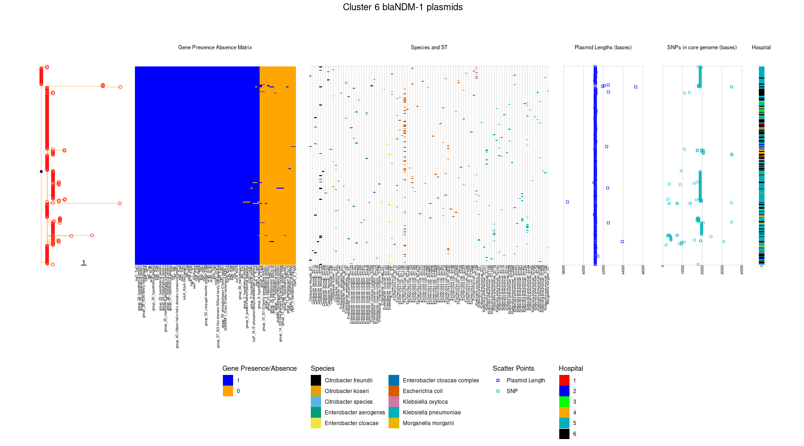<!-- -->

### Cluster5


```r
# Cluster 5 blaNDM-1 plasmids

folderloc <- "/data02/Analysis/Projects/2_CPE_Transmission/Plasmid_roary/Plasmids_Analysis_1071_Kmer_plot_11102020/ClusterNumber_5_blaNDM1/gff/CoreGenome_AND_gubbins/"

Plasmid_SNPtree_SNPlocations_Heatmap(
  location=folderloc,
  treeInput=glue('{folderloc}postGubbins.final_tree.tre'),
  modifiedVCF=glue('{folderloc}modified.vcf'),
  genePresAbsCSV=glue('{folderloc}gene_presence_absence.csv'),
  genePresAbsTAB=glue('{folderloc}gene_presence_absence.Rtab'),
  plot_title="Cluster 5 blaNDM-1 plasmids",
  GenePA_offset=0.1,SpeciesST_offset=0.1,Plasmidlen_offset=0.2,SNPs_offset=0.25,Hospital_offset=0.25,
  GenePA_pwidth=3,SpeciesST_pwidth=2,Plasmidlen_pwidth=1,SNPs_pwidth=1,Hospital_pwidth=0.07
)
```

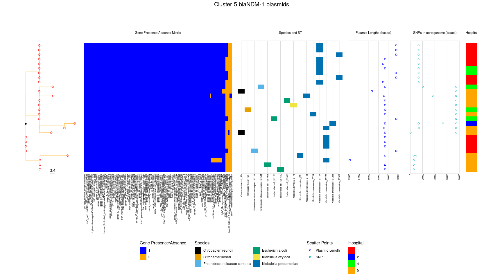<!-- -->

### Cluster2


```r
#Cluster 2 blaKPC-2 plasmids
folderloc <- "/data02/Analysis/Projects/2_CPE_Transmission/Plasmid_roary/Plasmids_Analysis_1071_Kmer_plot_11102020/ClusterNumber_2_blaKPC2/gff/CoreGenome_AND_gubbins/"

Plasmid_SNPtree_SNPlocations_Heatmap(
  location=folderloc,
  treeInput=glue('{folderloc}postGubbins.final_tree.tre'),
  modifiedVCF=glue('{folderloc}modified.vcf'),
  genePresAbsCSV=glue('{folderloc}gene_presence_absence.csv'),
  genePresAbsTAB=glue('{folderloc}gene_presence_absence.Rtab'),
  plot_title="Cluster 2 blaKPC-2 plasmids",
  GenePA_offset=0.1,SpeciesST_offset=0.1,Plasmidlen_offset=0.2,SNPs_offset=0.25,Hospital_offset=0.25,
  GenePA_pwidth=3,SpeciesST_pwidth=2,Plasmidlen_pwidth=1,SNPs_pwidth=1,Hospital_pwidth=0.07
)
```

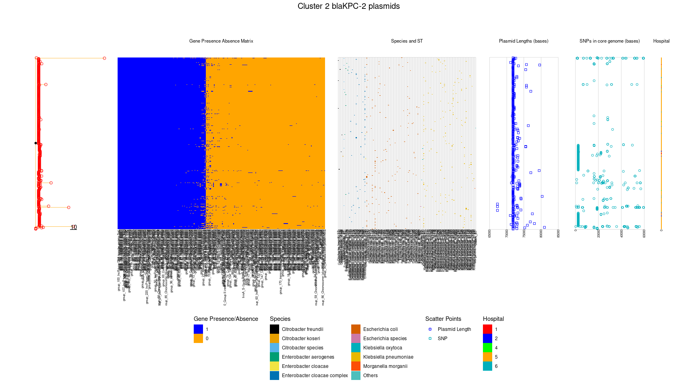<!-- -->

### Cluster16


```r
#Cluster 16 blaOXA-181 plasmids
folderloc <- "/data02/Analysis/Projects/2_CPE_Transmission/Plasmid_roary/Plasmids_Analysis_1071_Kmer_plot_11102020/ClusterNumber_16_blaOXA181/gff/CoreGenome_AND_gubbins/"

Plasmid_SNPtree_SNPlocations_Heatmap(
  location=folderloc,
  treeInput=glue('{folderloc}postGubbins.final_tree.tre'),
  modifiedVCF=glue('{folderloc}modified.vcf'),
  genePresAbsCSV=glue('{folderloc}gene_presence_absence.csv'),
  genePresAbsTAB=glue('{folderloc}gene_presence_absence.Rtab'),
  plot_title="Cluster 16 blaOXA-181 plasmids",
  GenePA_offset=0.1,SpeciesST_offset=0.1,Plasmidlen_offset=0.2,SNPs_offset=0.25,Hospital_offset=0.25,
  GenePA_pwidth=3,SpeciesST_pwidth=1,Plasmidlen_pwidth=1,SNPs_pwidth=1,Hospital_pwidth=0.07
)
```

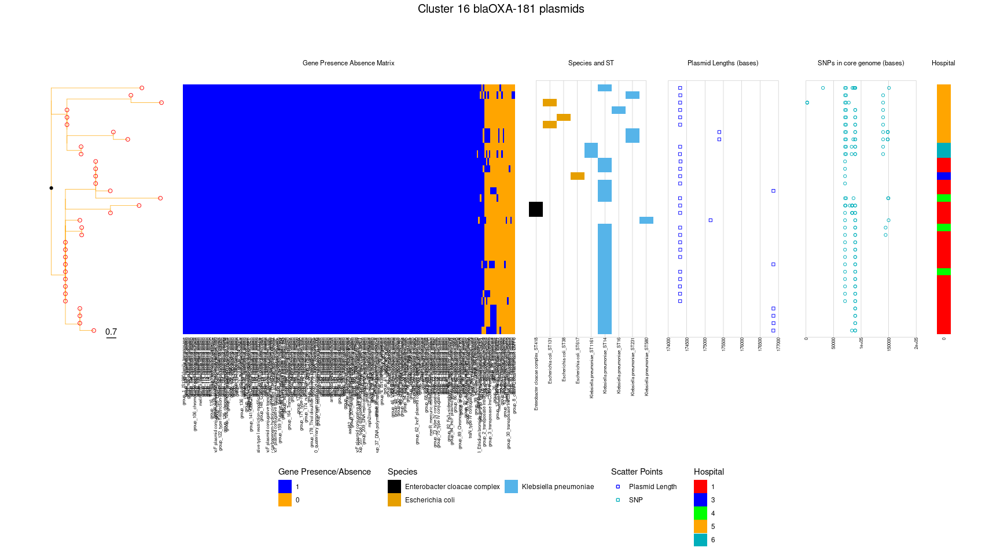<!-- -->


### Cluster19


```r
#Cluster 19 blaOXA-48 plasmids
folderloc <- "/data02/Analysis/Projects/2_CPE_Transmission/Plasmid_roary/Plasmids_Analysis_1071_Kmer_plot_11102020/ClusterNumber_19_blaOXA48/gff/CoreGenome_AND_gubbins/"

Plasmid_SNPtree_SNPlocations_Heatmap(
  location=folderloc,
  treeInput=glue('{folderloc}postGubbins.final_tree.tre'),
  modifiedVCF=glue('{folderloc}modified.vcf'),
  genePresAbsCSV=glue('{folderloc}gene_presence_absence.csv'),
  genePresAbsTAB=glue('{folderloc}gene_presence_absence.Rtab'),
  plot_title="Cluster 19 blaOXA-48 plasmids",
  GenePA_offset=0.1,SpeciesST_offset=0.1,Plasmidlen_offset=0.2,SNPs_offset=0.25,Hospital_offset=0.25,
  GenePA_pwidth=3,SpeciesST_pwidth=1,Plasmidlen_pwidth=1,SNPs_pwidth=1,Hospital_pwidth=0.07
)
```

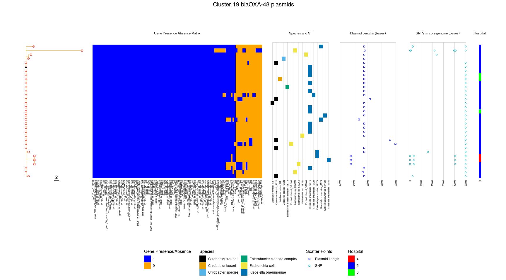<!-- -->
