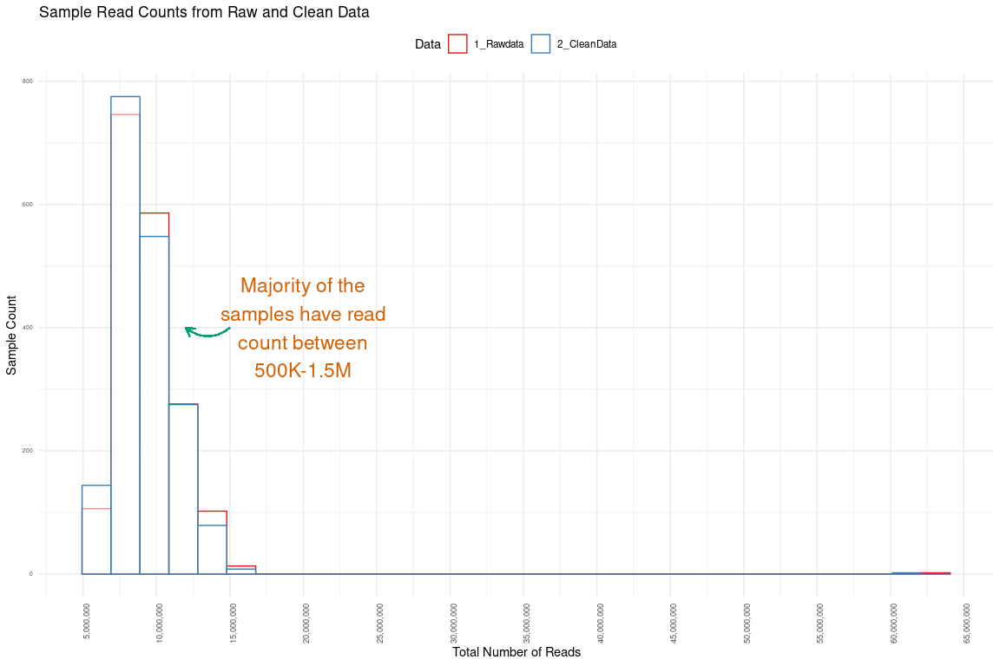
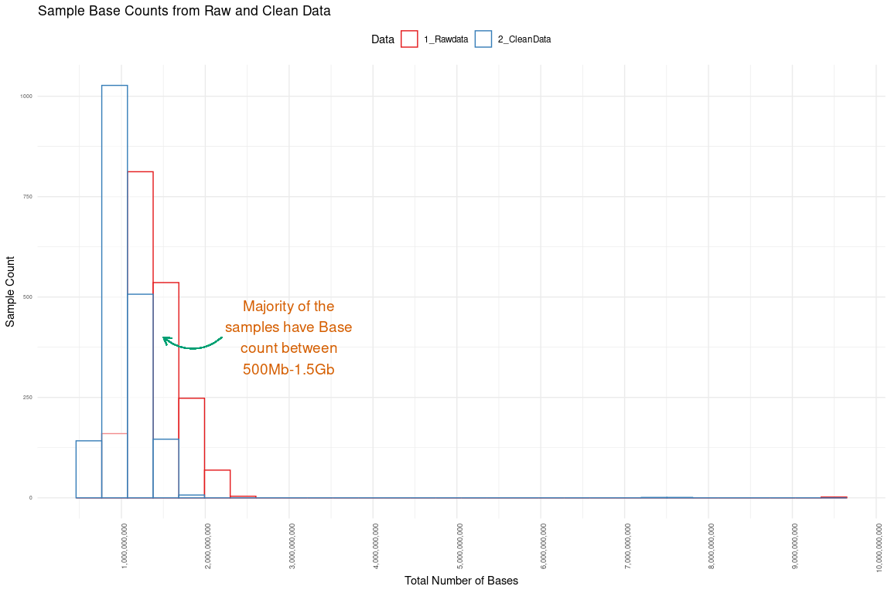
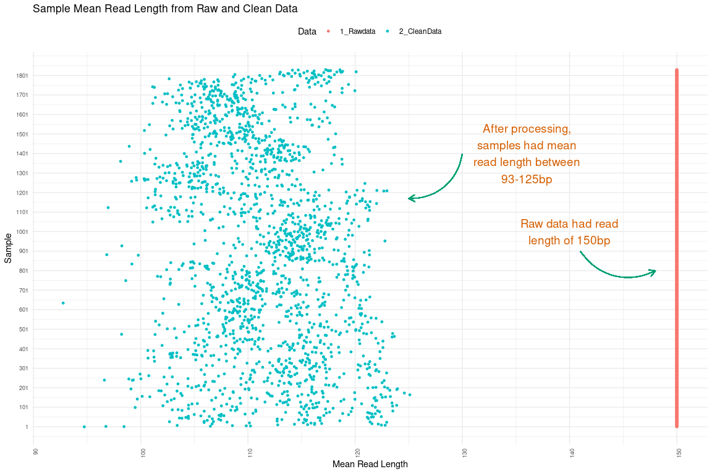
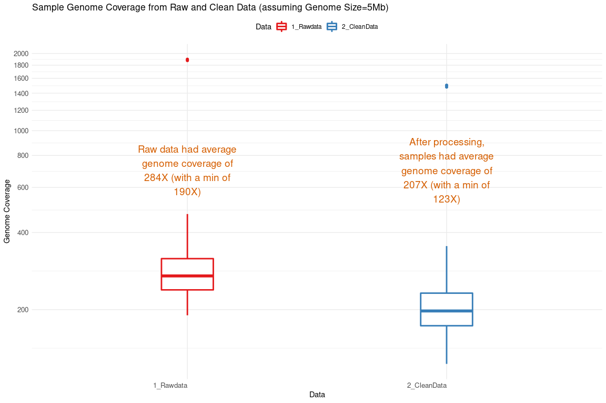
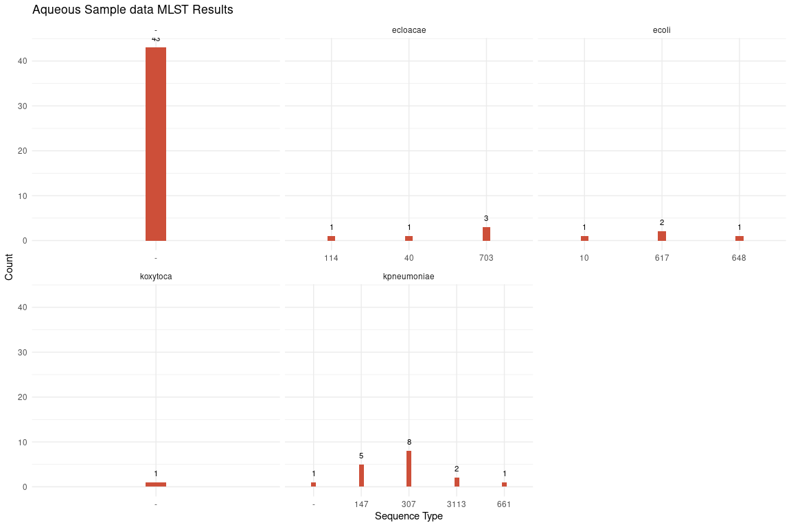
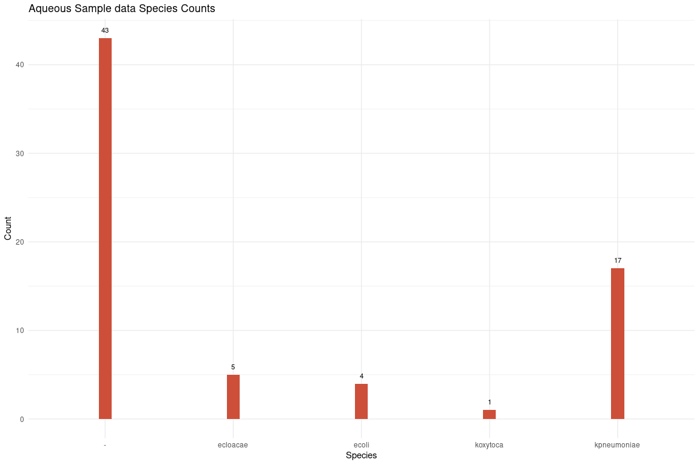
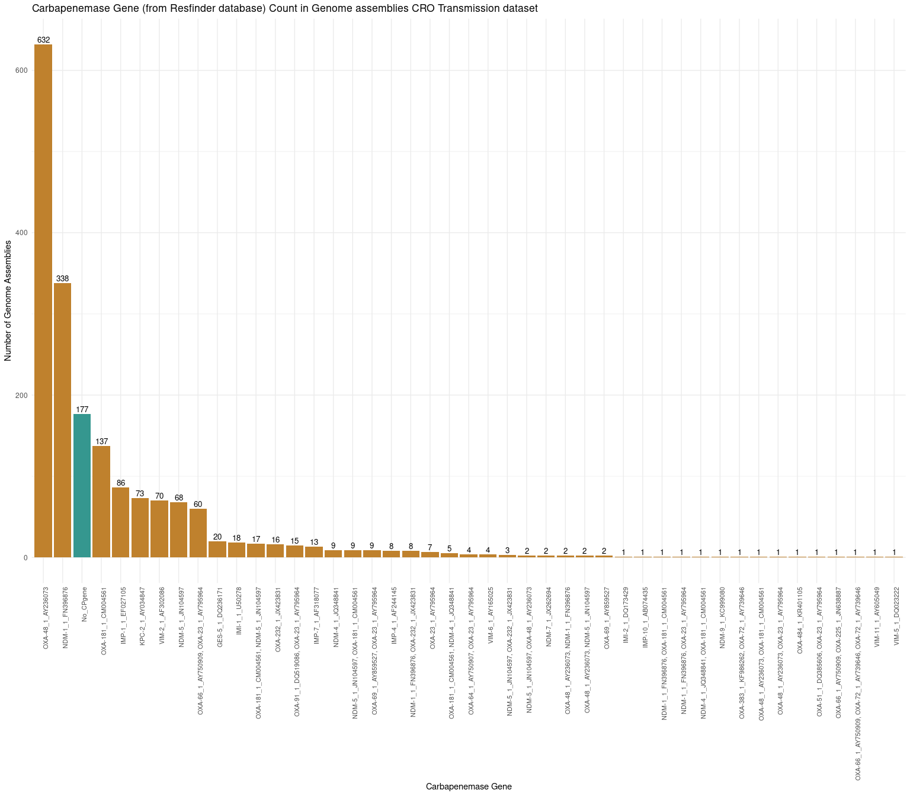

### Step 1: Raw read analysis fastqc and multiqc

Let us run `fastqc` and `multiqc` commands for analysing the quality of raw data.


```bash
# Location -
# cd /storage/data/DATA4/analysis/33_CRO_Transmission

###################################################################

# Step 1.fastqc on Raw Reads 
##############################

mkdir 1_Rawdata

cd 1_Rawdata

# Move the files to respective folders. The location of all the 1831 samples (both read1 and read2) are listed in "CRO_Tranmission_analysis_1831_samples_locations"
time for d in $(cat CRO_Tranmission_analysis_1831_samples_locations); do ls "$d"; ln -s "$d" .; done #Never use force (-sf) when creating softlinks using ln

# real	0m28.116s
# user	0m7.907s
# sys	0m21.414s

# Moving into fastq files into respective folders
$ time for d in $(ls *.gz | cut -f1 -d "_"  | sort -u); do mkdir $d; mv "$d"_*.gz $d; done

#real	0m33.473s
#user	0m15.779s
#sys	0m16.882s

#We now have all the data arranged in 1831 folders
$ ls -d */ | wc -l
1831

# A total of 139 samples have topup sequencing done
$ ls */*.fq.gz | awk -F/ '{print $1}' | sort | uniq -c | sort -n | grep "^\s*4" | wc -l
139

# Let's move this samples with and without topup seqeuncing into separate folders 
$ mkdir Samples_with_Topup
$ for d in $(ls */*.fq.gz | awk -F/ '{print $1}' | sort | uniq -c | sort -n | grep "^\s*4" | awk '{print $2}'); do echo $d; mv $d Samples_with_Topup/; done

$ mkdir Samples_without_Topup
$ mv * Samples_without_Topup/
$ cd Samples_without_Topup/
$ mv Samples_with_Topup/ ..

$ ls
Samples_without_Topup  Samples_with_Topup

# Let's combine the topup sequencing files

$ time  for d in $(ls -d */ | tr -d "/"); do cd $d; echo $d; base=`ls -1 *_1.fq.gz | awk '{print $1}' | cut -f2 -d "_" | sort -u`; echo $base; cat *_L*_1.fq.gz >"$d"_"$base"_combined_topup_L8_1.fq.gz; cd ..; done 

# real	4m9.921s
# user	0m1.590s
# sys	2m13.486s


$ time  for d in $(ls -d */ | tr -d "/"); do cd $d; echo $d; base=`ls -1 *_2.fq.gz | awk '{print $1}' | cut -f2 -d "_" | sort -u`; echo $base; cat *_L*_2.fq.gz >"$d"_"$base"_combined_topup_L8_2.fq.gz; cd ..; done 

# real	4m32.513s
# user	0m1.577s
# sys	2m20.694s

# Random check - both files add up to combined topup
$ gunzip -c HS02981_FDSW210242492-1r_H3TNJDSX2_L4_1.fq.gz | fgrep -c "1:N:0:" 
3412020
$ gunzip -c HS02981_FDSW210242492-1r_HHYYCDSX2_L2_1.fq.gz | fgrep -c "1:N:0:"
3063785
$ gunzip -c HS02981_FDSW210242492-1r_combined_topup_L8_1.fq.gz | fgrep -c "1:N:0:"
6475805

# Remove the softlink files from the sample folders in "Samples_with_Topup" directory. This is just to avoid confusion while running commands in upcoming steps.
# So except for combined topup files, we remove other softlink files

$ for d in $(ls -1 */* | grep -v 'combined'); do rm $d; echo "$d ---deleted"; done

# Unzip the gz files 
$ time for d in $(ls -d */ | tr -d "/"); do echo $d; cd $d; gunzip *.gz; cd ..; done

# real	93m7.561s
# user	70m26.925s
# sys	15m50.724s


# Let's unzip the samples "Samples_without_Topup" directory
# NOTE: because these are softlinks, we cannot just use gunzip. Rather, we write to an other file

$ cd Samples_without_Topup/
$ time for d in $(ls -d */ | tr -d "/"); do echo $d; cd $d; for e in $(ls *.fq.gz); do base=`echo $e | sed 's/.fq.gz//'`; gunzip -c $e >"$base".fq; done; cd ..; done

real	701m1.535s
user	567m31.277s
sys	99m44.539s

# The whole raw data at this point of time is 6.4 Tb of space. 

# Run fastqc on the raw reads 

time for d in $(ls -d */| sed 's/\///g'); do echo $d; cd $d; /storage/apps/FastQC/fastqc -t 48 *.fq; cd ..; done

# "Samples_with_Topup"
# real	140m30.365s
# user	250m43.452s
# sys	26m47.944s

# "Samples_without_Topup"
real	1366m18.864s
user	2327m40.146s
sys	340m44.166s

# For generating read stats - Run this on both "Samples_without_Topup" and "Samples_with_Topup" folders
time for d in $(ls */*fq); do echo "perl /storage/apps/SNP_Validation_Scripts/tools/Q20_Q30_Stats_wo_functions.pl $d"; done >parallel_script_Q20_Q30_stats.sh
time parallel < parallel_script_Q20_Q30_stats.sh &

# "Samples_without_Topup"
real	358m8.110s
user	16361m55.040s
sys	81m46.922s

# "Samples_with_Topup"
real	45m19.955s
user	1941m39.725s
sys	7m17.278s

#combine all fastqc reports using multiqc
cd 1_Rawdata

multiqc .

# Observations from raw fastq: Adapters are present in many sequences. So, trimmed them using BBMAP.
# But base quality of all the samples looking high (above Q30).

$ cat */Q30_Q20_readstats.txt >rawData_Q30_Q20_readstats.txt

# Run qualStats.R script with the rawData_Q30_Q20_readstats.txt as an input. This should generate "_Pre-Trimmed_aggregated_stats.txt" file

$ pwd
# /storage/data/DATA4/analysis/30_Aqueous_Env_11F_data_analysis/2_Cleandata/illumina_bbmap_trimmed

# Run qualStats.R script with the rawData_Q30_Q20_readstats.txt as an input. This should generate "_Pre-Trimmed_aggregated_stats.txt" file

# Run qualStats.R script with the filtData_Q30_Q20_readstats.txt as an input. This should generate "_Post-Trimmed_aggregated_stats.txt" file

# Now combine both Raw and Filt Data using qualStats_aggregated.R script

```


### Step 2: Pre-process Illumina reads 

Now let us trim the raw data from illumina using `BBduk`.


```bash

$ cd /storage/data/DATA4/analysis/33_CRO_Transmission/1_Rawdata/Samples_with_Topup

# Step 2. Adapter trimming using BBDuk 
######################################

time for d in $(ls -d */); 
do 
  echo $d; 
  subdir=`echo $d`; 
  cd $subdir; 
  R1=`ls *_1.fq | sed 's/.fq//g'`; R2=`ls *_2.fq | sed 's/.fq//g'`; 
  echo "$R1 $R2"; 
  /storage/apps/bbmap/bbduk.sh -Xmx6g in1=$R1.fq in2=$R2.fq out1=$R1\_bbmap_adaptertrimmed.fq out2=$R2\_bbmap_adaptertrimmed.fq ref=/storage/apps/bbmap/resources/adapters.fa ktrim=r k=23 mink=11 hdist=1 qtrim=rl trimq=30 minavgquality=30; 
  cd ..; 
done

# "Samples_with_Topup"
real	40m2.716s
user	482m6.141s
sys	44m40.650s

# "Samples_without_Topup"
real	345m11.796s
user	4259m21.316s
sys	407m56.640s

mkdir ../2_CleanData

# move the adapter trimmed files into another directory
mv */*/*bbmap_adaptertrimmed.fq /storage/data/DATA4/analysis/33_CRO_Transmission/2_CleanData
 
 # move to specific folder
for d in $(ls *.fq| awk -F_ '{print $1}' | sort -u); do echo $d; mkdir $d; mv "$d"_*.fq $d; done


# For generating read stats - Run this on both "Samples_without_Topup" and "Samples_with_Topup" folders
time for d in $(ls */*fq); do echo "perl /storage/apps/SNP_Validation_Scripts/tools/Q20_Q30_Stats_wo_functions.pl $d"; done >parallel_script_Q20_Q30_stats.sh
time parallel < parallel_script_Q20_Q30_stats.sh &

# Run fastqc on the raw reads (Env + 11F)
time for d in $(ls -d */| sed 's/\///g'); do echo $d; cd $d; /storage/apps/FastQC/fastqc -t 48 *.fq; cd ..; done

#combine all fastqc reports using multiqc
cd 1_Rawdata

multiqc .

# Combine the read stats from Raw and Clean reads into one file to later use to create plot in R
$ grep "" */Q30_Q20_readstats.txt | sed 's/\/Q30_Q20_readstats.txt:/  /g' | sed 's/\//        /g' | sort -nk1,1 -nk2,2 >1_Raw_Clean_Q30_Q20_readstats.txt
```

Let plot the read stats for 1831 samples!!


```r
setwd("/data02/Analysis/Projects/10_CRO_Transmission_Analysis/1_ReadStats_plots")

stats <- read.table("1_Raw_Clean_Q30_Q20_readstats.txt", header = TRUE, sep = "\t")
head(stats)
```

```
##        Data Sample                                Fastq_File ReadCount
## 1 1_Rawdata C00003 C00003_FDSW210173279-1r_HYN5NDSXY_L1_1.fq   4416162
## 2 1_Rawdata C00003 C00003_FDSW210173279-1r_HYN5NDSXY_L1_2.fq   4416162
## 3 1_Rawdata C00006 C00006_FDSW210173281-1r_HYN5NDSXY_L1_1.fq   5306633
## 4 1_Rawdata C00006 C00006_FDSW210173281-1r_HYN5NDSXY_L1_2.fq   5306633
## 5 1_Rawdata C00007 C00007_FDSW210173280-1r_HYN5NDSXY_L1_1.fq   4474689
## 6 1_Rawdata C00007 C00007_FDSW210173280-1r_HYN5NDSXY_L1_2.fq   4474689
##   BaseCount Q20_BaseCount Q30_BaseCount Mean_ReadLength
## 1 662424300     646379441     614391956             150
## 2 662424300     630939427     580815210             150
## 3 795994950     777640186     742536922             150
## 4 795994950     764005683     713359187             150
## 5 671203350     656351374     627079027             150
## 6 671203350     640882616     593540731             150
```

```r
tail(stats)
```

```
##             Data  Sample
## 7319 2_CleanData HS03190
## 7320 2_CleanData HS03190
## 7321 2_CleanData HS03191
## 7322 2_CleanData HS03191
## 7323 2_CleanData HS03192
## 7324 2_CleanData HS03192
##                                                           Fastq_File ReadCount
## 7319 HS03190_FDSW210282583-1r_HK5WHDSX2_L1_1_bbmap_adaptertrimmed.fq   3344283
## 7320 HS03190_FDSW210282583-1r_HK5WHDSX2_L1_2_bbmap_adaptertrimmed.fq   3344283
## 7321 HS03191_FDSW210282584-1r_HK5WHDSX2_L1_1_bbmap_adaptertrimmed.fq   4468809
## 7322 HS03191_FDSW210282584-1r_HK5WHDSX2_L1_2_bbmap_adaptertrimmed.fq   4468809
## 7323 HS03192_FDSW210282585-1r_HK5WHDSX2_L1_1_bbmap_adaptertrimmed.fq   4555207
## 7324 HS03192_FDSW210282585-1r_HK5WHDSX2_L1_2_bbmap_adaptertrimmed.fq   4555207
##      BaseCount Q20_BaseCount Q30_BaseCount Mean_ReadLength
## 7319 397722873     397722873     389383928        118.9262
## 7320 369412115     369412115     359380377        110.4608
## 7321 537111431     537111431     528281727        120.1912
## 7322 522713937     522713937     512500558        116.9694
## 7323 550922913     550922913     542029736        120.9436
## 7324 517232983     517232983     506243397        113.5476
```

```r
############--------CHANGE THESE VARIABLES---IMPORTANT!!------##########

samples_or_project_name <- "CRO Transmission"
seqCompany <- "AITBiotech" #Internal/AITBiotech
seqData_trimmed_or_not <- "Pre and Post-Trimmed" # use "Raw data" before trimming else use "After Trimming with Q30 score"  
genomeSize <- 5500000 

library(dplyr)
library(ggplot2)

comb_stats <- stats %>% 
  group_by(Data,Sample) %>% 
  summarise(TotalReadCount = sum(ReadCount), TotalBaseCount = sum(BaseCount), 
            TotalQ20_BaseCount = sum(Q20_BaseCount), TotalQ30_BaseCount = sum(Q20_BaseCount),
            Mean_ReadLength=mean(Mean_ReadLength)) #%>% tail()

comb_stats
```

```
## # A tibble: 3,662 x 7
## # Groups:   Data [2]
##    Data  Sample TotalReadCount TotalBaseCount TotalQ20_BaseCo… TotalQ30_BaseCo…
##    <chr> <chr>           <int>          <dbl>            <dbl>            <dbl>
##  1 1_Ra… C00003        8832324     1324848600       1277318868       1277318868
##  2 1_Ra… C00006       10613266     1591989900       1541645869       1541645869
##  3 1_Ra… C00007        8949378     1342406700       1297233990       1297233990
##  4 1_Ra… C00008       13292378     1993856700       1947419081       1947419081
##  5 1_Ra… C00016       10019890     1502983500       1465813355       1465813355
##  6 1_Ra… C00020       11317214     1697582100       1655088630       1655088630
##  7 1_Ra… C00021       13909670     2086450500       2042322658       2042322658
##  8 1_Ra… C00023       11107862     1666179300       1622644593       1622644593
##  9 1_Ra… C00024        8335964     1250394600       1222138157       1222138157
## 10 1_Ra… C00027        9255552     1388332800       1355650386       1355650386
## # … with 3,652 more rows, and 1 more variable: Mean_ReadLength <dbl>
```

```r
# Dumbell Plot--> For too many data points does not seem to be a good plot

# comb_stats %>% 
#   ggplot(aes(x = Sample, y = TotalReadCount)) + 
#   geom_line(aes(group = Sample)) + # Note group here
#   geom_point(aes(color = Data), size = 1) + 
#   ggthemes::theme_clean() + scale_y_continuous(labels = function(x)format(x, scientific = FALSE)) + 
#   theme(legend.position="top", axis.text.x = element_text(angle = 90, hjust = 1, size = 6), axis.text.y = element_text(angle = 0, hjust = 1, size = 5)) + coord_flip()

# Histogram of ReadCount

comb_stats %>%
  ggplot(aes(x = TotalReadCount, color = Data)) +
  geom_histogram(fill = "white",
                 alpha = 0.5,
                 position = "identity") +
  scale_x_continuous(breaks = scales::pretty_breaks(n = 10), labels = scales::comma) +
  scale_color_brewer(palette = "Set1") +
  theme_minimal() +
  theme(legend.position = "top",axis.text.x = element_text(angle = 90,hjust = 1, size = 7),
        axis.text.y = element_text(angle = 0, hjust = 1, size = 5)) +
  labs(x = "Total Number of Reads",
       y = "Sample Count",
       title = "Sample Read Counts from Raw and Clean Data") +
  annotate("text",label = stringr::str_wrap("Majority of the samples have read count between 500K-1.5M", 20),
           x = 20000000, y = 400, color = "#D55E00", size = 6) + # #D55E00,#009E73
  geom_curve(x = 15000000, y = 400, xend = 12000000, yend = 400, color = '#009E73', curvature = -.4, arrow = arrow(length = unit(0.3, 'cm')))  ##004369
```

<!-- -->

```r
ggsave("TotalReadCount.png",dpi = 600, width = 10, height = 6, units = "in")


# Histogram of BaseCount

comb_stats %>%
  ggplot(aes(x = TotalBaseCount, color = Data)) +
  geom_histogram(fill = "white",
                 alpha = 0.5,
                 position = "identity") +
  scale_x_continuous(breaks = scales::pretty_breaks(n = 10), labels = scales::comma) +
  scale_color_brewer(palette = "Set1") +
  theme_minimal() +
  theme(legend.position = "top",axis.text.x = element_text(angle = 90,hjust = 1, size = 7),
    axis.text.y = element_text(angle = 0, hjust = 1, size = 5)) +
  labs(x = "Total Number of Bases",
       y = "Sample Count",
       title = "Sample Base Counts from Raw and Clean Data") +
  annotate("text",label = stringr::str_wrap("Majority of the samples have Base count between 500Mb-1.5Gb", 20),
    x = 3000000000, y = 400, color = "#D55E00", size = 5) + # #D55E00,#009E73
  geom_curve(x = 2200000000, y = 400, xend = 1500000000, yend = 400, color = '#009E73', curvature = -.4, arrow = arrow(length = unit(0.3, 'cm')))  ##004369
```

<!-- -->

```r
ggsave("TotalBaseCount.png",dpi = 600, width = 10, height = 6, units = "in")  

# Scatterplot of Mean Read Length

comb_stats %>% 
  group_by(Sample) %>% 
  mutate(ID = cur_group_id()) %>% # Adding a new ID column
  ggplot(aes(x = Mean_ReadLength, y=ID, color = Data)) +
  geom_point(size=1) +
  scale_y_continuous(breaks = seq(1, 1900, by = 100)) +
  theme_minimal() +
  theme(legend.position = "top",axis.text.x = element_text(angle = 90,hjust = 1, size = 7),
        axis.text.y = element_text(angle = 0, hjust = 1, size = 7)) +
  labs(x = "Mean Read Length",
       y = "Sample",
       title = "Sample Mean Read Length from Raw and Clean Data") +
  annotate("text",label = stringr::str_wrap("After processing, samples had mean read length between 93-125bp", 20),
          x = 136, y = 1401, color = "#D55E00", size = 5) + # #D55E00,#009E73
  geom_curve(x = 130, y = 1400, xend = 125, yend = 1170, color = '#009E73', curvature = -.4, arrow = arrow(length = unit(0.3, 'cm'))) +  ##004369
  annotate("text",label = stringr::str_wrap("Raw data had read length of 150bp", 20),
           x = 140, y = 1001, color = "#D55E00", size = 5) + # #D55E00,#009E73
  geom_curve(x = 141, y = 900, xend = 148, yend = 800, color = '#009E73', curvature = .4, arrow = arrow(length = unit(0.3, 'cm')))  
```

<!-- -->

```r
ggsave("Mean_ReadLength.png",dpi = 600, width = 10, height = 6, units = "in")  

# Genome Coverage of Clean Data

comb_stats %>% 
  group_by(Sample) %>% 
  mutate(ID = cur_group_id()) %>% # Adding a new ID column
  # filter(Data=="2_CleanData") %>% 
  mutate(GenomeCov=TotalBaseCount/5000000) %>% 
  group_by(Data) %>% 
  summarize(mean_size = mean(GenomeCov, na.rm = TRUE)) # Mean of raw and clean data
```

```
## # A tibble: 2 x 2
##   Data        mean_size
##   <chr>           <dbl>
## 1 1_Rawdata        284.
## 2 2_CleanData      207.
```

```r
  #summarize(min_mean = min(GenomeCov, na.rm = TRUE))  # Minimum mean coverage


comb_stats %>% 
  group_by(Sample) %>% 
  mutate(ID = cur_group_id()) %>% # Adding a new ID column
 # filter(Data=="2_CleanData") %>% 
  mutate(GenomeCov=TotalBaseCount/5000000) %>%  # Assuming Genome Size of the bacteria is ~5Mb
  ggplot(aes(x= Data, y=GenomeCov, color=Data)) + 
  geom_boxplot(width=0.2,lwd=1) +
  scale_y_log10(breaks = scales::log_breaks(n = 15)) +
  scale_color_brewer(palette = "Set1") +
  theme_minimal() +
  theme(legend.position = "top",axis.text.x = element_text(angle = 0,hjust = 1, size = 10),
        axis.text.y = element_text(angle = 0, hjust = 1, size = 10)) +
  labs(x = "Data",
       y = "Genome Coverage",
       title = "Sample Genome Coverage from Raw and Clean Data (assuming Genome Size=5Mb)") +
   annotate("text",label = stringr::str_wrap("After processing, samples had average genome coverage of 207X (with a min of 123X)", 20),
           x = "2_CleanData", y = 700, color = "#D55E00", size = 5) + # #D55E00,#009E73
   annotate("text",label = stringr::str_wrap("Raw data had average genome coverage of 284X (with a min of 190X)", 20),
           x = "1_Rawdata", y = 700, color = "#D55E00", size = 5)  # #D55E00,#009E73
```

<!-- -->

```r
ggsave("GenomeCoverage.png",dpi = 600, width = 10, height = 6, units = "in")  
```

# Step 3: Genome Assembly using SPAdes


```bash

time for d in $(ls -d */ | grep -v 'multiqc'); do echo $d; subdir=`echo -n $d | tr -d "/"`; cd $subdir; R1=`ls *_1_bbmap_adaptertrimmed.fq `; R2=`ls *_2_bbmap_adaptertrimmed.fq`; echo "$R1 $R2"; spades.py --pe1-1 "$R1" --pe1-2 "$R2" -o "$subdir"_spades --careful -t 48 >>log_spades; cd ..; done

$ mkdir ../3_SPAdes
$ mv */*_spades/ ../3_SPAdes/

#Copy and rename the assemblies
$ cd ../3_SPAdes/
$ for d in $(ls *_spades/contigs.fasta); do prefix=`echo "$d" | cut -f1 -d "/"`; cp "$d" "$prefix"_contigs.fasta; done

$ mkdir ../4_SPAdes_Assemblies
$ mv *contigs.fasta ../4_SPAdes_Assemblies/
$ cd ../4_SPAdes_Assemblies/

Filter for contigs >1kb
------------------------
used bioawk installed in server

$ for d in $(ls *.fasta | sed 's/_contigs.fasta//g' ); do echo $d; /storage/apps/bioawk/bioawk -c fastx 'length($seq) >=1000 {print "\>"$name"\n"$seq}' "$d"_contigs.fasta >$d.gte1kb.contigs.fasta; done
$ mkdir gteq1kb
$ mv *gte1kb* gteq1kb/
$ mkdir full_assembly
$ mv *.fasta full_assembly/
```

### Step 4: Assembly Downstream - MLST


```bash

cd gteq1kb

# This is plotting the stats
statswrapper.sh *.fasta >gteq1kb_assemblies_summary_stats.txt

$ mlst --version
#mlst 2.19.0

$ mlst *contigs.fasta | grep ".fasta" >>log_mlst_2.19

$ mkdir ../../5_MLST
$ mv log_mlst ../../5_MLST/

$ cat log_mlst_2.19 | awk '{print $2}' | sort | uniq -c
```


```r
setwd("/data02/Analysis/Projects/8_Aqueos_samples/3mlst")

mlst_log <- read.table("log_mlst",sep = "\t", header = FALSE,fill = TRUE)
head(mlst_log)
```

```
##                                      V1          V2  V3       V4       V5
## 1  A1089_unicycler.gte1kb.contigs.fasta    ecloacae 114 dnaA(53) fusA(35)
## 2  A1416_unicycler.gte1kb.contigs.fasta kpneumoniae 147  gapA(3)  infB(4)
## 3   A472_unicycler.gte1kb.contigs.fasta kpneumoniae 307  gapA(4)  infB(1)
## 4   A634_unicycler.gte1kb.contigs.fasta       ecoli 648  adk(92)  fumC(4)
## 5   A934_unicycler.gte1kb.contigs.fasta       ecoli 617  adk(10) fumC(11)
## 6 C00852_unicycler.gte1kb.contigs.fasta kpneumoniae 307  gapA(4)  infB(1)
##         V6       V7       V8       V9      V10
## 1 gyrB(20) leuS(44) pyrG(45)  rplB(4)  rpoB(6)
## 2   mdh(6)   pgi(1)  phoE(7)  rpoB(4) tonB(38)
## 3   mdh(2)  pgi(52)  phoE(1)  rpoB(1)  tonB(7)
## 4 gyrB(87)  icd(96)  mdh(70) purA(58)  recA(2)
## 5  gyrB(4)   icd(8)   mdh(8) purA(13) recA(73)
## 6   mdh(2)  pgi(52)  phoE(1)  rpoB(1)  tonB(7)
```

```r
names(mlst_log) <- c("filename", "organism", "ST", "gene1", "gene2", "gene3", "gene4", "gene5", "gene6", "gene7")
head(mlst_log)
```

```
##                                filename    organism  ST    gene1    gene2
## 1  A1089_unicycler.gte1kb.contigs.fasta    ecloacae 114 dnaA(53) fusA(35)
## 2  A1416_unicycler.gte1kb.contigs.fasta kpneumoniae 147  gapA(3)  infB(4)
## 3   A472_unicycler.gte1kb.contigs.fasta kpneumoniae 307  gapA(4)  infB(1)
## 4   A634_unicycler.gte1kb.contigs.fasta       ecoli 648  adk(92)  fumC(4)
## 5   A934_unicycler.gte1kb.contigs.fasta       ecoli 617  adk(10) fumC(11)
## 6 C00852_unicycler.gte1kb.contigs.fasta kpneumoniae 307  gapA(4)  infB(1)
##      gene3    gene4    gene5    gene6    gene7
## 1 gyrB(20) leuS(44) pyrG(45)  rplB(4)  rpoB(6)
## 2   mdh(6)   pgi(1)  phoE(7)  rpoB(4) tonB(38)
## 3   mdh(2)  pgi(52)  phoE(1)  rpoB(1)  tonB(7)
## 4 gyrB(87)  icd(96)  mdh(70) purA(58)  recA(2)
## 5  gyrB(4)   icd(8)   mdh(8) purA(13) recA(73)
## 6   mdh(2)  pgi(52)  phoE(1)  rpoB(1)  tonB(7)
```

```r
library(ggplot2)

ggplot(mlst_log, aes(x=factor(ST))) +
  geom_bar(stat="count", width=0.1, fill="tomato3") +
  geom_text(stat='count',aes(label=..count..),vjust=-1,size=3) +
  theme_minimal() + ggtitle("Aqueous Sample data MLST Results") + # for the main title
  xlab("Sequence Type") + # for the x axis label
  ylab("Count") + 
  facet_wrap(~ organism,scales = "free_x")
```

<!-- -->

```r
ggsave("MLST.png",dpi = 600, width = 8, height = 6, units = "in")

# Don't map a variable to y
ggplot(mlst_log, aes(x=factor(organism)))+
  geom_bar(stat="count", width=0.1, fill="tomato3") +
  geom_text(stat='count',aes(label=..count..),vjust=-1,size=3) +
  theme_minimal() + ggtitle("Aqueous Sample data Species Counts") + # for the main title
  xlab("Species") + # for the x axis label
  ylab("Count")
```

<!-- -->

```r
ggsave("organism.png",dpi = 600, width = 8, height = 6, units = "in")
```


### Step 5: Assembly Downstream - Kraken2 

Kraken2 for species calling on adapter trimmed reads of illumina. We are running Kraken2 only one the samples which had discordance with laboratory species. The list of the discordant samples are generated using excel file and placed in the `/storage/data/DATA4/analysis/33_CRO_Transmission/6_Kraken2` folder


```bash

cd /storage/data/DATA4/analysis/33_CRO_Transmission/2_CleanData 

$ time for d in $(cat /storage/data/DATA4/analysis/33_CRO_Transmission/6_KRAKEN2/Discordant_Samples_Genomics_LabSpecies.list); 
do 
  echo $d; 
  cd $d; 
  R1=`ls *_1_*.fq | sed 's/.fq//g'`; R2=`ls *_2_*.fq | sed 's/.fq//g'`; 
  echo "$R1 $R2"; 
  kraken2 --db /storage/apps/Kraken2/Kraken2_db/minikraken_8GB_20200312 --threads 48 --report "$d"_kraken2_report --paired "$R1".fq "$R2".fq --output "$d"_kraken2_result; 
  cd ../; 
done

--> Top species

for d in $(ls */*report); do echo $d; egrep -m1 "\sS\s" $d; done >>ALL_kraken2_report_top1species 
for d in $(ls */*report); do echo $d; egrep -m2 "\sS\s" $d; done >>ALL_kraken2_report_top2species


mv *kraken2* ../6_KRAKEN2
mv */*kraken2* ../6_KRAKEN2

$ cat ALL_kraken2_report_top1species | paste - - | sed 's/ /_/g' | awk '{print $1"\t" $NF}' | sed 's/__//g' | awk -F/ '{print $1,$NF}' | awk '{print $1,$NF}

```


### Step 6: Assembly Downstream - CGE - Resfinder4.1

Although Resfinder is part of CGE-BAPS, only version 2.1 is used for finding the resistance genes. So, we downloaded the resfinder4.1 version locally on the server which is fast to detect resistance genes.

Running resfinder on all assembly fasta - default setting is coverage length of the sequence is 60% and identity 80%


```bash

time for d in $(ls *.fasta);  do  echo "time python3 /storage/apps/resfinder4.1/run_resfinder.py -o "$d"_resfinder_outdir -s "Other" -l 0.6 -t 0.8 --acquired -ifa $d;"; done >cge_resistome_commands_parallel.sh

time parallel --jobs 48 <cge_resistome_commands_parallel.sh
```

### Step 6c: Generate cge_resistance similar to BAPs format

Here ResFinder_results_tab.txt results are taken from each directory | remove spaces | unwanted columns removed | trimmed unnecessary texts | filtered the AMR genes which has coverage and identity >=80% | extracted unique records | collapsed the genes for each of the sample


```bash

awk '{print FILENAME "\t" $0}' */ResFinder_results_tab.txt  | tr ' ' '_' | cut -f1-9 -d "       " | sed -e 's/_unicycler.gte1kb.contigs.fasta_resfinder_outdir\/ResFinder_results_tab.txt//g' | awk '$3>=80 && $5>=80'| awk '{print $1 "\t" $2}' | sort -u | grep -v 'Resistance_gene' | groupBy -g 1 -c 2 -o collapse  >cge_resfinder_resistome.tab

# head(cge_resfinder_resistome.tab) 

#A1089	blaACT-16,blaOXA-181,fosA,mdf(A),OqxA,OqxB,qnrS1
#A1416	aac(6')-Ib-cr,aadA16,ARR-3,blaCTX-M-15,blaSHV-11,...

mv cge_resfinder_resistome.tab ../../7_Resfinder/
```

### Step 7b: CPgeneProfiler output

Let's check if any cocarriage genes are present


```r
# We want to use resfinder database for finding Carbapenemase genes presence in our genome assemblies.
# But in the resfinder annotation whether a beta-lactamase gene is cp gene or not is not so clear.
# So we use NCBI Pathogen Reference catalog: https://www.ncbi.nlm.nih.gov/pathogens/refgene/ and download the refgenes.csv

# Then we take the beta-lactam.fsa from resfinder database and extract confirm Carbapenem resistant genes from the resfinder database using NCBI refgenes.csv list.

# Below is the command

# for d in $(grep '\"CARBAPENEM\"' refgenes.csv  | awk -F, '{print $1}' | sed -e '/^$/d' -e 's/"//g' | sort -u); do echo -n "$d "; grep -i "$d\_" /home/prakki/sw/resfinder/db_resfinder/beta-lactam.fsa; echo ""; done | grep '>' | awk '{print $2}' | sed '/^$/d' >wanted_cpgene_list.list

# Extract CP Genes from Resfinder beta-lactam.fsa (fasta file). The CP genes are written to carbapenem.fsa file
# python3 extractSequence.py 

# library(CPgeneProfiler)
# 
# cpblast("/data02/Analysis/Projects/10_CRO_Transmission_Analysis/2_Genome_Assembly/gteq1kb","/home/prakki/sw/CPgeneProfiler/CPGP_29092020/db",num_threads = 64)
# cpblast("/data02/Analysis/Projects/10_CRO_Transmission_Analysis/2_Genome_Assembly/gteq1kb","/home/prakki/sw/CPgeneProfiler/CPGP_29092020/resfinder_db/",num_threads = 64)
# filt_blast()
# cocarriage()
# cpprofile()
# upsetR_plot()
# plot_conlen()
# assemblystat("/data02/Analysis/Projects/10_CRO_Transmission_Analysis/2_Genome_Assembly/gteq1kb",geom_point_size = 1.5)
# cp_summarize()

setwd("/data02/Analysis/Projects/10_CRO_Transmission_Analysis/2_Genome_Assembly/gteq1kb/CPgeneProfiler_Output_Resfinder_CPgenes/1_CP_BLAST_Results")

blast.filt <- read.table("blastResults.filt.txt",sep = " ", header = FALSE)
head(blast.filt)
```

```
##                                   V1                                  V2
## 1 C00003_spades.gte1kb.contigs.fasta   NODE_38_length_8067_cov_91.241302
## 2 C00003_spades.gte1kb.contigs.fasta  NODE_48_length_2596_cov_106.498611
## 3 C00006_spades.gte1kb.contigs.fasta  NODE_49_length_2392_cov_169.166307
## 4 C00007_spades.gte1kb.contigs.fasta   NODE_79_length_9711_cov_87.064044
## 5 C00008_spades.gte1kb.contigs.fasta   NODE_41_length_3677_cov_70.447778
## 6 C00023_spades.gte1kb.contigs.fasta NODE_11_length_184434_cov_43.691387
##                  V3     V4  V5     V6     V7  V8  V9 V10
## 1  NDM-1_1_FN396876   8067 813   7086   7898 813 100 100
## 2 OXA-23_1_AY795964   2596 822   1666   2487 822 100 100
## 3 OXA-48_1_AY236073   2392 798   1355   2152 798 100 100
## 4  NDM-5_1_JN104597   9711 813   8443   9255 813 100 100
## 5  IMP-1_1_EF027105   3677 741   2849   3589 741 100 100
## 6  VIM-2_1_AF302086 184434 801 145530 146330 801 100 100
```

```r
colnames(blast.filt) <- c("assemblyName", "qseqid",	"sseqid",	"qlen",	"slen",	"qstart",	"qend",	"length",	"pident",	"cov")
head(blast.filt)
```

```
##                         assemblyName                              qseqid
## 1 C00003_spades.gte1kb.contigs.fasta   NODE_38_length_8067_cov_91.241302
## 2 C00003_spades.gte1kb.contigs.fasta  NODE_48_length_2596_cov_106.498611
## 3 C00006_spades.gte1kb.contigs.fasta  NODE_49_length_2392_cov_169.166307
## 4 C00007_spades.gte1kb.contigs.fasta   NODE_79_length_9711_cov_87.064044
## 5 C00008_spades.gte1kb.contigs.fasta   NODE_41_length_3677_cov_70.447778
## 6 C00023_spades.gte1kb.contigs.fasta NODE_11_length_184434_cov_43.691387
##              sseqid   qlen slen qstart   qend length pident cov
## 1  NDM-1_1_FN396876   8067  813   7086   7898    813    100 100
## 2 OXA-23_1_AY795964   2596  822   1666   2487    822    100 100
## 3 OXA-48_1_AY236073   2392  798   1355   2152    798    100 100
## 4  NDM-5_1_JN104597   9711  813   8443   9255    813    100 100
## 5  IMP-1_1_EF027105   3677  741   2849   3589    741    100 100
## 6  VIM-2_1_AF302086 184434  801 145530 146330    801    100 100
```

```r
library(dplyr)
library(ggplot2)
library(stringr)

# Genome assemblies and CPgenes
blast.filt %>%
  group_by(assemblyName) %>%
  summarise(CPgenes=paste(sseqid,collapse=', '))
```

```
## # A tibble: 1,654 x 2
##    assemblyName                       CPgenes                            
##    <chr>                              <chr>                              
##  1 C00003_spades.gte1kb.contigs.fasta NDM-1_1_FN396876, OXA-23_1_AY795964
##  2 C00006_spades.gte1kb.contigs.fasta OXA-48_1_AY236073                  
##  3 C00007_spades.gte1kb.contigs.fasta NDM-5_1_JN104597                   
##  4 C00008_spades.gte1kb.contigs.fasta IMP-1_1_EF027105                   
##  5 C00023_spades.gte1kb.contigs.fasta VIM-2_1_AF302086                   
##  6 C00024_spades.gte1kb.contigs.fasta NDM-1_1_FN396876                   
##  7 C00027_spades.gte1kb.contigs.fasta NDM-1_1_FN396876                   
##  8 C00032_spades.gte1kb.contigs.fasta IMI-1_1_U50278                     
##  9 C00034_spades.gte1kb.contigs.fasta KPC-2_1_AY034847                   
## 10 C00035_spades.gte1kb.contigs.fasta OXA-48_1_AY236073                  
## # … with 1,644 more rows
```

```r
# Count of CPgenes in genome assemblies
blast.filt %>%
  group_by(assemblyName) %>%
  summarise(CPgenes=paste(sseqid,collapse=', ')) %>%
  count(CPgenes, sort = TRUE) %>% 
  add_row(CPgenes = "No_CPgene", n = 177) %>% 
  mutate(gene = if_else(str_starts(CPgenes, "No_CPgene"), "No_CPgene", "CPgene")) %>% 
  ggplot(aes(x=reorder(CPgenes, -n),y=n, fill=gene)) + #
  geom_bar(stat="identity") + 
  geom_text(aes(label=n), vjust=-0.3, size=3.5) +
 # scale_colour_manual(values=c('#999999','#E69F00')) +
  scale_fill_manual(values=c("#bf812d", "#35978f")) +
  theme_minimal() +
  theme(legend.position = "NA",axis.text.x = element_text(angle = 90,hjust = 1, size = 8),
        axis.text.y = element_text(angle = 0, hjust = 1, size = 9)) +
  labs(x = "Carbapenemase Gene",
       y = "Number of Genome Assemblies",
       title = "Carbapenemase Gene (from Resfinder database) Count in Genome assemblies CRO Transmission dataset ")
```

<!-- -->

```r
ggsave("CPGene_Counts.png",dpi = 600, width = 8, height = 6, units = "in")
```
