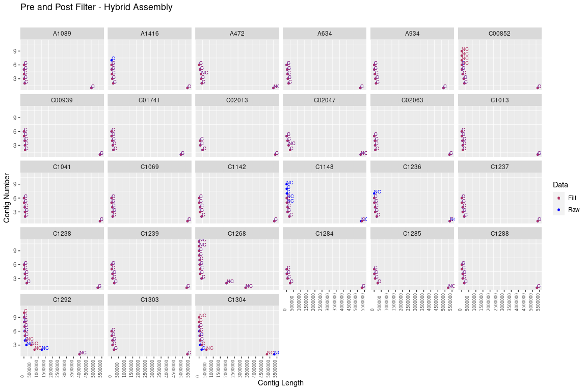
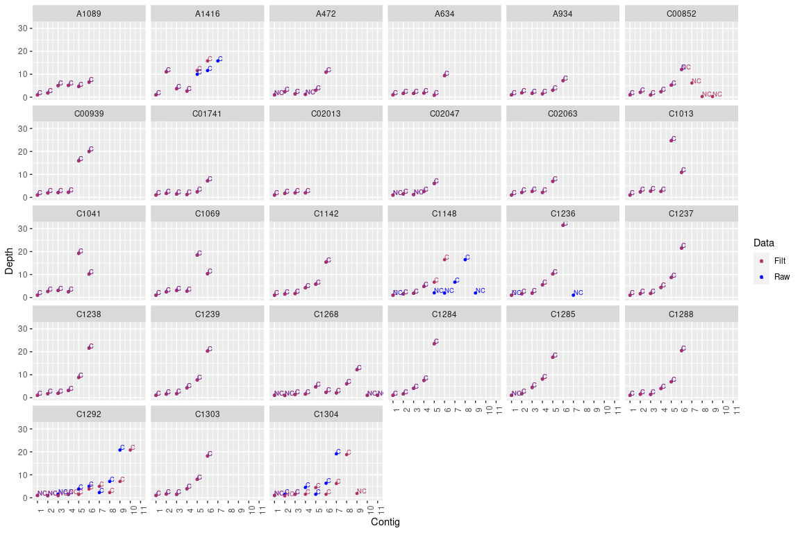
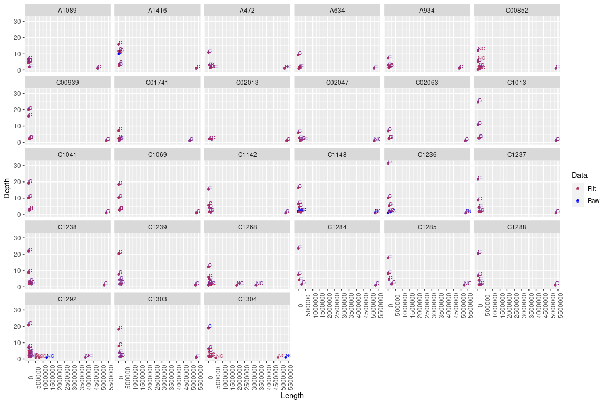

### Step 1: Filter Long reads 

All the raw fastq reads for the samples are processed using the tool "filtlong" using the following command.


```bash
time for d in $(ls *.fastq | sed 's/.fastq//g'); 
do 
filtlong --min_length 1000 --keep_percent 90 --target_bases 500000000 "$d".fastq > "$d".filtlong.fastq & 
done
```

### Step 2: Generate Unicycler Assembly

All the unicycler commands are put in BASH script and ran the script in the BASH console


```bash
time ./unicycler_assembly_filtlong_cmds.sh
```

### Step 3: Generate R plots
From the assembly.fasta, the headers were extracted and an text file **Cmp_RawFilt_Assemblies.txt** is created which is used for plotting using R ggplot function.


```r
setwd("/data02/Analysis/Projects/8_Aqueos_samples/11F/Comp_RawFilt_Unicycler_Assemblies")

library(ggplot2)
library(dplyr)
library(RColorBrewer)
library(ggthemes)
library(paletteer)
library(kableExtra)

inptable <- read.table("Cmp_RawFilt_Assemblies.txt", sep = "\t", header = TRUE)
head(inptable) %>% 
  kbl(caption = "Head sample output") %>%
   kable_classic_2(full_width = F)
```

<table class=" lightable-classic-2" style='font-family: "Arial Narrow", "Source Sans Pro", sans-serif; width: auto !important; margin-left: auto; margin-right: auto;'>
<caption>Head sample output</caption>
 <thead>
  <tr>
   <th style="text-align:left;"> SampleName </th>
   <th style="text-align:right;"> Contig </th>
   <th style="text-align:right;"> Length </th>
   <th style="text-align:right;"> Depth </th>
   <th style="text-align:left;"> Rotation </th>
   <th style="text-align:left;"> Data </th>
  </tr>
 </thead>
<tbody>
  <tr>
   <td style="text-align:left;"> A1089 </td>
   <td style="text-align:right;"> 1 </td>
   <td style="text-align:right;"> 4763789 </td>
   <td style="text-align:right;"> 1.00 </td>
   <td style="text-align:left;"> C </td>
   <td style="text-align:left;"> Raw </td>
  </tr>
  <tr>
   <td style="text-align:left;"> A1089 </td>
   <td style="text-align:right;"> 2 </td>
   <td style="text-align:right;"> 51479 </td>
   <td style="text-align:right;"> 1.84 </td>
   <td style="text-align:left;"> C </td>
   <td style="text-align:left;"> Raw </td>
  </tr>
  <tr>
   <td style="text-align:left;"> A1089 </td>
   <td style="text-align:right;"> 3 </td>
   <td style="text-align:right;"> 9140 </td>
   <td style="text-align:right;"> 5.04 </td>
   <td style="text-align:left;"> C </td>
   <td style="text-align:left;"> Raw </td>
  </tr>
  <tr>
   <td style="text-align:left;"> A1089 </td>
   <td style="text-align:right;"> 4 </td>
   <td style="text-align:right;"> 4664 </td>
   <td style="text-align:right;"> 5.15 </td>
   <td style="text-align:left;"> C </td>
   <td style="text-align:left;"> Raw </td>
  </tr>
  <tr>
   <td style="text-align:left;"> A1089 </td>
   <td style="text-align:right;"> 5 </td>
   <td style="text-align:right;"> 2494 </td>
   <td style="text-align:right;"> 4.65 </td>
   <td style="text-align:left;"> C </td>
   <td style="text-align:left;"> Raw </td>
  </tr>
  <tr>
   <td style="text-align:left;"> A1089 </td>
   <td style="text-align:right;"> 6 </td>
   <td style="text-align:right;"> 2317 </td>
   <td style="text-align:right;"> 6.58 </td>
   <td style="text-align:left;"> C </td>
   <td style="text-align:left;"> Raw </td>
  </tr>
</tbody>
</table>

```r
filt<- inptable %>% filter(!SampleName %in% c("C02052"))
head(filt) %>% 
  kbl(caption = "Head sample output") %>%
   kable_classic_2(full_width = F)
```

<table class=" lightable-classic-2" style='font-family: "Arial Narrow", "Source Sans Pro", sans-serif; width: auto !important; margin-left: auto; margin-right: auto;'>
<caption>Head sample output</caption>
 <thead>
  <tr>
   <th style="text-align:left;"> SampleName </th>
   <th style="text-align:right;"> Contig </th>
   <th style="text-align:right;"> Length </th>
   <th style="text-align:right;"> Depth </th>
   <th style="text-align:left;"> Rotation </th>
   <th style="text-align:left;"> Data </th>
  </tr>
 </thead>
<tbody>
  <tr>
   <td style="text-align:left;"> A1089 </td>
   <td style="text-align:right;"> 1 </td>
   <td style="text-align:right;"> 4763789 </td>
   <td style="text-align:right;"> 1.00 </td>
   <td style="text-align:left;"> C </td>
   <td style="text-align:left;"> Raw </td>
  </tr>
  <tr>
   <td style="text-align:left;"> A1089 </td>
   <td style="text-align:right;"> 2 </td>
   <td style="text-align:right;"> 51479 </td>
   <td style="text-align:right;"> 1.84 </td>
   <td style="text-align:left;"> C </td>
   <td style="text-align:left;"> Raw </td>
  </tr>
  <tr>
   <td style="text-align:left;"> A1089 </td>
   <td style="text-align:right;"> 3 </td>
   <td style="text-align:right;"> 9140 </td>
   <td style="text-align:right;"> 5.04 </td>
   <td style="text-align:left;"> C </td>
   <td style="text-align:left;"> Raw </td>
  </tr>
  <tr>
   <td style="text-align:left;"> A1089 </td>
   <td style="text-align:right;"> 4 </td>
   <td style="text-align:right;"> 4664 </td>
   <td style="text-align:right;"> 5.15 </td>
   <td style="text-align:left;"> C </td>
   <td style="text-align:left;"> Raw </td>
  </tr>
  <tr>
   <td style="text-align:left;"> A1089 </td>
   <td style="text-align:right;"> 5 </td>
   <td style="text-align:right;"> 2494 </td>
   <td style="text-align:right;"> 4.65 </td>
   <td style="text-align:left;"> C </td>
   <td style="text-align:left;"> Raw </td>
  </tr>
  <tr>
   <td style="text-align:left;"> A1089 </td>
   <td style="text-align:right;"> 6 </td>
   <td style="text-align:right;"> 2317 </td>
   <td style="text-align:right;"> 6.58 </td>
   <td style="text-align:left;"> C </td>
   <td style="text-align:left;"> Raw </td>
  </tr>
</tbody>
</table>

### Plotting Contigs and Length of the contigs


```r
# Compare Lengths of Contigs and Rotation from both assemblies
ggplot(filt,aes(x=Contig,y=Length,color=Data))+
  geom_point(size = 1) +
  scale_color_manual(values=c("maroon", "blue")) + 
  #scale_color_paletteer_d(ggsci, nrc_npg)+
  geom_text(aes(label=Rotation),hjust=0, vjust=0, size=2.5) +
  theme(axis.text.x = element_text(angle = 90)) +
  scale_x_continuous(breaks = scales::pretty_breaks(n = 10)) +
  facet_wrap(~ SampleName)
```

<!-- -->

### Plot 2: 

Plotting Length of the contigs on X-axis and Contig names on the Y-axis. This looks more informative.

* Observation 1: Assemblies C1148 and C1236 have circular chromosomal assemblies with the filtered data. Are they big than the raw chromosomal contigs ? Yes. Looks like filtered data is leveraging more here than using all the raw data.

* Observation 2: The raw and filtered nanopore reads did not make much difference in the chromsome contigs but had some influence on the small plasmid regions. For example, A1416 could generate an extra circular contig but filtered data could not generate. Another example, C00852 contig has more non-circular contigs from filtered data than the Raw data assemblies.

* Observation 3: Overall filtering reads seems beneficial by:
  * Reducing complexity in creating graphs using unicycler
  * Generating similar assembled contigs like that of Raw data
  * On contrast, sometimes there is chance the assembly might miss a smaller plasmid.


```r
# Compare Length of the contigs from both assemblies
ggplot(filt,aes(x=Length,y=Contig,color=Data))+
  geom_point(size = 1) +
  scale_color_manual(values=c("maroon", "blue")) + 
  #scale_color_paletteer_d(ggsci, nrc_npg)+
  geom_text(aes(label=Rotation),hjust=0, vjust=0, size=2.5) +
 # theme(axis.text.x = element_text(angle = 90)) +
  scale_x_continuous(breaks = scales::pretty_breaks(n = 10)) +
  facet_wrap(~ SampleName) + labs(x="Contig Length",
                                  y="Contig Number",
                                  title = "Pre and Post Filter - Hybrid Assembly", 
                                  subtitle="") + 
  theme(panel.grid.major = element_blank(),
        axis.text.x = element_text(aes(label=Rotation),hjust=0, vjust=0, size=6,angle = 90),
        legend.position = "right") 
```

<!-- -->

###  Plot 3

Just plotting for information sake. The Depth (kmer coverage generated by spades tool) of the contigs from the assemblies is more or less same for both Raw data and filtered data assemblies.


```r
# Compare Depths and Rotation from both assemblies
ggplot(filt,aes(x=Contig,y=Depth,color=Data))+
  geom_point(size = 1) +
  scale_color_manual(values=c("maroon", "blue")) + 
  #scale_color_paletteer_d(ggsci, nrc_npg)+
  geom_text(aes(label=Rotation),hjust=0, vjust=0, size=2.5) +
  theme(axis.text.x = element_text(angle = 90)) +
  scale_x_continuous(breaks = scales::pretty_breaks(n = 10)) +
  facet_wrap(~ SampleName)
```

<!-- -->

###  Plot 4

Just plotting for information sake


```r
# Compare Depths and Rotation from both assemblies
ggplot(filt,aes(x=Length,y=Depth,color=Data))+
  geom_point(size = 1) +
  scale_color_manual(values=c("maroon", "blue")) + 
  #scale_color_paletteer_d(ggsci, nrc_npg)+
  geom_text(aes(label=Rotation),hjust=0, vjust=0, size=2.5) +
  theme(axis.text.x = element_text(angle = 90)) +
  scale_x_continuous(breaks = scales::pretty_breaks(n = 10)) +
  facet_wrap(~ SampleName)
```

<!-- -->

