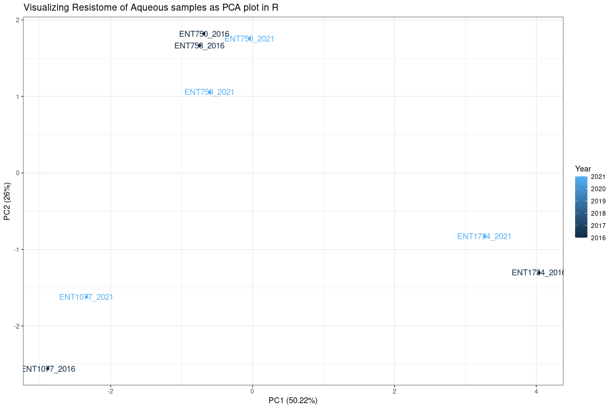
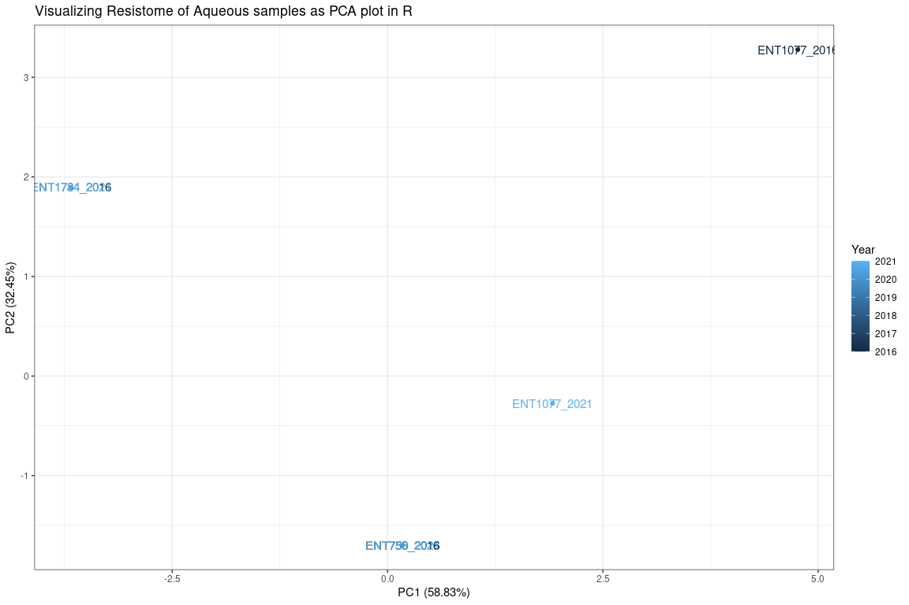

## Raw Reads

Run resfinder on raw reads


```bash

time for d in $(ls -d */ | tr -d "/");  do  echo $d; cd $d; time python3 /storage/apps/resfinder4.1/run_resfinder.py -o "$d"_resfinder_outdir -s "Other" -l 0.6 -t 0.8 --acquired -ifq *R1*.fastq.gz *R2*.fastq.gz & cd ..;done


time for d in $(ls -d */ | tr -d "/");  do  echo $d; cd $d; time python3 /storage/apps/resfinder4.1/run_resfinder.py -o "$d"_resfinder_outdir -s "Other" -l 0.6 -t 0.8 --acquired -ifq *_1.fq.gz *_2.fq.gz & cd ..;done

$ awk '{print FILENAME "\t" $0}' */ResFinder_results_tab.txt  | tr ' ' '_' | cut -f1-9 -d "   " | sed -e 's/_resfinder_outdir\/ResFinder_results_tab.txt/_2016/g' |  awk '$3>=80 && $5>=80'| awk '{print $1 "\t" $2}' | sort -u | grep -v 'Resistance_gene' | groupBy -g 1 -c 2 -o collapse >cge_resfinder_resistome.tab

awk '{print FILENAME "\t" $0}' */ResFinder_results_tab.txt  | tr ' ' '_' | cut -f1-9 -d "   " | sed -e 's/_resfinder_outdir\/ResFinder_results_tab.txt/_2021/g' |  awk '$3>=80 && $5>=80'| awk '{print $1 "\t" $2}' | sort -u | grep -v 'Resistance_gene' | groupBy -g 1 -c 2 -o collapse >cge_resfinder_resistome.tab

cat */cge_resfinder_resistome.tab >combined_cge_resfinder_resistome.tab

# ENT1077_2021	blaKPC-2,blaSHV-11,blaTEM-1B,dfrA14,fosA,fosA6,mph(A),OqxA,OqxB,qnrB1,tet(A)
# ENT1734_2021	aac(6')-Ib-cr,blaKPC-2,blaOXA-1,blaSHV-190,blaTEM-1B,fosA,fosA5,fosA6,mph(A),OqxA,OqxB
# ENT750_2021	blaKPC-2,blaSHV-11,blaSHV-67,blaTEM-1B,fosA,fosA5,fosA6,mph(A),OqxA,OqxB
# ENT758_2021	blaKPC-2,blaSHV-11,blaTEM-1B,fosA,fosA6,mph(A),OqxA,OqxB
# ENT1077_2016	blaKPC-2,blaSHV-11,blaTEM-182,blaTEM-1B,dfrA14,fosA,fosA6,mph(A),OqxA,OqxB,qnrB1,tet(A)
# ENT1734_2016	aac(6')-Ib11,aac(6')-Ib-cr,blaKPC-2,blaOXA-1,blaSHV-190,blaTEM-1B,fosA,fosA5,fosA6,mph(A),OqxA,OqxB
# ENT750_2016	blaKPC-2,blaSHV-11,blaSHV-67,blaTEM-1B,fosA,fosA6,mph(A),OqxA,OqxB
# ENT758_2016	blaKPC-2,blaSHV-11,blaTEM-1B,fosA,mph(A),OqxA,OqxB

```

Lets draw PCA plot using resistome generated from Raw Reads


```r
setwd("/data02/Analysis/for_Colloborators/for_Xueli/Compare_shortReads")

library(broom)
library(ggfortify)
library(plotly)
library(tidyverse)
library(janitor)
library(kableExtra)

# DATA ----
cge_df <- read.table("combined_cge_resfinder_resistome.tab",sep = "\t", header = TRUE,quote = "")

head(cge_df) %>% 
  kbl(caption = "Head sample output") %>%
  kable_classic_2(full_width = F)
```

<table class=" lightable-classic-2" style='font-family: "Arial Narrow", "Source Sans Pro", sans-serif; width: auto !important; margin-left: auto; margin-right: auto;'>
<caption>Head sample output</caption>
 <thead>
  <tr>
   <th style="text-align:left;"> SampleName </th>
   <th style="text-align:right;"> Year </th>
   <th style="text-align:left;"> resistance </th>
  </tr>
 </thead>
<tbody>
  <tr>
   <td style="text-align:left;"> ENT1077_2021 </td>
   <td style="text-align:right;"> 2021 </td>
   <td style="text-align:left;"> blaKPC-2,blaSHV-11,blaTEM-1B,dfrA14,fosA,fosA6,mph(A),OqxA,OqxB,qnrB1,tet(A) </td>
  </tr>
  <tr>
   <td style="text-align:left;"> ENT1734_2021 </td>
   <td style="text-align:right;"> 2021 </td>
   <td style="text-align:left;"> aac(6')-Ib-cr,blaKPC-2,blaOXA-1,blaSHV-190,blaTEM-1B,fosA,fosA5,fosA6,mph(A),OqxA,OqxB </td>
  </tr>
  <tr>
   <td style="text-align:left;"> ENT750_2021 </td>
   <td style="text-align:right;"> 2021 </td>
   <td style="text-align:left;"> blaKPC-2,blaSHV-11,blaSHV-67,blaTEM-1B,fosA,fosA5,fosA6,mph(A),OqxA,OqxB </td>
  </tr>
  <tr>
   <td style="text-align:left;"> ENT758_2021 </td>
   <td style="text-align:right;"> 2021 </td>
   <td style="text-align:left;"> blaKPC-2,blaSHV-11,blaTEM-1B,fosA,fosA6,mph(A),OqxA,OqxB </td>
  </tr>
  <tr>
   <td style="text-align:left;"> ENT1077_2016 </td>
   <td style="text-align:right;"> 2016 </td>
   <td style="text-align:left;"> blaKPC-2,blaSHV-11,blaTEM-182,blaTEM-1B,dfrA14,fosA,fosA6,mph(A),OqxA,OqxB,qnrB1,tet(A) </td>
  </tr>
  <tr>
   <td style="text-align:left;"> ENT1734_2016 </td>
   <td style="text-align:right;"> 2016 </td>
   <td style="text-align:left;"> aac(6')-Ib11,aac(6')-Ib-cr,blaKPC-2,blaOXA-1,blaSHV-190,blaTEM-1B,fosA,fosA5,fosA6,mph(A),OqxA,OqxB </td>
  </tr>
</tbody>
</table>

```r
# DATA WRANGLING ----
# - dplyr is covered in DS4B 101-R Weeks 2 & 3

# * Extract Target (Y) ----
y_tbl <- cge_df %>%
  select(SampleName,Year) %>%
  rowid_to_column()

head(y_tbl) %>% 
  kbl(caption = "Head sample output") %>%
  kable_classic_2(full_width = F)
```

<table class=" lightable-classic-2" style='font-family: "Arial Narrow", "Source Sans Pro", sans-serif; width: auto !important; margin-left: auto; margin-right: auto;'>
<caption>Head sample output</caption>
 <thead>
  <tr>
   <th style="text-align:right;"> rowid </th>
   <th style="text-align:left;"> SampleName </th>
   <th style="text-align:right;"> Year </th>
  </tr>
 </thead>
<tbody>
  <tr>
   <td style="text-align:right;"> 1 </td>
   <td style="text-align:left;"> ENT1077_2021 </td>
   <td style="text-align:right;"> 2021 </td>
  </tr>
  <tr>
   <td style="text-align:right;"> 2 </td>
   <td style="text-align:left;"> ENT1734_2021 </td>
   <td style="text-align:right;"> 2021 </td>
  </tr>
  <tr>
   <td style="text-align:right;"> 3 </td>
   <td style="text-align:left;"> ENT750_2021 </td>
   <td style="text-align:right;"> 2021 </td>
  </tr>
  <tr>
   <td style="text-align:right;"> 4 </td>
   <td style="text-align:left;"> ENT758_2021 </td>
   <td style="text-align:right;"> 2021 </td>
  </tr>
  <tr>
   <td style="text-align:right;"> 5 </td>
   <td style="text-align:left;"> ENT1077_2016 </td>
   <td style="text-align:right;"> 2016 </td>
  </tr>
  <tr>
   <td style="text-align:right;"> 6 </td>
   <td style="text-align:left;"> ENT1734_2016 </td>
   <td style="text-align:right;"> 2016 </td>
  </tr>
</tbody>
</table>

```r
# unique(cge_df$mlst) # Not dealing with MLST

# * Encode Features (X) ----
x_tbl <- cge_df %>%
  
  # Add Row ID to maintain order
  rowid_to_column() %>%
  
  # Resistance split
  filter(!(is.na(resistance)|resistance=="")) %>% 
  mutate(rn = row_number()) %>% 
  separate_rows(resistance,sep = ",") %>%
  mutate(i1 = 1) %>% 
  pivot_wider(names_from = resistance, values_from = i1, values_fill = list(i1 = 0)) %>% 
   select(-rn, -SampleName,-Year)

#x_tbl 
#x_tbl %>% glimpse()

x_tbl_Janitor = janitor::clean_names(x_tbl)

# See how the names are changed by janitor package
#data.frame(mymsa = colnames(x_tbl), x = colnames(x_tbl_Janitor))

#x_tbl_Janitor %>% glimpse()

# PCA  ----
# - Modeling the Principal Components
# - Modeling & Machine Learning is covered in DS4B 101-R Week 6

#str(x_tbl)
#summary(x_tbl_Janitor)
#str(x_tbl_Janitor)

# Check if the columns are all numeric

#is.numeric(as.matrix(x_tbl_Janitor))
#which(!grepl('^[0-9]',x_tbl_Janitor))

#Remove all the columns which have a constant variance.
nums <- unlist(lapply(x_tbl_Janitor, is.numeric))
#nums

x_tbl_Janitor_new <- x_tbl_Janitor[, nums]
x_tbl_Janitor_new <- x_tbl_Janitor_new[, apply(x_tbl_Janitor_new, 2, var) != 0]

#x_tbl_Janitor_new

fit_pca <- prcomp(
  formula = ~ . - rowid,
  data    = x_tbl_Janitor_new,
  scale.  = TRUE)

#fit_pca 


fit_pca %>% tidy() %>% head() %>% 
  kbl(caption = "Head sample output") %>%
  kable_classic_2(full_width = F)
```

<table class=" lightable-classic-2" style='font-family: "Arial Narrow", "Source Sans Pro", sans-serif; width: auto !important; margin-left: auto; margin-right: auto;'>
<caption>Head sample output</caption>
 <thead>
  <tr>
   <th style="text-align:left;"> row </th>
   <th style="text-align:right;"> PC </th>
   <th style="text-align:right;"> value </th>
  </tr>
 </thead>
<tbody>
  <tr>
   <td style="text-align:left;"> 1 </td>
   <td style="text-align:right;"> 1 </td>
   <td style="text-align:right;"> -2.3394027 </td>
  </tr>
  <tr>
   <td style="text-align:left;"> 1 </td>
   <td style="text-align:right;"> 2 </td>
   <td style="text-align:right;"> -1.6197097 </td>
  </tr>
  <tr>
   <td style="text-align:left;"> 1 </td>
   <td style="text-align:right;"> 3 </td>
   <td style="text-align:right;"> 0.0256077 </td>
  </tr>
  <tr>
   <td style="text-align:left;"> 1 </td>
   <td style="text-align:right;"> 4 </td>
   <td style="text-align:right;"> -0.4135121 </td>
  </tr>
  <tr>
   <td style="text-align:left;"> 1 </td>
   <td style="text-align:right;"> 5 </td>
   <td style="text-align:right;"> 1.3173547 </td>
  </tr>
  <tr>
   <td style="text-align:left;"> 1 </td>
   <td style="text-align:right;"> 6 </td>
   <td style="text-align:right;"> -0.4766341 </td>
  </tr>
</tbody>
</table>

```r
# VISUALIZE PCA ggbiplot----
# - Visualization with ggplot is covered in DSRB 101-R Week 4
# library(devtools)
# install_github("vqv/ggbiplot")
# 
# library(ggbiplot)
# 
# ggbp <- ggbiplot(fit_pca)
# ggbp <- ggbiplot(fit_pca, labels=rownames(y_tbl$SampleName))
# plotly::ggplotly(ggbp)

# VISUALIZE PCA ----
# - Visualization with ggplot is covered in DSRB 101-R Week 4

# Autoplot 1

library(factoextra)
library(ggforce)

g <- autoplot(
  object = fit_pca,
  x = 1,
  y = 2,
  
  # Labels
  data = y_tbl,
  label = TRUE,
  label.label = "SampleName",
  label.size = 4,
  
  colour = 'Year',
  
  # LOADINGS
  loadings.label = FALSE,
  loadings.label.size = 2,
  
  scale = 0,
  
  frame = FALSE,
  frame.type = 'norm',
  #frame.colour = 'Species'
) +
  labs(title = "Visualizing Resistome of Aqueous samples as PCA plot in R") +
  theme_bw() #+   
  #ggforce::geom_mark_ellipse(aes(fill = Year, color = Year)) #+
  #coord_equal()

g
```

<!-- -->

```r
#class(g)
#plotly::ggplotly(g)
```
## Assembly

Let us run Assembly now using SPAdes


```bash
time while read line; 
do 
spOut=`echo "$line" | sed 's/-1 //g' | awk -F/ '{print $2"_"$1"_spades_out"}'`; 
spades.py $line -o $spOut --careful -t 48 ; 
done < <(ls -1 */*/*gz | paste  - - | awk '{print "-1 "$1" -2 "$2}')
```

Extract resistome


```bash
awk '{print FILENAME "\t" $0}' */ResFinder_results_tab.txt  | tr ' ' '_' | cut -f1-9 -d "   " | sed -e 's/_resfinder_outdir\/ResFinder_results_tab.txt/_2021/g' |  awk '$3>=80 && $5>=80'| awk '{print $1 "\t" $2}' | sort -u | grep -v 'Resistance_gene' | groupBy -g 1 -c 2 -o collapse >cge_resfinder_resistome.tab
```

Lets draw PCA plot using resistome generated from Raw Reads


```r
setwd("/data02/Analysis/for_Colloborators/for_Xueli/Compare_shortReads")

library(broom)
library(ggfortify)
library(plotly)
library(tidyverse)
library(janitor)
library(kableExtra)

# DATA ----
cge_df <- read.table("cge_resfinder_resistome_fromAssemblies.tab",sep = "\t", header = TRUE,quote = "")

cge_df %>% 
  kbl(caption = "Head sample output") %>%
  kable_classic_2(full_width = F)
```

<table class=" lightable-classic-2" style='font-family: "Arial Narrow", "Source Sans Pro", sans-serif; width: auto !important; margin-left: auto; margin-right: auto;'>
<caption>Head sample output</caption>
 <thead>
  <tr>
   <th style="text-align:left;"> SampleName </th>
   <th style="text-align:right;"> Year </th>
   <th style="text-align:left;"> resistance </th>
  </tr>
 </thead>
<tbody>
  <tr>
   <td style="text-align:left;"> ENT1077_2016 </td>
   <td style="text-align:right;"> 2016 </td>
   <td style="text-align:left;"> blaKPC-2,blaSHV-11,blaSHV-67,blaTEM-104,blaTEM-198,blaTEM-1B,blaTEM-217,blaTEM-234,dfrA14,fosA,mdf(A),mph(A),OqxA,OqxB,qnrB1,tet(A) </td>
  </tr>
  <tr>
   <td style="text-align:left;"> ENT1077_2021 </td>
   <td style="text-align:right;"> 2021 </td>
   <td style="text-align:left;"> blaKPC-2,blaSHV-11,blaSHV-67,blaTEM-1B,dfrA14,fosA,mdf(A),mph(A),OqxA,OqxB,qnrB1,tet(A) </td>
  </tr>
  <tr>
   <td style="text-align:left;"> ENT1734_2016 </td>
   <td style="text-align:right;"> 2016 </td>
   <td style="text-align:left;"> aac(6')-Ib-cr,blaKPC-2,blaOXA-1,blaSHV-190,blaTEM-1B,fosA,mph(A),OqxA,OqxB </td>
  </tr>
  <tr>
   <td style="text-align:left;"> ENT1734_2021 </td>
   <td style="text-align:right;"> 2021 </td>
   <td style="text-align:left;"> aac(6')-Ib-cr,blaKPC-2,blaOXA-1,blaSHV-190,blaTEM-1B,fosA,mph(A),OqxA,OqxB </td>
  </tr>
  <tr>
   <td style="text-align:left;"> ENT750_2016 </td>
   <td style="text-align:right;"> 2016 </td>
   <td style="text-align:left;"> blaKPC-2,blaSHV-11,blaSHV-67,blaTEM-1B,fosA,mdf(A),mph(A),OqxA,OqxB </td>
  </tr>
  <tr>
   <td style="text-align:left;"> ENT750_2021 </td>
   <td style="text-align:right;"> 2021 </td>
   <td style="text-align:left;"> blaKPC-2,blaSHV-11,blaSHV-67,blaTEM-1B,fosA,mdf(A),mph(A),OqxA,OqxB </td>
  </tr>
  <tr>
   <td style="text-align:left;"> ENT758_2016 </td>
   <td style="text-align:right;"> 2016 </td>
   <td style="text-align:left;"> blaKPC-2,blaSHV-11,blaSHV-67,blaTEM-1B,fosA,mdf(A),mph(A),OqxA,OqxB </td>
  </tr>
  <tr>
   <td style="text-align:left;"> ENT758_2021 </td>
   <td style="text-align:right;"> 2021 </td>
   <td style="text-align:left;"> blaKPC-2,blaSHV-11,blaSHV-67,blaTEM-1B,fosA,mdf(A),mph(A),OqxA,OqxB </td>
  </tr>
</tbody>
</table>

```r
# DATA WRANGLING ----
# - dplyr is covered in DS4B 101-R Weeks 2 & 3

# * Extract Target (Y) ----
y_tbl <- cge_df %>%
  select(SampleName,Year) %>%
  rowid_to_column()

head(y_tbl) %>% 
  kbl(caption = "Head sample output") %>%
  kable_classic_2(full_width = F)
```

<table class=" lightable-classic-2" style='font-family: "Arial Narrow", "Source Sans Pro", sans-serif; width: auto !important; margin-left: auto; margin-right: auto;'>
<caption>Head sample output</caption>
 <thead>
  <tr>
   <th style="text-align:right;"> rowid </th>
   <th style="text-align:left;"> SampleName </th>
   <th style="text-align:right;"> Year </th>
  </tr>
 </thead>
<tbody>
  <tr>
   <td style="text-align:right;"> 1 </td>
   <td style="text-align:left;"> ENT1077_2016 </td>
   <td style="text-align:right;"> 2016 </td>
  </tr>
  <tr>
   <td style="text-align:right;"> 2 </td>
   <td style="text-align:left;"> ENT1077_2021 </td>
   <td style="text-align:right;"> 2021 </td>
  </tr>
  <tr>
   <td style="text-align:right;"> 3 </td>
   <td style="text-align:left;"> ENT1734_2016 </td>
   <td style="text-align:right;"> 2016 </td>
  </tr>
  <tr>
   <td style="text-align:right;"> 4 </td>
   <td style="text-align:left;"> ENT1734_2021 </td>
   <td style="text-align:right;"> 2021 </td>
  </tr>
  <tr>
   <td style="text-align:right;"> 5 </td>
   <td style="text-align:left;"> ENT750_2016 </td>
   <td style="text-align:right;"> 2016 </td>
  </tr>
  <tr>
   <td style="text-align:right;"> 6 </td>
   <td style="text-align:left;"> ENT750_2021 </td>
   <td style="text-align:right;"> 2021 </td>
  </tr>
</tbody>
</table>

```r
# unique(cge_df$mlst) # Not dealing with MLST

# * Encode Features (X) ----
x_tbl <- cge_df %>%
  
  # Add Row ID to maintain order
  rowid_to_column() %>%
  
  # Resistance split
  filter(!(is.na(resistance)|resistance=="")) %>% 
  mutate(rn = row_number()) %>% 
  separate_rows(resistance,sep = ",") %>%
  mutate(i1 = 1) %>% 
  pivot_wider(names_from = resistance, values_from = i1, values_fill = list(i1 = 0)) %>% 
   select(-rn, -SampleName,-Year)

#x_tbl 
#x_tbl %>% glimpse()

x_tbl_Janitor = janitor::clean_names(x_tbl)

# See how the names are changed by janitor package
#data.frame(mymsa = colnames(x_tbl), x = colnames(x_tbl_Janitor))

#x_tbl_Janitor %>% glimpse()

# PCA  ----
# - Modeling the Principal Components
# - Modeling & Machine Learning is covered in DS4B 101-R Week 6

#str(x_tbl)
#summary(x_tbl_Janitor)
#str(x_tbl_Janitor)

# Check if the columns are all numeric

#is.numeric(as.matrix(x_tbl_Janitor))
#which(!grepl('^[0-9]',x_tbl_Janitor))

#Remove all the columns which have a constant variance.
nums <- unlist(lapply(x_tbl_Janitor, is.numeric))
#nums

x_tbl_Janitor_new <- x_tbl_Janitor[, nums]
x_tbl_Janitor_new <- x_tbl_Janitor_new[, apply(x_tbl_Janitor_new, 2, var) != 0]

#x_tbl_Janitor_new

fit_pca <- prcomp(
  formula = ~ . - rowid,
  data    = x_tbl_Janitor_new,
  scale.  = TRUE)

#fit_pca 


fit_pca %>% tidy() %>% head() %>% 
  kbl(caption = "Head sample output") %>%
  kable_classic_2(full_width = F)
```

<table class=" lightable-classic-2" style='font-family: "Arial Narrow", "Source Sans Pro", sans-serif; width: auto !important; margin-left: auto; margin-right: auto;'>
<caption>Head sample output</caption>
 <thead>
  <tr>
   <th style="text-align:left;"> row </th>
   <th style="text-align:right;"> PC </th>
   <th style="text-align:right;"> value </th>
  </tr>
 </thead>
<tbody>
  <tr>
   <td style="text-align:left;"> 1 </td>
   <td style="text-align:right;"> 1 </td>
   <td style="text-align:right;"> 4.7632293 </td>
  </tr>
  <tr>
   <td style="text-align:left;"> 1 </td>
   <td style="text-align:right;"> 2 </td>
   <td style="text-align:right;"> 3.2776846 </td>
  </tr>
  <tr>
   <td style="text-align:left;"> 1 </td>
   <td style="text-align:right;"> 3 </td>
   <td style="text-align:right;"> -0.8327245 </td>
  </tr>
  <tr>
   <td style="text-align:left;"> 1 </td>
   <td style="text-align:right;"> 4 </td>
   <td style="text-align:right;"> 0.0000000 </td>
  </tr>
  <tr>
   <td style="text-align:left;"> 1 </td>
   <td style="text-align:right;"> 5 </td>
   <td style="text-align:right;"> 0.0000000 </td>
  </tr>
  <tr>
   <td style="text-align:left;"> 1 </td>
   <td style="text-align:right;"> 6 </td>
   <td style="text-align:right;"> 0.0000000 </td>
  </tr>
</tbody>
</table>

```r
# VISUALIZE PCA ggbiplot----
# - Visualization with ggplot is covered in DSRB 101-R Week 4
# library(devtools)
# install_github("vqv/ggbiplot")
# 
# library(ggbiplot)
# 
# ggbp <- ggbiplot(fit_pca)
# ggbp <- ggbiplot(fit_pca, labels=rownames(y_tbl$SampleName))
# plotly::ggplotly(ggbp)

# VISUALIZE PCA ----
# - Visualization with ggplot is covered in DSRB 101-R Week 4

# Autoplot 1

library(factoextra)
library(ggforce)

g <- autoplot(
  object = fit_pca,
  x = 1,
  y = 2,
  
  # Labels
  data = y_tbl,
  label = TRUE,
  label.label = "SampleName",
  label.size = 4,
  
  colour = 'Year',
  
  # LOADINGS
  loadings.label = FALSE,
  loadings.label.size = 2,
  
  scale = 0,
  
  frame = FALSE,
  frame.type = 'norm',
  #frame.colour = 'Species'
) +
  labs(title = "Visualizing Resistome of Aqueous samples as PCA plot in R") +
  theme_bw() #+   
  #ggforce::geom_mark_ellipse(aes(fill = Year, color = Year)) #+
  #coord_equal()

g
```

<!-- -->

```r
#class(g)
#plotly::ggplotly(g)
```

Clearly there is a difference between resistomes using raw reads and assembly
