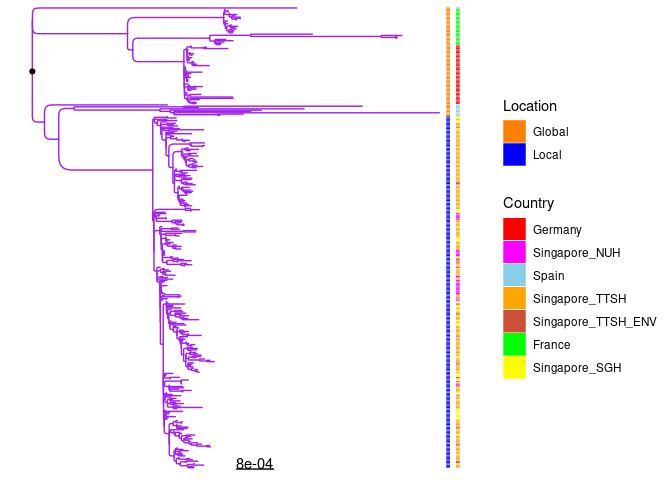
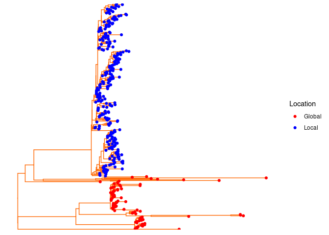

## R Markdown

This is full tree plot code for PAE project


```r
library(ggtree)
```

```
## Registered S3 methods overwritten by 'tibble':
##   method     from  
##   format.tbl pillar
##   print.tbl  pillar
```

```
## ggtree v3.3.0  For help: https://yulab-smu.top/treedata-book/
## 
## If you use ggtree in published research, please cite the most appropriate paper(s):
## 
## 1. Guangchuang Yu. Using ggtree to visualize data on tree-like structures. Current Protocols in Bioinformatics. 2020, 69:e96. doi:10.1002/cpbi.96
## 2. Guangchuang Yu, Tommy Tsan-Yuk Lam, Huachen Zhu, Yi Guan. Two methods for mapping and visualizing associated data on phylogeny using ggtree. Molecular Biology and Evolution. 2018, 35(12):3041-3043. doi:10.1093/molbev/msy194
## 3. Guangchuang Yu, David Smith, Huachen Zhu, Yi Guan, Tommy Tsan-Yuk Lam. ggtree: an R package for visualization and annotation of phylogenetic trees with their covariates and other associated data. Methods in Ecology and Evolution. 2017, 8(1):28-36. doi:10.1111/2041-210X.12628
```

```r
library(tidytree)
```

```
## 
## Attaching package: 'tidytree'
```

```
## The following object is masked from 'package:stats':
## 
##     filter
```

```r
library(treeio)
```

```
## treeio v1.19.0  For help: https://yulab-smu.top/treedata-book/
## 
## If you use treeio in published research, please cite:
## 
## LG Wang, TTY Lam, S Xu, Z Dai, L Zhou, T Feng, P Guo, CW Dunn, BR Jones, T Bradley, H Zhu, Y Guan, Y Jiang, G Yu. treeio: an R package for phylogenetic tree input and output with richly annotated and associated data. Molecular Biology and Evolution 2020, 37(2):599-603. doi: 10.1093/molbev/msz240
```

```r
library(lubridate)
```

```
## 
## Attaching package: 'lubridate'
```

```
## The following objects are masked from 'package:base':
## 
##     date, intersect, setdiff, union
```

```r
library(ggplot2)
library(reshape2)
library(ggtreeExtra)
```

```
## ggtreeExtra v1.5.2  For help: https://yulab-smu.top/treedata-book/
## 
## If you use ggtreeExtra in published research, please cite the paper:
## 
## S Xu, Z Dai, P Guo, X Fu, S Liu, L Zhou, W Tang, T Feng, M Chen, L Zhan, T Wu, E Hu, Y Jiang, X Bo, G Yu. ggtreeExtra: Compact visualization of richly annotated phylogenetic data. Molecular Biology and Evolution 2021, 38(9):4039-4042. doi: 10.1093/molbev/msab166
```

```r
library(ggnewscale)
library(RColorBrewer)
library(cowplot)
```

```
## 
## Attaching package: 'cowplot'
```

```
## The following object is masked from 'package:lubridate':
## 
##     stamp
```

```r
library(tidyverse)
```

```
## ── Attaching packages ─────────────────────────────────────── tidyverse 1.3.0 ──
```

```
## ✓ tibble  3.0.3     ✓ dplyr   1.0.6
## ✓ tidyr   1.1.2     ✓ stringr 1.4.0
## ✓ readr   2.1.1     ✓ forcats 0.5.0
## ✓ purrr   0.3.4
```

```
## ── Conflicts ────────────────────────────────────────── tidyverse_conflicts() ──
## x lubridate::as.difftime() masks base::as.difftime()
## x lubridate::date()        masks base::date()
## x tidyr::expand()          masks ggtree::expand()
## x dplyr::filter()          masks tidytree::filter(), stats::filter()
## x lubridate::intersect()   masks base::intersect()
## x dplyr::lag()             masks stats::lag()
## x lubridate::setdiff()     masks base::setdiff()
## x cowplot::stamp()         masks lubridate::stamp()
## x lubridate::union()       masks base::union()
```

```r
library(data.table)
```

```
## 
## Attaching package: 'data.table'
```

```
## The following objects are masked from 'package:dplyr':
## 
##     between, first, last
```

```
## The following object is masked from 'package:purrr':
## 
##     transpose
```

```
## The following objects are masked from 'package:reshape2':
## 
##     dcast, melt
```

```
## The following objects are masked from 'package:lubridate':
## 
##     hour, isoweek, mday, minute, month, quarter, second, wday, week,
##     yday, year
```

```r
########################################-----DIFFERENT ANALYSIS - PHYLOGENETIC TREE + TTSH SAMPLES -------#########################################
# Load BEAST Tree
setwd("/data02/Analysis/Projects/6_Paeruginosa_ST308_Singapore_vs_Global/Roary/CoreGenome")

beast_tree <- read.tree(file = "postGubbins.filtered_polymorphic_sites_wo2_P_PA.oneline.fasta.treefile")
plot(beast_tree)
```

<!-- -->

```r
ggtree(beast_tree) + geom_treescale()
```

<!-- -->

```r
ggtree(beast_tree) + geom_treescale() + theme_tree2()
```

<!-- -->

```r
ggtree(beast_tree) + geom_treescale() + geom_tiplab()
```

<!-- -->

```r
ggtree(beast_tree) + geom_treescale() + xlim(0, 10) + geom_tiplab(size=2,align=F,linesize=0.5)
```

<!-- -->

```r
# Let us re-root the tree

bootTree_rooted <- ape::root(beast_tree, outgroup = c('PAO1_reference'), edgelabel = TRUE) 
ggtree(bootTree_rooted) + geom_treescale() + geom_tiplab() 
```

<!-- -->

```r
ggtree(bootTree_rooted) + geom_treescale() + geom_tiplab() + geom_rootpoint()
```

<!-- -->

```r
ggtree(bootTree_rooted, right = FALSE) + geom_treescale() + geom_tiplab() + geom_rootpoint()
```

<!-- -->

```r
ggtree(bootTree_rooted, right = TRUE) + xlim(0, 0.025) + geom_treescale() + geom_tiplab(size=2,align=F,linesize=0.5) + geom_rootpoint()
```

<!-- -->

```r
# Since the PAO1 reference is too far from rest of samples, for time being it is pruned from the tree object

to_drop <- c("PAO1_reference")
thetree_wo_ref <- as.phylo(bootTree_rooted)
nhx_reduced <- drop.tip(thetree_wo_ref, to_drop)

# Default layout
thetree <- ggtree(nhx_reduced) + geom_treescale() + geom_tiplab(size=2,align=F,linesize=0.5) + geom_rootpoint()

# layout = roundrect
thetree <- ggtree(nhx_reduced,layout='roundrect', ladderize = TRUE, right = TRUE) + 
            geom_treescale() + geom_tiplab(size=2,align=F,linesize=0.5) + geom_rootpoint()

# layout = circular
thetree <- ggtree(nhx_reduced,layout='circular', ladderize = TRUE, right = TRUE) + 
  xlim(0, 0.008) + geom_treescale() + geom_tiplab(size=2,align=F,linesize=0.5) + geom_rootpoint()

# layout = roundrect
thetree <- ggtree(nhx_reduced,layout='roundrect', colour="purple", ladderize = TRUE, right = TRUE) + 
   geom_treescale() + geom_tiplab(size=2,align=F,linesize=0.5) + geom_rootpoint()

thetree
```

<!-- -->

```r
# Lets add metadata - institution

# Add Meta-data into dataframe
meta = read.table("/data02/Analysis/Projects/6_Paeruginosa_ST308_Singapore_vs_Global/Roary/CoreGenome/metadata.txt", 
                         sep = "\t", header = TRUE)

head(meta)
```

```
##    Sample Country Location
## 1 10_E_PA Germany   Global
## 2 10_P_PA Germany   Global
## 3 11_E_PA Germany   Global
## 4 11_P_PA Germany   Global
## 5 12_E_PA Germany   Global
## 6 12_P_PA Germany   Global
```

```r
thetree_byCountry <- thetree %<+% meta + geom_tiplab(align=F, linesize=.1, size =2, aes(col=Country)) 
thetree_byLocation <- thetree %<+% meta + geom_tiplab(align=F, linesize=.1, size =2, aes(col=Location)) 

# Let's combine the plots using cowplot package function
plot_grid(thetree_byCountry, thetree_byLocation, labels = c('By Country', 'Local vs International'), label_size = 12)
```

<!-- -->

```r
# Add heatmap


meta_gheatmap <- meta # let's not disturb original dataframe, create a new one

meta_gheatmap <- data.frame(column_to_rownames(meta, var = "Sample"),check.names = FALSE) #assign ID to rownames for compatibility for gheatmap
head(meta_gheatmap)
```

```
##         Country Location
## 10_E_PA Germany   Global
## 10_P_PA Germany   Global
## 11_E_PA Germany   Global
## 11_P_PA Germany   Global
## 12_E_PA Germany   Global
## 12_P_PA Germany   Global
```

```r
meta_gheatmap_loc <- meta_gheatmap %>% select(Location)

#-----------> Adding the Location - Is the isolate local or international

gheatmap(thetree_byLocation, meta_gheatmap_loc, offset = 0, width = 1,
         colnames_position = "top",
         colnames_offset_y = 1) +
  scale_fill_viridis_d(option = "D", name = "Clade") + coord_cartesian(clip = "off")
```

```
## Scale for 'fill' is already present. Adding another scale for 'fill', which
## will replace the existing scale.
```

<!-- -->

```r
# Let's beautify the plot a bit more

# With tip labels
p10 <- ggtree(nhx_reduced,layout='roundrect', colour="purple", ladderize = TRUE, right = TRUE) + 
  geom_treescale() + geom_tiplab(size=2,align=T,linesize=0.005,offset=0.0002) + geom_rootpoint()

# add heatmap
p10 <- gheatmap(p10, meta_gheatmap_loc, offset=0.0001, width=0.01, low="darkorange1", high="blue", colnames = FALSE, font.size=2, color="black") +
  scale_fill_manual(values=c("darkorange1","blue"),name="Location")
```

```
## Scale for 'y' is already present. Adding another scale for 'y', which will
## replace the existing scale.
```

```
## Scale for 'fill' is already present. Adding another scale for 'fill', which
## will replace the existing scale.
```

```r
#p10 

# Without tip labels
p11 <- ggtree(nhx_reduced,layout='roundrect', colour="purple", ladderize = TRUE, right = TRUE) + 
  geom_treescale() + geom_rootpoint()

# add heatmap
p11 <- gheatmap(p11, meta_gheatmap_loc, offset=0.0001, width=0.01, low="darkorange1", high="blue", colnames = FALSE) +
  scale_fill_manual(values=c("Global"="darkorange1","Local"="blue"), name="Location")
```

```
## Scale for 'y' is already present. Adding another scale for 'y', which will
## replace the existing scale.
## Scale for 'fill' is already present. Adding another scale for 'fill', which
## will replace the existing scale.
```

```r
p11
```

<!-- -->

```r
# Let's combine the plots using cowplot package function
plot_grid(p10, p11, labels = c('With Tip Labels', 'Without Tip Labels'), label_size = 12)
```

<!-- -->

```r
#-----------> Adding the Country 

# I want to add on another layer called Country, so I will take previous pretty p11 plot
meta_gheatmap_ctry <- meta_gheatmap %>% select(Country)

p12 <- p11 + new_scale_fill()


# add heatmap
p13 <- gheatmap(p12, meta_gheatmap_ctry, offset=0.0003, width=0.01, colnames = FALSE) +
  scale_fill_manual(values=c("Germany"="red","Spain"="skyblue","France"="Green", 
                             "Singapore_NUH"="magenta", "Singapore_TTSH"="orange", "Singapore_TTSH_ENV"="tomato3",
                             "Singapore_SGH"="yellow"), 
                    name="Country") 
```

```
## Scale for 'y' is already present. Adding another scale for 'y', which will
## replace the existing scale.
## Scale for 'fill' is already present. Adding another scale for 'fill', which
## will replace the existing scale.
```

```r
p13
```

<!-- -->

```r
p14 <- gheatmap(p12, meta_gheatmap_ctry, offset=0.0003, width=0.01, colnames = FALSE) +
  scale_fill_manual(values=c("Germany"="red","Spain"="skyblue","France"="Green", 
                             "Singapore_NUH"="magenta", "Singapore_TTSH"="orange", "Singapore_TTSH_ENV"="tomato3",
                             "Singapore_SGH"="yellow"), 
                    breaks=c("Germany","Singapore_NUH","Spain","Singapore_TTSH","Singapore_TTSH_ENV","France","Singapore_SGH"),name="Country") 
```

```
## Scale for 'y' is already present. Adding another scale for 'y', which will
## replace the existing scale.
## Scale for 'fill' is already present. Adding another scale for 'fill', which
## will replace the existing scale.
```

```r
p14
```

<!-- -->

```r
# Let's combine the plots using cowplot package function
plot_grid(p13, p14, labels = c('With Breaks', 'Without breaks'), label_size = 12)
```

<!-- -->

```r
#-------> Spread the countries across multiple layers

meta_gh_color <- meta
head(meta_gh_color)
```

```
##    Sample Country Location
## 1 10_E_PA Germany   Global
## 2 10_P_PA Germany   Global
## 3 11_E_PA Germany   Global
## 4 11_P_PA Germany   Global
## 5 12_E_PA Germany   Global
## 6 12_P_PA Germany   Global
```

```r
# Let us assign a color value for each country
meta_gh_color <- meta_gh_color %>%
  mutate(Color = case_when(
    grepl("Germany", Country) ~ 'red',
    grepl("Spain", Country) ~ 'skyblue',
    grepl("France", Country) ~ 'Green',
    grepl("Singapore_NUH", Country) ~ 'magenta',
    grepl("^Singapore_TTSH$", Country) ~ 'orange',
    grepl("Singapore_TTSH_ENV", Country) ~ 'red',
    grepl("Germany", Country) ~ 'tomato3',
    grepl("Singapore_SGH", Country) ~ 'yellow'))

meta_gh_color <- meta_gh_color %>%
  mutate(Color = case_when(
    grepl("Global", Location) ~ 'red',
    grepl("Local", Location) ~ 'blue',
    ))

#view(meta_gh_color)
head(meta_gh_color)
```

```
##    Sample Country Location Color
## 1 10_E_PA Germany   Global   red
## 2 10_P_PA Germany   Global   red
## 3 11_E_PA Germany   Global   red
## 4 11_P_PA Germany   Global   red
## 5 12_E_PA Germany   Global   red
## 6 12_P_PA Germany   Global   red
```

```r
meta_gh_color %>% filter(Country=="Singapore_TTSH_ENV")
```

```
##    Sample            Country Location Color
## 1   C1000 Singapore_TTSH_ENV    Local  blue
## 2   C1042 Singapore_TTSH_ENV    Local  blue
## 3   C1044 Singapore_TTSH_ENV    Local  blue
## 4   C1094 Singapore_TTSH_ENV    Local  blue
## 5   C1199 Singapore_TTSH_ENV    Local  blue
## 6    C498 Singapore_TTSH_ENV    Local  blue
## 7    C503 Singapore_TTSH_ENV    Local  blue
## 8    C509 Singapore_TTSH_ENV    Local  blue
## 9    C529 Singapore_TTSH_ENV    Local  blue
## 10   C545 Singapore_TTSH_ENV    Local  blue
## 11   C581 Singapore_TTSH_ENV    Local  blue
## 12   C592 Singapore_TTSH_ENV    Local  blue
## 13   C616 Singapore_TTSH_ENV    Local  blue
## 14   C636 Singapore_TTSH_ENV    Local  blue
## 15   C717 Singapore_TTSH_ENV    Local  blue
## 16   C779 Singapore_TTSH_ENV    Local  blue
```

```r
p15 <- p12 + geom_fruit(data=meta_gh_color,geom=geom_tile,
                 mapping = aes(y=Sample, x=Color, fill=Country),
                 offset=0.024,pwidth=0.07) #+
   # scale_fill_manual(values=c("#0000FF","#FFA500","#FF0000",
   #                           "#800000", "#006400","#800080","#696969"))

p15
```

<!-- -->

```r
# Adding axis.params - the labels are not fitting in properly
p16 <- p12 + geom_fruit(data=meta_gh_color,geom=geom_tile,
                        mapping = aes(y=Sample, x=Country, fill=Country),
                        offset=0.024,pwidth=0.07,
                      axis.params = list(axis="x", text.size=2, vjust=1, line.size=0, hjust=1, text.angle=-90)) 
  
  
p16
```

<!-- -->

```r
p16.1 <- p12 + geom_fruit(data=meta_gh_color,geom=geom_tile,
                 mapping = aes(y=Sample, x=Country, fill=Country),
                 offset=0.024,pwidth=0.07,
                 axis.params = list(axis="x", text.size=2, vjust=0, line.size=0, hjust=0, text.angle=-90)) + vexpand(.1, -1)

p16.1
```

<!-- -->

```r
# Let's combine the plots using cowplot package function
plot_grid(p16, p16.1, labels = c('Without vexpand', 'With vexpand'), label_size = 12)
```

<!-- -->

```r
# Let's try circularizing the plot
# layout = circular
ggtree(nhx_reduced,layout="fan", open.angle=0)
```

```
## Scale for 'y' is already present. Adding another scale for 'y', which will
## replace the existing scale.
```

<!-- -->

```r
ggtree(nhx_reduced,layout="fan", open.angle=10)
```

```
## Scale for 'y' is already present. Adding another scale for 'y', which will
## replace the existing scale.
```

<!-- -->

```r
ggtree(nhx_reduced,layout="fan", open.angle=30)
```

```
## Scale for 'y' is already present. Adding another scale for 'y', which will
## replace the existing scale.
```

<!-- -->

```r
ggtree(nhx_reduced,layout="fan", open.angle=60)
```

```
## Scale for 'y' is already present. Adding another scale for 'y', which will
## replace the existing scale.
```

<!-- -->

```r
ggtree(nhx_reduced,layout="fan", open.angle=90)
```

```
## Scale for 'y' is already present. Adding another scale for 'y', which will
## replace the existing scale.
```

<!-- -->

```r
thecirc_tree <- ggtree(nhx_reduced,layout="fan", open.angle=40)  
```

```
## Scale for 'y' is already present. Adding another scale for 'y', which will
## replace the existing scale.
```

```r
p17 <- gheatmap(thecirc_tree, meta_gheatmap_loc, offset=0.0001, width=0.1, low="darkorange1", high="blue", colnames = FALSE) +
  scale_fill_manual(values=c("Global"="darkorange1","Local"="blue"), name="Location")
```

```
## Scale for 'y' is already present. Adding another scale for 'y', which will
## replace the existing scale.
## Scale for 'fill' is already present. Adding another scale for 'fill', which
## will replace the existing scale.
```

```r
p17
```

<!-- -->

```r
p18 <- p17 + new_scale_fill()

p19 <- p18 + geom_fruit(data=meta_gh_color,geom=geom_tile,
                 mapping = aes(y=Sample, x=Country, fill=Country),
                 offset=0.24,pwidth=0.7,
                 axis.params = list(axis="x", text.size=3, vjust=1, line.size=0, hjust=1, text.angle=-90)) 
p19
```

<!-- -->

```r
# Labels does not nice with circular tree 
p20 <- p18 + geom_fruit(data=meta_gh_color,geom=geom_tile,
                 mapping = aes(y=Sample, x=Country, fill=Country),
                 offset=0.16,pwidth=0.7) 


p20.rotated <- rotate_tree(p20, -125)
```

```
## Coordinate system already present. Adding new coordinate system, which will replace the existing one.
```

```r
p20.rotated
```

<!-- -->

```r
# Let's combine the plots using cowplot package function
plot_grid(p20, p20.rotated, labels = c('Raw Gheatmap', 'Rotated Tree'), label_size = 12)
```

<!-- -->

```r
# For Manuscript

# Figure 1: Non-dated ML tree 
head(meta_gh_color)
```

```
##    Sample Country Location Color
## 1 10_E_PA Germany   Global   red
## 2 10_P_PA Germany   Global   red
## 3 11_E_PA Germany   Global   red
## 4 11_P_PA Germany   Global   red
## 5 12_E_PA Germany   Global   red
## 6 12_P_PA Germany   Global   red
```

```r
#view(meta_gh_color)

ggtree(nhx_reduced,colour="#FF6600") %<+% meta_gh_color + geom_tippoint(aes(color=I(Color)))
```

<!-- -->

```r
ggtree(nhx_reduced,colour="#FF6600") %<+% meta_gh_color + geom_tippoint(aes(color=Location)) +
  scale_color_manual(values=c("red","blue"), name="Location")
```

<!-- -->

```r
ggtree(nhx_reduced,colour="black") %<+% meta_gh_color + geom_tippoint(aes(color=Location)) +
  scale_color_manual(values=c("#949398FF","#F4DF4EFF"), name="Location")
```

<!-- -->

```r
ggtree(nhx_reduced,colour="black") %<+% meta_gh_color + geom_tippoint(aes(color=Location)) +
  scale_color_manual(values=c("#FC766AFF","#5B84B1FF"), name="Location")
```

<!-- -->

```r
ggtree(nhx_reduced,colour="black") %<+% meta_gh_color + geom_tippoint(aes(color=Location)) +
  scale_color_manual(values=c("#00203FFF","#ADEFD1FF"), name="Location")
```

<!-- -->

```r
ggtree(nhx_reduced,colour="#5B84B1FF") %<+% meta_gh_color + geom_tippoint(aes(color=Location)) +
  scale_color_manual(values=c("#00203FFF","#ADEFD1FF"), name="Location")
```

<!-- -->

```r
ggtree(nhx_reduced,colour="#FC766AFF") %<+% meta_gh_color + geom_tippoint(aes(color=Location)) +
  scale_color_manual(values=c("#00203FFF","#ADEFD1FF"), name="Location")
```

<!-- -->

```r
ggtree(nhx_reduced,colour="#FC766AFF") %<+% meta_gh_color + geom_tippoint(aes(color=Location)) +
  scale_color_manual(values=c("#00203FFF","#ADEFD1FF"), name="Location")
```

<!-- -->

```r
ggtree(nhx_reduced,colour="#FC766AFF") %<+% meta_gh_color + geom_tippoint(aes(color=Location)) +
  scale_color_manual(values=c("#00203FFF","#2BAE66FF"), name="Location")
```

<!-- -->

```r
ggtree(nhx_reduced,colour="#FC766AFF") %<+% meta_gh_color + geom_tippoint(aes(color=Location)) +
  scale_color_manual(values=c("#00203FFF","#ADEFD1FF"), name="Location")
```

<!-- -->

```r
ggtree(nhx_reduced,colour="#5B84B1FF") %<+% meta_gh_color + geom_tippoint(aes(color=Location)) +
  scale_color_manual(values=c("#00203FFF","#FC766AFF"), name="Location")
```

<!-- -->

```r
ggtree(nhx_reduced,colour="#5B84B1FF") %<+% meta_gh_color + geom_tippoint(aes(color=Location)) +
  scale_color_manual(values=c("#00203FFF","#990011FF"), name="Location")
```

<!-- -->

```r
ggtree(nhx_reduced,colour="#FC766AFF") %<+% meta_gh_color + geom_tippoint(aes(color=Location)) +
  scale_color_manual(values=c("#00203FFF","#990011FF"), name="Location")
```

<!-- -->

```r
ggtree(nhx_reduced,colour="#FFD662FF") %<+% meta_gh_color + geom_tippoint(aes(color=Location)) +
  scale_color_manual(values=c("#00539CFF","#990011FF"), name="Location")
```

<!-- -->

```r
ggtree(nhx_reduced,colour="#990011FF") %<+% meta_gh_color + geom_tippoint(aes(color=Location)) +
  scale_color_manual(values=c("#00539CFF","#F95700FF"), name="Location")
```

<!-- -->

```r
ggtree(nhx_reduced,colour="#00539CFF") %<+% meta_gh_color + geom_tippoint(aes(color=Location)) +
  scale_color_manual(values=c("#5B84B1FF","#F95700FF"), name="Location")
```

<!-- -->

```r
ggtree(nhx_reduced,colour="#F95700FF") %<+% meta_gh_color + geom_tippoint(aes(color=Location)) +
  scale_color_manual(values=c("#00539CFF","#990011FF"), name="Location")
```

<!-- -->

```r
ggtree(nhx_reduced,colour="#011936FF") %<+% meta_gh_color + geom_tippoint(aes(color=Location)) +
  scale_color_manual(values=c("#FEAE51FF","#ED254EFF"), name="Location")
```

<!-- -->

```r
ggtree(nhx_reduced,colour="#FF6F61FF") %<+% meta_gh_color + geom_tippoint(aes(color=Location)) +
  scale_color_manual(values=c("#011936FF","#ED254EFF"), name="Location")
```

<!-- -->

```r
# 
# 
# 
# ggtree(nhx_reduced,colour="#3E282BFF", ladderize = TRUE, right = TRUE) %<+% meta_gh_color + geom_tippoint(aes(color=Location)) +
#   geom_treescale() +
#   geom_rootpoint() +
#   scale_color_manual(values=c("#008C76FF","#D34F73FF"), name="Location")

ggtree(nhx_reduced,colour="#FF6F61FF", ladderize = TRUE, right = TRUE) %<+% meta_gh_color + geom_tippoint(aes(color=Location)) +
  geom_treescale() +
  geom_rootpoint() +
  scale_color_manual(values=c("#011936FF","#ED254EFF"), name="Location")
```

<!-- -->

```r
# Figure 2: Dated BEAST tree 

setwd("/data02/Analysis/Projects/6_Paeruginosa_199_TTSH_31_NUH_40_SGH/BEAST")

library(ggtree)
library(tidytree)
library(treeio)
library(lubridate)
library(ggplot2)
library(ggtree)
library(reshape2)
library(ggtreeExtra)
library(ggnewscale)
library(phytools)
```

```
## Loading required package: ape
```

```
## 
## Attaching package: 'ape'
```

```
## The following object is masked from 'package:treeio':
## 
##     drop.tip
```

```
## The following object is masked from 'package:ggtree':
## 
##     rotate
```

```
## Loading required package: maps
```

```
## 
## Attaching package: 'maps'
```

```
## The following object is masked from 'package:purrr':
## 
##     map
```

```
## 
## Attaching package: 'phytools'
```

```
## The following object is masked from 'package:treeio':
## 
##     read.newick
```

```r
# Load BEAST Tree
beast_tree <- read.beast(file = "postGubbins.filtered_polymorphic_sites_BEAST_withDates_treecombined_samplestate_10000_treeannotator.tree")
beast_tree
```

```
## 'treedata' S4 object that stored information of
## 	'postGubbins.filtered_polymorphic_sites_BEAST_withDates_treecombined_samplestate_10000_treeannotator.tree'.
## 
## ...@ phylo: 
## Phylogenetic tree with 261 tips and 260 internal nodes.
## 
## Tip labels:
##   345|2015.33424657534, 544|2015.22191780822, 569|2015.46849315068, 571|2015.44931506849, 586|2015.76712328767, 587|2015.77260273973, ...
## 
## Rooted; includes branch lengths.
## 
## with the following features available:
## 	'CAheight_0.95_HPD',	'CAheight_mean',	'CAheight_median',	'CAheight_range',
## 	'height',	'height_0.95_HPD',	'height_median',	'height_range',	'length',
## 	'length_0.95_HPD',	'length_median',	'length_range',	'posterior'.
```

```r
# Add Meta-data into dataframe
tipcategories = read.csv("/data02/Analysis/Projects/6_Paeruginosa_199_TTSH_31_NUH_40_SGH/BEAST/Combined_TTSH_NUH_SGH_SpecimenSite.csv", 
                         sep = ",",
                         header = TRUE)

head(tipcategories)
```

```
##           BEAST_header Sample_Name Specimen_Site Specimen_Site2 Institution
## 1 629|2016.40983606557         629           URT            URT         NUH
## 2 624|2016.35519125683         624         Urine          Urine         NUH
## 3 681|2017.73698630137         681        Sputum         Sputum         NUH
## 4 683|2017.72054794521         683         Urine          Urine         NUH
## 5 653|2016.59836065574         653         Urine          Urine         NUH
## 6 688|2017.81643835616         688          Bone           Bone         NUH
##   Specimen_Site2_color       BEAST_header.1     Year
## 1           aquamarine 629|2016.40983606557 2016.410
## 2                 blue 624|2016.35519125683 2016.355
## 3                green 681|2017.73698630137 2017.737
## 4                 blue 683|2017.72054794521 2017.721
## 5                 blue 653|2016.59836065574 2016.598
## 6               orange 688|2017.81643835616 2017.816
```

```r
# Basic Tree
ggtree(beast_tree, open.angle=15, mrsd = "2020-11-07") 
```

<!-- -->

```r
# Let's add root point
ggtree(beast_tree, open.angle=15, mrsd = "2020-11-07") + 
  geom_treescale(x=2005, y=250, offset=2, fontsize = 3) + geom_rootpoint()
```

<!-- -->

```r
thetree <- ggtree(beast_tree, open.angle=15, mrsd = "2020-11-07",colour="#FF6F61FF", ladderize = TRUE, right = TRUE) + 
  geom_treescale(x=2007, y=50, offset=2, fontsize = 3) + geom_tippoint(size=1) + geom_rootpoint()

thetree 
```

<!-- -->

```r
thetree  <- thetree + 
  theme_tree2() +  
  #ggplot2::xlim(1999, 2021) +
  geom_range(range='height_0.95_HPD', color='skyblue', alpha=.30, size=2) + # Bars
  scale_x_continuous(breaks=c(2000,2001,2002,2003,2004,2005,2006,2007,
                              2008,2009,2010,2011,2012,2013,2014,2015,2016,2017,2018,2019,2020, 2021)) + 
  labs(x="", y="", title = "Pseudomonas aeruginosa Divergence Tree and Resistant Gene Presence/Absence Matrix")

thetree
```

<!-- -->

```r
# Add heatmap

meta_gheatmap <- tipcategories %>% select(BEAST_header,Institution, Specimen_Site2) %>% filter(BEAST_header!="#N/A") # let's not disturb original dataframe, create a new one

meta_gheatmap <- data.frame(column_to_rownames(meta_gheatmap, var = "BEAST_header"),check.names = FALSE) #assign ID to rownames for compatibility for gheatmap
head(meta_gheatmap)
```

```
##                      Institution Specimen_Site2
## 629|2016.40983606557         NUH            URT
## 624|2016.35519125683         NUH          Urine
## 681|2017.73698630137         NUH         Sputum
## 683|2017.72054794521         NUH          Urine
## 653|2016.59836065574         NUH          Urine
## 688|2017.81643835616         NUH           Bone
```

```r
meta_gheatmap <- meta_gheatmap %>% mutate(SampleType = case_when(
  grepl("ENV", Institution) ~ 'Environmental',
 !grepl("ENV", Institution) ~ 'Clinical'))

meta_gheatmap_sampType <- meta_gheatmap %>% select(SampleType)

# p1 <- gheatmap(thetree, meta_gheatmap_sampType, offset=0.0001, width=0.01, low="darkorange1", high="blue", colnames = FALSE) +
#   scale_fill_manual(values=c("Environment"="darkorange1","Patient"="blue"), name="Sample Type")
# 
# 
# p1 <- gheatmap(thetree, meta_gheatmap_sampType, offset=0.0001, width=0.01, low="#F9DC5CFF", high="#ED254EFF", colnames = FALSE) +
#   scale_fill_manual(values=c("Environment"="#F9DC5CFF","Patient"="#ED254EFF"), name="Sample Type")

p1 <- gheatmap(thetree, meta_gheatmap_sampType, offset=0.0001, width=0.01, low="#F9DC5CFF", high="#ED254EFF", colnames = TRUE,colnames_angle=90, colnames_offset_y = -15,font.size = 3.5) +
  scale_fill_manual(values=c("Environmental"="#ED254EFF","Clinical"="#6DAC4FFF"), name="Sample Type")
```

```
## Scale for 'fill' is already present. Adding another scale for 'fill', which
## will replace the existing scale.
```

```r
p1
```

<!-- -->

```r
p2 <- p1 + new_scale_fill()
p2
```

<!-- -->

```r
head(meta_gheatmap)
```

```
##                      Institution Specimen_Site2 SampleType
## 629|2016.40983606557         NUH            URT   Clinical
## 624|2016.35519125683         NUH          Urine   Clinical
## 681|2017.73698630137         NUH         Sputum   Clinical
## 683|2017.72054794521         NUH          Urine   Clinical
## 653|2016.59836065574         NUH          Urine   Clinical
## 688|2017.81643835616         NUH           Bone   Clinical
```

```r
meta_gheatmap <- meta_gheatmap %>% mutate(Hospital = case_when(
  grepl("NUH", Institution) ~ 'A',
  grepl("SGH", Institution) ~ 'B',
  grepl("TTSH", Institution) ~ 'C'))

# meta_gheatmap_Inst <- meta_gheatmap %>% select(Institution)
# p3 <- gheatmap(p2, meta_gheatmap_Inst, offset=0.5, width=0.01, colnames = FALSE) + 
#   scale_fill_manual(values=c("NUH"="#E7B800", "SGH"="#FC4E07", "TTSH"="darkgreen", "TTSH_ENV"="darkblue"), name="Institution")
# 
# p3 <- gheatmap(p2, meta_gheatmap_Inst, offset=0.5, width=0.01, colnames = FALSE) + 
#   scale_fill_manual(values=c("NUH"="#F93822FF", "SGH"="#006B38FF", "TTSH"="#FFD653FF", "TTSH_ENV"="black"), name="Institution")
# p3


# For Anonymized Institution A - NUH, B- SGH, C-TTSH
#head(meta_gheatmap_Inst)

meta_gheatmap_AnonInst <- meta_gheatmap %>% select(Hospital)

# variation
# p3 <- gheatmap(p2, meta_gheatmap_AnonInst, offset=0.5, width=0.01, colnames = FALSE) + 
#   scale_fill_manual(values=c("NUH"="#E7B800", "SGH"="#FC4E07", "TTSH"="darkgreen", "TTSH_ENV"="darkblue"), name="Institution")

p3 <- gheatmap(p2, meta_gheatmap_AnonInst, offset=0.5, width=0.01, colnames = TRUE, colnames_angle=90, colnames_offset_y = -10,font.size = 3.5) + 
  scale_fill_manual(values=c("A"="#F93822FF", "B"="#006B38FF", "C"="#FFD653FF"), name="Hospital")
```

```
## Scale for 'fill' is already present. Adding another scale for 'fill', which
## will replace the existing scale.
```

```r
p3
```

<!-- -->

```r
# Adding resistant genes matrix to the right side of PGTree
cge_log <-  read.csv("/data02/Analysis/Projects/6_Paeruginosa_199_TTSH_31_NUH_40_SGH/Abricate/Abricate_270_samplesresults.csv",sep = ",", header = TRUE, quote="")

#view(cge_log)
head(cge_log)
```

```
##                              FILE WGS_ID         BEAST_Header
## 1 345_spades.gte1kb.contigs.fasta    345 345|2015.33424657534
## 2 345_spades.gte1kb.contigs.fasta    345 345|2015.33424657534
## 3 345_spades.gte1kb.contigs.fasta    345 345|2015.33424657534
## 4 345_spades.gte1kb.contigs.fasta    345 345|2015.33424657534
## 5 345_spades.gte1kb.contigs.fasta    345 345|2015.33424657534
## 6 345_spades.gte1kb.contigs.fasta    345 345|2015.33424657534
##                              SEQUENCE  START    END STRAND           GENE
## 1 NODE_13_length_261734_cov_58.990994  98357  99145      -     blaOXA-488
## 2  NODE_1_length_933521_cov_41.883054 427258 427665      - fosA-354827590
## 3  NODE_1_length_933521_cov_41.883054 641746 641943      +           crpP
## 4  NODE_23_length_66746_cov_48.151593  14263  14901      +          catB7
## 5   NODE_25_length_8150_cov_38.257385    402   1609      -           floR
## 6   NODE_25_length_8150_cov_38.257385   5570   7045      +         msr(E)
##      COVERAGE    COVERAGE_MAP   GAPS PERCENTAGE_COVERAGE PERCENTAGE_IDENTITY
## 1   1-789/789 ===============    0/0              100.00              100.00
## 2   1-408/408 ===============    0/0              100.00               99.75
## 3   1-198/198 ===============    0/0              100.00               98.48
## 4   1-639/639 ===============    0/0              100.00               98.59
## 5 1-1208/1215 ========/====== 02-Feb               99.34               81.80
## 6 1-1476/1476 ===============    0/0              100.00              100.00
##   DATABASE   ACCESSION
## 1     ncbi NG_049768.1
## 2     ncbi NG_047883.1
## 3     ncbi NG_062203.1
## 4     ncbi NG_047614.1
## 5     ncbi NG_047860.1
## 6     ncbi NG_048007.1
##                                                              PRODUCT
## 1 OXA-50 family oxacillin-hydrolyzing class D beta-lactamase OXA-488
## 2          FosA family fosfomycin resistance glutathione transferase
## 3                              ciprofloxacin resistance protein CrpP
## 4                 type B-4 chloramphenicol O-acetyltransferase CatB7
## 5            chloramphenicol/florfenicol efflux MFS transporter FloR
## 6                     ABC-F type ribosomal protection protein Msr(E)
##                    RESISTANCE Hospital    ST
## 1                 BETA-LACTAM      NUH ST308
## 2                  FOSFOMYCIN      NUH ST308
## 3             FLUOROQUINOLONE      NUH ST308
## 4             CHLORAMPHENICOL      NUH ST308
## 5 CHLORAMPHENICOL;FLORFENICOL      NUH ST308
## 6                   MACROLIDE      NUH ST308
```

```r
tail(cge_log)
```

```
##                                    FILE WGS_ID  BEAST_Header
## 4814 PA1388_spades.gte1kb.contigs.fasta PA1388 PA1388|2020.0
## 4815 PA1388_spades.gte1kb.contigs.fasta PA1388 PA1388|2020.0
## 4816 PA1388_spades.gte1kb.contigs.fasta PA1388 PA1388|2020.0
## 4817 PA1388_spades.gte1kb.contigs.fasta PA1388 PA1388|2020.0
## 4818 PA1388_spades.gte1kb.contigs.fasta PA1388 PA1388|2020.0
## 4819 PA1388_spades.gte1kb.contigs.fasta PA1388 PA1388|2020.0
##                                SEQUENCE START  END STRAND       GENE
## 4814  NODE_52_length_3617_cov_73.575989  3075 3533      - aac(6')-Il
## 4815  NODE_53_length_3590_cov_71.847139  1403 2617      -       floR
## 4816  NODE_55_length_3100_cov_59.466093  1056 2531      -     msr(E)
## 4817  NODE_56_length_2753_cov_60.622945   826 1638      +   blaNDM-1
## 4818 NODE_5_length_394530_cov_70.613807   545 1201      +     qnrVC1
## 4819 NODE_5_length_394530_cov_70.613807  1880 2713      +      aadA6
##         COVERAGE    COVERAGE_MAP GAPS PERCENTAGE_COVERAGE PERCENTAGE_IDENTITY
## 4814   1-459/459 ===============  0/0              100.00              100.00
## 4815 1-1215/1215 ===============  0/0              100.00               99.92
## 4816 1-1476/1476 ===============  0/0              100.00              100.00
## 4817   1-813/813 ===============  0/0              100.00              100.00
## 4818   1-657/657 ===============  0/0              100.00              100.00
## 4819   1-834/840 ===============  0/0               99.29               98.68
##      DATABASE   ACCESSION
## 4814     ncbi NG_047303.1
## 4815     ncbi NG_047869.1
## 4816     ncbi NG_048007.1
## 4817     ncbi NG_049326.1
## 4818     ncbi NG_050551.1
## 4819     ncbi NG_052151.1
##                                                             PRODUCT
## 4814                  aminoglycoside N-acetyltransferase AAC(6')-Il
## 4815        chloramphenicol/florfenicol efflux MFS transporter FloR
## 4816                 ABC-F type ribosomal protection protein Msr(E)
## 4817                       subclass B1 metallo-beta-lactamase NDM-1
## 4818        quinolone resistance pentapeptide repeat protein QnrVC1
## 4819 ANT(3'')-Ia family aminoglycoside nucleotidyltransferase AadA6
##                         RESISTANCE Hospital    ST
## 4814 AMIKACIN;KANAMYCIN;TOBRAMYCIN      SGH ST308
## 4815   CHLORAMPHENICOL;FLORFENICOL      SGH ST308
## 4816                     MACROLIDE      SGH ST308
## 4817                    CARBAPENEM      SGH ST308
## 4818                     QUINOLONE      SGH ST308
## 4819                  STREPTOMYCIN      SGH ST308
```

```r
#cge_log %>% select(FILE,GENE) %>% filter(GENE=="blaNDM-1")

# rename fosA in cge_log 
library(stringr)
cge_log$GENE = str_replace(cge_log$GENE,"fosA-354827590","fosA")


# Presence/Absence Matrix
#mat <- acast(cge_log, BEAST_Header~GENE,length) #  this gives count matrix. But i want only pres/abs 
mat <- as.data.frame(with(cge_log, table(BEAST_Header, GENE)) > 0L) +0L
head(mat)
```

```
##                      aac(3)-Id aac(6')-Ib4 aac(6')-Il aadA11 aadA6 aph(3'')-Ib
## 345|2015.33424657534         1           0          1      1     0           1
## 544|2015.22191780822         1           0          1      1     0           1
## 569|2015.46849315068         1           0          1      1     0           1
## 571|2015.44931506849         1           0          1      1     0           1
## 586|2015.76712328767         1           0          1      1     0           1
## 587|2015.77260273973         1           0          1      1     0           1
##                      aph(3')-IIb aph(3')-XV aph(6)-Id blaGES-5 blaNDM-1
## 345|2015.33424657534           1          0         1        0        1
## 544|2015.22191780822           1          0         1        0        1
## 569|2015.46849315068           1          0         1        0        1
## 571|2015.44931506849           1          0         1        0        1
## 586|2015.76712328767           1          0         1        0        1
## 587|2015.77260273973           1          0         1        0        1
##                      blaOXA-488 blaOXA-50 blaOXA-904 blaPDC-19a blaPDC-374
## 345|2015.33424657534          1         0          0          1          0
## 544|2015.22191780822          1         0          0          1          0
## 569|2015.46849315068          1         0          0          1          0
## 571|2015.44931506849          1         0          0          1          0
## 586|2015.76712328767          1         0          0          1          0
## 587|2015.77260273973          1         0          0          1          0
##                      blaPDC-55 catB7 crpP dfrB5 dfrE floR floR2 fosA msr(E)
## 345|2015.33424657534         0     1    1     1    0    1     0    1      1
## 544|2015.22191780822         0     1    1     1    0    1     0    1      1
## 569|2015.46849315068         0     1    1     1    0    1     0    1      1
## 571|2015.44931506849         0     1    1     1    0    1     0    1      1
## 586|2015.76712328767         0     1    1     1    0    1     0    1      1
## 587|2015.77260273973         0     1    1     1    0    1     0    1      1
##                      qnrVC1 sul2 tet(G)
## 345|2015.33424657534      1    1      0
## 544|2015.22191780822      1    1      0
## 569|2015.46849315068      1    1      0
## 571|2015.44931506849      1    1      0
## 586|2015.76712328767      1    1      0
## 587|2015.77260273973      1    1      0
```

```r
class(mat)
```

```
## [1] "data.frame"
```

```r
distances <- as.data.frame(as.matrix(mat))
head(distances)
```

```
##                      aac(3)-Id aac(6')-Ib4 aac(6')-Il aadA11 aadA6 aph(3'')-Ib
## 345|2015.33424657534         1           0          1      1     0           1
## 544|2015.22191780822         1           0          1      1     0           1
## 569|2015.46849315068         1           0          1      1     0           1
## 571|2015.44931506849         1           0          1      1     0           1
## 586|2015.76712328767         1           0          1      1     0           1
## 587|2015.77260273973         1           0          1      1     0           1
##                      aph(3')-IIb aph(3')-XV aph(6)-Id blaGES-5 blaNDM-1
## 345|2015.33424657534           1          0         1        0        1
## 544|2015.22191780822           1          0         1        0        1
## 569|2015.46849315068           1          0         1        0        1
## 571|2015.44931506849           1          0         1        0        1
## 586|2015.76712328767           1          0         1        0        1
## 587|2015.77260273973           1          0         1        0        1
##                      blaOXA-488 blaOXA-50 blaOXA-904 blaPDC-19a blaPDC-374
## 345|2015.33424657534          1         0          0          1          0
## 544|2015.22191780822          1         0          0          1          0
## 569|2015.46849315068          1         0          0          1          0
## 571|2015.44931506849          1         0          0          1          0
## 586|2015.76712328767          1         0          0          1          0
## 587|2015.77260273973          1         0          0          1          0
##                      blaPDC-55 catB7 crpP dfrB5 dfrE floR floR2 fosA msr(E)
## 345|2015.33424657534         0     1    1     1    0    1     0    1      1
## 544|2015.22191780822         0     1    1     1    0    1     0    1      1
## 569|2015.46849315068         0     1    1     1    0    1     0    1      1
## 571|2015.44931506849         0     1    1     1    0    1     0    1      1
## 586|2015.76712328767         0     1    1     1    0    1     0    1      1
## 587|2015.77260273973         0     1    1     1    0    1     0    1      1
##                      qnrVC1 sul2 tet(G)
## 345|2015.33424657534      1    1      0
## 544|2015.22191780822      1    1      0
## 569|2015.46849315068      1    1      0
## 571|2015.44931506849      1    1      0
## 586|2015.76712328767      1    1      0
## 587|2015.77260273973      1    1      0
```

```r
class(distances)
```

```
## [1] "data.frame"
```

```r
class(thetree$data$label)
```

```
## [1] "character"
```

```r
# The below line takes the tip labels first and subsets the distance matrix
# So, only samples in particular tree will be utilised 
# Then we omit the NA rows
# Subset the matrix again by removing the (genes) columns with all 0 and finally write into same matrix distances
distances <- subset(distances[na.omit(thetree$data$label),], select=colSums(distances[na.omit(thetree$data$label),]) > 0) 

# Sorting the presence/absence matrix for genes and restoring to BEAST_header matrix
distances.transpose <- t(distances)
#distances.transpose
reordered_distances.transpose <- distances.transpose[do.call(order,as.data.frame(distances.transpose)),]
reordered_distances <- t(reordered_distances.transpose)
#view(head(reordered_distances))
class(reordered_distances)
```

```
## [1] "matrix" "array"
```

```r
names(reordered_distances)[names(reordered_distances) == 'fosA-354827590'] <- 'fosA'
head(reordered_distances)
```

```
##                      dfrE aadA6 aadA11 aac(3)-Id aac(6')-Il dfrB5 msr(E)
## 345|2015.33424657534    0     0      1         1          1     1      1
## 544|2015.22191780822    0     0      1         1          1     1      1
## 569|2015.46849315068    0     0      1         1          1     1      1
## 571|2015.44931506849    0     0      1         1          1     1      1
## 586|2015.76712328767    0     0      1         1          1     1      1
## 587|2015.77260273973    0     0      1         1          1     1      1
##                      blaNDM-1 aph(3'')-Ib aph(6)-Id sul2 crpP aph(3')-IIb
## 345|2015.33424657534        1           1         1    1    1           1
## 544|2015.22191780822        1           1         1    1    1           1
## 569|2015.46849315068        1           1         1    1    1           1
## 571|2015.44931506849        1           1         1    1    1           1
## 586|2015.76712328767        1           1         1    1    1           1
## 587|2015.77260273973        1           1         1    1    1           1
##                      qnrVC1 blaOXA-488 blaPDC-19a catB7 floR fosA
## 345|2015.33424657534      1          1          1     1    1    1
## 544|2015.22191780822      1          1          1     1    1    1
## 569|2015.46849315068      1          1          1     1    1    1
## 571|2015.44931506849      1          1          1     1    1    1
## 586|2015.76712328767      1          1          1     1    1    1
## 587|2015.77260273973      1          1          1     1    1    1
```

```r
#nrow(reordered_distances)
p4 <- p3 + new_scale_fill()
p4
```

<!-- -->

```r
####METHOD1 : to have heatmap (Label names of genes are not properly shown in linear chart - circular have to adjust a bit)

# gheatmap(p4,reordered_distances, offset=1, width=0.5,
#          colnames_angle=90, colnames_offset_y = -18,font.size = 3.5) +
#   scale_fill_gradientn(limits = c(0,1), colours=c("#ffd662ff", "#24868EFF"),
#                        breaks=c(0,1), labels=format(c(0,1)), na.value="tomato3", name="Gene Presence/Absence") +
#   labs(x="",
#        y="",
#        title = "BEAST Phylogenetic Tree and Resistant Gene Presence/Absence Matrix") + vexpand(.1, -1)
gheatmap(p4,reordered_distances, offset=1, width=0.4,
         colnames_angle=90, colnames_offset_y = -18,font.size = 3.5,color=NA) +
  scale_fill_gradientn(limits = c(0,1), colours=c("#FBEEE6", "#68B2A0"),
                       breaks=c(0,1), labels=format(c(0,1)), na.value="tomato3", name="Resistant Gene Pres/Abs") +
  labs(x="",
       y="",
       title = "Phylogenetic tree with divergence date estimates of the 261 ST308 Pseudomonas aeruginosa samples and Resistant Gene Presence/Absence Matrix") + vexpand(.1, -1)
```

```
## Scale for 'fill' is already present. Adding another scale for 'fill', which
## will replace the existing scale.
```

<!-- -->

```r
localtree_ggplot_heatmap <- gheatmap(p4,reordered_distances, offset=1, width=0.4,
         colnames_angle=90, colnames_offset_y = -18,font.size = 3.5,color=NA) +
  scale_fill_gradientn(limits = c(0,1), colours=c("#FBEEE6", "#68B2A0"),
                       breaks=c(0,1), labels=format(c(0,1)), na.value="tomato3", name="Resistant Gene Pres/Abs") +
  labs(x="",
       y="",
       title = "Phylogenetic tree with divergence date estimates of the 261 ST308 Pseudomonas aeruginosa samples and Resistant Gene Presence/Absence Matrix") + vexpand(.1, -1)
```

```
## Scale for 'fill' is already present. Adding another scale for 'fill', which
## will replace the existing scale.
```

```r
pdf("Three_Hospitals_SNIPPY_ST308_PAE_PGTree_ARG_PAMatrix_28122021.pdf", width=15, height=10)
localtree_ggplot_heatmap
dev.off()
```

```
## png 
##   2
```

```r
# library(Cairo)
# cairo_pdf("Three_Hospitals_SNIPPY_ST308_PAE_PGTree_ARG_PAMatrix_28122021_cairo.pdf", width=15, height=10, family = "Times")
# localtree_ggplot_heatmap
# dev.off()


# # Figure 3: Compare closed genomes between the local and global  .. in progress

# # Figure 4: Compare closed genomes between the local and global  .. in progress

thetree
```

<!-- -->

```r
# Add PAN genome heatmap


# Adding PAN Genome from roary output to the right side of PGTree
gene_presence <- read.table("/data02/Analysis/Projects/6_Paeruginosa_ST308_Singapore_vs_Global/Roary/PanGenome/gene_presence_absence.header_renamed.Rtab", header = TRUE, stringsAsFactors = FALSE, check.names = FALSE)
row.names(gene_presence) <- gene_presence[,1]
gene_presence <- gene_presence[,-1]
gene_presence = t(gene_presence)
#view(head(gene_presence))


gheatmap(thetree,gene_presence, offset=1, width=1, colnames = FALSE,
         colnames_angle=90, colnames_offset_y = -18,font.size = 3.5,color=NA) +
  scale_fill_gradientn(limits = c(0,1), colours=c("#FBEEE6", "#68B2A0"),
                       breaks=c(0,1), labels=format(c(0,1)), na.value="tomato3", name="Gene Pres/Abs") +
  labs(x="",
       y="",
       title = "Phylogenetic tree with divergence date estimates of the 261 ST308 Pseudomonas aeruginosa samples and Pan genome Presence/Absence Matrix") + vexpand(.1, -1)
```

```
## Scale for 'y' is already present. Adding another scale for 'y', which will
## replace the existing scale.
```

```
## Scale for 'fill' is already present. Adding another scale for 'fill', which
## will replace the existing scale.
```

<!-- -->

