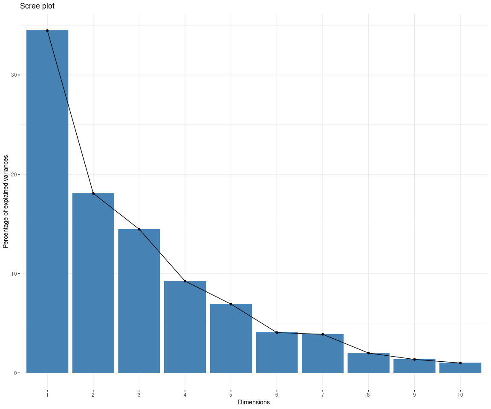
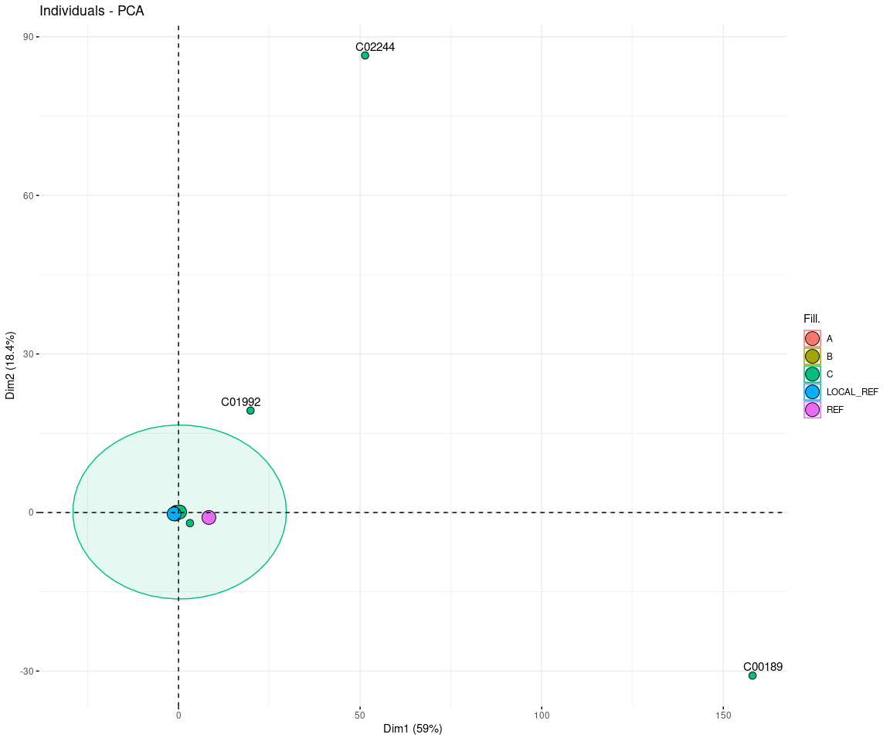
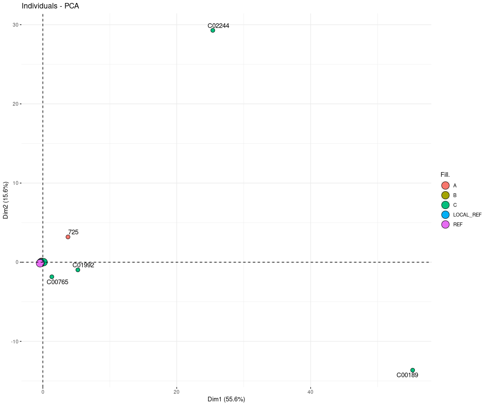

## plot PCA for Virulence and Efflux genes


```r
library(dplyr)
library(reshape2)
library(factoextra) #fviz_eig
library(tidyverse)

vir.db <- read.table("/data02/Analysis/Projects/6_Paeruginosa_199_TTSH_31_NUH_40_SGH/5_Abricate_vfdb/abricate_270_samples-vfdb.txt",
                     sep = "\t", header = TRUE, check.names = FALSE)
#head(vir.db)

tmp.df <- vir.db %>% select(SAMPLE,HOSPITAL) %>% unique()
#View(tmp.df)
vir.mat <- vir.db %>% 
  select(SAMPLE,GENE) %>%  
  acast(SAMPLE~GENE, length)

#View(vir.mat)
#head(vir.mat)
 
# append species to vir.mat

vir.mat.whosp <- rownames_to_column(as.data.frame(vir.mat), "SAMPLE") %>% 
  left_join(.,tmp.df, by = c("SAMPLE")) %>% 
  remove_rownames %>% 
  column_to_rownames(var="SAMPLE")

#head(vir.mat.whosp)
#view(vir.mat.whosp)

# Skip the last column


res.pca <- prcomp(vir.mat.whosp[,-ncol(vir.mat.whosp)], scale = FALSE)
fviz_eig(res.pca)
```

<!-- -->

```r
#summary(res.pca)

#--------------- PCA Virulence genes With Scale=TRUE --------------#
#head(vir.mat.whosp)
#Remove all the columns which have a constant variance.
nums <- unlist(lapply(vir.mat.whosp, is.numeric))
#nums

vir.mat.whosp.scaleT <- vir.mat.whosp[, nums]
#head(vir.mat.whosp.scaleT)

vir.mat.whosp.scaleT  <- vir.mat.whosp.scaleT[, apply(vir.mat.whosp.scaleT, 2, var) != 0]
#head(vir.mat.whosp.scaleT)
####tail(vir.mat.whosp.scaleT)

vir.mat.whosp.scaleT2 <- rownames_to_column(as.data.frame(vir.mat.whosp.scaleT), "SAMPLE") %>% 
  left_join(.,tmp.df, by = c("SAMPLE")) %>%
  remove_rownames %>% 
  column_to_rownames(var="SAMPLE")


res.pca.scaleT2  <- prcomp(vir.mat.whosp.scaleT2[,-ncol(vir.mat.whosp.scaleT2)], scale = TRUE)
options(ggrepel.max.overlaps = 30)
fviz_pca_ind(res.pca.scaleT2 ,fill.ind = vir.mat.whosp.scaleT2$HOSPITAL,pointshape = 21, pointsize = 3,addEllipses=TRUE, ellipse.level=0.95, repel = TRUE)
```

```
## Warning: ggrepel: 269 unlabeled data points (too many overlaps). Consider
## increasing max.overlaps
```

<!-- -->

```r
#--------------- PCA Virulence genes With Scale=FALSE --------------#
# Color individuals by groups
# fviz_pca_ind(res.pca, habillage=vir.mat.whosp$HOSPITAL)
# fviz_pca_ind(res.pca, label="none", habillage=vir.mat.whosp$HOSPITAL)
# 
# fviz_pca_ind(res.pca, label="none", habillage=vir.mat.whosp$HOSPITAL, addEllipses=TRUE, ellipse.level=0.95) + 
#   scale_color_brewer(palette="Dark2") +
#   theme_minimal()
# 
# fviz_pca_ind(res.pca,fill.ind = vir.mat.whosp$HOSPITAL,pointshape = 21, pointsize = 3)
# 
# options(ggrepel.max.overlaps = 30)
# fviz_pca_ind(res.pca,fill.ind = vir.mat.whosp$HOSPITAL,pointshape = 21, pointsize = 3,repel = TRUE)
# 
# fviz_pca_ind(res.pca,fill.ind = vir.mat.whosp$HOSPITAL,pointshape = 21, pointsize = 3,addEllipses=TRUE,repel = TRUE)

## PCA with efflux pump encoding genes

megares.db <- read.table("/data02/Analysis/Projects/6_Paeruginosa_199_TTSH_31_NUH_40_SGH/6_Abricate_Megares/PAE_Abricate_megares.txt",
                     sep = "\t", header = TRUE, check.names = FALSE)
#head(megares.db)

tmp.megares.df <- megares.db %>% select(SAMPLE,HOSPITAL) %>% unique()
#View(tmp.df)
megares.mat <- megares.db %>% 
  select(SAMPLE,GENE) %>%  
  acast(SAMPLE~GENE, length)

#View(vir.mat)
#head(megares.mat)

# append hospital to megares.mat

megares.mat.whosp <- rownames_to_column(as.data.frame(megares.mat), "SAMPLE") %>% 
  left_join(.,tmp.megares.df, by = c("SAMPLE")) %>% 
  remove_rownames %>% 
  column_to_rownames(var="SAMPLE")

#head(megares.mat.whosp)
#view(vir.mat.whosp)

# Skip the last column

#--------------- PCA Virulence genes With Scale=TRUE --------------#
#head(megares.mat.whosp)
#Remove all the columns which have a constant variance.
megares.nums <- unlist(lapply(megares.mat.whosp, is.numeric))
#nums

megares.mat.whosp.scaleT <- megares.mat.whosp[, megares.nums]
#head(megares.mat.whosp.scaleT)

megares.mat.whosp.scaleT  <- megares.mat.whosp.scaleT[, apply(megares.mat.whosp.scaleT, 2, var) != 0]
#head(megares.mat.whosp.scaleT)
####tail(megares.mat.whosp.scaleT)

megares.mat.whosp.scaleT2 <- rownames_to_column(as.data.frame(megares.mat.whosp.scaleT), "SAMPLE") %>% 
  left_join(.,tmp.megares.df, by = c("SAMPLE")) %>%
  remove_rownames %>% 
  column_to_rownames(var="SAMPLE")

#head(megares.mat.whosp.scaleT2)
#View(megares.mat.whosp.scaleT)
megares.res.pca.scaleT2  <- prcomp(megares.mat.whosp.scaleT2[,-ncol(megares.mat.whosp.scaleT2)], scale = TRUE)
#head(megares.res.pca.scaleT2)

options(ggrepel.max.overlaps = 30)
fviz_pca_ind(megares.res.pca.scaleT2 ,fill.ind = megares.mat.whosp.scaleT2$HOSPITAL,pointshape = 21, pointsize = 3,addEllipses=TRUE, repel = TRUE)
```

```
## Warning: Computation failed in `stat_ellipse()`:
## the leading minor of order 2 is not positive definite
```

```
## Warning: ggrepel: 267 unlabeled data points (too many overlaps). Consider
## increasing max.overlaps
```

<!-- -->

```r
# # Let's check gene by transposing
# 
# #transpose data frame
# 
# vir.mat.whosp_t <- t(as.data.frame(vir.mat.whosp %>% select(-HOSPITAL)))
# #View(vir.mat.whosp_t)
# 
# gene.res.pca <- prcomp(vir.mat.whosp_t , scale = FALSE)
# options(ggrepel.max.overlaps = 30)
# 
# fviz_pca_ind(gene.res.pca,
#              col.ind = "cos2", # Color by the quality of representation
#              gradient.cols = c("#00AFBB", "#E7B800", "#FC4E07"),
#              pointshape = 21,pointsize = 3,repel = TRUE)
# 
# fviz_pca_ind(gene.res.pca,
#              col.ind = "cos2", # Color by the quality of representation
#              gradient.cols = c("#00AFBB", "#E7B800", "#FC4E07"),
#              pointsize = 3,repel = TRUE)
# 
# #Plot
# vir.db.subset <- vir.db %>% select(SAMPLE,HOSPITAL,GENE,`Short Desc`)
# 
# head(vir.db.subset)
# 
# vir.db.subset$`Short Desc` <- gsub(' ', '_', vir.db.subset$`Short Desc` )
# vir.db.subset$`Short Desc` <- gsub(')_', ')', vir.db.subset$`Short Desc`)
# 
# head(vir.db.subset)
# 
# c25 <- c(
#   "dodgerblue2", "#E31A1C", # red
#   "green4",
#   "#6A3D9A", # purple
#   "#FF7F00", # orange
#   "black", "gold1",
#   "skyblue2", "#FB9A99", # lt pink
#   "palegreen2",
#   "#CAB2D6", # lt purple
#   "#FDBF6F", # lt orange
#   "maroon",
#   "gray70", "khaki2",
#   "orchid1", "deeppink1", "blue1", "steelblue4",
#   "darkturquoise", "green1", "yellow4", "yellow3",
#   "darkorange4", "brown", "navyblue", "pink", "steelblue2", "gold3", "palegreen4", "skyblue4", "green","blue3"
# )
# 
# ggplot(vir.db.subset,aes(x = GENE, y=SAMPLE,fill=`Short Desc`)) + 
#   geom_tile(colour = "white",size=0.1) + 
#   facet_grid(HOSPITAL~`Short Desc`, scales = "free", space = "free") + 
#   labs(x="Sample",
#        y="Gene nomenclature",
#        title = "Resistance Gene Heatmap (from Resfinder)", 
#        subtitle="", 
#        fill="Gene Classification") + 
#   scale_fill_manual(values = c25) + #Paired and Set3 
#   theme(panel.grid.major = element_blank(),
#         axis.text.x = element_text(angle = 90, hjust = 1, size = 6),
#         axis.text.y = element_text(angle = 0, hjust = 1, size = 7), 
#         legend.position = "none", strip.text.y.right = element_text(angle = 0), strip.text.x.top = element_text(angle = 90)) 
# 
# ggplot(vir.db.subset,aes(x = SAMPLE, y=GENE,fill=`Short Desc`)) + 
#   geom_tile(colour = "white",size=0.1) + 
#   facet_grid(`Short Desc`~HOSPITAL, scales = "free", space = "free") + 
#   labs(x="Sample",
#        y="Gene nomenclature",
#        title = "Resistance Gene Heatmap (from Resfinder)", 
#        subtitle="", 
#        fill="Gene Classification") + 
#   scale_fill_manual(values = c25) + #Paired and Set3 
#   theme(panel.grid.major = element_blank(),
#         axis.text.x = element_text(angle = 90, hjust = 1, size = 6),
#         axis.text.y = element_text(angle = 0, hjust = 1, size = 7), 
#         legend.position = "none", strip.text.y.right = element_text(angle = 0), strip.text.x.top = element_text(angle = 90)) 
```

Note that the `echo = FALSE` parameter was added to the code chunk to prevent printing of the R code that generated the plot.
