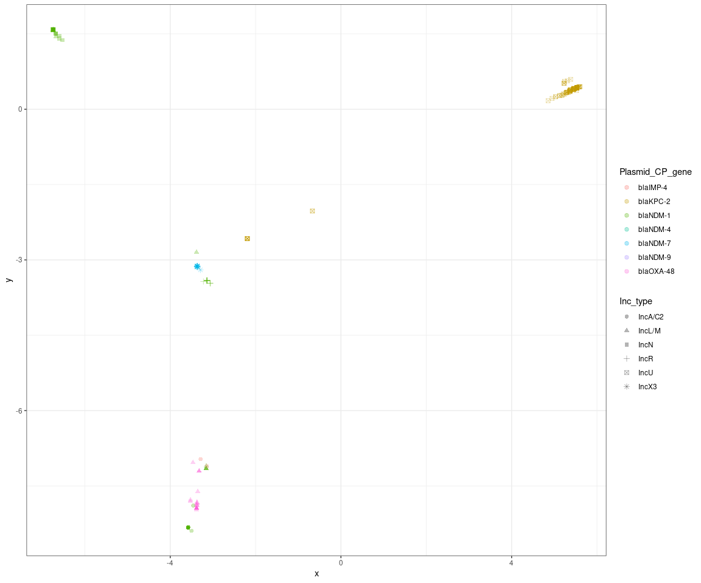
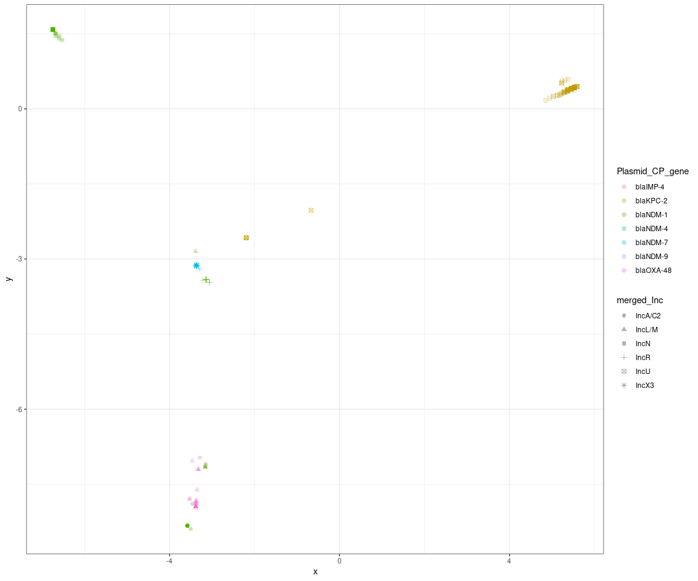

## R Markdown


```r
library(dplyr)
library(reshape2)
library(factoextra) #fviz_eig
library(tidyverse)
library(stringr)

Gene_PA_df <- read.table("/data02/Analysis/Projects/2_CPE_Transmission/Tracking_Plasmid_Change/RoaryPCA__plasmids/gene_presence_absence.Rtab", quote = "", check.names = FALSE, header = TRUE, sep = "\t")
#head(Gene_PA_df)
#View(as.data.frame(Gene_PA_df))

# Transpose to samples in rows and genes in columns
Gene_PA_df_t  <- data.table::transpose(Gene_PA_df, keep.names = "Plasmid", make.names = "Gene")   
#View(Gene_PA_df_t)

# Load metadata file
Gene_PA_meta <- read.table("/data02/Analysis/Projects/2_CPE_Transmission/Tracking_Plasmid_Change/RoaryPCA__plasmids/CPE_Transmission_959_plasmids_complete.csv", check.names = FALSE, header = TRUE, sep = ",", fill = TRUE)
#head(Gene_PA_meta)
#tail(Gene_PA_meta)

# Combine the Matrix with Metadata
Gene_PA_df_with_metadata <- left_join(Gene_PA_df_t, Gene_PA_meta, by = c("Plasmid"))
#View(Gene_PA_df_with_metadata)
#head(Gene_PA_df_with_metadata)
#tail(Gene_PA_df_with_metadata)
#write.csv(Gene_PA_df_with_metadata,"metadata_matrix.csv",col.names = TRUE)


Gene_PA_df_with_metadata$year=format(as.Date(Gene_PA_df_with_metadata$date_of_culture, format="%d/%m/%Y"),"%Y")

# remove na in r - remove rows - na.omit function / option
#Gene_PA_df_with_metadata.withoutNA <- na.omit(Gene_PA_df_with_metadata) 
Gene_PA_df_with_metadata <- Gene_PA_df_with_metadata %>%  
  mutate(lengthbin = case_when(Plasmid_length_bp<=10000 ~ "<10K",
                               Plasmid_length_bp>=10000 & Plasmid_length_bp<=39999 ~ "10K-39.9K",
                               Plasmid_length_bp>=40000 & Plasmid_length_bp<=49999 ~ "40K-49.9K",
                               Plasmid_length_bp>=50000 & Plasmid_length_bp<=59999 ~ "40K-49.9K",
                               Plasmid_length_bp>=60000 & Plasmid_length_bp<=69999 ~ "60K-69.9K",
                               Plasmid_length_bp>=70000 & Plasmid_length_bp<=79999 ~ "70K-79.9K",
                               Plasmid_length_bp>=80000 & Plasmid_length_bp<=89999 ~ "80K-89.9K",
                               Plasmid_length_bp>=90000 & Plasmid_length_bp<=99999 ~ "90K-99.9K",
                               Plasmid_length_bp>=100000 & Plasmid_length_bp<=199999 ~ "100K-199.9K",
                               Plasmid_length_bp>=200000 ~ ">200K",
  ))

#View(Gene_PA_df_with_metadata)


# Convert first column to rownames
roaryTab.df  <- Gene_PA_df_with_metadata %>% filter(!str_detect(merged_Inc, 'multipleInc|rep_cluster_1195|IncFIB')) %>% remove_rownames %>% column_to_rownames(var="Plasmid")
#head(roaryTab.df)
#Gene_PA_df_with_metadata %>% filter(merged_Inc != "multipleInc" |merged_Inc != "rep_cluster_1195" |merged_Inc != "IncFIB") %>% View()

#write.csv(roaryTab.df,"/data02/Analysis/Projects/2_CPE_Transmission/Tracking_Plasmid_Change/RoaryPCA__plasmids/metadata_matrix.csv")
# remove last 15 metadata columns for prcomp
# View(roaryTab.df[1:(length(roaryTab.df)-15)]) 

#---------------> SCALE TRUE
# Run PCA
#res.pca.scaleT  <- prcomp(roaryTab.df[1:(length(roaryTab.df)-15)], scale = TRUE)

options(ggrepel.max.overlaps = 30)
#fviz_pca_ind(res.pca.scaleT)
#fviz_pca_ind(res.pca.scaleT,fill.ind = roaryTab.df$Hospital_type)
#fviz_pca_ind(res.pca.scaleT,fill.ind = res.pca.scaleT$year)
#fviz_pca_ind(res.pca.scaleT, label="none", habillage=roaryTab.df$Hospital_type, addEllipses=TRUE, ellipse.level=0.95)

#fviz_pca_ind(res.pca.scaleT, fill.ind = roaryTab.df$Plasmid_CP_gene,pointshape = 21, pointsize = 3,addEllipses=TRUE, ellipse.level=0.95, repel = TRUE)


#---------------> SCALE FALSE

# Run PCA
res.pca.scaleF  <- prcomp(roaryTab.df[1:(length(roaryTab.df)-17)], scale = FALSE)

options(ggrepel.max.overlaps = 0)
#fviz_pca_ind(res.pca.scaleT)
#fviz_pca_ind(res.pca.scaleT,fill.ind = roaryTab.df$Hospital_type)
#fviz_pca_ind(res.pca.scaleT,fill.ind = res.pca.scaleT$year)
#fviz_pca_ind(res.pca.scaleF, label="none", habillage=roaryTab.df$Hospital_type, addEllipses=TRUE, ellipse.level=0.95)

# fviz_pca_ind(res.pca.scaleF, fill.ind = roaryTab.df$Plasmid_CP_gene,pointshape = 21, pointsize = 3,addEllipses=TRUE, ellipse.level=0.95, repel = TRUE)
# 
# fviz_pca_ind(res.pca.scaleF, fill.ind = roaryTab.df$lengthbin,pointshape = 21, pointsize = 3,addEllipses=TRUE, ellipse.level=0.95, repel = TRUE)
# 
# fviz_pca_ind(res.pca.scaleF, fill.ind = roaryTab.df$year,pointshape = 21, pointsize = 3,addEllipses=TRUE, ellipse.level=0.95, repel = TRUE)
# 
# fviz_pca_ind(res.pca.scaleF, fill.ind = roaryTab.df$Genomic_species,pointshape = 21, pointsize = 3,addEllipses=FALSE, ellipse.level=0.95, repel = TRUE)
# 
# fviz_pca_ind(res.pca.scaleF, fill.ind = roaryTab.df$Genomic_species,pointshape = 21, pointsize = 3,addEllipses=FALSE, ellipse.level=0.95, repel = TRUE)
# 
# fviz_pca_ind(res.pca.scaleF, fill.ind = roaryTab.df$Genomic_species,pointshape = 21, pointsize = 3,addEllipses=FALSE, ellipse.level=0.95, repel = TRUE)
# 
# fviz_pca_ind(res.pca.scaleF, fill.ind = roaryTab.df$Plasmid_CP_gene,pointshape = 21, pointsize = 3,addEllipses=FALSE, ellipse.level=0.95, repel = TRUE)

#######------------Multiple labels---------###########
basic_plot <- fviz_pca_ind(res.pca.scaleF, label="none")
#View(head(basic_plot$data))
#tail(basic_plot$data)

# Combine the Matrix with Metadata
basic_plot_with_meta <- left_join(basic_plot$data, Gene_PA_meta, by = c("name" = "Plasmid"))
#View((basic_plot_with_meta))

# ggplot(basic_plot_with_meta,
#        aes(x=x,y=y,col=Plasmid_CP_gene,shape=factor(Hospital_type))) + geom_point(size=5) + theme_bw()
# 
# ggplot(basic_plot_with_meta,
#        aes(x=x,y=y,col=Plasmid_CP_gene,shape=factor(Hospital_type))) + geom_point(size=2, alpha = 0.3) + theme_bw()

ggplot(basic_plot_with_meta,
       aes(x=x,y=y,col=Plasmid_CP_gene,shape=Inc_type)) + geom_point(size=2, alpha = 0.3) + theme_bw()
```

<!-- -->

```r
ggplot(basic_plot_with_meta,
       aes(x=x,y=y,col=Plasmid_CP_gene,shape=merged_Inc)) + geom_point(size=2, alpha = 0.3) + theme_bw()
```

<!-- -->

```r
library(plotly)

# CP gene and Hospital

p1 <- ggplot(basic_plot_with_meta,
       aes(x=x,y=y,col=Plasmid_CP_gene,shape=factor(Hospital_type))) + geom_point(size=2, alpha = 0.3) + theme_bw()
ggplotly(p1)
```

```{=html}
<div id="htmlwidget-4bfc7614180660b57232" style="width:1152px;height:960px;" class="plotly html-widget"></div>
<script type="application/json" data-for="htmlwidget-4bfc7614180660b57232">{"x":{"data":[{"x":[-3.14030859432511,-3.29011536021485],"y":[-7.10565841566867,-6.9659251132021],"text":["x: -3.1403086<br />y: -7.1056584<br />Plasmid_CP_gene: blaIMP-4<br />factor(Hospital_type): 6","x: -3.2901154<br />y: -6.9659251<br />Plasmid_CP_gene: blaIMP-4<br />factor(Hospital_type): 6"],"type":"scatter","mode":"markers","marker":{"autocolorscale":false,"color":"rgba(248,118,109,1)","opacity":0.3,"size":7.55905511811024,"symbol":"asterisk-open","line":{"width":1.88976377952756,"color":"rgba(248,118,109,1)"}},"hoveron":"points","name":"(blaIMP-4,6)","legendgroup":"(blaIMP-4,6)","showlegend":true,"xaxis":"x","yaxis":"y","hoverinfo":"text","frame":null},{"x":[5.45125074430832,5.45125074430832,5.52618287497596,5.52618287497596,5.52618287497596],"y":[0.399335793395263,0.399335793395263,0.429556356054651,0.429556356054651,0.429556356054651],"text":["x:  5.4512507<br />y:  0.3993358<br />Plasmid_CP_gene: blaKPC-2<br />factor(Hospital_type): 1","x:  5.4512507<br />y:  0.3993358<br />Plasmid_CP_gene: blaKPC-2<br />factor(Hospital_type): 1","x:  5.5261829<br />y:  0.4295564<br />Plasmid_CP_gene: blaKPC-2<br />factor(Hospital_type): 1","x:  5.5261829<br />y:  0.4295564<br />Plasmid_CP_gene: blaKPC-2<br />factor(Hospital_type): 1","x:  5.5261829<br />y:  0.4295564<br />Plasmid_CP_gene: blaKPC-2<br />factor(Hospital_type): 1"],"type":"scatter","mode":"markers","marker":{"autocolorscale":false,"color":"rgba(196,154,0,1)","opacity":0.3,"size":7.55905511811024,"symbol":"circle","line":{"width":1.88976377952756,"color":"rgba(196,154,0,1)"}},"hoveron":"points","name":"(blaKPC-2,1)","legendgroup":"(blaKPC-2,1)","showlegend":true,"xaxis":"x","yaxis":"y","hoverinfo":"text","frame":null},{"x":[5.52618287497596,5.46202913911256,5.52618287497596,5.46202913911256],"y":[0.429556356054651,0.404671377490928,0.429556356054651,0.404671377490928],"text":["x:  5.5261829<br />y:  0.4295564<br />Plasmid_CP_gene: blaKPC-2<br />factor(Hospital_type): 2","x:  5.4620291<br />y:  0.4046714<br />Plasmid_CP_gene: blaKPC-2<br />factor(Hospital_type): 2","x:  5.5261829<br />y:  0.4295564<br />Plasmid_CP_gene: blaKPC-2<br />factor(Hospital_type): 2","x:  5.4620291<br />y:  0.4046714<br />Plasmid_CP_gene: blaKPC-2<br />factor(Hospital_type): 2"],"type":"scatter","mode":"markers","marker":{"autocolorscale":false,"color":"rgba(196,154,0,1)","opacity":0.3,"size":7.55905511811024,"symbol":"triangle-up","line":{"width":1.88976377952756,"color":"rgba(196,154,0,1)"}},"hoveron":"points","name":"(blaKPC-2,2)","legendgroup":"(blaKPC-2,2)","showlegend":true,"xaxis":"x","yaxis":"y","hoverinfo":"text","frame":null},{"x":[5.52618287497596,5.52618287497596,5.45125074430832],"y":[0.429556356054651,0.429556356054651,0.399335793395263],"text":["x:  5.5261829<br />y:  0.4295564<br />Plasmid_CP_gene: blaKPC-2<br />factor(Hospital_type): 4","x:  5.5261829<br />y:  0.4295564<br />Plasmid_CP_gene: blaKPC-2<br />factor(Hospital_type): 4","x:  5.4512507<br />y:  0.3993358<br />Plasmid_CP_gene: blaKPC-2<br />factor(Hospital_type): 4"],"type":"scatter","mode":"markers","marker":{"autocolorscale":false,"color":"rgba(196,154,0,1)","opacity":0.3,"size":7.55905511811024,"symbol":"cross-thin-open","line":{"width":1.88976377952756,"color":"rgba(196,154,0,1)"}},"hoveron":"points","name":"(blaKPC-2,4)","legendgroup":"(blaKPC-2,4)","showlegend":true,"xaxis":"x","yaxis":"y","hoverinfo":"text","frame":null},{"x":[-2.19388574542164,5.52618287497596,5.45576363250006,5.52618287497596,-0.668194461573343,5.52618287497596,-0.668194461573343,5.12525184556732,5.52618287497596,5.52618287497596,5.52618287497596,5.52618287497596,5.52618287497596,5.52618287497596,5.52618287497596,5.46202913911256,5.52618287497596,5.52618287497596,5.46202913911256,5.52618287497596,5.53277045601197,5.52618287497596,5.52618287497596,5.52545417410953,5.52618287497596,5.52545417410953,5.52618287497596,5.52618287497596,5.52618287497596,5.52618287497596,5.52618287497596,5.52618287497596,5.46202913911256,5.52618287497596,5.46202913911256,5.52618287497596,5.52618287497596,5.60209105365449,5.52618287497596,5.52618287497596,5.52618287497596,5.52618287497596,5.52618287497596,5.52618287497596,5.60209105365449,5.52618287497596,5.22849416480256,5.52618287497596,5.52618287497596,5.52618287497596,5.52618287497596,5.52618287497596,5.52618287497596,5.52618287497596,5.52618287497596,5.22849416480256,5.22849416480256,5.52618287497596,5.52618287497596,5.52618287497596,5.52618287497596,5.52618287497596,5.52618287497596,5.35813378421312,5.29378087300775,5.23509286585904,5.17093912999564,5.52618287497596,5.52618287497596,5.52618287497596,5.52618287497596,5.52618287497596,5.52852387894749,5.52618287497596,5.36278530321989,5.52618287497596,5.52618287497596,5.52618287497596,5.36138691240942,5.36129019695875,5.52618287497596,4.85520481950365,5.44659103946253,5.52618287497596,5.52618287497596,5.52618287497596,5.52618287497596,5.52618287497596,5.36750173762046,5.29499483508971,5.2138129357268,5.52618287497596,5.46202913911256,5.52618287497596,5.28264810615405,5.53337879770369,5.52618287497596,5.46202913911256,5.46202913911256,5.52618287497596,5.52618287497596,5.52618287497596,5.46202913911256,5.52618287497596,5.52618287497596,5.52618287497596,5.53297613068478,5.52934603787991,5.52618287497596,5.52618287497596,5.52618287497596,5.52618287497596,5.52618287497596,5.35901513097591,5.52618287497596,5.52618287497596,5.52618287497596,5.52618287497596,5.5141756188555,5.52618287497596,5.52618287497596,5.52618287497596,5.52618287497596,5.52618287497596,5.52618287497596,5.52618287497596,5.52618287497596,5.52618287497596,5.52618287497596,5.52545417410953,5.52618287497596,5.52545417410953,5.52618287497596,5.52618287497596,5.52545417410953,5.52618287497596,5.52618287497596,5.27140742886018,5.52618287497596,5.52618287497596,5.52618287497596,5.52618287497596,5.52618287497596,5.52618287497596,5.52545417410953,5.52545417410953,5.44883070603962,5.52618287497596,5.45408615868413,5.23772547292471,5.45546273619223,5.37805030370116,5.37667372619306,5.52618287497596,5.52618287497596,5.52618287497596,5.52618287497596,5.52618287497596,5.52618287497596,5.30674532676871,5.52467282699389,5.52467282699389,5.52467282699389,5.52545417410953,5.52545417410953,5.52618287497596,5.52618287497596,5.52618287497596,5.52618287497596,5.52618287497596,5.52618287497596,5.52618287497596,5.52074956044032,5.52545417410953,5.52618287497596,5.43986774285759,5.52618287497596,5.37842680495498,5.52618287497596,5.52618287497596,5.52618287497596,5.52618287497596,5.52618287497596,5.52618287497596,5.52618287497596,5.52545417410953,5.52618287497596,5.38289327784123,5.52618287497596,5.52852387894749,5.5783293547189,5.52618287497596,5.52618287497596,5.52618287497596,5.52618287497596,5.52618287497596,5.52618287497596,5.52618287497596,-2.19388574542164,5.52618287497596,5.52618287497596,5.52618287497596,5.52618287497596,5.52618287497596,5.52618287497596,5.52618287497596,5.46202913911256,5.52618287497596,5.52618287497596,5.52618287497596,5.52618287497596,5.52618287497596,5.52618287497596,5.52618287497596,5.52618287497596,5.45583923744605,5.52618287497596,5.52618287497596,5.52618287497596,5.45583923744605,-2.19388574542164,5.52618287497596,5.52618287497596,5.37445096768355,5.37728437557038,5.37338185811384,5.52618287497596,5.52618287497596,5.52618287497596,5.52618287497596,5.52618287497596,-2.19388574542164,5.46202913911256,5.52618287497596,5.52618287497596,5.52618287497596,5.52618287497596,5.52618287497596,5.52618287497596,5.52618287497596,5.52618287497596,5.52618287497596,5.52618287497596,5.52618287497596,5.52618287497596,5.52618287497596,5.52618287497596,5.52618287497596,5.5783293547189,5.52618287497596,-2.19388574542164,5.52618287497596,5.52618287497596,5.52618287497596,5.52618287497596,5.52618287497596,5.52618287497596,5.52618287497596,5.52618287497596,5.52618287497596,5.52618287497596,5.52618287497596,5.52618287497596,5.52618287497596,5.52618287497596,5.52618287497596,5.52618287497596,5.52618287497596,5.5783293547189,5.52618287497596,5.52618287497596,5.52618287497596,5.44232339663755,5.52618287497596,5.52638830476267,5.52618287497596,5.52618287497596,5.52618287497596,5.52618287497596,5.52618287497596,-2.19388574542164,5.45583923744605,5.37475322044995,5.52618287497596,5.46202913911256,5.52618287497596,5.52618287497596,5.52618287497596,5.52618287497596,5.52618287497596,5.52618287497596,5.38163384181085,5.35852336454541,5.45469680806145,5.52618287497596,5.46202913911256,5.52618287497596,5.52618287497596,5.52618287497596,5.52618287497596,5.52618287497596,5.52618287497596,5.52618287497596,5.52618287497596,5.52618287497596,5.52618287497596,5.52618287497596,-2.19388574542164,5.52618287497596,5.46202913911256,5.52698892053052,5.52618287497596,5.46202913911256,5.52618287497596,5.52618287497596,5.52618287497596,5.52618287497596,5.52618287497596,5.52618287497596,5.29499483508971,5.1262966590091,5.52618287497596,5.46202913911256,5.52618287497596,5.52618287497596,5.29499483508971,5.52618287497596,5.52618287497596,5.52618287497596,5.52618287497596,5.52618287497596,5.52618287497596,5.52618287497596,5.52618287497596,5.52618287497596,5.52618287497596,5.52618287497596,5.52618287497596,5.5783293547189,5.52618287497596,5.52618287497596,5.52618287497596,4.94713268243266,5.52618287497596,5.52618287497596,5.52934603787991,5.52934603787991,5.52618287497596,5.52618287497596,5.52934603787991,5.52618287497596,5.52618287497596,5.52618287497596,5.46202913911256,5.52618287497596,5.52618287497596,5.52618287497596,5.52618287497596,5.46202913911256,5.52618287497596,5.52732065830658,5.52618287497596,5.52618287497596,5.52618287497596,5.52618287497596,5.52618287497596,5.46202913911256,5.52618287497596,5.52618287497596,5.52618287497596,5.52618287497596,5.27801655426183,5.52618287497596,5.52618287497596,5.03099956135981,5.32893781039213,5.52618287497596,5.03099956135981,5.52618287497596,5.52618287497596,5.52618287497596,5.52679622839765,5.52618287497596,5.52618287497596,5.18895412918802,5.52618287497596,5.52618287497596,5.52618287497596,5.52618287497596,5.52618287497596,5.52618287497596,5.53377858119365,5.52726006805952,5.45359948074578,5.52586230838623,5.52618287497596,5.52618287497596,5.52618287497596,5.5783293547189,5.52618287497596,5.52618287497596,5.52618287497596],"y":[-2.57461095011851,0.429556356054651,0.419641184379104,0.429556356054651,-2.02658971430424,0.429556356054651,-2.02658971430424,0.269910729656244,0.429556356054651,0.429556356054651,0.429556356054651,0.429556356054651,0.429556356054651,0.429556356054651,0.429556356054651,0.404671377490928,0.429556356054651,0.429556356054651,0.404671377490928,0.429556356054651,0.432039763315366,0.429556356054651,0.429556356054651,0.421140284600368,0.429556356054651,0.421140284600368,0.429556356054651,0.429556356054651,0.429556356054651,0.429556356054651,0.429556356054651,0.429556356054651,0.404671377490928,0.429556356054651,0.404671377490928,0.429556356054651,0.429556356054651,0.450480993106827,0.429556356054651,0.429556356054651,0.429556356054651,0.429556356054651,0.429556356054651,0.429556356054651,0.450480993106827,0.429556356054651,0.515825458331514,0.429556356054651,0.429556356054651,0.429556356054651,0.429556356054651,0.429556356054651,0.429556356054651,0.429556356054651,0.429556356054651,0.515825458331514,0.515825458331514,0.429556356054651,0.429556356054651,0.429556356054651,0.429556356054651,0.429556356054651,0.429556356054651,0.36344597760586,0.33849169390839,0.29963953432437,0.274754555760647,0.429556356054651,0.429556356054651,0.429556356054651,0.429556356054651,0.429556356054651,0.429044192415004,0.429556356054651,0.365249785095441,0.429556356054651,0.429556356054651,0.429556356054651,0.369459220340761,0.364543324657602,0.429556356054651,0.169172260984551,0.39752097876088,0.429556356054651,0.429556356054651,0.429556356054651,0.429556356054651,0.429556356054651,0.370112327455437,0.338370415908276,0.305910703510539,0.429556356054651,0.404671377490928,0.429556356054651,0.329488396721734,0.432272788915031,0.429556356054651,0.404671377490928,0.404671377490928,0.429556356054651,0.429556356054651,0.429556356054651,0.404671377490928,0.429556356054651,0.429556356054651,0.429556356054651,0.432122164239391,0.429371698177104,0.429556356054651,0.429556356054651,0.429556356054651,0.429556356054651,0.429556356054651,0.349691415679479,0.429556356054651,0.429556356054651,0.429556356054651,0.429556356054651,0.418065139564124,0.429556356054651,0.429556356054651,0.429556356054651,0.429556356054651,0.429556356054651,0.429556356054651,0.429556356054651,0.429556356054651,0.429556356054651,0.429556356054651,0.421140284600368,0.429556356054651,0.421140284600368,0.429556356054651,0.429556356054651,0.421140284600368,0.429556356054651,0.429556356054651,0.319891232414429,0.429556356054651,0.429556356054651,0.429556356054651,0.429556356054651,0.429556356054651,0.429556356054651,0.421140284600368,0.421140284600368,0.390755088020287,0.429556356054651,0.400956257845234,0.554904964438595,0.401367159357759,0.388808538543467,0.388397637030943,0.429556356054651,0.429556356054651,0.429556356054651,0.429556356054651,0.429556356054651,0.429556356054651,0.564236181723544,0.419639889281116,0.419639889281116,0.419639889281116,0.421140284600368,0.421140284600368,0.429556356054651,0.429556356054651,0.429556356054651,0.429556356054651,0.429556356054651,0.429556356054651,0.429556356054651,0.371189441065336,0.421140284600368,0.429556356054651,0.386163989821775,0.429556356054651,0.388895533053534,0.429556356054651,0.429556356054651,0.429556356054651,0.429556356054651,0.429556356054651,0.429556356054651,0.429556356054651,0.421140284600368,0.429556356054651,0.594913637934271,0.429556356054651,0.429044192415004,0.442950118127848,0.429556356054651,0.429556356054651,0.429556356054651,0.429556356054651,0.429556356054651,0.429556356054651,0.429556356054651,-2.57461095011851,0.429556356054651,0.429556356054651,0.429556356054651,0.429556356054651,0.429556356054651,0.429556356054651,0.429556356054651,0.404671377490928,0.429556356054651,0.429556356054651,0.429556356054651,0.429556356054651,0.429556356054651,0.429556356054651,0.429556356054651,0.429556356054651,0.401454153867826,0.429556356054651,0.429556356054651,0.429556356054651,0.401454153867826,-2.57461095011851,0.429556356054651,0.429556356054651,0.366054061385071,0.388593987332548,0.351015125147887,0.429556356054651,0.429556356054651,0.429556356054651,0.429556356054651,0.429556356054651,-2.57461095011851,0.404671377490928,0.429556356054651,0.429556356054651,0.429556356054651,0.429556356054651,0.429556356054651,0.429556356054651,0.429556356054651,0.429556356054651,0.429556356054651,0.429556356054651,0.429556356054651,0.429556356054651,0.429556356054651,0.429556356054651,0.429556356054651,0.442950118127848,0.429556356054651,-2.57461095011851,0.429556356054651,0.429556356054651,0.429556356054651,0.429556356054651,0.429556356054651,0.429556356054651,0.429556356054651,0.429556356054651,0.429556356054651,0.429556356054651,0.429556356054651,0.429556356054651,0.429556356054651,0.429556356054651,0.429556356054651,0.429556356054651,0.429556356054651,0.442950118127848,0.429556356054651,0.429556356054651,0.429556356054651,0.396504452534296,0.429556356054651,0.42963828333002,0.429556356054651,0.429556356054651,0.429556356054651,0.429556356054651,0.429556356054651,-2.57461095011851,0.401454153867826,0.370020473476885,0.429556356054651,0.404671377490928,0.429556356054651,0.429556356054651,0.429556356054651,0.429556356054651,0.429556356054651,0.429556356054651,0.377043338551253,0.363566554897271,0.401152608146839,0.429556356054651,0.404671377490928,0.429556356054651,0.429556356054651,0.429556356054651,0.429556356054651,0.429556356054651,0.429556356054651,0.429556356054651,0.429556356054651,0.429556356054651,0.429556356054651,0.429556356054651,-2.57461095011851,0.429556356054651,0.404671377490928,0.429850619437087,0.429556356054651,0.404671377490928,0.429556356054651,0.429556356054651,0.429556356054651,0.429556356054651,0.429556356054651,0.429556356054651,0.338370415908276,0.271958771592061,0.429556356054651,0.404671377490928,0.429556356054651,0.429556356054651,0.338370415908276,0.429556356054651,0.429556356054651,0.429556356054651,0.429556356054651,0.429556356054651,0.429556356054651,0.429556356054651,0.429556356054651,0.429556356054651,0.429556356054651,0.429556356054651,0.429556356054651,0.442950118127848,0.429556356054651,0.429556356054651,0.429556356054651,0.215252385514358,0.429556356054651,0.429556356054651,0.429371698177104,0.429371698177104,0.429556356054651,0.429556356054651,0.429371698177104,0.429556356054651,0.429556356054651,0.429556356054651,0.404671377490928,0.429556356054651,0.429556356054651,0.429556356054651,0.429556356054651,0.404671377490928,0.429556356054651,0.427322003929568,0.429556356054651,0.429556356054651,0.429556356054651,0.429556356054651,0.429556356054651,0.404671377490928,0.429556356054651,0.429556356054651,0.429556356054651,0.429556356054651,0.334851804857712,0.429556356054651,0.429556356054651,0.248311973862783,0.333885849486818,0.429556356054651,0.248311973862783,0.429556356054651,0.429556356054651,0.429556356054651,0.429796073643246,0.429556356054651,0.429556356054651,0.282162879659087,0.429556356054651,0.429556356054651,0.429556356054651,0.429556356054651,0.429556356054651,0.429556356054651,0.432457699128273,0.423208663969712,0.407351152304982,0.421298298898459,0.429556356054651,0.429556356054651,0.429556356054651,0.442950118127848,0.429556356054651,0.429556356054651,0.429556356054651],"text":["x: -2.1938857<br />y: -2.5746110<br />Plasmid_CP_gene: blaKPC-2<br />factor(Hospital_type): 5","x:  5.5261829<br />y:  0.4295564<br />Plasmid_CP_gene: blaKPC-2<br />factor(Hospital_type): 5","x:  5.4557636<br />y:  0.4196412<br />Plasmid_CP_gene: blaKPC-2<br />factor(Hospital_type): 5","x:  5.5261829<br />y:  0.4295564<br />Plasmid_CP_gene: blaKPC-2<br />factor(Hospital_type): 5","x: -0.6681945<br />y: -2.0265897<br />Plasmid_CP_gene: blaKPC-2<br />factor(Hospital_type): 5","x:  5.5261829<br />y:  0.4295564<br />Plasmid_CP_gene: blaKPC-2<br />factor(Hospital_type): 5","x: -0.6681945<br />y: -2.0265897<br />Plasmid_CP_gene: blaKPC-2<br />factor(Hospital_type): 5","x:  5.1252518<br />y:  0.2699107<br />Plasmid_CP_gene: blaKPC-2<br />factor(Hospital_type): 5","x:  5.5261829<br />y:  0.4295564<br />Plasmid_CP_gene: blaKPC-2<br />factor(Hospital_type): 5","x:  5.5261829<br />y:  0.4295564<br />Plasmid_CP_gene: blaKPC-2<br />factor(Hospital_type): 5","x:  5.5261829<br />y:  0.4295564<br />Plasmid_CP_gene: blaKPC-2<br />factor(Hospital_type): 5","x:  5.5261829<br />y:  0.4295564<br />Plasmid_CP_gene: blaKPC-2<br />factor(Hospital_type): 5","x:  5.5261829<br />y:  0.4295564<br />Plasmid_CP_gene: blaKPC-2<br />factor(Hospital_type): 5","x:  5.5261829<br />y:  0.4295564<br />Plasmid_CP_gene: blaKPC-2<br />factor(Hospital_type): 5","x:  5.5261829<br />y:  0.4295564<br />Plasmid_CP_gene: blaKPC-2<br />factor(Hospital_type): 5","x:  5.4620291<br />y:  0.4046714<br />Plasmid_CP_gene: blaKPC-2<br />factor(Hospital_type): 5","x:  5.5261829<br />y:  0.4295564<br />Plasmid_CP_gene: blaKPC-2<br />factor(Hospital_type): 5","x:  5.5261829<br />y:  0.4295564<br />Plasmid_CP_gene: blaKPC-2<br />factor(Hospital_type): 5","x:  5.4620291<br />y:  0.4046714<br />Plasmid_CP_gene: blaKPC-2<br />factor(Hospital_type): 5","x:  5.5261829<br />y:  0.4295564<br />Plasmid_CP_gene: blaKPC-2<br />factor(Hospital_type): 5","x:  5.5327705<br />y:  0.4320398<br />Plasmid_CP_gene: blaKPC-2<br />factor(Hospital_type): 5","x:  5.5261829<br />y:  0.4295564<br />Plasmid_CP_gene: blaKPC-2<br />factor(Hospital_type): 5","x:  5.5261829<br />y:  0.4295564<br />Plasmid_CP_gene: blaKPC-2<br />factor(Hospital_type): 5","x:  5.5254542<br />y:  0.4211403<br />Plasmid_CP_gene: blaKPC-2<br />factor(Hospital_type): 5","x:  5.5261829<br />y:  0.4295564<br />Plasmid_CP_gene: blaKPC-2<br />factor(Hospital_type): 5","x:  5.5254542<br />y:  0.4211403<br />Plasmid_CP_gene: blaKPC-2<br />factor(Hospital_type): 5","x:  5.5261829<br />y:  0.4295564<br />Plasmid_CP_gene: blaKPC-2<br />factor(Hospital_type): 5","x:  5.5261829<br />y:  0.4295564<br />Plasmid_CP_gene: blaKPC-2<br />factor(Hospital_type): 5","x:  5.5261829<br />y:  0.4295564<br />Plasmid_CP_gene: blaKPC-2<br />factor(Hospital_type): 5","x:  5.5261829<br />y:  0.4295564<br />Plasmid_CP_gene: blaKPC-2<br />factor(Hospital_type): 5","x:  5.5261829<br />y:  0.4295564<br />Plasmid_CP_gene: blaKPC-2<br />factor(Hospital_type): 5","x:  5.5261829<br />y:  0.4295564<br />Plasmid_CP_gene: blaKPC-2<br />factor(Hospital_type): 5","x:  5.4620291<br />y:  0.4046714<br />Plasmid_CP_gene: blaKPC-2<br />factor(Hospital_type): 5","x:  5.5261829<br />y:  0.4295564<br />Plasmid_CP_gene: blaKPC-2<br />factor(Hospital_type): 5","x:  5.4620291<br />y:  0.4046714<br />Plasmid_CP_gene: blaKPC-2<br />factor(Hospital_type): 5","x:  5.5261829<br />y:  0.4295564<br />Plasmid_CP_gene: blaKPC-2<br />factor(Hospital_type): 5","x:  5.5261829<br />y:  0.4295564<br />Plasmid_CP_gene: blaKPC-2<br />factor(Hospital_type): 5","x:  5.6020911<br />y:  0.4504810<br />Plasmid_CP_gene: blaKPC-2<br />factor(Hospital_type): 5","x:  5.5261829<br />y:  0.4295564<br />Plasmid_CP_gene: blaKPC-2<br />factor(Hospital_type): 5","x:  5.5261829<br />y:  0.4295564<br />Plasmid_CP_gene: blaKPC-2<br />factor(Hospital_type): 5","x:  5.5261829<br />y:  0.4295564<br />Plasmid_CP_gene: blaKPC-2<br />factor(Hospital_type): 5","x:  5.5261829<br />y:  0.4295564<br />Plasmid_CP_gene: blaKPC-2<br />factor(Hospital_type): 5","x:  5.5261829<br />y:  0.4295564<br />Plasmid_CP_gene: blaKPC-2<br />factor(Hospital_type): 5","x:  5.5261829<br />y:  0.4295564<br />Plasmid_CP_gene: blaKPC-2<br />factor(Hospital_type): 5","x:  5.6020911<br />y:  0.4504810<br />Plasmid_CP_gene: blaKPC-2<br />factor(Hospital_type): 5","x:  5.5261829<br />y:  0.4295564<br />Plasmid_CP_gene: blaKPC-2<br />factor(Hospital_type): 5","x:  5.2284942<br />y:  0.5158255<br />Plasmid_CP_gene: blaKPC-2<br />factor(Hospital_type): 5","x:  5.5261829<br />y:  0.4295564<br />Plasmid_CP_gene: blaKPC-2<br />factor(Hospital_type): 5","x:  5.5261829<br />y:  0.4295564<br />Plasmid_CP_gene: blaKPC-2<br />factor(Hospital_type): 5","x:  5.5261829<br />y:  0.4295564<br />Plasmid_CP_gene: blaKPC-2<br />factor(Hospital_type): 5","x:  5.5261829<br />y:  0.4295564<br />Plasmid_CP_gene: blaKPC-2<br />factor(Hospital_type): 5","x:  5.5261829<br />y:  0.4295564<br />Plasmid_CP_gene: blaKPC-2<br />factor(Hospital_type): 5","x:  5.5261829<br />y:  0.4295564<br />Plasmid_CP_gene: blaKPC-2<br />factor(Hospital_type): 5","x:  5.5261829<br />y:  0.4295564<br />Plasmid_CP_gene: blaKPC-2<br />factor(Hospital_type): 5","x:  5.5261829<br />y:  0.4295564<br />Plasmid_CP_gene: blaKPC-2<br />factor(Hospital_type): 5","x:  5.2284942<br />y:  0.5158255<br />Plasmid_CP_gene: blaKPC-2<br />factor(Hospital_type): 5","x:  5.2284942<br />y:  0.5158255<br />Plasmid_CP_gene: blaKPC-2<br />factor(Hospital_type): 5","x:  5.5261829<br />y:  0.4295564<br />Plasmid_CP_gene: blaKPC-2<br />factor(Hospital_type): 5","x:  5.5261829<br />y:  0.4295564<br />Plasmid_CP_gene: blaKPC-2<br />factor(Hospital_type): 5","x:  5.5261829<br />y:  0.4295564<br />Plasmid_CP_gene: blaKPC-2<br />factor(Hospital_type): 5","x:  5.5261829<br />y:  0.4295564<br />Plasmid_CP_gene: blaKPC-2<br />factor(Hospital_type): 5","x:  5.5261829<br />y:  0.4295564<br />Plasmid_CP_gene: blaKPC-2<br />factor(Hospital_type): 5","x:  5.5261829<br />y:  0.4295564<br />Plasmid_CP_gene: blaKPC-2<br />factor(Hospital_type): 5","x:  5.3581338<br />y:  0.3634460<br />Plasmid_CP_gene: blaKPC-2<br />factor(Hospital_type): 5","x:  5.2937809<br />y:  0.3384917<br />Plasmid_CP_gene: blaKPC-2<br />factor(Hospital_type): 5","x:  5.2350929<br />y:  0.2996395<br />Plasmid_CP_gene: blaKPC-2<br />factor(Hospital_type): 5","x:  5.1709391<br />y:  0.2747546<br />Plasmid_CP_gene: blaKPC-2<br />factor(Hospital_type): 5","x:  5.5261829<br />y:  0.4295564<br />Plasmid_CP_gene: blaKPC-2<br />factor(Hospital_type): 5","x:  5.5261829<br />y:  0.4295564<br />Plasmid_CP_gene: blaKPC-2<br />factor(Hospital_type): 5","x:  5.5261829<br />y:  0.4295564<br />Plasmid_CP_gene: blaKPC-2<br />factor(Hospital_type): 5","x:  5.5261829<br />y:  0.4295564<br />Plasmid_CP_gene: blaKPC-2<br />factor(Hospital_type): 5","x:  5.5261829<br />y:  0.4295564<br />Plasmid_CP_gene: blaKPC-2<br />factor(Hospital_type): 5","x:  5.5285239<br />y:  0.4290442<br />Plasmid_CP_gene: blaKPC-2<br />factor(Hospital_type): 5","x:  5.5261829<br />y:  0.4295564<br />Plasmid_CP_gene: blaKPC-2<br />factor(Hospital_type): 5","x:  5.3627853<br />y:  0.3652498<br />Plasmid_CP_gene: blaKPC-2<br />factor(Hospital_type): 5","x:  5.5261829<br />y:  0.4295564<br />Plasmid_CP_gene: blaKPC-2<br />factor(Hospital_type): 5","x:  5.5261829<br />y:  0.4295564<br />Plasmid_CP_gene: blaKPC-2<br />factor(Hospital_type): 5","x:  5.5261829<br />y:  0.4295564<br />Plasmid_CP_gene: blaKPC-2<br />factor(Hospital_type): 5","x:  5.3613869<br />y:  0.3694592<br />Plasmid_CP_gene: blaKPC-2<br />factor(Hospital_type): 5","x:  5.3612902<br />y:  0.3645433<br />Plasmid_CP_gene: blaKPC-2<br />factor(Hospital_type): 5","x:  5.5261829<br />y:  0.4295564<br />Plasmid_CP_gene: blaKPC-2<br />factor(Hospital_type): 5","x:  4.8552048<br />y:  0.1691723<br />Plasmid_CP_gene: blaKPC-2<br />factor(Hospital_type): 5","x:  5.4465910<br />y:  0.3975210<br />Plasmid_CP_gene: blaKPC-2<br />factor(Hospital_type): 5","x:  5.5261829<br />y:  0.4295564<br />Plasmid_CP_gene: blaKPC-2<br />factor(Hospital_type): 5","x:  5.5261829<br />y:  0.4295564<br />Plasmid_CP_gene: blaKPC-2<br />factor(Hospital_type): 5","x:  5.5261829<br />y:  0.4295564<br />Plasmid_CP_gene: blaKPC-2<br />factor(Hospital_type): 5","x:  5.5261829<br />y:  0.4295564<br />Plasmid_CP_gene: blaKPC-2<br />factor(Hospital_type): 5","x:  5.5261829<br />y:  0.4295564<br />Plasmid_CP_gene: blaKPC-2<br />factor(Hospital_type): 5","x:  5.3675017<br />y:  0.3701123<br />Plasmid_CP_gene: blaKPC-2<br />factor(Hospital_type): 5","x:  5.2949948<br />y:  0.3383704<br />Plasmid_CP_gene: blaKPC-2<br />factor(Hospital_type): 5","x:  5.2138129<br />y:  0.3059107<br />Plasmid_CP_gene: blaKPC-2<br />factor(Hospital_type): 5","x:  5.5261829<br />y:  0.4295564<br />Plasmid_CP_gene: blaKPC-2<br />factor(Hospital_type): 5","x:  5.4620291<br />y:  0.4046714<br />Plasmid_CP_gene: blaKPC-2<br />factor(Hospital_type): 5","x:  5.5261829<br />y:  0.4295564<br />Plasmid_CP_gene: blaKPC-2<br />factor(Hospital_type): 5","x:  5.2826481<br />y:  0.3294884<br />Plasmid_CP_gene: blaKPC-2<br />factor(Hospital_type): 5","x:  5.5333788<br />y:  0.4322728<br />Plasmid_CP_gene: blaKPC-2<br />factor(Hospital_type): 5","x:  5.5261829<br />y:  0.4295564<br />Plasmid_CP_gene: blaKPC-2<br />factor(Hospital_type): 5","x:  5.4620291<br />y:  0.4046714<br />Plasmid_CP_gene: blaKPC-2<br />factor(Hospital_type): 5","x:  5.4620291<br />y:  0.4046714<br />Plasmid_CP_gene: blaKPC-2<br />factor(Hospital_type): 5","x:  5.5261829<br />y:  0.4295564<br />Plasmid_CP_gene: blaKPC-2<br />factor(Hospital_type): 5","x:  5.5261829<br />y:  0.4295564<br />Plasmid_CP_gene: blaKPC-2<br />factor(Hospital_type): 5","x:  5.5261829<br />y:  0.4295564<br />Plasmid_CP_gene: blaKPC-2<br />factor(Hospital_type): 5","x:  5.4620291<br />y:  0.4046714<br />Plasmid_CP_gene: blaKPC-2<br />factor(Hospital_type): 5","x:  5.5261829<br />y:  0.4295564<br />Plasmid_CP_gene: blaKPC-2<br />factor(Hospital_type): 5","x:  5.5261829<br />y:  0.4295564<br />Plasmid_CP_gene: blaKPC-2<br />factor(Hospital_type): 5","x:  5.5261829<br />y:  0.4295564<br />Plasmid_CP_gene: blaKPC-2<br />factor(Hospital_type): 5","x:  5.5329761<br />y:  0.4321222<br />Plasmid_CP_gene: blaKPC-2<br />factor(Hospital_type): 5","x:  5.5293460<br />y:  0.4293717<br />Plasmid_CP_gene: blaKPC-2<br />factor(Hospital_type): 5","x:  5.5261829<br />y:  0.4295564<br />Plasmid_CP_gene: blaKPC-2<br />factor(Hospital_type): 5","x:  5.5261829<br />y:  0.4295564<br />Plasmid_CP_gene: blaKPC-2<br />factor(Hospital_type): 5","x:  5.5261829<br />y:  0.4295564<br />Plasmid_CP_gene: blaKPC-2<br />factor(Hospital_type): 5","x:  5.5261829<br />y:  0.4295564<br />Plasmid_CP_gene: blaKPC-2<br />factor(Hospital_type): 5","x:  5.5261829<br />y:  0.4295564<br />Plasmid_CP_gene: blaKPC-2<br />factor(Hospital_type): 5","x:  5.3590151<br />y:  0.3496914<br />Plasmid_CP_gene: blaKPC-2<br />factor(Hospital_type): 5","x:  5.5261829<br />y:  0.4295564<br />Plasmid_CP_gene: blaKPC-2<br />factor(Hospital_type): 5","x:  5.5261829<br />y:  0.4295564<br />Plasmid_CP_gene: blaKPC-2<br />factor(Hospital_type): 5","x:  5.5261829<br />y:  0.4295564<br />Plasmid_CP_gene: blaKPC-2<br />factor(Hospital_type): 5","x:  5.5261829<br />y:  0.4295564<br />Plasmid_CP_gene: blaKPC-2<br />factor(Hospital_type): 5","x:  5.5141756<br />y:  0.4180651<br />Plasmid_CP_gene: blaKPC-2<br />factor(Hospital_type): 5","x:  5.5261829<br />y:  0.4295564<br />Plasmid_CP_gene: blaKPC-2<br />factor(Hospital_type): 5","x:  5.5261829<br />y:  0.4295564<br />Plasmid_CP_gene: blaKPC-2<br />factor(Hospital_type): 5","x:  5.5261829<br />y:  0.4295564<br />Plasmid_CP_gene: blaKPC-2<br />factor(Hospital_type): 5","x:  5.5261829<br />y:  0.4295564<br />Plasmid_CP_gene: blaKPC-2<br />factor(Hospital_type): 5","x:  5.5261829<br />y:  0.4295564<br />Plasmid_CP_gene: blaKPC-2<br />factor(Hospital_type): 5","x:  5.5261829<br />y:  0.4295564<br />Plasmid_CP_gene: blaKPC-2<br />factor(Hospital_type): 5","x:  5.5261829<br />y:  0.4295564<br />Plasmid_CP_gene: blaKPC-2<br />factor(Hospital_type): 5","x:  5.5261829<br />y:  0.4295564<br />Plasmid_CP_gene: blaKPC-2<br />factor(Hospital_type): 5","x:  5.5261829<br />y:  0.4295564<br />Plasmid_CP_gene: blaKPC-2<br />factor(Hospital_type): 5","x:  5.5261829<br />y:  0.4295564<br />Plasmid_CP_gene: blaKPC-2<br />factor(Hospital_type): 5","x:  5.5254542<br />y:  0.4211403<br />Plasmid_CP_gene: blaKPC-2<br />factor(Hospital_type): 5","x:  5.5261829<br />y:  0.4295564<br />Plasmid_CP_gene: blaKPC-2<br />factor(Hospital_type): 5","x:  5.5254542<br />y:  0.4211403<br />Plasmid_CP_gene: blaKPC-2<br />factor(Hospital_type): 5","x:  5.5261829<br />y:  0.4295564<br />Plasmid_CP_gene: blaKPC-2<br />factor(Hospital_type): 5","x:  5.5261829<br />y:  0.4295564<br />Plasmid_CP_gene: blaKPC-2<br />factor(Hospital_type): 5","x:  5.5254542<br />y:  0.4211403<br />Plasmid_CP_gene: blaKPC-2<br />factor(Hospital_type): 5","x:  5.5261829<br />y:  0.4295564<br />Plasmid_CP_gene: blaKPC-2<br />factor(Hospital_type): 5","x:  5.5261829<br />y:  0.4295564<br />Plasmid_CP_gene: blaKPC-2<br />factor(Hospital_type): 5","x:  5.2714074<br />y:  0.3198912<br />Plasmid_CP_gene: blaKPC-2<br />factor(Hospital_type): 5","x:  5.5261829<br />y:  0.4295564<br />Plasmid_CP_gene: blaKPC-2<br />factor(Hospital_type): 5","x:  5.5261829<br />y:  0.4295564<br />Plasmid_CP_gene: blaKPC-2<br />factor(Hospital_type): 5","x:  5.5261829<br />y:  0.4295564<br />Plasmid_CP_gene: blaKPC-2<br />factor(Hospital_type): 5","x:  5.5261829<br />y:  0.4295564<br />Plasmid_CP_gene: blaKPC-2<br />factor(Hospital_type): 5","x:  5.5261829<br />y:  0.4295564<br />Plasmid_CP_gene: blaKPC-2<br />factor(Hospital_type): 5","x:  5.5261829<br />y:  0.4295564<br />Plasmid_CP_gene: blaKPC-2<br />factor(Hospital_type): 5","x:  5.5254542<br />y:  0.4211403<br />Plasmid_CP_gene: blaKPC-2<br />factor(Hospital_type): 5","x:  5.5254542<br />y:  0.4211403<br />Plasmid_CP_gene: blaKPC-2<br />factor(Hospital_type): 5","x:  5.4488307<br />y:  0.3907551<br />Plasmid_CP_gene: blaKPC-2<br />factor(Hospital_type): 5","x:  5.5261829<br />y:  0.4295564<br />Plasmid_CP_gene: blaKPC-2<br />factor(Hospital_type): 5","x:  5.4540862<br />y:  0.4009563<br />Plasmid_CP_gene: blaKPC-2<br />factor(Hospital_type): 5","x:  5.2377255<br />y:  0.5549050<br />Plasmid_CP_gene: blaKPC-2<br />factor(Hospital_type): 5","x:  5.4554627<br />y:  0.4013672<br />Plasmid_CP_gene: blaKPC-2<br />factor(Hospital_type): 5","x:  5.3780503<br />y:  0.3888085<br />Plasmid_CP_gene: blaKPC-2<br />factor(Hospital_type): 5","x:  5.3766737<br />y:  0.3883976<br />Plasmid_CP_gene: blaKPC-2<br />factor(Hospital_type): 5","x:  5.5261829<br />y:  0.4295564<br />Plasmid_CP_gene: blaKPC-2<br />factor(Hospital_type): 5","x:  5.5261829<br />y:  0.4295564<br />Plasmid_CP_gene: blaKPC-2<br />factor(Hospital_type): 5","x:  5.5261829<br />y:  0.4295564<br />Plasmid_CP_gene: blaKPC-2<br />factor(Hospital_type): 5","x:  5.5261829<br />y:  0.4295564<br />Plasmid_CP_gene: blaKPC-2<br />factor(Hospital_type): 5","x:  5.5261829<br />y:  0.4295564<br />Plasmid_CP_gene: blaKPC-2<br />factor(Hospital_type): 5","x:  5.5261829<br />y:  0.4295564<br />Plasmid_CP_gene: blaKPC-2<br />factor(Hospital_type): 5","x:  5.3067453<br />y:  0.5642362<br />Plasmid_CP_gene: blaKPC-2<br />factor(Hospital_type): 5","x:  5.5246728<br />y:  0.4196399<br />Plasmid_CP_gene: blaKPC-2<br />factor(Hospital_type): 5","x:  5.5246728<br />y:  0.4196399<br />Plasmid_CP_gene: blaKPC-2<br />factor(Hospital_type): 5","x:  5.5246728<br />y:  0.4196399<br />Plasmid_CP_gene: blaKPC-2<br />factor(Hospital_type): 5","x:  5.5254542<br />y:  0.4211403<br />Plasmid_CP_gene: blaKPC-2<br />factor(Hospital_type): 5","x:  5.5254542<br />y:  0.4211403<br />Plasmid_CP_gene: blaKPC-2<br />factor(Hospital_type): 5","x:  5.5261829<br />y:  0.4295564<br />Plasmid_CP_gene: blaKPC-2<br />factor(Hospital_type): 5","x:  5.5261829<br />y:  0.4295564<br />Plasmid_CP_gene: blaKPC-2<br />factor(Hospital_type): 5","x:  5.5261829<br />y:  0.4295564<br />Plasmid_CP_gene: blaKPC-2<br />factor(Hospital_type): 5","x:  5.5261829<br />y:  0.4295564<br />Plasmid_CP_gene: blaKPC-2<br />factor(Hospital_type): 5","x:  5.5261829<br />y:  0.4295564<br />Plasmid_CP_gene: blaKPC-2<br />factor(Hospital_type): 5","x:  5.5261829<br />y:  0.4295564<br />Plasmid_CP_gene: blaKPC-2<br />factor(Hospital_type): 5","x:  5.5261829<br />y:  0.4295564<br />Plasmid_CP_gene: blaKPC-2<br />factor(Hospital_type): 5","x:  5.5207496<br />y:  0.3711894<br />Plasmid_CP_gene: blaKPC-2<br />factor(Hospital_type): 5","x:  5.5254542<br />y:  0.4211403<br />Plasmid_CP_gene: blaKPC-2<br />factor(Hospital_type): 5","x:  5.5261829<br />y:  0.4295564<br />Plasmid_CP_gene: blaKPC-2<br />factor(Hospital_type): 5","x:  5.4398677<br />y:  0.3861640<br />Plasmid_CP_gene: blaKPC-2<br />factor(Hospital_type): 5","x:  5.5261829<br />y:  0.4295564<br />Plasmid_CP_gene: blaKPC-2<br />factor(Hospital_type): 5","x:  5.3784268<br />y:  0.3888955<br />Plasmid_CP_gene: blaKPC-2<br />factor(Hospital_type): 5","x:  5.5261829<br />y:  0.4295564<br />Plasmid_CP_gene: blaKPC-2<br />factor(Hospital_type): 5","x:  5.5261829<br />y:  0.4295564<br />Plasmid_CP_gene: blaKPC-2<br />factor(Hospital_type): 5","x:  5.5261829<br />y:  0.4295564<br />Plasmid_CP_gene: blaKPC-2<br />factor(Hospital_type): 5","x:  5.5261829<br />y:  0.4295564<br />Plasmid_CP_gene: blaKPC-2<br />factor(Hospital_type): 5","x:  5.5261829<br />y:  0.4295564<br />Plasmid_CP_gene: blaKPC-2<br />factor(Hospital_type): 5","x:  5.5261829<br />y:  0.4295564<br />Plasmid_CP_gene: blaKPC-2<br />factor(Hospital_type): 5","x:  5.5261829<br />y:  0.4295564<br />Plasmid_CP_gene: blaKPC-2<br />factor(Hospital_type): 5","x:  5.5254542<br />y:  0.4211403<br />Plasmid_CP_gene: blaKPC-2<br />factor(Hospital_type): 5","x:  5.5261829<br />y:  0.4295564<br />Plasmid_CP_gene: blaKPC-2<br />factor(Hospital_type): 5","x:  5.3828933<br />y:  0.5949136<br />Plasmid_CP_gene: blaKPC-2<br />factor(Hospital_type): 5","x:  5.5261829<br />y:  0.4295564<br />Plasmid_CP_gene: blaKPC-2<br />factor(Hospital_type): 5","x:  5.5285239<br />y:  0.4290442<br />Plasmid_CP_gene: blaKPC-2<br />factor(Hospital_type): 5","x:  5.5783294<br />y:  0.4429501<br />Plasmid_CP_gene: blaKPC-2<br />factor(Hospital_type): 5","x:  5.5261829<br />y:  0.4295564<br />Plasmid_CP_gene: blaKPC-2<br />factor(Hospital_type): 5","x:  5.5261829<br />y:  0.4295564<br />Plasmid_CP_gene: blaKPC-2<br />factor(Hospital_type): 5","x:  5.5261829<br />y:  0.4295564<br />Plasmid_CP_gene: blaKPC-2<br />factor(Hospital_type): 5","x:  5.5261829<br />y:  0.4295564<br />Plasmid_CP_gene: blaKPC-2<br />factor(Hospital_type): 5","x:  5.5261829<br />y:  0.4295564<br />Plasmid_CP_gene: blaKPC-2<br />factor(Hospital_type): 5","x:  5.5261829<br />y:  0.4295564<br />Plasmid_CP_gene: blaKPC-2<br />factor(Hospital_type): 5","x:  5.5261829<br />y:  0.4295564<br />Plasmid_CP_gene: blaKPC-2<br />factor(Hospital_type): 5","x: -2.1938857<br />y: -2.5746110<br />Plasmid_CP_gene: blaKPC-2<br />factor(Hospital_type): 5","x:  5.5261829<br />y:  0.4295564<br />Plasmid_CP_gene: blaKPC-2<br />factor(Hospital_type): 5","x:  5.5261829<br />y:  0.4295564<br />Plasmid_CP_gene: blaKPC-2<br />factor(Hospital_type): 5","x:  5.5261829<br />y:  0.4295564<br />Plasmid_CP_gene: blaKPC-2<br />factor(Hospital_type): 5","x:  5.5261829<br />y:  0.4295564<br />Plasmid_CP_gene: blaKPC-2<br />factor(Hospital_type): 5","x:  5.5261829<br />y:  0.4295564<br />Plasmid_CP_gene: blaKPC-2<br />factor(Hospital_type): 5","x:  5.5261829<br />y:  0.4295564<br />Plasmid_CP_gene: blaKPC-2<br />factor(Hospital_type): 5","x:  5.5261829<br />y:  0.4295564<br />Plasmid_CP_gene: blaKPC-2<br />factor(Hospital_type): 5","x:  5.4620291<br />y:  0.4046714<br />Plasmid_CP_gene: blaKPC-2<br />factor(Hospital_type): 5","x:  5.5261829<br />y:  0.4295564<br />Plasmid_CP_gene: blaKPC-2<br />factor(Hospital_type): 5","x:  5.5261829<br />y:  0.4295564<br />Plasmid_CP_gene: blaKPC-2<br />factor(Hospital_type): 5","x:  5.5261829<br />y:  0.4295564<br />Plasmid_CP_gene: blaKPC-2<br />factor(Hospital_type): 5","x:  5.5261829<br />y:  0.4295564<br />Plasmid_CP_gene: blaKPC-2<br />factor(Hospital_type): 5","x:  5.5261829<br />y:  0.4295564<br />Plasmid_CP_gene: blaKPC-2<br />factor(Hospital_type): 5","x:  5.5261829<br />y:  0.4295564<br />Plasmid_CP_gene: blaKPC-2<br />factor(Hospital_type): 5","x:  5.5261829<br />y:  0.4295564<br />Plasmid_CP_gene: blaKPC-2<br />factor(Hospital_type): 5","x:  5.5261829<br />y:  0.4295564<br />Plasmid_CP_gene: blaKPC-2<br />factor(Hospital_type): 5","x:  5.4558392<br />y:  0.4014542<br />Plasmid_CP_gene: blaKPC-2<br />factor(Hospital_type): 5","x:  5.5261829<br />y:  0.4295564<br />Plasmid_CP_gene: blaKPC-2<br />factor(Hospital_type): 5","x:  5.5261829<br />y:  0.4295564<br />Plasmid_CP_gene: blaKPC-2<br />factor(Hospital_type): 5","x:  5.5261829<br />y:  0.4295564<br />Plasmid_CP_gene: blaKPC-2<br />factor(Hospital_type): 5","x:  5.4558392<br />y:  0.4014542<br />Plasmid_CP_gene: blaKPC-2<br />factor(Hospital_type): 5","x: -2.1938857<br />y: -2.5746110<br />Plasmid_CP_gene: blaKPC-2<br />factor(Hospital_type): 5","x:  5.5261829<br />y:  0.4295564<br />Plasmid_CP_gene: blaKPC-2<br />factor(Hospital_type): 5","x:  5.5261829<br />y:  0.4295564<br />Plasmid_CP_gene: blaKPC-2<br />factor(Hospital_type): 5","x:  5.3744510<br />y:  0.3660541<br />Plasmid_CP_gene: blaKPC-2<br />factor(Hospital_type): 5","x:  5.3772844<br />y:  0.3885940<br />Plasmid_CP_gene: blaKPC-2<br />factor(Hospital_type): 5","x:  5.3733819<br />y:  0.3510151<br />Plasmid_CP_gene: blaKPC-2<br />factor(Hospital_type): 5","x:  5.5261829<br />y:  0.4295564<br />Plasmid_CP_gene: blaKPC-2<br />factor(Hospital_type): 5","x:  5.5261829<br />y:  0.4295564<br />Plasmid_CP_gene: blaKPC-2<br />factor(Hospital_type): 5","x:  5.5261829<br />y:  0.4295564<br />Plasmid_CP_gene: blaKPC-2<br />factor(Hospital_type): 5","x:  5.5261829<br />y:  0.4295564<br />Plasmid_CP_gene: blaKPC-2<br />factor(Hospital_type): 5","x:  5.5261829<br />y:  0.4295564<br />Plasmid_CP_gene: blaKPC-2<br />factor(Hospital_type): 5","x: -2.1938857<br />y: -2.5746110<br />Plasmid_CP_gene: blaKPC-2<br />factor(Hospital_type): 5","x:  5.4620291<br />y:  0.4046714<br />Plasmid_CP_gene: blaKPC-2<br />factor(Hospital_type): 5","x:  5.5261829<br />y:  0.4295564<br />Plasmid_CP_gene: blaKPC-2<br />factor(Hospital_type): 5","x:  5.5261829<br />y:  0.4295564<br />Plasmid_CP_gene: blaKPC-2<br />factor(Hospital_type): 5","x:  5.5261829<br />y:  0.4295564<br />Plasmid_CP_gene: blaKPC-2<br />factor(Hospital_type): 5","x:  5.5261829<br />y:  0.4295564<br />Plasmid_CP_gene: blaKPC-2<br />factor(Hospital_type): 5","x:  5.5261829<br />y:  0.4295564<br />Plasmid_CP_gene: blaKPC-2<br />factor(Hospital_type): 5","x:  5.5261829<br />y:  0.4295564<br />Plasmid_CP_gene: blaKPC-2<br />factor(Hospital_type): 5","x:  5.5261829<br />y:  0.4295564<br />Plasmid_CP_gene: blaKPC-2<br />factor(Hospital_type): 5","x:  5.5261829<br />y:  0.4295564<br />Plasmid_CP_gene: blaKPC-2<br />factor(Hospital_type): 5","x:  5.5261829<br />y:  0.4295564<br />Plasmid_CP_gene: blaKPC-2<br />factor(Hospital_type): 5","x:  5.5261829<br />y:  0.4295564<br />Plasmid_CP_gene: blaKPC-2<br />factor(Hospital_type): 5","x:  5.5261829<br />y:  0.4295564<br />Plasmid_CP_gene: blaKPC-2<br />factor(Hospital_type): 5","x:  5.5261829<br />y:  0.4295564<br />Plasmid_CP_gene: blaKPC-2<br />factor(Hospital_type): 5","x:  5.5261829<br />y:  0.4295564<br />Plasmid_CP_gene: blaKPC-2<br />factor(Hospital_type): 5","x:  5.5261829<br />y:  0.4295564<br />Plasmid_CP_gene: blaKPC-2<br />factor(Hospital_type): 5","x:  5.5261829<br />y:  0.4295564<br />Plasmid_CP_gene: blaKPC-2<br />factor(Hospital_type): 5","x:  5.5783294<br />y:  0.4429501<br />Plasmid_CP_gene: blaKPC-2<br />factor(Hospital_type): 5","x:  5.5261829<br />y:  0.4295564<br />Plasmid_CP_gene: blaKPC-2<br />factor(Hospital_type): 5","x: -2.1938857<br />y: -2.5746110<br />Plasmid_CP_gene: blaKPC-2<br />factor(Hospital_type): 5","x:  5.5261829<br />y:  0.4295564<br />Plasmid_CP_gene: blaKPC-2<br />factor(Hospital_type): 5","x:  5.5261829<br />y:  0.4295564<br />Plasmid_CP_gene: blaKPC-2<br />factor(Hospital_type): 5","x:  5.5261829<br />y:  0.4295564<br />Plasmid_CP_gene: blaKPC-2<br />factor(Hospital_type): 5","x:  5.5261829<br />y:  0.4295564<br />Plasmid_CP_gene: blaKPC-2<br />factor(Hospital_type): 5","x:  5.5261829<br />y:  0.4295564<br />Plasmid_CP_gene: blaKPC-2<br />factor(Hospital_type): 5","x:  5.5261829<br />y:  0.4295564<br />Plasmid_CP_gene: blaKPC-2<br />factor(Hospital_type): 5","x:  5.5261829<br />y:  0.4295564<br />Plasmid_CP_gene: blaKPC-2<br />factor(Hospital_type): 5","x:  5.5261829<br />y:  0.4295564<br />Plasmid_CP_gene: blaKPC-2<br />factor(Hospital_type): 5","x:  5.5261829<br />y:  0.4295564<br />Plasmid_CP_gene: blaKPC-2<br />factor(Hospital_type): 5","x:  5.5261829<br />y:  0.4295564<br />Plasmid_CP_gene: blaKPC-2<br />factor(Hospital_type): 5","x:  5.5261829<br />y:  0.4295564<br />Plasmid_CP_gene: blaKPC-2<br />factor(Hospital_type): 5","x:  5.5261829<br />y:  0.4295564<br />Plasmid_CP_gene: blaKPC-2<br />factor(Hospital_type): 5","x:  5.5261829<br />y:  0.4295564<br />Plasmid_CP_gene: blaKPC-2<br />factor(Hospital_type): 5","x:  5.5261829<br />y:  0.4295564<br />Plasmid_CP_gene: blaKPC-2<br />factor(Hospital_type): 5","x:  5.5261829<br />y:  0.4295564<br />Plasmid_CP_gene: blaKPC-2<br />factor(Hospital_type): 5","x:  5.5261829<br />y:  0.4295564<br />Plasmid_CP_gene: blaKPC-2<br />factor(Hospital_type): 5","x:  5.5261829<br />y:  0.4295564<br />Plasmid_CP_gene: blaKPC-2<br />factor(Hospital_type): 5","x:  5.5783294<br />y:  0.4429501<br />Plasmid_CP_gene: blaKPC-2<br />factor(Hospital_type): 5","x:  5.5261829<br />y:  0.4295564<br />Plasmid_CP_gene: blaKPC-2<br />factor(Hospital_type): 5","x:  5.5261829<br />y:  0.4295564<br />Plasmid_CP_gene: blaKPC-2<br />factor(Hospital_type): 5","x:  5.5261829<br />y:  0.4295564<br />Plasmid_CP_gene: blaKPC-2<br />factor(Hospital_type): 5","x:  5.4423234<br />y:  0.3965045<br />Plasmid_CP_gene: blaKPC-2<br />factor(Hospital_type): 5","x:  5.5261829<br />y:  0.4295564<br />Plasmid_CP_gene: blaKPC-2<br />factor(Hospital_type): 5","x:  5.5263883<br />y:  0.4296383<br />Plasmid_CP_gene: blaKPC-2<br />factor(Hospital_type): 5","x:  5.5261829<br />y:  0.4295564<br />Plasmid_CP_gene: blaKPC-2<br />factor(Hospital_type): 5","x:  5.5261829<br />y:  0.4295564<br />Plasmid_CP_gene: blaKPC-2<br />factor(Hospital_type): 5","x:  5.5261829<br />y:  0.4295564<br />Plasmid_CP_gene: blaKPC-2<br />factor(Hospital_type): 5","x:  5.5261829<br />y:  0.4295564<br />Plasmid_CP_gene: blaKPC-2<br />factor(Hospital_type): 5","x:  5.5261829<br />y:  0.4295564<br />Plasmid_CP_gene: blaKPC-2<br />factor(Hospital_type): 5","x: -2.1938857<br />y: -2.5746110<br />Plasmid_CP_gene: blaKPC-2<br />factor(Hospital_type): 5","x:  5.4558392<br />y:  0.4014542<br />Plasmid_CP_gene: blaKPC-2<br />factor(Hospital_type): 5","x:  5.3747532<br />y:  0.3700205<br />Plasmid_CP_gene: blaKPC-2<br />factor(Hospital_type): 5","x:  5.5261829<br />y:  0.4295564<br />Plasmid_CP_gene: blaKPC-2<br />factor(Hospital_type): 5","x:  5.4620291<br />y:  0.4046714<br />Plasmid_CP_gene: blaKPC-2<br />factor(Hospital_type): 5","x:  5.5261829<br />y:  0.4295564<br />Plasmid_CP_gene: blaKPC-2<br />factor(Hospital_type): 5","x:  5.5261829<br />y:  0.4295564<br />Plasmid_CP_gene: blaKPC-2<br />factor(Hospital_type): 5","x:  5.5261829<br />y:  0.4295564<br />Plasmid_CP_gene: blaKPC-2<br />factor(Hospital_type): 5","x:  5.5261829<br />y:  0.4295564<br />Plasmid_CP_gene: blaKPC-2<br />factor(Hospital_type): 5","x:  5.5261829<br />y:  0.4295564<br />Plasmid_CP_gene: blaKPC-2<br />factor(Hospital_type): 5","x:  5.5261829<br />y:  0.4295564<br />Plasmid_CP_gene: blaKPC-2<br />factor(Hospital_type): 5","x:  5.3816338<br />y:  0.3770433<br />Plasmid_CP_gene: blaKPC-2<br />factor(Hospital_type): 5","x:  5.3585234<br />y:  0.3635666<br />Plasmid_CP_gene: blaKPC-2<br />factor(Hospital_type): 5","x:  5.4546968<br />y:  0.4011526<br />Plasmid_CP_gene: blaKPC-2<br />factor(Hospital_type): 5","x:  5.5261829<br />y:  0.4295564<br />Plasmid_CP_gene: blaKPC-2<br />factor(Hospital_type): 5","x:  5.4620291<br />y:  0.4046714<br />Plasmid_CP_gene: blaKPC-2<br />factor(Hospital_type): 5","x:  5.5261829<br />y:  0.4295564<br />Plasmid_CP_gene: blaKPC-2<br />factor(Hospital_type): 5","x:  5.5261829<br />y:  0.4295564<br />Plasmid_CP_gene: blaKPC-2<br />factor(Hospital_type): 5","x:  5.5261829<br />y:  0.4295564<br />Plasmid_CP_gene: blaKPC-2<br />factor(Hospital_type): 5","x:  5.5261829<br />y:  0.4295564<br />Plasmid_CP_gene: blaKPC-2<br />factor(Hospital_type): 5","x:  5.5261829<br />y:  0.4295564<br />Plasmid_CP_gene: blaKPC-2<br />factor(Hospital_type): 5","x:  5.5261829<br />y:  0.4295564<br />Plasmid_CP_gene: blaKPC-2<br />factor(Hospital_type): 5","x:  5.5261829<br />y:  0.4295564<br />Plasmid_CP_gene: blaKPC-2<br />factor(Hospital_type): 5","x:  5.5261829<br />y:  0.4295564<br />Plasmid_CP_gene: blaKPC-2<br />factor(Hospital_type): 5","x:  5.5261829<br />y:  0.4295564<br />Plasmid_CP_gene: blaKPC-2<br />factor(Hospital_type): 5","x:  5.5261829<br />y:  0.4295564<br />Plasmid_CP_gene: blaKPC-2<br />factor(Hospital_type): 5","x:  5.5261829<br />y:  0.4295564<br />Plasmid_CP_gene: blaKPC-2<br />factor(Hospital_type): 5","x: -2.1938857<br />y: -2.5746110<br />Plasmid_CP_gene: blaKPC-2<br />factor(Hospital_type): 5","x:  5.5261829<br />y:  0.4295564<br />Plasmid_CP_gene: blaKPC-2<br />factor(Hospital_type): 5","x:  5.4620291<br />y:  0.4046714<br />Plasmid_CP_gene: blaKPC-2<br />factor(Hospital_type): 5","x:  5.5269889<br />y:  0.4298506<br />Plasmid_CP_gene: blaKPC-2<br />factor(Hospital_type): 5","x:  5.5261829<br />y:  0.4295564<br />Plasmid_CP_gene: blaKPC-2<br />factor(Hospital_type): 5","x:  5.4620291<br />y:  0.4046714<br />Plasmid_CP_gene: blaKPC-2<br />factor(Hospital_type): 5","x:  5.5261829<br />y:  0.4295564<br />Plasmid_CP_gene: blaKPC-2<br />factor(Hospital_type): 5","x:  5.5261829<br />y:  0.4295564<br />Plasmid_CP_gene: blaKPC-2<br />factor(Hospital_type): 5","x:  5.5261829<br />y:  0.4295564<br />Plasmid_CP_gene: blaKPC-2<br />factor(Hospital_type): 5","x:  5.5261829<br />y:  0.4295564<br />Plasmid_CP_gene: blaKPC-2<br />factor(Hospital_type): 5","x:  5.5261829<br />y:  0.4295564<br />Plasmid_CP_gene: blaKPC-2<br />factor(Hospital_type): 5","x:  5.5261829<br />y:  0.4295564<br />Plasmid_CP_gene: blaKPC-2<br />factor(Hospital_type): 5","x:  5.2949948<br />y:  0.3383704<br />Plasmid_CP_gene: blaKPC-2<br />factor(Hospital_type): 5","x:  5.1262967<br />y:  0.2719588<br />Plasmid_CP_gene: blaKPC-2<br />factor(Hospital_type): 5","x:  5.5261829<br />y:  0.4295564<br />Plasmid_CP_gene: blaKPC-2<br />factor(Hospital_type): 5","x:  5.4620291<br />y:  0.4046714<br />Plasmid_CP_gene: blaKPC-2<br />factor(Hospital_type): 5","x:  5.5261829<br />y:  0.4295564<br />Plasmid_CP_gene: blaKPC-2<br />factor(Hospital_type): 5","x:  5.5261829<br />y:  0.4295564<br />Plasmid_CP_gene: blaKPC-2<br />factor(Hospital_type): 5","x:  5.2949948<br />y:  0.3383704<br />Plasmid_CP_gene: blaKPC-2<br />factor(Hospital_type): 5","x:  5.5261829<br />y:  0.4295564<br />Plasmid_CP_gene: blaKPC-2<br />factor(Hospital_type): 5","x:  5.5261829<br />y:  0.4295564<br />Plasmid_CP_gene: blaKPC-2<br />factor(Hospital_type): 5","x:  5.5261829<br />y:  0.4295564<br />Plasmid_CP_gene: blaKPC-2<br />factor(Hospital_type): 5","x:  5.5261829<br />y:  0.4295564<br />Plasmid_CP_gene: blaKPC-2<br />factor(Hospital_type): 5","x:  5.5261829<br />y:  0.4295564<br />Plasmid_CP_gene: blaKPC-2<br />factor(Hospital_type): 5","x:  5.5261829<br />y:  0.4295564<br />Plasmid_CP_gene: blaKPC-2<br />factor(Hospital_type): 5","x:  5.5261829<br />y:  0.4295564<br />Plasmid_CP_gene: blaKPC-2<br />factor(Hospital_type): 5","x:  5.5261829<br />y:  0.4295564<br />Plasmid_CP_gene: blaKPC-2<br />factor(Hospital_type): 5","x:  5.5261829<br />y:  0.4295564<br />Plasmid_CP_gene: blaKPC-2<br />factor(Hospital_type): 5","x:  5.5261829<br />y:  0.4295564<br />Plasmid_CP_gene: blaKPC-2<br />factor(Hospital_type): 5","x:  5.5261829<br />y:  0.4295564<br />Plasmid_CP_gene: blaKPC-2<br />factor(Hospital_type): 5","x:  5.5261829<br />y:  0.4295564<br />Plasmid_CP_gene: blaKPC-2<br />factor(Hospital_type): 5","x:  5.5783294<br />y:  0.4429501<br />Plasmid_CP_gene: blaKPC-2<br />factor(Hospital_type): 5","x:  5.5261829<br />y:  0.4295564<br />Plasmid_CP_gene: blaKPC-2<br />factor(Hospital_type): 5","x:  5.5261829<br />y:  0.4295564<br />Plasmid_CP_gene: blaKPC-2<br />factor(Hospital_type): 5","x:  5.5261829<br />y:  0.4295564<br />Plasmid_CP_gene: blaKPC-2<br />factor(Hospital_type): 5","x:  4.9471327<br />y:  0.2152524<br />Plasmid_CP_gene: blaKPC-2<br />factor(Hospital_type): 5","x:  5.5261829<br />y:  0.4295564<br />Plasmid_CP_gene: blaKPC-2<br />factor(Hospital_type): 5","x:  5.5261829<br />y:  0.4295564<br />Plasmid_CP_gene: blaKPC-2<br />factor(Hospital_type): 5","x:  5.5293460<br />y:  0.4293717<br />Plasmid_CP_gene: blaKPC-2<br />factor(Hospital_type): 5","x:  5.5293460<br />y:  0.4293717<br />Plasmid_CP_gene: blaKPC-2<br />factor(Hospital_type): 5","x:  5.5261829<br />y:  0.4295564<br />Plasmid_CP_gene: blaKPC-2<br />factor(Hospital_type): 5","x:  5.5261829<br />y:  0.4295564<br />Plasmid_CP_gene: blaKPC-2<br />factor(Hospital_type): 5","x:  5.5293460<br />y:  0.4293717<br />Plasmid_CP_gene: blaKPC-2<br />factor(Hospital_type): 5","x:  5.5261829<br />y:  0.4295564<br />Plasmid_CP_gene: blaKPC-2<br />factor(Hospital_type): 5","x:  5.5261829<br />y:  0.4295564<br />Plasmid_CP_gene: blaKPC-2<br />factor(Hospital_type): 5","x:  5.5261829<br />y:  0.4295564<br />Plasmid_CP_gene: blaKPC-2<br />factor(Hospital_type): 5","x:  5.4620291<br />y:  0.4046714<br />Plasmid_CP_gene: blaKPC-2<br />factor(Hospital_type): 5","x:  5.5261829<br />y:  0.4295564<br />Plasmid_CP_gene: blaKPC-2<br />factor(Hospital_type): 5","x:  5.5261829<br />y:  0.4295564<br />Plasmid_CP_gene: blaKPC-2<br />factor(Hospital_type): 5","x:  5.5261829<br />y:  0.4295564<br />Plasmid_CP_gene: blaKPC-2<br />factor(Hospital_type): 5","x:  5.5261829<br />y:  0.4295564<br />Plasmid_CP_gene: blaKPC-2<br />factor(Hospital_type): 5","x:  5.4620291<br />y:  0.4046714<br />Plasmid_CP_gene: blaKPC-2<br />factor(Hospital_type): 5","x:  5.5261829<br />y:  0.4295564<br />Plasmid_CP_gene: blaKPC-2<br />factor(Hospital_type): 5","x:  5.5273207<br />y:  0.4273220<br />Plasmid_CP_gene: blaKPC-2<br />factor(Hospital_type): 5","x:  5.5261829<br />y:  0.4295564<br />Plasmid_CP_gene: blaKPC-2<br />factor(Hospital_type): 5","x:  5.5261829<br />y:  0.4295564<br />Plasmid_CP_gene: blaKPC-2<br />factor(Hospital_type): 5","x:  5.5261829<br />y:  0.4295564<br />Plasmid_CP_gene: blaKPC-2<br />factor(Hospital_type): 5","x:  5.5261829<br />y:  0.4295564<br />Plasmid_CP_gene: blaKPC-2<br />factor(Hospital_type): 5","x:  5.5261829<br />y:  0.4295564<br />Plasmid_CP_gene: blaKPC-2<br />factor(Hospital_type): 5","x:  5.4620291<br />y:  0.4046714<br />Plasmid_CP_gene: blaKPC-2<br />factor(Hospital_type): 5","x:  5.5261829<br />y:  0.4295564<br />Plasmid_CP_gene: blaKPC-2<br />factor(Hospital_type): 5","x:  5.5261829<br />y:  0.4295564<br />Plasmid_CP_gene: blaKPC-2<br />factor(Hospital_type): 5","x:  5.5261829<br />y:  0.4295564<br />Plasmid_CP_gene: blaKPC-2<br />factor(Hospital_type): 5","x:  5.5261829<br />y:  0.4295564<br />Plasmid_CP_gene: blaKPC-2<br />factor(Hospital_type): 5","x:  5.2780166<br />y:  0.3348518<br />Plasmid_CP_gene: blaKPC-2<br />factor(Hospital_type): 5","x:  5.5261829<br />y:  0.4295564<br />Plasmid_CP_gene: blaKPC-2<br />factor(Hospital_type): 5","x:  5.5261829<br />y:  0.4295564<br />Plasmid_CP_gene: blaKPC-2<br />factor(Hospital_type): 5","x:  5.0309996<br />y:  0.2483120<br />Plasmid_CP_gene: blaKPC-2<br />factor(Hospital_type): 5","x:  5.3289378<br />y:  0.3338858<br />Plasmid_CP_gene: blaKPC-2<br />factor(Hospital_type): 5","x:  5.5261829<br />y:  0.4295564<br />Plasmid_CP_gene: blaKPC-2<br />factor(Hospital_type): 5","x:  5.0309996<br />y:  0.2483120<br />Plasmid_CP_gene: blaKPC-2<br />factor(Hospital_type): 5","x:  5.5261829<br />y:  0.4295564<br />Plasmid_CP_gene: blaKPC-2<br />factor(Hospital_type): 5","x:  5.5261829<br />y:  0.4295564<br />Plasmid_CP_gene: blaKPC-2<br />factor(Hospital_type): 5","x:  5.5261829<br />y:  0.4295564<br />Plasmid_CP_gene: blaKPC-2<br />factor(Hospital_type): 5","x:  5.5267962<br />y:  0.4297961<br />Plasmid_CP_gene: blaKPC-2<br />factor(Hospital_type): 5","x:  5.5261829<br />y:  0.4295564<br />Plasmid_CP_gene: blaKPC-2<br />factor(Hospital_type): 5","x:  5.5261829<br />y:  0.4295564<br />Plasmid_CP_gene: blaKPC-2<br />factor(Hospital_type): 5","x:  5.1889541<br />y:  0.2821629<br />Plasmid_CP_gene: blaKPC-2<br />factor(Hospital_type): 5","x:  5.5261829<br />y:  0.4295564<br />Plasmid_CP_gene: blaKPC-2<br />factor(Hospital_type): 5","x:  5.5261829<br />y:  0.4295564<br />Plasmid_CP_gene: blaKPC-2<br />factor(Hospital_type): 5","x:  5.5261829<br />y:  0.4295564<br />Plasmid_CP_gene: blaKPC-2<br />factor(Hospital_type): 5","x:  5.5261829<br />y:  0.4295564<br />Plasmid_CP_gene: blaKPC-2<br />factor(Hospital_type): 5","x:  5.5261829<br />y:  0.4295564<br />Plasmid_CP_gene: blaKPC-2<br />factor(Hospital_type): 5","x:  5.5261829<br />y:  0.4295564<br />Plasmid_CP_gene: blaKPC-2<br />factor(Hospital_type): 5","x:  5.5337786<br />y:  0.4324577<br />Plasmid_CP_gene: blaKPC-2<br />factor(Hospital_type): 5","x:  5.5272601<br />y:  0.4232087<br />Plasmid_CP_gene: blaKPC-2<br />factor(Hospital_type): 5","x:  5.4535995<br />y:  0.4073512<br />Plasmid_CP_gene: blaKPC-2<br />factor(Hospital_type): 5","x:  5.5258623<br />y:  0.4212983<br />Plasmid_CP_gene: blaKPC-2<br />factor(Hospital_type): 5","x:  5.5261829<br />y:  0.4295564<br />Plasmid_CP_gene: blaKPC-2<br />factor(Hospital_type): 5","x:  5.5261829<br />y:  0.4295564<br />Plasmid_CP_gene: blaKPC-2<br />factor(Hospital_type): 5","x:  5.5261829<br />y:  0.4295564<br />Plasmid_CP_gene: blaKPC-2<br />factor(Hospital_type): 5","x:  5.5783294<br />y:  0.4429501<br />Plasmid_CP_gene: blaKPC-2<br />factor(Hospital_type): 5","x:  5.5261829<br />y:  0.4295564<br />Plasmid_CP_gene: blaKPC-2<br />factor(Hospital_type): 5","x:  5.5261829<br />y:  0.4295564<br />Plasmid_CP_gene: blaKPC-2<br />factor(Hospital_type): 5","x:  5.5261829<br />y:  0.4295564<br />Plasmid_CP_gene: blaKPC-2<br />factor(Hospital_type): 5"],"type":"scatter","mode":"markers","marker":{"autocolorscale":false,"color":"rgba(196,154,0,1)","opacity":0.3,"size":7.55905511811024,"symbol":"square-x-open","line":{"width":1.88976377952756,"color":"rgba(196,154,0,1)"}},"hoveron":"points","name":"(blaKPC-2,5)","legendgroup":"(blaKPC-2,5)","showlegend":true,"xaxis":"x","yaxis":"y","hoverinfo":"text","frame":null},{"x":[5.52618287497596,5.52618287497596,5.52618287497596,5.52618287497596,5.52618287497596,5.52618287497596,5.52618287497596,5.52618287497596,5.52618287497596,5.46202913911256,5.52618287497596,5.52618287497596],"y":[0.429556356054651,0.429556356054651,0.429556356054651,0.429556356054651,0.429556356054651,0.429556356054651,0.429556356054651,0.429556356054651,0.429556356054651,0.404671377490928,0.429556356054651,0.429556356054651],"text":["x:  5.5261829<br />y:  0.4295564<br />Plasmid_CP_gene: blaKPC-2<br />factor(Hospital_type): 6","x:  5.5261829<br />y:  0.4295564<br />Plasmid_CP_gene: blaKPC-2<br />factor(Hospital_type): 6","x:  5.5261829<br />y:  0.4295564<br />Plasmid_CP_gene: blaKPC-2<br />factor(Hospital_type): 6","x:  5.5261829<br />y:  0.4295564<br />Plasmid_CP_gene: blaKPC-2<br />factor(Hospital_type): 6","x:  5.5261829<br />y:  0.4295564<br />Plasmid_CP_gene: blaKPC-2<br />factor(Hospital_type): 6","x:  5.5261829<br />y:  0.4295564<br />Plasmid_CP_gene: blaKPC-2<br />factor(Hospital_type): 6","x:  5.5261829<br />y:  0.4295564<br />Plasmid_CP_gene: blaKPC-2<br />factor(Hospital_type): 6","x:  5.5261829<br />y:  0.4295564<br />Plasmid_CP_gene: blaKPC-2<br />factor(Hospital_type): 6","x:  5.5261829<br />y:  0.4295564<br />Plasmid_CP_gene: blaKPC-2<br />factor(Hospital_type): 6","x:  5.4620291<br />y:  0.4046714<br />Plasmid_CP_gene: blaKPC-2<br />factor(Hospital_type): 6","x:  5.5261829<br />y:  0.4295564<br />Plasmid_CP_gene: blaKPC-2<br />factor(Hospital_type): 6","x:  5.5261829<br />y:  0.4295564<br />Plasmid_CP_gene: blaKPC-2<br />factor(Hospital_type): 6"],"type":"scatter","mode":"markers","marker":{"autocolorscale":false,"color":"rgba(196,154,0,1)","opacity":0.3,"size":7.55905511811024,"symbol":"asterisk-open","line":{"width":1.88976377952756,"color":"rgba(196,154,0,1)"}},"hoveron":"points","name":"(blaKPC-2,6)","legendgroup":"(blaKPC-2,6)","showlegend":true,"xaxis":"x","yaxis":"y","hoverinfo":"text","frame":null},{"x":[-3.58062221176975,-3.58062221176975,-3.57941332635098,-3.57941332635098,-3.1393215600377,-6.74382604500072,-6.74382604500072,-6.74382604500072,-6.74382604500072,-6.74382604500072,-6.74382604500072,-3.58062221176975,-3.57941332635098,-6.74382604500072,-6.74382604500072,-3.58062221176975,-3.58062221176975,-3.58062221176975,-6.74382604500072,-3.58062221176975,-3.58062221176975,-3.57941332635098,-3.58062221176975,-3.58062221176975,-6.74382604500072,-3.58062221176975,-3.58062221176975,-3.58062221176975,-6.74382604500072,-6.74382604500072,-6.74382604500072],"y":[-8.33350688519814,-8.33350688519814,-8.31893301666475,-8.31893301666475,-3.4058024748525,1.58203044561522,1.58203044561522,1.58203044561522,1.58203044561522,1.58203044561522,1.58203044561522,-8.33350688519814,-8.31893301666475,1.58203044561522,1.58203044561522,-8.33350688519814,-8.33350688519814,-8.33350688519814,1.58203044561522,-8.33350688519814,-8.33350688519814,-8.31893301666475,-8.33350688519814,-8.33350688519814,1.58203044561522,-8.33350688519814,-8.33350688519814,-8.33350688519814,1.58203044561522,1.58203044561522,1.58203044561522],"text":["x: -3.5806222<br />y: -8.3335069<br />Plasmid_CP_gene: blaNDM-1<br />factor(Hospital_type): 1","x: -3.5806222<br />y: -8.3335069<br />Plasmid_CP_gene: blaNDM-1<br />factor(Hospital_type): 1","x: -3.5794133<br />y: -8.3189330<br />Plasmid_CP_gene: blaNDM-1<br />factor(Hospital_type): 1","x: -3.5794133<br />y: -8.3189330<br />Plasmid_CP_gene: blaNDM-1<br />factor(Hospital_type): 1","x: -3.1393216<br />y: -3.4058025<br />Plasmid_CP_gene: blaNDM-1<br />factor(Hospital_type): 1","x: -6.7438260<br />y:  1.5820304<br />Plasmid_CP_gene: blaNDM-1<br />factor(Hospital_type): 1","x: -6.7438260<br />y:  1.5820304<br />Plasmid_CP_gene: blaNDM-1<br />factor(Hospital_type): 1","x: -6.7438260<br />y:  1.5820304<br />Plasmid_CP_gene: blaNDM-1<br />factor(Hospital_type): 1","x: -6.7438260<br />y:  1.5820304<br />Plasmid_CP_gene: blaNDM-1<br />factor(Hospital_type): 1","x: -6.7438260<br />y:  1.5820304<br />Plasmid_CP_gene: blaNDM-1<br />factor(Hospital_type): 1","x: -6.7438260<br />y:  1.5820304<br />Plasmid_CP_gene: blaNDM-1<br />factor(Hospital_type): 1","x: -3.5806222<br />y: -8.3335069<br />Plasmid_CP_gene: blaNDM-1<br />factor(Hospital_type): 1","x: -3.5794133<br />y: -8.3189330<br />Plasmid_CP_gene: blaNDM-1<br />factor(Hospital_type): 1","x: -6.7438260<br />y:  1.5820304<br />Plasmid_CP_gene: blaNDM-1<br />factor(Hospital_type): 1","x: -6.7438260<br />y:  1.5820304<br />Plasmid_CP_gene: blaNDM-1<br />factor(Hospital_type): 1","x: -3.5806222<br />y: -8.3335069<br />Plasmid_CP_gene: blaNDM-1<br />factor(Hospital_type): 1","x: -3.5806222<br />y: -8.3335069<br />Plasmid_CP_gene: blaNDM-1<br />factor(Hospital_type): 1","x: -3.5806222<br />y: -8.3335069<br />Plasmid_CP_gene: blaNDM-1<br />factor(Hospital_type): 1","x: -6.7438260<br />y:  1.5820304<br />Plasmid_CP_gene: blaNDM-1<br />factor(Hospital_type): 1","x: -3.5806222<br />y: -8.3335069<br />Plasmid_CP_gene: blaNDM-1<br />factor(Hospital_type): 1","x: -3.5806222<br />y: -8.3335069<br />Plasmid_CP_gene: blaNDM-1<br />factor(Hospital_type): 1","x: -3.5794133<br />y: -8.3189330<br />Plasmid_CP_gene: blaNDM-1<br />factor(Hospital_type): 1","x: -3.5806222<br />y: -8.3335069<br />Plasmid_CP_gene: blaNDM-1<br />factor(Hospital_type): 1","x: -3.5806222<br />y: -8.3335069<br />Plasmid_CP_gene: blaNDM-1<br />factor(Hospital_type): 1","x: -6.7438260<br />y:  1.5820304<br />Plasmid_CP_gene: blaNDM-1<br />factor(Hospital_type): 1","x: -3.5806222<br />y: -8.3335069<br />Plasmid_CP_gene: blaNDM-1<br />factor(Hospital_type): 1","x: -3.5806222<br />y: -8.3335069<br />Plasmid_CP_gene: blaNDM-1<br />factor(Hospital_type): 1","x: -3.5806222<br />y: -8.3335069<br />Plasmid_CP_gene: blaNDM-1<br />factor(Hospital_type): 1","x: -6.7438260<br />y:  1.5820304<br />Plasmid_CP_gene: blaNDM-1<br />factor(Hospital_type): 1","x: -6.7438260<br />y:  1.5820304<br />Plasmid_CP_gene: blaNDM-1<br />factor(Hospital_type): 1","x: -6.7438260<br />y:  1.5820304<br />Plasmid_CP_gene: blaNDM-1<br />factor(Hospital_type): 1"],"type":"scatter","mode":"markers","marker":{"autocolorscale":false,"color":"rgba(83,180,0,1)","opacity":0.3,"size":7.55905511811024,"symbol":"circle","line":{"width":1.88976377952756,"color":"rgba(83,180,0,1)"}},"hoveron":"points","name":"(blaNDM-1,1)","legendgroup":"(blaNDM-1,1)","showlegend":true,"xaxis":"x","yaxis":"y","hoverinfo":"text","frame":null},{"x":[-3.15942831695989,-3.15471880803616,-3.15942831695989,-3.15942831695989,-6.74382604500072,-6.74382604500072,-6.74382604500072,-6.74382604500072],"y":[-7.15691064065482,-7.10159754592298,-7.15691064065482,-7.15691064065482,1.58203044561522,1.58203044561522,1.58203044561522,1.58203044561522],"text":["x: -3.1594283<br />y: -7.1569106<br />Plasmid_CP_gene: blaNDM-1<br />factor(Hospital_type): 2","x: -3.1547188<br />y: -7.1015975<br />Plasmid_CP_gene: blaNDM-1<br />factor(Hospital_type): 2","x: -3.1594283<br />y: -7.1569106<br />Plasmid_CP_gene: blaNDM-1<br />factor(Hospital_type): 2","x: -3.1594283<br />y: -7.1569106<br />Plasmid_CP_gene: blaNDM-1<br />factor(Hospital_type): 2","x: -6.7438260<br />y:  1.5820304<br />Plasmid_CP_gene: blaNDM-1<br />factor(Hospital_type): 2","x: -6.7438260<br />y:  1.5820304<br />Plasmid_CP_gene: blaNDM-1<br />factor(Hospital_type): 2","x: -6.7438260<br />y:  1.5820304<br />Plasmid_CP_gene: blaNDM-1<br />factor(Hospital_type): 2","x: -6.7438260<br />y:  1.5820304<br />Plasmid_CP_gene: blaNDM-1<br />factor(Hospital_type): 2"],"type":"scatter","mode":"markers","marker":{"autocolorscale":false,"color":"rgba(83,180,0,1)","opacity":0.3,"size":7.55905511811024,"symbol":"triangle-up","line":{"width":1.88976377952756,"color":"rgba(83,180,0,1)"}},"hoveron":"points","name":"(blaNDM-1,2)","legendgroup":"(blaNDM-1,2)","showlegend":true,"xaxis":"x","yaxis":"y","hoverinfo":"text","frame":null},{"x":[-6.74382604500072,-6.74382604500072,-6.74382604500072,-6.74382604500072,-6.74382604500072,-6.74382604500072,-6.74382604500072,-6.74382604500072,-6.74382604500072,-3.58062221176975,-6.74382604500072],"y":[1.58203044561522,1.58203044561522,1.58203044561522,1.58203044561522,1.58203044561522,1.58203044561522,1.58203044561522,1.58203044561522,1.58203044561522,-8.33350688519814,1.58203044561522],"text":["x: -6.7438260<br />y:  1.5820304<br />Plasmid_CP_gene: blaNDM-1<br />factor(Hospital_type): 3","x: -6.7438260<br />y:  1.5820304<br />Plasmid_CP_gene: blaNDM-1<br />factor(Hospital_type): 3","x: -6.7438260<br />y:  1.5820304<br />Plasmid_CP_gene: blaNDM-1<br />factor(Hospital_type): 3","x: -6.7438260<br />y:  1.5820304<br />Plasmid_CP_gene: blaNDM-1<br />factor(Hospital_type): 3","x: -6.7438260<br />y:  1.5820304<br />Plasmid_CP_gene: blaNDM-1<br />factor(Hospital_type): 3","x: -6.7438260<br />y:  1.5820304<br />Plasmid_CP_gene: blaNDM-1<br />factor(Hospital_type): 3","x: -6.7438260<br />y:  1.5820304<br />Plasmid_CP_gene: blaNDM-1<br />factor(Hospital_type): 3","x: -6.7438260<br />y:  1.5820304<br />Plasmid_CP_gene: blaNDM-1<br />factor(Hospital_type): 3","x: -6.7438260<br />y:  1.5820304<br />Plasmid_CP_gene: blaNDM-1<br />factor(Hospital_type): 3","x: -3.5806222<br />y: -8.3335069<br />Plasmid_CP_gene: blaNDM-1<br />factor(Hospital_type): 3","x: -6.7438260<br />y:  1.5820304<br />Plasmid_CP_gene: blaNDM-1<br />factor(Hospital_type): 3"],"type":"scatter","mode":"markers","marker":{"autocolorscale":false,"color":"rgba(83,180,0,1)","opacity":0.3,"size":7.55905511811024,"symbol":"square","line":{"width":1.88976377952756,"color":"rgba(83,180,0,1)"}},"hoveron":"points","name":"(blaNDM-1,3)","legendgroup":"(blaNDM-1,3)","showlegend":true,"xaxis":"x","yaxis":"y","hoverinfo":"text","frame":null},{"x":[-6.74163531403415,-3.064336213007,-6.74382604500072,-3.064336213007,-3.1408515529676,-3.13955498774091,-3.14036940327621,-6.74382604500072,-6.74382604500072,-6.74382604500072,-6.74382604500072,-6.74382604500072,-6.74382604500072,-6.74382604500072,-6.74382604500072,-6.74382604500072,-6.74382604500072,-3.064336213007,-3.13979763550888,-6.74382604500072,-6.74382604500072,-6.74382604500072,-6.74382604500072,-6.74382604500072,-3.14165709141532,-3.13955498774091],"y":[1.58721239097775,-3.46379971758521,1.58203044561522,-3.46379971758521,-3.41428092980487,-3.40710236418186,-3.41177844008909,1.58203044561522,1.58203044561522,1.58203044561522,1.58203044561522,1.58203044561522,1.58203044561522,1.58203044561522,1.58203044561522,1.58203044561522,1.58203044561522,-3.46379971758521,-3.4084151074972,1.58203044561522,1.58203044561522,1.58203044561522,1.58203044561522,1.58203044561522,-3.41885880950532,-3.40710236418186],"text":["x: -6.7416353<br />y:  1.5872124<br />Plasmid_CP_gene: blaNDM-1<br />factor(Hospital_type): 4","x: -3.0643362<br />y: -3.4637997<br />Plasmid_CP_gene: blaNDM-1<br />factor(Hospital_type): 4","x: -6.7438260<br />y:  1.5820304<br />Plasmid_CP_gene: blaNDM-1<br />factor(Hospital_type): 4","x: -3.0643362<br />y: -3.4637997<br />Plasmid_CP_gene: blaNDM-1<br />factor(Hospital_type): 4","x: -3.1408516<br />y: -3.4142809<br />Plasmid_CP_gene: blaNDM-1<br />factor(Hospital_type): 4","x: -3.1395550<br />y: -3.4071024<br />Plasmid_CP_gene: blaNDM-1<br />factor(Hospital_type): 4","x: -3.1403694<br />y: -3.4117784<br />Plasmid_CP_gene: blaNDM-1<br />factor(Hospital_type): 4","x: -6.7438260<br />y:  1.5820304<br />Plasmid_CP_gene: blaNDM-1<br />factor(Hospital_type): 4","x: -6.7438260<br />y:  1.5820304<br />Plasmid_CP_gene: blaNDM-1<br />factor(Hospital_type): 4","x: -6.7438260<br />y:  1.5820304<br />Plasmid_CP_gene: blaNDM-1<br />factor(Hospital_type): 4","x: -6.7438260<br />y:  1.5820304<br />Plasmid_CP_gene: blaNDM-1<br />factor(Hospital_type): 4","x: -6.7438260<br />y:  1.5820304<br />Plasmid_CP_gene: blaNDM-1<br />factor(Hospital_type): 4","x: -6.7438260<br />y:  1.5820304<br />Plasmid_CP_gene: blaNDM-1<br />factor(Hospital_type): 4","x: -6.7438260<br />y:  1.5820304<br />Plasmid_CP_gene: blaNDM-1<br />factor(Hospital_type): 4","x: -6.7438260<br />y:  1.5820304<br />Plasmid_CP_gene: blaNDM-1<br />factor(Hospital_type): 4","x: -6.7438260<br />y:  1.5820304<br />Plasmid_CP_gene: blaNDM-1<br />factor(Hospital_type): 4","x: -6.7438260<br />y:  1.5820304<br />Plasmid_CP_gene: blaNDM-1<br />factor(Hospital_type): 4","x: -3.0643362<br />y: -3.4637997<br />Plasmid_CP_gene: blaNDM-1<br />factor(Hospital_type): 4","x: -3.1397976<br />y: -3.4084151<br />Plasmid_CP_gene: blaNDM-1<br />factor(Hospital_type): 4","x: -6.7438260<br />y:  1.5820304<br />Plasmid_CP_gene: blaNDM-1<br />factor(Hospital_type): 4","x: -6.7438260<br />y:  1.5820304<br />Plasmid_CP_gene: blaNDM-1<br />factor(Hospital_type): 4","x: -6.7438260<br />y:  1.5820304<br />Plasmid_CP_gene: blaNDM-1<br />factor(Hospital_type): 4","x: -6.7438260<br />y:  1.5820304<br />Plasmid_CP_gene: blaNDM-1<br />factor(Hospital_type): 4","x: -6.7438260<br />y:  1.5820304<br />Plasmid_CP_gene: blaNDM-1<br />factor(Hospital_type): 4","x: -3.1416571<br />y: -3.4188588<br />Plasmid_CP_gene: blaNDM-1<br />factor(Hospital_type): 4","x: -3.1395550<br />y: -3.4071024<br />Plasmid_CP_gene: blaNDM-1<br />factor(Hospital_type): 4"],"type":"scatter","mode":"markers","marker":{"autocolorscale":false,"color":"rgba(83,180,0,1)","opacity":0.3,"size":7.55905511811024,"symbol":"cross-thin-open","line":{"width":1.88976377952756,"color":"rgba(83,180,0,1)"}},"hoveron":"points","name":"(blaNDM-1,4)","legendgroup":"(blaNDM-1,4)","showlegend":true,"xaxis":"x","yaxis":"y","hoverinfo":"text","frame":null},{"x":[-6.74382604500072,-6.74163531403415,-6.74382604500072,-6.74382604500072,-6.74382604500072,-6.74382604500072,-6.74382604500072,-6.74382604500072,-6.74382604500072,-6.74382604500072,-6.74382604500072,-6.74382604500072,-6.74382604500072,-6.74382604500072,-6.74382604500072,-6.74382604500072,-6.74382604500072,-6.74382604500072,-6.74382604500072,-6.74382604500072,-6.74382604500072,-6.74382604500072,-6.74382604500072,-6.74382604500072,-6.74382604500072,-6.74382604500072,-6.74382604500072,-6.74382604500072,-6.74382604500072,-6.74382604500072,-6.74382604500072,-6.74382604500072,-6.74382604500072,-6.74382604500072,-6.74382604500072,-6.74382604500072,-6.74382604500072,-6.74382604500072,-6.74382604500072,-6.74382604500072,-6.74382604500072,-6.74382604500072,-6.74382604500072,-6.74382604500072,-6.74382604500072,-6.74382604500072,-6.74382604500072,-6.74382604500072,-6.74382604500072,-6.74382604500072,-6.74382604500072,-6.74382604500072,-6.74382604500072,-3.50214488251243,-6.74382604500072,-6.74382604500072,-6.74382604500072,-6.74382604500072,-6.74382604500072,-6.74382604500072,-6.74382604500072,-6.74631690383368,-6.74382604500072,-6.74382604500072,-6.74382604500072,-6.6767712709405,-6.74382604500072,-6.74382604500072,-6.74382604500072,-6.74382604500072,-6.60118975087365,-6.52545588596726,-6.74382604500072,-6.74382604500072,-6.74382604500072,-6.74382604500072,-6.74382604500072,-6.74382604500072,-6.74382604500072,-6.74382604500072,-6.74382604500072,-6.74382604500072,-6.74382604500072,-6.74382604500072,-6.74382604500072,-6.74382604500072,-6.74382604500072,-6.74382604500072,-6.74382604500072,-6.74382604500072,-6.74382604500072,-6.74382604500072,-6.74382604500072,-6.74382604500072,-6.74382604500072,-6.74382604500072,-6.74382604500072,-3.22214609865187,-3.14061502430217,-6.74382604500072,-6.74382604500072,-6.74382604500072,-6.74382604500072,-6.74382604500072,-6.74382604500072,-6.74382604500072,-6.74382604500072,-6.74382604500072,-6.74382604500072,-6.74382604500072,-6.74382604500072,-6.74382604500072,-6.74382604500072,-6.74382604500072,-6.74382604500072,-6.74382604500072,-6.74382604500072,-6.74382604500072,-6.74382604500072,-6.74382604500072,-6.74382604500072,-6.74382604500072,-6.74382604500072,-6.74382604500072,-6.74382604500072,-6.74382604500072,-6.74382604500072,-6.74382604500072,-6.74382604500072,-6.75085530592515,-6.74382604500072,-6.74382604500072,-6.75085530592515,-6.74382604500072,-6.75085530592515,-6.74382604500072,-6.74382604500072,-6.74382604500072,-6.74382604500072,-6.74382604500072,-6.74382604500072,-6.74382604500072,-6.74382604500072,-6.74382604500072,-6.74382604500072,-6.74382604500072,-6.74382604500072,-6.74382604500072,-6.74382604500072,-6.74382604500072,-6.74382604500072,-6.74382604500072,-6.74382604500072,-6.74382604500072,-6.74382604500072,-6.74382604500072,-6.74382604500072,-6.74382604500072,-6.74382604500072,-6.74631690383368,-6.74382604500072,-6.74382604500072,-6.74382604500072,-6.74382604500072,-6.74382604500072,-6.74382604500072,-6.74382604500072,-6.74382604500072],"y":[1.58203044561522,1.58721239097775,1.58203044561522,1.58203044561522,1.58203044561522,1.58203044561522,1.58203044561522,1.58203044561522,1.58203044561522,1.58203044561522,1.58203044561522,1.58203044561522,1.58203044561522,1.58203044561522,1.58203044561522,1.58203044561522,1.58203044561522,1.58203044561522,1.58203044561522,1.58203044561522,1.58203044561522,1.58203044561522,1.58203044561522,1.58203044561522,1.58203044561522,1.58203044561522,1.58203044561522,1.58203044561522,1.58203044561522,1.58203044561522,1.58203044561522,1.58203044561522,1.58203044561522,1.58203044561522,1.58203044561522,1.58203044561522,1.58203044561522,1.58203044561522,1.58203044561522,1.58203044561522,1.58203044561522,1.58203044561522,1.58203044561522,1.58203044561522,1.58203044561522,1.58203044561522,1.58203044561522,1.58203044561522,1.58203044561522,1.58203044561522,1.58203044561522,1.58203044561522,1.58203044561522,-8.39511528384621,1.58203044561522,1.58203044561522,1.58203044561522,1.58203044561522,1.58203044561522,1.58203044561522,1.58203044561522,1.58497474998874,1.58203044561522,1.58203044561522,1.58203044561522,1.44691615861556,1.58203044561522,1.58203044561522,1.58203044561522,1.58203044561522,1.41039416693591,1.37477748464347,1.58203044561522,1.58203044561522,1.58203044561522,1.58203044561522,1.58203044561522,1.58203044561522,1.58203044561522,1.58203044561522,1.58203044561522,1.58203044561522,1.58203044561522,1.58203044561522,1.58203044561522,1.58203044561522,1.58203044561522,1.58203044561522,1.58203044561522,1.58203044561522,1.58203044561522,1.58203044561522,1.58203044561522,1.58203044561522,1.58203044561522,1.58203044561522,1.58203044561522,-3.42912559058034,-3.41297596776538,1.58203044561522,1.58203044561522,1.58203044561522,1.58203044561522,1.58203044561522,1.58203044561522,1.58203044561522,1.58203044561522,1.58203044561522,1.58203044561522,1.58203044561522,1.58203044561522,1.58203044561522,1.58203044561522,1.58203044561522,1.58203044561522,1.58203044561522,1.58203044561522,1.58203044561522,1.58203044561522,1.58203044561522,1.58203044561522,1.58203044561522,1.58203044561522,1.58203044561522,1.58203044561522,1.58203044561522,1.58203044561522,1.58203044561522,1.58203044561522,1.58494057553223,1.58203044561522,1.58203044561522,1.58494057553223,1.58203044561522,1.58494057553223,1.58203044561522,1.58203044561522,1.58203044561522,1.58203044561522,1.58203044561522,1.58203044561522,1.58203044561522,1.58203044561522,1.58203044561522,1.58203044561522,1.58203044561522,1.58203044561522,1.58203044561522,1.58203044561522,1.58203044561522,1.58203044561522,1.58203044561522,1.58203044561522,1.58203044561522,1.58203044561522,1.58203044561522,1.58203044561522,1.58203044561522,1.58203044561522,1.58497474998874,1.58203044561522,1.58203044561522,1.58203044561522,1.58203044561522,1.58203044561522,1.58203044561522,1.58203044561522,1.58203044561522],"text":["x: -6.7438260<br />y:  1.5820304<br />Plasmid_CP_gene: blaNDM-1<br />factor(Hospital_type): 5","x: -6.7416353<br />y:  1.5872124<br />Plasmid_CP_gene: blaNDM-1<br />factor(Hospital_type): 5","x: -6.7438260<br />y:  1.5820304<br />Plasmid_CP_gene: blaNDM-1<br />factor(Hospital_type): 5","x: -6.7438260<br />y:  1.5820304<br />Plasmid_CP_gene: blaNDM-1<br />factor(Hospital_type): 5","x: -6.7438260<br />y:  1.5820304<br />Plasmid_CP_gene: blaNDM-1<br />factor(Hospital_type): 5","x: -6.7438260<br />y:  1.5820304<br />Plasmid_CP_gene: blaNDM-1<br />factor(Hospital_type): 5","x: -6.7438260<br />y:  1.5820304<br />Plasmid_CP_gene: blaNDM-1<br />factor(Hospital_type): 5","x: -6.7438260<br />y:  1.5820304<br />Plasmid_CP_gene: blaNDM-1<br />factor(Hospital_type): 5","x: -6.7438260<br />y:  1.5820304<br />Plasmid_CP_gene: blaNDM-1<br />factor(Hospital_type): 5","x: -6.7438260<br />y:  1.5820304<br />Plasmid_CP_gene: blaNDM-1<br />factor(Hospital_type): 5","x: -6.7438260<br />y:  1.5820304<br />Plasmid_CP_gene: blaNDM-1<br />factor(Hospital_type): 5","x: -6.7438260<br />y:  1.5820304<br />Plasmid_CP_gene: blaNDM-1<br />factor(Hospital_type): 5","x: -6.7438260<br />y:  1.5820304<br />Plasmid_CP_gene: blaNDM-1<br />factor(Hospital_type): 5","x: -6.7438260<br />y:  1.5820304<br />Plasmid_CP_gene: blaNDM-1<br />factor(Hospital_type): 5","x: -6.7438260<br />y:  1.5820304<br />Plasmid_CP_gene: blaNDM-1<br />factor(Hospital_type): 5","x: -6.7438260<br />y:  1.5820304<br />Plasmid_CP_gene: blaNDM-1<br />factor(Hospital_type): 5","x: -6.7438260<br />y:  1.5820304<br />Plasmid_CP_gene: blaNDM-1<br />factor(Hospital_type): 5","x: -6.7438260<br />y:  1.5820304<br />Plasmid_CP_gene: blaNDM-1<br />factor(Hospital_type): 5","x: -6.7438260<br />y:  1.5820304<br />Plasmid_CP_gene: blaNDM-1<br />factor(Hospital_type): 5","x: -6.7438260<br />y:  1.5820304<br />Plasmid_CP_gene: blaNDM-1<br />factor(Hospital_type): 5","x: -6.7438260<br />y:  1.5820304<br />Plasmid_CP_gene: blaNDM-1<br />factor(Hospital_type): 5","x: -6.7438260<br />y:  1.5820304<br />Plasmid_CP_gene: blaNDM-1<br />factor(Hospital_type): 5","x: -6.7438260<br />y:  1.5820304<br />Plasmid_CP_gene: blaNDM-1<br />factor(Hospital_type): 5","x: -6.7438260<br />y:  1.5820304<br />Plasmid_CP_gene: blaNDM-1<br />factor(Hospital_type): 5","x: -6.7438260<br />y:  1.5820304<br />Plasmid_CP_gene: blaNDM-1<br />factor(Hospital_type): 5","x: -6.7438260<br />y:  1.5820304<br />Plasmid_CP_gene: blaNDM-1<br />factor(Hospital_type): 5","x: -6.7438260<br />y:  1.5820304<br />Plasmid_CP_gene: blaNDM-1<br />factor(Hospital_type): 5","x: -6.7438260<br />y:  1.5820304<br />Plasmid_CP_gene: blaNDM-1<br />factor(Hospital_type): 5","x: -6.7438260<br />y:  1.5820304<br />Plasmid_CP_gene: blaNDM-1<br />factor(Hospital_type): 5","x: -6.7438260<br />y:  1.5820304<br />Plasmid_CP_gene: blaNDM-1<br />factor(Hospital_type): 5","x: -6.7438260<br />y:  1.5820304<br />Plasmid_CP_gene: blaNDM-1<br />factor(Hospital_type): 5","x: -6.7438260<br />y:  1.5820304<br />Plasmid_CP_gene: blaNDM-1<br />factor(Hospital_type): 5","x: -6.7438260<br />y:  1.5820304<br />Plasmid_CP_gene: blaNDM-1<br />factor(Hospital_type): 5","x: -6.7438260<br />y:  1.5820304<br />Plasmid_CP_gene: blaNDM-1<br />factor(Hospital_type): 5","x: -6.7438260<br />y:  1.5820304<br />Plasmid_CP_gene: blaNDM-1<br />factor(Hospital_type): 5","x: -6.7438260<br />y:  1.5820304<br />Plasmid_CP_gene: blaNDM-1<br />factor(Hospital_type): 5","x: -6.7438260<br />y:  1.5820304<br />Plasmid_CP_gene: blaNDM-1<br />factor(Hospital_type): 5","x: -6.7438260<br />y:  1.5820304<br />Plasmid_CP_gene: blaNDM-1<br />factor(Hospital_type): 5","x: -6.7438260<br />y:  1.5820304<br />Plasmid_CP_gene: blaNDM-1<br />factor(Hospital_type): 5","x: -6.7438260<br />y:  1.5820304<br />Plasmid_CP_gene: blaNDM-1<br />factor(Hospital_type): 5","x: -6.7438260<br />y:  1.5820304<br />Plasmid_CP_gene: blaNDM-1<br />factor(Hospital_type): 5","x: -6.7438260<br />y:  1.5820304<br />Plasmid_CP_gene: blaNDM-1<br />factor(Hospital_type): 5","x: -6.7438260<br />y:  1.5820304<br />Plasmid_CP_gene: blaNDM-1<br />factor(Hospital_type): 5","x: -6.7438260<br />y:  1.5820304<br />Plasmid_CP_gene: blaNDM-1<br />factor(Hospital_type): 5","x: -6.7438260<br />y:  1.5820304<br />Plasmid_CP_gene: blaNDM-1<br />factor(Hospital_type): 5","x: -6.7438260<br />y:  1.5820304<br />Plasmid_CP_gene: blaNDM-1<br />factor(Hospital_type): 5","x: -6.7438260<br />y:  1.5820304<br />Plasmid_CP_gene: blaNDM-1<br />factor(Hospital_type): 5","x: -6.7438260<br />y:  1.5820304<br />Plasmid_CP_gene: blaNDM-1<br />factor(Hospital_type): 5","x: -6.7438260<br />y:  1.5820304<br />Plasmid_CP_gene: blaNDM-1<br />factor(Hospital_type): 5","x: -6.7438260<br />y:  1.5820304<br />Plasmid_CP_gene: blaNDM-1<br />factor(Hospital_type): 5","x: -6.7438260<br />y:  1.5820304<br />Plasmid_CP_gene: blaNDM-1<br />factor(Hospital_type): 5","x: -6.7438260<br />y:  1.5820304<br />Plasmid_CP_gene: blaNDM-1<br />factor(Hospital_type): 5","x: -6.7438260<br />y:  1.5820304<br />Plasmid_CP_gene: blaNDM-1<br />factor(Hospital_type): 5","x: -3.5021449<br />y: -8.3951153<br />Plasmid_CP_gene: blaNDM-1<br />factor(Hospital_type): 5","x: -6.7438260<br />y:  1.5820304<br />Plasmid_CP_gene: blaNDM-1<br />factor(Hospital_type): 5","x: -6.7438260<br />y:  1.5820304<br />Plasmid_CP_gene: blaNDM-1<br />factor(Hospital_type): 5","x: -6.7438260<br />y:  1.5820304<br />Plasmid_CP_gene: blaNDM-1<br />factor(Hospital_type): 5","x: -6.7438260<br />y:  1.5820304<br />Plasmid_CP_gene: blaNDM-1<br />factor(Hospital_type): 5","x: -6.7438260<br />y:  1.5820304<br />Plasmid_CP_gene: blaNDM-1<br />factor(Hospital_type): 5","x: -6.7438260<br />y:  1.5820304<br />Plasmid_CP_gene: blaNDM-1<br />factor(Hospital_type): 5","x: -6.7438260<br />y:  1.5820304<br />Plasmid_CP_gene: blaNDM-1<br />factor(Hospital_type): 5","x: -6.7463169<br />y:  1.5849747<br />Plasmid_CP_gene: blaNDM-1<br />factor(Hospital_type): 5","x: -6.7438260<br />y:  1.5820304<br />Plasmid_CP_gene: blaNDM-1<br />factor(Hospital_type): 5","x: -6.7438260<br />y:  1.5820304<br />Plasmid_CP_gene: blaNDM-1<br />factor(Hospital_type): 5","x: -6.7438260<br />y:  1.5820304<br />Plasmid_CP_gene: blaNDM-1<br />factor(Hospital_type): 5","x: -6.6767713<br />y:  1.4469162<br />Plasmid_CP_gene: blaNDM-1<br />factor(Hospital_type): 5","x: -6.7438260<br />y:  1.5820304<br />Plasmid_CP_gene: blaNDM-1<br />factor(Hospital_type): 5","x: -6.7438260<br />y:  1.5820304<br />Plasmid_CP_gene: blaNDM-1<br />factor(Hospital_type): 5","x: -6.7438260<br />y:  1.5820304<br />Plasmid_CP_gene: blaNDM-1<br />factor(Hospital_type): 5","x: -6.7438260<br />y:  1.5820304<br />Plasmid_CP_gene: blaNDM-1<br />factor(Hospital_type): 5","x: -6.6011898<br />y:  1.4103942<br />Plasmid_CP_gene: blaNDM-1<br />factor(Hospital_type): 5","x: -6.5254559<br />y:  1.3747775<br />Plasmid_CP_gene: blaNDM-1<br />factor(Hospital_type): 5","x: -6.7438260<br />y:  1.5820304<br />Plasmid_CP_gene: blaNDM-1<br />factor(Hospital_type): 5","x: -6.7438260<br />y:  1.5820304<br />Plasmid_CP_gene: blaNDM-1<br />factor(Hospital_type): 5","x: -6.7438260<br />y:  1.5820304<br />Plasmid_CP_gene: blaNDM-1<br />factor(Hospital_type): 5","x: -6.7438260<br />y:  1.5820304<br />Plasmid_CP_gene: blaNDM-1<br />factor(Hospital_type): 5","x: -6.7438260<br />y:  1.5820304<br />Plasmid_CP_gene: blaNDM-1<br />factor(Hospital_type): 5","x: -6.7438260<br />y:  1.5820304<br />Plasmid_CP_gene: blaNDM-1<br />factor(Hospital_type): 5","x: -6.7438260<br />y:  1.5820304<br />Plasmid_CP_gene: blaNDM-1<br />factor(Hospital_type): 5","x: -6.7438260<br />y:  1.5820304<br />Plasmid_CP_gene: blaNDM-1<br />factor(Hospital_type): 5","x: -6.7438260<br />y:  1.5820304<br />Plasmid_CP_gene: blaNDM-1<br />factor(Hospital_type): 5","x: -6.7438260<br />y:  1.5820304<br />Plasmid_CP_gene: blaNDM-1<br />factor(Hospital_type): 5","x: -6.7438260<br />y:  1.5820304<br />Plasmid_CP_gene: blaNDM-1<br />factor(Hospital_type): 5","x: -6.7438260<br />y:  1.5820304<br />Plasmid_CP_gene: blaNDM-1<br />factor(Hospital_type): 5","x: -6.7438260<br />y:  1.5820304<br />Plasmid_CP_gene: blaNDM-1<br />factor(Hospital_type): 5","x: -6.7438260<br />y:  1.5820304<br />Plasmid_CP_gene: blaNDM-1<br />factor(Hospital_type): 5","x: -6.7438260<br />y:  1.5820304<br />Plasmid_CP_gene: blaNDM-1<br />factor(Hospital_type): 5","x: -6.7438260<br />y:  1.5820304<br />Plasmid_CP_gene: blaNDM-1<br />factor(Hospital_type): 5","x: -6.7438260<br />y:  1.5820304<br />Plasmid_CP_gene: blaNDM-1<br />factor(Hospital_type): 5","x: -6.7438260<br />y:  1.5820304<br />Plasmid_CP_gene: blaNDM-1<br />factor(Hospital_type): 5","x: -6.7438260<br />y:  1.5820304<br />Plasmid_CP_gene: blaNDM-1<br />factor(Hospital_type): 5","x: -6.7438260<br />y:  1.5820304<br />Plasmid_CP_gene: blaNDM-1<br />factor(Hospital_type): 5","x: -6.7438260<br />y:  1.5820304<br />Plasmid_CP_gene: blaNDM-1<br />factor(Hospital_type): 5","x: -6.7438260<br />y:  1.5820304<br />Plasmid_CP_gene: blaNDM-1<br />factor(Hospital_type): 5","x: -6.7438260<br />y:  1.5820304<br />Plasmid_CP_gene: blaNDM-1<br />factor(Hospital_type): 5","x: -6.7438260<br />y:  1.5820304<br />Plasmid_CP_gene: blaNDM-1<br />factor(Hospital_type): 5","x: -6.7438260<br />y:  1.5820304<br />Plasmid_CP_gene: blaNDM-1<br />factor(Hospital_type): 5","x: -3.2221461<br />y: -3.4291256<br />Plasmid_CP_gene: blaNDM-1<br />factor(Hospital_type): 5","x: -3.1406150<br />y: -3.4129760<br />Plasmid_CP_gene: blaNDM-1<br />factor(Hospital_type): 5","x: -6.7438260<br />y:  1.5820304<br />Plasmid_CP_gene: blaNDM-1<br />factor(Hospital_type): 5","x: -6.7438260<br />y:  1.5820304<br />Plasmid_CP_gene: blaNDM-1<br />factor(Hospital_type): 5","x: -6.7438260<br />y:  1.5820304<br />Plasmid_CP_gene: blaNDM-1<br />factor(Hospital_type): 5","x: -6.7438260<br />y:  1.5820304<br />Plasmid_CP_gene: blaNDM-1<br />factor(Hospital_type): 5","x: -6.7438260<br />y:  1.5820304<br />Plasmid_CP_gene: blaNDM-1<br />factor(Hospital_type): 5","x: -6.7438260<br />y:  1.5820304<br />Plasmid_CP_gene: blaNDM-1<br />factor(Hospital_type): 5","x: -6.7438260<br />y:  1.5820304<br />Plasmid_CP_gene: blaNDM-1<br />factor(Hospital_type): 5","x: -6.7438260<br />y:  1.5820304<br />Plasmid_CP_gene: blaNDM-1<br />factor(Hospital_type): 5","x: -6.7438260<br />y:  1.5820304<br />Plasmid_CP_gene: blaNDM-1<br />factor(Hospital_type): 5","x: -6.7438260<br />y:  1.5820304<br />Plasmid_CP_gene: blaNDM-1<br />factor(Hospital_type): 5","x: -6.7438260<br />y:  1.5820304<br />Plasmid_CP_gene: blaNDM-1<br />factor(Hospital_type): 5","x: -6.7438260<br />y:  1.5820304<br />Plasmid_CP_gene: blaNDM-1<br />factor(Hospital_type): 5","x: -6.7438260<br />y:  1.5820304<br />Plasmid_CP_gene: blaNDM-1<br />factor(Hospital_type): 5","x: -6.7438260<br />y:  1.5820304<br />Plasmid_CP_gene: blaNDM-1<br />factor(Hospital_type): 5","x: -6.7438260<br />y:  1.5820304<br />Plasmid_CP_gene: blaNDM-1<br />factor(Hospital_type): 5","x: -6.7438260<br />y:  1.5820304<br />Plasmid_CP_gene: blaNDM-1<br />factor(Hospital_type): 5","x: -6.7438260<br />y:  1.5820304<br />Plasmid_CP_gene: blaNDM-1<br />factor(Hospital_type): 5","x: -6.7438260<br />y:  1.5820304<br />Plasmid_CP_gene: blaNDM-1<br />factor(Hospital_type): 5","x: -6.7438260<br />y:  1.5820304<br />Plasmid_CP_gene: blaNDM-1<br />factor(Hospital_type): 5","x: -6.7438260<br />y:  1.5820304<br />Plasmid_CP_gene: blaNDM-1<br />factor(Hospital_type): 5","x: -6.7438260<br />y:  1.5820304<br />Plasmid_CP_gene: blaNDM-1<br />factor(Hospital_type): 5","x: -6.7438260<br />y:  1.5820304<br />Plasmid_CP_gene: blaNDM-1<br />factor(Hospital_type): 5","x: -6.7438260<br />y:  1.5820304<br />Plasmid_CP_gene: blaNDM-1<br />factor(Hospital_type): 5","x: -6.7438260<br />y:  1.5820304<br />Plasmid_CP_gene: blaNDM-1<br />factor(Hospital_type): 5","x: -6.7438260<br />y:  1.5820304<br />Plasmid_CP_gene: blaNDM-1<br />factor(Hospital_type): 5","x: -6.7438260<br />y:  1.5820304<br />Plasmid_CP_gene: blaNDM-1<br />factor(Hospital_type): 5","x: -6.7438260<br />y:  1.5820304<br />Plasmid_CP_gene: blaNDM-1<br />factor(Hospital_type): 5","x: -6.7438260<br />y:  1.5820304<br />Plasmid_CP_gene: blaNDM-1<br />factor(Hospital_type): 5","x: -6.7438260<br />y:  1.5820304<br />Plasmid_CP_gene: blaNDM-1<br />factor(Hospital_type): 5","x: -6.7438260<br />y:  1.5820304<br />Plasmid_CP_gene: blaNDM-1<br />factor(Hospital_type): 5","x: -6.7508553<br />y:  1.5849406<br />Plasmid_CP_gene: blaNDM-1<br />factor(Hospital_type): 5","x: -6.7438260<br />y:  1.5820304<br />Plasmid_CP_gene: blaNDM-1<br />factor(Hospital_type): 5","x: -6.7438260<br />y:  1.5820304<br />Plasmid_CP_gene: blaNDM-1<br />factor(Hospital_type): 5","x: -6.7508553<br />y:  1.5849406<br />Plasmid_CP_gene: blaNDM-1<br />factor(Hospital_type): 5","x: -6.7438260<br />y:  1.5820304<br />Plasmid_CP_gene: blaNDM-1<br />factor(Hospital_type): 5","x: -6.7508553<br />y:  1.5849406<br />Plasmid_CP_gene: blaNDM-1<br />factor(Hospital_type): 5","x: -6.7438260<br />y:  1.5820304<br />Plasmid_CP_gene: blaNDM-1<br />factor(Hospital_type): 5","x: -6.7438260<br />y:  1.5820304<br />Plasmid_CP_gene: blaNDM-1<br />factor(Hospital_type): 5","x: -6.7438260<br />y:  1.5820304<br />Plasmid_CP_gene: blaNDM-1<br />factor(Hospital_type): 5","x: -6.7438260<br />y:  1.5820304<br />Plasmid_CP_gene: blaNDM-1<br />factor(Hospital_type): 5","x: -6.7438260<br />y:  1.5820304<br />Plasmid_CP_gene: blaNDM-1<br />factor(Hospital_type): 5","x: -6.7438260<br />y:  1.5820304<br />Plasmid_CP_gene: blaNDM-1<br />factor(Hospital_type): 5","x: -6.7438260<br />y:  1.5820304<br />Plasmid_CP_gene: blaNDM-1<br />factor(Hospital_type): 5","x: -6.7438260<br />y:  1.5820304<br />Plasmid_CP_gene: blaNDM-1<br />factor(Hospital_type): 5","x: -6.7438260<br />y:  1.5820304<br />Plasmid_CP_gene: blaNDM-1<br />factor(Hospital_type): 5","x: -6.7438260<br />y:  1.5820304<br />Plasmid_CP_gene: blaNDM-1<br />factor(Hospital_type): 5","x: -6.7438260<br />y:  1.5820304<br />Plasmid_CP_gene: blaNDM-1<br />factor(Hospital_type): 5","x: -6.7438260<br />y:  1.5820304<br />Plasmid_CP_gene: blaNDM-1<br />factor(Hospital_type): 5","x: -6.7438260<br />y:  1.5820304<br />Plasmid_CP_gene: blaNDM-1<br />factor(Hospital_type): 5","x: -6.7438260<br />y:  1.5820304<br />Plasmid_CP_gene: blaNDM-1<br />factor(Hospital_type): 5","x: -6.7438260<br />y:  1.5820304<br />Plasmid_CP_gene: blaNDM-1<br />factor(Hospital_type): 5","x: -6.7438260<br />y:  1.5820304<br />Plasmid_CP_gene: blaNDM-1<br />factor(Hospital_type): 5","x: -6.7438260<br />y:  1.5820304<br />Plasmid_CP_gene: blaNDM-1<br />factor(Hospital_type): 5","x: -6.7438260<br />y:  1.5820304<br />Plasmid_CP_gene: blaNDM-1<br />factor(Hospital_type): 5","x: -6.7438260<br />y:  1.5820304<br />Plasmid_CP_gene: blaNDM-1<br />factor(Hospital_type): 5","x: -6.7438260<br />y:  1.5820304<br />Plasmid_CP_gene: blaNDM-1<br />factor(Hospital_type): 5","x: -6.7438260<br />y:  1.5820304<br />Plasmid_CP_gene: blaNDM-1<br />factor(Hospital_type): 5","x: -6.7438260<br />y:  1.5820304<br />Plasmid_CP_gene: blaNDM-1<br />factor(Hospital_type): 5","x: -6.7438260<br />y:  1.5820304<br />Plasmid_CP_gene: blaNDM-1<br />factor(Hospital_type): 5","x: -6.7438260<br />y:  1.5820304<br />Plasmid_CP_gene: blaNDM-1<br />factor(Hospital_type): 5","x: -6.7463169<br />y:  1.5849747<br />Plasmid_CP_gene: blaNDM-1<br />factor(Hospital_type): 5","x: -6.7438260<br />y:  1.5820304<br />Plasmid_CP_gene: blaNDM-1<br />factor(Hospital_type): 5","x: -6.7438260<br />y:  1.5820304<br />Plasmid_CP_gene: blaNDM-1<br />factor(Hospital_type): 5","x: -6.7438260<br />y:  1.5820304<br />Plasmid_CP_gene: blaNDM-1<br />factor(Hospital_type): 5","x: -6.7438260<br />y:  1.5820304<br />Plasmid_CP_gene: blaNDM-1<br />factor(Hospital_type): 5","x: -6.7438260<br />y:  1.5820304<br />Plasmid_CP_gene: blaNDM-1<br />factor(Hospital_type): 5","x: -6.7438260<br />y:  1.5820304<br />Plasmid_CP_gene: blaNDM-1<br />factor(Hospital_type): 5","x: -6.7438260<br />y:  1.5820304<br />Plasmid_CP_gene: blaNDM-1<br />factor(Hospital_type): 5","x: -6.7438260<br />y:  1.5820304<br />Plasmid_CP_gene: blaNDM-1<br />factor(Hospital_type): 5"],"type":"scatter","mode":"markers","marker":{"autocolorscale":false,"color":"rgba(83,180,0,1)","opacity":0.3,"size":7.55905511811024,"symbol":"square-x-open","line":{"width":1.88976377952756,"color":"rgba(83,180,0,1)"}},"hoveron":"points","name":"(blaNDM-1,5)","legendgroup":"(blaNDM-1,5)","showlegend":true,"xaxis":"x","yaxis":"y","hoverinfo":"text","frame":null},{"x":[-6.74407673933664,-6.74382604500072,-6.74382604500072,-6.74382604500072,-3.57848789711103,-6.7448238006901,-6.74382604500072,-6.74382604500072,-6.74382604500072,-6.74163531403415,-6.74382604500072,-6.67578443030387,-6.74382604500072,-3.15942831695989,-6.68331471304527,-6.68033326349077,-6.74382604500072,-3.38472275524767,-6.74382604500072,-6.74382604500072,-6.74382604500072,-6.74382604500072,-6.74382604500072,-6.74382604500072,-3.46203774947367,-6.74407673933664,-6.74382604500072,-6.74382604500072,-6.74382604500072,-6.74382604500072,-6.74382604500072,-6.74382604500072,-6.74382604500072,-6.74382604500072,-6.74382604500072,-6.74382604500072,-6.74382604500072,-6.74382604500072,-6.74382604500072,-6.74382604500072,-6.74382604500072,-6.74382604500072,-6.74382604500072,-6.74432745231183,-6.74382604500072,-6.74382604500072,-6.74382604500072,-6.74382604500072,-6.74382604500072,-6.74382604500072,-6.74382604500072,-6.74382604500072,-6.74382604500072,-6.74382604500072,-6.74382604500072,-6.74382604500072,-6.74382604500072,-6.74382604500072,-6.74382604500072,-6.74382604500072,-6.74382604500072,-6.74382604500072,-6.74382604500072,-6.74382604500072,-6.74382604500072,-6.74382604500072,-6.74382604500072,-6.74382604500072,-6.74382604500072,-6.74382604500072,-6.74382604500072,-6.74382604500072,-6.74382604500072,-6.74382604500072,-6.74382604500072,-6.74382604500072,-6.74382604500072,-6.74382604500072,-6.74382604500072,-6.59665415681634,-6.74382604500072,-6.74382604500072,-6.74382604500072,-6.74382604500072],"y":[1.58233217888521,1.58203044561522,1.58203044561522,1.58203044561522,-8.33426571703895,1.58320767415207,1.58203044561522,1.58203044561522,1.58203044561522,1.58721239097775,1.58203044561522,1.5035692592984,1.58203044561522,-7.15691064065482,1.50872664461332,1.50527295736246,1.58203044561522,-2.84717983294893,1.58203044561522,1.58203044561522,1.58203044561522,1.58203044561522,1.58203044561522,1.58203044561522,-7.89031590115858,1.58233217888521,1.58203044561522,1.58203044561522,1.58203044561522,1.58203044561522,1.58203044561522,1.58203044561522,1.58203044561522,1.58203044561522,1.58203044561522,1.58203044561522,1.58203044561522,1.58203044561522,1.58203044561522,1.58203044561522,1.58203044561522,1.58203044561522,1.58203044561522,1.58263402727352,1.58203044561522,1.58203044561522,1.58203044561522,1.58203044561522,1.58203044561522,1.58203044561522,1.58203044561522,1.58203044561522,1.58203044561522,1.58203044561522,1.58203044561522,1.58203044561522,1.58203044561522,1.58203044561522,1.58203044561522,1.58203044561522,1.58203044561522,1.58203044561522,1.58203044561522,1.58203044561522,1.58203044561522,1.58203044561522,1.58203044561522,1.58203044561522,1.58203044561522,1.58203044561522,1.58203044561522,1.58203044561522,1.58203044561522,1.58203044561522,1.58203044561522,1.58203044561522,1.58203044561522,1.58203044561522,1.58203044561522,1.46046794239599,1.58203044561522,1.58203044561522,1.58203044561522,1.58203044561522],"text":["x: -6.7440767<br />y:  1.5823322<br />Plasmid_CP_gene: blaNDM-1<br />factor(Hospital_type): 6","x: -6.7438260<br />y:  1.5820304<br />Plasmid_CP_gene: blaNDM-1<br />factor(Hospital_type): 6","x: -6.7438260<br />y:  1.5820304<br />Plasmid_CP_gene: blaNDM-1<br />factor(Hospital_type): 6","x: -6.7438260<br />y:  1.5820304<br />Plasmid_CP_gene: blaNDM-1<br />factor(Hospital_type): 6","x: -3.5784879<br />y: -8.3342657<br />Plasmid_CP_gene: blaNDM-1<br />factor(Hospital_type): 6","x: -6.7448238<br />y:  1.5832077<br />Plasmid_CP_gene: blaNDM-1<br />factor(Hospital_type): 6","x: -6.7438260<br />y:  1.5820304<br />Plasmid_CP_gene: blaNDM-1<br />factor(Hospital_type): 6","x: -6.7438260<br />y:  1.5820304<br />Plasmid_CP_gene: blaNDM-1<br />factor(Hospital_type): 6","x: -6.7438260<br />y:  1.5820304<br />Plasmid_CP_gene: blaNDM-1<br />factor(Hospital_type): 6","x: -6.7416353<br />y:  1.5872124<br />Plasmid_CP_gene: blaNDM-1<br />factor(Hospital_type): 6","x: -6.7438260<br />y:  1.5820304<br />Plasmid_CP_gene: blaNDM-1<br />factor(Hospital_type): 6","x: -6.6757844<br />y:  1.5035693<br />Plasmid_CP_gene: blaNDM-1<br />factor(Hospital_type): 6","x: -6.7438260<br />y:  1.5820304<br />Plasmid_CP_gene: blaNDM-1<br />factor(Hospital_type): 6","x: -3.1594283<br />y: -7.1569106<br />Plasmid_CP_gene: blaNDM-1<br />factor(Hospital_type): 6","x: -6.6833147<br />y:  1.5087266<br />Plasmid_CP_gene: blaNDM-1<br />factor(Hospital_type): 6","x: -6.6803333<br />y:  1.5052730<br />Plasmid_CP_gene: blaNDM-1<br />factor(Hospital_type): 6","x: -6.7438260<br />y:  1.5820304<br />Plasmid_CP_gene: blaNDM-1<br />factor(Hospital_type): 6","x: -3.3847228<br />y: -2.8471798<br />Plasmid_CP_gene: blaNDM-1<br />factor(Hospital_type): 6","x: -6.7438260<br />y:  1.5820304<br />Plasmid_CP_gene: blaNDM-1<br />factor(Hospital_type): 6","x: -6.7438260<br />y:  1.5820304<br />Plasmid_CP_gene: blaNDM-1<br />factor(Hospital_type): 6","x: -6.7438260<br />y:  1.5820304<br />Plasmid_CP_gene: blaNDM-1<br />factor(Hospital_type): 6","x: -6.7438260<br />y:  1.5820304<br />Plasmid_CP_gene: blaNDM-1<br />factor(Hospital_type): 6","x: -6.7438260<br />y:  1.5820304<br />Plasmid_CP_gene: blaNDM-1<br />factor(Hospital_type): 6","x: -6.7438260<br />y:  1.5820304<br />Plasmid_CP_gene: blaNDM-1<br />factor(Hospital_type): 6","x: -3.4620377<br />y: -7.8903159<br />Plasmid_CP_gene: blaNDM-1<br />factor(Hospital_type): 6","x: -6.7440767<br />y:  1.5823322<br />Plasmid_CP_gene: blaNDM-1<br />factor(Hospital_type): 6","x: -6.7438260<br />y:  1.5820304<br />Plasmid_CP_gene: blaNDM-1<br />factor(Hospital_type): 6","x: -6.7438260<br />y:  1.5820304<br />Plasmid_CP_gene: blaNDM-1<br />factor(Hospital_type): 6","x: -6.7438260<br />y:  1.5820304<br />Plasmid_CP_gene: blaNDM-1<br />factor(Hospital_type): 6","x: -6.7438260<br />y:  1.5820304<br />Plasmid_CP_gene: blaNDM-1<br />factor(Hospital_type): 6","x: -6.7438260<br />y:  1.5820304<br />Plasmid_CP_gene: blaNDM-1<br />factor(Hospital_type): 6","x: -6.7438260<br />y:  1.5820304<br />Plasmid_CP_gene: blaNDM-1<br />factor(Hospital_type): 6","x: -6.7438260<br />y:  1.5820304<br />Plasmid_CP_gene: blaNDM-1<br />factor(Hospital_type): 6","x: -6.7438260<br />y:  1.5820304<br />Plasmid_CP_gene: blaNDM-1<br />factor(Hospital_type): 6","x: -6.7438260<br />y:  1.5820304<br />Plasmid_CP_gene: blaNDM-1<br />factor(Hospital_type): 6","x: -6.7438260<br />y:  1.5820304<br />Plasmid_CP_gene: blaNDM-1<br />factor(Hospital_type): 6","x: -6.7438260<br />y:  1.5820304<br />Plasmid_CP_gene: blaNDM-1<br />factor(Hospital_type): 6","x: -6.7438260<br />y:  1.5820304<br />Plasmid_CP_gene: blaNDM-1<br />factor(Hospital_type): 6","x: -6.7438260<br />y:  1.5820304<br />Plasmid_CP_gene: blaNDM-1<br />factor(Hospital_type): 6","x: -6.7438260<br />y:  1.5820304<br />Plasmid_CP_gene: blaNDM-1<br />factor(Hospital_type): 6","x: -6.7438260<br />y:  1.5820304<br />Plasmid_CP_gene: blaNDM-1<br />factor(Hospital_type): 6","x: -6.7438260<br />y:  1.5820304<br />Plasmid_CP_gene: blaNDM-1<br />factor(Hospital_type): 6","x: -6.7438260<br />y:  1.5820304<br />Plasmid_CP_gene: blaNDM-1<br />factor(Hospital_type): 6","x: -6.7443275<br />y:  1.5826340<br />Plasmid_CP_gene: blaNDM-1<br />factor(Hospital_type): 6","x: -6.7438260<br />y:  1.5820304<br />Plasmid_CP_gene: blaNDM-1<br />factor(Hospital_type): 6","x: -6.7438260<br />y:  1.5820304<br />Plasmid_CP_gene: blaNDM-1<br />factor(Hospital_type): 6","x: -6.7438260<br />y:  1.5820304<br />Plasmid_CP_gene: blaNDM-1<br />factor(Hospital_type): 6","x: -6.7438260<br />y:  1.5820304<br />Plasmid_CP_gene: blaNDM-1<br />factor(Hospital_type): 6","x: -6.7438260<br />y:  1.5820304<br />Plasmid_CP_gene: blaNDM-1<br />factor(Hospital_type): 6","x: -6.7438260<br />y:  1.5820304<br />Plasmid_CP_gene: blaNDM-1<br />factor(Hospital_type): 6","x: -6.7438260<br />y:  1.5820304<br />Plasmid_CP_gene: blaNDM-1<br />factor(Hospital_type): 6","x: -6.7438260<br />y:  1.5820304<br />Plasmid_CP_gene: blaNDM-1<br />factor(Hospital_type): 6","x: -6.7438260<br />y:  1.5820304<br />Plasmid_CP_gene: blaNDM-1<br />factor(Hospital_type): 6","x: -6.7438260<br />y:  1.5820304<br />Plasmid_CP_gene: blaNDM-1<br />factor(Hospital_type): 6","x: -6.7438260<br />y:  1.5820304<br />Plasmid_CP_gene: blaNDM-1<br />factor(Hospital_type): 6","x: -6.7438260<br />y:  1.5820304<br />Plasmid_CP_gene: blaNDM-1<br />factor(Hospital_type): 6","x: -6.7438260<br />y:  1.5820304<br />Plasmid_CP_gene: blaNDM-1<br />factor(Hospital_type): 6","x: -6.7438260<br />y:  1.5820304<br />Plasmid_CP_gene: blaNDM-1<br />factor(Hospital_type): 6","x: -6.7438260<br />y:  1.5820304<br />Plasmid_CP_gene: blaNDM-1<br />factor(Hospital_type): 6","x: -6.7438260<br />y:  1.5820304<br />Plasmid_CP_gene: blaNDM-1<br />factor(Hospital_type): 6","x: -6.7438260<br />y:  1.5820304<br />Plasmid_CP_gene: blaNDM-1<br />factor(Hospital_type): 6","x: -6.7438260<br />y:  1.5820304<br />Plasmid_CP_gene: blaNDM-1<br />factor(Hospital_type): 6","x: -6.7438260<br />y:  1.5820304<br />Plasmid_CP_gene: blaNDM-1<br />factor(Hospital_type): 6","x: -6.7438260<br />y:  1.5820304<br />Plasmid_CP_gene: blaNDM-1<br />factor(Hospital_type): 6","x: -6.7438260<br />y:  1.5820304<br />Plasmid_CP_gene: blaNDM-1<br />factor(Hospital_type): 6","x: -6.7438260<br />y:  1.5820304<br />Plasmid_CP_gene: blaNDM-1<br />factor(Hospital_type): 6","x: -6.7438260<br />y:  1.5820304<br />Plasmid_CP_gene: blaNDM-1<br />factor(Hospital_type): 6","x: -6.7438260<br />y:  1.5820304<br />Plasmid_CP_gene: blaNDM-1<br />factor(Hospital_type): 6","x: -6.7438260<br />y:  1.5820304<br />Plasmid_CP_gene: blaNDM-1<br />factor(Hospital_type): 6","x: -6.7438260<br />y:  1.5820304<br />Plasmid_CP_gene: blaNDM-1<br />factor(Hospital_type): 6","x: -6.7438260<br />y:  1.5820304<br />Plasmid_CP_gene: blaNDM-1<br />factor(Hospital_type): 6","x: -6.7438260<br />y:  1.5820304<br />Plasmid_CP_gene: blaNDM-1<br />factor(Hospital_type): 6","x: -6.7438260<br />y:  1.5820304<br />Plasmid_CP_gene: blaNDM-1<br />factor(Hospital_type): 6","x: -6.7438260<br />y:  1.5820304<br />Plasmid_CP_gene: blaNDM-1<br />factor(Hospital_type): 6","x: -6.7438260<br />y:  1.5820304<br />Plasmid_CP_gene: blaNDM-1<br />factor(Hospital_type): 6","x: -6.7438260<br />y:  1.5820304<br />Plasmid_CP_gene: blaNDM-1<br />factor(Hospital_type): 6","x: -6.7438260<br />y:  1.5820304<br />Plasmid_CP_gene: blaNDM-1<br />factor(Hospital_type): 6","x: -6.7438260<br />y:  1.5820304<br />Plasmid_CP_gene: blaNDM-1<br />factor(Hospital_type): 6","x: -6.7438260<br />y:  1.5820304<br />Plasmid_CP_gene: blaNDM-1<br />factor(Hospital_type): 6","x: -6.5966542<br />y:  1.4604679<br />Plasmid_CP_gene: blaNDM-1<br />factor(Hospital_type): 6","x: -6.7438260<br />y:  1.5820304<br />Plasmid_CP_gene: blaNDM-1<br />factor(Hospital_type): 6","x: -6.7438260<br />y:  1.5820304<br />Plasmid_CP_gene: blaNDM-1<br />factor(Hospital_type): 6","x: -6.7438260<br />y:  1.5820304<br />Plasmid_CP_gene: blaNDM-1<br />factor(Hospital_type): 6","x: -6.7438260<br />y:  1.5820304<br />Plasmid_CP_gene: blaNDM-1<br />factor(Hospital_type): 6"],"type":"scatter","mode":"markers","marker":{"autocolorscale":false,"color":"rgba(83,180,0,1)","opacity":0.3,"size":7.55905511811024,"symbol":"asterisk-open","line":{"width":1.88976377952756,"color":"rgba(83,180,0,1)"}},"hoveron":"points","name":"(blaNDM-1,6)","legendgroup":"(blaNDM-1,6)","showlegend":true,"xaxis":"x","yaxis":"y","hoverinfo":"text","frame":null},{"x":[-3.36962878149686],"y":[-3.13099600806576],"text":"x: -3.3696288<br />y: -3.1309960<br />Plasmid_CP_gene: blaNDM-4<br />factor(Hospital_type): 4","type":"scatter","mode":"markers","marker":{"autocolorscale":false,"color":"rgba(0,192,148,1)","opacity":0.3,"size":7.55905511811024,"symbol":"cross-thin-open","line":{"width":1.88976377952756,"color":"rgba(0,192,148,1)"}},"hoveron":"points","name":"(blaNDM-4,4)","legendgroup":"(blaNDM-4,4)","showlegend":true,"xaxis":"x","yaxis":"y","hoverinfo":"text","frame":null},{"x":[-3.36962878149686,-3.36800342417602],"y":[-3.13099600806576,-3.12322173477412],"text":["x: -3.3696288<br />y: -3.1309960<br />Plasmid_CP_gene: blaNDM-7<br />factor(Hospital_type): 2","x: -3.3680034<br />y: -3.1232217<br />Plasmid_CP_gene: blaNDM-7<br />factor(Hospital_type): 2"],"type":"scatter","mode":"markers","marker":{"autocolorscale":false,"color":"rgba(0,182,235,1)","opacity":0.3,"size":7.55905511811024,"symbol":"triangle-up","line":{"width":1.88976377952756,"color":"rgba(0,182,235,1)"}},"hoveron":"points","name":"(blaNDM-7,2)","legendgroup":"(blaNDM-7,2)","showlegend":true,"xaxis":"x","yaxis":"y","hoverinfo":"text","frame":null},{"x":[-3.36962878149686,-3.36962878149686],"y":[-3.13099600806576,-3.13099600806576],"text":"x: -3.3696288<br />y: -3.1309960<br />Plasmid_CP_gene: blaNDM-7<br />factor(Hospital_type): 3","type":"scatter","mode":"markers","marker":{"autocolorscale":false,"color":"rgba(0,182,235,1)","opacity":0.3,"size":7.55905511811024,"symbol":"square","line":{"width":1.88976377952756,"color":"rgba(0,182,235,1)"}},"hoveron":"points","name":"(blaNDM-7,3)","legendgroup":"(blaNDM-7,3)","showlegend":true,"xaxis":"x","yaxis":"y","hoverinfo":"text","frame":null},{"x":[-3.29293919856729,-3.36962878149686,-3.36975404375067,-3.36962878149686,-3.36972158647446,-3.36800342417602,-3.36787760540573,-3.36762781867722,-3.36762781867722,-3.36812800902573,-3.36962878149686],"y":[-3.19830820925053,-3.13099600806576,-3.13159316829518,-3.13099600806576,-3.14855030933363,-3.12322173477412,-3.12267884930155,-3.12143470233823,-3.12143470233823,-3.1238702244002,-3.13099600806576],"text":["x: -3.2929392<br />y: -3.1983082<br />Plasmid_CP_gene: blaNDM-7<br />factor(Hospital_type): 5","x: -3.3696288<br />y: -3.1309960<br />Plasmid_CP_gene: blaNDM-7<br />factor(Hospital_type): 5","x: -3.3697540<br />y: -3.1315932<br />Plasmid_CP_gene: blaNDM-7<br />factor(Hospital_type): 5","x: -3.3696288<br />y: -3.1309960<br />Plasmid_CP_gene: blaNDM-7<br />factor(Hospital_type): 5","x: -3.3697216<br />y: -3.1485503<br />Plasmid_CP_gene: blaNDM-7<br />factor(Hospital_type): 5","x: -3.3680034<br />y: -3.1232217<br />Plasmid_CP_gene: blaNDM-7<br />factor(Hospital_type): 5","x: -3.3678776<br />y: -3.1226788<br />Plasmid_CP_gene: blaNDM-7<br />factor(Hospital_type): 5","x: -3.3676278<br />y: -3.1214347<br />Plasmid_CP_gene: blaNDM-7<br />factor(Hospital_type): 5","x: -3.3676278<br />y: -3.1214347<br />Plasmid_CP_gene: blaNDM-7<br />factor(Hospital_type): 5","x: -3.3681280<br />y: -3.1238702<br />Plasmid_CP_gene: blaNDM-7<br />factor(Hospital_type): 5","x: -3.3696288<br />y: -3.1309960<br />Plasmid_CP_gene: blaNDM-7<br />factor(Hospital_type): 5"],"type":"scatter","mode":"markers","marker":{"autocolorscale":false,"color":"rgba(0,182,235,1)","opacity":0.3,"size":7.55905511811024,"symbol":"square-x-open","line":{"width":1.88976377952756,"color":"rgba(0,182,235,1)"}},"hoveron":"points","name":"(blaNDM-7,5)","legendgroup":"(blaNDM-7,5)","showlegend":true,"xaxis":"x","yaxis":"y","hoverinfo":"text","frame":null},{"x":[-3.36962878149686],"y":[-3.13099600806576],"text":"x: -3.3696288<br />y: -3.1309960<br />Plasmid_CP_gene: blaNDM-7<br />factor(Hospital_type): 6","type":"scatter","mode":"markers","marker":{"autocolorscale":false,"color":"rgba(0,182,235,1)","opacity":0.3,"size":7.55905511811024,"symbol":"asterisk-open","line":{"width":1.88976377952756,"color":"rgba(0,182,235,1)"}},"hoveron":"points","name":"(blaNDM-7,6)","legendgroup":"(blaNDM-7,6)","showlegend":true,"xaxis":"x","yaxis":"y","hoverinfo":"text","frame":null},{"x":[-6.74382604500072],"y":[1.58203044561522],"text":"x: -6.7438260<br />y:  1.5820304<br />Plasmid_CP_gene: blaNDM-9<br />factor(Hospital_type): 5","type":"scatter","mode":"markers","marker":{"autocolorscale":false,"color":"rgba(165,138,255,1)","opacity":0.3,"size":7.55905511811024,"symbol":"square-x-open","line":{"width":1.88976377952756,"color":"rgba(165,138,255,1)"}},"hoveron":"points","name":"(blaNDM-9,5)","legendgroup":"(blaNDM-9,5)","showlegend":true,"xaxis":"x","yaxis":"y","hoverinfo":"text","frame":null},{"x":[-3.37739364974252,-3.37739364974252],"y":[-7.8852505917523,-7.8852505917523],"text":"x: -3.3773936<br />y: -7.8852506<br />Plasmid_CP_gene: blaOXA-48<br />factor(Hospital_type): 4","type":"scatter","mode":"markers","marker":{"autocolorscale":false,"color":"rgba(251,97,215,1)","opacity":0.3,"size":7.55905511811024,"symbol":"cross-thin-open","line":{"width":1.88976377952756,"color":"rgba(251,97,215,1)"}},"hoveron":"points","name":"(blaOXA-48,4)","legendgroup":"(blaOXA-48,4)","showlegend":true,"xaxis":"x","yaxis":"y","hoverinfo":"text","frame":null},{"x":[-3.38282696427817,-3.38282696427817,-3.38282696427817,-3.37526390031907,-3.3721301284798,-3.37867441283226,-3.38282696427817,-3.38282696427817,-3.38282696427817,-3.38282696427817,-3.38282696427817,-3.37324109829662,-3.38282696427817,-3.38282696427817,-3.38282696427817,-3.38282696427817,-3.38282696427817,-3.35502938010045,-3.38282696427817,-3.38282696427817,-3.38307807239858,-3.38282696427817,-3.38623747679135,-3.38282696427817,-3.52611656141289,-3.38282696427817,-3.52965828022352,-3.38282696427817],"y":[-7.94361750674161,-7.94361750674161,-7.94361750674161,-7.85304400694695,-7.83700931877614,-7.88382056566206,-7.94361750674161,-7.94361750674161,-7.94361750674161,-7.94361750674161,-7.94361750674161,-7.82545365067275,-7.94361750674161,-7.94361750674161,-7.94361750674161,-7.94361750674161,-7.94361750674161,-7.61325354269821,-7.94361750674161,-7.94361750674161,-7.94662727191261,-7.94361750674161,-7.97439406545673,-7.94361750674161,-7.778260224862,-7.94361750674161,-7.81052616465114,-7.94361750674161],"text":["x: -3.3828270<br />y: -7.9436175<br />Plasmid_CP_gene: blaOXA-48<br />factor(Hospital_type): 5","x: -3.3828270<br />y: -7.9436175<br />Plasmid_CP_gene: blaOXA-48<br />factor(Hospital_type): 5","x: -3.3828270<br />y: -7.9436175<br />Plasmid_CP_gene: blaOXA-48<br />factor(Hospital_type): 5","x: -3.3752639<br />y: -7.8530440<br />Plasmid_CP_gene: blaOXA-48<br />factor(Hospital_type): 5","x: -3.3721301<br />y: -7.8370093<br />Plasmid_CP_gene: blaOXA-48<br />factor(Hospital_type): 5","x: -3.3786744<br />y: -7.8838206<br />Plasmid_CP_gene: blaOXA-48<br />factor(Hospital_type): 5","x: -3.3828270<br />y: -7.9436175<br />Plasmid_CP_gene: blaOXA-48<br />factor(Hospital_type): 5","x: -3.3828270<br />y: -7.9436175<br />Plasmid_CP_gene: blaOXA-48<br />factor(Hospital_type): 5","x: -3.3828270<br />y: -7.9436175<br />Plasmid_CP_gene: blaOXA-48<br />factor(Hospital_type): 5","x: -3.3828270<br />y: -7.9436175<br />Plasmid_CP_gene: blaOXA-48<br />factor(Hospital_type): 5","x: -3.3828270<br />y: -7.9436175<br />Plasmid_CP_gene: blaOXA-48<br />factor(Hospital_type): 5","x: -3.3732411<br />y: -7.8254537<br />Plasmid_CP_gene: blaOXA-48<br />factor(Hospital_type): 5","x: -3.3828270<br />y: -7.9436175<br />Plasmid_CP_gene: blaOXA-48<br />factor(Hospital_type): 5","x: -3.3828270<br />y: -7.9436175<br />Plasmid_CP_gene: blaOXA-48<br />factor(Hospital_type): 5","x: -3.3828270<br />y: -7.9436175<br />Plasmid_CP_gene: blaOXA-48<br />factor(Hospital_type): 5","x: -3.3828270<br />y: -7.9436175<br />Plasmid_CP_gene: blaOXA-48<br />factor(Hospital_type): 5","x: -3.3828270<br />y: -7.9436175<br />Plasmid_CP_gene: blaOXA-48<br />factor(Hospital_type): 5","x: -3.3550294<br />y: -7.6132535<br />Plasmid_CP_gene: blaOXA-48<br />factor(Hospital_type): 5","x: -3.3828270<br />y: -7.9436175<br />Plasmid_CP_gene: blaOXA-48<br />factor(Hospital_type): 5","x: -3.3828270<br />y: -7.9436175<br />Plasmid_CP_gene: blaOXA-48<br />factor(Hospital_type): 5","x: -3.3830781<br />y: -7.9466273<br />Plasmid_CP_gene: blaOXA-48<br />factor(Hospital_type): 5","x: -3.3828270<br />y: -7.9436175<br />Plasmid_CP_gene: blaOXA-48<br />factor(Hospital_type): 5","x: -3.3862375<br />y: -7.9743941<br />Plasmid_CP_gene: blaOXA-48<br />factor(Hospital_type): 5","x: -3.3828270<br />y: -7.9436175<br />Plasmid_CP_gene: blaOXA-48<br />factor(Hospital_type): 5","x: -3.5261166<br />y: -7.7782602<br />Plasmid_CP_gene: blaOXA-48<br />factor(Hospital_type): 5","x: -3.3828270<br />y: -7.9436175<br />Plasmid_CP_gene: blaOXA-48<br />factor(Hospital_type): 5","x: -3.5296583<br />y: -7.8105262<br />Plasmid_CP_gene: blaOXA-48<br />factor(Hospital_type): 5","x: -3.3828270<br />y: -7.9436175<br />Plasmid_CP_gene: blaOXA-48<br />factor(Hospital_type): 5"],"type":"scatter","mode":"markers","marker":{"autocolorscale":false,"color":"rgba(251,97,215,1)","opacity":0.3,"size":7.55905511811024,"symbol":"square-x-open","line":{"width":1.88976377952756,"color":"rgba(251,97,215,1)"}},"hoveron":"points","name":"(blaOXA-48,5)","legendgroup":"(blaOXA-48,5)","showlegend":true,"xaxis":"x","yaxis":"y","hoverinfo":"text","frame":null},{"x":[-3.46666345105582,-3.38282696427817,-3.38282696427817,-3.32373161490548,-3.32373161490548,-3.32373161490548,-3.38282696427817],"y":[-7.03489619020553,-7.94361750674161,-7.94361750674161,-7.20527138636466,-7.20527138636466,-7.20527138636466,-7.94361750674161],"text":["x: -3.4666635<br />y: -7.0348962<br />Plasmid_CP_gene: blaOXA-48<br />factor(Hospital_type): 6","x: -3.3828270<br />y: -7.9436175<br />Plasmid_CP_gene: blaOXA-48<br />factor(Hospital_type): 6","x: -3.3828270<br />y: -7.9436175<br />Plasmid_CP_gene: blaOXA-48<br />factor(Hospital_type): 6","x: -3.3237316<br />y: -7.2052714<br />Plasmid_CP_gene: blaOXA-48<br />factor(Hospital_type): 6","x: -3.3237316<br />y: -7.2052714<br />Plasmid_CP_gene: blaOXA-48<br />factor(Hospital_type): 6","x: -3.3237316<br />y: -7.2052714<br />Plasmid_CP_gene: blaOXA-48<br />factor(Hospital_type): 6","x: -3.3828270<br />y: -7.9436175<br />Plasmid_CP_gene: blaOXA-48<br />factor(Hospital_type): 6"],"type":"scatter","mode":"markers","marker":{"autocolorscale":false,"color":"rgba(251,97,215,1)","opacity":0.3,"size":7.55905511811024,"symbol":"asterisk-open","line":{"width":1.88976377952756,"color":"rgba(251,97,215,1)"}},"hoveron":"points","name":"(blaOXA-48,6)","legendgroup":"(blaOXA-48,6)","showlegend":true,"xaxis":"x","yaxis":"y","hoverinfo":"text","frame":null}],"layout":{"margin":{"t":24.7671232876712,"r":7.30593607305936,"b":38.7214611872146,"l":37.2602739726027},"plot_bgcolor":"rgba(255,255,255,1)","paper_bgcolor":"rgba(255,255,255,1)","font":{"color":"rgba(0,0,0,1)","family":"","size":14.6118721461187},"xaxis":{"domain":[0,1],"automargin":true,"type":"linear","autorange":false,"range":[-7.36850262390413,6.21973837163348],"tickmode":"array","ticktext":["-4","0","4"],"tickvals":[-4,0,4],"categoryorder":"array","categoryarray":["-4","0","4"],"nticks":null,"ticks":"outside","tickcolor":"rgba(51,51,51,1)","ticklen":3.65296803652968,"tickwidth":0.66417600664176,"showticklabels":true,"tickfont":{"color":"rgba(77,77,77,1)","family":"","size":11.689497716895},"tickangle":-0,"showline":false,"linecolor":null,"linewidth":0,"showgrid":true,"gridcolor":"rgba(235,235,235,1)","gridwidth":0.66417600664176,"zeroline":false,"anchor":"y","title":{"text":"x","font":{"color":"rgba(0,0,0,1)","family":"","size":14.6118721461187}},"hoverformat":".2f"},"yaxis":{"domain":[0,1],"automargin":true,"type":"linear","autorange":false,"range":[-8.8942316675874,2.08632877471895],"tickmode":"array","ticktext":["-6","-3","0"],"tickvals":[-6,-3,0],"categoryorder":"array","categoryarray":["-6","-3","0"],"nticks":null,"ticks":"outside","tickcolor":"rgba(51,51,51,1)","ticklen":3.65296803652968,"tickwidth":0.66417600664176,"showticklabels":true,"tickfont":{"color":"rgba(77,77,77,1)","family":"","size":11.689497716895},"tickangle":-0,"showline":false,"linecolor":null,"linewidth":0,"showgrid":true,"gridcolor":"rgba(235,235,235,1)","gridwidth":0.66417600664176,"zeroline":false,"anchor":"x","title":{"text":"y","font":{"color":"rgba(0,0,0,1)","family":"","size":14.6118721461187}},"hoverformat":".2f"},"shapes":[{"type":"rect","fillcolor":"transparent","line":{"color":"rgba(51,51,51,1)","width":0.66417600664176,"linetype":"solid"},"yref":"paper","xref":"paper","x0":0,"x1":1,"y0":0,"y1":1}],"showlegend":true,"legend":{"bgcolor":"rgba(255,255,255,1)","bordercolor":"transparent","borderwidth":1.88976377952756,"font":{"color":"rgba(0,0,0,1)","family":"","size":11.689497716895},"y":0.93503937007874},"annotations":[{"text":"Plasmid_CP_gene<br />factor(Hospital_type)","x":1.02,"y":1,"showarrow":false,"ax":0,"ay":0,"font":{"color":"rgba(0,0,0,1)","family":"","size":14.6118721461187},"xref":"paper","yref":"paper","textangle":-0,"xanchor":"left","yanchor":"bottom","legendTitle":true}],"hovermode":"closest","barmode":"relative"},"config":{"doubleClick":"reset","showSendToCloud":false},"source":"A","attrs":{"aadfa1e89e663":{"x":{},"y":{},"colour":{},"shape":{},"type":"scatter"}},"cur_data":"aadfa1e89e663","visdat":{"aadfa1e89e663":["function (y) ","x"]},"highlight":{"on":"plotly_click","persistent":false,"dynamic":false,"selectize":false,"opacityDim":0.2,"selected":{"opacity":1},"debounce":0},"shinyEvents":["plotly_hover","plotly_click","plotly_selected","plotly_relayout","plotly_brushed","plotly_brushing","plotly_clickannotation","plotly_doubleclick","plotly_deselect","plotly_afterplot","plotly_sunburstclick"],"base_url":"https://plot.ly"},"evals":[],"jsHooks":[]}</script>
```

```r
p2 <- ggplot(basic_plot_with_meta,
             aes(x=x,y=y,col=Plasmid_CP_gene,shape=Genomic_species)) + geom_point(size=2, alpha = 0.3) + theme_bw()
ggplotly(p2)
```

```
## Warning: The shape palette can deal with a maximum of 6 discrete values because
## more than 6 becomes difficult to discriminate; you have 12. Consider
## specifying shapes manually if you must have them.
```

```{=html}
<div id="htmlwidget-8a08bd42b125449646c2" style="width:1152px;height:960px;" class="plotly html-widget"></div>
<script type="application/json" data-for="htmlwidget-8a08bd42b125449646c2">{"x":{"data":[{"x":[-3.29011536021485],"y":[-6.9659251132021],"text":"x: -3.2901154<br />y: -6.9659251<br />Plasmid_CP_gene: blaIMP-4<br />Genomic_species: Klebsiella pneumoniae","type":"scatter","mode":"markers","marker":{"autocolorscale":false,"color":"rgba(248,118,109,1)","opacity":0.3,"size":7.55905511811024,"symbol":null,"line":{"width":1.88976377952756,"color":"rgba(248,118,109,1)"}},"hoveron":"points","name":"(blaIMP-4,Klebsiella pneumoniae)","legendgroup":"(blaIMP-4,Klebsiella pneumoniae)","showlegend":true,"xaxis":"x","yaxis":"y","hoverinfo":"text","frame":null},{"x":[-3.14030859432511],"y":[-7.10565841566867],"text":"x: -3.1403086<br />y: -7.1056584<br />Plasmid_CP_gene: blaIMP-4<br />Genomic_species: Serratia marcescens","type":"scatter","mode":"markers","marker":{"autocolorscale":false,"color":"rgba(248,118,109,1)","opacity":0.3,"size":7.55905511811024,"symbol":null,"line":{"width":1.88976377952756,"color":"rgba(248,118,109,1)"}},"hoveron":"points","name":"(blaIMP-4,Serratia marcescens)","legendgroup":"(blaIMP-4,Serratia marcescens)","showlegend":true,"xaxis":"x","yaxis":"y","hoverinfo":"text","frame":null},{"x":[5.52618287497596,5.52618287497596,5.52618287497596,5.52732065830658,5.52618287497596],"y":[0.429556356054651,0.429556356054651,0.429556356054651,0.427322003929568,0.429556356054651],"text":["x:  5.5261829<br />y:  0.4295564<br />Plasmid_CP_gene: blaKPC-2<br />Genomic_species: Citrobacter amalonaticus","x:  5.5261829<br />y:  0.4295564<br />Plasmid_CP_gene: blaKPC-2<br />Genomic_species: Citrobacter amalonaticus","x:  5.5261829<br />y:  0.4295564<br />Plasmid_CP_gene: blaKPC-2<br />Genomic_species: Citrobacter amalonaticus","x:  5.5273207<br />y:  0.4273220<br />Plasmid_CP_gene: blaKPC-2<br />Genomic_species: Citrobacter amalonaticus","x:  5.5261829<br />y:  0.4295564<br />Plasmid_CP_gene: blaKPC-2<br />Genomic_species: Citrobacter amalonaticus"],"type":"scatter","mode":"markers","marker":{"autocolorscale":false,"color":"rgba(196,154,0,1)","opacity":0.3,"size":7.55905511811024,"symbol":"circle","line":{"width":1.88976377952756,"color":"rgba(196,154,0,1)"}},"hoveron":"points","name":"(blaKPC-2,Citrobacter amalonaticus)","legendgroup":"(blaKPC-2,Citrobacter amalonaticus)","showlegend":true,"xaxis":"x","yaxis":"y","hoverinfo":"text","frame":null},{"x":[5.52618287497596],"y":[0.429556356054651],"text":"x:  5.5261829<br />y:  0.4295564<br />Plasmid_CP_gene: blaKPC-2<br />Genomic_species: Citrobacter farmeri","type":"scatter","mode":"markers","marker":{"autocolorscale":false,"color":"rgba(196,154,0,1)","opacity":0.3,"size":7.55905511811024,"symbol":"triangle-up","line":{"width":1.88976377952756,"color":"rgba(196,154,0,1)"}},"hoveron":"points","name":"(blaKPC-2,Citrobacter farmeri)","legendgroup":"(blaKPC-2,Citrobacter farmeri)","showlegend":true,"xaxis":"x","yaxis":"y","hoverinfo":"text","frame":null},{"x":[5.52618287497596,5.52618287497596,5.52618287497596,5.52618287497596,5.52618287497596,5.52618287497596,5.52618287497596,5.52618287497596],"y":[0.429556356054651,0.429556356054651,0.429556356054651,0.429556356054651,0.429556356054651,0.429556356054651,0.429556356054651,0.429556356054651],"text":"x:  5.5261829<br />y:  0.4295564<br />Plasmid_CP_gene: blaKPC-2<br />Genomic_species: Citrobacter freundii","type":"scatter","mode":"markers","marker":{"autocolorscale":false,"color":"rgba(196,154,0,1)","opacity":0.3,"size":7.55905511811024,"symbol":"square","line":{"width":1.88976377952756,"color":"rgba(196,154,0,1)"}},"hoveron":"points","name":"(blaKPC-2,Citrobacter freundii)","legendgroup":"(blaKPC-2,Citrobacter freundii)","showlegend":true,"xaxis":"x","yaxis":"y","hoverinfo":"text","frame":null},{"x":[5.52618287497596,5.52618287497596,5.52618287497596,5.52618287497596,5.52618287497596,5.52618287497596,5.52618287497596,5.52618287497596],"y":[0.429556356054651,0.429556356054651,0.429556356054651,0.429556356054651,0.429556356054651,0.429556356054651,0.429556356054651,0.429556356054651],"text":"x:  5.5261829<br />y:  0.4295564<br />Plasmid_CP_gene: blaKPC-2<br />Genomic_species: Enterobacter aerogenes","type":"scatter","mode":"markers","marker":{"autocolorscale":false,"color":"rgba(196,154,0,1)","opacity":0.3,"size":7.55905511811024,"symbol":"asterisk-open","line":{"width":1.88976377952756,"color":"rgba(196,154,0,1)"}},"hoveron":"points","name":"(blaKPC-2,Enterobacter aerogenes)","legendgroup":"(blaKPC-2,Enterobacter aerogenes)","showlegend":true,"xaxis":"x","yaxis":"y","hoverinfo":"text","frame":null},{"x":[5.52618287497596,5.52618287497596,5.36278530321989,5.29499483508971,5.53297613068478,5.52934603787991,5.52618287497596,5.52618287497596,5.52618287497596,5.52618287497596,5.52618287497596,5.52618287497596,5.52618287497596,5.23772547292471,5.52618287497596,5.30674532676871,5.52467282699389,5.52467282699389,5.52467282699389,5.52545417410953,5.52618287497596,5.38289327784123,5.5783293547189,5.52618287497596,5.52618287497596,5.45583923744605,5.52618287497596,5.45583923744605,5.52618287497596,5.37445096768355,5.37728437557038,5.37338185811384,5.52618287497596,5.46202913911256,5.52618287497596,5.52618287497596,5.52618287497596,5.5783293547189,5.52618287497596,5.52618287497596,5.52618287497596,5.5783293547189,5.52618287497596,5.52618287497596,5.46202913911256,5.52618287497596,5.52618287497596,5.35852336454541,5.45469680806145,5.52618287497596,5.52618287497596,5.52618287497596,5.52618287497596,-2.19388574542164,5.52618287497596,5.29499483508971,5.1262966590091,5.52618287497596,5.52618287497596,5.29499483508971,5.52618287497596,5.52618287497596,5.52934603787991,5.52618287497596,5.46202913911256,5.52618287497596,5.52618287497596,5.52618287497596,5.52618287497596,5.52618287497596,5.52618287497596,5.52618287497596,5.52618287497596,5.53377858119365],"y":[0.429556356054651,0.429556356054651,0.365249785095441,0.338370415908276,0.432122164239391,0.429371698177104,0.429556356054651,0.429556356054651,0.429556356054651,0.429556356054651,0.429556356054651,0.429556356054651,0.429556356054651,0.554904964438595,0.429556356054651,0.564236181723544,0.419639889281116,0.419639889281116,0.419639889281116,0.421140284600368,0.429556356054651,0.594913637934271,0.442950118127848,0.429556356054651,0.429556356054651,0.401454153867826,0.429556356054651,0.401454153867826,0.429556356054651,0.366054061385071,0.388593987332548,0.351015125147887,0.429556356054651,0.404671377490928,0.429556356054651,0.429556356054651,0.429556356054651,0.442950118127848,0.429556356054651,0.429556356054651,0.429556356054651,0.442950118127848,0.429556356054651,0.429556356054651,0.404671377490928,0.429556356054651,0.429556356054651,0.363566554897271,0.401152608146839,0.429556356054651,0.429556356054651,0.429556356054651,0.429556356054651,-2.57461095011851,0.429556356054651,0.338370415908276,0.271958771592061,0.429556356054651,0.429556356054651,0.338370415908276,0.429556356054651,0.429556356054651,0.429371698177104,0.429556356054651,0.404671377490928,0.429556356054651,0.429556356054651,0.429556356054651,0.429556356054651,0.429556356054651,0.429556356054651,0.429556356054651,0.429556356054651,0.432457699128273],"text":["x:  5.5261829<br />y:  0.4295564<br />Plasmid_CP_gene: blaKPC-2<br />Genomic_species: Enterobacter cloacae","x:  5.5261829<br />y:  0.4295564<br />Plasmid_CP_gene: blaKPC-2<br />Genomic_species: Enterobacter cloacae","x:  5.3627853<br />y:  0.3652498<br />Plasmid_CP_gene: blaKPC-2<br />Genomic_species: Enterobacter cloacae","x:  5.2949948<br />y:  0.3383704<br />Plasmid_CP_gene: blaKPC-2<br />Genomic_species: Enterobacter cloacae","x:  5.5329761<br />y:  0.4321222<br />Plasmid_CP_gene: blaKPC-2<br />Genomic_species: Enterobacter cloacae","x:  5.5293460<br />y:  0.4293717<br />Plasmid_CP_gene: blaKPC-2<br />Genomic_species: Enterobacter cloacae","x:  5.5261829<br />y:  0.4295564<br />Plasmid_CP_gene: blaKPC-2<br />Genomic_species: Enterobacter cloacae","x:  5.5261829<br />y:  0.4295564<br />Plasmid_CP_gene: blaKPC-2<br />Genomic_species: Enterobacter cloacae","x:  5.5261829<br />y:  0.4295564<br />Plasmid_CP_gene: blaKPC-2<br />Genomic_species: Enterobacter cloacae","x:  5.5261829<br />y:  0.4295564<br />Plasmid_CP_gene: blaKPC-2<br />Genomic_species: Enterobacter cloacae","x:  5.5261829<br />y:  0.4295564<br />Plasmid_CP_gene: blaKPC-2<br />Genomic_species: Enterobacter cloacae","x:  5.5261829<br />y:  0.4295564<br />Plasmid_CP_gene: blaKPC-2<br />Genomic_species: Enterobacter cloacae","x:  5.5261829<br />y:  0.4295564<br />Plasmid_CP_gene: blaKPC-2<br />Genomic_species: Enterobacter cloacae","x:  5.2377255<br />y:  0.5549050<br />Plasmid_CP_gene: blaKPC-2<br />Genomic_species: Enterobacter cloacae","x:  5.5261829<br />y:  0.4295564<br />Plasmid_CP_gene: blaKPC-2<br />Genomic_species: Enterobacter cloacae","x:  5.3067453<br />y:  0.5642362<br />Plasmid_CP_gene: blaKPC-2<br />Genomic_species: Enterobacter cloacae","x:  5.5246728<br />y:  0.4196399<br />Plasmid_CP_gene: blaKPC-2<br />Genomic_species: Enterobacter cloacae","x:  5.5246728<br />y:  0.4196399<br />Plasmid_CP_gene: blaKPC-2<br />Genomic_species: Enterobacter cloacae","x:  5.5246728<br />y:  0.4196399<br />Plasmid_CP_gene: blaKPC-2<br />Genomic_species: Enterobacter cloacae","x:  5.5254542<br />y:  0.4211403<br />Plasmid_CP_gene: blaKPC-2<br />Genomic_species: Enterobacter cloacae","x:  5.5261829<br />y:  0.4295564<br />Plasmid_CP_gene: blaKPC-2<br />Genomic_species: Enterobacter cloacae","x:  5.3828933<br />y:  0.5949136<br />Plasmid_CP_gene: blaKPC-2<br />Genomic_species: Enterobacter cloacae","x:  5.5783294<br />y:  0.4429501<br />Plasmid_CP_gene: blaKPC-2<br />Genomic_species: Enterobacter cloacae","x:  5.5261829<br />y:  0.4295564<br />Plasmid_CP_gene: blaKPC-2<br />Genomic_species: Enterobacter cloacae","x:  5.5261829<br />y:  0.4295564<br />Plasmid_CP_gene: blaKPC-2<br />Genomic_species: Enterobacter cloacae","x:  5.4558392<br />y:  0.4014542<br />Plasmid_CP_gene: blaKPC-2<br />Genomic_species: Enterobacter cloacae","x:  5.5261829<br />y:  0.4295564<br />Plasmid_CP_gene: blaKPC-2<br />Genomic_species: Enterobacter cloacae","x:  5.4558392<br />y:  0.4014542<br />Plasmid_CP_gene: blaKPC-2<br />Genomic_species: Enterobacter cloacae","x:  5.5261829<br />y:  0.4295564<br />Plasmid_CP_gene: blaKPC-2<br />Genomic_species: Enterobacter cloacae","x:  5.3744510<br />y:  0.3660541<br />Plasmid_CP_gene: blaKPC-2<br />Genomic_species: Enterobacter cloacae","x:  5.3772844<br />y:  0.3885940<br />Plasmid_CP_gene: blaKPC-2<br />Genomic_species: Enterobacter cloacae","x:  5.3733819<br />y:  0.3510151<br />Plasmid_CP_gene: blaKPC-2<br />Genomic_species: Enterobacter cloacae","x:  5.5261829<br />y:  0.4295564<br />Plasmid_CP_gene: blaKPC-2<br />Genomic_species: Enterobacter cloacae","x:  5.4620291<br />y:  0.4046714<br />Plasmid_CP_gene: blaKPC-2<br />Genomic_species: Enterobacter cloacae","x:  5.5261829<br />y:  0.4295564<br />Plasmid_CP_gene: blaKPC-2<br />Genomic_species: Enterobacter cloacae","x:  5.5261829<br />y:  0.4295564<br />Plasmid_CP_gene: blaKPC-2<br />Genomic_species: Enterobacter cloacae","x:  5.5261829<br />y:  0.4295564<br />Plasmid_CP_gene: blaKPC-2<br />Genomic_species: Enterobacter cloacae","x:  5.5783294<br />y:  0.4429501<br />Plasmid_CP_gene: blaKPC-2<br />Genomic_species: Enterobacter cloacae","x:  5.5261829<br />y:  0.4295564<br />Plasmid_CP_gene: blaKPC-2<br />Genomic_species: Enterobacter cloacae","x:  5.5261829<br />y:  0.4295564<br />Plasmid_CP_gene: blaKPC-2<br />Genomic_species: Enterobacter cloacae","x:  5.5261829<br />y:  0.4295564<br />Plasmid_CP_gene: blaKPC-2<br />Genomic_species: Enterobacter cloacae","x:  5.5783294<br />y:  0.4429501<br />Plasmid_CP_gene: blaKPC-2<br />Genomic_species: Enterobacter cloacae","x:  5.5261829<br />y:  0.4295564<br />Plasmid_CP_gene: blaKPC-2<br />Genomic_species: Enterobacter cloacae","x:  5.5261829<br />y:  0.4295564<br />Plasmid_CP_gene: blaKPC-2<br />Genomic_species: Enterobacter cloacae","x:  5.4620291<br />y:  0.4046714<br />Plasmid_CP_gene: blaKPC-2<br />Genomic_species: Enterobacter cloacae","x:  5.5261829<br />y:  0.4295564<br />Plasmid_CP_gene: blaKPC-2<br />Genomic_species: Enterobacter cloacae","x:  5.5261829<br />y:  0.4295564<br />Plasmid_CP_gene: blaKPC-2<br />Genomic_species: Enterobacter cloacae","x:  5.3585234<br />y:  0.3635666<br />Plasmid_CP_gene: blaKPC-2<br />Genomic_species: Enterobacter cloacae","x:  5.4546968<br />y:  0.4011526<br />Plasmid_CP_gene: blaKPC-2<br />Genomic_species: Enterobacter cloacae","x:  5.5261829<br />y:  0.4295564<br />Plasmid_CP_gene: blaKPC-2<br />Genomic_species: Enterobacter cloacae","x:  5.5261829<br />y:  0.4295564<br />Plasmid_CP_gene: blaKPC-2<br />Genomic_species: Enterobacter cloacae","x:  5.5261829<br />y:  0.4295564<br />Plasmid_CP_gene: blaKPC-2<br />Genomic_species: Enterobacter cloacae","x:  5.5261829<br />y:  0.4295564<br />Plasmid_CP_gene: blaKPC-2<br />Genomic_species: Enterobacter cloacae","x: -2.1938857<br />y: -2.5746110<br />Plasmid_CP_gene: blaKPC-2<br />Genomic_species: Enterobacter cloacae","x:  5.5261829<br />y:  0.4295564<br />Plasmid_CP_gene: blaKPC-2<br />Genomic_species: Enterobacter cloacae","x:  5.2949948<br />y:  0.3383704<br />Plasmid_CP_gene: blaKPC-2<br />Genomic_species: Enterobacter cloacae","x:  5.1262967<br />y:  0.2719588<br />Plasmid_CP_gene: blaKPC-2<br />Genomic_species: Enterobacter cloacae","x:  5.5261829<br />y:  0.4295564<br />Plasmid_CP_gene: blaKPC-2<br />Genomic_species: Enterobacter cloacae","x:  5.5261829<br />y:  0.4295564<br />Plasmid_CP_gene: blaKPC-2<br />Genomic_species: Enterobacter cloacae","x:  5.2949948<br />y:  0.3383704<br />Plasmid_CP_gene: blaKPC-2<br />Genomic_species: Enterobacter cloacae","x:  5.5261829<br />y:  0.4295564<br />Plasmid_CP_gene: blaKPC-2<br />Genomic_species: Enterobacter cloacae","x:  5.5261829<br />y:  0.4295564<br />Plasmid_CP_gene: blaKPC-2<br />Genomic_species: Enterobacter cloacae","x:  5.5293460<br />y:  0.4293717<br />Plasmid_CP_gene: blaKPC-2<br />Genomic_species: Enterobacter cloacae","x:  5.5261829<br />y:  0.4295564<br />Plasmid_CP_gene: blaKPC-2<br />Genomic_species: Enterobacter cloacae","x:  5.4620291<br />y:  0.4046714<br />Plasmid_CP_gene: blaKPC-2<br />Genomic_species: Enterobacter cloacae","x:  5.5261829<br />y:  0.4295564<br />Plasmid_CP_gene: blaKPC-2<br />Genomic_species: Enterobacter cloacae","x:  5.5261829<br />y:  0.4295564<br />Plasmid_CP_gene: blaKPC-2<br />Genomic_species: Enterobacter cloacae","x:  5.5261829<br />y:  0.4295564<br />Plasmid_CP_gene: blaKPC-2<br />Genomic_species: Enterobacter cloacae","x:  5.5261829<br />y:  0.4295564<br />Plasmid_CP_gene: blaKPC-2<br />Genomic_species: Enterobacter cloacae","x:  5.5261829<br />y:  0.4295564<br />Plasmid_CP_gene: blaKPC-2<br />Genomic_species: Enterobacter cloacae","x:  5.5261829<br />y:  0.4295564<br />Plasmid_CP_gene: blaKPC-2<br />Genomic_species: Enterobacter cloacae","x:  5.5261829<br />y:  0.4295564<br />Plasmid_CP_gene: blaKPC-2<br />Genomic_species: Enterobacter cloacae","x:  5.5261829<br />y:  0.4295564<br />Plasmid_CP_gene: blaKPC-2<br />Genomic_species: Enterobacter cloacae","x:  5.5337786<br />y:  0.4324577<br />Plasmid_CP_gene: blaKPC-2<br />Genomic_species: Enterobacter cloacae"],"type":"scatter","mode":"markers","marker":{"autocolorscale":false,"color":"rgba(196,154,0,1)","opacity":0.3,"size":7.55905511811024,"symbol":[null,null,null,null,null,null,null,null,null,null,null,null,null,null,null,null,null,null,null,null,null,null,null,null,null,null,null,null,null,null,null,null,null,null,null,null,null,null,null,null,null,null,null,null,null,null,null,null,null,null,null,null,null,null,null,null,null,null,null,null,null,null,null,null,null,null,null,null,null,null,null,null,null,null],"line":{"width":1.88976377952756,"color":"rgba(196,154,0,1)"}},"hoveron":"points","name":"(blaKPC-2,Enterobacter cloacae)","legendgroup":"(blaKPC-2,Enterobacter cloacae)","showlegend":true,"xaxis":"x","yaxis":"y","hoverinfo":"text","frame":null},{"x":[-2.19388574542164,-0.668194461573343,5.52618287497596,5.52618287497596,5.52618287497596,5.52618287497596,5.52618287497596,5.52618287497596,5.46202913911256,5.53277045601197,5.45125074430832,5.52618287497596,5.46202913911256,5.52618287497596,5.46202913911256,5.52618287497596,5.52618287497596,5.52618287497596,5.52618287497596,5.52618287497596,5.52618287497596,5.52618287497596,5.35813378421312,5.29378087300775,5.23509286585904,5.52618287497596,5.52618287497596,5.52618287497596,5.36138691240942,5.52618287497596,5.44659103946253,5.52618287497596,5.52618287497596,5.2138129357268,5.28264810615405,5.52618287497596,5.46202913911256,5.52618287497596,5.52618287497596,5.52618287497596,5.52618287497596,5.52618287497596,5.52618287497596,5.52618287497596,5.46202913911256,5.52618287497596,5.52618287497596,5.5141756188555,5.52618287497596,5.52618287497596,5.52618287497596,5.52545417410953,5.44883070603962,5.52618287497596,5.45546273619223,5.37667372619306,5.52618287497596,5.52618287497596,5.52618287497596,5.52545417410953,5.52618287497596,5.52074956044032,5.45125074430832,5.43986774285759,5.52618287497596,5.37842680495498,5.52618287497596,5.52545417410953,5.52618287497596,5.52618287497596,-2.19388574542164,5.52618287497596,5.52618287497596,5.46202913911256,5.52618287497596,5.52618287497596,5.52618287497596,5.52618287497596,5.52618287497596,5.52618287497596,5.52618287497596,5.52618287497596,5.52618287497596,5.52618287497596,-2.19388574542164,5.52618287497596,5.52618287497596,5.52618287497596,5.52618287497596,5.52618287497596,5.52618287497596,5.52638830476267,5.52618287497596,5.45583923744605,5.37475322044995,5.52618287497596,5.52618287497596,5.46202913911256,5.52618287497596,5.52618287497596,5.38163384181085,5.46202913911256,5.52618287497596,5.52618287497596,5.52618287497596,5.52698892053052,5.52618287497596,5.52618287497596,5.52618287497596,5.52618287497596,5.52618287497596,5.52618287497596,5.52618287497596,5.52618287497596,5.52618287497596,5.52618287497596,5.52618287497596,4.94713268243266,5.52618287497596,5.52618287497596,5.52618287497596,5.52618287497596,5.52618287497596,5.52618287497596,5.27801655426183,5.52618287497596,5.03099956135981,5.52618287497596,5.03099956135981,5.52618287497596,5.52618287497596,5.52618287497596,5.52679622839765,5.18895412918802,5.52618287497596,5.52618287497596,5.52618287497596],"y":[-2.57461095011851,-2.02658971430424,0.429556356054651,0.429556356054651,0.429556356054651,0.429556356054651,0.429556356054651,0.429556356054651,0.404671377490928,0.432039763315366,0.399335793395263,0.429556356054651,0.404671377490928,0.429556356054651,0.404671377490928,0.429556356054651,0.429556356054651,0.429556356054651,0.429556356054651,0.429556356054651,0.429556356054651,0.429556356054651,0.36344597760586,0.33849169390839,0.29963953432437,0.429556356054651,0.429556356054651,0.429556356054651,0.369459220340761,0.429556356054651,0.39752097876088,0.429556356054651,0.429556356054651,0.305910703510539,0.329488396721734,0.429556356054651,0.404671377490928,0.429556356054651,0.429556356054651,0.429556356054651,0.429556356054651,0.429556356054651,0.429556356054651,0.429556356054651,0.404671377490928,0.429556356054651,0.429556356054651,0.418065139564124,0.429556356054651,0.429556356054651,0.429556356054651,0.421140284600368,0.390755088020287,0.429556356054651,0.401367159357759,0.388397637030943,0.429556356054651,0.429556356054651,0.429556356054651,0.421140284600368,0.429556356054651,0.371189441065336,0.399335793395263,0.386163989821775,0.429556356054651,0.388895533053534,0.429556356054651,0.421140284600368,0.429556356054651,0.429556356054651,-2.57461095011851,0.429556356054651,0.429556356054651,0.404671377490928,0.429556356054651,0.429556356054651,0.429556356054651,0.429556356054651,0.429556356054651,0.429556356054651,0.429556356054651,0.429556356054651,0.429556356054651,0.429556356054651,-2.57461095011851,0.429556356054651,0.429556356054651,0.429556356054651,0.429556356054651,0.429556356054651,0.429556356054651,0.42963828333002,0.429556356054651,0.401454153867826,0.370020473476885,0.429556356054651,0.429556356054651,0.404671377490928,0.429556356054651,0.429556356054651,0.377043338551253,0.404671377490928,0.429556356054651,0.429556356054651,0.429556356054651,0.429850619437087,0.429556356054651,0.429556356054651,0.429556356054651,0.429556356054651,0.429556356054651,0.429556356054651,0.429556356054651,0.429556356054651,0.429556356054651,0.429556356054651,0.429556356054651,0.215252385514358,0.429556356054651,0.429556356054651,0.429556356054651,0.429556356054651,0.429556356054651,0.429556356054651,0.334851804857712,0.429556356054651,0.248311973862783,0.429556356054651,0.248311973862783,0.429556356054651,0.429556356054651,0.429556356054651,0.429796073643246,0.282162879659087,0.429556356054651,0.429556356054651,0.429556356054651],"text":["x: -2.1938857<br />y: -2.5746110<br />Plasmid_CP_gene: blaKPC-2<br />Genomic_species: Escherichia coli","x: -0.6681945<br />y: -2.0265897<br />Plasmid_CP_gene: blaKPC-2<br />Genomic_species: Escherichia coli","x:  5.5261829<br />y:  0.4295564<br />Plasmid_CP_gene: blaKPC-2<br />Genomic_species: Escherichia coli","x:  5.5261829<br />y:  0.4295564<br />Plasmid_CP_gene: blaKPC-2<br />Genomic_species: Escherichia coli","x:  5.5261829<br />y:  0.4295564<br />Plasmid_CP_gene: blaKPC-2<br />Genomic_species: Escherichia coli","x:  5.5261829<br />y:  0.4295564<br />Plasmid_CP_gene: blaKPC-2<br />Genomic_species: Escherichia coli","x:  5.5261829<br />y:  0.4295564<br />Plasmid_CP_gene: blaKPC-2<br />Genomic_species: Escherichia coli","x:  5.5261829<br />y:  0.4295564<br />Plasmid_CP_gene: blaKPC-2<br />Genomic_species: Escherichia coli","x:  5.4620291<br />y:  0.4046714<br />Plasmid_CP_gene: blaKPC-2<br />Genomic_species: Escherichia coli","x:  5.5327705<br />y:  0.4320398<br />Plasmid_CP_gene: blaKPC-2<br />Genomic_species: Escherichia coli","x:  5.4512507<br />y:  0.3993358<br />Plasmid_CP_gene: blaKPC-2<br />Genomic_species: Escherichia coli","x:  5.5261829<br />y:  0.4295564<br />Plasmid_CP_gene: blaKPC-2<br />Genomic_species: Escherichia coli","x:  5.4620291<br />y:  0.4046714<br />Plasmid_CP_gene: blaKPC-2<br />Genomic_species: Escherichia coli","x:  5.5261829<br />y:  0.4295564<br />Plasmid_CP_gene: blaKPC-2<br />Genomic_species: Escherichia coli","x:  5.4620291<br />y:  0.4046714<br />Plasmid_CP_gene: blaKPC-2<br />Genomic_species: Escherichia coli","x:  5.5261829<br />y:  0.4295564<br />Plasmid_CP_gene: blaKPC-2<br />Genomic_species: Escherichia coli","x:  5.5261829<br />y:  0.4295564<br />Plasmid_CP_gene: blaKPC-2<br />Genomic_species: Escherichia coli","x:  5.5261829<br />y:  0.4295564<br />Plasmid_CP_gene: blaKPC-2<br />Genomic_species: Escherichia coli","x:  5.5261829<br />y:  0.4295564<br />Plasmid_CP_gene: blaKPC-2<br />Genomic_species: Escherichia coli","x:  5.5261829<br />y:  0.4295564<br />Plasmid_CP_gene: blaKPC-2<br />Genomic_species: Escherichia coli","x:  5.5261829<br />y:  0.4295564<br />Plasmid_CP_gene: blaKPC-2<br />Genomic_species: Escherichia coli","x:  5.5261829<br />y:  0.4295564<br />Plasmid_CP_gene: blaKPC-2<br />Genomic_species: Escherichia coli","x:  5.3581338<br />y:  0.3634460<br />Plasmid_CP_gene: blaKPC-2<br />Genomic_species: Escherichia coli","x:  5.2937809<br />y:  0.3384917<br />Plasmid_CP_gene: blaKPC-2<br />Genomic_species: Escherichia coli","x:  5.2350929<br />y:  0.2996395<br />Plasmid_CP_gene: blaKPC-2<br />Genomic_species: Escherichia coli","x:  5.5261829<br />y:  0.4295564<br />Plasmid_CP_gene: blaKPC-2<br />Genomic_species: Escherichia coli","x:  5.5261829<br />y:  0.4295564<br />Plasmid_CP_gene: blaKPC-2<br />Genomic_species: Escherichia coli","x:  5.5261829<br />y:  0.4295564<br />Plasmid_CP_gene: blaKPC-2<br />Genomic_species: Escherichia coli","x:  5.3613869<br />y:  0.3694592<br />Plasmid_CP_gene: blaKPC-2<br />Genomic_species: Escherichia coli","x:  5.5261829<br />y:  0.4295564<br />Plasmid_CP_gene: blaKPC-2<br />Genomic_species: Escherichia coli","x:  5.4465910<br />y:  0.3975210<br />Plasmid_CP_gene: blaKPC-2<br />Genomic_species: Escherichia coli","x:  5.5261829<br />y:  0.4295564<br />Plasmid_CP_gene: blaKPC-2<br />Genomic_species: Escherichia coli","x:  5.5261829<br />y:  0.4295564<br />Plasmid_CP_gene: blaKPC-2<br />Genomic_species: Escherichia coli","x:  5.2138129<br />y:  0.3059107<br />Plasmid_CP_gene: blaKPC-2<br />Genomic_species: Escherichia coli","x:  5.2826481<br />y:  0.3294884<br />Plasmid_CP_gene: blaKPC-2<br />Genomic_species: Escherichia coli","x:  5.5261829<br />y:  0.4295564<br />Plasmid_CP_gene: blaKPC-2<br />Genomic_species: Escherichia coli","x:  5.4620291<br />y:  0.4046714<br />Plasmid_CP_gene: blaKPC-2<br />Genomic_species: Escherichia coli","x:  5.5261829<br />y:  0.4295564<br />Plasmid_CP_gene: blaKPC-2<br />Genomic_species: Escherichia coli","x:  5.5261829<br />y:  0.4295564<br />Plasmid_CP_gene: blaKPC-2<br />Genomic_species: Escherichia coli","x:  5.5261829<br />y:  0.4295564<br />Plasmid_CP_gene: blaKPC-2<br />Genomic_species: Escherichia coli","x:  5.5261829<br />y:  0.4295564<br />Plasmid_CP_gene: blaKPC-2<br />Genomic_species: Escherichia coli","x:  5.5261829<br />y:  0.4295564<br />Plasmid_CP_gene: blaKPC-2<br />Genomic_species: Escherichia coli","x:  5.5261829<br />y:  0.4295564<br />Plasmid_CP_gene: blaKPC-2<br />Genomic_species: Escherichia coli","x:  5.5261829<br />y:  0.4295564<br />Plasmid_CP_gene: blaKPC-2<br />Genomic_species: Escherichia coli","x:  5.4620291<br />y:  0.4046714<br />Plasmid_CP_gene: blaKPC-2<br />Genomic_species: Escherichia coli","x:  5.5261829<br />y:  0.4295564<br />Plasmid_CP_gene: blaKPC-2<br />Genomic_species: Escherichia coli","x:  5.5261829<br />y:  0.4295564<br />Plasmid_CP_gene: blaKPC-2<br />Genomic_species: Escherichia coli","x:  5.5141756<br />y:  0.4180651<br />Plasmid_CP_gene: blaKPC-2<br />Genomic_species: Escherichia coli","x:  5.5261829<br />y:  0.4295564<br />Plasmid_CP_gene: blaKPC-2<br />Genomic_species: Escherichia coli","x:  5.5261829<br />y:  0.4295564<br />Plasmid_CP_gene: blaKPC-2<br />Genomic_species: Escherichia coli","x:  5.5261829<br />y:  0.4295564<br />Plasmid_CP_gene: blaKPC-2<br />Genomic_species: Escherichia coli","x:  5.5254542<br />y:  0.4211403<br />Plasmid_CP_gene: blaKPC-2<br />Genomic_species: Escherichia coli","x:  5.4488307<br />y:  0.3907551<br />Plasmid_CP_gene: blaKPC-2<br />Genomic_species: Escherichia coli","x:  5.5261829<br />y:  0.4295564<br />Plasmid_CP_gene: blaKPC-2<br />Genomic_species: Escherichia coli","x:  5.4554627<br />y:  0.4013672<br />Plasmid_CP_gene: blaKPC-2<br />Genomic_species: Escherichia coli","x:  5.3766737<br />y:  0.3883976<br />Plasmid_CP_gene: blaKPC-2<br />Genomic_species: Escherichia coli","x:  5.5261829<br />y:  0.4295564<br />Plasmid_CP_gene: blaKPC-2<br />Genomic_species: Escherichia coli","x:  5.5261829<br />y:  0.4295564<br />Plasmid_CP_gene: blaKPC-2<br />Genomic_species: Escherichia coli","x:  5.5261829<br />y:  0.4295564<br />Plasmid_CP_gene: blaKPC-2<br />Genomic_species: Escherichia coli","x:  5.5254542<br />y:  0.4211403<br />Plasmid_CP_gene: blaKPC-2<br />Genomic_species: Escherichia coli","x:  5.5261829<br />y:  0.4295564<br />Plasmid_CP_gene: blaKPC-2<br />Genomic_species: Escherichia coli","x:  5.5207496<br />y:  0.3711894<br />Plasmid_CP_gene: blaKPC-2<br />Genomic_species: Escherichia coli","x:  5.4512507<br />y:  0.3993358<br />Plasmid_CP_gene: blaKPC-2<br />Genomic_species: Escherichia coli","x:  5.4398677<br />y:  0.3861640<br />Plasmid_CP_gene: blaKPC-2<br />Genomic_species: Escherichia coli","x:  5.5261829<br />y:  0.4295564<br />Plasmid_CP_gene: blaKPC-2<br />Genomic_species: Escherichia coli","x:  5.3784268<br />y:  0.3888955<br />Plasmid_CP_gene: blaKPC-2<br />Genomic_species: Escherichia coli","x:  5.5261829<br />y:  0.4295564<br />Plasmid_CP_gene: blaKPC-2<br />Genomic_species: Escherichia coli","x:  5.5254542<br />y:  0.4211403<br />Plasmid_CP_gene: blaKPC-2<br />Genomic_species: Escherichia coli","x:  5.5261829<br />y:  0.4295564<br />Plasmid_CP_gene: blaKPC-2<br />Genomic_species: Escherichia coli","x:  5.5261829<br />y:  0.4295564<br />Plasmid_CP_gene: blaKPC-2<br />Genomic_species: Escherichia coli","x: -2.1938857<br />y: -2.5746110<br />Plasmid_CP_gene: blaKPC-2<br />Genomic_species: Escherichia coli","x:  5.5261829<br />y:  0.4295564<br />Plasmid_CP_gene: blaKPC-2<br />Genomic_species: Escherichia coli","x:  5.5261829<br />y:  0.4295564<br />Plasmid_CP_gene: blaKPC-2<br />Genomic_species: Escherichia coli","x:  5.4620291<br />y:  0.4046714<br />Plasmid_CP_gene: blaKPC-2<br />Genomic_species: Escherichia coli","x:  5.5261829<br />y:  0.4295564<br />Plasmid_CP_gene: blaKPC-2<br />Genomic_species: Escherichia coli","x:  5.5261829<br />y:  0.4295564<br />Plasmid_CP_gene: blaKPC-2<br />Genomic_species: Escherichia coli","x:  5.5261829<br />y:  0.4295564<br />Plasmid_CP_gene: blaKPC-2<br />Genomic_species: Escherichia coli","x:  5.5261829<br />y:  0.4295564<br />Plasmid_CP_gene: blaKPC-2<br />Genomic_species: Escherichia coli","x:  5.5261829<br />y:  0.4295564<br />Plasmid_CP_gene: blaKPC-2<br />Genomic_species: Escherichia coli","x:  5.5261829<br />y:  0.4295564<br />Plasmid_CP_gene: blaKPC-2<br />Genomic_species: Escherichia coli","x:  5.5261829<br />y:  0.4295564<br />Plasmid_CP_gene: blaKPC-2<br />Genomic_species: Escherichia coli","x:  5.5261829<br />y:  0.4295564<br />Plasmid_CP_gene: blaKPC-2<br />Genomic_species: Escherichia coli","x:  5.5261829<br />y:  0.4295564<br />Plasmid_CP_gene: blaKPC-2<br />Genomic_species: Escherichia coli","x:  5.5261829<br />y:  0.4295564<br />Plasmid_CP_gene: blaKPC-2<br />Genomic_species: Escherichia coli","x: -2.1938857<br />y: -2.5746110<br />Plasmid_CP_gene: blaKPC-2<br />Genomic_species: Escherichia coli","x:  5.5261829<br />y:  0.4295564<br />Plasmid_CP_gene: blaKPC-2<br />Genomic_species: Escherichia coli","x:  5.5261829<br />y:  0.4295564<br />Plasmid_CP_gene: blaKPC-2<br />Genomic_species: Escherichia coli","x:  5.5261829<br />y:  0.4295564<br />Plasmid_CP_gene: blaKPC-2<br />Genomic_species: Escherichia coli","x:  5.5261829<br />y:  0.4295564<br />Plasmid_CP_gene: blaKPC-2<br />Genomic_species: Escherichia coli","x:  5.5261829<br />y:  0.4295564<br />Plasmid_CP_gene: blaKPC-2<br />Genomic_species: Escherichia coli","x:  5.5261829<br />y:  0.4295564<br />Plasmid_CP_gene: blaKPC-2<br />Genomic_species: Escherichia coli","x:  5.5263883<br />y:  0.4296383<br />Plasmid_CP_gene: blaKPC-2<br />Genomic_species: Escherichia coli","x:  5.5261829<br />y:  0.4295564<br />Plasmid_CP_gene: blaKPC-2<br />Genomic_species: Escherichia coli","x:  5.4558392<br />y:  0.4014542<br />Plasmid_CP_gene: blaKPC-2<br />Genomic_species: Escherichia coli","x:  5.3747532<br />y:  0.3700205<br />Plasmid_CP_gene: blaKPC-2<br />Genomic_species: Escherichia coli","x:  5.5261829<br />y:  0.4295564<br />Plasmid_CP_gene: blaKPC-2<br />Genomic_species: Escherichia coli","x:  5.5261829<br />y:  0.4295564<br />Plasmid_CP_gene: blaKPC-2<br />Genomic_species: Escherichia coli","x:  5.4620291<br />y:  0.4046714<br />Plasmid_CP_gene: blaKPC-2<br />Genomic_species: Escherichia coli","x:  5.5261829<br />y:  0.4295564<br />Plasmid_CP_gene: blaKPC-2<br />Genomic_species: Escherichia coli","x:  5.5261829<br />y:  0.4295564<br />Plasmid_CP_gene: blaKPC-2<br />Genomic_species: Escherichia coli","x:  5.3816338<br />y:  0.3770433<br />Plasmid_CP_gene: blaKPC-2<br />Genomic_species: Escherichia coli","x:  5.4620291<br />y:  0.4046714<br />Plasmid_CP_gene: blaKPC-2<br />Genomic_species: Escherichia coli","x:  5.5261829<br />y:  0.4295564<br />Plasmid_CP_gene: blaKPC-2<br />Genomic_species: Escherichia coli","x:  5.5261829<br />y:  0.4295564<br />Plasmid_CP_gene: blaKPC-2<br />Genomic_species: Escherichia coli","x:  5.5261829<br />y:  0.4295564<br />Plasmid_CP_gene: blaKPC-2<br />Genomic_species: Escherichia coli","x:  5.5269889<br />y:  0.4298506<br />Plasmid_CP_gene: blaKPC-2<br />Genomic_species: Escherichia coli","x:  5.5261829<br />y:  0.4295564<br />Plasmid_CP_gene: blaKPC-2<br />Genomic_species: Escherichia coli","x:  5.5261829<br />y:  0.4295564<br />Plasmid_CP_gene: blaKPC-2<br />Genomic_species: Escherichia coli","x:  5.5261829<br />y:  0.4295564<br />Plasmid_CP_gene: blaKPC-2<br />Genomic_species: Escherichia coli","x:  5.5261829<br />y:  0.4295564<br />Plasmid_CP_gene: blaKPC-2<br />Genomic_species: Escherichia coli","x:  5.5261829<br />y:  0.4295564<br />Plasmid_CP_gene: blaKPC-2<br />Genomic_species: Escherichia coli","x:  5.5261829<br />y:  0.4295564<br />Plasmid_CP_gene: blaKPC-2<br />Genomic_species: Escherichia coli","x:  5.5261829<br />y:  0.4295564<br />Plasmid_CP_gene: blaKPC-2<br />Genomic_species: Escherichia coli","x:  5.5261829<br />y:  0.4295564<br />Plasmid_CP_gene: blaKPC-2<br />Genomic_species: Escherichia coli","x:  5.5261829<br />y:  0.4295564<br />Plasmid_CP_gene: blaKPC-2<br />Genomic_species: Escherichia coli","x:  5.5261829<br />y:  0.4295564<br />Plasmid_CP_gene: blaKPC-2<br />Genomic_species: Escherichia coli","x:  5.5261829<br />y:  0.4295564<br />Plasmid_CP_gene: blaKPC-2<br />Genomic_species: Escherichia coli","x:  4.9471327<br />y:  0.2152524<br />Plasmid_CP_gene: blaKPC-2<br />Genomic_species: Escherichia coli","x:  5.5261829<br />y:  0.4295564<br />Plasmid_CP_gene: blaKPC-2<br />Genomic_species: Escherichia coli","x:  5.5261829<br />y:  0.4295564<br />Plasmid_CP_gene: blaKPC-2<br />Genomic_species: Escherichia coli","x:  5.5261829<br />y:  0.4295564<br />Plasmid_CP_gene: blaKPC-2<br />Genomic_species: Escherichia coli","x:  5.5261829<br />y:  0.4295564<br />Plasmid_CP_gene: blaKPC-2<br />Genomic_species: Escherichia coli","x:  5.5261829<br />y:  0.4295564<br />Plasmid_CP_gene: blaKPC-2<br />Genomic_species: Escherichia coli","x:  5.5261829<br />y:  0.4295564<br />Plasmid_CP_gene: blaKPC-2<br />Genomic_species: Escherichia coli","x:  5.2780166<br />y:  0.3348518<br />Plasmid_CP_gene: blaKPC-2<br />Genomic_species: Escherichia coli","x:  5.5261829<br />y:  0.4295564<br />Plasmid_CP_gene: blaKPC-2<br />Genomic_species: Escherichia coli","x:  5.0309996<br />y:  0.2483120<br />Plasmid_CP_gene: blaKPC-2<br />Genomic_species: Escherichia coli","x:  5.5261829<br />y:  0.4295564<br />Plasmid_CP_gene: blaKPC-2<br />Genomic_species: Escherichia coli","x:  5.0309996<br />y:  0.2483120<br />Plasmid_CP_gene: blaKPC-2<br />Genomic_species: Escherichia coli","x:  5.5261829<br />y:  0.4295564<br />Plasmid_CP_gene: blaKPC-2<br />Genomic_species: Escherichia coli","x:  5.5261829<br />y:  0.4295564<br />Plasmid_CP_gene: blaKPC-2<br />Genomic_species: Escherichia coli","x:  5.5261829<br />y:  0.4295564<br />Plasmid_CP_gene: blaKPC-2<br />Genomic_species: Escherichia coli","x:  5.5267962<br />y:  0.4297961<br />Plasmid_CP_gene: blaKPC-2<br />Genomic_species: Escherichia coli","x:  5.1889541<br />y:  0.2821629<br />Plasmid_CP_gene: blaKPC-2<br />Genomic_species: Escherichia coli","x:  5.5261829<br />y:  0.4295564<br />Plasmid_CP_gene: blaKPC-2<br />Genomic_species: Escherichia coli","x:  5.5261829<br />y:  0.4295564<br />Plasmid_CP_gene: blaKPC-2<br />Genomic_species: Escherichia coli","x:  5.5261829<br />y:  0.4295564<br />Plasmid_CP_gene: blaKPC-2<br />Genomic_species: Escherichia coli"],"type":"scatter","mode":"markers","marker":{"autocolorscale":false,"color":"rgba(196,154,0,1)","opacity":0.3,"size":7.55905511811024,"symbol":[null,null,null,null,null,null,null,null,null,null,null,null,null,null,null,null,null,null,null,null,null,null,null,null,null,null,null,null,null,null,null,null,null,null,null,null,null,null,null,null,null,null,null,null,null,null,null,null,null,null,null,null,null,null,null,null,null,null,null,null,null,null,null,null,null,null,null,null,null,null,null,null,null,null,null,null,null,null,null,null,null,null,null,null,null,null,null,null,null,null,null,null,null,null,null,null,null,null,null,null,null,null,null,null,null,null,null,null,null,null,null,null,null,null,null,null,null,null,null,null,null,null,null,null,null,null,null,null,null,null,null,null,null,null,null,null,null],"line":{"width":1.88976377952756,"color":"rgba(196,154,0,1)"}},"hoveron":"points","name":"(blaKPC-2,Escherichia coli)","legendgroup":"(blaKPC-2,Escherichia coli)","showlegend":true,"xaxis":"x","yaxis":"y","hoverinfo":"text","frame":null},{"x":[5.46202913911256,5.52618287497596,5.52618287497596],"y":[0.404671377490928,0.429556356054651,0.429556356054651],"text":["x:  5.4620291<br />y:  0.4046714<br />Plasmid_CP_gene: blaKPC-2<br />Genomic_species: Klebsiella oxytoca","x:  5.5261829<br />y:  0.4295564<br />Plasmid_CP_gene: blaKPC-2<br />Genomic_species: Klebsiella oxytoca","x:  5.5261829<br />y:  0.4295564<br />Plasmid_CP_gene: blaKPC-2<br />Genomic_species: Klebsiella oxytoca"],"type":"scatter","mode":"markers","marker":{"autocolorscale":false,"color":"rgba(196,154,0,1)","opacity":0.3,"size":7.55905511811024,"symbol":[null,null,null],"line":{"width":1.88976377952756,"color":"rgba(196,154,0,1)"}},"hoveron":"points","name":"(blaKPC-2,Klebsiella oxytoca)","legendgroup":"(blaKPC-2,Klebsiella oxytoca)","showlegend":true,"xaxis":"x","yaxis":"y","hoverinfo":"text","frame":null},{"x":[5.52618287497596,5.45576363250006,5.52618287497596,-0.668194461573343,5.12525184556732,5.52618287497596,5.52618287497596,5.52618287497596,5.46202913911256,5.52618287497596,5.52545417410953,5.52618287497596,5.52545417410953,5.52618287497596,5.52618287497596,5.52618287497596,5.52618287497596,5.52618287497596,5.60209105365449,5.52618287497596,5.52618287497596,5.52618287497596,5.52618287497596,5.52618287497596,5.60209105365449,5.52618287497596,5.52618287497596,5.22849416480256,5.52618287497596,5.52618287497596,5.52618287497596,5.52618287497596,5.52618287497596,5.22849416480256,5.22849416480256,5.52618287497596,5.52618287497596,5.52618287497596,5.52618287497596,5.52618287497596,5.17093912999564,5.52618287497596,5.52618287497596,5.52618287497596,5.52618287497596,5.52852387894749,5.52618287497596,5.52618287497596,5.36129019695875,4.85520481950365,5.52618287497596,5.52618287497596,5.52618287497596,5.36750173762046,5.52618287497596,5.46202913911256,5.52618287497596,5.53337879770369,5.46202913911256,5.52618287497596,5.52618287497596,5.52618287497596,5.52618287497596,5.52618287497596,5.35901513097591,5.52618287497596,5.52618287497596,5.52618287497596,5.52618287497596,5.52618287497596,5.52618287497596,5.52618287497596,5.52618287497596,5.52545417410953,5.52618287497596,5.52545417410953,5.52545417410953,5.27140742886018,5.52618287497596,5.52618287497596,5.52618287497596,5.52545417410953,5.45408615868413,5.37805030370116,5.52618287497596,5.52618287497596,5.52545417410953,5.52618287497596,5.52618287497596,5.52618287497596,5.52618287497596,5.52618287497596,5.52618287497596,5.52618287497596,5.52618287497596,5.52618287497596,5.52618287497596,5.52618287497596,5.52618287497596,5.52852387894749,5.52618287497596,5.52618287497596,5.52618287497596,5.52618287497596,5.52618287497596,5.52618287497596,5.52618287497596,5.52618287497596,5.52618287497596,5.52618287497596,5.52618287497596,5.52618287497596,5.52618287497596,-2.19388574542164,5.52618287497596,5.52618287497596,5.52618287497596,-2.19388574542164,5.52618287497596,5.52618287497596,5.52618287497596,5.52618287497596,5.52618287497596,5.52618287497596,5.52618287497596,5.52618287497596,5.52618287497596,5.52618287497596,5.52618287497596,5.52618287497596,5.52618287497596,5.52618287497596,5.52618287497596,5.52618287497596,5.52618287497596,5.52618287497596,5.52618287497596,5.44232339663755,5.52618287497596,5.52618287497596,5.52618287497596,-2.19388574542164,5.52618287497596,5.52618287497596,5.52618287497596,5.52618287497596,5.52618287497596,5.52618287497596,5.52618287497596,5.52618287497596,5.46202913911256,5.46202913911256,5.52618287497596,5.46202913911256,5.52618287497596,5.52618287497596,5.46202913911256,5.52618287497596,5.52618287497596,5.52618287497596,5.52618287497596,5.52618287497596,5.5783293547189,5.52618287497596,5.52934603787991,5.52618287497596,5.52934603787991,5.52618287497596,5.46202913911256,5.52618287497596,5.52618287497596,5.32893781039213,5.52618287497596,5.52618287497596,5.52618287497596,5.52618287497596,5.52618287497596,5.52618287497596,5.52726006805952,5.45359948074578,5.52586230838623,5.52618287497596,5.52618287497596,5.52618287497596,5.5783293547189,5.52618287497596,5.52618287497596,5.52618287497596,5.45125074430832],"y":[0.429556356054651,0.419641184379104,0.429556356054651,-2.02658971430424,0.269910729656244,0.429556356054651,0.429556356054651,0.429556356054651,0.404671377490928,0.429556356054651,0.421140284600368,0.429556356054651,0.421140284600368,0.429556356054651,0.429556356054651,0.429556356054651,0.429556356054651,0.429556356054651,0.450480993106827,0.429556356054651,0.429556356054651,0.429556356054651,0.429556356054651,0.429556356054651,0.450480993106827,0.429556356054651,0.429556356054651,0.515825458331514,0.429556356054651,0.429556356054651,0.429556356054651,0.429556356054651,0.429556356054651,0.515825458331514,0.515825458331514,0.429556356054651,0.429556356054651,0.429556356054651,0.429556356054651,0.429556356054651,0.274754555760647,0.429556356054651,0.429556356054651,0.429556356054651,0.429556356054651,0.429044192415004,0.429556356054651,0.429556356054651,0.364543324657602,0.169172260984551,0.429556356054651,0.429556356054651,0.429556356054651,0.370112327455437,0.429556356054651,0.404671377490928,0.429556356054651,0.432272788915031,0.404671377490928,0.429556356054651,0.429556356054651,0.429556356054651,0.429556356054651,0.429556356054651,0.349691415679479,0.429556356054651,0.429556356054651,0.429556356054651,0.429556356054651,0.429556356054651,0.429556356054651,0.429556356054651,0.429556356054651,0.421140284600368,0.429556356054651,0.421140284600368,0.421140284600368,0.319891232414429,0.429556356054651,0.429556356054651,0.429556356054651,0.421140284600368,0.400956257845234,0.388808538543467,0.429556356054651,0.429556356054651,0.421140284600368,0.429556356054651,0.429556356054651,0.429556356054651,0.429556356054651,0.429556356054651,0.429556356054651,0.429556356054651,0.429556356054651,0.429556356054651,0.429556356054651,0.429556356054651,0.429556356054651,0.429044192415004,0.429556356054651,0.429556356054651,0.429556356054651,0.429556356054651,0.429556356054651,0.429556356054651,0.429556356054651,0.429556356054651,0.429556356054651,0.429556356054651,0.429556356054651,0.429556356054651,0.429556356054651,-2.57461095011851,0.429556356054651,0.429556356054651,0.429556356054651,-2.57461095011851,0.429556356054651,0.429556356054651,0.429556356054651,0.429556356054651,0.429556356054651,0.429556356054651,0.429556356054651,0.429556356054651,0.429556356054651,0.429556356054651,0.429556356054651,0.429556356054651,0.429556356054651,0.429556356054651,0.429556356054651,0.429556356054651,0.429556356054651,0.429556356054651,0.429556356054651,0.396504452534296,0.429556356054651,0.429556356054651,0.429556356054651,-2.57461095011851,0.429556356054651,0.429556356054651,0.429556356054651,0.429556356054651,0.429556356054651,0.429556356054651,0.429556356054651,0.429556356054651,0.404671377490928,0.404671377490928,0.429556356054651,0.404671377490928,0.429556356054651,0.429556356054651,0.404671377490928,0.429556356054651,0.429556356054651,0.429556356054651,0.429556356054651,0.429556356054651,0.442950118127848,0.429556356054651,0.429371698177104,0.429556356054651,0.429371698177104,0.429556356054651,0.404671377490928,0.429556356054651,0.429556356054651,0.333885849486818,0.429556356054651,0.429556356054651,0.429556356054651,0.429556356054651,0.429556356054651,0.429556356054651,0.423208663969712,0.407351152304982,0.421298298898459,0.429556356054651,0.429556356054651,0.429556356054651,0.442950118127848,0.429556356054651,0.429556356054651,0.429556356054651,0.399335793395263],"text":["x:  5.5261829<br />y:  0.4295564<br />Plasmid_CP_gene: blaKPC-2<br />Genomic_species: Klebsiella pneumoniae","x:  5.4557636<br />y:  0.4196412<br />Plasmid_CP_gene: blaKPC-2<br />Genomic_species: Klebsiella pneumoniae","x:  5.5261829<br />y:  0.4295564<br />Plasmid_CP_gene: blaKPC-2<br />Genomic_species: Klebsiella pneumoniae","x: -0.6681945<br />y: -2.0265897<br />Plasmid_CP_gene: blaKPC-2<br />Genomic_species: Klebsiella pneumoniae","x:  5.1252518<br />y:  0.2699107<br />Plasmid_CP_gene: blaKPC-2<br />Genomic_species: Klebsiella pneumoniae","x:  5.5261829<br />y:  0.4295564<br />Plasmid_CP_gene: blaKPC-2<br />Genomic_species: Klebsiella pneumoniae","x:  5.5261829<br />y:  0.4295564<br />Plasmid_CP_gene: blaKPC-2<br />Genomic_species: Klebsiella pneumoniae","x:  5.5261829<br />y:  0.4295564<br />Plasmid_CP_gene: blaKPC-2<br />Genomic_species: Klebsiella pneumoniae","x:  5.4620291<br />y:  0.4046714<br />Plasmid_CP_gene: blaKPC-2<br />Genomic_species: Klebsiella pneumoniae","x:  5.5261829<br />y:  0.4295564<br />Plasmid_CP_gene: blaKPC-2<br />Genomic_species: Klebsiella pneumoniae","x:  5.5254542<br />y:  0.4211403<br />Plasmid_CP_gene: blaKPC-2<br />Genomic_species: Klebsiella pneumoniae","x:  5.5261829<br />y:  0.4295564<br />Plasmid_CP_gene: blaKPC-2<br />Genomic_species: Klebsiella pneumoniae","x:  5.5254542<br />y:  0.4211403<br />Plasmid_CP_gene: blaKPC-2<br />Genomic_species: Klebsiella pneumoniae","x:  5.5261829<br />y:  0.4295564<br />Plasmid_CP_gene: blaKPC-2<br />Genomic_species: Klebsiella pneumoniae","x:  5.5261829<br />y:  0.4295564<br />Plasmid_CP_gene: blaKPC-2<br />Genomic_species: Klebsiella pneumoniae","x:  5.5261829<br />y:  0.4295564<br />Plasmid_CP_gene: blaKPC-2<br />Genomic_species: Klebsiella pneumoniae","x:  5.5261829<br />y:  0.4295564<br />Plasmid_CP_gene: blaKPC-2<br />Genomic_species: Klebsiella pneumoniae","x:  5.5261829<br />y:  0.4295564<br />Plasmid_CP_gene: blaKPC-2<br />Genomic_species: Klebsiella pneumoniae","x:  5.6020911<br />y:  0.4504810<br />Plasmid_CP_gene: blaKPC-2<br />Genomic_species: Klebsiella pneumoniae","x:  5.5261829<br />y:  0.4295564<br />Plasmid_CP_gene: blaKPC-2<br />Genomic_species: Klebsiella pneumoniae","x:  5.5261829<br />y:  0.4295564<br />Plasmid_CP_gene: blaKPC-2<br />Genomic_species: Klebsiella pneumoniae","x:  5.5261829<br />y:  0.4295564<br />Plasmid_CP_gene: blaKPC-2<br />Genomic_species: Klebsiella pneumoniae","x:  5.5261829<br />y:  0.4295564<br />Plasmid_CP_gene: blaKPC-2<br />Genomic_species: Klebsiella pneumoniae","x:  5.5261829<br />y:  0.4295564<br />Plasmid_CP_gene: blaKPC-2<br />Genomic_species: Klebsiella pneumoniae","x:  5.6020911<br />y:  0.4504810<br />Plasmid_CP_gene: blaKPC-2<br />Genomic_species: Klebsiella pneumoniae","x:  5.5261829<br />y:  0.4295564<br />Plasmid_CP_gene: blaKPC-2<br />Genomic_species: Klebsiella pneumoniae","x:  5.5261829<br />y:  0.4295564<br />Plasmid_CP_gene: blaKPC-2<br />Genomic_species: Klebsiella pneumoniae","x:  5.2284942<br />y:  0.5158255<br />Plasmid_CP_gene: blaKPC-2<br />Genomic_species: Klebsiella pneumoniae","x:  5.5261829<br />y:  0.4295564<br />Plasmid_CP_gene: blaKPC-2<br />Genomic_species: Klebsiella pneumoniae","x:  5.5261829<br />y:  0.4295564<br />Plasmid_CP_gene: blaKPC-2<br />Genomic_species: Klebsiella pneumoniae","x:  5.5261829<br />y:  0.4295564<br />Plasmid_CP_gene: blaKPC-2<br />Genomic_species: Klebsiella pneumoniae","x:  5.5261829<br />y:  0.4295564<br />Plasmid_CP_gene: blaKPC-2<br />Genomic_species: Klebsiella pneumoniae","x:  5.5261829<br />y:  0.4295564<br />Plasmid_CP_gene: blaKPC-2<br />Genomic_species: Klebsiella pneumoniae","x:  5.2284942<br />y:  0.5158255<br />Plasmid_CP_gene: blaKPC-2<br />Genomic_species: Klebsiella pneumoniae","x:  5.2284942<br />y:  0.5158255<br />Plasmid_CP_gene: blaKPC-2<br />Genomic_species: Klebsiella pneumoniae","x:  5.5261829<br />y:  0.4295564<br />Plasmid_CP_gene: blaKPC-2<br />Genomic_species: Klebsiella pneumoniae","x:  5.5261829<br />y:  0.4295564<br />Plasmid_CP_gene: blaKPC-2<br />Genomic_species: Klebsiella pneumoniae","x:  5.5261829<br />y:  0.4295564<br />Plasmid_CP_gene: blaKPC-2<br />Genomic_species: Klebsiella pneumoniae","x:  5.5261829<br />y:  0.4295564<br />Plasmid_CP_gene: blaKPC-2<br />Genomic_species: Klebsiella pneumoniae","x:  5.5261829<br />y:  0.4295564<br />Plasmid_CP_gene: blaKPC-2<br />Genomic_species: Klebsiella pneumoniae","x:  5.1709391<br />y:  0.2747546<br />Plasmid_CP_gene: blaKPC-2<br />Genomic_species: Klebsiella pneumoniae","x:  5.5261829<br />y:  0.4295564<br />Plasmid_CP_gene: blaKPC-2<br />Genomic_species: Klebsiella pneumoniae","x:  5.5261829<br />y:  0.4295564<br />Plasmid_CP_gene: blaKPC-2<br />Genomic_species: Klebsiella pneumoniae","x:  5.5261829<br />y:  0.4295564<br />Plasmid_CP_gene: blaKPC-2<br />Genomic_species: Klebsiella pneumoniae","x:  5.5261829<br />y:  0.4295564<br />Plasmid_CP_gene: blaKPC-2<br />Genomic_species: Klebsiella pneumoniae","x:  5.5285239<br />y:  0.4290442<br />Plasmid_CP_gene: blaKPC-2<br />Genomic_species: Klebsiella pneumoniae","x:  5.5261829<br />y:  0.4295564<br />Plasmid_CP_gene: blaKPC-2<br />Genomic_species: Klebsiella pneumoniae","x:  5.5261829<br />y:  0.4295564<br />Plasmid_CP_gene: blaKPC-2<br />Genomic_species: Klebsiella pneumoniae","x:  5.3612902<br />y:  0.3645433<br />Plasmid_CP_gene: blaKPC-2<br />Genomic_species: Klebsiella pneumoniae","x:  4.8552048<br />y:  0.1691723<br />Plasmid_CP_gene: blaKPC-2<br />Genomic_species: Klebsiella pneumoniae","x:  5.5261829<br />y:  0.4295564<br />Plasmid_CP_gene: blaKPC-2<br />Genomic_species: Klebsiella pneumoniae","x:  5.5261829<br />y:  0.4295564<br />Plasmid_CP_gene: blaKPC-2<br />Genomic_species: Klebsiella pneumoniae","x:  5.5261829<br />y:  0.4295564<br />Plasmid_CP_gene: blaKPC-2<br />Genomic_species: Klebsiella pneumoniae","x:  5.3675017<br />y:  0.3701123<br />Plasmid_CP_gene: blaKPC-2<br />Genomic_species: Klebsiella pneumoniae","x:  5.5261829<br />y:  0.4295564<br />Plasmid_CP_gene: blaKPC-2<br />Genomic_species: Klebsiella pneumoniae","x:  5.4620291<br />y:  0.4046714<br />Plasmid_CP_gene: blaKPC-2<br />Genomic_species: Klebsiella pneumoniae","x:  5.5261829<br />y:  0.4295564<br />Plasmid_CP_gene: blaKPC-2<br />Genomic_species: Klebsiella pneumoniae","x:  5.5333788<br />y:  0.4322728<br />Plasmid_CP_gene: blaKPC-2<br />Genomic_species: Klebsiella pneumoniae","x:  5.4620291<br />y:  0.4046714<br />Plasmid_CP_gene: blaKPC-2<br />Genomic_species: Klebsiella pneumoniae","x:  5.5261829<br />y:  0.4295564<br />Plasmid_CP_gene: blaKPC-2<br />Genomic_species: Klebsiella pneumoniae","x:  5.5261829<br />y:  0.4295564<br />Plasmid_CP_gene: blaKPC-2<br />Genomic_species: Klebsiella pneumoniae","x:  5.5261829<br />y:  0.4295564<br />Plasmid_CP_gene: blaKPC-2<br />Genomic_species: Klebsiella pneumoniae","x:  5.5261829<br />y:  0.4295564<br />Plasmid_CP_gene: blaKPC-2<br />Genomic_species: Klebsiella pneumoniae","x:  5.5261829<br />y:  0.4295564<br />Plasmid_CP_gene: blaKPC-2<br />Genomic_species: Klebsiella pneumoniae","x:  5.3590151<br />y:  0.3496914<br />Plasmid_CP_gene: blaKPC-2<br />Genomic_species: Klebsiella pneumoniae","x:  5.5261829<br />y:  0.4295564<br />Plasmid_CP_gene: blaKPC-2<br />Genomic_species: Klebsiella pneumoniae","x:  5.5261829<br />y:  0.4295564<br />Plasmid_CP_gene: blaKPC-2<br />Genomic_species: Klebsiella pneumoniae","x:  5.5261829<br />y:  0.4295564<br />Plasmid_CP_gene: blaKPC-2<br />Genomic_species: Klebsiella pneumoniae","x:  5.5261829<br />y:  0.4295564<br />Plasmid_CP_gene: blaKPC-2<br />Genomic_species: Klebsiella pneumoniae","x:  5.5261829<br />y:  0.4295564<br />Plasmid_CP_gene: blaKPC-2<br />Genomic_species: Klebsiella pneumoniae","x:  5.5261829<br />y:  0.4295564<br />Plasmid_CP_gene: blaKPC-2<br />Genomic_species: Klebsiella pneumoniae","x:  5.5261829<br />y:  0.4295564<br />Plasmid_CP_gene: blaKPC-2<br />Genomic_species: Klebsiella pneumoniae","x:  5.5261829<br />y:  0.4295564<br />Plasmid_CP_gene: blaKPC-2<br />Genomic_species: Klebsiella pneumoniae","x:  5.5254542<br />y:  0.4211403<br />Plasmid_CP_gene: blaKPC-2<br />Genomic_species: Klebsiella pneumoniae","x:  5.5261829<br />y:  0.4295564<br />Plasmid_CP_gene: blaKPC-2<br />Genomic_species: Klebsiella pneumoniae","x:  5.5254542<br />y:  0.4211403<br />Plasmid_CP_gene: blaKPC-2<br />Genomic_species: Klebsiella pneumoniae","x:  5.5254542<br />y:  0.4211403<br />Plasmid_CP_gene: blaKPC-2<br />Genomic_species: Klebsiella pneumoniae","x:  5.2714074<br />y:  0.3198912<br />Plasmid_CP_gene: blaKPC-2<br />Genomic_species: Klebsiella pneumoniae","x:  5.5261829<br />y:  0.4295564<br />Plasmid_CP_gene: blaKPC-2<br />Genomic_species: Klebsiella pneumoniae","x:  5.5261829<br />y:  0.4295564<br />Plasmid_CP_gene: blaKPC-2<br />Genomic_species: Klebsiella pneumoniae","x:  5.5261829<br />y:  0.4295564<br />Plasmid_CP_gene: blaKPC-2<br />Genomic_species: Klebsiella pneumoniae","x:  5.5254542<br />y:  0.4211403<br />Plasmid_CP_gene: blaKPC-2<br />Genomic_species: Klebsiella pneumoniae","x:  5.4540862<br />y:  0.4009563<br />Plasmid_CP_gene: blaKPC-2<br />Genomic_species: Klebsiella pneumoniae","x:  5.3780503<br />y:  0.3888085<br />Plasmid_CP_gene: blaKPC-2<br />Genomic_species: Klebsiella pneumoniae","x:  5.5261829<br />y:  0.4295564<br />Plasmid_CP_gene: blaKPC-2<br />Genomic_species: Klebsiella pneumoniae","x:  5.5261829<br />y:  0.4295564<br />Plasmid_CP_gene: blaKPC-2<br />Genomic_species: Klebsiella pneumoniae","x:  5.5254542<br />y:  0.4211403<br />Plasmid_CP_gene: blaKPC-2<br />Genomic_species: Klebsiella pneumoniae","x:  5.5261829<br />y:  0.4295564<br />Plasmid_CP_gene: blaKPC-2<br />Genomic_species: Klebsiella pneumoniae","x:  5.5261829<br />y:  0.4295564<br />Plasmid_CP_gene: blaKPC-2<br />Genomic_species: Klebsiella pneumoniae","x:  5.5261829<br />y:  0.4295564<br />Plasmid_CP_gene: blaKPC-2<br />Genomic_species: Klebsiella pneumoniae","x:  5.5261829<br />y:  0.4295564<br />Plasmid_CP_gene: blaKPC-2<br />Genomic_species: Klebsiella pneumoniae","x:  5.5261829<br />y:  0.4295564<br />Plasmid_CP_gene: blaKPC-2<br />Genomic_species: Klebsiella pneumoniae","x:  5.5261829<br />y:  0.4295564<br />Plasmid_CP_gene: blaKPC-2<br />Genomic_species: Klebsiella pneumoniae","x:  5.5261829<br />y:  0.4295564<br />Plasmid_CP_gene: blaKPC-2<br />Genomic_species: Klebsiella pneumoniae","x:  5.5261829<br />y:  0.4295564<br />Plasmid_CP_gene: blaKPC-2<br />Genomic_species: Klebsiella pneumoniae","x:  5.5261829<br />y:  0.4295564<br />Plasmid_CP_gene: blaKPC-2<br />Genomic_species: Klebsiella pneumoniae","x:  5.5261829<br />y:  0.4295564<br />Plasmid_CP_gene: blaKPC-2<br />Genomic_species: Klebsiella pneumoniae","x:  5.5261829<br />y:  0.4295564<br />Plasmid_CP_gene: blaKPC-2<br />Genomic_species: Klebsiella pneumoniae","x:  5.5261829<br />y:  0.4295564<br />Plasmid_CP_gene: blaKPC-2<br />Genomic_species: Klebsiella pneumoniae","x:  5.5285239<br />y:  0.4290442<br />Plasmid_CP_gene: blaKPC-2<br />Genomic_species: Klebsiella pneumoniae","x:  5.5261829<br />y:  0.4295564<br />Plasmid_CP_gene: blaKPC-2<br />Genomic_species: Klebsiella pneumoniae","x:  5.5261829<br />y:  0.4295564<br />Plasmid_CP_gene: blaKPC-2<br />Genomic_species: Klebsiella pneumoniae","x:  5.5261829<br />y:  0.4295564<br />Plasmid_CP_gene: blaKPC-2<br />Genomic_species: Klebsiella pneumoniae","x:  5.5261829<br />y:  0.4295564<br />Plasmid_CP_gene: blaKPC-2<br />Genomic_species: Klebsiella pneumoniae","x:  5.5261829<br />y:  0.4295564<br />Plasmid_CP_gene: blaKPC-2<br />Genomic_species: Klebsiella pneumoniae","x:  5.5261829<br />y:  0.4295564<br />Plasmid_CP_gene: blaKPC-2<br />Genomic_species: Klebsiella pneumoniae","x:  5.5261829<br />y:  0.4295564<br />Plasmid_CP_gene: blaKPC-2<br />Genomic_species: Klebsiella pneumoniae","x:  5.5261829<br />y:  0.4295564<br />Plasmid_CP_gene: blaKPC-2<br />Genomic_species: Klebsiella pneumoniae","x:  5.5261829<br />y:  0.4295564<br />Plasmid_CP_gene: blaKPC-2<br />Genomic_species: Klebsiella pneumoniae","x:  5.5261829<br />y:  0.4295564<br />Plasmid_CP_gene: blaKPC-2<br />Genomic_species: Klebsiella pneumoniae","x:  5.5261829<br />y:  0.4295564<br />Plasmid_CP_gene: blaKPC-2<br />Genomic_species: Klebsiella pneumoniae","x:  5.5261829<br />y:  0.4295564<br />Plasmid_CP_gene: blaKPC-2<br />Genomic_species: Klebsiella pneumoniae","x:  5.5261829<br />y:  0.4295564<br />Plasmid_CP_gene: blaKPC-2<br />Genomic_species: Klebsiella pneumoniae","x: -2.1938857<br />y: -2.5746110<br />Plasmid_CP_gene: blaKPC-2<br />Genomic_species: Klebsiella pneumoniae","x:  5.5261829<br />y:  0.4295564<br />Plasmid_CP_gene: blaKPC-2<br />Genomic_species: Klebsiella pneumoniae","x:  5.5261829<br />y:  0.4295564<br />Plasmid_CP_gene: blaKPC-2<br />Genomic_species: Klebsiella pneumoniae","x:  5.5261829<br />y:  0.4295564<br />Plasmid_CP_gene: blaKPC-2<br />Genomic_species: Klebsiella pneumoniae","x: -2.1938857<br />y: -2.5746110<br />Plasmid_CP_gene: blaKPC-2<br />Genomic_species: Klebsiella pneumoniae","x:  5.5261829<br />y:  0.4295564<br />Plasmid_CP_gene: blaKPC-2<br />Genomic_species: Klebsiella pneumoniae","x:  5.5261829<br />y:  0.4295564<br />Plasmid_CP_gene: blaKPC-2<br />Genomic_species: Klebsiella pneumoniae","x:  5.5261829<br />y:  0.4295564<br />Plasmid_CP_gene: blaKPC-2<br />Genomic_species: Klebsiella pneumoniae","x:  5.5261829<br />y:  0.4295564<br />Plasmid_CP_gene: blaKPC-2<br />Genomic_species: Klebsiella pneumoniae","x:  5.5261829<br />y:  0.4295564<br />Plasmid_CP_gene: blaKPC-2<br />Genomic_species: Klebsiella pneumoniae","x:  5.5261829<br />y:  0.4295564<br />Plasmid_CP_gene: blaKPC-2<br />Genomic_species: Klebsiella pneumoniae","x:  5.5261829<br />y:  0.4295564<br />Plasmid_CP_gene: blaKPC-2<br />Genomic_species: Klebsiella pneumoniae","x:  5.5261829<br />y:  0.4295564<br />Plasmid_CP_gene: blaKPC-2<br />Genomic_species: Klebsiella pneumoniae","x:  5.5261829<br />y:  0.4295564<br />Plasmid_CP_gene: blaKPC-2<br />Genomic_species: Klebsiella pneumoniae","x:  5.5261829<br />y:  0.4295564<br />Plasmid_CP_gene: blaKPC-2<br />Genomic_species: Klebsiella pneumoniae","x:  5.5261829<br />y:  0.4295564<br />Plasmid_CP_gene: blaKPC-2<br />Genomic_species: Klebsiella pneumoniae","x:  5.5261829<br />y:  0.4295564<br />Plasmid_CP_gene: blaKPC-2<br />Genomic_species: Klebsiella pneumoniae","x:  5.5261829<br />y:  0.4295564<br />Plasmid_CP_gene: blaKPC-2<br />Genomic_species: Klebsiella pneumoniae","x:  5.5261829<br />y:  0.4295564<br />Plasmid_CP_gene: blaKPC-2<br />Genomic_species: Klebsiella pneumoniae","x:  5.5261829<br />y:  0.4295564<br />Plasmid_CP_gene: blaKPC-2<br />Genomic_species: Klebsiella pneumoniae","x:  5.5261829<br />y:  0.4295564<br />Plasmid_CP_gene: blaKPC-2<br />Genomic_species: Klebsiella pneumoniae","x:  5.5261829<br />y:  0.4295564<br />Plasmid_CP_gene: blaKPC-2<br />Genomic_species: Klebsiella pneumoniae","x:  5.5261829<br />y:  0.4295564<br />Plasmid_CP_gene: blaKPC-2<br />Genomic_species: Klebsiella pneumoniae","x:  5.5261829<br />y:  0.4295564<br />Plasmid_CP_gene: blaKPC-2<br />Genomic_species: Klebsiella pneumoniae","x:  5.4423234<br />y:  0.3965045<br />Plasmid_CP_gene: blaKPC-2<br />Genomic_species: Klebsiella pneumoniae","x:  5.5261829<br />y:  0.4295564<br />Plasmid_CP_gene: blaKPC-2<br />Genomic_species: Klebsiella pneumoniae","x:  5.5261829<br />y:  0.4295564<br />Plasmid_CP_gene: blaKPC-2<br />Genomic_species: Klebsiella pneumoniae","x:  5.5261829<br />y:  0.4295564<br />Plasmid_CP_gene: blaKPC-2<br />Genomic_species: Klebsiella pneumoniae","x: -2.1938857<br />y: -2.5746110<br />Plasmid_CP_gene: blaKPC-2<br />Genomic_species: Klebsiella pneumoniae","x:  5.5261829<br />y:  0.4295564<br />Plasmid_CP_gene: blaKPC-2<br />Genomic_species: Klebsiella pneumoniae","x:  5.5261829<br />y:  0.4295564<br />Plasmid_CP_gene: blaKPC-2<br />Genomic_species: Klebsiella pneumoniae","x:  5.5261829<br />y:  0.4295564<br />Plasmid_CP_gene: blaKPC-2<br />Genomic_species: Klebsiella pneumoniae","x:  5.5261829<br />y:  0.4295564<br />Plasmid_CP_gene: blaKPC-2<br />Genomic_species: Klebsiella pneumoniae","x:  5.5261829<br />y:  0.4295564<br />Plasmid_CP_gene: blaKPC-2<br />Genomic_species: Klebsiella pneumoniae","x:  5.5261829<br />y:  0.4295564<br />Plasmid_CP_gene: blaKPC-2<br />Genomic_species: Klebsiella pneumoniae","x:  5.5261829<br />y:  0.4295564<br />Plasmid_CP_gene: blaKPC-2<br />Genomic_species: Klebsiella pneumoniae","x:  5.5261829<br />y:  0.4295564<br />Plasmid_CP_gene: blaKPC-2<br />Genomic_species: Klebsiella pneumoniae","x:  5.4620291<br />y:  0.4046714<br />Plasmid_CP_gene: blaKPC-2<br />Genomic_species: Klebsiella pneumoniae","x:  5.4620291<br />y:  0.4046714<br />Plasmid_CP_gene: blaKPC-2<br />Genomic_species: Klebsiella pneumoniae","x:  5.5261829<br />y:  0.4295564<br />Plasmid_CP_gene: blaKPC-2<br />Genomic_species: Klebsiella pneumoniae","x:  5.4620291<br />y:  0.4046714<br />Plasmid_CP_gene: blaKPC-2<br />Genomic_species: Klebsiella pneumoniae","x:  5.5261829<br />y:  0.4295564<br />Plasmid_CP_gene: blaKPC-2<br />Genomic_species: Klebsiella pneumoniae","x:  5.5261829<br />y:  0.4295564<br />Plasmid_CP_gene: blaKPC-2<br />Genomic_species: Klebsiella pneumoniae","x:  5.4620291<br />y:  0.4046714<br />Plasmid_CP_gene: blaKPC-2<br />Genomic_species: Klebsiella pneumoniae","x:  5.5261829<br />y:  0.4295564<br />Plasmid_CP_gene: blaKPC-2<br />Genomic_species: Klebsiella pneumoniae","x:  5.5261829<br />y:  0.4295564<br />Plasmid_CP_gene: blaKPC-2<br />Genomic_species: Klebsiella pneumoniae","x:  5.5261829<br />y:  0.4295564<br />Plasmid_CP_gene: blaKPC-2<br />Genomic_species: Klebsiella pneumoniae","x:  5.5261829<br />y:  0.4295564<br />Plasmid_CP_gene: blaKPC-2<br />Genomic_species: Klebsiella pneumoniae","x:  5.5261829<br />y:  0.4295564<br />Plasmid_CP_gene: blaKPC-2<br />Genomic_species: Klebsiella pneumoniae","x:  5.5783294<br />y:  0.4429501<br />Plasmid_CP_gene: blaKPC-2<br />Genomic_species: Klebsiella pneumoniae","x:  5.5261829<br />y:  0.4295564<br />Plasmid_CP_gene: blaKPC-2<br />Genomic_species: Klebsiella pneumoniae","x:  5.5293460<br />y:  0.4293717<br />Plasmid_CP_gene: blaKPC-2<br />Genomic_species: Klebsiella pneumoniae","x:  5.5261829<br />y:  0.4295564<br />Plasmid_CP_gene: blaKPC-2<br />Genomic_species: Klebsiella pneumoniae","x:  5.5293460<br />y:  0.4293717<br />Plasmid_CP_gene: blaKPC-2<br />Genomic_species: Klebsiella pneumoniae","x:  5.5261829<br />y:  0.4295564<br />Plasmid_CP_gene: blaKPC-2<br />Genomic_species: Klebsiella pneumoniae","x:  5.4620291<br />y:  0.4046714<br />Plasmid_CP_gene: blaKPC-2<br />Genomic_species: Klebsiella pneumoniae","x:  5.5261829<br />y:  0.4295564<br />Plasmid_CP_gene: blaKPC-2<br />Genomic_species: Klebsiella pneumoniae","x:  5.5261829<br />y:  0.4295564<br />Plasmid_CP_gene: blaKPC-2<br />Genomic_species: Klebsiella pneumoniae","x:  5.3289378<br />y:  0.3338858<br />Plasmid_CP_gene: blaKPC-2<br />Genomic_species: Klebsiella pneumoniae","x:  5.5261829<br />y:  0.4295564<br />Plasmid_CP_gene: blaKPC-2<br />Genomic_species: Klebsiella pneumoniae","x:  5.5261829<br />y:  0.4295564<br />Plasmid_CP_gene: blaKPC-2<br />Genomic_species: Klebsiella pneumoniae","x:  5.5261829<br />y:  0.4295564<br />Plasmid_CP_gene: blaKPC-2<br />Genomic_species: Klebsiella pneumoniae","x:  5.5261829<br />y:  0.4295564<br />Plasmid_CP_gene: blaKPC-2<br />Genomic_species: Klebsiella pneumoniae","x:  5.5261829<br />y:  0.4295564<br />Plasmid_CP_gene: blaKPC-2<br />Genomic_species: Klebsiella pneumoniae","x:  5.5261829<br />y:  0.4295564<br />Plasmid_CP_gene: blaKPC-2<br />Genomic_species: Klebsiella pneumoniae","x:  5.5272601<br />y:  0.4232087<br />Plasmid_CP_gene: blaKPC-2<br />Genomic_species: Klebsiella pneumoniae","x:  5.4535995<br />y:  0.4073512<br />Plasmid_CP_gene: blaKPC-2<br />Genomic_species: Klebsiella pneumoniae","x:  5.5258623<br />y:  0.4212983<br />Plasmid_CP_gene: blaKPC-2<br />Genomic_species: Klebsiella pneumoniae","x:  5.5261829<br />y:  0.4295564<br />Plasmid_CP_gene: blaKPC-2<br />Genomic_species: Klebsiella pneumoniae","x:  5.5261829<br />y:  0.4295564<br />Plasmid_CP_gene: blaKPC-2<br />Genomic_species: Klebsiella pneumoniae","x:  5.5261829<br />y:  0.4295564<br />Plasmid_CP_gene: blaKPC-2<br />Genomic_species: Klebsiella pneumoniae","x:  5.5783294<br />y:  0.4429501<br />Plasmid_CP_gene: blaKPC-2<br />Genomic_species: Klebsiella pneumoniae","x:  5.5261829<br />y:  0.4295564<br />Plasmid_CP_gene: blaKPC-2<br />Genomic_species: Klebsiella pneumoniae","x:  5.5261829<br />y:  0.4295564<br />Plasmid_CP_gene: blaKPC-2<br />Genomic_species: Klebsiella pneumoniae","x:  5.5261829<br />y:  0.4295564<br />Plasmid_CP_gene: blaKPC-2<br />Genomic_species: Klebsiella pneumoniae","x:  5.4512507<br />y:  0.3993358<br />Plasmid_CP_gene: blaKPC-2<br />Genomic_species: Klebsiella pneumoniae"],"type":"scatter","mode":"markers","marker":{"autocolorscale":false,"color":"rgba(196,154,0,1)","opacity":0.3,"size":7.55905511811024,"symbol":[null,null,null,null,null,null,null,null,null,null,null,null,null,null,null,null,null,null,null,null,null,null,null,null,null,null,null,null,null,null,null,null,null,null,null,null,null,null,null,null,null,null,null,null,null,null,null,null,null,null,null,null,null,null,null,null,null,null,null,null,null,null,null,null,null,null,null,null,null,null,null,null,null,null,null,null,null,null,null,null,null,null,null,null,null,null,null,null,null,null,null,null,null,null,null,null,null,null,null,null,null,null,null,null,null,null,null,null,null,null,null,null,null,null,null,null,null,null,null,null,null,null,null,null,null,null,null,null,null,null,null,null,null,null,null,null,null,null,null,null,null,null,null,null,null,null,null,null,null,null,null,null,null,null,null,null,null,null,null,null,null,null,null,null,null,null,null,null,null,null,null,null,null,null,null,null,null,null,null,null,null,null,null,null,null,null,null,null,null],"line":{"width":1.88976377952756,"color":"rgba(196,154,0,1)"}},"hoveron":"points","name":"(blaKPC-2,Klebsiella pneumoniae)","legendgroup":"(blaKPC-2,Klebsiella pneumoniae)","showlegend":true,"xaxis":"x","yaxis":"y","hoverinfo":"text","frame":null},{"x":[5.46202913911256],"y":[0.404671377490928],"text":"x:  5.4620291<br />y:  0.4046714<br />Plasmid_CP_gene: blaKPC-2<br />Genomic_species: Morganella morganii","type":"scatter","mode":"markers","marker":{"autocolorscale":false,"color":"rgba(196,154,0,1)","opacity":0.3,"size":7.55905511811024,"symbol":null,"line":{"width":1.88976377952756,"color":"rgba(196,154,0,1)"}},"hoveron":"points","name":"(blaKPC-2,Morganella morganii)","legendgroup":"(blaKPC-2,Morganella morganii)","showlegend":true,"xaxis":"x","yaxis":"y","hoverinfo":"text","frame":null},{"x":[-6.74382604500072,-6.74382604500072,-6.74382604500072,-6.74382604500072,-6.74382604500072],"y":[1.58203044561522,1.58203044561522,1.58203044561522,1.58203044561522,1.58203044561522],"text":"x: -6.7438260<br />y:  1.5820304<br />Plasmid_CP_gene: blaNDM-1<br />Genomic_species: Citrobacter amalonaticus","type":"scatter","mode":"markers","marker":{"autocolorscale":false,"color":"rgba(83,180,0,1)","opacity":0.3,"size":7.55905511811024,"symbol":"circle","line":{"width":1.88976377952756,"color":"rgba(83,180,0,1)"}},"hoveron":"points","name":"(blaNDM-1,Citrobacter amalonaticus)","legendgroup":"(blaNDM-1,Citrobacter amalonaticus)","showlegend":true,"xaxis":"x","yaxis":"y","hoverinfo":"text","frame":null},{"x":[-6.74382604500072],"y":[1.58203044561522],"text":"x: -6.7438260<br />y:  1.5820304<br />Plasmid_CP_gene: blaNDM-1<br />Genomic_species: Citrobacter farmeri","type":"scatter","mode":"markers","marker":{"autocolorscale":false,"color":"rgba(83,180,0,1)","opacity":0.3,"size":7.55905511811024,"symbol":"triangle-up","line":{"width":1.88976377952756,"color":"rgba(83,180,0,1)"}},"hoveron":"points","name":"(blaNDM-1,Citrobacter farmeri)","legendgroup":"(blaNDM-1,Citrobacter farmeri)","showlegend":true,"xaxis":"x","yaxis":"y","hoverinfo":"text","frame":null},{"x":[-6.74382604500072,-6.74382604500072,-6.74382604500072,-6.74382604500072,-6.74382604500072,-6.74382604500072,-6.74382604500072,-6.74382604500072,-6.74382604500072,-6.74382604500072,-6.74382604500072,-6.74382604500072,-6.6767712709405,-6.74382604500072,-6.7448238006901,-6.67578443030387,-6.74382604500072,-6.74432745231183,-6.74382604500072,-6.74382604500072,-6.74382604500072,-6.74382604500072,-6.74382604500072,-6.75085530592515,-6.74382604500072,-6.75085530592515,-6.75085530592515,-6.74382604500072,-6.74382604500072,-6.74382604500072,-6.74382604500072,-6.74382604500072,-6.74382604500072,-6.74382604500072],"y":[1.58203044561522,1.58203044561522,1.58203044561522,1.58203044561522,1.58203044561522,1.58203044561522,1.58203044561522,1.58203044561522,1.58203044561522,1.58203044561522,1.58203044561522,1.58203044561522,1.44691615861556,1.58203044561522,1.58320767415207,1.5035692592984,1.58203044561522,1.58263402727352,1.58203044561522,1.58203044561522,1.58203044561522,1.58203044561522,1.58203044561522,1.58494057553223,1.58203044561522,1.58494057553223,1.58494057553223,1.58203044561522,1.58203044561522,1.58203044561522,1.58203044561522,1.58203044561522,1.58203044561522,1.58203044561522],"text":["x: -6.7438260<br />y:  1.5820304<br />Plasmid_CP_gene: blaNDM-1<br />Genomic_species: Citrobacter freundii","x: -6.7438260<br />y:  1.5820304<br />Plasmid_CP_gene: blaNDM-1<br />Genomic_species: Citrobacter freundii","x: -6.7438260<br />y:  1.5820304<br />Plasmid_CP_gene: blaNDM-1<br />Genomic_species: Citrobacter freundii","x: -6.7438260<br />y:  1.5820304<br />Plasmid_CP_gene: blaNDM-1<br />Genomic_species: Citrobacter freundii","x: -6.7438260<br />y:  1.5820304<br />Plasmid_CP_gene: blaNDM-1<br />Genomic_species: Citrobacter freundii","x: -6.7438260<br />y:  1.5820304<br />Plasmid_CP_gene: blaNDM-1<br />Genomic_species: Citrobacter freundii","x: -6.7438260<br />y:  1.5820304<br />Plasmid_CP_gene: blaNDM-1<br />Genomic_species: Citrobacter freundii","x: -6.7438260<br />y:  1.5820304<br />Plasmid_CP_gene: blaNDM-1<br />Genomic_species: Citrobacter freundii","x: -6.7438260<br />y:  1.5820304<br />Plasmid_CP_gene: blaNDM-1<br />Genomic_species: Citrobacter freundii","x: -6.7438260<br />y:  1.5820304<br />Plasmid_CP_gene: blaNDM-1<br />Genomic_species: Citrobacter freundii","x: -6.7438260<br />y:  1.5820304<br />Plasmid_CP_gene: blaNDM-1<br />Genomic_species: Citrobacter freundii","x: -6.7438260<br />y:  1.5820304<br />Plasmid_CP_gene: blaNDM-1<br />Genomic_species: Citrobacter freundii","x: -6.6767713<br />y:  1.4469162<br />Plasmid_CP_gene: blaNDM-1<br />Genomic_species: Citrobacter freundii","x: -6.7438260<br />y:  1.5820304<br />Plasmid_CP_gene: blaNDM-1<br />Genomic_species: Citrobacter freundii","x: -6.7448238<br />y:  1.5832077<br />Plasmid_CP_gene: blaNDM-1<br />Genomic_species: Citrobacter freundii","x: -6.6757844<br />y:  1.5035693<br />Plasmid_CP_gene: blaNDM-1<br />Genomic_species: Citrobacter freundii","x: -6.7438260<br />y:  1.5820304<br />Plasmid_CP_gene: blaNDM-1<br />Genomic_species: Citrobacter freundii","x: -6.7443275<br />y:  1.5826340<br />Plasmid_CP_gene: blaNDM-1<br />Genomic_species: Citrobacter freundii","x: -6.7438260<br />y:  1.5820304<br />Plasmid_CP_gene: blaNDM-1<br />Genomic_species: Citrobacter freundii","x: -6.7438260<br />y:  1.5820304<br />Plasmid_CP_gene: blaNDM-1<br />Genomic_species: Citrobacter freundii","x: -6.7438260<br />y:  1.5820304<br />Plasmid_CP_gene: blaNDM-1<br />Genomic_species: Citrobacter freundii","x: -6.7438260<br />y:  1.5820304<br />Plasmid_CP_gene: blaNDM-1<br />Genomic_species: Citrobacter freundii","x: -6.7438260<br />y:  1.5820304<br />Plasmid_CP_gene: blaNDM-1<br />Genomic_species: Citrobacter freundii","x: -6.7508553<br />y:  1.5849406<br />Plasmid_CP_gene: blaNDM-1<br />Genomic_species: Citrobacter freundii","x: -6.7438260<br />y:  1.5820304<br />Plasmid_CP_gene: blaNDM-1<br />Genomic_species: Citrobacter freundii","x: -6.7508553<br />y:  1.5849406<br />Plasmid_CP_gene: blaNDM-1<br />Genomic_species: Citrobacter freundii","x: -6.7508553<br />y:  1.5849406<br />Plasmid_CP_gene: blaNDM-1<br />Genomic_species: Citrobacter freundii","x: -6.7438260<br />y:  1.5820304<br />Plasmid_CP_gene: blaNDM-1<br />Genomic_species: Citrobacter freundii","x: -6.7438260<br />y:  1.5820304<br />Plasmid_CP_gene: blaNDM-1<br />Genomic_species: Citrobacter freundii","x: -6.7438260<br />y:  1.5820304<br />Plasmid_CP_gene: blaNDM-1<br />Genomic_species: Citrobacter freundii","x: -6.7438260<br />y:  1.5820304<br />Plasmid_CP_gene: blaNDM-1<br />Genomic_species: Citrobacter freundii","x: -6.7438260<br />y:  1.5820304<br />Plasmid_CP_gene: blaNDM-1<br />Genomic_species: Citrobacter freundii","x: -6.7438260<br />y:  1.5820304<br />Plasmid_CP_gene: blaNDM-1<br />Genomic_species: Citrobacter freundii","x: -6.7438260<br />y:  1.5820304<br />Plasmid_CP_gene: blaNDM-1<br />Genomic_species: Citrobacter freundii"],"type":"scatter","mode":"markers","marker":{"autocolorscale":false,"color":"rgba(83,180,0,1)","opacity":0.3,"size":7.55905511811024,"symbol":"square","line":{"width":1.88976377952756,"color":"rgba(83,180,0,1)"}},"hoveron":"points","name":"(blaNDM-1,Citrobacter freundii)","legendgroup":"(blaNDM-1,Citrobacter freundii)","showlegend":true,"xaxis":"x","yaxis":"y","hoverinfo":"text","frame":null},{"x":[-6.74382604500072,-6.74382604500072,-6.74382604500072,-6.74382604500072,-6.74382604500072],"y":[1.58203044561522,1.58203044561522,1.58203044561522,1.58203044561522,1.58203044561522],"text":"x: -6.7438260<br />y:  1.5820304<br />Plasmid_CP_gene: blaNDM-1<br />Genomic_species: Citrobacter koseri","type":"scatter","mode":"markers","marker":{"autocolorscale":false,"color":"rgba(83,180,0,1)","opacity":0.3,"size":7.55905511811024,"symbol":"cross-thin-open","line":{"width":1.88976377952756,"color":"rgba(83,180,0,1)"}},"hoveron":"points","name":"(blaNDM-1,Citrobacter koseri)","legendgroup":"(blaNDM-1,Citrobacter koseri)","showlegend":true,"xaxis":"x","yaxis":"y","hoverinfo":"text","frame":null},{"x":[-3.15942831695989],"y":[-7.15691064065482],"text":"x: -3.1594283<br />y: -7.1569106<br />Plasmid_CP_gene: blaNDM-1<br />Genomic_species: Citrobacter rodentium","type":"scatter","mode":"markers","marker":{"autocolorscale":false,"color":"rgba(83,180,0,1)","opacity":0.3,"size":7.55905511811024,"symbol":"square-x-open","line":{"width":1.88976377952756,"color":"rgba(83,180,0,1)"}},"hoveron":"points","name":"(blaNDM-1,Citrobacter rodentium)","legendgroup":"(blaNDM-1,Citrobacter rodentium)","showlegend":true,"xaxis":"x","yaxis":"y","hoverinfo":"text","frame":null},{"x":[-6.74382604500072,-6.74407673933664,-6.74382604500072,-6.74382604500072,-6.74382604500072],"y":[1.58203044561522,1.58233217888521,1.58203044561522,1.58203044561522,1.58203044561522],"text":["x: -6.7438260<br />y:  1.5820304<br />Plasmid_CP_gene: blaNDM-1<br />Genomic_species: Enterobacter aerogenes","x: -6.7440767<br />y:  1.5823322<br />Plasmid_CP_gene: blaNDM-1<br />Genomic_species: Enterobacter aerogenes","x: -6.7438260<br />y:  1.5820304<br />Plasmid_CP_gene: blaNDM-1<br />Genomic_species: Enterobacter aerogenes","x: -6.7438260<br />y:  1.5820304<br />Plasmid_CP_gene: blaNDM-1<br />Genomic_species: Enterobacter aerogenes","x: -6.7438260<br />y:  1.5820304<br />Plasmid_CP_gene: blaNDM-1<br />Genomic_species: Enterobacter aerogenes"],"type":"scatter","mode":"markers","marker":{"autocolorscale":false,"color":"rgba(83,180,0,1)","opacity":0.3,"size":7.55905511811024,"symbol":"asterisk-open","line":{"width":1.88976377952756,"color":"rgba(83,180,0,1)"}},"hoveron":"points","name":"(blaNDM-1,Enterobacter aerogenes)","legendgroup":"(blaNDM-1,Enterobacter aerogenes)","showlegend":true,"xaxis":"x","yaxis":"y","hoverinfo":"text","frame":null},{"x":[-6.74382604500072,-6.74163531403415,-6.74382604500072,-6.74382604500072,-6.74382604500072,-6.74382604500072,-6.74382604500072,-6.74382604500072,-6.74382604500072,-6.74382604500072,-6.74382604500072,-6.74631690383368,-6.74382604500072,-6.74382604500072,-6.74382604500072,-6.74382604500072,-3.38472275524767,-6.74382604500072,-6.74382604500072,-6.74382604500072,-6.74382604500072,-6.74382604500072,-6.74382604500072,-6.74382604500072,-6.74382604500072,-6.74382604500072,-6.74382604500072,-6.74382604500072,-6.74382604500072,-6.74382604500072,-6.74382604500072,-6.74382604500072,-6.74382604500072,-6.74382604500072,-6.74382604500072,-3.58062221176975,-6.74382604500072,-6.74631690383368,-6.74382604500072,-6.74382604500072,-6.74382604500072],"y":[1.58203044561522,1.58721239097775,1.58203044561522,1.58203044561522,1.58203044561522,1.58203044561522,1.58203044561522,1.58203044561522,1.58203044561522,1.58203044561522,1.58203044561522,1.58497474998874,1.58203044561522,1.58203044561522,1.58203044561522,1.58203044561522,-2.84717983294893,1.58203044561522,1.58203044561522,1.58203044561522,1.58203044561522,1.58203044561522,1.58203044561522,1.58203044561522,1.58203044561522,1.58203044561522,1.58203044561522,1.58203044561522,1.58203044561522,1.58203044561522,1.58203044561522,1.58203044561522,1.58203044561522,1.58203044561522,1.58203044561522,-8.33350688519814,1.58203044561522,1.58497474998874,1.58203044561522,1.58203044561522,1.58203044561522],"text":["x: -6.7438260<br />y:  1.5820304<br />Plasmid_CP_gene: blaNDM-1<br />Genomic_species: Enterobacter cloacae","x: -6.7416353<br />y:  1.5872124<br />Plasmid_CP_gene: blaNDM-1<br />Genomic_species: Enterobacter cloacae","x: -6.7438260<br />y:  1.5820304<br />Plasmid_CP_gene: blaNDM-1<br />Genomic_species: Enterobacter cloacae","x: -6.7438260<br />y:  1.5820304<br />Plasmid_CP_gene: blaNDM-1<br />Genomic_species: Enterobacter cloacae","x: -6.7438260<br />y:  1.5820304<br />Plasmid_CP_gene: blaNDM-1<br />Genomic_species: Enterobacter cloacae","x: -6.7438260<br />y:  1.5820304<br />Plasmid_CP_gene: blaNDM-1<br />Genomic_species: Enterobacter cloacae","x: -6.7438260<br />y:  1.5820304<br />Plasmid_CP_gene: blaNDM-1<br />Genomic_species: Enterobacter cloacae","x: -6.7438260<br />y:  1.5820304<br />Plasmid_CP_gene: blaNDM-1<br />Genomic_species: Enterobacter cloacae","x: -6.7438260<br />y:  1.5820304<br />Plasmid_CP_gene: blaNDM-1<br />Genomic_species: Enterobacter cloacae","x: -6.7438260<br />y:  1.5820304<br />Plasmid_CP_gene: blaNDM-1<br />Genomic_species: Enterobacter cloacae","x: -6.7438260<br />y:  1.5820304<br />Plasmid_CP_gene: blaNDM-1<br />Genomic_species: Enterobacter cloacae","x: -6.7463169<br />y:  1.5849747<br />Plasmid_CP_gene: blaNDM-1<br />Genomic_species: Enterobacter cloacae","x: -6.7438260<br />y:  1.5820304<br />Plasmid_CP_gene: blaNDM-1<br />Genomic_species: Enterobacter cloacae","x: -6.7438260<br />y:  1.5820304<br />Plasmid_CP_gene: blaNDM-1<br />Genomic_species: Enterobacter cloacae","x: -6.7438260<br />y:  1.5820304<br />Plasmid_CP_gene: blaNDM-1<br />Genomic_species: Enterobacter cloacae","x: -6.7438260<br />y:  1.5820304<br />Plasmid_CP_gene: blaNDM-1<br />Genomic_species: Enterobacter cloacae","x: -3.3847228<br />y: -2.8471798<br />Plasmid_CP_gene: blaNDM-1<br />Genomic_species: Enterobacter cloacae","x: -6.7438260<br />y:  1.5820304<br />Plasmid_CP_gene: blaNDM-1<br />Genomic_species: Enterobacter cloacae","x: -6.7438260<br />y:  1.5820304<br />Plasmid_CP_gene: blaNDM-1<br />Genomic_species: Enterobacter cloacae","x: -6.7438260<br />y:  1.5820304<br />Plasmid_CP_gene: blaNDM-1<br />Genomic_species: Enterobacter cloacae","x: -6.7438260<br />y:  1.5820304<br />Plasmid_CP_gene: blaNDM-1<br />Genomic_species: Enterobacter cloacae","x: -6.7438260<br />y:  1.5820304<br />Plasmid_CP_gene: blaNDM-1<br />Genomic_species: Enterobacter cloacae","x: -6.7438260<br />y:  1.5820304<br />Plasmid_CP_gene: blaNDM-1<br />Genomic_species: Enterobacter cloacae","x: -6.7438260<br />y:  1.5820304<br />Plasmid_CP_gene: blaNDM-1<br />Genomic_species: Enterobacter cloacae","x: -6.7438260<br />y:  1.5820304<br />Plasmid_CP_gene: blaNDM-1<br />Genomic_species: Enterobacter cloacae","x: -6.7438260<br />y:  1.5820304<br />Plasmid_CP_gene: blaNDM-1<br />Genomic_species: Enterobacter cloacae","x: -6.7438260<br />y:  1.5820304<br />Plasmid_CP_gene: blaNDM-1<br />Genomic_species: Enterobacter cloacae","x: -6.7438260<br />y:  1.5820304<br />Plasmid_CP_gene: blaNDM-1<br />Genomic_species: Enterobacter cloacae","x: -6.7438260<br />y:  1.5820304<br />Plasmid_CP_gene: blaNDM-1<br />Genomic_species: Enterobacter cloacae","x: -6.7438260<br />y:  1.5820304<br />Plasmid_CP_gene: blaNDM-1<br />Genomic_species: Enterobacter cloacae","x: -6.7438260<br />y:  1.5820304<br />Plasmid_CP_gene: blaNDM-1<br />Genomic_species: Enterobacter cloacae","x: -6.7438260<br />y:  1.5820304<br />Plasmid_CP_gene: blaNDM-1<br />Genomic_species: Enterobacter cloacae","x: -6.7438260<br />y:  1.5820304<br />Plasmid_CP_gene: blaNDM-1<br />Genomic_species: Enterobacter cloacae","x: -6.7438260<br />y:  1.5820304<br />Plasmid_CP_gene: blaNDM-1<br />Genomic_species: Enterobacter cloacae","x: -6.7438260<br />y:  1.5820304<br />Plasmid_CP_gene: blaNDM-1<br />Genomic_species: Enterobacter cloacae","x: -3.5806222<br />y: -8.3335069<br />Plasmid_CP_gene: blaNDM-1<br />Genomic_species: Enterobacter cloacae","x: -6.7438260<br />y:  1.5820304<br />Plasmid_CP_gene: blaNDM-1<br />Genomic_species: Enterobacter cloacae","x: -6.7463169<br />y:  1.5849747<br />Plasmid_CP_gene: blaNDM-1<br />Genomic_species: Enterobacter cloacae","x: -6.7438260<br />y:  1.5820304<br />Plasmid_CP_gene: blaNDM-1<br />Genomic_species: Enterobacter cloacae","x: -6.7438260<br />y:  1.5820304<br />Plasmid_CP_gene: blaNDM-1<br />Genomic_species: Enterobacter cloacae","x: -6.7438260<br />y:  1.5820304<br />Plasmid_CP_gene: blaNDM-1<br />Genomic_species: Enterobacter cloacae"],"type":"scatter","mode":"markers","marker":{"autocolorscale":false,"color":"rgba(83,180,0,1)","opacity":0.3,"size":7.55905511811024,"symbol":[null,null,null,null,null,null,null,null,null,null,null,null,null,null,null,null,null,null,null,null,null,null,null,null,null,null,null,null,null,null,null,null,null,null,null,null,null,null,null,null,null],"line":{"width":1.88976377952756,"color":"rgba(83,180,0,1)"}},"hoveron":"points","name":"(blaNDM-1,Enterobacter cloacae)","legendgroup":"(blaNDM-1,Enterobacter cloacae)","showlegend":true,"xaxis":"x","yaxis":"y","hoverinfo":"text","frame":null},{"x":[-3.58062221176975,-6.74382604500072,-6.74382604500072,-6.74382604500072,-6.74382604500072,-6.74382604500072,-6.74382604500072,-6.74382604500072,-3.57941332635098,-3.57941332635098,-6.74382604500072,-6.74382604500072,-6.74382604500072,-6.74382604500072,-6.74382604500072,-6.74382604500072,-6.74382604500072,-6.74382604500072,-6.74382604500072,-6.74382604500072,-6.74382604500072,-6.74382604500072,-6.74382604500072,-3.50214488251243,-6.74382604500072,-6.74382604500072,-6.74382604500072,-6.74382604500072,-6.74382604500072,-6.74382604500072,-6.74382604500072,-6.74382604500072,-6.74382604500072,-6.74382604500072,-6.74382604500072,-6.74382604500072,-6.74382604500072,-6.74382604500072,-6.60118975087365,-6.52545588596726,-6.74382604500072,-6.74382604500072,-6.74382604500072,-3.57848789711103,-6.74382604500072,-6.74382604500072,-6.74382604500072,-6.74382604500072,-6.74382604500072,-6.74382604500072,-6.74163531403415,-6.74382604500072,-6.74382604500072,-6.74382604500072,-6.74382604500072,-6.74382604500072,-3.58062221176975,-6.74382604500072,-6.74382604500072,-6.74382604500072,-6.74382604500072,-6.74382604500072,-6.74382604500072,-6.74407673933664,-6.74382604500072,-6.74382604500072,-6.74382604500072,-6.74382604500072,-6.74382604500072,-6.74382604500072,-6.74382604500072,-6.74382604500072,-6.74382604500072,-6.74382604500072,-6.74382604500072,-6.74382604500072,-6.74382604500072,-6.74382604500072,-6.74382604500072,-6.74382604500072,-6.74382604500072,-6.74382604500072,-6.74382604500072,-6.74382604500072,-6.74382604500072,-6.74382604500072,-6.74382604500072,-6.74382604500072,-6.74382604500072,-6.74382604500072,-6.74382604500072,-6.74382604500072,-6.74382604500072,-6.74382604500072,-6.74382604500072,-3.57941332635098,-6.74382604500072,-6.74382604500072,-6.74382604500072,-6.74382604500072,-6.74382604500072,-6.74382604500072,-6.74382604500072,-6.74382604500072,-6.74382604500072,-6.74382604500072,-6.74382604500072,-3.58062221176975,-6.74382604500072,-6.74382604500072,-6.74382604500072,-3.58062221176975,-6.74382604500072,-6.59665415681634,-6.74382604500072,-6.74382604500072,-3.58062221176975,-6.74382604500072,-6.74382604500072],"y":[-8.33350688519814,1.58203044561522,1.58203044561522,1.58203044561522,1.58203044561522,1.58203044561522,1.58203044561522,1.58203044561522,-8.31893301666475,-8.31893301666475,1.58203044561522,1.58203044561522,1.58203044561522,1.58203044561522,1.58203044561522,1.58203044561522,1.58203044561522,1.58203044561522,1.58203044561522,1.58203044561522,1.58203044561522,1.58203044561522,1.58203044561522,-8.39511528384621,1.58203044561522,1.58203044561522,1.58203044561522,1.58203044561522,1.58203044561522,1.58203044561522,1.58203044561522,1.58203044561522,1.58203044561522,1.58203044561522,1.58203044561522,1.58203044561522,1.58203044561522,1.58203044561522,1.41039416693591,1.37477748464347,1.58203044561522,1.58203044561522,1.58203044561522,-8.33426571703895,1.58203044561522,1.58203044561522,1.58203044561522,1.58203044561522,1.58203044561522,1.58203044561522,1.58721239097775,1.58203044561522,1.58203044561522,1.58203044561522,1.58203044561522,1.58203044561522,-8.33350688519814,1.58203044561522,1.58203044561522,1.58203044561522,1.58203044561522,1.58203044561522,1.58203044561522,1.58233217888521,1.58203044561522,1.58203044561522,1.58203044561522,1.58203044561522,1.58203044561522,1.58203044561522,1.58203044561522,1.58203044561522,1.58203044561522,1.58203044561522,1.58203044561522,1.58203044561522,1.58203044561522,1.58203044561522,1.58203044561522,1.58203044561522,1.58203044561522,1.58203044561522,1.58203044561522,1.58203044561522,1.58203044561522,1.58203044561522,1.58203044561522,1.58203044561522,1.58203044561522,1.58203044561522,1.58203044561522,1.58203044561522,1.58203044561522,1.58203044561522,1.58203044561522,-8.31893301666475,1.58203044561522,1.58203044561522,1.58203044561522,1.58203044561522,1.58203044561522,1.58203044561522,1.58203044561522,1.58203044561522,1.58203044561522,1.58203044561522,1.58203044561522,-8.33350688519814,1.58203044561522,1.58203044561522,1.58203044561522,-8.33350688519814,1.58203044561522,1.46046794239599,1.58203044561522,1.58203044561522,-8.33350688519814,1.58203044561522,1.58203044561522],"text":["x: -3.5806222<br />y: -8.3335069<br />Plasmid_CP_gene: blaNDM-1<br />Genomic_species: Escherichia coli","x: -6.7438260<br />y:  1.5820304<br />Plasmid_CP_gene: blaNDM-1<br />Genomic_species: Escherichia coli","x: -6.7438260<br />y:  1.5820304<br />Plasmid_CP_gene: blaNDM-1<br />Genomic_species: Escherichia coli","x: -6.7438260<br />y:  1.5820304<br />Plasmid_CP_gene: blaNDM-1<br />Genomic_species: Escherichia coli","x: -6.7438260<br />y:  1.5820304<br />Plasmid_CP_gene: blaNDM-1<br />Genomic_species: Escherichia coli","x: -6.7438260<br />y:  1.5820304<br />Plasmid_CP_gene: blaNDM-1<br />Genomic_species: Escherichia coli","x: -6.7438260<br />y:  1.5820304<br />Plasmid_CP_gene: blaNDM-1<br />Genomic_species: Escherichia coli","x: -6.7438260<br />y:  1.5820304<br />Plasmid_CP_gene: blaNDM-1<br />Genomic_species: Escherichia coli","x: -3.5794133<br />y: -8.3189330<br />Plasmid_CP_gene: blaNDM-1<br />Genomic_species: Escherichia coli","x: -3.5794133<br />y: -8.3189330<br />Plasmid_CP_gene: blaNDM-1<br />Genomic_species: Escherichia coli","x: -6.7438260<br />y:  1.5820304<br />Plasmid_CP_gene: blaNDM-1<br />Genomic_species: Escherichia coli","x: -6.7438260<br />y:  1.5820304<br />Plasmid_CP_gene: blaNDM-1<br />Genomic_species: Escherichia coli","x: -6.7438260<br />y:  1.5820304<br />Plasmid_CP_gene: blaNDM-1<br />Genomic_species: Escherichia coli","x: -6.7438260<br />y:  1.5820304<br />Plasmid_CP_gene: blaNDM-1<br />Genomic_species: Escherichia coli","x: -6.7438260<br />y:  1.5820304<br />Plasmid_CP_gene: blaNDM-1<br />Genomic_species: Escherichia coli","x: -6.7438260<br />y:  1.5820304<br />Plasmid_CP_gene: blaNDM-1<br />Genomic_species: Escherichia coli","x: -6.7438260<br />y:  1.5820304<br />Plasmid_CP_gene: blaNDM-1<br />Genomic_species: Escherichia coli","x: -6.7438260<br />y:  1.5820304<br />Plasmid_CP_gene: blaNDM-1<br />Genomic_species: Escherichia coli","x: -6.7438260<br />y:  1.5820304<br />Plasmid_CP_gene: blaNDM-1<br />Genomic_species: Escherichia coli","x: -6.7438260<br />y:  1.5820304<br />Plasmid_CP_gene: blaNDM-1<br />Genomic_species: Escherichia coli","x: -6.7438260<br />y:  1.5820304<br />Plasmid_CP_gene: blaNDM-1<br />Genomic_species: Escherichia coli","x: -6.7438260<br />y:  1.5820304<br />Plasmid_CP_gene: blaNDM-1<br />Genomic_species: Escherichia coli","x: -6.7438260<br />y:  1.5820304<br />Plasmid_CP_gene: blaNDM-1<br />Genomic_species: Escherichia coli","x: -3.5021449<br />y: -8.3951153<br />Plasmid_CP_gene: blaNDM-1<br />Genomic_species: Escherichia coli","x: -6.7438260<br />y:  1.5820304<br />Plasmid_CP_gene: blaNDM-1<br />Genomic_species: Escherichia coli","x: -6.7438260<br />y:  1.5820304<br />Plasmid_CP_gene: blaNDM-1<br />Genomic_species: Escherichia coli","x: -6.7438260<br />y:  1.5820304<br />Plasmid_CP_gene: blaNDM-1<br />Genomic_species: Escherichia coli","x: -6.7438260<br />y:  1.5820304<br />Plasmid_CP_gene: blaNDM-1<br />Genomic_species: Escherichia coli","x: -6.7438260<br />y:  1.5820304<br />Plasmid_CP_gene: blaNDM-1<br />Genomic_species: Escherichia coli","x: -6.7438260<br />y:  1.5820304<br />Plasmid_CP_gene: blaNDM-1<br />Genomic_species: Escherichia coli","x: -6.7438260<br />y:  1.5820304<br />Plasmid_CP_gene: blaNDM-1<br />Genomic_species: Escherichia coli","x: -6.7438260<br />y:  1.5820304<br />Plasmid_CP_gene: blaNDM-1<br />Genomic_species: Escherichia coli","x: -6.7438260<br />y:  1.5820304<br />Plasmid_CP_gene: blaNDM-1<br />Genomic_species: Escherichia coli","x: -6.7438260<br />y:  1.5820304<br />Plasmid_CP_gene: blaNDM-1<br />Genomic_species: Escherichia coli","x: -6.7438260<br />y:  1.5820304<br />Plasmid_CP_gene: blaNDM-1<br />Genomic_species: Escherichia coli","x: -6.7438260<br />y:  1.5820304<br />Plasmid_CP_gene: blaNDM-1<br />Genomic_species: Escherichia coli","x: -6.7438260<br />y:  1.5820304<br />Plasmid_CP_gene: blaNDM-1<br />Genomic_species: Escherichia coli","x: -6.7438260<br />y:  1.5820304<br />Plasmid_CP_gene: blaNDM-1<br />Genomic_species: Escherichia coli","x: -6.6011898<br />y:  1.4103942<br />Plasmid_CP_gene: blaNDM-1<br />Genomic_species: Escherichia coli","x: -6.5254559<br />y:  1.3747775<br />Plasmid_CP_gene: blaNDM-1<br />Genomic_species: Escherichia coli","x: -6.7438260<br />y:  1.5820304<br />Plasmid_CP_gene: blaNDM-1<br />Genomic_species: Escherichia coli","x: -6.7438260<br />y:  1.5820304<br />Plasmid_CP_gene: blaNDM-1<br />Genomic_species: Escherichia coli","x: -6.7438260<br />y:  1.5820304<br />Plasmid_CP_gene: blaNDM-1<br />Genomic_species: Escherichia coli","x: -3.5784879<br />y: -8.3342657<br />Plasmid_CP_gene: blaNDM-1<br />Genomic_species: Escherichia coli","x: -6.7438260<br />y:  1.5820304<br />Plasmid_CP_gene: blaNDM-1<br />Genomic_species: Escherichia coli","x: -6.7438260<br />y:  1.5820304<br />Plasmid_CP_gene: blaNDM-1<br />Genomic_species: Escherichia coli","x: -6.7438260<br />y:  1.5820304<br />Plasmid_CP_gene: blaNDM-1<br />Genomic_species: Escherichia coli","x: -6.7438260<br />y:  1.5820304<br />Plasmid_CP_gene: blaNDM-1<br />Genomic_species: Escherichia coli","x: -6.7438260<br />y:  1.5820304<br />Plasmid_CP_gene: blaNDM-1<br />Genomic_species: Escherichia coli","x: -6.7438260<br />y:  1.5820304<br />Plasmid_CP_gene: blaNDM-1<br />Genomic_species: Escherichia coli","x: -6.7416353<br />y:  1.5872124<br />Plasmid_CP_gene: blaNDM-1<br />Genomic_species: Escherichia coli","x: -6.7438260<br />y:  1.5820304<br />Plasmid_CP_gene: blaNDM-1<br />Genomic_species: Escherichia coli","x: -6.7438260<br />y:  1.5820304<br />Plasmid_CP_gene: blaNDM-1<br />Genomic_species: Escherichia coli","x: -6.7438260<br />y:  1.5820304<br />Plasmid_CP_gene: blaNDM-1<br />Genomic_species: Escherichia coli","x: -6.7438260<br />y:  1.5820304<br />Plasmid_CP_gene: blaNDM-1<br />Genomic_species: Escherichia coli","x: -6.7438260<br />y:  1.5820304<br />Plasmid_CP_gene: blaNDM-1<br />Genomic_species: Escherichia coli","x: -3.5806222<br />y: -8.3335069<br />Plasmid_CP_gene: blaNDM-1<br />Genomic_species: Escherichia coli","x: -6.7438260<br />y:  1.5820304<br />Plasmid_CP_gene: blaNDM-1<br />Genomic_species: Escherichia coli","x: -6.7438260<br />y:  1.5820304<br />Plasmid_CP_gene: blaNDM-1<br />Genomic_species: Escherichia coli","x: -6.7438260<br />y:  1.5820304<br />Plasmid_CP_gene: blaNDM-1<br />Genomic_species: Escherichia coli","x: -6.7438260<br />y:  1.5820304<br />Plasmid_CP_gene: blaNDM-1<br />Genomic_species: Escherichia coli","x: -6.7438260<br />y:  1.5820304<br />Plasmid_CP_gene: blaNDM-1<br />Genomic_species: Escherichia coli","x: -6.7438260<br />y:  1.5820304<br />Plasmid_CP_gene: blaNDM-1<br />Genomic_species: Escherichia coli","x: -6.7440767<br />y:  1.5823322<br />Plasmid_CP_gene: blaNDM-1<br />Genomic_species: Escherichia coli","x: -6.7438260<br />y:  1.5820304<br />Plasmid_CP_gene: blaNDM-1<br />Genomic_species: Escherichia coli","x: -6.7438260<br />y:  1.5820304<br />Plasmid_CP_gene: blaNDM-1<br />Genomic_species: Escherichia coli","x: -6.7438260<br />y:  1.5820304<br />Plasmid_CP_gene: blaNDM-1<br />Genomic_species: Escherichia coli","x: -6.7438260<br />y:  1.5820304<br />Plasmid_CP_gene: blaNDM-1<br />Genomic_species: Escherichia coli","x: -6.7438260<br />y:  1.5820304<br />Plasmid_CP_gene: blaNDM-1<br />Genomic_species: Escherichia coli","x: -6.7438260<br />y:  1.5820304<br />Plasmid_CP_gene: blaNDM-1<br />Genomic_species: Escherichia coli","x: -6.7438260<br />y:  1.5820304<br />Plasmid_CP_gene: blaNDM-1<br />Genomic_species: Escherichia coli","x: -6.7438260<br />y:  1.5820304<br />Plasmid_CP_gene: blaNDM-1<br />Genomic_species: Escherichia coli","x: -6.7438260<br />y:  1.5820304<br />Plasmid_CP_gene: blaNDM-1<br />Genomic_species: Escherichia coli","x: -6.7438260<br />y:  1.5820304<br />Plasmid_CP_gene: blaNDM-1<br />Genomic_species: Escherichia coli","x: -6.7438260<br />y:  1.5820304<br />Plasmid_CP_gene: blaNDM-1<br />Genomic_species: Escherichia coli","x: -6.7438260<br />y:  1.5820304<br />Plasmid_CP_gene: blaNDM-1<br />Genomic_species: Escherichia coli","x: -6.7438260<br />y:  1.5820304<br />Plasmid_CP_gene: blaNDM-1<br />Genomic_species: Escherichia coli","x: -6.7438260<br />y:  1.5820304<br />Plasmid_CP_gene: blaNDM-1<br />Genomic_species: Escherichia coli","x: -6.7438260<br />y:  1.5820304<br />Plasmid_CP_gene: blaNDM-1<br />Genomic_species: Escherichia coli","x: -6.7438260<br />y:  1.5820304<br />Plasmid_CP_gene: blaNDM-1<br />Genomic_species: Escherichia coli","x: -6.7438260<br />y:  1.5820304<br />Plasmid_CP_gene: blaNDM-1<br />Genomic_species: Escherichia coli","x: -6.7438260<br />y:  1.5820304<br />Plasmid_CP_gene: blaNDM-1<br />Genomic_species: Escherichia coli","x: -6.7438260<br />y:  1.5820304<br />Plasmid_CP_gene: blaNDM-1<br />Genomic_species: Escherichia coli","x: -6.7438260<br />y:  1.5820304<br />Plasmid_CP_gene: blaNDM-1<br />Genomic_species: Escherichia coli","x: -6.7438260<br />y:  1.5820304<br />Plasmid_CP_gene: blaNDM-1<br />Genomic_species: Escherichia coli","x: -6.7438260<br />y:  1.5820304<br />Plasmid_CP_gene: blaNDM-1<br />Genomic_species: Escherichia coli","x: -6.7438260<br />y:  1.5820304<br />Plasmid_CP_gene: blaNDM-1<br />Genomic_species: Escherichia coli","x: -6.7438260<br />y:  1.5820304<br />Plasmid_CP_gene: blaNDM-1<br />Genomic_species: Escherichia coli","x: -6.7438260<br />y:  1.5820304<br />Plasmid_CP_gene: blaNDM-1<br />Genomic_species: Escherichia coli","x: -6.7438260<br />y:  1.5820304<br />Plasmid_CP_gene: blaNDM-1<br />Genomic_species: Escherichia coli","x: -6.7438260<br />y:  1.5820304<br />Plasmid_CP_gene: blaNDM-1<br />Genomic_species: Escherichia coli","x: -6.7438260<br />y:  1.5820304<br />Plasmid_CP_gene: blaNDM-1<br />Genomic_species: Escherichia coli","x: -6.7438260<br />y:  1.5820304<br />Plasmid_CP_gene: blaNDM-1<br />Genomic_species: Escherichia coli","x: -6.7438260<br />y:  1.5820304<br />Plasmid_CP_gene: blaNDM-1<br />Genomic_species: Escherichia coli","x: -6.7438260<br />y:  1.5820304<br />Plasmid_CP_gene: blaNDM-1<br />Genomic_species: Escherichia coli","x: -3.5794133<br />y: -8.3189330<br />Plasmid_CP_gene: blaNDM-1<br />Genomic_species: Escherichia coli","x: -6.7438260<br />y:  1.5820304<br />Plasmid_CP_gene: blaNDM-1<br />Genomic_species: Escherichia coli","x: -6.7438260<br />y:  1.5820304<br />Plasmid_CP_gene: blaNDM-1<br />Genomic_species: Escherichia coli","x: -6.7438260<br />y:  1.5820304<br />Plasmid_CP_gene: blaNDM-1<br />Genomic_species: Escherichia coli","x: -6.7438260<br />y:  1.5820304<br />Plasmid_CP_gene: blaNDM-1<br />Genomic_species: Escherichia coli","x: -6.7438260<br />y:  1.5820304<br />Plasmid_CP_gene: blaNDM-1<br />Genomic_species: Escherichia coli","x: -6.7438260<br />y:  1.5820304<br />Plasmid_CP_gene: blaNDM-1<br />Genomic_species: Escherichia coli","x: -6.7438260<br />y:  1.5820304<br />Plasmid_CP_gene: blaNDM-1<br />Genomic_species: Escherichia coli","x: -6.7438260<br />y:  1.5820304<br />Plasmid_CP_gene: blaNDM-1<br />Genomic_species: Escherichia coli","x: -6.7438260<br />y:  1.5820304<br />Plasmid_CP_gene: blaNDM-1<br />Genomic_species: Escherichia coli","x: -6.7438260<br />y:  1.5820304<br />Plasmid_CP_gene: blaNDM-1<br />Genomic_species: Escherichia coli","x: -6.7438260<br />y:  1.5820304<br />Plasmid_CP_gene: blaNDM-1<br />Genomic_species: Escherichia coli","x: -3.5806222<br />y: -8.3335069<br />Plasmid_CP_gene: blaNDM-1<br />Genomic_species: Escherichia coli","x: -6.7438260<br />y:  1.5820304<br />Plasmid_CP_gene: blaNDM-1<br />Genomic_species: Escherichia coli","x: -6.7438260<br />y:  1.5820304<br />Plasmid_CP_gene: blaNDM-1<br />Genomic_species: Escherichia coli","x: -6.7438260<br />y:  1.5820304<br />Plasmid_CP_gene: blaNDM-1<br />Genomic_species: Escherichia coli","x: -3.5806222<br />y: -8.3335069<br />Plasmid_CP_gene: blaNDM-1<br />Genomic_species: Escherichia coli","x: -6.7438260<br />y:  1.5820304<br />Plasmid_CP_gene: blaNDM-1<br />Genomic_species: Escherichia coli","x: -6.5966542<br />y:  1.4604679<br />Plasmid_CP_gene: blaNDM-1<br />Genomic_species: Escherichia coli","x: -6.7438260<br />y:  1.5820304<br />Plasmid_CP_gene: blaNDM-1<br />Genomic_species: Escherichia coli","x: -6.7438260<br />y:  1.5820304<br />Plasmid_CP_gene: blaNDM-1<br />Genomic_species: Escherichia coli","x: -3.5806222<br />y: -8.3335069<br />Plasmid_CP_gene: blaNDM-1<br />Genomic_species: Escherichia coli","x: -6.7438260<br />y:  1.5820304<br />Plasmid_CP_gene: blaNDM-1<br />Genomic_species: Escherichia coli","x: -6.7438260<br />y:  1.5820304<br />Plasmid_CP_gene: blaNDM-1<br />Genomic_species: Escherichia coli"],"type":"scatter","mode":"markers","marker":{"autocolorscale":false,"color":"rgba(83,180,0,1)","opacity":0.3,"size":7.55905511811024,"symbol":[null,null,null,null,null,null,null,null,null,null,null,null,null,null,null,null,null,null,null,null,null,null,null,null,null,null,null,null,null,null,null,null,null,null,null,null,null,null,null,null,null,null,null,null,null,null,null,null,null,null,null,null,null,null,null,null,null,null,null,null,null,null,null,null,null,null,null,null,null,null,null,null,null,null,null,null,null,null,null,null,null,null,null,null,null,null,null,null,null,null,null,null,null,null,null,null,null,null,null,null,null,null,null,null,null,null,null,null,null,null,null,null,null,null,null,null,null,null,null],"line":{"width":1.88976377952756,"color":"rgba(83,180,0,1)"}},"hoveron":"points","name":"(blaNDM-1,Escherichia coli)","legendgroup":"(blaNDM-1,Escherichia coli)","showlegend":true,"xaxis":"x","yaxis":"y","hoverinfo":"text","frame":null},{"x":[-6.74382604500072,-6.74382604500072,-6.74382604500072,-6.74382604500072,-6.74382604500072,-6.74382604500072,-6.74382604500072,-6.74382604500072,-6.74382604500072,-6.74382604500072],"y":[1.58203044561522,1.58203044561522,1.58203044561522,1.58203044561522,1.58203044561522,1.58203044561522,1.58203044561522,1.58203044561522,1.58203044561522,1.58203044561522],"text":"x: -6.7438260<br />y:  1.5820304<br />Plasmid_CP_gene: blaNDM-1<br />Genomic_species: Klebsiella oxytoca","type":"scatter","mode":"markers","marker":{"autocolorscale":false,"color":"rgba(83,180,0,1)","opacity":0.3,"size":7.55905511811024,"symbol":[null,null,null,null,null,null,null,null,null,null],"line":{"width":1.88976377952756,"color":"rgba(83,180,0,1)"}},"hoveron":"points","name":"(blaNDM-1,Klebsiella oxytoca)","legendgroup":"(blaNDM-1,Klebsiella oxytoca)","showlegend":true,"xaxis":"x","yaxis":"y","hoverinfo":"text","frame":null},{"x":[-6.74163531403415,-6.74382604500072,-3.58062221176975,-6.74382604500072,-6.74382604500072,-6.74382604500072,-6.74382604500072,-3.064336213007,-6.74382604500072,-6.74382604500072,-6.74382604500072,-6.74382604500072,-6.74382604500072,-3.15942831695989,-3.15471880803616,-3.15942831695989,-3.15942831695989,-3.064336213007,-3.1408515529676,-3.13955498774091,-6.74382604500072,-3.1393215600377,-6.74382604500072,-6.74382604500072,-3.14036940327621,-6.74382604500072,-6.74382604500072,-6.74382604500072,-6.74382604500072,-6.74382604500072,-6.74382604500072,-6.74382604500072,-6.74382604500072,-6.74382604500072,-6.74382604500072,-6.74382604500072,-6.74382604500072,-6.74382604500072,-6.74382604500072,-6.74382604500072,-6.74382604500072,-6.74382604500072,-6.74382604500072,-6.74382604500072,-6.74382604500072,-6.68331471304527,-6.68033326349077,-3.22214609865187,-3.14061502430217,-6.74382604500072,-3.46203774947367,-6.74382604500072,-6.74382604500072,-6.74382604500072,-6.74382604500072,-6.74382604500072,-6.74382604500072,-6.74382604500072,-6.74382604500072,-6.74382604500072,-6.74382604500072,-6.74382604500072,-3.064336213007,-3.13979763550888,-6.74382604500072,-6.74382604500072,-6.74382604500072,-6.74382604500072,-6.74382604500072,-6.74382604500072,-6.74382604500072,-6.74382604500072,-6.74382604500072,-6.74382604500072,-6.74382604500072,-6.74382604500072,-6.74382604500072,-6.74382604500072,-6.74382604500072,-6.74382604500072,-6.74382604500072,-6.74382604500072,-3.58062221176975,-3.58062221176975,-3.58062221176975,-6.74382604500072,-3.58062221176975,-3.58062221176975,-6.74382604500072,-6.74382604500072,-3.57941332635098,-3.58062221176975,-6.74382604500072,-6.74382604500072,-6.74382604500072,-6.74382604500072,-6.74382604500072,-6.74382604500072,-3.58062221176975,-6.74382604500072,-3.14165709141532,-6.74382604500072,-6.74382604500072,-6.74382604500072,-3.13955498774091],"y":[1.58721239097775,1.58203044561522,-8.33350688519814,1.58203044561522,1.58203044561522,1.58203044561522,1.58203044561522,-3.46379971758521,1.58203044561522,1.58203044561522,1.58203044561522,1.58203044561522,1.58203044561522,-7.15691064065482,-7.10159754592298,-7.15691064065482,-7.15691064065482,-3.46379971758521,-3.41428092980487,-3.40710236418186,1.58203044561522,-3.4058024748525,1.58203044561522,1.58203044561522,-3.41177844008909,1.58203044561522,1.58203044561522,1.58203044561522,1.58203044561522,1.58203044561522,1.58203044561522,1.58203044561522,1.58203044561522,1.58203044561522,1.58203044561522,1.58203044561522,1.58203044561522,1.58203044561522,1.58203044561522,1.58203044561522,1.58203044561522,1.58203044561522,1.58203044561522,1.58203044561522,1.58203044561522,1.50872664461332,1.50527295736246,-3.42912559058034,-3.41297596776538,1.58203044561522,-7.89031590115858,1.58203044561522,1.58203044561522,1.58203044561522,1.58203044561522,1.58203044561522,1.58203044561522,1.58203044561522,1.58203044561522,1.58203044561522,1.58203044561522,1.58203044561522,-3.46379971758521,-3.4084151074972,1.58203044561522,1.58203044561522,1.58203044561522,1.58203044561522,1.58203044561522,1.58203044561522,1.58203044561522,1.58203044561522,1.58203044561522,1.58203044561522,1.58203044561522,1.58203044561522,1.58203044561522,1.58203044561522,1.58203044561522,1.58203044561522,1.58203044561522,1.58203044561522,-8.33350688519814,-8.33350688519814,-8.33350688519814,1.58203044561522,-8.33350688519814,-8.33350688519814,1.58203044561522,1.58203044561522,-8.31893301666475,-8.33350688519814,1.58203044561522,1.58203044561522,1.58203044561522,1.58203044561522,1.58203044561522,1.58203044561522,-8.33350688519814,1.58203044561522,-3.41885880950532,1.58203044561522,1.58203044561522,1.58203044561522,-3.40710236418186],"text":["x: -6.7416353<br />y:  1.5872124<br />Plasmid_CP_gene: blaNDM-1<br />Genomic_species: Klebsiella pneumoniae","x: -6.7438260<br />y:  1.5820304<br />Plasmid_CP_gene: blaNDM-1<br />Genomic_species: Klebsiella pneumoniae","x: -3.5806222<br />y: -8.3335069<br />Plasmid_CP_gene: blaNDM-1<br />Genomic_species: Klebsiella pneumoniae","x: -6.7438260<br />y:  1.5820304<br />Plasmid_CP_gene: blaNDM-1<br />Genomic_species: Klebsiella pneumoniae","x: -6.7438260<br />y:  1.5820304<br />Plasmid_CP_gene: blaNDM-1<br />Genomic_species: Klebsiella pneumoniae","x: -6.7438260<br />y:  1.5820304<br />Plasmid_CP_gene: blaNDM-1<br />Genomic_species: Klebsiella pneumoniae","x: -6.7438260<br />y:  1.5820304<br />Plasmid_CP_gene: blaNDM-1<br />Genomic_species: Klebsiella pneumoniae","x: -3.0643362<br />y: -3.4637997<br />Plasmid_CP_gene: blaNDM-1<br />Genomic_species: Klebsiella pneumoniae","x: -6.7438260<br />y:  1.5820304<br />Plasmid_CP_gene: blaNDM-1<br />Genomic_species: Klebsiella pneumoniae","x: -6.7438260<br />y:  1.5820304<br />Plasmid_CP_gene: blaNDM-1<br />Genomic_species: Klebsiella pneumoniae","x: -6.7438260<br />y:  1.5820304<br />Plasmid_CP_gene: blaNDM-1<br />Genomic_species: Klebsiella pneumoniae","x: -6.7438260<br />y:  1.5820304<br />Plasmid_CP_gene: blaNDM-1<br />Genomic_species: Klebsiella pneumoniae","x: -6.7438260<br />y:  1.5820304<br />Plasmid_CP_gene: blaNDM-1<br />Genomic_species: Klebsiella pneumoniae","x: -3.1594283<br />y: -7.1569106<br />Plasmid_CP_gene: blaNDM-1<br />Genomic_species: Klebsiella pneumoniae","x: -3.1547188<br />y: -7.1015975<br />Plasmid_CP_gene: blaNDM-1<br />Genomic_species: Klebsiella pneumoniae","x: -3.1594283<br />y: -7.1569106<br />Plasmid_CP_gene: blaNDM-1<br />Genomic_species: Klebsiella pneumoniae","x: -3.1594283<br />y: -7.1569106<br />Plasmid_CP_gene: blaNDM-1<br />Genomic_species: Klebsiella pneumoniae","x: -3.0643362<br />y: -3.4637997<br />Plasmid_CP_gene: blaNDM-1<br />Genomic_species: Klebsiella pneumoniae","x: -3.1408516<br />y: -3.4142809<br />Plasmid_CP_gene: blaNDM-1<br />Genomic_species: Klebsiella pneumoniae","x: -3.1395550<br />y: -3.4071024<br />Plasmid_CP_gene: blaNDM-1<br />Genomic_species: Klebsiella pneumoniae","x: -6.7438260<br />y:  1.5820304<br />Plasmid_CP_gene: blaNDM-1<br />Genomic_species: Klebsiella pneumoniae","x: -3.1393216<br />y: -3.4058025<br />Plasmid_CP_gene: blaNDM-1<br />Genomic_species: Klebsiella pneumoniae","x: -6.7438260<br />y:  1.5820304<br />Plasmid_CP_gene: blaNDM-1<br />Genomic_species: Klebsiella pneumoniae","x: -6.7438260<br />y:  1.5820304<br />Plasmid_CP_gene: blaNDM-1<br />Genomic_species: Klebsiella pneumoniae","x: -3.1403694<br />y: -3.4117784<br />Plasmid_CP_gene: blaNDM-1<br />Genomic_species: Klebsiella pneumoniae","x: -6.7438260<br />y:  1.5820304<br />Plasmid_CP_gene: blaNDM-1<br />Genomic_species: Klebsiella pneumoniae","x: -6.7438260<br />y:  1.5820304<br />Plasmid_CP_gene: blaNDM-1<br />Genomic_species: Klebsiella pneumoniae","x: -6.7438260<br />y:  1.5820304<br />Plasmid_CP_gene: blaNDM-1<br />Genomic_species: Klebsiella pneumoniae","x: -6.7438260<br />y:  1.5820304<br />Plasmid_CP_gene: blaNDM-1<br />Genomic_species: Klebsiella pneumoniae","x: -6.7438260<br />y:  1.5820304<br />Plasmid_CP_gene: blaNDM-1<br />Genomic_species: Klebsiella pneumoniae","x: -6.7438260<br />y:  1.5820304<br />Plasmid_CP_gene: blaNDM-1<br />Genomic_species: Klebsiella pneumoniae","x: -6.7438260<br />y:  1.5820304<br />Plasmid_CP_gene: blaNDM-1<br />Genomic_species: Klebsiella pneumoniae","x: -6.7438260<br />y:  1.5820304<br />Plasmid_CP_gene: blaNDM-1<br />Genomic_species: Klebsiella pneumoniae","x: -6.7438260<br />y:  1.5820304<br />Plasmid_CP_gene: blaNDM-1<br />Genomic_species: Klebsiella pneumoniae","x: -6.7438260<br />y:  1.5820304<br />Plasmid_CP_gene: blaNDM-1<br />Genomic_species: Klebsiella pneumoniae","x: -6.7438260<br />y:  1.5820304<br />Plasmid_CP_gene: blaNDM-1<br />Genomic_species: Klebsiella pneumoniae","x: -6.7438260<br />y:  1.5820304<br />Plasmid_CP_gene: blaNDM-1<br />Genomic_species: Klebsiella pneumoniae","x: -6.7438260<br />y:  1.5820304<br />Plasmid_CP_gene: blaNDM-1<br />Genomic_species: Klebsiella pneumoniae","x: -6.7438260<br />y:  1.5820304<br />Plasmid_CP_gene: blaNDM-1<br />Genomic_species: Klebsiella pneumoniae","x: -6.7438260<br />y:  1.5820304<br />Plasmid_CP_gene: blaNDM-1<br />Genomic_species: Klebsiella pneumoniae","x: -6.7438260<br />y:  1.5820304<br />Plasmid_CP_gene: blaNDM-1<br />Genomic_species: Klebsiella pneumoniae","x: -6.7438260<br />y:  1.5820304<br />Plasmid_CP_gene: blaNDM-1<br />Genomic_species: Klebsiella pneumoniae","x: -6.7438260<br />y:  1.5820304<br />Plasmid_CP_gene: blaNDM-1<br />Genomic_species: Klebsiella pneumoniae","x: -6.7438260<br />y:  1.5820304<br />Plasmid_CP_gene: blaNDM-1<br />Genomic_species: Klebsiella pneumoniae","x: -6.7438260<br />y:  1.5820304<br />Plasmid_CP_gene: blaNDM-1<br />Genomic_species: Klebsiella pneumoniae","x: -6.6833147<br />y:  1.5087266<br />Plasmid_CP_gene: blaNDM-1<br />Genomic_species: Klebsiella pneumoniae","x: -6.6803333<br />y:  1.5052730<br />Plasmid_CP_gene: blaNDM-1<br />Genomic_species: Klebsiella pneumoniae","x: -3.2221461<br />y: -3.4291256<br />Plasmid_CP_gene: blaNDM-1<br />Genomic_species: Klebsiella pneumoniae","x: -3.1406150<br />y: -3.4129760<br />Plasmid_CP_gene: blaNDM-1<br />Genomic_species: Klebsiella pneumoniae","x: -6.7438260<br />y:  1.5820304<br />Plasmid_CP_gene: blaNDM-1<br />Genomic_species: Klebsiella pneumoniae","x: -3.4620377<br />y: -7.8903159<br />Plasmid_CP_gene: blaNDM-1<br />Genomic_species: Klebsiella pneumoniae","x: -6.7438260<br />y:  1.5820304<br />Plasmid_CP_gene: blaNDM-1<br />Genomic_species: Klebsiella pneumoniae","x: -6.7438260<br />y:  1.5820304<br />Plasmid_CP_gene: blaNDM-1<br />Genomic_species: Klebsiella pneumoniae","x: -6.7438260<br />y:  1.5820304<br />Plasmid_CP_gene: blaNDM-1<br />Genomic_species: Klebsiella pneumoniae","x: -6.7438260<br />y:  1.5820304<br />Plasmid_CP_gene: blaNDM-1<br />Genomic_species: Klebsiella pneumoniae","x: -6.7438260<br />y:  1.5820304<br />Plasmid_CP_gene: blaNDM-1<br />Genomic_species: Klebsiella pneumoniae","x: -6.7438260<br />y:  1.5820304<br />Plasmid_CP_gene: blaNDM-1<br />Genomic_species: Klebsiella pneumoniae","x: -6.7438260<br />y:  1.5820304<br />Plasmid_CP_gene: blaNDM-1<br />Genomic_species: Klebsiella pneumoniae","x: -6.7438260<br />y:  1.5820304<br />Plasmid_CP_gene: blaNDM-1<br />Genomic_species: Klebsiella pneumoniae","x: -6.7438260<br />y:  1.5820304<br />Plasmid_CP_gene: blaNDM-1<br />Genomic_species: Klebsiella pneumoniae","x: -6.7438260<br />y:  1.5820304<br />Plasmid_CP_gene: blaNDM-1<br />Genomic_species: Klebsiella pneumoniae","x: -6.7438260<br />y:  1.5820304<br />Plasmid_CP_gene: blaNDM-1<br />Genomic_species: Klebsiella pneumoniae","x: -3.0643362<br />y: -3.4637997<br />Plasmid_CP_gene: blaNDM-1<br />Genomic_species: Klebsiella pneumoniae","x: -3.1397976<br />y: -3.4084151<br />Plasmid_CP_gene: blaNDM-1<br />Genomic_species: Klebsiella pneumoniae","x: -6.7438260<br />y:  1.5820304<br />Plasmid_CP_gene: blaNDM-1<br />Genomic_species: Klebsiella pneumoniae","x: -6.7438260<br />y:  1.5820304<br />Plasmid_CP_gene: blaNDM-1<br />Genomic_species: Klebsiella pneumoniae","x: -6.7438260<br />y:  1.5820304<br />Plasmid_CP_gene: blaNDM-1<br />Genomic_species: Klebsiella pneumoniae","x: -6.7438260<br />y:  1.5820304<br />Plasmid_CP_gene: blaNDM-1<br />Genomic_species: Klebsiella pneumoniae","x: -6.7438260<br />y:  1.5820304<br />Plasmid_CP_gene: blaNDM-1<br />Genomic_species: Klebsiella pneumoniae","x: -6.7438260<br />y:  1.5820304<br />Plasmid_CP_gene: blaNDM-1<br />Genomic_species: Klebsiella pneumoniae","x: -6.7438260<br />y:  1.5820304<br />Plasmid_CP_gene: blaNDM-1<br />Genomic_species: Klebsiella pneumoniae","x: -6.7438260<br />y:  1.5820304<br />Plasmid_CP_gene: blaNDM-1<br />Genomic_species: Klebsiella pneumoniae","x: -6.7438260<br />y:  1.5820304<br />Plasmid_CP_gene: blaNDM-1<br />Genomic_species: Klebsiella pneumoniae","x: -6.7438260<br />y:  1.5820304<br />Plasmid_CP_gene: blaNDM-1<br />Genomic_species: Klebsiella pneumoniae","x: -6.7438260<br />y:  1.5820304<br />Plasmid_CP_gene: blaNDM-1<br />Genomic_species: Klebsiella pneumoniae","x: -6.7438260<br />y:  1.5820304<br />Plasmid_CP_gene: blaNDM-1<br />Genomic_species: Klebsiella pneumoniae","x: -6.7438260<br />y:  1.5820304<br />Plasmid_CP_gene: blaNDM-1<br />Genomic_species: Klebsiella pneumoniae","x: -6.7438260<br />y:  1.5820304<br />Plasmid_CP_gene: blaNDM-1<br />Genomic_species: Klebsiella pneumoniae","x: -6.7438260<br />y:  1.5820304<br />Plasmid_CP_gene: blaNDM-1<br />Genomic_species: Klebsiella pneumoniae","x: -6.7438260<br />y:  1.5820304<br />Plasmid_CP_gene: blaNDM-1<br />Genomic_species: Klebsiella pneumoniae","x: -6.7438260<br />y:  1.5820304<br />Plasmid_CP_gene: blaNDM-1<br />Genomic_species: Klebsiella pneumoniae","x: -6.7438260<br />y:  1.5820304<br />Plasmid_CP_gene: blaNDM-1<br />Genomic_species: Klebsiella pneumoniae","x: -3.5806222<br />y: -8.3335069<br />Plasmid_CP_gene: blaNDM-1<br />Genomic_species: Klebsiella pneumoniae","x: -3.5806222<br />y: -8.3335069<br />Plasmid_CP_gene: blaNDM-1<br />Genomic_species: Klebsiella pneumoniae","x: -3.5806222<br />y: -8.3335069<br />Plasmid_CP_gene: blaNDM-1<br />Genomic_species: Klebsiella pneumoniae","x: -6.7438260<br />y:  1.5820304<br />Plasmid_CP_gene: blaNDM-1<br />Genomic_species: Klebsiella pneumoniae","x: -3.5806222<br />y: -8.3335069<br />Plasmid_CP_gene: blaNDM-1<br />Genomic_species: Klebsiella pneumoniae","x: -3.5806222<br />y: -8.3335069<br />Plasmid_CP_gene: blaNDM-1<br />Genomic_species: Klebsiella pneumoniae","x: -6.7438260<br />y:  1.5820304<br />Plasmid_CP_gene: blaNDM-1<br />Genomic_species: Klebsiella pneumoniae","x: -6.7438260<br />y:  1.5820304<br />Plasmid_CP_gene: blaNDM-1<br />Genomic_species: Klebsiella pneumoniae","x: -3.5794133<br />y: -8.3189330<br />Plasmid_CP_gene: blaNDM-1<br />Genomic_species: Klebsiella pneumoniae","x: -3.5806222<br />y: -8.3335069<br />Plasmid_CP_gene: blaNDM-1<br />Genomic_species: Klebsiella pneumoniae","x: -6.7438260<br />y:  1.5820304<br />Plasmid_CP_gene: blaNDM-1<br />Genomic_species: Klebsiella pneumoniae","x: -6.7438260<br />y:  1.5820304<br />Plasmid_CP_gene: blaNDM-1<br />Genomic_species: Klebsiella pneumoniae","x: -6.7438260<br />y:  1.5820304<br />Plasmid_CP_gene: blaNDM-1<br />Genomic_species: Klebsiella pneumoniae","x: -6.7438260<br />y:  1.5820304<br />Plasmid_CP_gene: blaNDM-1<br />Genomic_species: Klebsiella pneumoniae","x: -6.7438260<br />y:  1.5820304<br />Plasmid_CP_gene: blaNDM-1<br />Genomic_species: Klebsiella pneumoniae","x: -6.7438260<br />y:  1.5820304<br />Plasmid_CP_gene: blaNDM-1<br />Genomic_species: Klebsiella pneumoniae","x: -3.5806222<br />y: -8.3335069<br />Plasmid_CP_gene: blaNDM-1<br />Genomic_species: Klebsiella pneumoniae","x: -6.7438260<br />y:  1.5820304<br />Plasmid_CP_gene: blaNDM-1<br />Genomic_species: Klebsiella pneumoniae","x: -3.1416571<br />y: -3.4188588<br />Plasmid_CP_gene: blaNDM-1<br />Genomic_species: Klebsiella pneumoniae","x: -6.7438260<br />y:  1.5820304<br />Plasmid_CP_gene: blaNDM-1<br />Genomic_species: Klebsiella pneumoniae","x: -6.7438260<br />y:  1.5820304<br />Plasmid_CP_gene: blaNDM-1<br />Genomic_species: Klebsiella pneumoniae","x: -6.7438260<br />y:  1.5820304<br />Plasmid_CP_gene: blaNDM-1<br />Genomic_species: Klebsiella pneumoniae","x: -3.1395550<br />y: -3.4071024<br />Plasmid_CP_gene: blaNDM-1<br />Genomic_species: Klebsiella pneumoniae"],"type":"scatter","mode":"markers","marker":{"autocolorscale":false,"color":"rgba(83,180,0,1)","opacity":0.3,"size":7.55905511811024,"symbol":[null,null,null,null,null,null,null,null,null,null,null,null,null,null,null,null,null,null,null,null,null,null,null,null,null,null,null,null,null,null,null,null,null,null,null,null,null,null,null,null,null,null,null,null,null,null,null,null,null,null,null,null,null,null,null,null,null,null,null,null,null,null,null,null,null,null,null,null,null,null,null,null,null,null,null,null,null,null,null,null,null,null,null,null,null,null,null,null,null,null,null,null,null,null,null,null,null,null,null,null,null,null,null,null,null],"line":{"width":1.88976377952756,"color":"rgba(83,180,0,1)"}},"hoveron":"points","name":"(blaNDM-1,Klebsiella pneumoniae)","legendgroup":"(blaNDM-1,Klebsiella pneumoniae)","showlegend":true,"xaxis":"x","yaxis":"y","hoverinfo":"text","frame":null},{"x":[-6.74382604500072,-6.74382604500072],"y":[1.58203044561522,1.58203044561522],"text":"x: -6.7438260<br />y:  1.5820304<br />Plasmid_CP_gene: blaNDM-1<br />Genomic_species: Morganella morganii","type":"scatter","mode":"markers","marker":{"autocolorscale":false,"color":"rgba(83,180,0,1)","opacity":0.3,"size":7.55905511811024,"symbol":[null,null],"line":{"width":1.88976377952756,"color":"rgba(83,180,0,1)"}},"hoveron":"points","name":"(blaNDM-1,Morganella morganii)","legendgroup":"(blaNDM-1,Morganella morganii)","showlegend":true,"xaxis":"x","yaxis":"y","hoverinfo":"text","frame":null},{"x":[-3.36962878149686],"y":[-3.13099600806576],"text":"x: -3.3696288<br />y: -3.1309960<br />Plasmid_CP_gene: blaNDM-4<br />Genomic_species: Escherichia coli","type":"scatter","mode":"markers","marker":{"autocolorscale":false,"color":"rgba(0,192,148,1)","opacity":0.3,"size":7.55905511811024,"symbol":null,"line":{"width":1.88976377952756,"color":"rgba(0,192,148,1)"}},"hoveron":"points","name":"(blaNDM-4,Escherichia coli)","legendgroup":"(blaNDM-4,Escherichia coli)","showlegend":true,"xaxis":"x","yaxis":"y","hoverinfo":"text","frame":null},{"x":[-3.36800342417602,-3.36800342417602,-3.36787760540573,-3.36762781867722,-3.36762781867722,-3.36812800902573],"y":[-3.12322173477412,-3.12322173477412,-3.12267884930155,-3.12143470233823,-3.12143470233823,-3.1238702244002],"text":["x: -3.3680034<br />y: -3.1232217<br />Plasmid_CP_gene: blaNDM-7<br />Genomic_species: Enterobacter cloacae","x: -3.3680034<br />y: -3.1232217<br />Plasmid_CP_gene: blaNDM-7<br />Genomic_species: Enterobacter cloacae","x: -3.3678776<br />y: -3.1226788<br />Plasmid_CP_gene: blaNDM-7<br />Genomic_species: Enterobacter cloacae","x: -3.3676278<br />y: -3.1214347<br />Plasmid_CP_gene: blaNDM-7<br />Genomic_species: Enterobacter cloacae","x: -3.3676278<br />y: -3.1214347<br />Plasmid_CP_gene: blaNDM-7<br />Genomic_species: Enterobacter cloacae","x: -3.3681280<br />y: -3.1238702<br />Plasmid_CP_gene: blaNDM-7<br />Genomic_species: Enterobacter cloacae"],"type":"scatter","mode":"markers","marker":{"autocolorscale":false,"color":"rgba(0,182,235,1)","opacity":0.3,"size":7.55905511811024,"symbol":[null,null,null,null,null,null],"line":{"width":1.88976377952756,"color":"rgba(0,182,235,1)"}},"hoveron":"points","name":"(blaNDM-7,Enterobacter cloacae)","legendgroup":"(blaNDM-7,Enterobacter cloacae)","showlegend":true,"xaxis":"x","yaxis":"y","hoverinfo":"text","frame":null},{"x":[-3.36962878149686,-3.29293919856729,-3.36962878149686,-3.36975404375067,-3.36962878149686,-3.36972158647446,-3.36962878149686],"y":[-3.13099600806576,-3.19830820925053,-3.13099600806576,-3.13159316829518,-3.13099600806576,-3.14855030933363,-3.13099600806576],"text":["x: -3.3696288<br />y: -3.1309960<br />Plasmid_CP_gene: blaNDM-7<br />Genomic_species: Escherichia coli","x: -3.2929392<br />y: -3.1983082<br />Plasmid_CP_gene: blaNDM-7<br />Genomic_species: Escherichia coli","x: -3.3696288<br />y: -3.1309960<br />Plasmid_CP_gene: blaNDM-7<br />Genomic_species: Escherichia coli","x: -3.3697540<br />y: -3.1315932<br />Plasmid_CP_gene: blaNDM-7<br />Genomic_species: Escherichia coli","x: -3.3696288<br />y: -3.1309960<br />Plasmid_CP_gene: blaNDM-7<br />Genomic_species: Escherichia coli","x: -3.3697216<br />y: -3.1485503<br />Plasmid_CP_gene: blaNDM-7<br />Genomic_species: Escherichia coli","x: -3.3696288<br />y: -3.1309960<br />Plasmid_CP_gene: blaNDM-7<br />Genomic_species: Escherichia coli"],"type":"scatter","mode":"markers","marker":{"autocolorscale":false,"color":"rgba(0,182,235,1)","opacity":0.3,"size":7.55905511811024,"symbol":[null,null,null,null,null,null,null],"line":{"width":1.88976377952756,"color":"rgba(0,182,235,1)"}},"hoveron":"points","name":"(blaNDM-7,Escherichia coli)","legendgroup":"(blaNDM-7,Escherichia coli)","showlegend":true,"xaxis":"x","yaxis":"y","hoverinfo":"text","frame":null},{"x":[-3.36962878149686,-3.36962878149686,-3.36962878149686],"y":[-3.13099600806576,-3.13099600806576,-3.13099600806576],"text":"x: -3.3696288<br />y: -3.1309960<br />Plasmid_CP_gene: blaNDM-7<br />Genomic_species: Klebsiella pneumoniae","type":"scatter","mode":"markers","marker":{"autocolorscale":false,"color":"rgba(0,182,235,1)","opacity":0.3,"size":7.55905511811024,"symbol":[null,null,null],"line":{"width":1.88976377952756,"color":"rgba(0,182,235,1)"}},"hoveron":"points","name":"(blaNDM-7,Klebsiella pneumoniae)","legendgroup":"(blaNDM-7,Klebsiella pneumoniae)","showlegend":true,"xaxis":"x","yaxis":"y","hoverinfo":"text","frame":null},{"x":[-6.74382604500072],"y":[1.58203044561522],"text":"x: -6.7438260<br />y:  1.5820304<br />Plasmid_CP_gene: blaNDM-9<br />Genomic_species: Escherichia coli","type":"scatter","mode":"markers","marker":{"autocolorscale":false,"color":"rgba(165,138,255,1)","opacity":0.3,"size":7.55905511811024,"symbol":null,"line":{"width":1.88976377952756,"color":"rgba(165,138,255,1)"}},"hoveron":"points","name":"(blaNDM-9,Escherichia coli)","legendgroup":"(blaNDM-9,Escherichia coli)","showlegend":true,"xaxis":"x","yaxis":"y","hoverinfo":"text","frame":null},{"x":[-3.38282696427817,-3.38282696427817,-3.46666345105582,-3.38282696427817,-3.38307807239858,-3.38282696427817,-3.38623747679135,-3.52611656141289],"y":[-7.94361750674161,-7.94361750674161,-7.03489619020553,-7.94361750674161,-7.94662727191261,-7.94361750674161,-7.97439406545673,-7.778260224862],"text":["x: -3.3828270<br />y: -7.9436175<br />Plasmid_CP_gene: blaOXA-48<br />Genomic_species: Citrobacter freundii","x: -3.3828270<br />y: -7.9436175<br />Plasmid_CP_gene: blaOXA-48<br />Genomic_species: Citrobacter freundii","x: -3.4666635<br />y: -7.0348962<br />Plasmid_CP_gene: blaOXA-48<br />Genomic_species: Citrobacter freundii","x: -3.3828270<br />y: -7.9436175<br />Plasmid_CP_gene: blaOXA-48<br />Genomic_species: Citrobacter freundii","x: -3.3830781<br />y: -7.9466273<br />Plasmid_CP_gene: blaOXA-48<br />Genomic_species: Citrobacter freundii","x: -3.3828270<br />y: -7.9436175<br />Plasmid_CP_gene: blaOXA-48<br />Genomic_species: Citrobacter freundii","x: -3.3862375<br />y: -7.9743941<br />Plasmid_CP_gene: blaOXA-48<br />Genomic_species: Citrobacter freundii","x: -3.5261166<br />y: -7.7782602<br />Plasmid_CP_gene: blaOXA-48<br />Genomic_species: Citrobacter freundii"],"type":"scatter","mode":"markers","marker":{"autocolorscale":false,"color":"rgba(251,97,215,1)","opacity":0.3,"size":7.55905511811024,"symbol":"square","line":{"width":1.88976377952756,"color":"rgba(251,97,215,1)"}},"hoveron":"points","name":"(blaOXA-48,Citrobacter freundii)","legendgroup":"(blaOXA-48,Citrobacter freundii)","showlegend":true,"xaxis":"x","yaxis":"y","hoverinfo":"text","frame":null},{"x":[-3.38282696427817],"y":[-7.94361750674161],"text":"x: -3.3828270<br />y: -7.9436175<br />Plasmid_CP_gene: blaOXA-48<br />Genomic_species: Citrobacter koseri","type":"scatter","mode":"markers","marker":{"autocolorscale":false,"color":"rgba(251,97,215,1)","opacity":0.3,"size":7.55905511811024,"symbol":"cross-thin-open","line":{"width":1.88976377952756,"color":"rgba(251,97,215,1)"}},"hoveron":"points","name":"(blaOXA-48,Citrobacter koseri)","legendgroup":"(blaOXA-48,Citrobacter koseri)","showlegend":true,"xaxis":"x","yaxis":"y","hoverinfo":"text","frame":null},{"x":[-3.38282696427817,-3.32373161490548,-3.32373161490548],"y":[-7.94361750674161,-7.20527138636466,-7.20527138636466],"text":["x: -3.3828270<br />y: -7.9436175<br />Plasmid_CP_gene: blaOXA-48<br />Genomic_species: Enterobacter cloacae","x: -3.3237316<br />y: -7.2052714<br />Plasmid_CP_gene: blaOXA-48<br />Genomic_species: Enterobacter cloacae","x: -3.3237316<br />y: -7.2052714<br />Plasmid_CP_gene: blaOXA-48<br />Genomic_species: Enterobacter cloacae"],"type":"scatter","mode":"markers","marker":{"autocolorscale":false,"color":"rgba(251,97,215,1)","opacity":0.3,"size":7.55905511811024,"symbol":[null,null,null],"line":{"width":1.88976377952756,"color":"rgba(251,97,215,1)"}},"hoveron":"points","name":"(blaOXA-48,Enterobacter cloacae)","legendgroup":"(blaOXA-48,Enterobacter cloacae)","showlegend":true,"xaxis":"x","yaxis":"y","hoverinfo":"text","frame":null},{"x":[-3.37324109829662,-3.35502938010045,-3.38282696427817,-3.38282696427817,-3.52965828022352,-3.38282696427817],"y":[-7.82545365067275,-7.61325354269821,-7.94361750674161,-7.94361750674161,-7.81052616465114,-7.94361750674161],"text":["x: -3.3732411<br />y: -7.8254537<br />Plasmid_CP_gene: blaOXA-48<br />Genomic_species: Escherichia coli","x: -3.3550294<br />y: -7.6132535<br />Plasmid_CP_gene: blaOXA-48<br />Genomic_species: Escherichia coli","x: -3.3828270<br />y: -7.9436175<br />Plasmid_CP_gene: blaOXA-48<br />Genomic_species: Escherichia coli","x: -3.3828270<br />y: -7.9436175<br />Plasmid_CP_gene: blaOXA-48<br />Genomic_species: Escherichia coli","x: -3.5296583<br />y: -7.8105262<br />Plasmid_CP_gene: blaOXA-48<br />Genomic_species: Escherichia coli","x: -3.3828270<br />y: -7.9436175<br />Plasmid_CP_gene: blaOXA-48<br />Genomic_species: Escherichia coli"],"type":"scatter","mode":"markers","marker":{"autocolorscale":false,"color":"rgba(251,97,215,1)","opacity":0.3,"size":7.55905511811024,"symbol":[null,null,null,null,null,null],"line":{"width":1.88976377952756,"color":"rgba(251,97,215,1)"}},"hoveron":"points","name":"(blaOXA-48,Escherichia coli)","legendgroup":"(blaOXA-48,Escherichia coli)","showlegend":true,"xaxis":"x","yaxis":"y","hoverinfo":"text","frame":null},{"x":[-3.38282696427817,-3.37526390031907,-3.3721301284798,-3.37867441283226,-3.38282696427817,-3.38282696427817,-3.38282696427817,-3.38282696427817,-3.38282696427817,-3.38282696427817,-3.38282696427817,-3.38282696427817,-3.38282696427817,-3.37739364974252,-3.37739364974252,-3.38282696427817,-3.38282696427817,-3.32373161490548,-3.38282696427817],"y":[-7.94361750674161,-7.85304400694695,-7.83700931877614,-7.88382056566206,-7.94361750674161,-7.94361750674161,-7.94361750674161,-7.94361750674161,-7.94361750674161,-7.94361750674161,-7.94361750674161,-7.94361750674161,-7.94361750674161,-7.8852505917523,-7.8852505917523,-7.94361750674161,-7.94361750674161,-7.20527138636466,-7.94361750674161],"text":["x: -3.3828270<br />y: -7.9436175<br />Plasmid_CP_gene: blaOXA-48<br />Genomic_species: Klebsiella pneumoniae","x: -3.3752639<br />y: -7.8530440<br />Plasmid_CP_gene: blaOXA-48<br />Genomic_species: Klebsiella pneumoniae","x: -3.3721301<br />y: -7.8370093<br />Plasmid_CP_gene: blaOXA-48<br />Genomic_species: Klebsiella pneumoniae","x: -3.3786744<br />y: -7.8838206<br />Plasmid_CP_gene: blaOXA-48<br />Genomic_species: Klebsiella pneumoniae","x: -3.3828270<br />y: -7.9436175<br />Plasmid_CP_gene: blaOXA-48<br />Genomic_species: Klebsiella pneumoniae","x: -3.3828270<br />y: -7.9436175<br />Plasmid_CP_gene: blaOXA-48<br />Genomic_species: Klebsiella pneumoniae","x: -3.3828270<br />y: -7.9436175<br />Plasmid_CP_gene: blaOXA-48<br />Genomic_species: Klebsiella pneumoniae","x: -3.3828270<br />y: -7.9436175<br />Plasmid_CP_gene: blaOXA-48<br />Genomic_species: Klebsiella pneumoniae","x: -3.3828270<br />y: -7.9436175<br />Plasmid_CP_gene: blaOXA-48<br />Genomic_species: Klebsiella pneumoniae","x: -3.3828270<br />y: -7.9436175<br />Plasmid_CP_gene: blaOXA-48<br />Genomic_species: Klebsiella pneumoniae","x: -3.3828270<br />y: -7.9436175<br />Plasmid_CP_gene: blaOXA-48<br />Genomic_species: Klebsiella pneumoniae","x: -3.3828270<br />y: -7.9436175<br />Plasmid_CP_gene: blaOXA-48<br />Genomic_species: Klebsiella pneumoniae","x: -3.3828270<br />y: -7.9436175<br />Plasmid_CP_gene: blaOXA-48<br />Genomic_species: Klebsiella pneumoniae","x: -3.3773936<br />y: -7.8852506<br />Plasmid_CP_gene: blaOXA-48<br />Genomic_species: Klebsiella pneumoniae","x: -3.3773936<br />y: -7.8852506<br />Plasmid_CP_gene: blaOXA-48<br />Genomic_species: Klebsiella pneumoniae","x: -3.3828270<br />y: -7.9436175<br />Plasmid_CP_gene: blaOXA-48<br />Genomic_species: Klebsiella pneumoniae","x: -3.3828270<br />y: -7.9436175<br />Plasmid_CP_gene: blaOXA-48<br />Genomic_species: Klebsiella pneumoniae","x: -3.3237316<br />y: -7.2052714<br />Plasmid_CP_gene: blaOXA-48<br />Genomic_species: Klebsiella pneumoniae","x: -3.3828270<br />y: -7.9436175<br />Plasmid_CP_gene: blaOXA-48<br />Genomic_species: Klebsiella pneumoniae"],"type":"scatter","mode":"markers","marker":{"autocolorscale":false,"color":"rgba(251,97,215,1)","opacity":0.3,"size":7.55905511811024,"symbol":[null,null,null,null,null,null,null,null,null,null,null,null,null,null,null,null,null,null,null],"line":{"width":1.88976377952756,"color":"rgba(251,97,215,1)"}},"hoveron":"points","name":"(blaOXA-48,Klebsiella pneumoniae)","legendgroup":"(blaOXA-48,Klebsiella pneumoniae)","showlegend":true,"xaxis":"x","yaxis":"y","hoverinfo":"text","frame":null}],"layout":{"margin":{"t":24.7671232876712,"r":7.30593607305936,"b":38.7214611872146,"l":37.2602739726027},"plot_bgcolor":"rgba(255,255,255,1)","paper_bgcolor":"rgba(255,255,255,1)","font":{"color":"rgba(0,0,0,1)","family":"","size":14.6118721461187},"xaxis":{"domain":[0,1],"automargin":true,"type":"linear","autorange":false,"range":[-7.36850262390413,6.21973837163348],"tickmode":"array","ticktext":["-4","0","4"],"tickvals":[-4,0,4],"categoryorder":"array","categoryarray":["-4","0","4"],"nticks":null,"ticks":"outside","tickcolor":"rgba(51,51,51,1)","ticklen":3.65296803652968,"tickwidth":0.66417600664176,"showticklabels":true,"tickfont":{"color":"rgba(77,77,77,1)","family":"","size":11.689497716895},"tickangle":-0,"showline":false,"linecolor":null,"linewidth":0,"showgrid":true,"gridcolor":"rgba(235,235,235,1)","gridwidth":0.66417600664176,"zeroline":false,"anchor":"y","title":{"text":"x","font":{"color":"rgba(0,0,0,1)","family":"","size":14.6118721461187}},"hoverformat":".2f"},"yaxis":{"domain":[0,1],"automargin":true,"type":"linear","autorange":false,"range":[-8.8942316675874,2.08632877471895],"tickmode":"array","ticktext":["-6","-3","0"],"tickvals":[-6,-3,0],"categoryorder":"array","categoryarray":["-6","-3","0"],"nticks":null,"ticks":"outside","tickcolor":"rgba(51,51,51,1)","ticklen":3.65296803652968,"tickwidth":0.66417600664176,"showticklabels":true,"tickfont":{"color":"rgba(77,77,77,1)","family":"","size":11.689497716895},"tickangle":-0,"showline":false,"linecolor":null,"linewidth":0,"showgrid":true,"gridcolor":"rgba(235,235,235,1)","gridwidth":0.66417600664176,"zeroline":false,"anchor":"x","title":{"text":"y","font":{"color":"rgba(0,0,0,1)","family":"","size":14.6118721461187}},"hoverformat":".2f"},"shapes":[{"type":"rect","fillcolor":"transparent","line":{"color":"rgba(51,51,51,1)","width":0.66417600664176,"linetype":"solid"},"yref":"paper","xref":"paper","x0":0,"x1":1,"y0":0,"y1":1}],"showlegend":true,"legend":{"bgcolor":"rgba(255,255,255,1)","bordercolor":"transparent","borderwidth":1.88976377952756,"font":{"color":"rgba(0,0,0,1)","family":"","size":11.689497716895},"y":0.93503937007874},"annotations":[{"text":"Plasmid_CP_gene<br />Genomic_species","x":1.02,"y":1,"showarrow":false,"ax":0,"ay":0,"font":{"color":"rgba(0,0,0,1)","family":"","size":14.6118721461187},"xref":"paper","yref":"paper","textangle":-0,"xanchor":"left","yanchor":"bottom","legendTitle":true}],"hovermode":"closest","barmode":"relative"},"config":{"doubleClick":"reset","showSendToCloud":false},"source":"A","attrs":{"aadfa620ace78":{"x":{},"y":{},"colour":{},"shape":{},"type":"scatter"}},"cur_data":"aadfa620ace78","visdat":{"aadfa620ace78":["function (y) ","x"]},"highlight":{"on":"plotly_click","persistent":false,"dynamic":false,"selectize":false,"opacityDim":0.2,"selected":{"opacity":1},"debounce":0},"shinyEvents":["plotly_hover","plotly_click","plotly_selected","plotly_relayout","plotly_brushed","plotly_brushing","plotly_clickannotation","plotly_doubleclick","plotly_deselect","plotly_afterplot","plotly_sunburstclick"],"base_url":"https://plot.ly"},"evals":[],"jsHooks":[]}</script>
```

```r
p3 <- ggplot(basic_plot_with_meta,
             aes(x=x,y=y,col=Plasmid_CP_gene,shape=merged_Inc)) + geom_point(size=2, alpha = 0.3) + theme_bw()
ggplotly(p3)
```

```{=html}
<div id="htmlwidget-b1d9fd629cd65af15577" style="width:1152px;height:960px;" class="plotly html-widget"></div>
<script type="application/json" data-for="htmlwidget-b1d9fd629cd65af15577">{"x":{"data":[{"x":[-3.14030859432511,-3.29011536021485],"y":[-7.10565841566867,-6.9659251132021],"text":["x: -3.1403086<br />y: -7.1056584<br />Plasmid_CP_gene: blaIMP-4<br />merged_Inc: IncA/C2","x: -3.2901154<br />y: -6.9659251<br />Plasmid_CP_gene: blaIMP-4<br />merged_Inc: IncA/C2"],"type":"scatter","mode":"markers","marker":{"autocolorscale":false,"color":"rgba(248,118,109,1)","opacity":0.3,"size":7.55905511811024,"symbol":"circle","line":{"width":1.88976377952756,"color":"rgba(248,118,109,1)"}},"hoveron":"points","name":"(blaIMP-4,IncA/C2)","legendgroup":"(blaIMP-4,IncA/C2)","showlegend":true,"xaxis":"x","yaxis":"y","hoverinfo":"text","frame":null},{"x":[-2.19388574542164,5.52618287497596,5.45576363250006,5.52618287497596,-0.668194461573343,5.52618287497596,-0.668194461573343,5.12525184556732,5.52618287497596,5.52618287497596,5.52618287497596,5.52618287497596,5.52618287497596,5.52618287497596,5.52618287497596,5.52618287497596,5.46202913911256,5.52618287497596,5.52618287497596,5.46202913911256,5.52618287497596,5.53277045601197,5.45125074430832,5.52618287497596,5.52618287497596,5.52545417410953,5.52618287497596,5.52545417410953,5.52618287497596,5.52618287497596,5.52618287497596,5.52618287497596,5.52618287497596,5.52618287497596,5.46202913911256,5.52618287497596,5.46202913911256,5.52618287497596,5.52618287497596,5.60209105365449,5.52618287497596,5.52618287497596,5.52618287497596,5.52618287497596,5.52618287497596,5.52618287497596,5.52618287497596,5.60209105365449,5.52618287497596,5.52618287497596,5.22849416480256,5.52618287497596,5.52618287497596,5.52618287497596,5.52618287497596,5.52618287497596,5.52618287497596,5.52618287497596,5.52618287497596,5.22849416480256,5.22849416480256,5.52618287497596,5.52618287497596,5.52618287497596,5.52618287497596,5.52618287497596,5.52618287497596,5.52618287497596,5.35813378421312,5.29378087300775,5.23509286585904,5.17093912999564,5.52618287497596,5.52618287497596,5.52618287497596,5.52618287497596,5.52618287497596,5.52852387894749,5.52618287497596,5.36278530321989,5.52618287497596,5.52618287497596,5.52618287497596,5.36138691240942,5.36129019695875,5.52618287497596,4.85520481950365,5.44659103946253,5.52618287497596,5.52618287497596,5.52618287497596,5.52618287497596,5.52618287497596,5.36750173762046,5.29499483508971,5.2138129357268,5.52618287497596,5.46202913911256,5.52618287497596,5.28264810615405,5.53337879770369,5.52618287497596,5.46202913911256,5.46202913911256,5.52618287497596,5.52618287497596,5.52618287497596,5.46202913911256,5.52618287497596,5.52618287497596,5.52618287497596,5.53297613068478,5.52934603787991,5.52618287497596,5.52618287497596,5.52618287497596,5.46202913911256,5.52618287497596,5.52618287497596,5.52618287497596,5.52618287497596,5.35901513097591,5.52618287497596,5.52618287497596,5.52618287497596,5.52618287497596,5.5141756188555,5.52618287497596,5.52618287497596,5.52618287497596,5.52618287497596,5.52618287497596,5.52618287497596,5.52618287497596,5.52618287497596,5.52618287497596,5.52618287497596,5.52618287497596,5.52618287497596,5.52618287497596,5.52618287497596,5.52545417410953,5.52618287497596,5.52545417410953,5.52618287497596,5.52618287497596,5.52545417410953,5.52618287497596,5.52618287497596,5.27140742886018,5.52618287497596,5.52618287497596,5.52618287497596,5.52618287497596,5.52618287497596,5.52618287497596,5.52545417410953,5.52545417410953,5.44883070603962,5.52618287497596,5.45408615868413,5.23772547292471,5.45546273619223,5.37805030370116,5.37667372619306,5.52618287497596,5.52618287497596,5.52618287497596,5.52618287497596,5.52618287497596,5.52618287497596,5.30674532676871,5.52467282699389,5.52467282699389,5.52467282699389,5.52545417410953,5.52545417410953,5.52618287497596,5.52618287497596,5.52618287497596,5.52618287497596,5.52618287497596,5.52618287497596,5.52618287497596,5.52074956044032,5.45125074430832,5.52545417410953,5.52618287497596,5.43986774285759,5.52618287497596,5.37842680495498,5.52618287497596,5.52618287497596,5.52618287497596,5.52618287497596,5.52618287497596,5.52618287497596,5.52618287497596,5.52545417410953,5.52618287497596,5.38289327784123,5.52618287497596,5.52852387894749,5.5783293547189,5.52618287497596,5.52618287497596,5.52618287497596,5.52618287497596,5.52618287497596,5.52618287497596,5.52618287497596,-2.19388574542164,5.52618287497596,5.52618287497596,5.52618287497596,5.52618287497596,5.52618287497596,5.52618287497596,5.52618287497596,5.46202913911256,5.52618287497596,5.52618287497596,5.52618287497596,5.52618287497596,5.52618287497596,5.52618287497596,5.52618287497596,5.52618287497596,5.45583923744605,5.52618287497596,5.52618287497596,5.52618287497596,5.45583923744605,-2.19388574542164,5.52618287497596,5.52618287497596,5.37445096768355,5.37728437557038,5.37338185811384,5.52618287497596,5.52618287497596,5.52618287497596,5.52618287497596,5.52618287497596,-2.19388574542164,5.46202913911256,5.52618287497596,5.52618287497596,5.52618287497596,5.52618287497596,5.52618287497596,5.52618287497596,5.52618287497596,5.52618287497596,5.52618287497596,5.52618287497596,5.52618287497596,5.52618287497596,5.52618287497596,5.52618287497596,5.52618287497596,5.52618287497596,5.52618287497596,5.5783293547189,5.52618287497596,-2.19388574542164,5.52618287497596,5.52618287497596,5.52618287497596,5.52618287497596,5.52618287497596,5.52618287497596,5.52618287497596,5.52618287497596,5.52618287497596,5.52618287497596,5.52618287497596,5.52618287497596,5.52618287497596,5.52618287497596,5.52618287497596,5.52618287497596,5.52618287497596,5.5783293547189,5.52618287497596,5.52618287497596,5.52618287497596,5.44232339663755,5.52618287497596,5.52638830476267,5.52618287497596,5.52618287497596,5.52618287497596,5.52618287497596,5.52618287497596,-2.19388574542164,5.45583923744605,5.37475322044995,5.52618287497596,5.46202913911256,5.52618287497596,5.52618287497596,5.52618287497596,5.52618287497596,5.52618287497596,5.46202913911256,5.52618287497596,5.52618287497596,5.52618287497596,5.52618287497596,5.38163384181085,5.35852336454541,5.45469680806145,5.52618287497596,5.46202913911256,5.52618287497596,5.52618287497596,5.52618287497596,5.52618287497596,5.52618287497596,5.52618287497596,5.52618287497596,5.52618287497596,5.52618287497596,5.52618287497596,5.52618287497596,-2.19388574542164,5.52618287497596,5.52618287497596,5.46202913911256,5.46202913911256,5.52698892053052,5.52618287497596,5.46202913911256,5.52618287497596,5.52618287497596,5.52618287497596,5.52618287497596,5.52618287497596,5.52618287497596,5.29499483508971,5.1262966590091,5.52618287497596,5.46202913911256,5.52618287497596,5.52618287497596,5.29499483508971,5.52618287497596,5.52618287497596,5.52618287497596,5.52618287497596,5.52618287497596,5.52618287497596,5.52618287497596,5.52618287497596,5.52618287497596,5.52618287497596,5.52618287497596,5.52618287497596,5.5783293547189,5.52618287497596,5.52618287497596,5.52618287497596,4.94713268243266,5.52618287497596,5.52618287497596,5.52934603787991,5.52934603787991,5.52618287497596,5.52618287497596,5.52934603787991,5.52618287497596,5.52618287497596,5.52618287497596,5.46202913911256,5.52618287497596,5.52618287497596,5.52618287497596,5.52618287497596,5.46202913911256,5.52618287497596,5.52732065830658,5.52618287497596,5.52618287497596,5.52618287497596,5.52618287497596,5.52618287497596,5.46202913911256,5.52618287497596,5.52618287497596,5.52618287497596,5.52618287497596,5.27801655426183,5.52618287497596,5.52618287497596,5.03099956135981,5.32893781039213,5.52618287497596,5.03099956135981,5.52618287497596,5.52618287497596,5.52618287497596,5.52679622839765,5.52618287497596,5.52618287497596,5.18895412918802,5.52618287497596,5.52618287497596,5.52618287497596,5.52618287497596,5.52618287497596,5.52618287497596,5.52618287497596,5.53377858119365,5.52726006805952,5.45359948074578,5.52586230838623,5.52618287497596,5.52618287497596,5.52618287497596,5.52618287497596,5.5783293547189,5.52618287497596,5.52618287497596,5.52618287497596,5.45125074430832],"y":[-2.57461095011851,0.429556356054651,0.419641184379104,0.429556356054651,-2.02658971430424,0.429556356054651,-2.02658971430424,0.269910729656244,0.429556356054651,0.429556356054651,0.429556356054651,0.429556356054651,0.429556356054651,0.429556356054651,0.429556356054651,0.429556356054651,0.404671377490928,0.429556356054651,0.429556356054651,0.404671377490928,0.429556356054651,0.432039763315366,0.399335793395263,0.429556356054651,0.429556356054651,0.421140284600368,0.429556356054651,0.421140284600368,0.429556356054651,0.429556356054651,0.429556356054651,0.429556356054651,0.429556356054651,0.429556356054651,0.404671377490928,0.429556356054651,0.404671377490928,0.429556356054651,0.429556356054651,0.450480993106827,0.429556356054651,0.429556356054651,0.429556356054651,0.429556356054651,0.429556356054651,0.429556356054651,0.429556356054651,0.450480993106827,0.429556356054651,0.429556356054651,0.515825458331514,0.429556356054651,0.429556356054651,0.429556356054651,0.429556356054651,0.429556356054651,0.429556356054651,0.429556356054651,0.429556356054651,0.515825458331514,0.515825458331514,0.429556356054651,0.429556356054651,0.429556356054651,0.429556356054651,0.429556356054651,0.429556356054651,0.429556356054651,0.36344597760586,0.33849169390839,0.29963953432437,0.274754555760647,0.429556356054651,0.429556356054651,0.429556356054651,0.429556356054651,0.429556356054651,0.429044192415004,0.429556356054651,0.365249785095441,0.429556356054651,0.429556356054651,0.429556356054651,0.369459220340761,0.364543324657602,0.429556356054651,0.169172260984551,0.39752097876088,0.429556356054651,0.429556356054651,0.429556356054651,0.429556356054651,0.429556356054651,0.370112327455437,0.338370415908276,0.305910703510539,0.429556356054651,0.404671377490928,0.429556356054651,0.329488396721734,0.432272788915031,0.429556356054651,0.404671377490928,0.404671377490928,0.429556356054651,0.429556356054651,0.429556356054651,0.404671377490928,0.429556356054651,0.429556356054651,0.429556356054651,0.432122164239391,0.429371698177104,0.429556356054651,0.429556356054651,0.429556356054651,0.404671377490928,0.429556356054651,0.429556356054651,0.429556356054651,0.429556356054651,0.349691415679479,0.429556356054651,0.429556356054651,0.429556356054651,0.429556356054651,0.418065139564124,0.429556356054651,0.429556356054651,0.429556356054651,0.429556356054651,0.429556356054651,0.429556356054651,0.429556356054651,0.429556356054651,0.429556356054651,0.429556356054651,0.429556356054651,0.429556356054651,0.429556356054651,0.429556356054651,0.421140284600368,0.429556356054651,0.421140284600368,0.429556356054651,0.429556356054651,0.421140284600368,0.429556356054651,0.429556356054651,0.319891232414429,0.429556356054651,0.429556356054651,0.429556356054651,0.429556356054651,0.429556356054651,0.429556356054651,0.421140284600368,0.421140284600368,0.390755088020287,0.429556356054651,0.400956257845234,0.554904964438595,0.401367159357759,0.388808538543467,0.388397637030943,0.429556356054651,0.429556356054651,0.429556356054651,0.429556356054651,0.429556356054651,0.429556356054651,0.564236181723544,0.419639889281116,0.419639889281116,0.419639889281116,0.421140284600368,0.421140284600368,0.429556356054651,0.429556356054651,0.429556356054651,0.429556356054651,0.429556356054651,0.429556356054651,0.429556356054651,0.371189441065336,0.399335793395263,0.421140284600368,0.429556356054651,0.386163989821775,0.429556356054651,0.388895533053534,0.429556356054651,0.429556356054651,0.429556356054651,0.429556356054651,0.429556356054651,0.429556356054651,0.429556356054651,0.421140284600368,0.429556356054651,0.594913637934271,0.429556356054651,0.429044192415004,0.442950118127848,0.429556356054651,0.429556356054651,0.429556356054651,0.429556356054651,0.429556356054651,0.429556356054651,0.429556356054651,-2.57461095011851,0.429556356054651,0.429556356054651,0.429556356054651,0.429556356054651,0.429556356054651,0.429556356054651,0.429556356054651,0.404671377490928,0.429556356054651,0.429556356054651,0.429556356054651,0.429556356054651,0.429556356054651,0.429556356054651,0.429556356054651,0.429556356054651,0.401454153867826,0.429556356054651,0.429556356054651,0.429556356054651,0.401454153867826,-2.57461095011851,0.429556356054651,0.429556356054651,0.366054061385071,0.388593987332548,0.351015125147887,0.429556356054651,0.429556356054651,0.429556356054651,0.429556356054651,0.429556356054651,-2.57461095011851,0.404671377490928,0.429556356054651,0.429556356054651,0.429556356054651,0.429556356054651,0.429556356054651,0.429556356054651,0.429556356054651,0.429556356054651,0.429556356054651,0.429556356054651,0.429556356054651,0.429556356054651,0.429556356054651,0.429556356054651,0.429556356054651,0.429556356054651,0.429556356054651,0.442950118127848,0.429556356054651,-2.57461095011851,0.429556356054651,0.429556356054651,0.429556356054651,0.429556356054651,0.429556356054651,0.429556356054651,0.429556356054651,0.429556356054651,0.429556356054651,0.429556356054651,0.429556356054651,0.429556356054651,0.429556356054651,0.429556356054651,0.429556356054651,0.429556356054651,0.429556356054651,0.442950118127848,0.429556356054651,0.429556356054651,0.429556356054651,0.396504452534296,0.429556356054651,0.42963828333002,0.429556356054651,0.429556356054651,0.429556356054651,0.429556356054651,0.429556356054651,-2.57461095011851,0.401454153867826,0.370020473476885,0.429556356054651,0.404671377490928,0.429556356054651,0.429556356054651,0.429556356054651,0.429556356054651,0.429556356054651,0.404671377490928,0.429556356054651,0.429556356054651,0.429556356054651,0.429556356054651,0.377043338551253,0.363566554897271,0.401152608146839,0.429556356054651,0.404671377490928,0.429556356054651,0.429556356054651,0.429556356054651,0.429556356054651,0.429556356054651,0.429556356054651,0.429556356054651,0.429556356054651,0.429556356054651,0.429556356054651,0.429556356054651,-2.57461095011851,0.429556356054651,0.429556356054651,0.404671377490928,0.404671377490928,0.429850619437087,0.429556356054651,0.404671377490928,0.429556356054651,0.429556356054651,0.429556356054651,0.429556356054651,0.429556356054651,0.429556356054651,0.338370415908276,0.271958771592061,0.429556356054651,0.404671377490928,0.429556356054651,0.429556356054651,0.338370415908276,0.429556356054651,0.429556356054651,0.429556356054651,0.429556356054651,0.429556356054651,0.429556356054651,0.429556356054651,0.429556356054651,0.429556356054651,0.429556356054651,0.429556356054651,0.429556356054651,0.442950118127848,0.429556356054651,0.429556356054651,0.429556356054651,0.215252385514358,0.429556356054651,0.429556356054651,0.429371698177104,0.429371698177104,0.429556356054651,0.429556356054651,0.429371698177104,0.429556356054651,0.429556356054651,0.429556356054651,0.404671377490928,0.429556356054651,0.429556356054651,0.429556356054651,0.429556356054651,0.404671377490928,0.429556356054651,0.427322003929568,0.429556356054651,0.429556356054651,0.429556356054651,0.429556356054651,0.429556356054651,0.404671377490928,0.429556356054651,0.429556356054651,0.429556356054651,0.429556356054651,0.334851804857712,0.429556356054651,0.429556356054651,0.248311973862783,0.333885849486818,0.429556356054651,0.248311973862783,0.429556356054651,0.429556356054651,0.429556356054651,0.429796073643246,0.429556356054651,0.429556356054651,0.282162879659087,0.429556356054651,0.429556356054651,0.429556356054651,0.429556356054651,0.429556356054651,0.429556356054651,0.429556356054651,0.432457699128273,0.423208663969712,0.407351152304982,0.421298298898459,0.429556356054651,0.429556356054651,0.429556356054651,0.429556356054651,0.442950118127848,0.429556356054651,0.429556356054651,0.429556356054651,0.399335793395263],"text":["x: -2.1938857<br />y: -2.5746110<br />Plasmid_CP_gene: blaKPC-2<br />merged_Inc: IncU","x:  5.5261829<br />y:  0.4295564<br />Plasmid_CP_gene: blaKPC-2<br />merged_Inc: IncU","x:  5.4557636<br />y:  0.4196412<br />Plasmid_CP_gene: blaKPC-2<br />merged_Inc: IncU","x:  5.5261829<br />y:  0.4295564<br />Plasmid_CP_gene: blaKPC-2<br />merged_Inc: IncU","x: -0.6681945<br />y: -2.0265897<br />Plasmid_CP_gene: blaKPC-2<br />merged_Inc: IncU","x:  5.5261829<br />y:  0.4295564<br />Plasmid_CP_gene: blaKPC-2<br />merged_Inc: IncU","x: -0.6681945<br />y: -2.0265897<br />Plasmid_CP_gene: blaKPC-2<br />merged_Inc: IncU","x:  5.1252518<br />y:  0.2699107<br />Plasmid_CP_gene: blaKPC-2<br />merged_Inc: IncU","x:  5.5261829<br />y:  0.4295564<br />Plasmid_CP_gene: blaKPC-2<br />merged_Inc: IncU","x:  5.5261829<br />y:  0.4295564<br />Plasmid_CP_gene: blaKPC-2<br />merged_Inc: IncU","x:  5.5261829<br />y:  0.4295564<br />Plasmid_CP_gene: blaKPC-2<br />merged_Inc: IncU","x:  5.5261829<br />y:  0.4295564<br />Plasmid_CP_gene: blaKPC-2<br />merged_Inc: IncU","x:  5.5261829<br />y:  0.4295564<br />Plasmid_CP_gene: blaKPC-2<br />merged_Inc: IncU","x:  5.5261829<br />y:  0.4295564<br />Plasmid_CP_gene: blaKPC-2<br />merged_Inc: IncU","x:  5.5261829<br />y:  0.4295564<br />Plasmid_CP_gene: blaKPC-2<br />merged_Inc: IncU","x:  5.5261829<br />y:  0.4295564<br />Plasmid_CP_gene: blaKPC-2<br />merged_Inc: IncU","x:  5.4620291<br />y:  0.4046714<br />Plasmid_CP_gene: blaKPC-2<br />merged_Inc: IncU","x:  5.5261829<br />y:  0.4295564<br />Plasmid_CP_gene: blaKPC-2<br />merged_Inc: IncU","x:  5.5261829<br />y:  0.4295564<br />Plasmid_CP_gene: blaKPC-2<br />merged_Inc: IncU","x:  5.4620291<br />y:  0.4046714<br />Plasmid_CP_gene: blaKPC-2<br />merged_Inc: IncU","x:  5.5261829<br />y:  0.4295564<br />Plasmid_CP_gene: blaKPC-2<br />merged_Inc: IncU","x:  5.5327705<br />y:  0.4320398<br />Plasmid_CP_gene: blaKPC-2<br />merged_Inc: IncU","x:  5.4512507<br />y:  0.3993358<br />Plasmid_CP_gene: blaKPC-2<br />merged_Inc: IncU","x:  5.5261829<br />y:  0.4295564<br />Plasmid_CP_gene: blaKPC-2<br />merged_Inc: IncU","x:  5.5261829<br />y:  0.4295564<br />Plasmid_CP_gene: blaKPC-2<br />merged_Inc: IncU","x:  5.5254542<br />y:  0.4211403<br />Plasmid_CP_gene: blaKPC-2<br />merged_Inc: IncU","x:  5.5261829<br />y:  0.4295564<br />Plasmid_CP_gene: blaKPC-2<br />merged_Inc: IncU","x:  5.5254542<br />y:  0.4211403<br />Plasmid_CP_gene: blaKPC-2<br />merged_Inc: IncU","x:  5.5261829<br />y:  0.4295564<br />Plasmid_CP_gene: blaKPC-2<br />merged_Inc: IncU","x:  5.5261829<br />y:  0.4295564<br />Plasmid_CP_gene: blaKPC-2<br />merged_Inc: IncU","x:  5.5261829<br />y:  0.4295564<br />Plasmid_CP_gene: blaKPC-2<br />merged_Inc: IncU","x:  5.5261829<br />y:  0.4295564<br />Plasmid_CP_gene: blaKPC-2<br />merged_Inc: IncU","x:  5.5261829<br />y:  0.4295564<br />Plasmid_CP_gene: blaKPC-2<br />merged_Inc: IncU","x:  5.5261829<br />y:  0.4295564<br />Plasmid_CP_gene: blaKPC-2<br />merged_Inc: IncU","x:  5.4620291<br />y:  0.4046714<br />Plasmid_CP_gene: blaKPC-2<br />merged_Inc: IncU","x:  5.5261829<br />y:  0.4295564<br />Plasmid_CP_gene: blaKPC-2<br />merged_Inc: IncU","x:  5.4620291<br />y:  0.4046714<br />Plasmid_CP_gene: blaKPC-2<br />merged_Inc: IncU","x:  5.5261829<br />y:  0.4295564<br />Plasmid_CP_gene: blaKPC-2<br />merged_Inc: IncU","x:  5.5261829<br />y:  0.4295564<br />Plasmid_CP_gene: blaKPC-2<br />merged_Inc: IncU","x:  5.6020911<br />y:  0.4504810<br />Plasmid_CP_gene: blaKPC-2<br />merged_Inc: IncU","x:  5.5261829<br />y:  0.4295564<br />Plasmid_CP_gene: blaKPC-2<br />merged_Inc: IncU","x:  5.5261829<br />y:  0.4295564<br />Plasmid_CP_gene: blaKPC-2<br />merged_Inc: IncU","x:  5.5261829<br />y:  0.4295564<br />Plasmid_CP_gene: blaKPC-2<br />merged_Inc: IncU","x:  5.5261829<br />y:  0.4295564<br />Plasmid_CP_gene: blaKPC-2<br />merged_Inc: IncU","x:  5.5261829<br />y:  0.4295564<br />Plasmid_CP_gene: blaKPC-2<br />merged_Inc: IncU","x:  5.5261829<br />y:  0.4295564<br />Plasmid_CP_gene: blaKPC-2<br />merged_Inc: IncU","x:  5.5261829<br />y:  0.4295564<br />Plasmid_CP_gene: blaKPC-2<br />merged_Inc: IncU","x:  5.6020911<br />y:  0.4504810<br />Plasmid_CP_gene: blaKPC-2<br />merged_Inc: IncU","x:  5.5261829<br />y:  0.4295564<br />Plasmid_CP_gene: blaKPC-2<br />merged_Inc: IncU","x:  5.5261829<br />y:  0.4295564<br />Plasmid_CP_gene: blaKPC-2<br />merged_Inc: IncU","x:  5.2284942<br />y:  0.5158255<br />Plasmid_CP_gene: blaKPC-2<br />merged_Inc: IncU","x:  5.5261829<br />y:  0.4295564<br />Plasmid_CP_gene: blaKPC-2<br />merged_Inc: IncU","x:  5.5261829<br />y:  0.4295564<br />Plasmid_CP_gene: blaKPC-2<br />merged_Inc: IncU","x:  5.5261829<br />y:  0.4295564<br />Plasmid_CP_gene: blaKPC-2<br />merged_Inc: IncU","x:  5.5261829<br />y:  0.4295564<br />Plasmid_CP_gene: blaKPC-2<br />merged_Inc: IncU","x:  5.5261829<br />y:  0.4295564<br />Plasmid_CP_gene: blaKPC-2<br />merged_Inc: IncU","x:  5.5261829<br />y:  0.4295564<br />Plasmid_CP_gene: blaKPC-2<br />merged_Inc: IncU","x:  5.5261829<br />y:  0.4295564<br />Plasmid_CP_gene: blaKPC-2<br />merged_Inc: IncU","x:  5.5261829<br />y:  0.4295564<br />Plasmid_CP_gene: blaKPC-2<br />merged_Inc: IncU","x:  5.2284942<br />y:  0.5158255<br />Plasmid_CP_gene: blaKPC-2<br />merged_Inc: IncU","x:  5.2284942<br />y:  0.5158255<br />Plasmid_CP_gene: blaKPC-2<br />merged_Inc: IncU","x:  5.5261829<br />y:  0.4295564<br />Plasmid_CP_gene: blaKPC-2<br />merged_Inc: IncU","x:  5.5261829<br />y:  0.4295564<br />Plasmid_CP_gene: blaKPC-2<br />merged_Inc: IncU","x:  5.5261829<br />y:  0.4295564<br />Plasmid_CP_gene: blaKPC-2<br />merged_Inc: IncU","x:  5.5261829<br />y:  0.4295564<br />Plasmid_CP_gene: blaKPC-2<br />merged_Inc: IncU","x:  5.5261829<br />y:  0.4295564<br />Plasmid_CP_gene: blaKPC-2<br />merged_Inc: IncU","x:  5.5261829<br />y:  0.4295564<br />Plasmid_CP_gene: blaKPC-2<br />merged_Inc: IncU","x:  5.5261829<br />y:  0.4295564<br />Plasmid_CP_gene: blaKPC-2<br />merged_Inc: IncU","x:  5.3581338<br />y:  0.3634460<br />Plasmid_CP_gene: blaKPC-2<br />merged_Inc: IncU","x:  5.2937809<br />y:  0.3384917<br />Plasmid_CP_gene: blaKPC-2<br />merged_Inc: IncU","x:  5.2350929<br />y:  0.2996395<br />Plasmid_CP_gene: blaKPC-2<br />merged_Inc: IncU","x:  5.1709391<br />y:  0.2747546<br />Plasmid_CP_gene: blaKPC-2<br />merged_Inc: IncU","x:  5.5261829<br />y:  0.4295564<br />Plasmid_CP_gene: blaKPC-2<br />merged_Inc: IncU","x:  5.5261829<br />y:  0.4295564<br />Plasmid_CP_gene: blaKPC-2<br />merged_Inc: IncU","x:  5.5261829<br />y:  0.4295564<br />Plasmid_CP_gene: blaKPC-2<br />merged_Inc: IncU","x:  5.5261829<br />y:  0.4295564<br />Plasmid_CP_gene: blaKPC-2<br />merged_Inc: IncU","x:  5.5261829<br />y:  0.4295564<br />Plasmid_CP_gene: blaKPC-2<br />merged_Inc: IncU","x:  5.5285239<br />y:  0.4290442<br />Plasmid_CP_gene: blaKPC-2<br />merged_Inc: IncU","x:  5.5261829<br />y:  0.4295564<br />Plasmid_CP_gene: blaKPC-2<br />merged_Inc: IncU","x:  5.3627853<br />y:  0.3652498<br />Plasmid_CP_gene: blaKPC-2<br />merged_Inc: IncU","x:  5.5261829<br />y:  0.4295564<br />Plasmid_CP_gene: blaKPC-2<br />merged_Inc: IncU","x:  5.5261829<br />y:  0.4295564<br />Plasmid_CP_gene: blaKPC-2<br />merged_Inc: IncU","x:  5.5261829<br />y:  0.4295564<br />Plasmid_CP_gene: blaKPC-2<br />merged_Inc: IncU","x:  5.3613869<br />y:  0.3694592<br />Plasmid_CP_gene: blaKPC-2<br />merged_Inc: IncU","x:  5.3612902<br />y:  0.3645433<br />Plasmid_CP_gene: blaKPC-2<br />merged_Inc: IncU","x:  5.5261829<br />y:  0.4295564<br />Plasmid_CP_gene: blaKPC-2<br />merged_Inc: IncU","x:  4.8552048<br />y:  0.1691723<br />Plasmid_CP_gene: blaKPC-2<br />merged_Inc: IncU","x:  5.4465910<br />y:  0.3975210<br />Plasmid_CP_gene: blaKPC-2<br />merged_Inc: IncU","x:  5.5261829<br />y:  0.4295564<br />Plasmid_CP_gene: blaKPC-2<br />merged_Inc: IncU","x:  5.5261829<br />y:  0.4295564<br />Plasmid_CP_gene: blaKPC-2<br />merged_Inc: IncU","x:  5.5261829<br />y:  0.4295564<br />Plasmid_CP_gene: blaKPC-2<br />merged_Inc: IncU","x:  5.5261829<br />y:  0.4295564<br />Plasmid_CP_gene: blaKPC-2<br />merged_Inc: IncU","x:  5.5261829<br />y:  0.4295564<br />Plasmid_CP_gene: blaKPC-2<br />merged_Inc: IncU","x:  5.3675017<br />y:  0.3701123<br />Plasmid_CP_gene: blaKPC-2<br />merged_Inc: IncU","x:  5.2949948<br />y:  0.3383704<br />Plasmid_CP_gene: blaKPC-2<br />merged_Inc: IncU","x:  5.2138129<br />y:  0.3059107<br />Plasmid_CP_gene: blaKPC-2<br />merged_Inc: IncU","x:  5.5261829<br />y:  0.4295564<br />Plasmid_CP_gene: blaKPC-2<br />merged_Inc: IncU","x:  5.4620291<br />y:  0.4046714<br />Plasmid_CP_gene: blaKPC-2<br />merged_Inc: IncU","x:  5.5261829<br />y:  0.4295564<br />Plasmid_CP_gene: blaKPC-2<br />merged_Inc: IncU","x:  5.2826481<br />y:  0.3294884<br />Plasmid_CP_gene: blaKPC-2<br />merged_Inc: IncU","x:  5.5333788<br />y:  0.4322728<br />Plasmid_CP_gene: blaKPC-2<br />merged_Inc: IncU","x:  5.5261829<br />y:  0.4295564<br />Plasmid_CP_gene: blaKPC-2<br />merged_Inc: IncU","x:  5.4620291<br />y:  0.4046714<br />Plasmid_CP_gene: blaKPC-2<br />merged_Inc: IncU","x:  5.4620291<br />y:  0.4046714<br />Plasmid_CP_gene: blaKPC-2<br />merged_Inc: IncU","x:  5.5261829<br />y:  0.4295564<br />Plasmid_CP_gene: blaKPC-2<br />merged_Inc: IncU","x:  5.5261829<br />y:  0.4295564<br />Plasmid_CP_gene: blaKPC-2<br />merged_Inc: IncU","x:  5.5261829<br />y:  0.4295564<br />Plasmid_CP_gene: blaKPC-2<br />merged_Inc: IncU","x:  5.4620291<br />y:  0.4046714<br />Plasmid_CP_gene: blaKPC-2<br />merged_Inc: IncU","x:  5.5261829<br />y:  0.4295564<br />Plasmid_CP_gene: blaKPC-2<br />merged_Inc: IncU","x:  5.5261829<br />y:  0.4295564<br />Plasmid_CP_gene: blaKPC-2<br />merged_Inc: IncU","x:  5.5261829<br />y:  0.4295564<br />Plasmid_CP_gene: blaKPC-2<br />merged_Inc: IncU","x:  5.5329761<br />y:  0.4321222<br />Plasmid_CP_gene: blaKPC-2<br />merged_Inc: IncU","x:  5.5293460<br />y:  0.4293717<br />Plasmid_CP_gene: blaKPC-2<br />merged_Inc: IncU","x:  5.5261829<br />y:  0.4295564<br />Plasmid_CP_gene: blaKPC-2<br />merged_Inc: IncU","x:  5.5261829<br />y:  0.4295564<br />Plasmid_CP_gene: blaKPC-2<br />merged_Inc: IncU","x:  5.5261829<br />y:  0.4295564<br />Plasmid_CP_gene: blaKPC-2<br />merged_Inc: IncU","x:  5.4620291<br />y:  0.4046714<br />Plasmid_CP_gene: blaKPC-2<br />merged_Inc: IncU","x:  5.5261829<br />y:  0.4295564<br />Plasmid_CP_gene: blaKPC-2<br />merged_Inc: IncU","x:  5.5261829<br />y:  0.4295564<br />Plasmid_CP_gene: blaKPC-2<br />merged_Inc: IncU","x:  5.5261829<br />y:  0.4295564<br />Plasmid_CP_gene: blaKPC-2<br />merged_Inc: IncU","x:  5.5261829<br />y:  0.4295564<br />Plasmid_CP_gene: blaKPC-2<br />merged_Inc: IncU","x:  5.3590151<br />y:  0.3496914<br />Plasmid_CP_gene: blaKPC-2<br />merged_Inc: IncU","x:  5.5261829<br />y:  0.4295564<br />Plasmid_CP_gene: blaKPC-2<br />merged_Inc: IncU","x:  5.5261829<br />y:  0.4295564<br />Plasmid_CP_gene: blaKPC-2<br />merged_Inc: IncU","x:  5.5261829<br />y:  0.4295564<br />Plasmid_CP_gene: blaKPC-2<br />merged_Inc: IncU","x:  5.5261829<br />y:  0.4295564<br />Plasmid_CP_gene: blaKPC-2<br />merged_Inc: IncU","x:  5.5141756<br />y:  0.4180651<br />Plasmid_CP_gene: blaKPC-2<br />merged_Inc: IncU","x:  5.5261829<br />y:  0.4295564<br />Plasmid_CP_gene: blaKPC-2<br />merged_Inc: IncU","x:  5.5261829<br />y:  0.4295564<br />Plasmid_CP_gene: blaKPC-2<br />merged_Inc: IncU","x:  5.5261829<br />y:  0.4295564<br />Plasmid_CP_gene: blaKPC-2<br />merged_Inc: IncU","x:  5.5261829<br />y:  0.4295564<br />Plasmid_CP_gene: blaKPC-2<br />merged_Inc: IncU","x:  5.5261829<br />y:  0.4295564<br />Plasmid_CP_gene: blaKPC-2<br />merged_Inc: IncU","x:  5.5261829<br />y:  0.4295564<br />Plasmid_CP_gene: blaKPC-2<br />merged_Inc: IncU","x:  5.5261829<br />y:  0.4295564<br />Plasmid_CP_gene: blaKPC-2<br />merged_Inc: IncU","x:  5.5261829<br />y:  0.4295564<br />Plasmid_CP_gene: blaKPC-2<br />merged_Inc: IncU","x:  5.5261829<br />y:  0.4295564<br />Plasmid_CP_gene: blaKPC-2<br />merged_Inc: IncU","x:  5.5261829<br />y:  0.4295564<br />Plasmid_CP_gene: blaKPC-2<br />merged_Inc: IncU","x:  5.5261829<br />y:  0.4295564<br />Plasmid_CP_gene: blaKPC-2<br />merged_Inc: IncU","x:  5.5261829<br />y:  0.4295564<br />Plasmid_CP_gene: blaKPC-2<br />merged_Inc: IncU","x:  5.5261829<br />y:  0.4295564<br />Plasmid_CP_gene: blaKPC-2<br />merged_Inc: IncU","x:  5.5261829<br />y:  0.4295564<br />Plasmid_CP_gene: blaKPC-2<br />merged_Inc: IncU","x:  5.5254542<br />y:  0.4211403<br />Plasmid_CP_gene: blaKPC-2<br />merged_Inc: IncU","x:  5.5261829<br />y:  0.4295564<br />Plasmid_CP_gene: blaKPC-2<br />merged_Inc: IncU","x:  5.5254542<br />y:  0.4211403<br />Plasmid_CP_gene: blaKPC-2<br />merged_Inc: IncU","x:  5.5261829<br />y:  0.4295564<br />Plasmid_CP_gene: blaKPC-2<br />merged_Inc: IncU","x:  5.5261829<br />y:  0.4295564<br />Plasmid_CP_gene: blaKPC-2<br />merged_Inc: IncU","x:  5.5254542<br />y:  0.4211403<br />Plasmid_CP_gene: blaKPC-2<br />merged_Inc: IncU","x:  5.5261829<br />y:  0.4295564<br />Plasmid_CP_gene: blaKPC-2<br />merged_Inc: IncU","x:  5.5261829<br />y:  0.4295564<br />Plasmid_CP_gene: blaKPC-2<br />merged_Inc: IncU","x:  5.2714074<br />y:  0.3198912<br />Plasmid_CP_gene: blaKPC-2<br />merged_Inc: IncU","x:  5.5261829<br />y:  0.4295564<br />Plasmid_CP_gene: blaKPC-2<br />merged_Inc: IncU","x:  5.5261829<br />y:  0.4295564<br />Plasmid_CP_gene: blaKPC-2<br />merged_Inc: IncU","x:  5.5261829<br />y:  0.4295564<br />Plasmid_CP_gene: blaKPC-2<br />merged_Inc: IncU","x:  5.5261829<br />y:  0.4295564<br />Plasmid_CP_gene: blaKPC-2<br />merged_Inc: IncU","x:  5.5261829<br />y:  0.4295564<br />Plasmid_CP_gene: blaKPC-2<br />merged_Inc: IncU","x:  5.5261829<br />y:  0.4295564<br />Plasmid_CP_gene: blaKPC-2<br />merged_Inc: IncU","x:  5.5254542<br />y:  0.4211403<br />Plasmid_CP_gene: blaKPC-2<br />merged_Inc: IncU","x:  5.5254542<br />y:  0.4211403<br />Plasmid_CP_gene: blaKPC-2<br />merged_Inc: IncU","x:  5.4488307<br />y:  0.3907551<br />Plasmid_CP_gene: blaKPC-2<br />merged_Inc: IncU","x:  5.5261829<br />y:  0.4295564<br />Plasmid_CP_gene: blaKPC-2<br />merged_Inc: IncU","x:  5.4540862<br />y:  0.4009563<br />Plasmid_CP_gene: blaKPC-2<br />merged_Inc: IncU","x:  5.2377255<br />y:  0.5549050<br />Plasmid_CP_gene: blaKPC-2<br />merged_Inc: IncU","x:  5.4554627<br />y:  0.4013672<br />Plasmid_CP_gene: blaKPC-2<br />merged_Inc: IncU","x:  5.3780503<br />y:  0.3888085<br />Plasmid_CP_gene: blaKPC-2<br />merged_Inc: IncU","x:  5.3766737<br />y:  0.3883976<br />Plasmid_CP_gene: blaKPC-2<br />merged_Inc: IncU","x:  5.5261829<br />y:  0.4295564<br />Plasmid_CP_gene: blaKPC-2<br />merged_Inc: IncU","x:  5.5261829<br />y:  0.4295564<br />Plasmid_CP_gene: blaKPC-2<br />merged_Inc: IncU","x:  5.5261829<br />y:  0.4295564<br />Plasmid_CP_gene: blaKPC-2<br />merged_Inc: IncU","x:  5.5261829<br />y:  0.4295564<br />Plasmid_CP_gene: blaKPC-2<br />merged_Inc: IncU","x:  5.5261829<br />y:  0.4295564<br />Plasmid_CP_gene: blaKPC-2<br />merged_Inc: IncU","x:  5.5261829<br />y:  0.4295564<br />Plasmid_CP_gene: blaKPC-2<br />merged_Inc: IncU","x:  5.3067453<br />y:  0.5642362<br />Plasmid_CP_gene: blaKPC-2<br />merged_Inc: IncU","x:  5.5246728<br />y:  0.4196399<br />Plasmid_CP_gene: blaKPC-2<br />merged_Inc: IncU","x:  5.5246728<br />y:  0.4196399<br />Plasmid_CP_gene: blaKPC-2<br />merged_Inc: IncU","x:  5.5246728<br />y:  0.4196399<br />Plasmid_CP_gene: blaKPC-2<br />merged_Inc: IncU","x:  5.5254542<br />y:  0.4211403<br />Plasmid_CP_gene: blaKPC-2<br />merged_Inc: IncU","x:  5.5254542<br />y:  0.4211403<br />Plasmid_CP_gene: blaKPC-2<br />merged_Inc: IncU","x:  5.5261829<br />y:  0.4295564<br />Plasmid_CP_gene: blaKPC-2<br />merged_Inc: IncU","x:  5.5261829<br />y:  0.4295564<br />Plasmid_CP_gene: blaKPC-2<br />merged_Inc: IncU","x:  5.5261829<br />y:  0.4295564<br />Plasmid_CP_gene: blaKPC-2<br />merged_Inc: IncU","x:  5.5261829<br />y:  0.4295564<br />Plasmid_CP_gene: blaKPC-2<br />merged_Inc: IncU","x:  5.5261829<br />y:  0.4295564<br />Plasmid_CP_gene: blaKPC-2<br />merged_Inc: IncU","x:  5.5261829<br />y:  0.4295564<br />Plasmid_CP_gene: blaKPC-2<br />merged_Inc: IncU","x:  5.5261829<br />y:  0.4295564<br />Plasmid_CP_gene: blaKPC-2<br />merged_Inc: IncU","x:  5.5207496<br />y:  0.3711894<br />Plasmid_CP_gene: blaKPC-2<br />merged_Inc: IncU","x:  5.4512507<br />y:  0.3993358<br />Plasmid_CP_gene: blaKPC-2<br />merged_Inc: IncU","x:  5.5254542<br />y:  0.4211403<br />Plasmid_CP_gene: blaKPC-2<br />merged_Inc: IncU","x:  5.5261829<br />y:  0.4295564<br />Plasmid_CP_gene: blaKPC-2<br />merged_Inc: IncU","x:  5.4398677<br />y:  0.3861640<br />Plasmid_CP_gene: blaKPC-2<br />merged_Inc: IncU","x:  5.5261829<br />y:  0.4295564<br />Plasmid_CP_gene: blaKPC-2<br />merged_Inc: IncU","x:  5.3784268<br />y:  0.3888955<br />Plasmid_CP_gene: blaKPC-2<br />merged_Inc: IncU","x:  5.5261829<br />y:  0.4295564<br />Plasmid_CP_gene: blaKPC-2<br />merged_Inc: IncU","x:  5.5261829<br />y:  0.4295564<br />Plasmid_CP_gene: blaKPC-2<br />merged_Inc: IncU","x:  5.5261829<br />y:  0.4295564<br />Plasmid_CP_gene: blaKPC-2<br />merged_Inc: IncU","x:  5.5261829<br />y:  0.4295564<br />Plasmid_CP_gene: blaKPC-2<br />merged_Inc: IncU","x:  5.5261829<br />y:  0.4295564<br />Plasmid_CP_gene: blaKPC-2<br />merged_Inc: IncU","x:  5.5261829<br />y:  0.4295564<br />Plasmid_CP_gene: blaKPC-2<br />merged_Inc: IncU","x:  5.5261829<br />y:  0.4295564<br />Plasmid_CP_gene: blaKPC-2<br />merged_Inc: IncU","x:  5.5254542<br />y:  0.4211403<br />Plasmid_CP_gene: blaKPC-2<br />merged_Inc: IncU","x:  5.5261829<br />y:  0.4295564<br />Plasmid_CP_gene: blaKPC-2<br />merged_Inc: IncU","x:  5.3828933<br />y:  0.5949136<br />Plasmid_CP_gene: blaKPC-2<br />merged_Inc: IncU","x:  5.5261829<br />y:  0.4295564<br />Plasmid_CP_gene: blaKPC-2<br />merged_Inc: IncU","x:  5.5285239<br />y:  0.4290442<br />Plasmid_CP_gene: blaKPC-2<br />merged_Inc: IncU","x:  5.5783294<br />y:  0.4429501<br />Plasmid_CP_gene: blaKPC-2<br />merged_Inc: IncU","x:  5.5261829<br />y:  0.4295564<br />Plasmid_CP_gene: blaKPC-2<br />merged_Inc: IncU","x:  5.5261829<br />y:  0.4295564<br />Plasmid_CP_gene: blaKPC-2<br />merged_Inc: IncU","x:  5.5261829<br />y:  0.4295564<br />Plasmid_CP_gene: blaKPC-2<br />merged_Inc: IncU","x:  5.5261829<br />y:  0.4295564<br />Plasmid_CP_gene: blaKPC-2<br />merged_Inc: IncU","x:  5.5261829<br />y:  0.4295564<br />Plasmid_CP_gene: blaKPC-2<br />merged_Inc: IncU","x:  5.5261829<br />y:  0.4295564<br />Plasmid_CP_gene: blaKPC-2<br />merged_Inc: IncU","x:  5.5261829<br />y:  0.4295564<br />Plasmid_CP_gene: blaKPC-2<br />merged_Inc: IncU","x: -2.1938857<br />y: -2.5746110<br />Plasmid_CP_gene: blaKPC-2<br />merged_Inc: IncU","x:  5.5261829<br />y:  0.4295564<br />Plasmid_CP_gene: blaKPC-2<br />merged_Inc: IncU","x:  5.5261829<br />y:  0.4295564<br />Plasmid_CP_gene: blaKPC-2<br />merged_Inc: IncU","x:  5.5261829<br />y:  0.4295564<br />Plasmid_CP_gene: blaKPC-2<br />merged_Inc: IncU","x:  5.5261829<br />y:  0.4295564<br />Plasmid_CP_gene: blaKPC-2<br />merged_Inc: IncU","x:  5.5261829<br />y:  0.4295564<br />Plasmid_CP_gene: blaKPC-2<br />merged_Inc: IncU","x:  5.5261829<br />y:  0.4295564<br />Plasmid_CP_gene: blaKPC-2<br />merged_Inc: IncU","x:  5.5261829<br />y:  0.4295564<br />Plasmid_CP_gene: blaKPC-2<br />merged_Inc: IncU","x:  5.4620291<br />y:  0.4046714<br />Plasmid_CP_gene: blaKPC-2<br />merged_Inc: IncU","x:  5.5261829<br />y:  0.4295564<br />Plasmid_CP_gene: blaKPC-2<br />merged_Inc: IncU","x:  5.5261829<br />y:  0.4295564<br />Plasmid_CP_gene: blaKPC-2<br />merged_Inc: IncU","x:  5.5261829<br />y:  0.4295564<br />Plasmid_CP_gene: blaKPC-2<br />merged_Inc: IncU","x:  5.5261829<br />y:  0.4295564<br />Plasmid_CP_gene: blaKPC-2<br />merged_Inc: IncU","x:  5.5261829<br />y:  0.4295564<br />Plasmid_CP_gene: blaKPC-2<br />merged_Inc: IncU","x:  5.5261829<br />y:  0.4295564<br />Plasmid_CP_gene: blaKPC-2<br />merged_Inc: IncU","x:  5.5261829<br />y:  0.4295564<br />Plasmid_CP_gene: blaKPC-2<br />merged_Inc: IncU","x:  5.5261829<br />y:  0.4295564<br />Plasmid_CP_gene: blaKPC-2<br />merged_Inc: IncU","x:  5.4558392<br />y:  0.4014542<br />Plasmid_CP_gene: blaKPC-2<br />merged_Inc: IncU","x:  5.5261829<br />y:  0.4295564<br />Plasmid_CP_gene: blaKPC-2<br />merged_Inc: IncU","x:  5.5261829<br />y:  0.4295564<br />Plasmid_CP_gene: blaKPC-2<br />merged_Inc: IncU","x:  5.5261829<br />y:  0.4295564<br />Plasmid_CP_gene: blaKPC-2<br />merged_Inc: IncU","x:  5.4558392<br />y:  0.4014542<br />Plasmid_CP_gene: blaKPC-2<br />merged_Inc: IncU","x: -2.1938857<br />y: -2.5746110<br />Plasmid_CP_gene: blaKPC-2<br />merged_Inc: IncU","x:  5.5261829<br />y:  0.4295564<br />Plasmid_CP_gene: blaKPC-2<br />merged_Inc: IncU","x:  5.5261829<br />y:  0.4295564<br />Plasmid_CP_gene: blaKPC-2<br />merged_Inc: IncU","x:  5.3744510<br />y:  0.3660541<br />Plasmid_CP_gene: blaKPC-2<br />merged_Inc: IncU","x:  5.3772844<br />y:  0.3885940<br />Plasmid_CP_gene: blaKPC-2<br />merged_Inc: IncU","x:  5.3733819<br />y:  0.3510151<br />Plasmid_CP_gene: blaKPC-2<br />merged_Inc: IncU","x:  5.5261829<br />y:  0.4295564<br />Plasmid_CP_gene: blaKPC-2<br />merged_Inc: IncU","x:  5.5261829<br />y:  0.4295564<br />Plasmid_CP_gene: blaKPC-2<br />merged_Inc: IncU","x:  5.5261829<br />y:  0.4295564<br />Plasmid_CP_gene: blaKPC-2<br />merged_Inc: IncU","x:  5.5261829<br />y:  0.4295564<br />Plasmid_CP_gene: blaKPC-2<br />merged_Inc: IncU","x:  5.5261829<br />y:  0.4295564<br />Plasmid_CP_gene: blaKPC-2<br />merged_Inc: IncU","x: -2.1938857<br />y: -2.5746110<br />Plasmid_CP_gene: blaKPC-2<br />merged_Inc: IncU","x:  5.4620291<br />y:  0.4046714<br />Plasmid_CP_gene: blaKPC-2<br />merged_Inc: IncU","x:  5.5261829<br />y:  0.4295564<br />Plasmid_CP_gene: blaKPC-2<br />merged_Inc: IncU","x:  5.5261829<br />y:  0.4295564<br />Plasmid_CP_gene: blaKPC-2<br />merged_Inc: IncU","x:  5.5261829<br />y:  0.4295564<br />Plasmid_CP_gene: blaKPC-2<br />merged_Inc: IncU","x:  5.5261829<br />y:  0.4295564<br />Plasmid_CP_gene: blaKPC-2<br />merged_Inc: IncU","x:  5.5261829<br />y:  0.4295564<br />Plasmid_CP_gene: blaKPC-2<br />merged_Inc: IncU","x:  5.5261829<br />y:  0.4295564<br />Plasmid_CP_gene: blaKPC-2<br />merged_Inc: IncU","x:  5.5261829<br />y:  0.4295564<br />Plasmid_CP_gene: blaKPC-2<br />merged_Inc: IncU","x:  5.5261829<br />y:  0.4295564<br />Plasmid_CP_gene: blaKPC-2<br />merged_Inc: IncU","x:  5.5261829<br />y:  0.4295564<br />Plasmid_CP_gene: blaKPC-2<br />merged_Inc: IncU","x:  5.5261829<br />y:  0.4295564<br />Plasmid_CP_gene: blaKPC-2<br />merged_Inc: IncU","x:  5.5261829<br />y:  0.4295564<br />Plasmid_CP_gene: blaKPC-2<br />merged_Inc: IncU","x:  5.5261829<br />y:  0.4295564<br />Plasmid_CP_gene: blaKPC-2<br />merged_Inc: IncU","x:  5.5261829<br />y:  0.4295564<br />Plasmid_CP_gene: blaKPC-2<br />merged_Inc: IncU","x:  5.5261829<br />y:  0.4295564<br />Plasmid_CP_gene: blaKPC-2<br />merged_Inc: IncU","x:  5.5261829<br />y:  0.4295564<br />Plasmid_CP_gene: blaKPC-2<br />merged_Inc: IncU","x:  5.5261829<br />y:  0.4295564<br />Plasmid_CP_gene: blaKPC-2<br />merged_Inc: IncU","x:  5.5261829<br />y:  0.4295564<br />Plasmid_CP_gene: blaKPC-2<br />merged_Inc: IncU","x:  5.5783294<br />y:  0.4429501<br />Plasmid_CP_gene: blaKPC-2<br />merged_Inc: IncU","x:  5.5261829<br />y:  0.4295564<br />Plasmid_CP_gene: blaKPC-2<br />merged_Inc: IncU","x: -2.1938857<br />y: -2.5746110<br />Plasmid_CP_gene: blaKPC-2<br />merged_Inc: IncU","x:  5.5261829<br />y:  0.4295564<br />Plasmid_CP_gene: blaKPC-2<br />merged_Inc: IncU","x:  5.5261829<br />y:  0.4295564<br />Plasmid_CP_gene: blaKPC-2<br />merged_Inc: IncU","x:  5.5261829<br />y:  0.4295564<br />Plasmid_CP_gene: blaKPC-2<br />merged_Inc: IncU","x:  5.5261829<br />y:  0.4295564<br />Plasmid_CP_gene: blaKPC-2<br />merged_Inc: IncU","x:  5.5261829<br />y:  0.4295564<br />Plasmid_CP_gene: blaKPC-2<br />merged_Inc: IncU","x:  5.5261829<br />y:  0.4295564<br />Plasmid_CP_gene: blaKPC-2<br />merged_Inc: IncU","x:  5.5261829<br />y:  0.4295564<br />Plasmid_CP_gene: blaKPC-2<br />merged_Inc: IncU","x:  5.5261829<br />y:  0.4295564<br />Plasmid_CP_gene: blaKPC-2<br />merged_Inc: IncU","x:  5.5261829<br />y:  0.4295564<br />Plasmid_CP_gene: blaKPC-2<br />merged_Inc: IncU","x:  5.5261829<br />y:  0.4295564<br />Plasmid_CP_gene: blaKPC-2<br />merged_Inc: IncU","x:  5.5261829<br />y:  0.4295564<br />Plasmid_CP_gene: blaKPC-2<br />merged_Inc: IncU","x:  5.5261829<br />y:  0.4295564<br />Plasmid_CP_gene: blaKPC-2<br />merged_Inc: IncU","x:  5.5261829<br />y:  0.4295564<br />Plasmid_CP_gene: blaKPC-2<br />merged_Inc: IncU","x:  5.5261829<br />y:  0.4295564<br />Plasmid_CP_gene: blaKPC-2<br />merged_Inc: IncU","x:  5.5261829<br />y:  0.4295564<br />Plasmid_CP_gene: blaKPC-2<br />merged_Inc: IncU","x:  5.5261829<br />y:  0.4295564<br />Plasmid_CP_gene: blaKPC-2<br />merged_Inc: IncU","x:  5.5261829<br />y:  0.4295564<br />Plasmid_CP_gene: blaKPC-2<br />merged_Inc: IncU","x:  5.5783294<br />y:  0.4429501<br />Plasmid_CP_gene: blaKPC-2<br />merged_Inc: IncU","x:  5.5261829<br />y:  0.4295564<br />Plasmid_CP_gene: blaKPC-2<br />merged_Inc: IncU","x:  5.5261829<br />y:  0.4295564<br />Plasmid_CP_gene: blaKPC-2<br />merged_Inc: IncU","x:  5.5261829<br />y:  0.4295564<br />Plasmid_CP_gene: blaKPC-2<br />merged_Inc: IncU","x:  5.4423234<br />y:  0.3965045<br />Plasmid_CP_gene: blaKPC-2<br />merged_Inc: IncU","x:  5.5261829<br />y:  0.4295564<br />Plasmid_CP_gene: blaKPC-2<br />merged_Inc: IncU","x:  5.5263883<br />y:  0.4296383<br />Plasmid_CP_gene: blaKPC-2<br />merged_Inc: IncU","x:  5.5261829<br />y:  0.4295564<br />Plasmid_CP_gene: blaKPC-2<br />merged_Inc: IncU","x:  5.5261829<br />y:  0.4295564<br />Plasmid_CP_gene: blaKPC-2<br />merged_Inc: IncU","x:  5.5261829<br />y:  0.4295564<br />Plasmid_CP_gene: blaKPC-2<br />merged_Inc: IncU","x:  5.5261829<br />y:  0.4295564<br />Plasmid_CP_gene: blaKPC-2<br />merged_Inc: IncU","x:  5.5261829<br />y:  0.4295564<br />Plasmid_CP_gene: blaKPC-2<br />merged_Inc: IncU","x: -2.1938857<br />y: -2.5746110<br />Plasmid_CP_gene: blaKPC-2<br />merged_Inc: IncU","x:  5.4558392<br />y:  0.4014542<br />Plasmid_CP_gene: blaKPC-2<br />merged_Inc: IncU","x:  5.3747532<br />y:  0.3700205<br />Plasmid_CP_gene: blaKPC-2<br />merged_Inc: IncU","x:  5.5261829<br />y:  0.4295564<br />Plasmid_CP_gene: blaKPC-2<br />merged_Inc: IncU","x:  5.4620291<br />y:  0.4046714<br />Plasmid_CP_gene: blaKPC-2<br />merged_Inc: IncU","x:  5.5261829<br />y:  0.4295564<br />Plasmid_CP_gene: blaKPC-2<br />merged_Inc: IncU","x:  5.5261829<br />y:  0.4295564<br />Plasmid_CP_gene: blaKPC-2<br />merged_Inc: IncU","x:  5.5261829<br />y:  0.4295564<br />Plasmid_CP_gene: blaKPC-2<br />merged_Inc: IncU","x:  5.5261829<br />y:  0.4295564<br />Plasmid_CP_gene: blaKPC-2<br />merged_Inc: IncU","x:  5.5261829<br />y:  0.4295564<br />Plasmid_CP_gene: blaKPC-2<br />merged_Inc: IncU","x:  5.4620291<br />y:  0.4046714<br />Plasmid_CP_gene: blaKPC-2<br />merged_Inc: IncU","x:  5.5261829<br />y:  0.4295564<br />Plasmid_CP_gene: blaKPC-2<br />merged_Inc: IncU","x:  5.5261829<br />y:  0.4295564<br />Plasmid_CP_gene: blaKPC-2<br />merged_Inc: IncU","x:  5.5261829<br />y:  0.4295564<br />Plasmid_CP_gene: blaKPC-2<br />merged_Inc: IncU","x:  5.5261829<br />y:  0.4295564<br />Plasmid_CP_gene: blaKPC-2<br />merged_Inc: IncU","x:  5.3816338<br />y:  0.3770433<br />Plasmid_CP_gene: blaKPC-2<br />merged_Inc: IncU","x:  5.3585234<br />y:  0.3635666<br />Plasmid_CP_gene: blaKPC-2<br />merged_Inc: IncU","x:  5.4546968<br />y:  0.4011526<br />Plasmid_CP_gene: blaKPC-2<br />merged_Inc: IncU","x:  5.5261829<br />y:  0.4295564<br />Plasmid_CP_gene: blaKPC-2<br />merged_Inc: IncU","x:  5.4620291<br />y:  0.4046714<br />Plasmid_CP_gene: blaKPC-2<br />merged_Inc: IncU","x:  5.5261829<br />y:  0.4295564<br />Plasmid_CP_gene: blaKPC-2<br />merged_Inc: IncU","x:  5.5261829<br />y:  0.4295564<br />Plasmid_CP_gene: blaKPC-2<br />merged_Inc: IncU","x:  5.5261829<br />y:  0.4295564<br />Plasmid_CP_gene: blaKPC-2<br />merged_Inc: IncU","x:  5.5261829<br />y:  0.4295564<br />Plasmid_CP_gene: blaKPC-2<br />merged_Inc: IncU","x:  5.5261829<br />y:  0.4295564<br />Plasmid_CP_gene: blaKPC-2<br />merged_Inc: IncU","x:  5.5261829<br />y:  0.4295564<br />Plasmid_CP_gene: blaKPC-2<br />merged_Inc: IncU","x:  5.5261829<br />y:  0.4295564<br />Plasmid_CP_gene: blaKPC-2<br />merged_Inc: IncU","x:  5.5261829<br />y:  0.4295564<br />Plasmid_CP_gene: blaKPC-2<br />merged_Inc: IncU","x:  5.5261829<br />y:  0.4295564<br />Plasmid_CP_gene: blaKPC-2<br />merged_Inc: IncU","x:  5.5261829<br />y:  0.4295564<br />Plasmid_CP_gene: blaKPC-2<br />merged_Inc: IncU","x:  5.5261829<br />y:  0.4295564<br />Plasmid_CP_gene: blaKPC-2<br />merged_Inc: IncU","x: -2.1938857<br />y: -2.5746110<br />Plasmid_CP_gene: blaKPC-2<br />merged_Inc: IncU","x:  5.5261829<br />y:  0.4295564<br />Plasmid_CP_gene: blaKPC-2<br />merged_Inc: IncU","x:  5.5261829<br />y:  0.4295564<br />Plasmid_CP_gene: blaKPC-2<br />merged_Inc: IncU","x:  5.4620291<br />y:  0.4046714<br />Plasmid_CP_gene: blaKPC-2<br />merged_Inc: IncU","x:  5.4620291<br />y:  0.4046714<br />Plasmid_CP_gene: blaKPC-2<br />merged_Inc: IncU","x:  5.5269889<br />y:  0.4298506<br />Plasmid_CP_gene: blaKPC-2<br />merged_Inc: IncU","x:  5.5261829<br />y:  0.4295564<br />Plasmid_CP_gene: blaKPC-2<br />merged_Inc: IncU","x:  5.4620291<br />y:  0.4046714<br />Plasmid_CP_gene: blaKPC-2<br />merged_Inc: IncU","x:  5.5261829<br />y:  0.4295564<br />Plasmid_CP_gene: blaKPC-2<br />merged_Inc: IncU","x:  5.5261829<br />y:  0.4295564<br />Plasmid_CP_gene: blaKPC-2<br />merged_Inc: IncU","x:  5.5261829<br />y:  0.4295564<br />Plasmid_CP_gene: blaKPC-2<br />merged_Inc: IncU","x:  5.5261829<br />y:  0.4295564<br />Plasmid_CP_gene: blaKPC-2<br />merged_Inc: IncU","x:  5.5261829<br />y:  0.4295564<br />Plasmid_CP_gene: blaKPC-2<br />merged_Inc: IncU","x:  5.5261829<br />y:  0.4295564<br />Plasmid_CP_gene: blaKPC-2<br />merged_Inc: IncU","x:  5.2949948<br />y:  0.3383704<br />Plasmid_CP_gene: blaKPC-2<br />merged_Inc: IncU","x:  5.1262967<br />y:  0.2719588<br />Plasmid_CP_gene: blaKPC-2<br />merged_Inc: IncU","x:  5.5261829<br />y:  0.4295564<br />Plasmid_CP_gene: blaKPC-2<br />merged_Inc: IncU","x:  5.4620291<br />y:  0.4046714<br />Plasmid_CP_gene: blaKPC-2<br />merged_Inc: IncU","x:  5.5261829<br />y:  0.4295564<br />Plasmid_CP_gene: blaKPC-2<br />merged_Inc: IncU","x:  5.5261829<br />y:  0.4295564<br />Plasmid_CP_gene: blaKPC-2<br />merged_Inc: IncU","x:  5.2949948<br />y:  0.3383704<br />Plasmid_CP_gene: blaKPC-2<br />merged_Inc: IncU","x:  5.5261829<br />y:  0.4295564<br />Plasmid_CP_gene: blaKPC-2<br />merged_Inc: IncU","x:  5.5261829<br />y:  0.4295564<br />Plasmid_CP_gene: blaKPC-2<br />merged_Inc: IncU","x:  5.5261829<br />y:  0.4295564<br />Plasmid_CP_gene: blaKPC-2<br />merged_Inc: IncU","x:  5.5261829<br />y:  0.4295564<br />Plasmid_CP_gene: blaKPC-2<br />merged_Inc: IncU","x:  5.5261829<br />y:  0.4295564<br />Plasmid_CP_gene: blaKPC-2<br />merged_Inc: IncU","x:  5.5261829<br />y:  0.4295564<br />Plasmid_CP_gene: blaKPC-2<br />merged_Inc: IncU","x:  5.5261829<br />y:  0.4295564<br />Plasmid_CP_gene: blaKPC-2<br />merged_Inc: IncU","x:  5.5261829<br />y:  0.4295564<br />Plasmid_CP_gene: blaKPC-2<br />merged_Inc: IncU","x:  5.5261829<br />y:  0.4295564<br />Plasmid_CP_gene: blaKPC-2<br />merged_Inc: IncU","x:  5.5261829<br />y:  0.4295564<br />Plasmid_CP_gene: blaKPC-2<br />merged_Inc: IncU","x:  5.5261829<br />y:  0.4295564<br />Plasmid_CP_gene: blaKPC-2<br />merged_Inc: IncU","x:  5.5261829<br />y:  0.4295564<br />Plasmid_CP_gene: blaKPC-2<br />merged_Inc: IncU","x:  5.5783294<br />y:  0.4429501<br />Plasmid_CP_gene: blaKPC-2<br />merged_Inc: IncU","x:  5.5261829<br />y:  0.4295564<br />Plasmid_CP_gene: blaKPC-2<br />merged_Inc: IncU","x:  5.5261829<br />y:  0.4295564<br />Plasmid_CP_gene: blaKPC-2<br />merged_Inc: IncU","x:  5.5261829<br />y:  0.4295564<br />Plasmid_CP_gene: blaKPC-2<br />merged_Inc: IncU","x:  4.9471327<br />y:  0.2152524<br />Plasmid_CP_gene: blaKPC-2<br />merged_Inc: IncU","x:  5.5261829<br />y:  0.4295564<br />Plasmid_CP_gene: blaKPC-2<br />merged_Inc: IncU","x:  5.5261829<br />y:  0.4295564<br />Plasmid_CP_gene: blaKPC-2<br />merged_Inc: IncU","x:  5.5293460<br />y:  0.4293717<br />Plasmid_CP_gene: blaKPC-2<br />merged_Inc: IncU","x:  5.5293460<br />y:  0.4293717<br />Plasmid_CP_gene: blaKPC-2<br />merged_Inc: IncU","x:  5.5261829<br />y:  0.4295564<br />Plasmid_CP_gene: blaKPC-2<br />merged_Inc: IncU","x:  5.5261829<br />y:  0.4295564<br />Plasmid_CP_gene: blaKPC-2<br />merged_Inc: IncU","x:  5.5293460<br />y:  0.4293717<br />Plasmid_CP_gene: blaKPC-2<br />merged_Inc: IncU","x:  5.5261829<br />y:  0.4295564<br />Plasmid_CP_gene: blaKPC-2<br />merged_Inc: IncU","x:  5.5261829<br />y:  0.4295564<br />Plasmid_CP_gene: blaKPC-2<br />merged_Inc: IncU","x:  5.5261829<br />y:  0.4295564<br />Plasmid_CP_gene: blaKPC-2<br />merged_Inc: IncU","x:  5.4620291<br />y:  0.4046714<br />Plasmid_CP_gene: blaKPC-2<br />merged_Inc: IncU","x:  5.5261829<br />y:  0.4295564<br />Plasmid_CP_gene: blaKPC-2<br />merged_Inc: IncU","x:  5.5261829<br />y:  0.4295564<br />Plasmid_CP_gene: blaKPC-2<br />merged_Inc: IncU","x:  5.5261829<br />y:  0.4295564<br />Plasmid_CP_gene: blaKPC-2<br />merged_Inc: IncU","x:  5.5261829<br />y:  0.4295564<br />Plasmid_CP_gene: blaKPC-2<br />merged_Inc: IncU","x:  5.4620291<br />y:  0.4046714<br />Plasmid_CP_gene: blaKPC-2<br />merged_Inc: IncU","x:  5.5261829<br />y:  0.4295564<br />Plasmid_CP_gene: blaKPC-2<br />merged_Inc: IncU","x:  5.5273207<br />y:  0.4273220<br />Plasmid_CP_gene: blaKPC-2<br />merged_Inc: IncU","x:  5.5261829<br />y:  0.4295564<br />Plasmid_CP_gene: blaKPC-2<br />merged_Inc: IncU","x:  5.5261829<br />y:  0.4295564<br />Plasmid_CP_gene: blaKPC-2<br />merged_Inc: IncU","x:  5.5261829<br />y:  0.4295564<br />Plasmid_CP_gene: blaKPC-2<br />merged_Inc: IncU","x:  5.5261829<br />y:  0.4295564<br />Plasmid_CP_gene: blaKPC-2<br />merged_Inc: IncU","x:  5.5261829<br />y:  0.4295564<br />Plasmid_CP_gene: blaKPC-2<br />merged_Inc: IncU","x:  5.4620291<br />y:  0.4046714<br />Plasmid_CP_gene: blaKPC-2<br />merged_Inc: IncU","x:  5.5261829<br />y:  0.4295564<br />Plasmid_CP_gene: blaKPC-2<br />merged_Inc: IncU","x:  5.5261829<br />y:  0.4295564<br />Plasmid_CP_gene: blaKPC-2<br />merged_Inc: IncU","x:  5.5261829<br />y:  0.4295564<br />Plasmid_CP_gene: blaKPC-2<br />merged_Inc: IncU","x:  5.5261829<br />y:  0.4295564<br />Plasmid_CP_gene: blaKPC-2<br />merged_Inc: IncU","x:  5.2780166<br />y:  0.3348518<br />Plasmid_CP_gene: blaKPC-2<br />merged_Inc: IncU","x:  5.5261829<br />y:  0.4295564<br />Plasmid_CP_gene: blaKPC-2<br />merged_Inc: IncU","x:  5.5261829<br />y:  0.4295564<br />Plasmid_CP_gene: blaKPC-2<br />merged_Inc: IncU","x:  5.0309996<br />y:  0.2483120<br />Plasmid_CP_gene: blaKPC-2<br />merged_Inc: IncU","x:  5.3289378<br />y:  0.3338858<br />Plasmid_CP_gene: blaKPC-2<br />merged_Inc: IncU","x:  5.5261829<br />y:  0.4295564<br />Plasmid_CP_gene: blaKPC-2<br />merged_Inc: IncU","x:  5.0309996<br />y:  0.2483120<br />Plasmid_CP_gene: blaKPC-2<br />merged_Inc: IncU","x:  5.5261829<br />y:  0.4295564<br />Plasmid_CP_gene: blaKPC-2<br />merged_Inc: IncU","x:  5.5261829<br />y:  0.4295564<br />Plasmid_CP_gene: blaKPC-2<br />merged_Inc: IncU","x:  5.5261829<br />y:  0.4295564<br />Plasmid_CP_gene: blaKPC-2<br />merged_Inc: IncU","x:  5.5267962<br />y:  0.4297961<br />Plasmid_CP_gene: blaKPC-2<br />merged_Inc: IncU","x:  5.5261829<br />y:  0.4295564<br />Plasmid_CP_gene: blaKPC-2<br />merged_Inc: IncU","x:  5.5261829<br />y:  0.4295564<br />Plasmid_CP_gene: blaKPC-2<br />merged_Inc: IncU","x:  5.1889541<br />y:  0.2821629<br />Plasmid_CP_gene: blaKPC-2<br />merged_Inc: IncU","x:  5.5261829<br />y:  0.4295564<br />Plasmid_CP_gene: blaKPC-2<br />merged_Inc: IncU","x:  5.5261829<br />y:  0.4295564<br />Plasmid_CP_gene: blaKPC-2<br />merged_Inc: IncU","x:  5.5261829<br />y:  0.4295564<br />Plasmid_CP_gene: blaKPC-2<br />merged_Inc: IncU","x:  5.5261829<br />y:  0.4295564<br />Plasmid_CP_gene: blaKPC-2<br />merged_Inc: IncU","x:  5.5261829<br />y:  0.4295564<br />Plasmid_CP_gene: blaKPC-2<br />merged_Inc: IncU","x:  5.5261829<br />y:  0.4295564<br />Plasmid_CP_gene: blaKPC-2<br />merged_Inc: IncU","x:  5.5261829<br />y:  0.4295564<br />Plasmid_CP_gene: blaKPC-2<br />merged_Inc: IncU","x:  5.5337786<br />y:  0.4324577<br />Plasmid_CP_gene: blaKPC-2<br />merged_Inc: IncU","x:  5.5272601<br />y:  0.4232087<br />Plasmid_CP_gene: blaKPC-2<br />merged_Inc: IncU","x:  5.4535995<br />y:  0.4073512<br />Plasmid_CP_gene: blaKPC-2<br />merged_Inc: IncU","x:  5.5258623<br />y:  0.4212983<br />Plasmid_CP_gene: blaKPC-2<br />merged_Inc: IncU","x:  5.5261829<br />y:  0.4295564<br />Plasmid_CP_gene: blaKPC-2<br />merged_Inc: IncU","x:  5.5261829<br />y:  0.4295564<br />Plasmid_CP_gene: blaKPC-2<br />merged_Inc: IncU","x:  5.5261829<br />y:  0.4295564<br />Plasmid_CP_gene: blaKPC-2<br />merged_Inc: IncU","x:  5.5261829<br />y:  0.4295564<br />Plasmid_CP_gene: blaKPC-2<br />merged_Inc: IncU","x:  5.5783294<br />y:  0.4429501<br />Plasmid_CP_gene: blaKPC-2<br />merged_Inc: IncU","x:  5.5261829<br />y:  0.4295564<br />Plasmid_CP_gene: blaKPC-2<br />merged_Inc: IncU","x:  5.5261829<br />y:  0.4295564<br />Plasmid_CP_gene: blaKPC-2<br />merged_Inc: IncU","x:  5.5261829<br />y:  0.4295564<br />Plasmid_CP_gene: blaKPC-2<br />merged_Inc: IncU","x:  5.4512507<br />y:  0.3993358<br />Plasmid_CP_gene: blaKPC-2<br />merged_Inc: IncU"],"type":"scatter","mode":"markers","marker":{"autocolorscale":false,"color":"rgba(196,154,0,1)","opacity":0.3,"size":7.55905511811024,"symbol":"square-x-open","line":{"width":1.88976377952756,"color":"rgba(196,154,0,1)"}},"hoveron":"points","name":"(blaKPC-2,IncU)","legendgroup":"(blaKPC-2,IncU)","showlegend":true,"xaxis":"x","yaxis":"y","hoverinfo":"text","frame":null},{"x":[-3.58062221176975,-3.58062221176975,-3.57941332635098,-3.57941332635098,-3.50214488251243,-3.57848789711103,-3.58062221176975,-3.46203774947367,-3.57941332635098,-3.58062221176975,-3.58062221176975,-3.58062221176975,-3.58062221176975,-3.58062221176975,-3.57941332635098,-3.58062221176975,-3.58062221176975,-3.58062221176975,-3.58062221176975,-3.58062221176975,-3.58062221176975],"y":[-8.33350688519814,-8.33350688519814,-8.31893301666475,-8.31893301666475,-8.39511528384621,-8.33426571703895,-8.33350688519814,-7.89031590115858,-8.31893301666475,-8.33350688519814,-8.33350688519814,-8.33350688519814,-8.33350688519814,-8.33350688519814,-8.31893301666475,-8.33350688519814,-8.33350688519814,-8.33350688519814,-8.33350688519814,-8.33350688519814,-8.33350688519814],"text":["x: -3.5806222<br />y: -8.3335069<br />Plasmid_CP_gene: blaNDM-1<br />merged_Inc: IncA/C2","x: -3.5806222<br />y: -8.3335069<br />Plasmid_CP_gene: blaNDM-1<br />merged_Inc: IncA/C2","x: -3.5794133<br />y: -8.3189330<br />Plasmid_CP_gene: blaNDM-1<br />merged_Inc: IncA/C2","x: -3.5794133<br />y: -8.3189330<br />Plasmid_CP_gene: blaNDM-1<br />merged_Inc: IncA/C2","x: -3.5021449<br />y: -8.3951153<br />Plasmid_CP_gene: blaNDM-1<br />merged_Inc: IncA/C2","x: -3.5784879<br />y: -8.3342657<br />Plasmid_CP_gene: blaNDM-1<br />merged_Inc: IncA/C2","x: -3.5806222<br />y: -8.3335069<br />Plasmid_CP_gene: blaNDM-1<br />merged_Inc: IncA/C2","x: -3.4620377<br />y: -7.8903159<br />Plasmid_CP_gene: blaNDM-1<br />merged_Inc: IncA/C2","x: -3.5794133<br />y: -8.3189330<br />Plasmid_CP_gene: blaNDM-1<br />merged_Inc: IncA/C2","x: -3.5806222<br />y: -8.3335069<br />Plasmid_CP_gene: blaNDM-1<br />merged_Inc: IncA/C2","x: -3.5806222<br />y: -8.3335069<br />Plasmid_CP_gene: blaNDM-1<br />merged_Inc: IncA/C2","x: -3.5806222<br />y: -8.3335069<br />Plasmid_CP_gene: blaNDM-1<br />merged_Inc: IncA/C2","x: -3.5806222<br />y: -8.3335069<br />Plasmid_CP_gene: blaNDM-1<br />merged_Inc: IncA/C2","x: -3.5806222<br />y: -8.3335069<br />Plasmid_CP_gene: blaNDM-1<br />merged_Inc: IncA/C2","x: -3.5794133<br />y: -8.3189330<br />Plasmid_CP_gene: blaNDM-1<br />merged_Inc: IncA/C2","x: -3.5806222<br />y: -8.3335069<br />Plasmid_CP_gene: blaNDM-1<br />merged_Inc: IncA/C2","x: -3.5806222<br />y: -8.3335069<br />Plasmid_CP_gene: blaNDM-1<br />merged_Inc: IncA/C2","x: -3.5806222<br />y: -8.3335069<br />Plasmid_CP_gene: blaNDM-1<br />merged_Inc: IncA/C2","x: -3.5806222<br />y: -8.3335069<br />Plasmid_CP_gene: blaNDM-1<br />merged_Inc: IncA/C2","x: -3.5806222<br />y: -8.3335069<br />Plasmid_CP_gene: blaNDM-1<br />merged_Inc: IncA/C2","x: -3.5806222<br />y: -8.3335069<br />Plasmid_CP_gene: blaNDM-1<br />merged_Inc: IncA/C2"],"type":"scatter","mode":"markers","marker":{"autocolorscale":false,"color":"rgba(83,180,0,1)","opacity":0.3,"size":7.55905511811024,"symbol":"circle","line":{"width":1.88976377952756,"color":"rgba(83,180,0,1)"}},"hoveron":"points","name":"(blaNDM-1,IncA/C2)","legendgroup":"(blaNDM-1,IncA/C2)","showlegend":true,"xaxis":"x","yaxis":"y","hoverinfo":"text","frame":null},{"x":[-3.15942831695989,-3.15471880803616,-3.15942831695989,-3.15942831695989,-6.74382604500072,-6.6767712709405,-6.7448238006901,-3.15942831695989,-3.38472275524767],"y":[-7.15691064065482,-7.10159754592298,-7.15691064065482,-7.15691064065482,1.58203044561522,1.44691615861556,1.58320767415207,-7.15691064065482,-2.84717983294893],"text":["x: -3.1594283<br />y: -7.1569106<br />Plasmid_CP_gene: blaNDM-1<br />merged_Inc: IncL/M","x: -3.1547188<br />y: -7.1015975<br />Plasmid_CP_gene: blaNDM-1<br />merged_Inc: IncL/M","x: -3.1594283<br />y: -7.1569106<br />Plasmid_CP_gene: blaNDM-1<br />merged_Inc: IncL/M","x: -3.1594283<br />y: -7.1569106<br />Plasmid_CP_gene: blaNDM-1<br />merged_Inc: IncL/M","x: -6.7438260<br />y:  1.5820304<br />Plasmid_CP_gene: blaNDM-1<br />merged_Inc: IncL/M","x: -6.6767713<br />y:  1.4469162<br />Plasmid_CP_gene: blaNDM-1<br />merged_Inc: IncL/M","x: -6.7448238<br />y:  1.5832077<br />Plasmid_CP_gene: blaNDM-1<br />merged_Inc: IncL/M","x: -3.1594283<br />y: -7.1569106<br />Plasmid_CP_gene: blaNDM-1<br />merged_Inc: IncL/M","x: -3.3847228<br />y: -2.8471798<br />Plasmid_CP_gene: blaNDM-1<br />merged_Inc: IncL/M"],"type":"scatter","mode":"markers","marker":{"autocolorscale":false,"color":"rgba(83,180,0,1)","opacity":0.3,"size":7.55905511811024,"symbol":"triangle-up","line":{"width":1.88976377952756,"color":"rgba(83,180,0,1)"}},"hoveron":"points","name":"(blaNDM-1,IncL/M)","legendgroup":"(blaNDM-1,IncL/M)","showlegend":true,"xaxis":"x","yaxis":"y","hoverinfo":"text","frame":null},{"x":[-6.74382604500072,-6.74163531403415,-6.74382604500072,-6.74163531403415,-6.74382604500072,-6.74382604500072,-6.74382604500072,-6.74382604500072,-6.74382604500072,-6.74382604500072,-6.74382604500072,-6.74382604500072,-6.74382604500072,-6.74382604500072,-6.74382604500072,-6.74382604500072,-6.74382604500072,-6.74382604500072,-6.74382604500072,-6.74382604500072,-6.74382604500072,-6.74382604500072,-6.74382604500072,-6.74382604500072,-6.74382604500072,-6.74382604500072,-6.74382604500072,-6.74382604500072,-6.74382604500072,-6.74382604500072,-6.74382604500072,-6.74382604500072,-6.74382604500072,-6.74382604500072,-6.74382604500072,-6.74382604500072,-6.74382604500072,-6.74382604500072,-6.74382604500072,-6.74382604500072,-6.74382604500072,-6.74382604500072,-6.74382604500072,-6.74382604500072,-6.74382604500072,-6.74382604500072,-6.74382604500072,-6.74382604500072,-6.74382604500072,-6.74382604500072,-6.74382604500072,-6.74382604500072,-6.74382604500072,-6.74382604500072,-6.74382604500072,-6.74382604500072,-6.74382604500072,-6.74382604500072,-6.74407673933664,-6.74382604500072,-6.74382604500072,-6.74382604500072,-6.74382604500072,-6.74382604500072,-6.74382604500072,-6.74382604500072,-6.74382604500072,-6.74382604500072,-6.74631690383368,-6.74382604500072,-6.74382604500072,-6.74382604500072,-6.74382604500072,-6.74382604500072,-6.74382604500072,-6.74382604500072,-6.74382604500072,-6.74382604500072,-6.74382604500072,-6.74382604500072,-6.74382604500072,-6.74382604500072,-6.60118975087365,-6.52545588596726,-6.74382604500072,-6.74382604500072,-6.74382604500072,-6.74382604500072,-6.74382604500072,-6.74382604500072,-6.74382604500072,-6.74382604500072,-6.74382604500072,-6.74382604500072,-6.74382604500072,-6.74382604500072,-6.74382604500072,-6.74382604500072,-6.74382604500072,-6.74382604500072,-6.74382604500072,-6.74382604500072,-6.74163531403415,-6.74382604500072,-6.74382604500072,-6.74382604500072,-6.74382604500072,-6.74382604500072,-6.74382604500072,-6.74382604500072,-6.74382604500072,-6.74382604500072,-6.74382604500072,-6.74382604500072,-6.74382604500072,-6.74382604500072,-6.74382604500072,-6.74382604500072,-6.74382604500072,-6.67578443030387,-6.74382604500072,-6.68331471304527,-6.68033326349077,-6.74382604500072,-6.74382604500072,-6.74382604500072,-6.74382604500072,-6.74382604500072,-6.74382604500072,-6.74407673933664,-6.74382604500072,-6.74382604500072,-6.74382604500072,-6.74382604500072,-6.74382604500072,-6.74382604500072,-6.74382604500072,-6.74382604500072,-6.74382604500072,-6.74382604500072,-6.74382604500072,-6.74382604500072,-6.74382604500072,-6.74382604500072,-6.74382604500072,-6.74382604500072,-6.74382604500072,-6.74382604500072,-6.74432745231183,-6.74382604500072,-6.74382604500072,-6.74382604500072,-6.74382604500072,-6.74382604500072,-6.74382604500072,-6.74382604500072,-6.74382604500072,-6.74382604500072,-6.74382604500072,-6.74382604500072,-6.74382604500072,-6.74382604500072,-6.74382604500072,-6.74382604500072,-6.74382604500072,-6.74382604500072,-6.74382604500072,-6.74382604500072,-6.74382604500072,-6.74382604500072,-6.74382604500072,-6.74382604500072,-6.74382604500072,-6.74382604500072,-6.74382604500072,-6.74382604500072,-6.74382604500072,-6.74382604500072,-6.74382604500072,-6.74382604500072,-6.74382604500072,-6.74382604500072,-6.74382604500072,-6.74382604500072,-6.74382604500072,-6.74382604500072,-6.74382604500072,-6.74382604500072,-6.74382604500072,-6.74382604500072,-6.74382604500072,-6.74382604500072,-6.74382604500072,-6.74382604500072,-6.74382604500072,-6.74382604500072,-6.74382604500072,-6.74382604500072,-6.74382604500072,-6.74382604500072,-6.74382604500072,-6.74382604500072,-6.74382604500072,-6.74382604500072,-6.74382604500072,-6.74382604500072,-6.74382604500072,-6.74382604500072,-6.74382604500072,-6.74382604500072,-6.74382604500072,-6.74382604500072,-6.74382604500072,-6.74382604500072,-6.74382604500072,-6.74382604500072,-6.74382604500072,-6.74382604500072,-6.74382604500072,-6.74382604500072,-6.74382604500072,-6.74382604500072,-6.74382604500072,-6.74382604500072,-6.74382604500072,-6.74382604500072,-6.74382604500072,-6.75085530592515,-6.74382604500072,-6.74382604500072,-6.75085530592515,-6.74382604500072,-6.75085530592515,-6.74382604500072,-6.74382604500072,-6.74382604500072,-6.74382604500072,-6.74382604500072,-6.74382604500072,-6.74382604500072,-6.74382604500072,-6.74382604500072,-6.74382604500072,-6.74382604500072,-6.74382604500072,-6.74382604500072,-6.74382604500072,-6.74382604500072,-6.74382604500072,-6.74382604500072,-6.74382604500072,-6.74382604500072,-6.74382604500072,-6.74382604500072,-6.74382604500072,-6.74382604500072,-6.74382604500072,-6.74382604500072,-6.74382604500072,-6.74382604500072,-6.74382604500072,-6.74382604500072,-6.74382604500072,-6.59665415681634,-6.74631690383368,-6.74382604500072,-6.74382604500072,-6.74382604500072,-6.74382604500072,-6.74382604500072,-6.74382604500072,-6.74382604500072,-6.74382604500072,-6.74382604500072,-6.74382604500072,-6.74382604500072,-6.74382604500072,-6.74382604500072,-6.74382604500072,-6.74382604500072,-6.74382604500072],"y":[1.58203044561522,1.58721239097775,1.58203044561522,1.58721239097775,1.58203044561522,1.58203044561522,1.58203044561522,1.58203044561522,1.58203044561522,1.58203044561522,1.58203044561522,1.58203044561522,1.58203044561522,1.58203044561522,1.58203044561522,1.58203044561522,1.58203044561522,1.58203044561522,1.58203044561522,1.58203044561522,1.58203044561522,1.58203044561522,1.58203044561522,1.58203044561522,1.58203044561522,1.58203044561522,1.58203044561522,1.58203044561522,1.58203044561522,1.58203044561522,1.58203044561522,1.58203044561522,1.58203044561522,1.58203044561522,1.58203044561522,1.58203044561522,1.58203044561522,1.58203044561522,1.58203044561522,1.58203044561522,1.58203044561522,1.58203044561522,1.58203044561522,1.58203044561522,1.58203044561522,1.58203044561522,1.58203044561522,1.58203044561522,1.58203044561522,1.58203044561522,1.58203044561522,1.58203044561522,1.58203044561522,1.58203044561522,1.58203044561522,1.58203044561522,1.58203044561522,1.58203044561522,1.58233217888521,1.58203044561522,1.58203044561522,1.58203044561522,1.58203044561522,1.58203044561522,1.58203044561522,1.58203044561522,1.58203044561522,1.58203044561522,1.58497474998874,1.58203044561522,1.58203044561522,1.58203044561522,1.58203044561522,1.58203044561522,1.58203044561522,1.58203044561522,1.58203044561522,1.58203044561522,1.58203044561522,1.58203044561522,1.58203044561522,1.58203044561522,1.41039416693591,1.37477748464347,1.58203044561522,1.58203044561522,1.58203044561522,1.58203044561522,1.58203044561522,1.58203044561522,1.58203044561522,1.58203044561522,1.58203044561522,1.58203044561522,1.58203044561522,1.58203044561522,1.58203044561522,1.58203044561522,1.58203044561522,1.58203044561522,1.58203044561522,1.58203044561522,1.58721239097775,1.58203044561522,1.58203044561522,1.58203044561522,1.58203044561522,1.58203044561522,1.58203044561522,1.58203044561522,1.58203044561522,1.58203044561522,1.58203044561522,1.58203044561522,1.58203044561522,1.58203044561522,1.58203044561522,1.58203044561522,1.58203044561522,1.5035692592984,1.58203044561522,1.50872664461332,1.50527295736246,1.58203044561522,1.58203044561522,1.58203044561522,1.58203044561522,1.58203044561522,1.58203044561522,1.58233217888521,1.58203044561522,1.58203044561522,1.58203044561522,1.58203044561522,1.58203044561522,1.58203044561522,1.58203044561522,1.58203044561522,1.58203044561522,1.58203044561522,1.58203044561522,1.58203044561522,1.58203044561522,1.58203044561522,1.58203044561522,1.58203044561522,1.58203044561522,1.58203044561522,1.58263402727352,1.58203044561522,1.58203044561522,1.58203044561522,1.58203044561522,1.58203044561522,1.58203044561522,1.58203044561522,1.58203044561522,1.58203044561522,1.58203044561522,1.58203044561522,1.58203044561522,1.58203044561522,1.58203044561522,1.58203044561522,1.58203044561522,1.58203044561522,1.58203044561522,1.58203044561522,1.58203044561522,1.58203044561522,1.58203044561522,1.58203044561522,1.58203044561522,1.58203044561522,1.58203044561522,1.58203044561522,1.58203044561522,1.58203044561522,1.58203044561522,1.58203044561522,1.58203044561522,1.58203044561522,1.58203044561522,1.58203044561522,1.58203044561522,1.58203044561522,1.58203044561522,1.58203044561522,1.58203044561522,1.58203044561522,1.58203044561522,1.58203044561522,1.58203044561522,1.58203044561522,1.58203044561522,1.58203044561522,1.58203044561522,1.58203044561522,1.58203044561522,1.58203044561522,1.58203044561522,1.58203044561522,1.58203044561522,1.58203044561522,1.58203044561522,1.58203044561522,1.58203044561522,1.58203044561522,1.58203044561522,1.58203044561522,1.58203044561522,1.58203044561522,1.58203044561522,1.58203044561522,1.58203044561522,1.58203044561522,1.58203044561522,1.58203044561522,1.58203044561522,1.58203044561522,1.58203044561522,1.58203044561522,1.58203044561522,1.58203044561522,1.58203044561522,1.58203044561522,1.58203044561522,1.58494057553223,1.58203044561522,1.58203044561522,1.58494057553223,1.58203044561522,1.58494057553223,1.58203044561522,1.58203044561522,1.58203044561522,1.58203044561522,1.58203044561522,1.58203044561522,1.58203044561522,1.58203044561522,1.58203044561522,1.58203044561522,1.58203044561522,1.58203044561522,1.58203044561522,1.58203044561522,1.58203044561522,1.58203044561522,1.58203044561522,1.58203044561522,1.58203044561522,1.58203044561522,1.58203044561522,1.58203044561522,1.58203044561522,1.58203044561522,1.58203044561522,1.58203044561522,1.58203044561522,1.58203044561522,1.58203044561522,1.58203044561522,1.46046794239599,1.58497474998874,1.58203044561522,1.58203044561522,1.58203044561522,1.58203044561522,1.58203044561522,1.58203044561522,1.58203044561522,1.58203044561522,1.58203044561522,1.58203044561522,1.58203044561522,1.58203044561522,1.58203044561522,1.58203044561522,1.58203044561522,1.58203044561522],"text":["x: -6.7438260<br />y:  1.5820304<br />Plasmid_CP_gene: blaNDM-1<br />merged_Inc: IncN","x: -6.7416353<br />y:  1.5872124<br />Plasmid_CP_gene: blaNDM-1<br />merged_Inc: IncN","x: -6.7438260<br />y:  1.5820304<br />Plasmid_CP_gene: blaNDM-1<br />merged_Inc: IncN","x: -6.7416353<br />y:  1.5872124<br />Plasmid_CP_gene: blaNDM-1<br />merged_Inc: IncN","x: -6.7438260<br />y:  1.5820304<br />Plasmid_CP_gene: blaNDM-1<br />merged_Inc: IncN","x: -6.7438260<br />y:  1.5820304<br />Plasmid_CP_gene: blaNDM-1<br />merged_Inc: IncN","x: -6.7438260<br />y:  1.5820304<br />Plasmid_CP_gene: blaNDM-1<br />merged_Inc: IncN","x: -6.7438260<br />y:  1.5820304<br />Plasmid_CP_gene: blaNDM-1<br />merged_Inc: IncN","x: -6.7438260<br />y:  1.5820304<br />Plasmid_CP_gene: blaNDM-1<br />merged_Inc: IncN","x: -6.7438260<br />y:  1.5820304<br />Plasmid_CP_gene: blaNDM-1<br />merged_Inc: IncN","x: -6.7438260<br />y:  1.5820304<br />Plasmid_CP_gene: blaNDM-1<br />merged_Inc: IncN","x: -6.7438260<br />y:  1.5820304<br />Plasmid_CP_gene: blaNDM-1<br />merged_Inc: IncN","x: -6.7438260<br />y:  1.5820304<br />Plasmid_CP_gene: blaNDM-1<br />merged_Inc: IncN","x: -6.7438260<br />y:  1.5820304<br />Plasmid_CP_gene: blaNDM-1<br />merged_Inc: IncN","x: -6.7438260<br />y:  1.5820304<br />Plasmid_CP_gene: blaNDM-1<br />merged_Inc: IncN","x: -6.7438260<br />y:  1.5820304<br />Plasmid_CP_gene: blaNDM-1<br />merged_Inc: IncN","x: -6.7438260<br />y:  1.5820304<br />Plasmid_CP_gene: blaNDM-1<br />merged_Inc: IncN","x: -6.7438260<br />y:  1.5820304<br />Plasmid_CP_gene: blaNDM-1<br />merged_Inc: IncN","x: -6.7438260<br />y:  1.5820304<br />Plasmid_CP_gene: blaNDM-1<br />merged_Inc: IncN","x: -6.7438260<br />y:  1.5820304<br />Plasmid_CP_gene: blaNDM-1<br />merged_Inc: IncN","x: -6.7438260<br />y:  1.5820304<br />Plasmid_CP_gene: blaNDM-1<br />merged_Inc: IncN","x: -6.7438260<br />y:  1.5820304<br />Plasmid_CP_gene: blaNDM-1<br />merged_Inc: IncN","x: -6.7438260<br />y:  1.5820304<br />Plasmid_CP_gene: blaNDM-1<br />merged_Inc: IncN","x: -6.7438260<br />y:  1.5820304<br />Plasmid_CP_gene: blaNDM-1<br />merged_Inc: IncN","x: -6.7438260<br />y:  1.5820304<br />Plasmid_CP_gene: blaNDM-1<br />merged_Inc: IncN","x: -6.7438260<br />y:  1.5820304<br />Plasmid_CP_gene: blaNDM-1<br />merged_Inc: IncN","x: -6.7438260<br />y:  1.5820304<br />Plasmid_CP_gene: blaNDM-1<br />merged_Inc: IncN","x: -6.7438260<br />y:  1.5820304<br />Plasmid_CP_gene: blaNDM-1<br />merged_Inc: IncN","x: -6.7438260<br />y:  1.5820304<br />Plasmid_CP_gene: blaNDM-1<br />merged_Inc: IncN","x: -6.7438260<br />y:  1.5820304<br />Plasmid_CP_gene: blaNDM-1<br />merged_Inc: IncN","x: -6.7438260<br />y:  1.5820304<br />Plasmid_CP_gene: blaNDM-1<br />merged_Inc: IncN","x: -6.7438260<br />y:  1.5820304<br />Plasmid_CP_gene: blaNDM-1<br />merged_Inc: IncN","x: -6.7438260<br />y:  1.5820304<br />Plasmid_CP_gene: blaNDM-1<br />merged_Inc: IncN","x: -6.7438260<br />y:  1.5820304<br />Plasmid_CP_gene: blaNDM-1<br />merged_Inc: IncN","x: -6.7438260<br />y:  1.5820304<br />Plasmid_CP_gene: blaNDM-1<br />merged_Inc: IncN","x: -6.7438260<br />y:  1.5820304<br />Plasmid_CP_gene: blaNDM-1<br />merged_Inc: IncN","x: -6.7438260<br />y:  1.5820304<br />Plasmid_CP_gene: blaNDM-1<br />merged_Inc: IncN","x: -6.7438260<br />y:  1.5820304<br />Plasmid_CP_gene: blaNDM-1<br />merged_Inc: IncN","x: -6.7438260<br />y:  1.5820304<br />Plasmid_CP_gene: blaNDM-1<br />merged_Inc: IncN","x: -6.7438260<br />y:  1.5820304<br />Plasmid_CP_gene: blaNDM-1<br />merged_Inc: IncN","x: -6.7438260<br />y:  1.5820304<br />Plasmid_CP_gene: blaNDM-1<br />merged_Inc: IncN","x: -6.7438260<br />y:  1.5820304<br />Plasmid_CP_gene: blaNDM-1<br />merged_Inc: IncN","x: -6.7438260<br />y:  1.5820304<br />Plasmid_CP_gene: blaNDM-1<br />merged_Inc: IncN","x: -6.7438260<br />y:  1.5820304<br />Plasmid_CP_gene: blaNDM-1<br />merged_Inc: IncN","x: -6.7438260<br />y:  1.5820304<br />Plasmid_CP_gene: blaNDM-1<br />merged_Inc: IncN","x: -6.7438260<br />y:  1.5820304<br />Plasmid_CP_gene: blaNDM-1<br />merged_Inc: IncN","x: -6.7438260<br />y:  1.5820304<br />Plasmid_CP_gene: blaNDM-1<br />merged_Inc: IncN","x: -6.7438260<br />y:  1.5820304<br />Plasmid_CP_gene: blaNDM-1<br />merged_Inc: IncN","x: -6.7438260<br />y:  1.5820304<br />Plasmid_CP_gene: blaNDM-1<br />merged_Inc: IncN","x: -6.7438260<br />y:  1.5820304<br />Plasmid_CP_gene: blaNDM-1<br />merged_Inc: IncN","x: -6.7438260<br />y:  1.5820304<br />Plasmid_CP_gene: blaNDM-1<br />merged_Inc: IncN","x: -6.7438260<br />y:  1.5820304<br />Plasmid_CP_gene: blaNDM-1<br />merged_Inc: IncN","x: -6.7438260<br />y:  1.5820304<br />Plasmid_CP_gene: blaNDM-1<br />merged_Inc: IncN","x: -6.7438260<br />y:  1.5820304<br />Plasmid_CP_gene: blaNDM-1<br />merged_Inc: IncN","x: -6.7438260<br />y:  1.5820304<br />Plasmid_CP_gene: blaNDM-1<br />merged_Inc: IncN","x: -6.7438260<br />y:  1.5820304<br />Plasmid_CP_gene: blaNDM-1<br />merged_Inc: IncN","x: -6.7438260<br />y:  1.5820304<br />Plasmid_CP_gene: blaNDM-1<br />merged_Inc: IncN","x: -6.7438260<br />y:  1.5820304<br />Plasmid_CP_gene: blaNDM-1<br />merged_Inc: IncN","x: -6.7440767<br />y:  1.5823322<br />Plasmid_CP_gene: blaNDM-1<br />merged_Inc: IncN","x: -6.7438260<br />y:  1.5820304<br />Plasmid_CP_gene: blaNDM-1<br />merged_Inc: IncN","x: -6.7438260<br />y:  1.5820304<br />Plasmid_CP_gene: blaNDM-1<br />merged_Inc: IncN","x: -6.7438260<br />y:  1.5820304<br />Plasmid_CP_gene: blaNDM-1<br />merged_Inc: IncN","x: -6.7438260<br />y:  1.5820304<br />Plasmid_CP_gene: blaNDM-1<br />merged_Inc: IncN","x: -6.7438260<br />y:  1.5820304<br />Plasmid_CP_gene: blaNDM-1<br />merged_Inc: IncN","x: -6.7438260<br />y:  1.5820304<br />Plasmid_CP_gene: blaNDM-1<br />merged_Inc: IncN","x: -6.7438260<br />y:  1.5820304<br />Plasmid_CP_gene: blaNDM-1<br />merged_Inc: IncN","x: -6.7438260<br />y:  1.5820304<br />Plasmid_CP_gene: blaNDM-1<br />merged_Inc: IncN","x: -6.7438260<br />y:  1.5820304<br />Plasmid_CP_gene: blaNDM-1<br />merged_Inc: IncN","x: -6.7463169<br />y:  1.5849747<br />Plasmid_CP_gene: blaNDM-1<br />merged_Inc: IncN","x: -6.7438260<br />y:  1.5820304<br />Plasmid_CP_gene: blaNDM-1<br />merged_Inc: IncN","x: -6.7438260<br />y:  1.5820304<br />Plasmid_CP_gene: blaNDM-1<br />merged_Inc: IncN","x: -6.7438260<br />y:  1.5820304<br />Plasmid_CP_gene: blaNDM-1<br />merged_Inc: IncN","x: -6.7438260<br />y:  1.5820304<br />Plasmid_CP_gene: blaNDM-1<br />merged_Inc: IncN","x: -6.7438260<br />y:  1.5820304<br />Plasmid_CP_gene: blaNDM-1<br />merged_Inc: IncN","x: -6.7438260<br />y:  1.5820304<br />Plasmid_CP_gene: blaNDM-1<br />merged_Inc: IncN","x: -6.7438260<br />y:  1.5820304<br />Plasmid_CP_gene: blaNDM-1<br />merged_Inc: IncN","x: -6.7438260<br />y:  1.5820304<br />Plasmid_CP_gene: blaNDM-1<br />merged_Inc: IncN","x: -6.7438260<br />y:  1.5820304<br />Plasmid_CP_gene: blaNDM-1<br />merged_Inc: IncN","x: -6.7438260<br />y:  1.5820304<br />Plasmid_CP_gene: blaNDM-1<br />merged_Inc: IncN","x: -6.7438260<br />y:  1.5820304<br />Plasmid_CP_gene: blaNDM-1<br />merged_Inc: IncN","x: -6.7438260<br />y:  1.5820304<br />Plasmid_CP_gene: blaNDM-1<br />merged_Inc: IncN","x: -6.7438260<br />y:  1.5820304<br />Plasmid_CP_gene: blaNDM-1<br />merged_Inc: IncN","x: -6.6011898<br />y:  1.4103942<br />Plasmid_CP_gene: blaNDM-1<br />merged_Inc: IncN","x: -6.5254559<br />y:  1.3747775<br />Plasmid_CP_gene: blaNDM-1<br />merged_Inc: IncN","x: -6.7438260<br />y:  1.5820304<br />Plasmid_CP_gene: blaNDM-1<br />merged_Inc: IncN","x: -6.7438260<br />y:  1.5820304<br />Plasmid_CP_gene: blaNDM-1<br />merged_Inc: IncN","x: -6.7438260<br />y:  1.5820304<br />Plasmid_CP_gene: blaNDM-1<br />merged_Inc: IncN","x: -6.7438260<br />y:  1.5820304<br />Plasmid_CP_gene: blaNDM-1<br />merged_Inc: IncN","x: -6.7438260<br />y:  1.5820304<br />Plasmid_CP_gene: blaNDM-1<br />merged_Inc: IncN","x: -6.7438260<br />y:  1.5820304<br />Plasmid_CP_gene: blaNDM-1<br />merged_Inc: IncN","x: -6.7438260<br />y:  1.5820304<br />Plasmid_CP_gene: blaNDM-1<br />merged_Inc: IncN","x: -6.7438260<br />y:  1.5820304<br />Plasmid_CP_gene: blaNDM-1<br />merged_Inc: IncN","x: -6.7438260<br />y:  1.5820304<br />Plasmid_CP_gene: blaNDM-1<br />merged_Inc: IncN","x: -6.7438260<br />y:  1.5820304<br />Plasmid_CP_gene: blaNDM-1<br />merged_Inc: IncN","x: -6.7438260<br />y:  1.5820304<br />Plasmid_CP_gene: blaNDM-1<br />merged_Inc: IncN","x: -6.7438260<br />y:  1.5820304<br />Plasmid_CP_gene: blaNDM-1<br />merged_Inc: IncN","x: -6.7438260<br />y:  1.5820304<br />Plasmid_CP_gene: blaNDM-1<br />merged_Inc: IncN","x: -6.7438260<br />y:  1.5820304<br />Plasmid_CP_gene: blaNDM-1<br />merged_Inc: IncN","x: -6.7438260<br />y:  1.5820304<br />Plasmid_CP_gene: blaNDM-1<br />merged_Inc: IncN","x: -6.7438260<br />y:  1.5820304<br />Plasmid_CP_gene: blaNDM-1<br />merged_Inc: IncN","x: -6.7438260<br />y:  1.5820304<br />Plasmid_CP_gene: blaNDM-1<br />merged_Inc: IncN","x: -6.7438260<br />y:  1.5820304<br />Plasmid_CP_gene: blaNDM-1<br />merged_Inc: IncN","x: -6.7416353<br />y:  1.5872124<br />Plasmid_CP_gene: blaNDM-1<br />merged_Inc: IncN","x: -6.7438260<br />y:  1.5820304<br />Plasmid_CP_gene: blaNDM-1<br />merged_Inc: IncN","x: -6.7438260<br />y:  1.5820304<br />Plasmid_CP_gene: blaNDM-1<br />merged_Inc: IncN","x: -6.7438260<br />y:  1.5820304<br />Plasmid_CP_gene: blaNDM-1<br />merged_Inc: IncN","x: -6.7438260<br />y:  1.5820304<br />Plasmid_CP_gene: blaNDM-1<br />merged_Inc: IncN","x: -6.7438260<br />y:  1.5820304<br />Plasmid_CP_gene: blaNDM-1<br />merged_Inc: IncN","x: -6.7438260<br />y:  1.5820304<br />Plasmid_CP_gene: blaNDM-1<br />merged_Inc: IncN","x: -6.7438260<br />y:  1.5820304<br />Plasmid_CP_gene: blaNDM-1<br />merged_Inc: IncN","x: -6.7438260<br />y:  1.5820304<br />Plasmid_CP_gene: blaNDM-1<br />merged_Inc: IncN","x: -6.7438260<br />y:  1.5820304<br />Plasmid_CP_gene: blaNDM-1<br />merged_Inc: IncN","x: -6.7438260<br />y:  1.5820304<br />Plasmid_CP_gene: blaNDM-1<br />merged_Inc: IncN","x: -6.7438260<br />y:  1.5820304<br />Plasmid_CP_gene: blaNDM-1<br />merged_Inc: IncN","x: -6.7438260<br />y:  1.5820304<br />Plasmid_CP_gene: blaNDM-1<br />merged_Inc: IncN","x: -6.7438260<br />y:  1.5820304<br />Plasmid_CP_gene: blaNDM-1<br />merged_Inc: IncN","x: -6.7438260<br />y:  1.5820304<br />Plasmid_CP_gene: blaNDM-1<br />merged_Inc: IncN","x: -6.7438260<br />y:  1.5820304<br />Plasmid_CP_gene: blaNDM-1<br />merged_Inc: IncN","x: -6.7438260<br />y:  1.5820304<br />Plasmid_CP_gene: blaNDM-1<br />merged_Inc: IncN","x: -6.6757844<br />y:  1.5035693<br />Plasmid_CP_gene: blaNDM-1<br />merged_Inc: IncN","x: -6.7438260<br />y:  1.5820304<br />Plasmid_CP_gene: blaNDM-1<br />merged_Inc: IncN","x: -6.6833147<br />y:  1.5087266<br />Plasmid_CP_gene: blaNDM-1<br />merged_Inc: IncN","x: -6.6803333<br />y:  1.5052730<br />Plasmid_CP_gene: blaNDM-1<br />merged_Inc: IncN","x: -6.7438260<br />y:  1.5820304<br />Plasmid_CP_gene: blaNDM-1<br />merged_Inc: IncN","x: -6.7438260<br />y:  1.5820304<br />Plasmid_CP_gene: blaNDM-1<br />merged_Inc: IncN","x: -6.7438260<br />y:  1.5820304<br />Plasmid_CP_gene: blaNDM-1<br />merged_Inc: IncN","x: -6.7438260<br />y:  1.5820304<br />Plasmid_CP_gene: blaNDM-1<br />merged_Inc: IncN","x: -6.7438260<br />y:  1.5820304<br />Plasmid_CP_gene: blaNDM-1<br />merged_Inc: IncN","x: -6.7438260<br />y:  1.5820304<br />Plasmid_CP_gene: blaNDM-1<br />merged_Inc: IncN","x: -6.7440767<br />y:  1.5823322<br />Plasmid_CP_gene: blaNDM-1<br />merged_Inc: IncN","x: -6.7438260<br />y:  1.5820304<br />Plasmid_CP_gene: blaNDM-1<br />merged_Inc: IncN","x: -6.7438260<br />y:  1.5820304<br />Plasmid_CP_gene: blaNDM-1<br />merged_Inc: IncN","x: -6.7438260<br />y:  1.5820304<br />Plasmid_CP_gene: blaNDM-1<br />merged_Inc: IncN","x: -6.7438260<br />y:  1.5820304<br />Plasmid_CP_gene: blaNDM-1<br />merged_Inc: IncN","x: -6.7438260<br />y:  1.5820304<br />Plasmid_CP_gene: blaNDM-1<br />merged_Inc: IncN","x: -6.7438260<br />y:  1.5820304<br />Plasmid_CP_gene: blaNDM-1<br />merged_Inc: IncN","x: -6.7438260<br />y:  1.5820304<br />Plasmid_CP_gene: blaNDM-1<br />merged_Inc: IncN","x: -6.7438260<br />y:  1.5820304<br />Plasmid_CP_gene: blaNDM-1<br />merged_Inc: IncN","x: -6.7438260<br />y:  1.5820304<br />Plasmid_CP_gene: blaNDM-1<br />merged_Inc: IncN","x: -6.7438260<br />y:  1.5820304<br />Plasmid_CP_gene: blaNDM-1<br />merged_Inc: IncN","x: -6.7438260<br />y:  1.5820304<br />Plasmid_CP_gene: blaNDM-1<br />merged_Inc: IncN","x: -6.7438260<br />y:  1.5820304<br />Plasmid_CP_gene: blaNDM-1<br />merged_Inc: IncN","x: -6.7438260<br />y:  1.5820304<br />Plasmid_CP_gene: blaNDM-1<br />merged_Inc: IncN","x: -6.7438260<br />y:  1.5820304<br />Plasmid_CP_gene: blaNDM-1<br />merged_Inc: IncN","x: -6.7438260<br />y:  1.5820304<br />Plasmid_CP_gene: blaNDM-1<br />merged_Inc: IncN","x: -6.7438260<br />y:  1.5820304<br />Plasmid_CP_gene: blaNDM-1<br />merged_Inc: IncN","x: -6.7438260<br />y:  1.5820304<br />Plasmid_CP_gene: blaNDM-1<br />merged_Inc: IncN","x: -6.7438260<br />y:  1.5820304<br />Plasmid_CP_gene: blaNDM-1<br />merged_Inc: IncN","x: -6.7443275<br />y:  1.5826340<br />Plasmid_CP_gene: blaNDM-1<br />merged_Inc: IncN","x: -6.7438260<br />y:  1.5820304<br />Plasmid_CP_gene: blaNDM-1<br />merged_Inc: IncN","x: -6.7438260<br />y:  1.5820304<br />Plasmid_CP_gene: blaNDM-1<br />merged_Inc: IncN","x: -6.7438260<br />y:  1.5820304<br />Plasmid_CP_gene: blaNDM-1<br />merged_Inc: IncN","x: -6.7438260<br />y:  1.5820304<br />Plasmid_CP_gene: blaNDM-1<br />merged_Inc: IncN","x: -6.7438260<br />y:  1.5820304<br />Plasmid_CP_gene: blaNDM-1<br />merged_Inc: IncN","x: -6.7438260<br />y:  1.5820304<br />Plasmid_CP_gene: blaNDM-1<br />merged_Inc: IncN","x: -6.7438260<br />y:  1.5820304<br />Plasmid_CP_gene: blaNDM-1<br />merged_Inc: IncN","x: -6.7438260<br />y:  1.5820304<br />Plasmid_CP_gene: blaNDM-1<br />merged_Inc: IncN","x: -6.7438260<br />y:  1.5820304<br />Plasmid_CP_gene: blaNDM-1<br />merged_Inc: IncN","x: -6.7438260<br />y:  1.5820304<br />Plasmid_CP_gene: blaNDM-1<br />merged_Inc: IncN","x: -6.7438260<br />y:  1.5820304<br />Plasmid_CP_gene: blaNDM-1<br />merged_Inc: IncN","x: -6.7438260<br />y:  1.5820304<br />Plasmid_CP_gene: blaNDM-1<br />merged_Inc: IncN","x: -6.7438260<br />y:  1.5820304<br />Plasmid_CP_gene: blaNDM-1<br />merged_Inc: IncN","x: -6.7438260<br />y:  1.5820304<br />Plasmid_CP_gene: blaNDM-1<br />merged_Inc: IncN","x: -6.7438260<br />y:  1.5820304<br />Plasmid_CP_gene: blaNDM-1<br />merged_Inc: IncN","x: -6.7438260<br />y:  1.5820304<br />Plasmid_CP_gene: blaNDM-1<br />merged_Inc: IncN","x: -6.7438260<br />y:  1.5820304<br />Plasmid_CP_gene: blaNDM-1<br />merged_Inc: IncN","x: -6.7438260<br />y:  1.5820304<br />Plasmid_CP_gene: blaNDM-1<br />merged_Inc: IncN","x: -6.7438260<br />y:  1.5820304<br />Plasmid_CP_gene: blaNDM-1<br />merged_Inc: IncN","x: -6.7438260<br />y:  1.5820304<br />Plasmid_CP_gene: blaNDM-1<br />merged_Inc: IncN","x: -6.7438260<br />y:  1.5820304<br />Plasmid_CP_gene: blaNDM-1<br />merged_Inc: IncN","x: -6.7438260<br />y:  1.5820304<br />Plasmid_CP_gene: blaNDM-1<br />merged_Inc: IncN","x: -6.7438260<br />y:  1.5820304<br />Plasmid_CP_gene: blaNDM-1<br />merged_Inc: IncN","x: -6.7438260<br />y:  1.5820304<br />Plasmid_CP_gene: blaNDM-1<br />merged_Inc: IncN","x: -6.7438260<br />y:  1.5820304<br />Plasmid_CP_gene: blaNDM-1<br />merged_Inc: IncN","x: -6.7438260<br />y:  1.5820304<br />Plasmid_CP_gene: blaNDM-1<br />merged_Inc: IncN","x: -6.7438260<br />y:  1.5820304<br />Plasmid_CP_gene: blaNDM-1<br />merged_Inc: IncN","x: -6.7438260<br />y:  1.5820304<br />Plasmid_CP_gene: blaNDM-1<br />merged_Inc: IncN","x: -6.7438260<br />y:  1.5820304<br />Plasmid_CP_gene: blaNDM-1<br />merged_Inc: IncN","x: -6.7438260<br />y:  1.5820304<br />Plasmid_CP_gene: blaNDM-1<br />merged_Inc: IncN","x: -6.7438260<br />y:  1.5820304<br />Plasmid_CP_gene: blaNDM-1<br />merged_Inc: IncN","x: -6.7438260<br />y:  1.5820304<br />Plasmid_CP_gene: blaNDM-1<br />merged_Inc: IncN","x: -6.7438260<br />y:  1.5820304<br />Plasmid_CP_gene: blaNDM-1<br />merged_Inc: IncN","x: -6.7438260<br />y:  1.5820304<br />Plasmid_CP_gene: blaNDM-1<br />merged_Inc: IncN","x: -6.7438260<br />y:  1.5820304<br />Plasmid_CP_gene: blaNDM-1<br />merged_Inc: IncN","x: -6.7438260<br />y:  1.5820304<br />Plasmid_CP_gene: blaNDM-1<br />merged_Inc: IncN","x: -6.7438260<br />y:  1.5820304<br />Plasmid_CP_gene: blaNDM-1<br />merged_Inc: IncN","x: -6.7438260<br />y:  1.5820304<br />Plasmid_CP_gene: blaNDM-1<br />merged_Inc: IncN","x: -6.7438260<br />y:  1.5820304<br />Plasmid_CP_gene: blaNDM-1<br />merged_Inc: IncN","x: -6.7438260<br />y:  1.5820304<br />Plasmid_CP_gene: blaNDM-1<br />merged_Inc: IncN","x: -6.7438260<br />y:  1.5820304<br />Plasmid_CP_gene: blaNDM-1<br />merged_Inc: IncN","x: -6.7438260<br />y:  1.5820304<br />Plasmid_CP_gene: blaNDM-1<br />merged_Inc: IncN","x: -6.7438260<br />y:  1.5820304<br />Plasmid_CP_gene: blaNDM-1<br />merged_Inc: IncN","x: -6.7438260<br />y:  1.5820304<br />Plasmid_CP_gene: blaNDM-1<br />merged_Inc: IncN","x: -6.7438260<br />y:  1.5820304<br />Plasmid_CP_gene: blaNDM-1<br />merged_Inc: IncN","x: -6.7438260<br />y:  1.5820304<br />Plasmid_CP_gene: blaNDM-1<br />merged_Inc: IncN","x: -6.7438260<br />y:  1.5820304<br />Plasmid_CP_gene: blaNDM-1<br />merged_Inc: IncN","x: -6.7438260<br />y:  1.5820304<br />Plasmid_CP_gene: blaNDM-1<br />merged_Inc: IncN","x: -6.7438260<br />y:  1.5820304<br />Plasmid_CP_gene: blaNDM-1<br />merged_Inc: IncN","x: -6.7438260<br />y:  1.5820304<br />Plasmid_CP_gene: blaNDM-1<br />merged_Inc: IncN","x: -6.7438260<br />y:  1.5820304<br />Plasmid_CP_gene: blaNDM-1<br />merged_Inc: IncN","x: -6.7438260<br />y:  1.5820304<br />Plasmid_CP_gene: blaNDM-1<br />merged_Inc: IncN","x: -6.7438260<br />y:  1.5820304<br />Plasmid_CP_gene: blaNDM-1<br />merged_Inc: IncN","x: -6.7438260<br />y:  1.5820304<br />Plasmid_CP_gene: blaNDM-1<br />merged_Inc: IncN","x: -6.7438260<br />y:  1.5820304<br />Plasmid_CP_gene: blaNDM-1<br />merged_Inc: IncN","x: -6.7438260<br />y:  1.5820304<br />Plasmid_CP_gene: blaNDM-1<br />merged_Inc: IncN","x: -6.7438260<br />y:  1.5820304<br />Plasmid_CP_gene: blaNDM-1<br />merged_Inc: IncN","x: -6.7438260<br />y:  1.5820304<br />Plasmid_CP_gene: blaNDM-1<br />merged_Inc: IncN","x: -6.7438260<br />y:  1.5820304<br />Plasmid_CP_gene: blaNDM-1<br />merged_Inc: IncN","x: -6.7438260<br />y:  1.5820304<br />Plasmid_CP_gene: blaNDM-1<br />merged_Inc: IncN","x: -6.7438260<br />y:  1.5820304<br />Plasmid_CP_gene: blaNDM-1<br />merged_Inc: IncN","x: -6.7438260<br />y:  1.5820304<br />Plasmid_CP_gene: blaNDM-1<br />merged_Inc: IncN","x: -6.7438260<br />y:  1.5820304<br />Plasmid_CP_gene: blaNDM-1<br />merged_Inc: IncN","x: -6.7438260<br />y:  1.5820304<br />Plasmid_CP_gene: blaNDM-1<br />merged_Inc: IncN","x: -6.7438260<br />y:  1.5820304<br />Plasmid_CP_gene: blaNDM-1<br />merged_Inc: IncN","x: -6.7438260<br />y:  1.5820304<br />Plasmid_CP_gene: blaNDM-1<br />merged_Inc: IncN","x: -6.7438260<br />y:  1.5820304<br />Plasmid_CP_gene: blaNDM-1<br />merged_Inc: IncN","x: -6.7438260<br />y:  1.5820304<br />Plasmid_CP_gene: blaNDM-1<br />merged_Inc: IncN","x: -6.7438260<br />y:  1.5820304<br />Plasmid_CP_gene: blaNDM-1<br />merged_Inc: IncN","x: -6.7438260<br />y:  1.5820304<br />Plasmid_CP_gene: blaNDM-1<br />merged_Inc: IncN","x: -6.7438260<br />y:  1.5820304<br />Plasmid_CP_gene: blaNDM-1<br />merged_Inc: IncN","x: -6.7438260<br />y:  1.5820304<br />Plasmid_CP_gene: blaNDM-1<br />merged_Inc: IncN","x: -6.7438260<br />y:  1.5820304<br />Plasmid_CP_gene: blaNDM-1<br />merged_Inc: IncN","x: -6.7438260<br />y:  1.5820304<br />Plasmid_CP_gene: blaNDM-1<br />merged_Inc: IncN","x: -6.7438260<br />y:  1.5820304<br />Plasmid_CP_gene: blaNDM-1<br />merged_Inc: IncN","x: -6.7438260<br />y:  1.5820304<br />Plasmid_CP_gene: blaNDM-1<br />merged_Inc: IncN","x: -6.7438260<br />y:  1.5820304<br />Plasmid_CP_gene: blaNDM-1<br />merged_Inc: IncN","x: -6.7438260<br />y:  1.5820304<br />Plasmid_CP_gene: blaNDM-1<br />merged_Inc: IncN","x: -6.7508553<br />y:  1.5849406<br />Plasmid_CP_gene: blaNDM-1<br />merged_Inc: IncN","x: -6.7438260<br />y:  1.5820304<br />Plasmid_CP_gene: blaNDM-1<br />merged_Inc: IncN","x: -6.7438260<br />y:  1.5820304<br />Plasmid_CP_gene: blaNDM-1<br />merged_Inc: IncN","x: -6.7508553<br />y:  1.5849406<br />Plasmid_CP_gene: blaNDM-1<br />merged_Inc: IncN","x: -6.7438260<br />y:  1.5820304<br />Plasmid_CP_gene: blaNDM-1<br />merged_Inc: IncN","x: -6.7508553<br />y:  1.5849406<br />Plasmid_CP_gene: blaNDM-1<br />merged_Inc: IncN","x: -6.7438260<br />y:  1.5820304<br />Plasmid_CP_gene: blaNDM-1<br />merged_Inc: IncN","x: -6.7438260<br />y:  1.5820304<br />Plasmid_CP_gene: blaNDM-1<br />merged_Inc: IncN","x: -6.7438260<br />y:  1.5820304<br />Plasmid_CP_gene: blaNDM-1<br />merged_Inc: IncN","x: -6.7438260<br />y:  1.5820304<br />Plasmid_CP_gene: blaNDM-1<br />merged_Inc: IncN","x: -6.7438260<br />y:  1.5820304<br />Plasmid_CP_gene: blaNDM-1<br />merged_Inc: IncN","x: -6.7438260<br />y:  1.5820304<br />Plasmid_CP_gene: blaNDM-1<br />merged_Inc: IncN","x: -6.7438260<br />y:  1.5820304<br />Plasmid_CP_gene: blaNDM-1<br />merged_Inc: IncN","x: -6.7438260<br />y:  1.5820304<br />Plasmid_CP_gene: blaNDM-1<br />merged_Inc: IncN","x: -6.7438260<br />y:  1.5820304<br />Plasmid_CP_gene: blaNDM-1<br />merged_Inc: IncN","x: -6.7438260<br />y:  1.5820304<br />Plasmid_CP_gene: blaNDM-1<br />merged_Inc: IncN","x: -6.7438260<br />y:  1.5820304<br />Plasmid_CP_gene: blaNDM-1<br />merged_Inc: IncN","x: -6.7438260<br />y:  1.5820304<br />Plasmid_CP_gene: blaNDM-1<br />merged_Inc: IncN","x: -6.7438260<br />y:  1.5820304<br />Plasmid_CP_gene: blaNDM-1<br />merged_Inc: IncN","x: -6.7438260<br />y:  1.5820304<br />Plasmid_CP_gene: blaNDM-1<br />merged_Inc: IncN","x: -6.7438260<br />y:  1.5820304<br />Plasmid_CP_gene: blaNDM-1<br />merged_Inc: IncN","x: -6.7438260<br />y:  1.5820304<br />Plasmid_CP_gene: blaNDM-1<br />merged_Inc: IncN","x: -6.7438260<br />y:  1.5820304<br />Plasmid_CP_gene: blaNDM-1<br />merged_Inc: IncN","x: -6.7438260<br />y:  1.5820304<br />Plasmid_CP_gene: blaNDM-1<br />merged_Inc: IncN","x: -6.7438260<br />y:  1.5820304<br />Plasmid_CP_gene: blaNDM-1<br />merged_Inc: IncN","x: -6.7438260<br />y:  1.5820304<br />Plasmid_CP_gene: blaNDM-1<br />merged_Inc: IncN","x: -6.7438260<br />y:  1.5820304<br />Plasmid_CP_gene: blaNDM-1<br />merged_Inc: IncN","x: -6.7438260<br />y:  1.5820304<br />Plasmid_CP_gene: blaNDM-1<br />merged_Inc: IncN","x: -6.7438260<br />y:  1.5820304<br />Plasmid_CP_gene: blaNDM-1<br />merged_Inc: IncN","x: -6.7438260<br />y:  1.5820304<br />Plasmid_CP_gene: blaNDM-1<br />merged_Inc: IncN","x: -6.7438260<br />y:  1.5820304<br />Plasmid_CP_gene: blaNDM-1<br />merged_Inc: IncN","x: -6.7438260<br />y:  1.5820304<br />Plasmid_CP_gene: blaNDM-1<br />merged_Inc: IncN","x: -6.7438260<br />y:  1.5820304<br />Plasmid_CP_gene: blaNDM-1<br />merged_Inc: IncN","x: -6.7438260<br />y:  1.5820304<br />Plasmid_CP_gene: blaNDM-1<br />merged_Inc: IncN","x: -6.7438260<br />y:  1.5820304<br />Plasmid_CP_gene: blaNDM-1<br />merged_Inc: IncN","x: -6.7438260<br />y:  1.5820304<br />Plasmid_CP_gene: blaNDM-1<br />merged_Inc: IncN","x: -6.5966542<br />y:  1.4604679<br />Plasmid_CP_gene: blaNDM-1<br />merged_Inc: IncN","x: -6.7463169<br />y:  1.5849747<br />Plasmid_CP_gene: blaNDM-1<br />merged_Inc: IncN","x: -6.7438260<br />y:  1.5820304<br />Plasmid_CP_gene: blaNDM-1<br />merged_Inc: IncN","x: -6.7438260<br />y:  1.5820304<br />Plasmid_CP_gene: blaNDM-1<br />merged_Inc: IncN","x: -6.7438260<br />y:  1.5820304<br />Plasmid_CP_gene: blaNDM-1<br />merged_Inc: IncN","x: -6.7438260<br />y:  1.5820304<br />Plasmid_CP_gene: blaNDM-1<br />merged_Inc: IncN","x: -6.7438260<br />y:  1.5820304<br />Plasmid_CP_gene: blaNDM-1<br />merged_Inc: IncN","x: -6.7438260<br />y:  1.5820304<br />Plasmid_CP_gene: blaNDM-1<br />merged_Inc: IncN","x: -6.7438260<br />y:  1.5820304<br />Plasmid_CP_gene: blaNDM-1<br />merged_Inc: IncN","x: -6.7438260<br />y:  1.5820304<br />Plasmid_CP_gene: blaNDM-1<br />merged_Inc: IncN","x: -6.7438260<br />y:  1.5820304<br />Plasmid_CP_gene: blaNDM-1<br />merged_Inc: IncN","x: -6.7438260<br />y:  1.5820304<br />Plasmid_CP_gene: blaNDM-1<br />merged_Inc: IncN","x: -6.7438260<br />y:  1.5820304<br />Plasmid_CP_gene: blaNDM-1<br />merged_Inc: IncN","x: -6.7438260<br />y:  1.5820304<br />Plasmid_CP_gene: blaNDM-1<br />merged_Inc: IncN","x: -6.7438260<br />y:  1.5820304<br />Plasmid_CP_gene: blaNDM-1<br />merged_Inc: IncN","x: -6.7438260<br />y:  1.5820304<br />Plasmid_CP_gene: blaNDM-1<br />merged_Inc: IncN","x: -6.7438260<br />y:  1.5820304<br />Plasmid_CP_gene: blaNDM-1<br />merged_Inc: IncN","x: -6.7438260<br />y:  1.5820304<br />Plasmid_CP_gene: blaNDM-1<br />merged_Inc: IncN"],"type":"scatter","mode":"markers","marker":{"autocolorscale":false,"color":"rgba(83,180,0,1)","opacity":0.3,"size":7.55905511811024,"symbol":"square","line":{"width":1.88976377952756,"color":"rgba(83,180,0,1)"}},"hoveron":"points","name":"(blaNDM-1,IncN)","legendgroup":"(blaNDM-1,IncN)","showlegend":true,"xaxis":"x","yaxis":"y","hoverinfo":"text","frame":null},{"x":[-3.064336213007,-3.064336213007,-3.1408515529676,-3.13955498774091,-3.1393215600377,-3.14036940327621,-3.22214609865187,-3.14061502430217,-3.064336213007,-3.13979763550888,-3.14165709141532,-3.13955498774091],"y":[-3.46379971758521,-3.46379971758521,-3.41428092980487,-3.40710236418186,-3.4058024748525,-3.41177844008909,-3.42912559058034,-3.41297596776538,-3.46379971758521,-3.4084151074972,-3.41885880950532,-3.40710236418186],"text":["x: -3.0643362<br />y: -3.4637997<br />Plasmid_CP_gene: blaNDM-1<br />merged_Inc: IncR","x: -3.0643362<br />y: -3.4637997<br />Plasmid_CP_gene: blaNDM-1<br />merged_Inc: IncR","x: -3.1408516<br />y: -3.4142809<br />Plasmid_CP_gene: blaNDM-1<br />merged_Inc: IncR","x: -3.1395550<br />y: -3.4071024<br />Plasmid_CP_gene: blaNDM-1<br />merged_Inc: IncR","x: -3.1393216<br />y: -3.4058025<br />Plasmid_CP_gene: blaNDM-1<br />merged_Inc: IncR","x: -3.1403694<br />y: -3.4117784<br />Plasmid_CP_gene: blaNDM-1<br />merged_Inc: IncR","x: -3.2221461<br />y: -3.4291256<br />Plasmid_CP_gene: blaNDM-1<br />merged_Inc: IncR","x: -3.1406150<br />y: -3.4129760<br />Plasmid_CP_gene: blaNDM-1<br />merged_Inc: IncR","x: -3.0643362<br />y: -3.4637997<br />Plasmid_CP_gene: blaNDM-1<br />merged_Inc: IncR","x: -3.1397976<br />y: -3.4084151<br />Plasmid_CP_gene: blaNDM-1<br />merged_Inc: IncR","x: -3.1416571<br />y: -3.4188588<br />Plasmid_CP_gene: blaNDM-1<br />merged_Inc: IncR","x: -3.1395550<br />y: -3.4071024<br />Plasmid_CP_gene: blaNDM-1<br />merged_Inc: IncR"],"type":"scatter","mode":"markers","marker":{"autocolorscale":false,"color":"rgba(83,180,0,1)","opacity":0.3,"size":7.55905511811024,"symbol":"cross-thin-open","line":{"width":1.88976377952756,"color":"rgba(83,180,0,1)"}},"hoveron":"points","name":"(blaNDM-1,IncR)","legendgroup":"(blaNDM-1,IncR)","showlegend":true,"xaxis":"x","yaxis":"y","hoverinfo":"text","frame":null},{"x":[-6.74382604500072,-6.74382604500072,-6.74382604500072,-6.74382604500072,-6.74382604500072],"y":[1.58203044561522,1.58203044561522,1.58203044561522,1.58203044561522,1.58203044561522],"text":"x: -6.7438260<br />y:  1.5820304<br />Plasmid_CP_gene: blaNDM-1<br />merged_Inc: IncU","type":"scatter","mode":"markers","marker":{"autocolorscale":false,"color":"rgba(83,180,0,1)","opacity":0.3,"size":7.55905511811024,"symbol":"square-x-open","line":{"width":1.88976377952756,"color":"rgba(83,180,0,1)"}},"hoveron":"points","name":"(blaNDM-1,IncU)","legendgroup":"(blaNDM-1,IncU)","showlegend":true,"xaxis":"x","yaxis":"y","hoverinfo":"text","frame":null},{"x":[-3.36962878149686],"y":[-3.13099600806576],"text":"x: -3.3696288<br />y: -3.1309960<br />Plasmid_CP_gene: blaNDM-4<br />merged_Inc: IncX3","type":"scatter","mode":"markers","marker":{"autocolorscale":false,"color":"rgba(0,192,148,1)","opacity":0.3,"size":7.55905511811024,"symbol":"asterisk-open","line":{"width":1.88976377952756,"color":"rgba(0,192,148,1)"}},"hoveron":"points","name":"(blaNDM-4,IncX3)","legendgroup":"(blaNDM-4,IncX3)","showlegend":true,"xaxis":"x","yaxis":"y","hoverinfo":"text","frame":null},{"x":[-3.36962878149686,-3.36800342417602,-3.29293919856729,-3.36962878149686,-3.36962878149686,-3.36975404375067,-3.36962878149686,-3.36962878149686,-3.36972158647446,-3.36962878149686,-3.36800342417602,-3.36787760540573,-3.36762781867722,-3.36762781867722,-3.36812800902573,-3.36962878149686],"y":[-3.13099600806576,-3.12322173477412,-3.19830820925053,-3.13099600806576,-3.13099600806576,-3.13159316829518,-3.13099600806576,-3.13099600806576,-3.14855030933363,-3.13099600806576,-3.12322173477412,-3.12267884930155,-3.12143470233823,-3.12143470233823,-3.1238702244002,-3.13099600806576],"text":["x: -3.3696288<br />y: -3.1309960<br />Plasmid_CP_gene: blaNDM-7<br />merged_Inc: IncX3","x: -3.3680034<br />y: -3.1232217<br />Plasmid_CP_gene: blaNDM-7<br />merged_Inc: IncX3","x: -3.2929392<br />y: -3.1983082<br />Plasmid_CP_gene: blaNDM-7<br />merged_Inc: IncX3","x: -3.3696288<br />y: -3.1309960<br />Plasmid_CP_gene: blaNDM-7<br />merged_Inc: IncX3","x: -3.3696288<br />y: -3.1309960<br />Plasmid_CP_gene: blaNDM-7<br />merged_Inc: IncX3","x: -3.3697540<br />y: -3.1315932<br />Plasmid_CP_gene: blaNDM-7<br />merged_Inc: IncX3","x: -3.3696288<br />y: -3.1309960<br />Plasmid_CP_gene: blaNDM-7<br />merged_Inc: IncX3","x: -3.3696288<br />y: -3.1309960<br />Plasmid_CP_gene: blaNDM-7<br />merged_Inc: IncX3","x: -3.3697216<br />y: -3.1485503<br />Plasmid_CP_gene: blaNDM-7<br />merged_Inc: IncX3","x: -3.3696288<br />y: -3.1309960<br />Plasmid_CP_gene: blaNDM-7<br />merged_Inc: IncX3","x: -3.3680034<br />y: -3.1232217<br />Plasmid_CP_gene: blaNDM-7<br />merged_Inc: IncX3","x: -3.3678776<br />y: -3.1226788<br />Plasmid_CP_gene: blaNDM-7<br />merged_Inc: IncX3","x: -3.3676278<br />y: -3.1214347<br />Plasmid_CP_gene: blaNDM-7<br />merged_Inc: IncX3","x: -3.3676278<br />y: -3.1214347<br />Plasmid_CP_gene: blaNDM-7<br />merged_Inc: IncX3","x: -3.3681280<br />y: -3.1238702<br />Plasmid_CP_gene: blaNDM-7<br />merged_Inc: IncX3","x: -3.3696288<br />y: -3.1309960<br />Plasmid_CP_gene: blaNDM-7<br />merged_Inc: IncX3"],"type":"scatter","mode":"markers","marker":{"autocolorscale":false,"color":"rgba(0,182,235,1)","opacity":0.3,"size":7.55905511811024,"symbol":"asterisk-open","line":{"width":1.88976377952756,"color":"rgba(0,182,235,1)"}},"hoveron":"points","name":"(blaNDM-7,IncX3)","legendgroup":"(blaNDM-7,IncX3)","showlegend":true,"xaxis":"x","yaxis":"y","hoverinfo":"text","frame":null},{"x":[-6.74382604500072],"y":[1.58203044561522],"text":"x: -6.7438260<br />y:  1.5820304<br />Plasmid_CP_gene: blaNDM-9<br />merged_Inc: IncN","type":"scatter","mode":"markers","marker":{"autocolorscale":false,"color":"rgba(165,138,255,1)","opacity":0.3,"size":7.55905511811024,"symbol":"square","line":{"width":1.88976377952756,"color":"rgba(165,138,255,1)"}},"hoveron":"points","name":"(blaNDM-9,IncN)","legendgroup":"(blaNDM-9,IncN)","showlegend":true,"xaxis":"x","yaxis":"y","hoverinfo":"text","frame":null},{"x":[-3.38282696427817,-3.38282696427817,-3.46666345105582,-3.38282696427817,-3.37526390031907,-3.3721301284798,-3.37867441283226,-3.38282696427817,-3.38282696427817,-3.38282696427817,-3.38282696427817,-3.38282696427817,-3.37324109829662,-3.38282696427817,-3.38282696427817,-3.38282696427817,-3.38282696427817,-3.38282696427817,-3.37739364974252,-3.37739364974252,-3.38282696427817,-3.38282696427817,-3.35502938010045,-3.32373161490548,-3.32373161490548,-3.38282696427817,-3.32373161490548,-3.38282696427817,-3.38307807239858,-3.38282696427817,-3.38623747679135,-3.38282696427817,-3.52611656141289,-3.38282696427817,-3.52965828022352,-3.38282696427817,-3.38282696427817],"y":[-7.94361750674161,-7.94361750674161,-7.03489619020553,-7.94361750674161,-7.85304400694695,-7.83700931877614,-7.88382056566206,-7.94361750674161,-7.94361750674161,-7.94361750674161,-7.94361750674161,-7.94361750674161,-7.82545365067275,-7.94361750674161,-7.94361750674161,-7.94361750674161,-7.94361750674161,-7.94361750674161,-7.8852505917523,-7.8852505917523,-7.94361750674161,-7.94361750674161,-7.61325354269821,-7.20527138636466,-7.20527138636466,-7.94361750674161,-7.20527138636466,-7.94361750674161,-7.94662727191261,-7.94361750674161,-7.97439406545673,-7.94361750674161,-7.778260224862,-7.94361750674161,-7.81052616465114,-7.94361750674161,-7.94361750674161],"text":["x: -3.3828270<br />y: -7.9436175<br />Plasmid_CP_gene: blaOXA-48<br />merged_Inc: IncL/M","x: -3.3828270<br />y: -7.9436175<br />Plasmid_CP_gene: blaOXA-48<br />merged_Inc: IncL/M","x: -3.4666635<br />y: -7.0348962<br />Plasmid_CP_gene: blaOXA-48<br />merged_Inc: IncL/M","x: -3.3828270<br />y: -7.9436175<br />Plasmid_CP_gene: blaOXA-48<br />merged_Inc: IncL/M","x: -3.3752639<br />y: -7.8530440<br />Plasmid_CP_gene: blaOXA-48<br />merged_Inc: IncL/M","x: -3.3721301<br />y: -7.8370093<br />Plasmid_CP_gene: blaOXA-48<br />merged_Inc: IncL/M","x: -3.3786744<br />y: -7.8838206<br />Plasmid_CP_gene: blaOXA-48<br />merged_Inc: IncL/M","x: -3.3828270<br />y: -7.9436175<br />Plasmid_CP_gene: blaOXA-48<br />merged_Inc: IncL/M","x: -3.3828270<br />y: -7.9436175<br />Plasmid_CP_gene: blaOXA-48<br />merged_Inc: IncL/M","x: -3.3828270<br />y: -7.9436175<br />Plasmid_CP_gene: blaOXA-48<br />merged_Inc: IncL/M","x: -3.3828270<br />y: -7.9436175<br />Plasmid_CP_gene: blaOXA-48<br />merged_Inc: IncL/M","x: -3.3828270<br />y: -7.9436175<br />Plasmid_CP_gene: blaOXA-48<br />merged_Inc: IncL/M","x: -3.3732411<br />y: -7.8254537<br />Plasmid_CP_gene: blaOXA-48<br />merged_Inc: IncL/M","x: -3.3828270<br />y: -7.9436175<br />Plasmid_CP_gene: blaOXA-48<br />merged_Inc: IncL/M","x: -3.3828270<br />y: -7.9436175<br />Plasmid_CP_gene: blaOXA-48<br />merged_Inc: IncL/M","x: -3.3828270<br />y: -7.9436175<br />Plasmid_CP_gene: blaOXA-48<br />merged_Inc: IncL/M","x: -3.3828270<br />y: -7.9436175<br />Plasmid_CP_gene: blaOXA-48<br />merged_Inc: IncL/M","x: -3.3828270<br />y: -7.9436175<br />Plasmid_CP_gene: blaOXA-48<br />merged_Inc: IncL/M","x: -3.3773936<br />y: -7.8852506<br />Plasmid_CP_gene: blaOXA-48<br />merged_Inc: IncL/M","x: -3.3773936<br />y: -7.8852506<br />Plasmid_CP_gene: blaOXA-48<br />merged_Inc: IncL/M","x: -3.3828270<br />y: -7.9436175<br />Plasmid_CP_gene: blaOXA-48<br />merged_Inc: IncL/M","x: -3.3828270<br />y: -7.9436175<br />Plasmid_CP_gene: blaOXA-48<br />merged_Inc: IncL/M","x: -3.3550294<br />y: -7.6132535<br />Plasmid_CP_gene: blaOXA-48<br />merged_Inc: IncL/M","x: -3.3237316<br />y: -7.2052714<br />Plasmid_CP_gene: blaOXA-48<br />merged_Inc: IncL/M","x: -3.3237316<br />y: -7.2052714<br />Plasmid_CP_gene: blaOXA-48<br />merged_Inc: IncL/M","x: -3.3828270<br />y: -7.9436175<br />Plasmid_CP_gene: blaOXA-48<br />merged_Inc: IncL/M","x: -3.3237316<br />y: -7.2052714<br />Plasmid_CP_gene: blaOXA-48<br />merged_Inc: IncL/M","x: -3.3828270<br />y: -7.9436175<br />Plasmid_CP_gene: blaOXA-48<br />merged_Inc: IncL/M","x: -3.3830781<br />y: -7.9466273<br />Plasmid_CP_gene: blaOXA-48<br />merged_Inc: IncL/M","x: -3.3828270<br />y: -7.9436175<br />Plasmid_CP_gene: blaOXA-48<br />merged_Inc: IncL/M","x: -3.3862375<br />y: -7.9743941<br />Plasmid_CP_gene: blaOXA-48<br />merged_Inc: IncL/M","x: -3.3828270<br />y: -7.9436175<br />Plasmid_CP_gene: blaOXA-48<br />merged_Inc: IncL/M","x: -3.5261166<br />y: -7.7782602<br />Plasmid_CP_gene: blaOXA-48<br />merged_Inc: IncL/M","x: -3.3828270<br />y: -7.9436175<br />Plasmid_CP_gene: blaOXA-48<br />merged_Inc: IncL/M","x: -3.5296583<br />y: -7.8105262<br />Plasmid_CP_gene: blaOXA-48<br />merged_Inc: IncL/M","x: -3.3828270<br />y: -7.9436175<br />Plasmid_CP_gene: blaOXA-48<br />merged_Inc: IncL/M","x: -3.3828270<br />y: -7.9436175<br />Plasmid_CP_gene: blaOXA-48<br />merged_Inc: IncL/M"],"type":"scatter","mode":"markers","marker":{"autocolorscale":false,"color":"rgba(251,97,215,1)","opacity":0.3,"size":7.55905511811024,"symbol":"triangle-up","line":{"width":1.88976377952756,"color":"rgba(251,97,215,1)"}},"hoveron":"points","name":"(blaOXA-48,IncL/M)","legendgroup":"(blaOXA-48,IncL/M)","showlegend":true,"xaxis":"x","yaxis":"y","hoverinfo":"text","frame":null}],"layout":{"margin":{"t":24.7671232876712,"r":7.30593607305936,"b":38.7214611872146,"l":37.2602739726027},"plot_bgcolor":"rgba(255,255,255,1)","paper_bgcolor":"rgba(255,255,255,1)","font":{"color":"rgba(0,0,0,1)","family":"","size":14.6118721461187},"xaxis":{"domain":[0,1],"automargin":true,"type":"linear","autorange":false,"range":[-7.36850262390413,6.21973837163348],"tickmode":"array","ticktext":["-4","0","4"],"tickvals":[-4,0,4],"categoryorder":"array","categoryarray":["-4","0","4"],"nticks":null,"ticks":"outside","tickcolor":"rgba(51,51,51,1)","ticklen":3.65296803652968,"tickwidth":0.66417600664176,"showticklabels":true,"tickfont":{"color":"rgba(77,77,77,1)","family":"","size":11.689497716895},"tickangle":-0,"showline":false,"linecolor":null,"linewidth":0,"showgrid":true,"gridcolor":"rgba(235,235,235,1)","gridwidth":0.66417600664176,"zeroline":false,"anchor":"y","title":{"text":"x","font":{"color":"rgba(0,0,0,1)","family":"","size":14.6118721461187}},"hoverformat":".2f"},"yaxis":{"domain":[0,1],"automargin":true,"type":"linear","autorange":false,"range":[-8.8942316675874,2.08632877471895],"tickmode":"array","ticktext":["-6","-3","0"],"tickvals":[-6,-3,0],"categoryorder":"array","categoryarray":["-6","-3","0"],"nticks":null,"ticks":"outside","tickcolor":"rgba(51,51,51,1)","ticklen":3.65296803652968,"tickwidth":0.66417600664176,"showticklabels":true,"tickfont":{"color":"rgba(77,77,77,1)","family":"","size":11.689497716895},"tickangle":-0,"showline":false,"linecolor":null,"linewidth":0,"showgrid":true,"gridcolor":"rgba(235,235,235,1)","gridwidth":0.66417600664176,"zeroline":false,"anchor":"x","title":{"text":"y","font":{"color":"rgba(0,0,0,1)","family":"","size":14.6118721461187}},"hoverformat":".2f"},"shapes":[{"type":"rect","fillcolor":"transparent","line":{"color":"rgba(51,51,51,1)","width":0.66417600664176,"linetype":"solid"},"yref":"paper","xref":"paper","x0":0,"x1":1,"y0":0,"y1":1}],"showlegend":true,"legend":{"bgcolor":"rgba(255,255,255,1)","bordercolor":"transparent","borderwidth":1.88976377952756,"font":{"color":"rgba(0,0,0,1)","family":"","size":11.689497716895},"y":0.93503937007874},"annotations":[{"text":"Plasmid_CP_gene<br />merged_Inc","x":1.02,"y":1,"showarrow":false,"ax":0,"ay":0,"font":{"color":"rgba(0,0,0,1)","family":"","size":14.6118721461187},"xref":"paper","yref":"paper","textangle":-0,"xanchor":"left","yanchor":"bottom","legendTitle":true}],"hovermode":"closest","barmode":"relative"},"config":{"doubleClick":"reset","showSendToCloud":false},"source":"A","attrs":{"aadfa4a1a6064":{"x":{},"y":{},"colour":{},"shape":{},"type":"scatter"}},"cur_data":"aadfa4a1a6064","visdat":{"aadfa4a1a6064":["function (y) ","x"]},"highlight":{"on":"plotly_click","persistent":false,"dynamic":false,"selectize":false,"opacityDim":0.2,"selected":{"opacity":1},"debounce":0},"shinyEvents":["plotly_hover","plotly_click","plotly_selected","plotly_relayout","plotly_brushed","plotly_brushing","plotly_clickannotation","plotly_doubleclick","plotly_deselect","plotly_afterplot","plotly_sunburstclick"],"base_url":"https://plot.ly"},"evals":[],"jsHooks":[]}</script>
```


