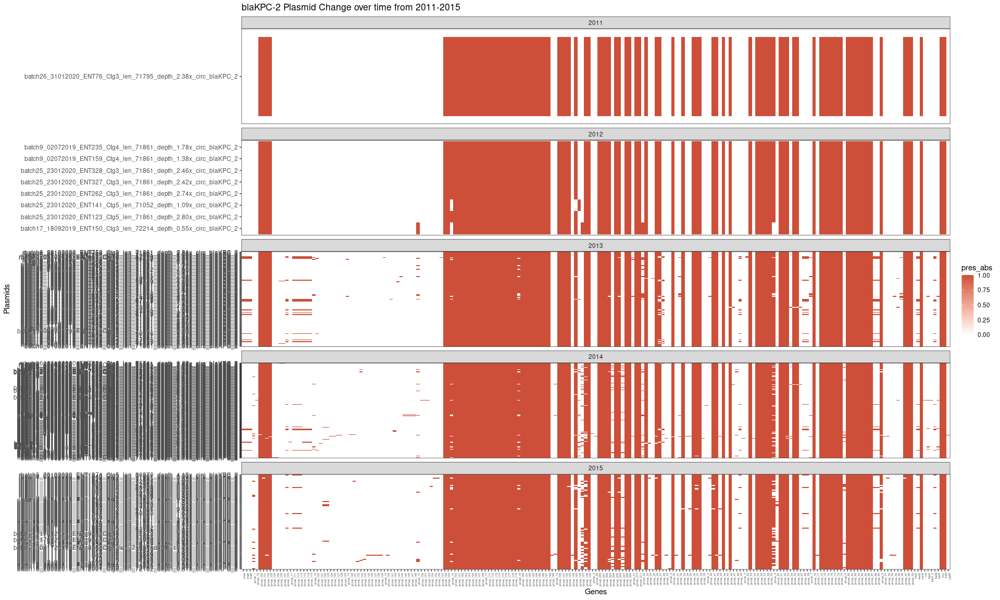
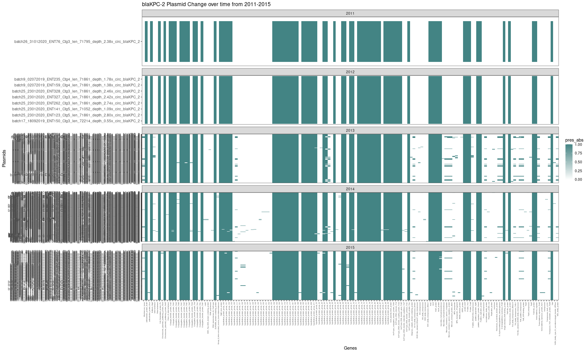
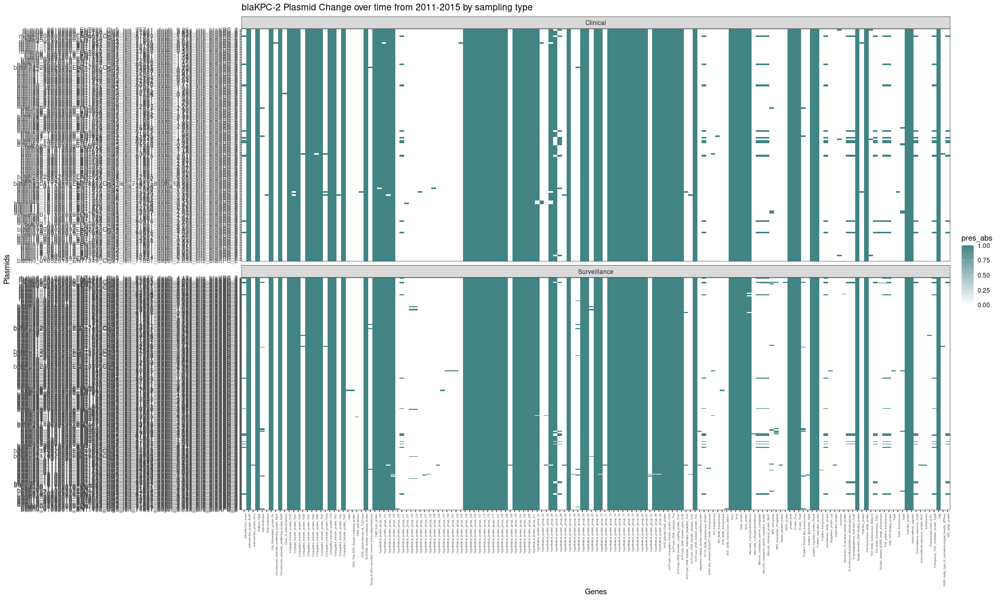
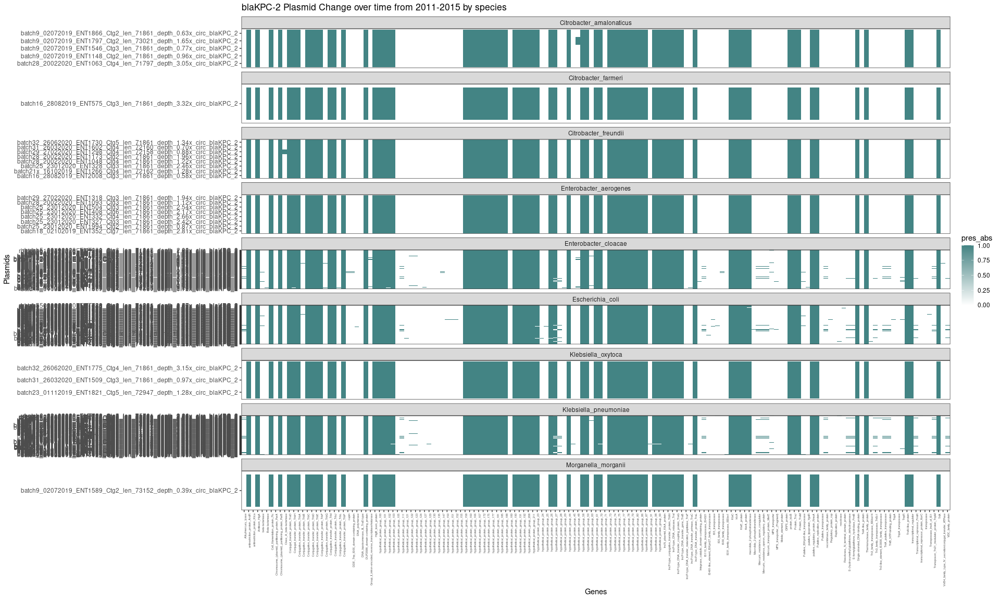
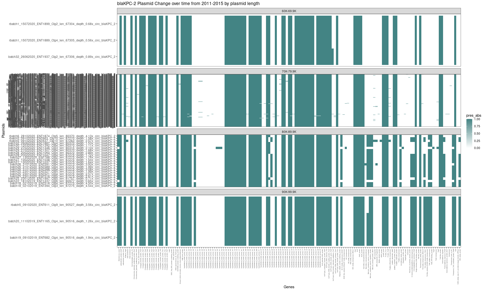
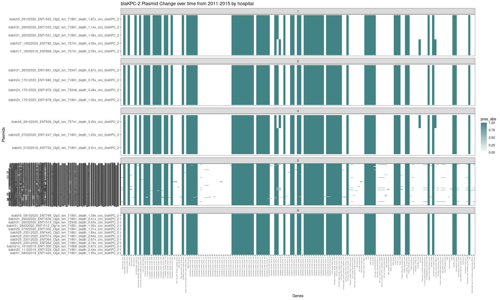
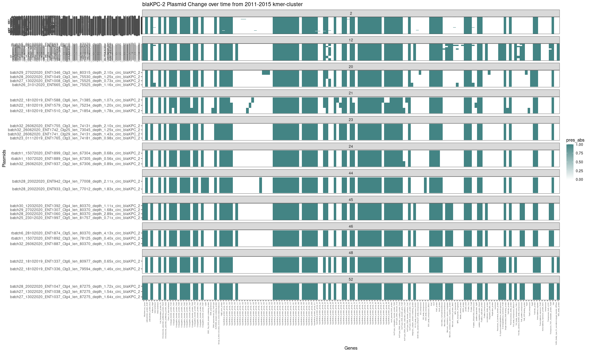
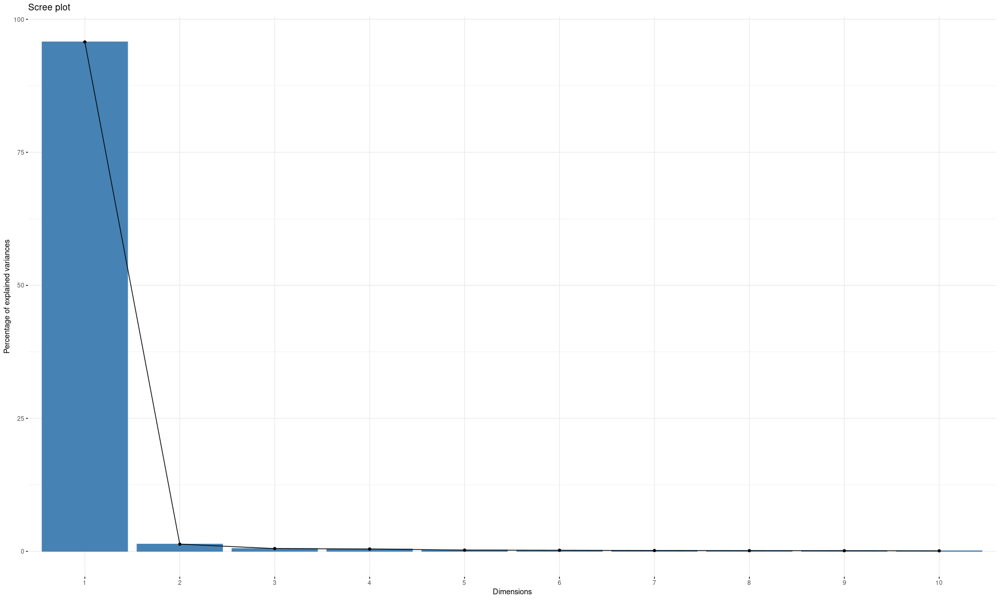
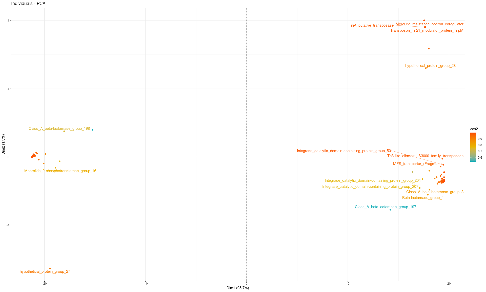

## R Markdown


```r
library(dplyr)
library(tidyverse)
library(reshape2)
library(stringr)


Gene_PA_df <- read.table("/data02/Analysis/Projects/2_CPE_Transmission/Tracking_Plasmid_Change/roary_out/gene_presence_absence.Rtab", quote = "", check.names = FALSE, header = TRUE, sep = "\t")
#head(Gene_PA_df)

Gene_PA_meta <- read.table("/data02/Analysis/Projects/2_CPE_Transmission/Tracking_Plasmid_Change/roary_out/Plasmid_meta.csv", check.names = FALSE, header = TRUE, sep = ",", fill = TRUE)
#head(Gene_PA_meta)
View(Gene_PA_meta)
Gene_PA_df.melt <- melt(Gene_PA_df,variable.name = "Plasmid",value.name = "pres_abs",)
Gene_PA_df.melt$Plasmid = str_replace(Gene_PA_df.melt$Plasmid,"KPC-2","KPC_2")


#head(Gene_PA_df.melt)
#tail(Gene_PA_df.melt)

# rdate <- function(x,
#                   min = paste0(format(Sys.Date(), '%Y'), '-01-01'),
#                   max = paste0(format(Sys.Date(), '%Y'), '-12-31'),
#                   sort = FALSE) {
#   
#   dates <- sample(seq(as.Date(min), as.Date(max), by = "day"), x, replace = TRUE)
#   if (sort == TRUE) {
#     sort(dates)
#   } else {
#     dates
#   }
#   
# }
# 
# date.time <- rdate(354,"2015-01-01","2020-01-01")
# date.time.Gene_PA_df <- mutate(as.data.frame(date.time), id = row_number()) %>% select(id,date.time)

Gene_PA_df.melt.id.time <- left_join(Gene_PA_df.melt, Gene_PA_meta, by = c("Plasmid"))
#head(Gene_PA_df.melt.id.time)
#tail(Gene_PA_df.melt.id.time)

Gene_PA_df.melt.id.time$year=format(as.Date(Gene_PA_df.melt.id.time$date_of_culture, format="%d/%m/%Y"),"%Y")
#View(Gene_PA_df.melt.id.time)

# remove na in r - remove rows - na.omit function / option
Gene_PA_df.melt.id.time.noNA <- na.omit(Gene_PA_df.melt.id.time) 
Gene_PA_df.melt.id.time.noNA <- Gene_PA_df.melt.id.time.noNA %>%  mutate(lengthbin = case_when(plasmid_length_bp>=60000 & plasmid_length_bp<=69999 ~ "60K-69.9K",
                                                               plasmid_length_bp>=70000 & plasmid_length_bp<=79999 ~ "70K-79.9K",
                                                               plasmid_length_bp>=80000 & plasmid_length_bp<=89999 ~ "80K-89.9K",
                                                               plasmid_length_bp>=90000 & plasmid_length_bp<=99999 ~ "90K-99.9K",
                                                              ))


ggplot(Gene_PA_df.melt.id.time.noNA, aes(x = Gene, y = Plasmid, fill = pres_abs)) +
  geom_tile() +
  facet_wrap(~year, ncol=1,scales = "free_y") + 
  theme_bw() +
    theme(panel.grid.major = element_blank(),
          axis.text.x = element_text(angle = 90, hjust = 1, size = 4)) +
    ggtitle("blaKPC-2 Plasmid Change over time from 2011-2015") + # for the main title
    xlab("Genes") + # for the x axis label
    ylab("Plasmids")+ scale_fill_gradient(low = "white", high = "tomato3")
```

<!-- -->

```r
setwd("/data02/Analysis/Projects/2_CPE_Transmission/Tracking_Plasmid_Change/roary_out")
pdf(file = "plasmid_profile.pdf", width = 18, height = 10)
ggplot(Gene_PA_df.melt.id.time.noNA, aes(x = Gene, y = Plasmid, fill = pres_abs)) +
  geom_tile() +
  facet_wrap(~year, ncol=1,scales = "free_y") + 
  theme_bw() +
  theme(panel.grid.major = element_blank(),
        axis.text.x = element_text(angle = 90, hjust = 1, size = 4)) +
  ggtitle("blaKPC-2 Plasmid Change over time from 2011-2015") + # for the main title
  xlab("Genes") + # for the x axis label
  ylab("Plasmids")+ scale_fill_gradient(low = "white", high = "tomato3")
dev.off()
```

```
## png 
##   2
```

```r
Gene_PA_df.melt.id.time.noNA %>% mutate(lubri.date = as.character(as.Date(date_of_culture, "%d/%m/%Y"),"%Y%m%d")) %>%
  mutate(lubri.YM = as.character(as.Date(date_of_culture, "%d/%m/%Y"),"%Y%m")) %>% 
  arrange(desc(lubri.date)) %>% 
  ggplot(aes(x = Gene, y = Plasmid, fill = pres_abs)) +
  geom_tile() +
  facet_wrap(~year, ncol=1, scales = "free_y") + 
  theme_bw() +
  theme(panel.grid.major = element_blank(),
        axis.text.x = element_text(angle = 90, hjust = 1, size = 4)) +
  ggtitle("blaKPC-2 Plasmid Change over time from 2011-2015") + # for the main title
  xlab("Genes") + # for the x axis label
  ylab("Plasmids")+ scale_fill_gradient(low = "white", high = "tomato3") 
```

<!-- -->

```r
## Label annotated gene names instead of group names
## Prokka original annotate gene names are left untouched, hypothetical proteins are blasted against the uniprot database
## Unchracterized proteins from Uniprot are left untouched, only those proteins found in uniprot database are renamed

 group_prokkaid_annot.df <-  read.table("Plasmids_211_Proteins_groupID_prokkaID_annotation.txt", sep = "\t", header = TRUE)
 #view(group_prokkaid_annot.df)
 ##head( group_prokkaid_annot.df) %>% filter(Gene="group_4")
 #group_prokkaid_annot.df %>% filter(Gene=="group_4")
#Gene_PA_df.melt.id.time.noNA %>% #head()

Gene_PA_df.melt.id.time.noNA.withAnnot <- left_join(Gene_PA_df.melt.id.time.noNA, group_prokkaid_annot.df, by = c("Gene"))
#head(Gene_PA_df.melt.id.time.noNA.withAnnot)
#tail(Gene_PA_df.melt.id.time.noNA.withAnnot)

## By year
# Gene_PA_df.melt.id.time.noNA.withAnnot %>% mutate(lubri.date = as.character(as.Date(date_of_culture, "%d/%m/%Y"),"%Y%m%d")) %>%
  # mutate(lubri.YM = as.character(as.Date(date_of_culture, "%d/%m/%Y"),"%Y%m")) %>% 
  # arrange(desc(lubri.date)) %>% 
  # ggplot(aes(x = annotation, y = Plasmid, fill = pres_abs)) +
  # geom_tile() +
  # facet_wrap(~year, ncol=1, scales = "free_y") + 
  # theme_bw() +
  # theme(panel.grid.major = element_blank(),
  #       axis.text.x = element_text(angle = 90, hjust = 1, size = 2)) +
  # ggtitle("blaKPC-2 Plasmid Change over time from 2011-2015") + # for the main title
  # xlab("Genes") + # for the x axis label
  # ylab("Plasmids")+ scale_fill_gradient(low = "white", high = "tomato3") 

year_plot <- Gene_PA_df.melt.id.time.noNA.withAnnot %>% mutate(lubri.date = as.character(as.Date(date_of_culture, "%d/%m/%Y"),"%Y%m%d")) %>%
  mutate(lubri.YM = as.character(as.Date(date_of_culture, "%d/%m/%Y"),"%Y%m")) %>% 
  arrange(desc(lubri.date)) %>% 
  ggplot(aes(x = annotation, y = Plasmid, fill = pres_abs)) +
  geom_tile() +
  facet_wrap(~year, ncol=1, scales = "free_y") + 
  theme_bw() +
  theme(panel.grid.major = element_blank(),
        axis.text.x = element_text(angle = 90, hjust = 1, size = 4)) +
  ggtitle("blaKPC-2 Plasmid Change over time from 2011-2015") + # for the main title
  xlab("Genes") + # for the x axis label
  ylab("Plasmids")+ scale_fill_gradient(low = "white", high = "#438484") 

## By sampling_site
# Gene_PA_df.melt.id.time.noNA.withAnnot %>% mutate(lubri.date = as.character(as.Date(date_of_culture, "%d/%m/%Y"),"%Y%m%d")) %>%
#   mutate(lubri.YM = as.character(as.Date(date_of_culture, "%d/%m/%Y"),"%Y%m")) %>% 
#   arrange(desc(lubri.date)) %>% 
#   ggplot(aes(x = annotation, y = Plasmid, fill = pres_abs)) +
#   geom_tile() +
#   facet_wrap(~sampling_site, ncol=1, scales = "free_y") + 
#   theme_bw() +
#   theme(panel.grid.major = element_blank(),
#         axis.text.x = element_text(angle = 90, hjust = 1, size = 2)) +
#   ggtitle("blaKPC-2 Plasmid Change over time from 2011-2015") + # for the main title
#   xlab("Genes") + # for the x axis label
#   ylab("Plasmids")+ scale_fill_gradient(low = "white", high = "tomato3") 

## By sampling_type
sampling_type_plot <- Gene_PA_df.melt.id.time.noNA.withAnnot %>% mutate(lubri.date = as.character(as.Date(date_of_culture, "%d/%m/%Y"),"%Y%m%d")) %>%
  mutate(lubri.YM = as.character(as.Date(date_of_culture, "%d/%m/%Y"),"%Y%m")) %>% 
  arrange(desc(lubri.date)) %>% 
  ggplot(aes(x = annotation, y = Plasmid, fill = pres_abs)) +
  geom_tile() +
  facet_wrap(~sampling_type, ncol=1, scales = "free_y") + 
  theme_bw() +
  theme(panel.grid.major = element_blank(),
        axis.text.x = element_text(angle = 90, hjust = 1, size = 4)) +
  ggtitle("blaKPC-2 Plasmid Change over time from 2011-2015 by sampling type") + # for the main title
  xlab("Genes") + # for the x axis label
  ylab("Plasmids")+ scale_fill_gradient(low = "white", high = "#438484") 

## By Species
species_plot <- Gene_PA_df.melt.id.time.noNA.withAnnot %>% mutate(lubri.date = as.character(as.Date(date_of_culture, "%d/%m/%Y"),"%Y%m%d")) %>%
  mutate(lubri.YM = as.character(as.Date(date_of_culture, "%d/%m/%Y"),"%Y%m")) %>% 
  arrange(desc(lubri.date)) %>% 
  ggplot(aes(x = annotation, y = Plasmid, fill = pres_abs)) +
  geom_tile() +
  facet_wrap(~genomic_species, ncol=1, scales = "free_y") + 
  theme_bw() +
  theme(panel.grid.major = element_blank(),
        axis.text.x = element_text(angle = 90, hjust = 1, size = 4)) +
  ggtitle("blaKPC-2 Plasmid Change over time from 2011-2015 by species") + # for the main title
  xlab("Genes") + # for the x axis label
  ylab("Plasmids")+ scale_fill_gradient(low = "white", high = "#438484") 

## By Plasmid Length
plasmid_length_plot <- Gene_PA_df.melt.id.time.noNA.withAnnot %>% mutate(lubri.date = as.character(as.Date(date_of_culture, "%d/%m/%Y"),"%Y%m%d")) %>%
  mutate(lubri.YM = as.character(as.Date(date_of_culture, "%d/%m/%Y"),"%Y%m")) %>% 
  arrange(desc(lubri.date)) %>% 
  ggplot(aes(x = annotation, y = Plasmid, fill = pres_abs)) +
  geom_tile() +
  facet_wrap(~lengthbin, ncol=1, scales = "free_y") + 
  theme_bw() +
  theme(panel.grid.major = element_blank(),
        axis.text.x = element_text(angle = 90, hjust = 1, size = 4)) +
  ggtitle("blaKPC-2 Plasmid Change over time from 2011-2015 by plasmid length") + # for the main title
  xlab("Genes") + # for the x axis label
  ylab("Plasmids")+ scale_fill_gradient(low = "white", high = "#438484") 

## By hospital
hospital_plot <- Gene_PA_df.melt.id.time.noNA.withAnnot %>% mutate(lubri.date = as.character(as.Date(date_of_culture, "%d/%m/%Y"),"%Y%m%d")) %>%
  mutate(lubri.YM = as.character(as.Date(date_of_culture, "%d/%m/%Y"),"%Y%m")) %>% 
  arrange(desc(lubri.date)) %>% 
  ggplot(aes(x = annotation, y = Plasmid, fill = pres_abs)) +
  geom_tile() +
  facet_wrap(~hospital_type, ncol=1, scales = "free_y") + 
  theme_bw() +
  theme(panel.grid.major = element_blank(),
        axis.text.x = element_text(angle = 90, hjust = 1, size = 4)) +
  ggtitle("blaKPC-2 Plasmid Change over time from 2011-2015 by hospital") + # for the main title
  xlab("Genes") + # for the x axis label
  ylab("Plasmids")+ scale_fill_gradient(low = "white", high = "#438484") 

## By kmer_cluster
kmer_cluster_plot <- Gene_PA_df.melt.id.time.noNA.withAnnot %>% mutate(lubri.date = as.character(as.Date(date_of_culture, "%d/%m/%Y"),"%Y%m%d")) %>%
  mutate(lubri.YM = as.character(as.Date(date_of_culture, "%d/%m/%Y"),"%Y%m")) %>% 
  arrange(desc(lubri.date)) %>% 
  ggplot(aes(x = annotation, y = Plasmid, fill = pres_abs)) +
  geom_tile() +
  facet_wrap(~kmer_cluster, ncol=1, scales = "free_y") + 
  theme_bw() +
  theme(panel.grid.major = element_blank(),
        axis.text.x = element_text(angle = 90, hjust = 1, size = 4)) +
  ggtitle("blaKPC-2 Plasmid Change over time from 2011-2015 kmer-cluster") + # for the main title
  xlab("Genes") + # for the x axis label
  ylab("Plasmids")+ scale_fill_gradient(low = "white", high = "#438484") 

#kmer_cluster_plot

# setwd("/data02/Analysis/Projects/2_CPE_Transmission/Tracking_Plasmid_Change/roary_out")
# pdf(file = "Combined_plasmid_profile_with_annotated_genes.pdf", width = 18, height = 10)
year_plot
```

<!-- -->

```r
sampling_type_plot
```

<!-- -->

```r
species_plot
```

<!-- -->

```r
plasmid_length_plot
```

<!-- -->

```r
hospital_plot
```

<!-- -->

```r
kmer_cluster_plot
```

<!-- -->

```r
# dev.off()

## PCA plot
### Step 7a: Non compulsory - PCA plot based on resistome

setwd("/data02/Analysis/Projects/8_Aqueos_samples/6_PCA_plot_by_resistance")

library(broom)
library(ggfortify)
library(plotly)
library(tidyverse)
library(janitor)
library(kableExtra)
library(factoextra)

# DATA ----

#head(Gene_PA_df.melt.id.time.noNA.withAnnot)
#tail(Gene_PA_df.melt.id.time.noNA.withAnnot)


Annotated_Gene_PA_df <- read.table("/data02/Analysis/Projects/2_CPE_Transmission/Tracking_Plasmid_Change/roary_out/annotation_gene_presence_absence.txt", quote = "", check.names = FALSE, header = TRUE, sep = "\t")
#View(Annotated_Gene_PA_df)

Annotated_Gene_PA_df  <- Annotated_Gene_PA_df %>% remove_rownames %>% column_to_rownames(var="Gene")
res.pca <- prcomp(Annotated_Gene_PA_df, scale = TRUE)
fviz_eig(res.pca)
```

<!-- -->

```r
options(ggrepel.max.overlaps = 10)
fviz_pca_ind(res.pca,
             col.ind = "cos2", # Color by the quality of representation
             gradient.cols = c("#00AFBB", "#E7B800", "#FC4E07"),
             repel = TRUE     # Avoid text overlapping
)
```

```
## Warning: ggrepel: 196 unlabeled data points (too many overlaps). Consider
## increasing max.overlaps
```

<!-- -->

```r
pca <- fviz_pca_ind(res.pca,
                   col.ind = "cos2", # Color by the quality of representation
                   gradient.cols = c("#00AFBB", "#E7B800", "#FC4E07"),
                   repel = TRUE     # Avoid text overlapping
)
library(factoextra)
library(plotly)
library(FactoMineR)
ggly <- ggplotly(pca)
```

```
## Warning in geom2trace.default(dots[[1L]][[1L]], dots[[2L]][[1L]], dots[[3L]][[1L]]): geom_GeomTextRepel() has yet to be implemented in plotly.
##   If you'd like to see this geom implemented,
##   Please open an issue with your example code at
##   https://github.com/ropensci/plotly/issues
```

```r
bggly <- plotly_build(ggly)
bggly$x$data[[1]]$text <- 
  with(pca$data, paste0("name: ", name, 
                        "</br></br>x: ", x, 
                        "</br>y: ", y, 
                        "</br>coord: ", coord, 
                        "</br>cos2: ", cos2, 
                        "</br>contrib: ", contrib))

bggly
```

```{=html}
<div id="htmlwidget-1e44e7d10faee7331add" style="width:1920px;height:1152px;" class="plotly html-widget"></div>
<script type="application/json" data-for="htmlwidget-1e44e7d10faee7331add">{"x":{"data":[{"x":[-21.2670839712805,-21.2670839712805,-21.2670839712805,-21.2670839712805,-21.2670839712805,-21.2670839712805,-21.2670839712805,-21.2670839712805,-21.2670839712805,-21.2670839712805,-21.2670839712805,-21.2670839712805,-21.2670839712805,-21.2670839712805,-21.2670839712805,-21.2670839712805,-21.2670839712805,-21.2670839712805,-21.2670839712805,-21.2670839712805,-21.2670839712805,-21.2670839712805,-21.2670839712805,-21.2670839712805,-21.2670839712805,-21.2670839712805,-21.2670839712805,-21.2670839712805,-21.2670839712805,-21.2670839712805,-21.2670839712805,-21.2670839712805,-21.2670839712805,-21.2670839712805,-21.2670839712805,-21.2670839712805,-21.2670839712805,-21.2670839712805,-21.2670839712805,-21.2670839712805,-21.2670839712805,-21.2670839712805,-21.2670839712805,-21.2670839712805,-21.2670839712805,-21.2670839712805,-21.2670839712805,-21.2670839712805,-21.2670839712805,-21.2670839712805,-21.2670839712805,-21.2670839712805,-21.2670839712805,-21.2670839712805,-21.2670839712805,-21.2670839712805,-21.2670839712805,-21.2670839712805,-21.2670839712805,-21.2670839712805,-21.2670839712805,-21.2670839712805,-21.2670839712805,-21.2670839712805,-21.2670839712805,-21.2670839712805,-21.2670839712805,-21.2670839712805,-21.2670839712805,-21.2670839712805,-21.2670839712805,-21.172969096102,-21.1768757843438,-21.1710583103605,-21.1752447888236,-21.1874839863958,-21.1741618045326,-21.182270471114,-21.1768757843438,-21.182270471114,-21.182270471114,-21.0977132710579,-21.0873894708284,-21.0790224449022,-21.0907433873252,-21.0807170577954,-20.9794293509737,-20.9872019194744,-20.995903557629,-20.8937797364673,-20.8197990760903,-20.72668320571,-20.5601547031088,-20.0780218310728,-19.890274138886,-19.4585354477136,-18.9131372523647,-18.5009671521012,-18.0549368261394,-15.2501881130919,14.2042953624437,16.3880166450558,17.1044233793149,17.1044233793149,17.5493060700551,17.5493060700551,17.5493060700551,17.5493060700551,17.3817038191558,17.5493060700551,17.5493060700551,17.5493060700551,17.5493060700551,17.6276450242598,17.6330872794935,17.6240978199135,17.6934728584648,18.0018094459626,18.0018094459626,18.0018094459626,18.0018094459626,18.0018094459626,18.0018094459626,17.9099586555445,18.0564764670419,18.0701667137347,18.5856477223724,18.7830197674096,18.7830197674096,18.8517925858384,18.9492935024548,18.9492935024548,19.0137544038585,19.0137544038585,19.1731793602447,19.1663658824729,19.228007041964,19.2545249269467,19.2091629741861,19.2334287597698,19.3083798411219,19.3083798411219,19.3414723232624,19.3001525398947,19.3170615806973,19.3150212155221,19.3381272212511,19.3381272212511,19.3121021040117,19.3186068271749,19.4158865454225,19.4064622926921,19.4114413996661,19.4114413996661,19.4114413996661,19.4114413996661,19.4197885067699,19.4267655569875,19.4215520417057,19.4097693437251,19.4376884230621,19.4164417567581,19.419358201656,19.4317227721589,19.4313598231326,19.5082767594782,19.5035525852166,19.5035525852166,19.5108347347128,19.5002915255208,19.5095663885927,19.5095663885927,19.5072926350978,19.5072926350978,19.5072926350978,19.5113227570436,19.5020213820316,19.5044842969235,19.5028233158516,19.5165362723254,19.5165362723254,19.5165362723254,19.5165362723254,19.5165362723254,19.5213445073517,19.5165362723254,19.5177973030054,19.4974843602862,19.5034769860832,19.5082767594782,19.5082767594782,19.5082767594782,19.5082767594782,19.4984690174967,19.5001105962901,19.5059280702734,19.5059280702734,19.5213445073517,19.5165362723254,19.5165362723254,19.5005816237147,19.5095663885927,19.5005816237148,19.5165362723254,19.5095663885927,19.5005816237148,19.5113227570436,19.5063655418722,19.5082767594782,19.5063655418722,19.5165362723254],"y":[-0.018613253695738,-0.018613253695738,-0.018613253695738,-0.018613253695738,-0.018613253695738,-0.018613253695738,-0.018613253695738,-0.018613253695738,-0.018613253695738,-0.018613253695738,-0.018613253695738,-0.018613253695738,-0.018613253695738,-0.018613253695738,-0.018613253695738,-0.018613253695738,-0.018613253695738,-0.018613253695738,-0.018613253695738,-0.018613253695738,-0.018613253695738,-0.018613253695738,-0.018613253695738,-0.018613253695738,-0.018613253695738,-0.018613253695738,-0.018613253695738,-0.018613253695738,-0.018613253695738,-0.018613253695738,-0.018613253695738,-0.018613253695738,-0.018613253695738,-0.018613253695738,-0.018613253695738,-0.018613253695738,-0.018613253695738,-0.018613253695738,-0.018613253695738,-0.018613253695738,-0.018613253695738,-0.018613253695738,-0.018613253695738,-0.018613253695738,-0.018613253695738,-0.018613253695738,-0.018613253695738,-0.018613253695738,-0.018613253695738,-0.018613253695738,-0.018613253695738,-0.018613253695738,-0.018613253695738,-0.018613253695738,-0.018613253695738,-0.018613253695738,-0.018613253695738,-0.018613253695738,-0.018613253695738,-0.018613253695738,-0.018613253695738,-0.018613253695738,-0.018613253695738,-0.018613253695738,-0.018613253695738,-0.018613253695738,-0.018613253695738,-0.018613253695738,-0.018613253695738,-0.018613253695738,-0.018613253695738,-0.000398176053705623,0.0169977790349336,0.0125996424113854,0.00354690515760847,0.0920549681505137,0.0164316624692088,0.0378668163384462,0.0169977790349336,0.0378668163384462,0.0378668163384462,0.160400694438569,0.0660038312451997,0.0481421252658351,0.118163866784923,0.0624127953296306,0.0648232848386653,0.0391861071295563,0.118892865363815,0.0696072427225928,0.254579520527024,0.206213716789626,-0.157560142152781,-0.379459374474929,0.182615044045549,-6.53336082529323,-0.628285331695367,-0.254149239353127,1.5130622845631,1.59461558846656,-3.09641386916604,-0.881142497443001,-1.81661101023973,-1.81661101023973,8.01591142359488,8.01591142359488,8.01591142359488,8.01591142359488,-1.29468682333102,8.01591142359488,8.01591142359488,8.01591142359488,8.01591142359488,7.60197603294835,7.6381165063685,7.62082958757324,5.19602494592911,6.3692181393608,6.3692181393608,6.3692181393608,6.3692181393608,6.3692181393608,6.3692181393608,-2.21475404303249,-0.805282047135286,-1.91793659127907,-1.25996441375002,-1.18458544801056,-1.18458544801056,-1.56890356495786,-1.48574873028765,-1.48574873028765,-1.46948356230056,-1.46948356230056,-1.10870143312831,-0.56142663602713,-1.43557494164559,-1.02037636276924,-1.41949298774063,-1.51831071753239,-1.25295696286296,-1.25295696286296,-0.102070337612288,-1.35962408256163,-1.42301643322589,-1.39460070621026,-1.50176732291856,-1.50176732291856,-1.40582922761971,-1.42049594848876,-1.34702680459827,-1.36674569134154,-1.37298039096678,-1.37298039096678,-1.37298039096678,-1.37298039096678,-1.43613018295378,-1.47952149616067,-1.4253333443486,-1.38153359705173,-0.456402108503498,-1.3851246329673,-1.40454997494964,-1.4676558399068,-1.42955387236446,-1.36049661924264,-1.34312465977851,-1.34312465977851,-1.18252902206945,-1.32588283785396,-1.36893894221897,-1.36893894221897,-1.35552533555642,-1.35552533555642,-1.35552533555642,-1.35698761806054,-1.31872262566839,-1.34342896773262,-1.33747732587551,-1.41117576987261,-1.41117576987261,-1.41117576987261,-1.41117576987261,-1.41117576987261,-0.90542571200472,-1.41117576987261,-0.886572157379837,-1.32008016238233,-1.338619327994,-1.36049661924264,-1.36049661924264,-1.36049661924264,-1.36049661924264,-1.32480317859434,-1.33172044413348,-1.33611858075703,-1.33611858075703,-0.90542571200472,-1.41117576987261,-1.41117576987261,-1.34846919098511,-1.36893894221897,-1.34846919098511,-1.41117576987261,-1.36893894221897,-1.34846919098511,-1.35698761806054,-1.36885327431441,-1.36049661924264,-1.36885327431441,-1.41117576987261],"text":["name: hypothetical_protein_group_158<\/br><\/br>x: -21.2670839712805<\/br>y: -0.018613253695738<\/br>coord: 452.289207094708<\/br>cos2: 0.999524981154968<\/br>contrib: 0.526915980158863","name: TraN-like_protein<\/br><\/br>x: -21.2670839712805<\/br>y: -0.018613253695738<\/br>coord: 452.289207094708<\/br>cos2: 0.999524981154968<\/br>contrib: 0.526915980158863","name: hypothetical_protein_group_160<\/br><\/br>x: -21.2670839712805<\/br>y: -0.018613253695738<\/br>coord: 452.289207094708<\/br>cos2: 0.999524981154968<\/br>contrib: 0.526915980158863","name: klcA<\/br><\/br>x: -21.2670839712805<\/br>y: -0.018613253695738<\/br>coord: 452.289207094708<\/br>cos2: 0.999524981154968<\/br>contrib: 0.526915980158863","name: Conjugative_transfer_protein_TrbJ<\/br><\/br>x: -21.2670839712805<\/br>y: -0.018613253695738<\/br>coord: 452.289207094708<\/br>cos2: 0.999524981154968<\/br>contrib: 0.526915980158863","name: Conjugative_transfer_protein_TrbA<\/br><\/br>x: -21.2670839712805<\/br>y: -0.018613253695738<\/br>coord: 452.289207094708<\/br>cos2: 0.999524981154968<\/br>contrib: 0.526915980158863","name: KleE_protein<\/br><\/br>x: -21.2670839712805<\/br>y: -0.018613253695738<\/br>coord: 452.289207094708<\/br>cos2: 0.999524981154968<\/br>contrib: 0.526915980158863","name: DUF2688_domain-containing_protein<\/br><\/br>x: -21.2670839712805<\/br>y: -0.018613253695738<\/br>coord: 452.289207094708<\/br>cos2: 0.999524981154968<\/br>contrib: 0.526915980158863","name: hypothetical_protein_group_166<\/br><\/br>x: -21.2670839712805<\/br>y: -0.018613253695738<\/br>coord: 452.289207094708<\/br>cos2: 0.999524981154968<\/br>contrib: 0.526915980158863","name: hypothetical_protein_group_167<\/br><\/br>x: -21.2670839712805<\/br>y: -0.018613253695738<\/br>coord: 452.289207094708<\/br>cos2: 0.999524981154968<\/br>contrib: 0.526915980158863","name: transcriptional_regulator<\/br><\/br>x: -21.2670839712805<\/br>y: -0.018613253695738<\/br>coord: 452.289207094708<\/br>cos2: 0.999524981154968<\/br>contrib: 0.526915980158863","name: putative_regulatory_protein_RmoA<\/br><\/br>x: -21.2670839712805<\/br>y: -0.018613253695738<\/br>coord: 452.289207094708<\/br>cos2: 0.999524981154968<\/br>contrib: 0.526915980158863","name: TnpA_transposase_group_17<\/br><\/br>x: -21.2670839712805<\/br>y: -0.018613253695738<\/br>coord: 452.289207094708<\/br>cos2: 0.999524981154968<\/br>contrib: 0.526915980158863","name: Protein_TraJ<\/br><\/br>x: -21.2670839712805<\/br>y: -0.018613253695738<\/br>coord: 452.289207094708<\/br>cos2: 0.999524981154968<\/br>contrib: 0.526915980158863","name: protein_klcB<\/br><\/br>x: -21.2670839712805<\/br>y: -0.018613253695738<\/br>coord: 452.289207094708<\/br>cos2: 0.999524981154968<\/br>contrib: 0.526915980158863","name: hypothetical_protein_group_172<\/br><\/br>x: -21.2670839712805<\/br>y: -0.018613253695738<\/br>coord: 452.289207094708<\/br>cos2: 0.999524981154968<\/br>contrib: 0.526915980158863","name: Putative_replication_protein<\/br><\/br>x: -21.2670839712805<\/br>y: -0.018613253695738<\/br>coord: 452.289207094708<\/br>cos2: 0.999524981154968<\/br>contrib: 0.526915980158863","name: Mobile_element_protein_group_174<\/br><\/br>x: -21.2670839712805<\/br>y: -0.018613253695738<\/br>coord: 452.289207094708<\/br>cos2: 0.999524981154968<\/br>contrib: 0.526915980158863","name: hypothetical_protein_group_175<\/br><\/br>x: -21.2670839712805<\/br>y: -0.018613253695738<\/br>coord: 452.289207094708<\/br>cos2: 0.999524981154968<\/br>contrib: 0.526915980158863","name: Cell_filamentation_protein_Fic<\/br><\/br>x: -21.2670839712805<\/br>y: -0.018613253695738<\/br>coord: 452.289207094708<\/br>cos2: 0.999524981154968<\/br>contrib: 0.526915980158863","name: hypothetical_protein_group_177<\/br><\/br>x: -21.2670839712805<\/br>y: -0.018613253695738<\/br>coord: 452.289207094708<\/br>cos2: 0.999524981154968<\/br>contrib: 0.526915980158863","name: Conjugative_transfer_protein_TrbD<\/br><\/br>x: -21.2670839712805<\/br>y: -0.018613253695738<\/br>coord: 452.289207094708<\/br>cos2: 0.999524981154968<\/br>contrib: 0.526915980158863","name: Conjugal_transfer_protein_TraD<\/br><\/br>x: -21.2670839712805<\/br>y: -0.018613253695738<\/br>coord: 452.289207094708<\/br>cos2: 0.999524981154968<\/br>contrib: 0.526915980158863","name: Antitoxin_HigA<\/br><\/br>x: -21.2670839712805<\/br>y: -0.018613253695738<\/br>coord: 452.289207094708<\/br>cos2: 0.999524981154968<\/br>contrib: 0.526915980158863","name: hypothetical_protein_group_181<\/br><\/br>x: -21.2670839712805<\/br>y: -0.018613253695738<\/br>coord: 452.289207094708<\/br>cos2: 0.999524981154968<\/br>contrib: 0.526915980158863","name: IncP-type_DNA_transfer_protein_TraL<\/br><\/br>x: -21.2670839712805<\/br>y: -0.018613253695738<\/br>coord: 452.289207094708<\/br>cos2: 0.999524981154968<\/br>contrib: 0.526915980158863","name: Single-stranded_DNA-binding_protein<\/br><\/br>x: -21.2670839712805<\/br>y: -0.018613253695738<\/br>coord: 452.289207094708<\/br>cos2: 0.999524981154968<\/br>contrib: 0.526915980158863","name: Class_A_beta-lactamase_group_184<\/br><\/br>x: -21.2670839712805<\/br>y: -0.018613253695738<\/br>coord: 452.289207094708<\/br>cos2: 0.999524981154968<\/br>contrib: 0.526915980158863","name: hypothetical_protein_group_185<\/br><\/br>x: -21.2670839712805<\/br>y: -0.018613253695738<\/br>coord: 452.289207094708<\/br>cos2: 0.999524981154968<\/br>contrib: 0.526915980158863","name: antirestriction_protein_ArdR<\/br><\/br>x: -21.2670839712805<\/br>y: -0.018613253695738<\/br>coord: 452.289207094708<\/br>cos2: 0.999524981154968<\/br>contrib: 0.526915980158863","name: IncP-type_DNA_transfer_coupling_protein_TraG<\/br><\/br>x: -21.2670839712805<\/br>y: -0.018613253695738<\/br>coord: 452.289207094708<\/br>cos2: 0.999524981154968<\/br>contrib: 0.526915980158863","name: hypothetical_protein_group_188<\/br><\/br>x: -21.2670839712805<\/br>y: -0.018613253695738<\/br>coord: 452.289207094708<\/br>cos2: 0.999524981154968<\/br>contrib: 0.526915980158863","name: hypothetical_protein_group_190<\/br><\/br>x: -21.2670839712805<\/br>y: -0.018613253695738<\/br>coord: 452.289207094708<\/br>cos2: 0.999524981154968<\/br>contrib: 0.526915980158863","name: hypothetical_protein_group_191<\/br><\/br>x: -21.2670839712805<\/br>y: -0.018613253695738<\/br>coord: 452.289207094708<\/br>cos2: 0.999524981154968<\/br>contrib: 0.526915980158863","name: hypothetical_protein_group_192<\/br><\/br>x: -21.2670839712805<\/br>y: -0.018613253695738<\/br>coord: 452.289207094708<\/br>cos2: 0.999524981154968<\/br>contrib: 0.526915980158863","name: antirestriction_protein_Klca_group_199<\/br><\/br>x: -21.2670839712805<\/br>y: -0.018613253695738<\/br>coord: 452.289207094708<\/br>cos2: 0.999524981154968<\/br>contrib: 0.526915980158863","name: Chromosome_(plasmid)_partitioning_protein_ParB<\/br><\/br>x: -21.2670839712805<\/br>y: -0.018613253695738<\/br>coord: 452.289207094708<\/br>cos2: 0.999524981154968<\/br>contrib: 0.526915980158863","name: Conjugative_transfer_protein_TrbI<\/br><\/br>x: -21.2670839712805<\/br>y: -0.018613253695738<\/br>coord: 452.289207094708<\/br>cos2: 0.999524981154968<\/br>contrib: 0.526915980158863","name: IncP-type_DNA_relaxase_TraI<\/br><\/br>x: -21.2670839712805<\/br>y: -0.018613253695738<\/br>coord: 452.289207094708<\/br>cos2: 0.999524981154968<\/br>contrib: 0.526915980158863","name: IncP-type_DNA_transfer_gene_TraB<\/br><\/br>x: -21.2670839712805<\/br>y: -0.018613253695738<\/br>coord: 452.289207094708<\/br>cos2: 0.999524981154968<\/br>contrib: 0.526915980158863","name: hypothetical_protein_group_208<\/br><\/br>x: -21.2670839712805<\/br>y: -0.018613253695738<\/br>coord: 452.289207094708<\/br>cos2: 0.999524981154968<\/br>contrib: 0.526915980158863","name: TrfA<\/br><\/br>x: -21.2670839712805<\/br>y: -0.018613253695738<\/br>coord: 452.289207094708<\/br>cos2: 0.999524981154968<\/br>contrib: 0.526915980158863","name: HigB_toxin_protein<\/br><\/br>x: -21.2670839712805<\/br>y: -0.018613253695738<\/br>coord: 452.289207094708<\/br>cos2: 0.999524981154968<\/br>contrib: 0.526915980158863","name: hypothetical_protein_group_211<\/br><\/br>x: -21.2670839712805<\/br>y: -0.018613253695738<\/br>coord: 452.289207094708<\/br>cos2: 0.999524981154968<\/br>contrib: 0.526915980158863","name: Thermonuclease_family_protein<\/br><\/br>x: -21.2670839712805<\/br>y: -0.018613253695738<\/br>coord: 452.289207094708<\/br>cos2: 0.999524981154968<\/br>contrib: 0.526915980158863","name: IncP-type_DNA_transfer_primase_TraC_group_38<\/br><\/br>x: -21.2670839712805<\/br>y: -0.018613253695738<\/br>coord: 452.289207094708<\/br>cos2: 0.999524981154968<\/br>contrib: 0.526915980158863","name: hypothetical_protein_group_44<\/br><\/br>x: -21.2670839712805<\/br>y: -0.018613253695738<\/br>coord: 452.289207094708<\/br>cos2: 0.999524981154968<\/br>contrib: 0.526915980158863","name: Conjugative_transfer_protein_TrbL_group_53<\/br><\/br>x: -21.2670839712805<\/br>y: -0.018613253695738<\/br>coord: 452.289207094708<\/br>cos2: 0.999524981154968<\/br>contrib: 0.526915980158863","name: TelA-like_protein_group_55<\/br><\/br>x: -21.2670839712805<\/br>y: -0.018613253695738<\/br>coord: 452.289207094708<\/br>cos2: 0.999524981154968<\/br>contrib: 0.526915980158863","name: KlaC<\/br><\/br>x: -21.2670839712805<\/br>y: -0.018613253695738<\/br>coord: 452.289207094708<\/br>cos2: 0.999524981154968<\/br>contrib: 0.526915980158863","name: KorA_protein<\/br><\/br>x: -21.2670839712805<\/br>y: -0.018613253695738<\/br>coord: 452.289207094708<\/br>cos2: 0.999524981154968<\/br>contrib: 0.526915980158863","name: hypothetical_protein_group_58<\/br><\/br>x: -21.2670839712805<\/br>y: -0.018613253695738<\/br>coord: 452.289207094708<\/br>cos2: 0.999524981154968<\/br>contrib: 0.526915980158863","name: hypothetical_protein_group_59<\/br><\/br>x: -21.2670839712805<\/br>y: -0.018613253695738<\/br>coord: 452.289207094708<\/br>cos2: 0.999524981154968<\/br>contrib: 0.526915980158863","name: hypothetical_protein_group_61<\/br><\/br>x: -21.2670839712805<\/br>y: -0.018613253695738<\/br>coord: 452.289207094708<\/br>cos2: 0.999524981154968<\/br>contrib: 0.526915980158863","name: Conjugative_transfer_protein_TrbP<\/br><\/br>x: -21.2670839712805<\/br>y: -0.018613253695738<\/br>coord: 452.289207094708<\/br>cos2: 0.999524981154968<\/br>contrib: 0.526915980158863","name: transcriptional_repressor_protein_KorC_group_72<\/br><\/br>x: -21.2670839712805<\/br>y: -0.018613253695738<\/br>coord: 452.289207094708<\/br>cos2: 0.999524981154968<\/br>contrib: 0.526915980158863","name: hypothetical_protein_group_73<\/br><\/br>x: -21.2670839712805<\/br>y: -0.018613253695738<\/br>coord: 452.289207094708<\/br>cos2: 0.999524981154968<\/br>contrib: 0.526915980158863","name: hypothetical_protein_group_74<\/br><\/br>x: -21.2670839712805<\/br>y: -0.018613253695738<\/br>coord: 452.289207094708<\/br>cos2: 0.999524981154968<\/br>contrib: 0.526915980158863","name: hypothetical_protein_group_75<\/br><\/br>x: -21.2670839712805<\/br>y: -0.018613253695738<\/br>coord: 452.289207094708<\/br>cos2: 0.999524981154968<\/br>contrib: 0.526915980158863","name: Protein_TraM<\/br><\/br>x: -21.2670839712805<\/br>y: -0.018613253695738<\/br>coord: 452.289207094708<\/br>cos2: 0.999524981154968<\/br>contrib: 0.526915980158863","name: hypothetical_protein_group_77<\/br><\/br>x: -21.2670839712805<\/br>y: -0.018613253695738<\/br>coord: 452.289207094708<\/br>cos2: 0.999524981154968<\/br>contrib: 0.526915980158863","name: hypothetical_protein_group_78<\/br><\/br>x: -21.2670839712805<\/br>y: -0.018613253695738<\/br>coord: 452.289207094708<\/br>cos2: 0.999524981154968<\/br>contrib: 0.526915980158863","name: hypothetical_protein_group_79<\/br><\/br>x: -21.2670839712805<\/br>y: -0.018613253695738<\/br>coord: 452.289207094708<\/br>cos2: 0.999524981154968<\/br>contrib: 0.526915980158863","name: hypothetical_protein_group_80<\/br><\/br>x: -21.2670839712805<\/br>y: -0.018613253695738<\/br>coord: 452.289207094708<\/br>cos2: 0.999524981154968<\/br>contrib: 0.526915980158863","name: recombinase_family_protein_group_81<\/br><\/br>x: -21.2670839712805<\/br>y: -0.018613253695738<\/br>coord: 452.289207094708<\/br>cos2: 0.999524981154968<\/br>contrib: 0.526915980158863","name: IncP-type_conjugative_transfer_protein_TrbN<\/br><\/br>x: -21.2670839712805<\/br>y: -0.018613253695738<\/br>coord: 452.289207094708<\/br>cos2: 0.999524981154968<\/br>contrib: 0.526915980158863","name: IncN_plasmid_KikA_protein<\/br><\/br>x: -21.2670839712805<\/br>y: -0.018613253695738<\/br>coord: 452.289207094708<\/br>cos2: 0.999524981154968<\/br>contrib: 0.526915980158863","name: Conjugative_transfer_protein_TrbF<\/br><\/br>x: -21.2670839712805<\/br>y: -0.018613253695738<\/br>coord: 452.289207094708<\/br>cos2: 0.999524981154968<\/br>contrib: 0.526915980158863","name: Conjugative_transfer_protein_TrbC<\/br><\/br>x: -21.2670839712805<\/br>y: -0.018613253695738<\/br>coord: 452.289207094708<\/br>cos2: 0.999524981154968<\/br>contrib: 0.526915980158863","name: hypothetical_protein_group_86<\/br><\/br>x: -21.2670839712805<\/br>y: -0.018613253695738<\/br>coord: 452.289207094708<\/br>cos2: 0.999524981154968<\/br>contrib: 0.526915980158863","name: hypothetical_protein_group_87<\/br><\/br>x: -21.2670839712805<\/br>y: -0.018613253695738<\/br>coord: 452.289207094708<\/br>cos2: 0.999524981154968<\/br>contrib: 0.526915980158863","name: hypothetical_protein_group_100<\/br><\/br>x: -21.172969096102<\/br>y: -0.000398176053705623<\/br>coord: 448.294620503035<\/br>cos2: 0.990986804808508<\/br>contrib: 0.522262295135509","name: hypothetical_protein_group_101<\/br><\/br>x: -21.1768757843438<\/br>y: 0.0169977790349336<\/br>coord: 448.460356910017<\/br>cos2: 0.991519514478948<\/br>contrib: 0.522455377702954","name: Mobile_element_protein_group_193<\/br><\/br>x: -21.1710583103605<\/br>y: 0.0125996424113854<\/br>coord: 448.213868731672<\/br>cos2: 0.990974543590993<\/br>contrib: 0.522168219490789","name: DNA_topoisomerase_III,_TraE-type_group_33<\/br><\/br>x: -21.1752447888236<\/br>y: 0.00354690515760847<\/br>coord: 448.391004447135<\/br>cos2: 0.991787355614534<\/br>contrib: 0.522374582228769","name: IncP-type_DNA_transfer_maturation_peptidase_TraF_group_42<\/br><\/br>x: -21.1874839863958<\/br>y: 0.0920549681505137<\/br>coord: 448.917951790938<\/br>cos2: 0.991367461502649<\/br>contrib: 0.522988474782021","name: Conjugative_transfer_protein_TrbE<\/br><\/br>x: -21.1741618045326<\/br>y: 0.0164316624692088<\/br>coord: 448.345398124061<\/br>cos2: 0.99118209194036<\/br>contrib: 0.522321450957787","name: hypothetical_protein_group_70<\/br><\/br>x: -21.182270471114<\/br>y: 0.0378668163384462<\/br>coord: 448.690016207208<\/br>cos2: 0.992194747849033<\/br>contrib: 0.522722930303775","name: Chromosome_(plasmid)_partitioning_protein_ParA_group_97<\/br><\/br>x: -21.1768757843438<\/br>y: 0.0169977790349336<\/br>coord: 448.460356910017<\/br>cos2: 0.991519514478948<\/br>contrib: 0.522455377702954","name: hypothetical_protein_group_98<\/br><\/br>x: -21.182270471114<\/br>y: 0.0378668163384462<\/br>coord: 448.690016207208<\/br>cos2: 0.992194747849033<\/br>contrib: 0.522722930303775","name: hypothetical_protein_group_99<\/br><\/br>x: -21.182270471114<\/br>y: 0.0378668163384462<\/br>coord: 448.690016207208<\/br>cos2: 0.992194747849033<\/br>contrib: 0.522722930303775","name: hypothetical_protein_group_102<\/br><\/br>x: -21.0977132710579<\/br>y: 0.160400694438569<\/br>coord: 445.139233650547<\/br>cos2: 0.983227684513444<\/br>contrib: 0.518586276052855","name: hypothetical_protein_group_103<\/br><\/br>x: -21.0873894708284<\/br>y: 0.0660038312451997<\/br>coord: 444.682351200145<\/br>cos2: 0.983702591450131<\/br>contrib: 0.51805400895385","name: transposase_group_30<\/br><\/br>x: -21.0790224449022<\/br>y: 0.0481421252658351<\/br>coord: 444.327504896914<\/br>cos2: 0.982504535543055<\/br>contrib: 0.51764061375286","name: Conjugal_transfer_protein_TrbH<\/br><\/br>x: -21.0907433873252<\/br>y: 0.118163866784923<\/br>coord: 444.833419329414<\/br>cos2: 0.983212350770677<\/br>contrib: 0.518230003008442","name: Conjugative_transfer_protein_TrbB_group_66<\/br><\/br>x: -21.0807170577954<\/br>y: 0.0624127953296306<\/br>coord: 444.400527027849<\/br>cos2: 0.982830576074779<\/br>contrib: 0.51772568438265","name: hypothetical_protein_group_23<\/br><\/br>x: -20.9794293509737<\/br>y: 0.0648232848386653<\/br>coord: 440.140657950753<\/br>cos2: 0.973857720877455<\/br>contrib: 0.512762945818702","name: macrolide_2-phosphotransferase_group_41<\/br><\/br>x: -20.9872019194744<\/br>y: 0.0391861071295563<\/br>coord: 440.464179959782<\/br>cos2: 0.976150618746235<\/br>contrib: 0.513139848282472","name: Conjugative_transfer_protein_TrbG_group_65<\/br><\/br>x: -20.995903557629<\/br>y: 0.118892865363815<\/br>coord: 440.842101714691<\/br>cos2: 0.975574528159292<\/br>contrib: 0.513580126336398","name: IS6_family_transposase_group_37<\/br><\/br>x: -20.8937797364673<\/br>y: 0.0696072427225928<\/br>coord: 436.554876844251<\/br>cos2: 0.967851766023768<\/br>contrib: 0.508585518330427","name: hypothetical_protein_group_26<\/br><\/br>x: -20.8197990760903<\/br>y: 0.254579520527024<\/br>coord: 433.528844301044<\/br>cos2: 0.958584203724104<\/br>contrib: 0.505060196747498","name: Integrase_catalytic_domain-containing_protein_group_203<\/br><\/br>x: -20.72668320571<\/br>y: 0.206213716789626<\/br>coord: 429.637920806855<\/br>cos2: 0.951777622522228<\/br>contrib: 0.50052727901587","name: Integrase_catalytic_domain-containing_protein_group_206<\/br><\/br>x: -20.5601547031088<\/br>y: -0.157560142152781<\/br>coord: 422.74478661416<\/br>cos2: 0.935374486000688<\/br>contrib: 0.49249679210056","name: Mobile_element_protein_group_195<\/br><\/br>x: -20.0780218310728<\/br>y: -0.379459374474929<\/br>coord: 403.270950065913<\/br>cos2: 0.895063232783492<\/br>contrib: 0.469809813257563","name: MFS_transporter_group_9<\/br><\/br>x: -19.890274138886<\/br>y: 0.182615044045549<\/br>coord: 395.656353574349<\/br>cos2: 0.880317947221996<\/br>contrib: 0.460938824273237","name: hypothetical_protein_group_27<\/br><\/br>x: -19.4585354477136<\/br>y: -6.53336082529323<\/br>coord: 421.319405443403<\/br>cos2: 0.918683841963788<\/br>contrib: 0.490836226018265","name: Macrolide_2-phosphotransferase_group_16<\/br><\/br>x: -18.9131372523647<\/br>y: -0.628285331695367<\/br>coord: 358.101503184809<\/br>cos2: 0.794077489674821<\/br>contrib: 0.417187502127317","name: transposase_group_18<\/br><\/br>x: -18.5009671521012<\/br>y: -0.254149239353127<\/br>coord: 342.350377398992<\/br>cos2: 0.761337586546092<\/br>contrib: 0.398837473535319","name: Class_A_beta-lactamase_group_198<\/br><\/br>x: -18.0549368261394<\/br>y: 1.5130622845631<\/br>coord: 328.270101272853<\/br>cos2: 0.735043049011733<\/br>contrib: 0.382433981301736","name: Class_A_beta-lactamase_group_6<\/br><\/br>x: -15.2501881130919<\/br>y: 1.59461558846656<\/br>coord: 235.111036359669<\/br>cos2: 0.530577551522925<\/br>contrib: 0.273903865549637","name: Class_A_beta-lactamase_group_197<\/br><\/br>x: 14.2042953624437<\/br>y: -3.09641386916604<\/br>coord: 211.349785592702<\/br>cos2: 0.533703990449481<\/br>contrib: 0.246222058110321","name: transposase_group_22<\/br><\/br>x: 16.3880166450558<\/br>y: -0.881142497443001<\/br>coord: 269.343501659427<\/br>cos2: 0.694027016488828<\/br>contrib: 0.313784616015786","name: Integrase_catalytic_domain-containing_protein_group_204<\/br><\/br>x: 17.1044233793149<\/br>y: -1.81661101023973<\/br>coord: 295.861374701377<\/br>cos2: 0.760118141627505<\/br>contrib: 0.344677882639107","name: Integrase_catalytic_domain-containing_protein_group_207<\/br><\/br>x: 17.1044233793149<\/br>y: -1.81661101023973<\/br>coord: 295.861374701377<\/br>cos2: 0.760118141627505<\/br>contrib: 0.344677882639107","name: Alkylmercury_lyase<\/br><\/br>x: 17.5493060700551<\/br>y: 8.01591142359488<\/br>coord: 372.232979491391<\/br>cos2: 0.987153525359755<\/br>contrib: 0.433650642464015","name: hypothetical_protein_group_111<\/br><\/br>x: 17.5493060700551<\/br>y: 8.01591142359488<\/br>coord: 372.232979491391<\/br>cos2: 0.987153525359755<\/br>contrib: 0.433650642464015","name: Mercuric_resistance_operon_regulatory_protein<\/br><\/br>x: 17.5493060700551<\/br>y: 8.01591142359488<\/br>coord: 372.232979491391<\/br>cos2: 0.987153525359755<\/br>contrib: 0.433650642464015","name: IS110_family_transposase_IS4321<\/br><\/br>x: 17.5493060700551<\/br>y: 8.01591142359488<\/br>coord: 372.232979491391<\/br>cos2: 0.987153525359755<\/br>contrib: 0.433650642464015","name: Macrolide_2-phosphotransferase_group_15<\/br><\/br>x: 17.3817038191558<\/br>y: -1.29468682333102<\/br>coord: 303.799841627361<\/br>cos2: 0.781211797778818<\/br>contrib: 0.353926180002054","name: TniB_NTP-binding_protein<\/br><\/br>x: 17.5493060700551<\/br>y: 8.01591142359488<\/br>coord: 372.232979491391<\/br>cos2: 0.987153525359755<\/br>contrib: 0.433650642464015","name: transposase_group_69<\/br><\/br>x: 17.5493060700551<\/br>y: 8.01591142359488<\/br>coord: 372.232979491391<\/br>cos2: 0.987153525359755<\/br>contrib: 0.433650642464015","name: recombinase_family_protein_group_88<\/br><\/br>x: 17.5493060700551<\/br>y: 8.01591142359488<\/br>coord: 372.232979491391<\/br>cos2: 0.987153525359755<\/br>contrib: 0.433650642464015","name: Mercuric_transport_protein,_MerE<\/br><\/br>x: 17.5493060700551<\/br>y: 8.01591142359488<\/br>coord: 372.232979491391<\/br>cos2: 0.987153525359755<\/br>contrib: 0.433650642464015","name: Transposon_Tn21_modulator_protein_TnpM<\/br><\/br>x: 17.6276450242598<\/br>y: 7.60197603294835<\/br>coord: 368.523908706833<\/br>cos2: 0.9760787865499<\/br>contrib: 0.429329582758704","name: Mercuric_resistance_operon_coregulator<\/br><\/br>x: 17.6330872794935<\/br>y: 7.6381165063685<\/br>coord: 369.266590771095<\/br>cos2: 0.978045867086468<\/br>contrib: 0.430194805810014","name: TniA_putative_transposase<\/br><\/br>x: 17.6240978199135<\/br>y: 7.62082958757324<\/br>coord: 368.685867568713<\/br>cos2: 0.975989086944195<\/br>contrib: 0.429518264494006","name: hypothetical_protein_group_28<\/br><\/br>x: 17.6934728584648<\/br>y: 5.19602494592911<\/br>coord: 340.057657031947<\/br>cos2: 0.893805076744406<\/br>contrib: 0.396166459103665","name: Transcriptional_repressor_FrmR<\/br><\/br>x: 18.0018094459626<\/br>y: 6.3692181393608<\/br>coord: 364.632083035512<\/br>cos2: 0.963658191140095<\/br>contrib: 0.424795613992604","name: S-(hydroxymethyl)glutathione_dehydrogenase<\/br><\/br>x: 18.0018094459626<\/br>y: 6.3692181393608<\/br>coord: 364.632083035512<\/br>cos2: 0.963658191140095<\/br>contrib: 0.424795613992604","name: VOC_family_protein<\/br><\/br>x: 18.0018094459626<\/br>y: 6.3692181393608<\/br>coord: 364.632083035512<\/br>cos2: 0.963658191140095<\/br>contrib: 0.424795613992604","name: S-formylglutathione_hydrolase_FrmB<\/br><\/br>x: 18.0018094459626<\/br>y: 6.3692181393608<\/br>coord: 364.632083035512<\/br>cos2: 0.963658191140095<\/br>contrib: 0.424795613992604","name: resolvase_group_118<\/br><\/br>x: 18.0018094459626<\/br>y: 6.3692181393608<\/br>coord: 364.632083035512<\/br>cos2: 0.963658191140095<\/br>contrib: 0.424795613992604","name: Tn3_family_transposase_TnEc1<\/br><\/br>x: 18.0018094459626<\/br>y: 6.3692181393608<\/br>coord: 364.632083035512<\/br>cos2: 0.963658191140095<\/br>contrib: 0.424795613992604","name: Beta-lactamase_group_1<\/br><\/br>x: 17.9099586555445<\/br>y: -2.21475404303249<\/br>coord: 325.671754514443<\/br>cos2: 0.837514181289695<\/br>contrib: 0.379406912763455","name: Mobile_element_protein_group_196<\/br><\/br>x: 18.0564764670419<\/br>y: -0.805282047135286<\/br>coord: 326.684821580276<\/br>cos2: 0.844111008908058<\/br>contrib: 0.380587133776","name: Class_A_beta-lactamase_group_8<\/br><\/br>x: 18.0701667137347<\/br>y: -1.91793659127907<\/br>coord: 330.209405830331<\/br>cos2: 0.846861033706626<\/br>contrib: 0.384693267054526","name: MFS_transporter_group_12<\/br><\/br>x: 18.5856477223724<\/br>y: -1.25996441375002<\/br>coord: 347.013811584043<\/br>cos2: 0.896930740264302<\/br>contrib: 0.404270364605851","name: Putative_ISKpn6-like_transposase<\/br><\/br>x: 18.7830197674096<\/br>y: -1.18458544801056<\/br>coord: 354.205074266538<\/br>cos2: 0.916412592821911<\/br>contrib: 0.412648170588149","name: Beta-lactamase_group_7<\/br><\/br>x: 18.7830197674096<\/br>y: -1.18458544801056<\/br>coord: 354.205074266538<\/br>cos2: 0.916412592821911<\/br>contrib: 0.412648170588149","name: hypothetical_protein_group_48<\/br><\/br>x: 18.8517925858384<\/br>y: -1.56890356495786<\/br>coord: 357.851542095607<\/br>cos2: 0.923230611195486<\/br>contrib: 0.416896297981269","name: TnpA_tnpA<\/br><\/br>x: 18.9492935024548<\/br>y: -1.48574873028765<\/br>coord: 361.283173531727<\/br>cos2: 0.933951846095026<\/br>contrib: 0.420894141426002","name: TnpR<\/br><\/br>x: 18.9492935024548<\/br>y: -1.48574873028765<\/br>coord: 361.283173531727<\/br>cos2: 0.933951846095026<\/br>contrib: 0.420894141426002","name: hypothetical_protein_group_122<\/br><\/br>x: 19.0137544038585<\/br>y: -1.46948356230056<\/br>coord: 363.682238470119<\/br>cos2: 0.939557435676753<\/br>contrib: 0.423689047060822","name: hypothetical_protein_group_123<\/br><\/br>x: 19.0137544038585<\/br>y: -1.46948356230056<\/br>coord: 363.682238470119<\/br>cos2: 0.939557435676753<\/br>contrib: 0.423689047060822","name: Integrase_catalytic_domain-containing_protein_group_40<\/br><\/br>x: 19.1731793602447<\/br>y: -1.10870143312831<\/br>coord: 368.840025647933<\/br>cos2: 0.956242752869103<\/br>contrib: 0.429697858333827","name: MFS_transporter_(Fragment)<\/br><\/br>x: 19.1663658824729<\/br>y: -0.56142663602713<\/br>coord: 367.664781008464<\/br>cos2: 0.953580835689197<\/br>contrib: 0.428328700787242","name: Group_II_intron-encoded_reverse_transcriptase/maturase<\/br><\/br>x: 19.228007041964<\/br>y: -1.43557494164559<\/br>coord: 371.777130218896<\/br>cos2: 0.960562644239034<\/br>contrib: 0.433119579015112","name: Mobile_element_protein_group_21<\/br><\/br>x: 19.2545249269467<\/br>y: -1.02037636276924<\/br>coord: 371.777898084109<\/br>cos2: 0.963619886069531<\/br>contrib: 0.433120473576478","name: hypothetical_protein_group_60<\/br><\/br>x: 19.2091629741861<\/br>y: -1.41949298774063<\/br>coord: 371.006902511086<\/br>cos2: 0.959135632790297<\/br>contrib: 0.432222265346688","name: Conjugative_transfer_protein_TrbG_group_64<\/br><\/br>x: 19.2334287597698<\/br>y: -1.51831071753239<\/br>coord: 372.230049292113<\/br>cos2: 0.962202730815685<\/br>contrib: 0.433647228787985","name: Tn3_family_transposase_ISSba14<\/br><\/br>x: 19.3083798411219<\/br>y: -1.25295696286296<\/br>coord: 374.383433239831<\/br>cos2: 0.967816949458267<\/br>contrib: 0.436155916582591","name: resolvase_group_107<\/br><\/br>x: 19.3083798411219<\/br>y: -1.25295696286296<\/br>coord: 374.383433239831<\/br>cos2: 0.967816949458267<\/br>contrib: 0.436155916582591","name: Tn3-like_element_IS3000_family_transposase<\/br><\/br>x: 19.3414723232624<\/br>y: -0.102070337612288<\/br>coord: 374.102969985346<\/br>cos2: 0.971693423041609<\/br>contrib: 0.435829177477793","name: Mobile_element_protein_group_142<\/br><\/br>x: 19.3001525398947<\/br>y: -1.35962408256163<\/br>coord: 374.344465709086<\/br>cos2: 0.967431869503819<\/br>contrib: 0.436110519490785","name: Mobile_element_protein_group_19<\/br><\/br>x: 19.3170615806973<\/br>y: -1.42301643322589<\/br>coord: 375.173843881681<\/br>cos2: 0.969955086219548<\/br>contrib: 0.437076743326951","name: hypothetical_protein_group_24<\/br><\/br>x: 19.3150212155221<\/br>y: -1.39460070621026<\/br>coord: 375.014955685831<\/br>cos2: 0.968974369658628<\/br>contrib: 0.436891638911151","name: DNA_topoisomerase_III,_TraE-type_group_35<\/br><\/br>x: 19.3381272212511<\/br>y: -1.50176732291856<\/br>coord: 376.218469517478<\/br>cos2: 0.973411686275135<\/br>contrib: 0.438293730007488","name: IncP-type_DNA_transfer_maturation_peptidase_TraF_group_43<\/br><\/br>x: 19.3381272212511<\/br>y: -1.50176732291856<\/br>coord: 376.218469517478<\/br>cos2: 0.973411686275135<\/br>contrib: 0.438293730007488","name: Conjugative_transfer_protein_TrbB_group_67<\/br><\/br>x: 19.3121021040117<\/br>y: -1.40582922761971<\/br>coord: 374.933643493002<\/br>cos2: 0.969049415145945<\/br>contrib: 0.436796910376595","name: IS5_transposase<\/br><\/br>x: 19.3186068271749<\/br>y: -1.42049594848876<\/br>coord: 375.226378482641<\/br>cos2: 0.970469290335646<\/br>contrib: 0.437137946027177","name: Macrolide_2-phosphotransferase_group_13<\/br><\/br>x: 19.4158865454225<\/br>y: -1.34702680459827<\/br>coord: 378.791131557026<\/br>cos2: 0.980024843894883<\/br>contrib: 0.441290875902023","name: Beta-lactamase_group_131<\/br><\/br>x: 19.4064622926921<\/br>y: -1.36674569134154<\/br>coord: 378.47877250248<\/br>cos2: 0.978642409024331<\/br>contrib: 0.440926978256874","name: DDE_Tnp_IS66_domain-containing_protein<\/br><\/br>x: 19.4114413996661<\/br>y: -1.37298039096678<\/br>coord: 378.689132366649<\/br>cos2: 0.97966537804921<\/br>contrib: 0.441172047058597","name: cupin<\/br><\/br>x: 19.4114413996661<\/br>y: -1.37298039096678<\/br>coord: 378.689132366649<\/br>cos2: 0.97966537804921<\/br>contrib: 0.441172047058597","name: hypothetical_protein_group_147<\/br><\/br>x: 19.4114413996661<\/br>y: -1.37298039096678<\/br>coord: 378.689132366649<\/br>cos2: 0.97966537804921<\/br>contrib: 0.441172047058597","name: IS66_family_transposase<\/br><\/br>x: 19.4114413996661<\/br>y: -1.37298039096678<\/br>coord: 378.689132366649<\/br>cos2: 0.97966537804921<\/br>contrib: 0.441172047058597","name: hypothetical_protein_group_25<\/br><\/br>x: 19.4197885067699<\/br>y: -1.43613018295378<\/br>coord: 379.190655550064<\/br>cos2: 0.981638201505094<\/br>contrib: 0.44175632051818","name: hypothetical_protein_group_29<\/br><\/br>x: 19.4267655569875<\/br>y: -1.47952149616067<\/br>coord: 379.588203863758<\/br>cos2: 0.98286004207086<\/br>contrib: 0.442219463472035","name: IncP-type_DNA_transfer_primase_TraC_group_39<\/br><\/br>x: 19.4215520417057<\/br>y: -1.4253333443486<\/br>coord: 379.228258851196<\/br>cos2: 0.980386433028705<\/br>contrib: 0.44180012828534","name: VirB4_family_type_IV_secretion/conjugal_transfer_ATPase<\/br><\/br>x: 19.4097693437251<\/br>y: -1.38153359705173<\/br>coord: 378.647781056393<\/br>cos2: 0.978983481985955<\/br>contrib: 0.441123872868648","name: Integrase_catalytic_domain-containing_protein_group_50<\/br><\/br>x: 19.4376884230621<\/br>y: -0.456402108503498<\/br>coord: 378.03203411669<\/br>cos2: 0.981190873256205<\/br>contrib: 0.440406528971925","name: hypothetical_protein_group_91<\/br><\/br>x: 19.4164417567581<\/br>y: -1.3851246329673<\/br>coord: 378.916780742431<\/br>cos2: 0.979389460917375<\/br>contrib: 0.441437256940184","name: TelA-like_protein_group_92<\/br><\/br>x: 19.419358201656<\/br>y: -1.40454997494964<\/br>coord: 379.084233596355<\/br>cos2: 0.980494693849243<\/br>contrib: 0.441632339164725","name: Mobile_element_protein_group_93<\/br><\/br>x: 19.4317227721589<\/br>y: -1.4676558399068<\/br>coord: 379.745863558452<\/br>cos2: 0.982784621752638<\/br>contrib: 0.442403136686559","name: Integrase_catalytic_domain-containing_protein_group_94<\/br><\/br>x: 19.4313598231326<\/br>y: -1.42955387236446<\/br>coord: 379.621368850045<\/br>cos2: 0.983234256574283<\/br>contrib: 0.442258100611685","name: Macrolide_2-phosphotransferase_group_10<\/br><\/br>x: 19.5082767594782<\/br>y: -1.36049661924264<\/br>coord: 382.423813175368<\/br>cos2: 0.989955552193113<\/br>contrib: 0.445522942388485","name: IS91_family_transposase_ISSbo1<\/br><\/br>x: 19.5035525852166<\/br>y: -1.34312465977851<\/br>coord: 382.192547296015<\/br>cos2: 0.988873511136281<\/br>contrib: 0.445253518122804","name: hypothetical_protein_group_105<\/br><\/br>x: 19.5035525852166<\/br>y: -1.34312465977851<\/br>coord: 382.192547296015<\/br>cos2: 0.988873511136281<\/br>contrib: 0.445253518122804","name: Macrolide_2-phosphotransferase_group_11<\/br><\/br>x: 19.5108347347128<\/br>y: -1.18252902206945<\/br>coord: 382.071046933312<\/br>cos2: 0.989042369258583<\/br>contrib: 0.445111970454411","name: hypothetical_protein_group_121<\/br><\/br>x: 19.5002915255208<\/br>y: -1.32588283785396<\/br>coord: 382.019334880014<\/br>cos2: 0.988038063833655<\/br>contrib: 0.445051726020491","name: hypothetical_protein_group_124<\/br><\/br>x: 19.5095663885927<\/br>y: -1.36893894221897<\/br>coord: 382.497174498431<\/br>cos2: 0.989855012619342<\/br>contrib: 0.445608408176393","name: Conjugative_transfer_protein_TrbL_group_125<\/br><\/br>x: 19.5095663885927<\/br>y: -1.36893894221897<\/br>coord: 382.497174498431<\/br>cos2: 0.989855012619342<\/br>contrib: 0.445608408176393","name: putative_lipoprotein_YgdR<\/br><\/br>x: 19.5072926350978<\/br>y: -1.35552533555642<\/br>coord: 382.371914886677<\/br>cos2: 0.989337601449963<\/br>contrib: 0.44546248099072","name: hypothetical_protein_group_127<\/br><\/br>x: 19.5072926350978<\/br>y: -1.35552533555642<\/br>coord: 382.371914886677<\/br>cos2: 0.989337601449963<\/br>contrib: 0.44546248099072","name: Regulatory_protein_rop_group_128<\/br><\/br>x: 19.5072926350978<\/br>y: -1.35552533555642<\/br>coord: 382.371914886677<\/br>cos2: 0.989337601449963<\/br>contrib: 0.44546248099072","name: hypothetical_protein_group_129<\/br><\/br>x: 19.5113227570436<\/br>y: -1.35698761806054<\/br>coord: 382.533131125099<\/br>cos2: 0.989171614473158<\/br>contrib: 0.445650297571247","name: hypothetical_protein_group_130<\/br><\/br>x: 19.5020213820316<\/br>y: -1.31872262566839<\/br>coord: 382.067867348669<\/br>cos2: 0.988357579708442<\/br>contrib: 0.445108266244954","name: Putative_transposase<\/br><\/br>x: 19.5044842969235<\/br>y: -1.34342896773262<\/br>coord: 382.229709080277<\/br>cos2: 0.988679312597279<\/br>contrib: 0.445296811523733","name: IS481-like_element_ISKpn27_family_transposase<\/br><\/br>x: 19.5028233158516<\/br>y: -1.33747732587551<\/br>coord: 382.148962886557<\/br>cos2: 0.98847045365878<\/br>contrib: 0.445202742376956","name: hypothetical_protein_group_135<\/br><\/br>x: 19.5165362723254<\/br>y: -1.41117576987261<\/br>coord: 382.886605122469<\/br>cos2: 0.991642886511317<\/br>contrib: 0.44606209403878","name: Replication_protein<\/br><\/br>x: 19.5165362723254<\/br>y: -1.41117576987261<\/br>coord: 382.886605122469<\/br>cos2: 0.991642886511317<\/br>contrib: 0.44606209403878","name: antirestriction_protein_Klca_group_137<\/br><\/br>x: 19.5165362723254<\/br>y: -1.41117576987261<\/br>coord: 382.886605122469<\/br>cos2: 0.991642886511317<\/br>contrib: 0.44606209403878","name: transcriptional_repressor_protein_KorC_group_138<\/br><\/br>x: 19.5165362723254<\/br>y: -1.41117576987261<\/br>coord: 382.886605122469<\/br>cos2: 0.991642886511317<\/br>contrib: 0.44606209403878","name: transposase_group_139<\/br><\/br>x: 19.5165362723254<\/br>y: -1.41117576987261<\/br>coord: 382.886605122469<\/br>cos2: 0.991642886511317<\/br>contrib: 0.44606209403878","name: Macrolide_2-phosphotransferase_group_14<\/br><\/br>x: 19.5213445073517<\/br>y: -0.90542571200472<\/br>coord: 381.902687094668<\/br>cos2: 0.990007942316239<\/br>contrib: 0.444915831594569","name: Class_A_beta-lactamase_group_140<\/br><\/br>x: 19.5165362723254<\/br>y: -1.41117576987261<\/br>coord: 382.886605122469<\/br>cos2: 0.991642886511317<\/br>contrib: 0.44606209403878","name: Macrolide_2-phosphotransferase_group_141<\/br><\/br>x: 19.5177973030054<\/br>y: -0.886572157379837<\/br>coord: 381.730421751445<\/br>cos2: 0.9890469472713<\/br>contrib: 0.444715142830062","name: DNA_polymerase<\/br><\/br>x: 19.4974843602862<\/br>y: -1.32008016238233<\/br>coord: 381.894508014722<\/br>cos2: 0.987812278059666<\/br>contrib: 0.444906302983541","name: IS6_family_transposase_group_144<\/br><\/br>x: 19.5034769860832<\/br>y: -1.338619327994<\/br>coord: 382.177516251954<\/br>cos2: 0.988641226499837<\/br>contrib: 0.445236006987915","name: Regulatory_protein_rop_rop<\/br><\/br>x: 19.5082767594782<\/br>y: -1.36049661924264<\/br>coord: 382.423813175368<\/br>cos2: 0.989955552193113<\/br>contrib: 0.445522942388485","name: hypothetical_protein_group_150<\/br><\/br>x: 19.5082767594782<\/br>y: -1.36049661924264<\/br>coord: 382.423813175368<\/br>cos2: 0.989955552193113<\/br>contrib: 0.445522942388485","name: hypothetical_protein_group_151<\/br><\/br>x: 19.5082767594782<\/br>y: -1.36049661924264<\/br>coord: 382.423813175368<\/br>cos2: 0.989955552193113<\/br>contrib: 0.445522942388485","name: hypothetical_protein_group_152<\/br><\/br>x: 19.5082767594782<\/br>y: -1.36049661924264<\/br>coord: 382.423813175368<\/br>cos2: 0.989955552193113<\/br>contrib: 0.445522942388485","name: Transposase_InsA_of_IS1<\/br><\/br>x: 19.4984690174967<\/br>y: -1.32480317859434<\/br>coord: 381.945397488293<\/br>cos2: 0.988040766845772<\/br>contrib: 0.4449655891138","name: Resolvase,_N_terminal_domain_protein<\/br><\/br>x: 19.5001105962901<\/br>y: -1.33172044413348<\/br>coord: 382.027792608869<\/br>cos2: 0.988059938532865<\/br>contrib: 0.445061579256915","name: hypothetical_protein_group_155<\/br><\/br>x: 19.5059280702734<\/br>y: -1.33611858075703<\/br>coord: 382.266442744524<\/br>cos2: 0.988677172783694<\/br>contrib: 0.445339606165741","name: Chromosome_(plasmid)_partitioning_protein_ParA_group_156<\/br><\/br>x: 19.5059280702734<\/br>y: -1.33611858075703<\/br>coord: 382.266442744524<\/br>cos2: 0.988677172783694<\/br>contrib: 0.445339606165741","name: ORF6_protein<\/br><\/br>x: 19.5213445073517<\/br>y: -0.90542571200472<\/br>coord: 381.902687094668<\/br>cos2: 0.990007942316239<\/br>contrib: 0.444915831594569","name: hypothetical_protein_group_189<\/br><\/br>x: 19.5165362723254<\/br>y: -1.41117576987261<\/br>coord: 382.886605122469<\/br>cos2: 0.991642886511317<\/br>contrib: 0.44606209403878","name: Mobile_element_protein_group_194<\/br><\/br>x: 19.5165362723254<\/br>y: -1.41117576987261<\/br>coord: 382.886605122469<\/br>cos2: 0.991642886511317<\/br>contrib: 0.44606209403878","name: Beta-lactamase_group_2<\/br><\/br>x: 19.5005816237147<\/br>y: -1.34846919098511<\/br>coord: 382.091052822197<\/br>cos2: 0.988320662888299<\/br>contrib: 0.445135277273114","name: TnpA_transposase_group_20<\/br><\/br>x: 19.5095663885927<\/br>y: -1.36893894221897<\/br>coord: 382.497174498431<\/br>cos2: 0.989855012619342<\/br>contrib: 0.445608408176393","name: Class_A_beta-lactamase_group_3<\/br><\/br>x: 19.5005816237148<\/br>y: -1.34846919098511<\/br>coord: 382.091052822197<\/br>cos2: 0.988320662888299<\/br>contrib: 0.445135277273114","name: transposase_group_31<\/br><\/br>x: 19.5165362723254<\/br>y: -1.41117576987261<\/br>coord: 382.886605122469<\/br>cos2: 0.991642886511317<\/br>contrib: 0.44606209403878","name: DNA_topoisomerase_III,_TraE-type_group_34<\/br><\/br>x: 19.5095663885927<\/br>y: -1.36893894221897<\/br>coord: 382.497174498431<\/br>cos2: 0.989855012619342<\/br>contrib: 0.445608408176393","name: Class_A_beta-lactamase_group_4<\/br><\/br>x: 19.5005816237148<\/br>y: -1.34846919098511<\/br>coord: 382.091052822197<\/br>cos2: 0.988320662888299<\/br>contrib: 0.445135277273114","name: hypothetical_protein_group_45<\/br><\/br>x: 19.5113227570436<\/br>y: -1.35698761806054<\/br>coord: 382.533131125099<\/br>cos2: 0.989171614473158<\/br>contrib: 0.445650297571247","name: Beta-lactamase_group_5<\/br><\/br>x: 19.5063655418722<\/br>y: -1.36885327431441<\/br>coord: 382.372055939741<\/br>cos2: 0.989241276048318<\/br>contrib: 0.445462645317245","name: TnpA_tnpA_2<\/br><\/br>x: 19.5082767594782<\/br>y: -1.36049661924264<\/br>coord: 382.423813175368<\/br>cos2: 0.989955552193113<\/br>contrib: 0.445522942388485","name: Conjugative_transfer_protein_TrbL_group_54<\/br><\/br>x: 19.5063655418722<\/br>y: -1.36885327431441<\/br>coord: 382.372055939741<\/br>cos2: 0.989241276048318<\/br>contrib: 0.445462645317245","name: hypothetical_protein_group_71<\/br><\/br>x: 19.5165362723254<\/br>y: -1.41117576987261<\/br>coord: 382.886605122469<\/br>cos2: 0.991642886511317<\/br>contrib: 0.44606209403878"],"type":"scatter","mode":"markers","marker":{"autocolorscale":false,"color":["rgba(252,78,7,1)","rgba(252,78,7,1)","rgba(252,78,7,1)","rgba(252,78,7,1)","rgba(252,78,7,1)","rgba(252,78,7,1)","rgba(252,78,7,1)","rgba(252,78,7,1)","rgba(252,78,7,1)","rgba(252,78,7,1)","rgba(252,78,7,1)","rgba(252,78,7,1)","rgba(252,78,7,1)","rgba(252,78,7,1)","rgba(252,78,7,1)","rgba(252,78,7,1)","rgba(252,78,7,1)","rgba(252,78,7,1)","rgba(252,78,7,1)","rgba(252,78,7,1)","rgba(252,78,7,1)","rgba(252,78,7,1)","rgba(252,78,7,1)","rgba(252,78,7,1)","rgba(252,78,7,1)","rgba(252,78,7,1)","rgba(252,78,7,1)","rgba(252,78,7,1)","rgba(252,78,7,1)","rgba(252,78,7,1)","rgba(252,78,7,1)","rgba(252,78,7,1)","rgba(252,78,7,1)","rgba(252,78,7,1)","rgba(252,78,7,1)","rgba(252,78,7,1)","rgba(252,78,7,1)","rgba(252,78,7,1)","rgba(252,78,7,1)","rgba(252,78,7,1)","rgba(252,78,7,1)","rgba(252,78,7,1)","rgba(252,78,7,1)","rgba(252,78,7,1)","rgba(252,78,7,1)","rgba(252,78,7,1)","rgba(252,78,7,1)","rgba(252,78,7,1)","rgba(252,78,7,1)","rgba(252,78,7,1)","rgba(252,78,7,1)","rgba(252,78,7,1)","rgba(252,78,7,1)","rgba(252,78,7,1)","rgba(252,78,7,1)","rgba(252,78,7,1)","rgba(252,78,7,1)","rgba(252,78,7,1)","rgba(252,78,7,1)","rgba(252,78,7,1)","rgba(252,78,7,1)","rgba(252,78,7,1)","rgba(252,78,7,1)","rgba(252,78,7,1)","rgba(252,78,7,1)","rgba(252,78,7,1)","rgba(252,78,7,1)","rgba(252,78,7,1)","rgba(252,78,7,1)","rgba(252,78,7,1)","rgba(252,78,7,1)","rgba(252,83,7,1)","rgba(252,83,7,1)","rgba(252,83,7,1)","rgba(252,83,7,1)","rgba(252,83,7,1)","rgba(252,83,7,1)","rgba(252,83,7,1)","rgba(252,83,7,1)","rgba(252,83,7,1)","rgba(252,83,7,1)","rgba(251,88,6,1)","rgba(251,88,6,1)","rgba(251,89,6,1)","rgba(251,88,6,1)","rgba(251,88,6,1)","rgba(251,94,6,1)","rgba(251,92,6,1)","rgba(251,93,6,1)","rgba(250,97,5,1)","rgba(250,102,5,1)","rgba(249,105,5,1)","rgba(248,113,4,1)","rgba(245,132,2,1)","rgba(244,138,2,1)","rgba(247,121,3,1)","rgba(235,173,0,1)","rgba(229,184,12,1)","rgba(217,183,51,1)","rgba(0,175,187,1)","rgba(26,175,185,1)","rgba(196,182,85,1)","rgba(229,184,16,1)","rgba(229,184,16,1)","rgba(251,86,6,1)","rgba(251,86,6,1)","rgba(251,86,6,1)","rgba(251,86,6,1)","rgba(233,178,0,1)","rgba(251,86,6,1)","rgba(251,86,6,1)","rgba(251,86,6,1)","rgba(251,86,6,1)","rgba(251,92,6,1)","rgba(251,91,6,1)","rgba(251,92,6,1)","rgba(245,133,2,1)","rgba(250,99,5,1)","rgba(250,99,5,1)","rgba(250,99,5,1)","rgba(250,99,5,1)","rgba(250,99,5,1)","rgba(250,99,5,1)","rgba(240,156,1,1)","rgba(241,153,1,1)","rgba(241,152,1,1)","rgba(245,131,2,1)","rgba(247,122,3,1)","rgba(247,122,3,1)","rgba(247,119,3,1)","rgba(248,114,4,1)","rgba(248,114,4,1)","rgba(249,111,4,1)","rgba(249,111,4,1)","rgba(250,103,5,1)","rgba(249,104,5,1)","rgba(250,101,5,1)","rgba(250,99,5,1)","rgba(250,101,5,1)","rgba(250,100,5,1)","rgba(250,97,5,1)","rgba(250,97,5,1)","rgba(251,95,6,1)","rgba(250,97,5,1)","rgba(250,96,5,1)","rgba(250,96,5,1)","rgba(251,94,6,1)","rgba(251,94,6,1)","rgba(250,96,5,1)","rgba(250,95,5,1)","rgba(251,90,6,1)","rgba(251,91,6,1)","rgba(251,90,6,1)","rgba(251,90,6,1)","rgba(251,90,6,1)","rgba(251,90,6,1)","rgba(251,89,6,1)","rgba(251,88,6,1)","rgba(251,90,6,1)","rgba(251,91,6,1)","rgba(251,89,6,1)","rgba(251,90,6,1)","rgba(251,90,6,1)","rgba(251,88,6,1)","rgba(251,88,6,1)","rgba(252,84,6,1)","rgba(251,85,6,1)","rgba(251,85,6,1)","rgba(251,85,6,1)","rgba(251,85,6,1)","rgba(252,84,6,1)","rgba(252,84,6,1)","rgba(252,84,6,1)","rgba(252,84,6,1)","rgba(252,84,6,1)","rgba(251,85,6,1)","rgba(251,85,6,1)","rgba(251,85,6,1)","rgba(251,85,6,1)","rgba(252,83,7,1)","rgba(252,83,7,1)","rgba(252,83,7,1)","rgba(252,83,7,1)","rgba(252,83,7,1)","rgba(252,84,6,1)","rgba(252,83,7,1)","rgba(251,85,6,1)","rgba(251,85,6,1)","rgba(251,85,6,1)","rgba(252,84,6,1)","rgba(252,84,6,1)","rgba(252,84,6,1)","rgba(252,84,6,1)","rgba(251,85,6,1)","rgba(251,85,6,1)","rgba(251,85,6,1)","rgba(251,85,6,1)","rgba(252,84,6,1)","rgba(252,83,7,1)","rgba(252,83,7,1)","rgba(251,85,6,1)","rgba(252,84,6,1)","rgba(251,85,6,1)","rgba(252,83,7,1)","rgba(252,84,6,1)","rgba(251,85,6,1)","rgba(251,85,6,1)","rgba(251,85,6,1)","rgba(252,84,6,1)","rgba(251,85,6,1)","rgba(252,83,7,1)"],"opacity":1,"size":5.66929133858268,"symbol":"circle","line":{"width":1.88976377952756,"color":["rgba(252,78,7,1)","rgba(252,78,7,1)","rgba(252,78,7,1)","rgba(252,78,7,1)","rgba(252,78,7,1)","rgba(252,78,7,1)","rgba(252,78,7,1)","rgba(252,78,7,1)","rgba(252,78,7,1)","rgba(252,78,7,1)","rgba(252,78,7,1)","rgba(252,78,7,1)","rgba(252,78,7,1)","rgba(252,78,7,1)","rgba(252,78,7,1)","rgba(252,78,7,1)","rgba(252,78,7,1)","rgba(252,78,7,1)","rgba(252,78,7,1)","rgba(252,78,7,1)","rgba(252,78,7,1)","rgba(252,78,7,1)","rgba(252,78,7,1)","rgba(252,78,7,1)","rgba(252,78,7,1)","rgba(252,78,7,1)","rgba(252,78,7,1)","rgba(252,78,7,1)","rgba(252,78,7,1)","rgba(252,78,7,1)","rgba(252,78,7,1)","rgba(252,78,7,1)","rgba(252,78,7,1)","rgba(252,78,7,1)","rgba(252,78,7,1)","rgba(252,78,7,1)","rgba(252,78,7,1)","rgba(252,78,7,1)","rgba(252,78,7,1)","rgba(252,78,7,1)","rgba(252,78,7,1)","rgba(252,78,7,1)","rgba(252,78,7,1)","rgba(252,78,7,1)","rgba(252,78,7,1)","rgba(252,78,7,1)","rgba(252,78,7,1)","rgba(252,78,7,1)","rgba(252,78,7,1)","rgba(252,78,7,1)","rgba(252,78,7,1)","rgba(252,78,7,1)","rgba(252,78,7,1)","rgba(252,78,7,1)","rgba(252,78,7,1)","rgba(252,78,7,1)","rgba(252,78,7,1)","rgba(252,78,7,1)","rgba(252,78,7,1)","rgba(252,78,7,1)","rgba(252,78,7,1)","rgba(252,78,7,1)","rgba(252,78,7,1)","rgba(252,78,7,1)","rgba(252,78,7,1)","rgba(252,78,7,1)","rgba(252,78,7,1)","rgba(252,78,7,1)","rgba(252,78,7,1)","rgba(252,78,7,1)","rgba(252,78,7,1)","rgba(252,83,7,1)","rgba(252,83,7,1)","rgba(252,83,7,1)","rgba(252,83,7,1)","rgba(252,83,7,1)","rgba(252,83,7,1)","rgba(252,83,7,1)","rgba(252,83,7,1)","rgba(252,83,7,1)","rgba(252,83,7,1)","rgba(251,88,6,1)","rgba(251,88,6,1)","rgba(251,89,6,1)","rgba(251,88,6,1)","rgba(251,88,6,1)","rgba(251,94,6,1)","rgba(251,92,6,1)","rgba(251,93,6,1)","rgba(250,97,5,1)","rgba(250,102,5,1)","rgba(249,105,5,1)","rgba(248,113,4,1)","rgba(245,132,2,1)","rgba(244,138,2,1)","rgba(247,121,3,1)","rgba(235,173,0,1)","rgba(229,184,12,1)","rgba(217,183,51,1)","rgba(0,175,187,1)","rgba(26,175,185,1)","rgba(196,182,85,1)","rgba(229,184,16,1)","rgba(229,184,16,1)","rgba(251,86,6,1)","rgba(251,86,6,1)","rgba(251,86,6,1)","rgba(251,86,6,1)","rgba(233,178,0,1)","rgba(251,86,6,1)","rgba(251,86,6,1)","rgba(251,86,6,1)","rgba(251,86,6,1)","rgba(251,92,6,1)","rgba(251,91,6,1)","rgba(251,92,6,1)","rgba(245,133,2,1)","rgba(250,99,5,1)","rgba(250,99,5,1)","rgba(250,99,5,1)","rgba(250,99,5,1)","rgba(250,99,5,1)","rgba(250,99,5,1)","rgba(240,156,1,1)","rgba(241,153,1,1)","rgba(241,152,1,1)","rgba(245,131,2,1)","rgba(247,122,3,1)","rgba(247,122,3,1)","rgba(247,119,3,1)","rgba(248,114,4,1)","rgba(248,114,4,1)","rgba(249,111,4,1)","rgba(249,111,4,1)","rgba(250,103,5,1)","rgba(249,104,5,1)","rgba(250,101,5,1)","rgba(250,99,5,1)","rgba(250,101,5,1)","rgba(250,100,5,1)","rgba(250,97,5,1)","rgba(250,97,5,1)","rgba(251,95,6,1)","rgba(250,97,5,1)","rgba(250,96,5,1)","rgba(250,96,5,1)","rgba(251,94,6,1)","rgba(251,94,6,1)","rgba(250,96,5,1)","rgba(250,95,5,1)","rgba(251,90,6,1)","rgba(251,91,6,1)","rgba(251,90,6,1)","rgba(251,90,6,1)","rgba(251,90,6,1)","rgba(251,90,6,1)","rgba(251,89,6,1)","rgba(251,88,6,1)","rgba(251,90,6,1)","rgba(251,91,6,1)","rgba(251,89,6,1)","rgba(251,90,6,1)","rgba(251,90,6,1)","rgba(251,88,6,1)","rgba(251,88,6,1)","rgba(252,84,6,1)","rgba(251,85,6,1)","rgba(251,85,6,1)","rgba(251,85,6,1)","rgba(251,85,6,1)","rgba(252,84,6,1)","rgba(252,84,6,1)","rgba(252,84,6,1)","rgba(252,84,6,1)","rgba(252,84,6,1)","rgba(251,85,6,1)","rgba(251,85,6,1)","rgba(251,85,6,1)","rgba(251,85,6,1)","rgba(252,83,7,1)","rgba(252,83,7,1)","rgba(252,83,7,1)","rgba(252,83,7,1)","rgba(252,83,7,1)","rgba(252,84,6,1)","rgba(252,83,7,1)","rgba(251,85,6,1)","rgba(251,85,6,1)","rgba(251,85,6,1)","rgba(252,84,6,1)","rgba(252,84,6,1)","rgba(252,84,6,1)","rgba(252,84,6,1)","rgba(251,85,6,1)","rgba(251,85,6,1)","rgba(251,85,6,1)","rgba(251,85,6,1)","rgba(252,84,6,1)","rgba(252,83,7,1)","rgba(252,83,7,1)","rgba(251,85,6,1)","rgba(252,84,6,1)","rgba(251,85,6,1)","rgba(252,83,7,1)","rgba(252,84,6,1)","rgba(251,85,6,1)","rgba(251,85,6,1)","rgba(251,85,6,1)","rgba(252,84,6,1)","rgba(251,85,6,1)","rgba(252,83,7,1)"]}},"hoveron":"points","showlegend":false,"xaxis":"x","yaxis":"y","hoverinfo":"text","frame":null},{"showlegend":false,"xaxis":"x","yaxis":"y","hoverinfo":"text","frame":null},{"x":[-23.3065053952121,21.5607659312833],"y":[0,0],"text":"yintercept: 0","type":"scatter","mode":"lines","line":{"width":1.88976377952756,"color":"rgba(0,0,0,1)","dash":"dash"},"hoveron":"points","showlegend":false,"xaxis":"x","yaxis":"y","hoverinfo":"text","frame":null},{"x":[0,0],"y":[-7.26082443773763,8.74337503603928],"text":"xintercept: 0","type":"scatter","mode":"lines","line":{"width":1.88976377952756,"color":"rgba(0,0,0,1)","dash":"dash"},"hoveron":"points","showlegend":false,"xaxis":"x","yaxis":"y","hoverinfo":"text","frame":null},{"x":[-20],"y":[-4],"name":"99_38a9781802b95db5943277e1427b4e7f","type":"scatter","mode":"markers","opacity":0,"hoverinfo":"skip","showlegend":false,"marker":{"color":[0,1],"colorscale":[[0,"#00AFBB"],[0.00334448160535109,"#10AFBA"],[0.00668896321070242,"#1AAFB9"],[0.0100334448160535,"#22AFB8"],[0.0133779264214046,"#28AFB7"],[0.0167224080267559,"#2DAFB6"],[0.020066889632107,"#32AFB5"],[0.0234113712374581,"#36AFB5"],[0.0267558528428094,"#3AB0B4"],[0.0301003344481605,"#3EB0B3"],[0.0334448160535116,"#41B0B2"],[0.0367892976588629,"#44B0B1"],[0.040133779264214,"#47B0B0"],[0.0434782608695651,"#4AB0AF"],[0.0468227424749165,"#4DB0AE"],[0.0501672240802676,"#50B0AD"],[0.0535117056856186,"#52B0AC"],[0.05685618729097,"#55B0AB"],[0.0602006688963211,"#57B0AA"],[0.0635451505016722,"#59B0A9"],[0.0668896321070235,"#5BB0A8"],[0.0702341137123746,"#5EB0A8"],[0.0735785953177257,"#60B0A7"],[0.076923076923077,"#62B1A6"],[0.0802675585284281,"#64B1A5"],[0.0836120401337792,"#66B1A4"],[0.0869565217391305,"#68B1A3"],[0.0903010033444816,"#69B1A2"],[0.0936454849498327,"#6BB1A1"],[0.096989966555184,"#6DB1A0"],[0.100334448160535,"#6FB19F"],[0.103678929765886,"#70B19E"],[0.107023411371238,"#72B19D"],[0.110367892976589,"#74B19C"],[0.11371237458194,"#75B19B"],[0.117056856187291,"#77B19A"],[0.120401337792642,"#79B19A"],[0.123745819397993,"#7AB199"],[0.127090301003345,"#7CB198"],[0.130434782608696,"#7DB297"],[0.133779264214047,"#7FB296"],[0.137123745819398,"#80B295"],[0.140468227424749,"#81B294"],[0.1438127090301,"#83B293"],[0.147157190635452,"#84B292"],[0.150501672240803,"#86B291"],[0.153846153846154,"#87B290"],[0.157190635451505,"#88B28F"],[0.160535117056856,"#8AB28E"],[0.163879598662207,"#8BB28D"],[0.167224080267559,"#8CB28C"],[0.17056856187291,"#8DB28B"],[0.173913043478261,"#8FB28A"],[0.177257525083612,"#90B289"],[0.180602006688963,"#91B388"],[0.183946488294314,"#92B388"],[0.187290969899666,"#94B387"],[0.190635451505017,"#95B386"],[0.193979933110368,"#96B385"],[0.197324414715719,"#97B384"],[0.20066889632107,"#98B383"],[0.204013377926421,"#99B382"],[0.207357859531773,"#9BB381"],[0.210702341137124,"#9CB380"],[0.214046822742475,"#9DB37F"],[0.217391304347826,"#9EB37E"],[0.220735785953177,"#9FB37D"],[0.224080267558528,"#A0B37C"],[0.22742474916388,"#A1B37B"],[0.230769230769231,"#A2B37A"],[0.234113712374582,"#A3B479"],[0.237458193979933,"#A4B478"],[0.240802675585284,"#A5B477"],[0.244147157190635,"#A6B476"],[0.247491638795987,"#A7B475"],[0.250836120401338,"#A9B474"],[0.254180602006689,"#AAB473"],[0.25752508361204,"#ABB472"],[0.260869565217391,"#ACB471"],[0.264214046822742,"#ADB470"],[0.267558528428094,"#AEB46F"],[0.270903010033445,"#AEB46E"],[0.274247491638796,"#AFB46D"],[0.277591973244147,"#B0B46C"],[0.280936454849498,"#B1B46B"],[0.284280936454849,"#B2B46A"],[0.287625418060201,"#B3B469"],[0.290969899665552,"#B4B568"],[0.294314381270903,"#B5B567"],[0.297658862876254,"#B6B566"],[0.301003344481605,"#B7B565"],[0.304347826086956,"#B8B564"],[0.307692307692308,"#B9B563"],[0.311036789297659,"#BAB562"],[0.31438127090301,"#BBB560"],[0.317725752508361,"#BCB55F"],[0.321070234113712,"#BCB55E"],[0.324414715719063,"#BDB55D"],[0.327759197324415,"#BEB55C"],[0.331103678929766,"#BFB55B"],[0.334448160535117,"#C0B55A"],[0.337792642140468,"#C1B559"],[0.341137123745819,"#C2B558"],[0.34448160535117,"#C3B657"],[0.347826086956522,"#C3B656"],[0.351170568561873,"#C4B654"],[0.354515050167224,"#C5B653"],[0.357859531772575,"#C6B652"],[0.361204013377926,"#C7B651"],[0.364548494983277,"#C8B650"],[0.367892976588629,"#C8B64F"],[0.37123745819398,"#C9B64D"],[0.374581939799331,"#CAB64C"],[0.377926421404682,"#CBB64B"],[0.381270903010033,"#CCB64A"],[0.384615384615385,"#CDB649"],[0.387959866220736,"#CDB647"],[0.391304347826087,"#CEB646"],[0.394648829431438,"#CFB645"],[0.397993311036789,"#D0B644"],[0.40133779264214,"#D1B642"],[0.404682274247492,"#D1B741"],[0.408026755852843,"#D2B740"],[0.411371237458194,"#D3B73E"],[0.414715719063545,"#D4B73D"],[0.418060200668896,"#D5B73B"],[0.421404682274247,"#D5B73A"],[0.424749163879599,"#D6B739"],[0.42809364548495,"#D7B737"],[0.431438127090301,"#D8B736"],[0.434782608695652,"#D8B734"],[0.438127090301003,"#D9B732"],[0.441471571906354,"#DAB731"],[0.444816053511706,"#DBB72F"],[0.448160535117057,"#DCB72D"],[0.451505016722408,"#DCB72C"],[0.454849498327759,"#DDB72A"],[0.45819397993311,"#DEB728"],[0.461538461538462,"#DFB726"],[0.464882943143813,"#DFB724"],[0.468227424749164,"#E0B822"],[0.471571906354515,"#E1B820"],[0.474916387959866,"#E2B81D"],[0.478260869565217,"#E2B81B"],[0.481605351170569,"#E3B818"],[0.48494983277592,"#E4B815"],[0.488294314381271,"#E4B811"],[0.491638795986622,"#E5B80D"],[0.494983277591973,"#E6B808"],[0.498327759197324,"#E7B803"],[0.501672240802676,"#E7B800"],[0.505016722408027,"#E7B700"],[0.508361204013378,"#E8B700"],[0.511705685618729,"#E8B600"],[0.51505016722408,"#E8B500"],[0.518394648829431,"#E8B500"],[0.521739130434783,"#E8B400"],[0.525083612040134,"#E9B400"],[0.528428093645485,"#E9B300"],[0.531772575250836,"#E9B200"],[0.535117056856187,"#E9B200"],[0.538461538461539,"#E9B100"],[0.54180602006689,"#EAB100"],[0.545150501672241,"#EAB000"],[0.548494983277592,"#EAAF00"],[0.551839464882943,"#EAAF00"],[0.555183946488294,"#EAAE00"],[0.558528428093646,"#EBAE00"],[0.561872909698997,"#EBAD00"],[0.565217391304348,"#EBAC00"],[0.568561872909699,"#EBAC00"],[0.57190635451505,"#EBAB00"],[0.575250836120401,"#ECAB00"],[0.578595317725753,"#ECAA00"],[0.581939799331104,"#ECA900"],[0.585284280936455,"#ECA900"],[0.588628762541806,"#ECA800"],[0.591973244147157,"#EDA800"],[0.595317725752509,"#EDA700"],[0.59866220735786,"#EDA600"],[0.602006688963211,"#EDA600"],[0.605351170568562,"#EDA500"],[0.608695652173913,"#EEA500"],[0.612040133779264,"#EEA400"],[0.615384615384616,"#EEA300"],[0.618729096989967,"#EEA300"],[0.622073578595318,"#EEA200"],[0.625418060200669,"#EEA100"],[0.62876254180602,"#EFA101"],[0.632107023411371,"#EFA001"],[0.635451505016723,"#EFA001"],[0.638795986622074,"#EF9F01"],[0.642140468227425,"#EF9E01"],[0.645484949832776,"#EF9E01"],[0.648829431438127,"#F09D01"],[0.652173913043478,"#F09C01"],[0.65551839464883,"#F09C01"],[0.658862876254181,"#F09B01"],[0.662207357859532,"#F09B01"],[0.665551839464883,"#F09A01"],[0.668896321070234,"#F19901"],[0.672240802675585,"#F19901"],[0.675585284280937,"#F19801"],[0.678929765886288,"#F19701"],[0.682274247491639,"#F19701"],[0.68561872909699,"#F19601"],[0.688963210702341,"#F29601"],[0.692307692307692,"#F29501"],[0.695652173913044,"#F29401"],[0.698996655518395,"#F29401"],[0.702341137123746,"#F29301"],[0.705685618729097,"#F29201"],[0.709030100334448,"#F29201"],[0.712374581939799,"#F39101"],[0.715719063545151,"#F39001"],[0.719063545150502,"#F39001"],[0.722408026755853,"#F38F02"],[0.725752508361204,"#F38E02"],[0.729096989966555,"#F38E02"],[0.732441471571906,"#F38D02"],[0.735785953177258,"#F48C02"],[0.739130434782609,"#F48C02"],[0.74247491638796,"#F48B02"],[0.745819397993311,"#F48A02"],[0.749163879598662,"#F48A02"],[0.752508361204013,"#F48902"],[0.755852842809365,"#F48802"],[0.759197324414716,"#F58802"],[0.762541806020067,"#F58702"],[0.765886287625418,"#F58602"],[0.769230769230769,"#F58602"],[0.77257525083612,"#F58502"],[0.775919732441472,"#F58402"],[0.779264214046823,"#F58402"],[0.782608695652174,"#F58302"],[0.785953177257525,"#F68202"],[0.789297658862876,"#F68203"],[0.792642140468227,"#F68103"],[0.795986622073579,"#F68003"],[0.79933110367893,"#F67F03"],[0.802675585284281,"#F67F03"],[0.806020066889632,"#F67E03"],[0.809364548494983,"#F67D03"],[0.812709030100334,"#F77D03"],[0.816053511705686,"#F77C03"],[0.819397993311037,"#F77B03"],[0.822742474916388,"#F77A03"],[0.826086956521739,"#F77A03"],[0.82943143812709,"#F77903"],[0.832775919732441,"#F77803"],[0.836120401337793,"#F77803"],[0.839464882943144,"#F87703"],[0.842809364548495,"#F87603"],[0.846153846153846,"#F87504"],[0.849498327759197,"#F87504"],[0.852842809364548,"#F87404"],[0.8561872909699,"#F87304"],[0.859531772575251,"#F87204"],[0.862876254180602,"#F87204"],[0.866220735785953,"#F87104"],[0.869565217391304,"#F97004"],[0.872909698996655,"#F96F04"],[0.876254180602007,"#F96E04"],[0.879598662207358,"#F96E04"],[0.882943143812709,"#F96D04"],[0.88628762541806,"#F96C04"],[0.889632107023411,"#F96B04"],[0.892976588628763,"#F96B04"],[0.896321070234114,"#F96A05"],[0.899665551839465,"#F96905"],[0.903010033444816,"#FA6805"],[0.906354515050167,"#FA6705"],[0.909698996655518,"#FA6705"],[0.91304347826087,"#FA6605"],[0.916387959866221,"#FA6505"],[0.919732441471572,"#FA6405"],[0.923076923076923,"#FA6305"],[0.926421404682274,"#FA6205"],[0.929765886287625,"#FA6205"],[0.933110367892977,"#FA6105"],[0.936454849498328,"#FA6005"],[0.939799331103679,"#FB5F06"],[0.94314381270903,"#FB5E06"],[0.946488294314381,"#FB5D06"],[0.949832775919732,"#FB5C06"],[0.953177257525084,"#FB5B06"],[0.956521739130435,"#FB5A06"],[0.959866220735786,"#FB5A06"],[0.963210702341137,"#FB5906"],[0.966555183946488,"#FB5806"],[0.969899665551839,"#FB5706"],[0.973244147157191,"#FB5606"],[0.976588628762542,"#FB5506"],[0.979933110367893,"#FC5406"],[0.983277591973244,"#FC5307"],[0.986622073578595,"#FC5207"],[0.989966555183946,"#FC5107"],[0.993311036789298,"#FC5007"],[0.996655518394649,"#FC4F07"],[1,"#FC4E07"]],"colorbar":{"bgcolor":null,"bordercolor":null,"borderwidth":0,"thickness":23.04,"title":"cos2","titlefont":{"color":"rgba(0,0,0,1)","family":"","size":14.6118721461187},"tickmode":"array","ticktext":["0.6","0.7","0.8","0.9"],"tickvals":[0.148038871929733,0.361282390672258,0.574525909414784,0.78776942815731],"tickfont":{"color":"rgba(0,0,0,1)","family":"","size":11.689497716895},"ticklen":2,"len":0.5}},"xaxis":"x","yaxis":"y","frame":null}],"layout":{"margin":{"t":45.7108066971081,"r":7.30593607305936,"b":42.130898021309,"l":37.2602739726027},"font":{"color":"rgba(0,0,0,1)","family":"","size":14.6118721461187},"title":{"text":"Individuals - PCA","font":{"color":"rgba(0,0,0,1)","family":"","size":17.5342465753425},"x":0,"xref":"paper"},"xaxis":{"domain":[0,1],"automargin":true,"type":"linear","autorange":false,"range":[-23.3065053952121,21.5607659312833],"tickmode":"array","ticktext":["-20","-10","0","10","20"],"tickvals":[-20,-10,0,10,20],"categoryorder":"array","categoryarray":["-20","-10","0","10","20"],"nticks":null,"ticks":"outside","tickcolor":"rgba(0,0,0,1)","ticklen":3.65296803652968,"tickwidth":0.66417600664176,"showticklabels":true,"tickfont":{"color":"rgba(77,77,77,1)","family":"","size":11.689497716895},"tickangle":-0,"showline":false,"linecolor":null,"linewidth":0,"showgrid":true,"gridcolor":"rgba(235,235,235,1)","gridwidth":0.66417600664176,"zeroline":false,"anchor":"y","title":{"text":"Dim1 (95.7%)","font":{"color":"rgba(0,0,0,1)","family":"","size":14.6118721461187}},"hoverformat":".2f"},"yaxis":{"domain":[0,1],"automargin":true,"type":"linear","autorange":false,"range":[-7.26082443773763,8.74337503603928],"tickmode":"array","ticktext":["-4","0","4","8"],"tickvals":[-4,0,4,8],"categoryorder":"array","categoryarray":["-4","0","4","8"],"nticks":null,"ticks":"outside","tickcolor":"rgba(0,0,0,1)","ticklen":3.65296803652968,"tickwidth":0.66417600664176,"showticklabels":true,"tickfont":{"color":"rgba(77,77,77,1)","family":"","size":11.689497716895},"tickangle":-0,"showline":false,"linecolor":null,"linewidth":0,"showgrid":true,"gridcolor":"rgba(235,235,235,1)","gridwidth":0.66417600664176,"zeroline":false,"anchor":"x","title":{"text":"Dim2 (1.3%)","font":{"color":"rgba(0,0,0,1)","family":"","size":14.6118721461187}},"hoverformat":".2f"},"shapes":[{"type":"rect","fillcolor":null,"line":{"color":null,"width":0,"linetype":[]},"yref":"paper","xref":"paper","x0":0,"x1":1,"y0":0,"y1":1}],"showlegend":false,"legend":{"bgcolor":null,"bordercolor":null,"borderwidth":0,"font":{"color":"rgba(0,0,0,1)","family":"","size":11.689497716895}},"hovermode":"closest","barmode":"relative"},"config":{"doubleClick":"reset","showSendToCloud":false},"source":"A","attrs":{"2fdd884155b796":{"x":{},"y":{},"colour":{},"x.1":{},"y.1":{},"type":"scatter"},"2fdd88397515b1":{"x":{},"y":{},"label":{},"colour":{},"x.1":{},"y.1":{}},"2fdd881c8a5d8f":{"yintercept":{}},"2fdd886360770":{"xintercept":{}}},"cur_data":"2fdd884155b796","visdat":{"2fdd884155b796":["function (y) ","x"],"2fdd88397515b1":["function (y) ","x"],"2fdd881c8a5d8f":["function (y) ","x"],"2fdd886360770":["function (y) ","x"]},"highlight":{"on":"plotly_click","persistent":false,"dynamic":false,"selectize":false,"opacityDim":0.2,"selected":{"opacity":1},"debounce":0},"shinyEvents":["plotly_hover","plotly_click","plotly_selected","plotly_relayout","plotly_brushed","plotly_brushing","plotly_clickannotation","plotly_doubleclick","plotly_deselect","plotly_afterplot","plotly_sunburstclick"],"base_url":"https://plot.ly"},"evals":[],"jsHooks":[]}</script>
```

```r
# var <- get_pca_var(res.pca)
# var
# #head(var$cos2, 4)
# fviz_pca_var(res.pca, col.var = "black")
# # library("corrplot")
# # corrplot(var$cos2, is.corr=FALSE, method="number")

# biplot(prcomp(Annotated_Gene_PA_df[,-1]))
# Annotated_Gene_PA_df$Gene = as.numeric(as.factor(Annotated_Gene_PA_df$Gene))
# View(Annotated_Gene_PA_df)
```

Note that the `echo = FALSE` parameter was added to the code chunk to prevent printing of the R code that generated the plot.
