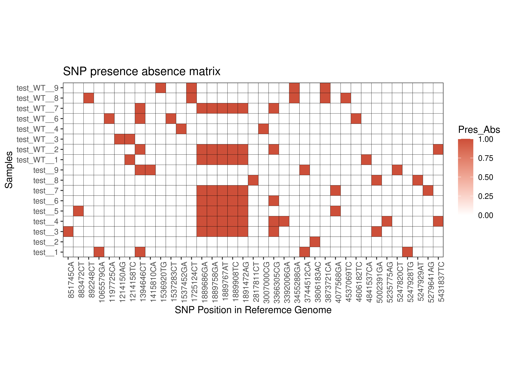

# SNPs Across All Samples (SNPAAS)

We want to find SNPs across all the samples, whether the reference is either Chromsomal sequence or Plasmid Sequence. We do the analysis for the chromosomal reference for this analysis.

SNPs are written in vcf file when SNIPPY is used. So, let us run SNIPPY for all the samples with a reference genome.

```
# Generate SNIPPY commands
snippy-multi input.tab --ref reference.fasta --cpus 64 > runme.sh

# SNIPPY
time bash runme.sh

# Extract SNPs from all the VCF files
for d in $(ls */*snps.filt.vcf); do echo "$d"; fgrep "TYPE=snp" $d |awk '{print " "$4""$2""$5""}' | tr '\n' ',' ; echo ""; done >snps_across_allsamples.list

# Add a header
sed -i '1s;^;Sample\tSNP\n;' snps_across_allsamples.list

```

Let's Create a Presence/Absence Matrix for the SNPs in all the samples using R 

```{r SNPs_PresAbs, fig.width=16, fig.height=18, message=FALSE}
setwd("folder")

SNPdf <- read.table("snps_across_allsamples.list", header = TRUE, sep = "\t")
head(SNPdf)
tail(SNPdf)

# Create a Presence/Absence matrix
library(reshape2)
mat <- acast(SNPdf, SNP~Sample, length)
head(mat)
write.csv(mat,"matrix_format.csv")

# Let us plot SNPs by their position
SNPMat_long <- melt(acast(SNPdf, SNP~Sample, length),varnames = c("SNP","Sample"), value.name = "Pres_Abs")
head(SNPMat_long)
tail(SNPMat_long)

library(stringr)
lvls <- str_sort(unique(SNPMat_long$SNP), numeric = TRUE)
SNPMat_long$SNP <- factor(SNPMat_long$SNP, levels = lvls)

head(SNPMat_long)
tail(SNPMat_long)

library(ggplot2)
ggplot(SNPMat_long, aes(SNP, Sample, fill = Pres_Abs,alpha = Pres_Abs)) + 
  geom_tile(colour = "black") +
  scale_alpha_identity(guide = "none") +
  coord_equal(expand = 0) +
  theme_bw() +
  theme(panel.grid.major = element_blank(),
        axis.text.x = element_text(angle = 90, hjust = 1)) +
  ggtitle("SNP presence absence matrix") + # for the main title
  xlab("SNP Position in Reference Genome") + # for the x axis label
  ylab("Samples")+ scale_fill_gradient(low = "white", high = "tomato3") 

ggsave("SNP_PA_matrix_allSamples.png",dpi = 600, width = 8, height = 6, units = "in")
```

