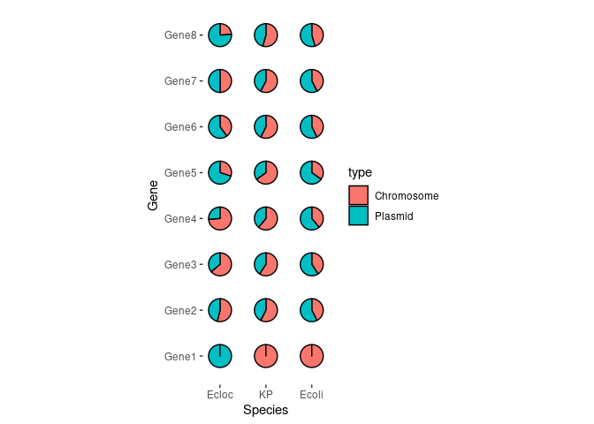
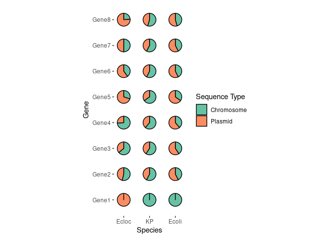

## R Markdown


```r
#install.packages("scatterpie")
library(tidyverse)
library(ggplot2)
library(scatterpie)
library(RColorBrewer)

my_df <- read.table("/data02/Analysis/for_Colleagues/for_zeqin/scatter_pie_plot/data.txt",sep = "\t", header = TRUE)
head(my_df)
```

```
##   Species Chromosome Plasmid  Gene
## 1   Ecoli      1.000   0.000 Gene1
## 2   Ecoli      0.575   0.425 Gene2
## 3   Ecoli      0.593   0.407 Gene3
## 4   Ecoli      0.611   0.389 Gene4
## 5   Ecoli      0.651   0.349 Gene5
## 6   Ecoli      0.574   0.426 Gene6
```

```r
xvals <- unique(my_df$Species)
xvals
```

```
## [1] "Ecoli" "KP"    "Ecloc"
```

```r
yvals <- unique(my_df$Gene)
yvals
```

```
## [1] "Gene1" "Gene2" "Gene3" "Gene4" "Gene5" "Gene6" "Gene7" "Gene8"
```

```r
str(my_df)
```

```
## 'data.frame':	24 obs. of  4 variables:
##  $ Species   : chr  "Ecoli" "Ecoli" "Ecoli" "Ecoli" ...
##  $ Chromosome: num  1 0.575 0.593 0.611 0.651 0.574 0.576 0.545 1 0.425 ...
##  $ Plasmid   : num  0 0.425 0.407 0.389 0.349 0.426 0.424 0.455 0 0.575 ...
##  $ Gene      : chr  "Gene1" "Gene2" "Gene3" "Gene4" ...
```

```r
my_df2 <- my_df %>% 
  mutate(Species_num = as.numeric(as.factor(Species)), 
         Gene_num = as.numeric(as.factor(Gene)))

my_df2
```

```
##    Species Chromosome Plasmid  Gene Species_num Gene_num
## 1    Ecoli      1.000   0.000 Gene1           2        1
## 2    Ecoli      0.575   0.425 Gene2           2        2
## 3    Ecoli      0.593   0.407 Gene3           2        3
## 4    Ecoli      0.611   0.389 Gene4           2        4
## 5    Ecoli      0.651   0.349 Gene5           2        5
## 6    Ecoli      0.574   0.426 Gene6           2        6
## 7    Ecoli      0.576   0.424 Gene7           2        7
## 8    Ecoli      0.545   0.455 Gene8           2        8
## 9       KP      1.000   0.000 Gene1           3        1
## 10      KP      0.425   0.575 Gene2           3        2
## 11      KP      0.407   0.593 Gene3           3        3
## 12      KP      0.389   0.611 Gene4           3        4
## 13      KP      0.349   0.651 Gene5           3        5
## 14      KP      0.426   0.574 Gene6           3        6
## 15      KP      0.424   0.576 Gene7           3        7
## 16      KP      0.455   0.545 Gene8           3        8
## 17   Ecloc      0.000   1.000 Gene1           1        1
## 18   Ecloc      0.538   0.462 Gene2           1        2
## 19   Ecloc      0.638   0.362 Gene3           1        3
## 20   Ecloc      0.738   0.262 Gene4           1        4
## 21   Ecloc      0.300   0.700 Gene5           1        5
## 22   Ecloc      0.400   0.600 Gene6           1        6
## 23   Ecloc      0.500   0.500 Gene7           1        7
## 24   Ecloc      0.240   0.760 Gene8           1        8
```

```r
ggplot() + geom_scatterpie(data=my_df2, aes(x=Species_num, y=Gene_num, r =0.25), cols = colnames(my_df)[2:3]) + 
  scale_x_continuous(breaks=c(1,2,3),labels= c("Ecloc","KP","Ecoli")) +
  scale_y_continuous(breaks=c(1,2,3,4,5,6,7,8), labels=yvals) + 
  labs(x="Species", y="Gene") + 
  theme(panel.background  = element_blank()) +
  coord_fixed() 
```

```
## Warning: Using the `size` aesthetic in this geom was deprecated in ggplot2 3.4.0.
## ℹ Please use `linewidth` in the `default_aes` field and elsewhere instead.
## This warning is displayed once every 8 hours.
## Call `lifecycle::last_lifecycle_warnings()` to see where this warning was
## generated.
```

<!-- -->

```r
# Make it more colorful 
Color<-brewer.pal(4, "Set2")

ggplot() + geom_scatterpie(data=my_df2, aes(x=Species_num, y=Gene_num, r =0.25), cols = colnames(my_df)[2:3]) +
  scale_fill_manual(name = "Sequence Type", values = Color) +
  scale_x_continuous(breaks=c(1,2,3),labels= c("Ecloc","KP","Ecoli")) +
  scale_y_continuous(breaks=c(1,2,3,4,5,6,7,8), labels=yvals) + 
  labs(x="Species", y="Gene") + 
  theme(panel.background  = element_blank()) +
  coord_fixed() 
```

<!-- -->
