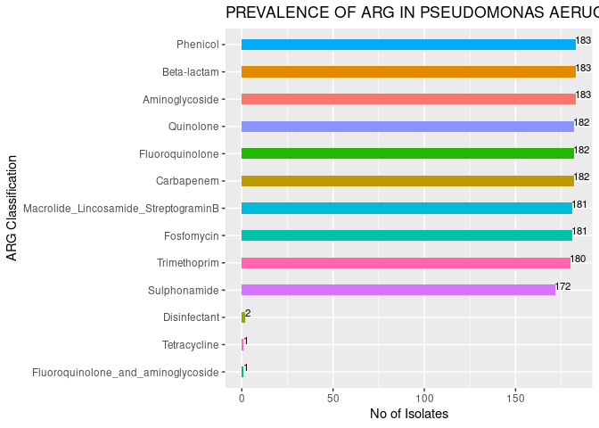
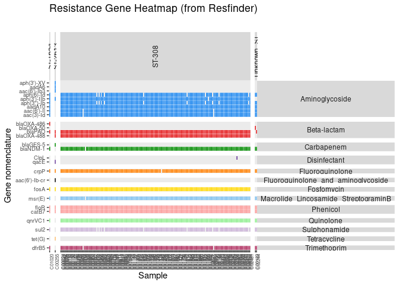
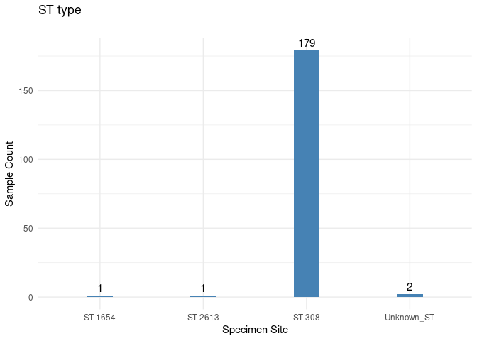
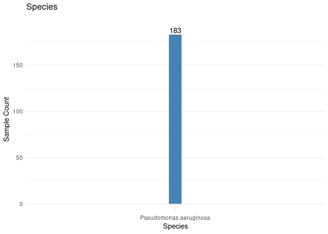

### Step 1: Generate Resistome from Assemblies

Find Resistome using Resfinder 4.1 (This is the most latest version. CGE BAPS uses Resfinder 2.1 with older database) 

CGE BAPS originally used pipeline uses Resfinder2.1. The latest Resfinder version is 4.1

So downloaded the latest AMR gene databases and rerunning Resfinder 4.1 on all pseudomonas samples.

Running resfinder on all assembly fasta - default setting is coverage length of the sequence is 60% and identity 80%


```bash

time for d in $(ls *.fasta); 
do 
echo $d; 
time python3 /home/prakki/sw/resfinder/run_resfinder.py -o "$d"_resfinder_outdir -s "Other" -l 0.6 -t 0.8 --acquired -ifa $d & 
done

```

### Step 2: Generate read statistics

Here ResFinder_results_tab.txt results are taken from each directory | remove spaces | unwanted columns removed | trimmed unnecessary texts | filtered the AMR genes which has coverage and identity >=80% | extracted unique records | collapsed the genes for each of the sample


```bash

awk '{print FILENAME "\t" $0}' */ResFinder_results_tab.txt  | tr ' ' '_' | cut -f1-9 -d "        " | sed -e 's/_spades.gte1kb.contigs.fasta_resfinder_outdir\/ResFinder_results_tab.txt//g' | awk '$3>=80 && $5>=80' | awk '{print $1 "\t" $2}' | sort -u | grep -v 'Resistance_gene' | groupBy -g 1 -c 2 -o collapse >cge_resfinder_resistome.tab

# head(cge_resfinder_resistome.tab)

# C02263  aac(3)-Id,aac(6')-Il,aadA10,aph(3'')-Ib,aph(3')-IIb,aph(6)-Id,blaNDM-1,blaOXA-488,blaPAO,...
# C02288  aac(3)-Id,aac(6')-Il,aadA10,aph(3'')-Ib,aph(3')-IIb,aph(6)-Id,blaNDM-1,blaOXA-488,blaPAO,...

```

Added the species and ST information to **cge_resfinder_resistome.tab** file and saved results in **cge_resistome_species_ST.txt** file

### Step 3: Generate R plots

Let us load the **11F_melt_readlengths.txt;** file into R and generate some figures from the data using R ggplot function.


```r
setwd("/data02/Analysis/Projects/6_Paeruginosa_183_samples_Shawn/4CGE_Resfinder4.1/")

library(splitstackshape)
library(dplyr)
library(stringr)
library(qdapTools)
library(ggplot2)
library(reshape2)
library(tidyr)
library(RColorBrewer)
library(kableExtra)

# Loading the input file
cge_log <- read.table("cge_resistome_species_ST.txt",sep = "\t", header = TRUE, quote="")
head(cge_log) %>% 
  kbl(caption = "Head sample output") %>%
   kable_classic_2(full_width = F)
```

<table class=" lightable-classic-2" style='font-family: "Arial Narrow", "Source Sans Pro", sans-serif; width: auto !important; margin-left: auto; margin-right: auto;'>
<caption>Head sample output</caption>
 <thead>
  <tr>
   <th style="text-align:left;"> sample_name </th>
   <th style="text-align:left;"> resistance </th>
   <th style="text-align:left;"> species </th>
   <th style="text-align:left;"> mlst </th>
  </tr>
 </thead>
<tbody>
  <tr>
   <td style="text-align:left;"> C00024 </td>
   <td style="text-align:left;"> aac(3)-Id,aac(6')-Il,aadA10,aph(3'')-Ib,aph(3')-IIb,aph(6)-Id,blaNDM-1,blaOXA-488,blaPAO,catB7,crpP,dfrB5,floR,fosA,msr(E),qnrVC1,sul2 </td>
   <td style="text-align:left;"> Pseudomonas aeruginosa </td>
   <td style="text-align:left;"> ST-308 </td>
  </tr>
  <tr>
   <td style="text-align:left;"> C00027 </td>
   <td style="text-align:left;"> aac(3)-Id,aac(6')-Il,aadA10,aph(3'')-Ib,aph(3')-IIb,aph(6)-Id,blaNDM-1,blaOXA-488,blaPAO,catB7,crpP,dfrB5,floR,fosA,msr(E),qnrVC1,sul2 </td>
   <td style="text-align:left;"> Pseudomonas aeruginosa </td>
   <td style="text-align:left;"> ST-308 </td>
  </tr>
  <tr>
   <td style="text-align:left;"> C00042 </td>
   <td style="text-align:left;"> aac(3)-Id,aac(6')-Il,aadA10,aph(3'')-Ib,aph(3')-IIb,aph(6)-Id,blaNDM-1,blaOXA-488,blaPAO,catB7,crpP,dfrB5,floR,fosA,msr(E),qnrVC1,sul2 </td>
   <td style="text-align:left;"> Pseudomonas aeruginosa </td>
   <td style="text-align:left;"> ST-308 </td>
  </tr>
  <tr>
   <td style="text-align:left;"> C00056 </td>
   <td style="text-align:left;"> aac(3)-Id,aac(6')-Il,aadA10,aph(3'')-Ib,aph(3')-IIb,aph(6)-Id,blaNDM-1,blaOXA-488,blaPAO,catB7,crpP,dfrB5,floR,fosA,msr(E),qnrVC1,sul2 </td>
   <td style="text-align:left;"> Pseudomonas aeruginosa </td>
   <td style="text-align:left;"> ST-308 </td>
  </tr>
  <tr>
   <td style="text-align:left;"> C00068 </td>
   <td style="text-align:left;"> aac(3)-Id,aac(6')-Il,aadA10,aph(3'')-Ib,aph(3')-IIb,aph(6)-Id,blaNDM-1,blaOXA-488,blaPAO,catB7,crpP,dfrB5,floR,fosA,msr(E),qnrVC1,sul2 </td>
   <td style="text-align:left;"> Pseudomonas aeruginosa </td>
   <td style="text-align:left;"> ST-308 </td>
  </tr>
  <tr>
   <td style="text-align:left;"> C00073 </td>
   <td style="text-align:left;"> aac(3)-Id,aac(6')-Il,aadA10,aph(3'')-Ib,aph(3')-IIb,aph(6)-Id,blaNDM-1,blaOXA-488,blaPAO,catB7,crpP,dfrB5,floR,fosA,msr(E),qnrVC1,sul2 </td>
   <td style="text-align:left;"> Pseudomonas aeruginosa </td>
   <td style="text-align:left;"> ST-308 </td>
  </tr>
</tbody>
</table>

```r
# Split the resistome column
cge_rest_split <- cSplit(cge_log, "resistance", ",")

head(cge_rest_split) %>% 
  kbl(caption = "Head sample output") %>%
      kable_paper() %>%
  scroll_box(width = "100%", height = "200px")
```

<div style="border: 1px solid #ddd; padding: 0px; overflow-y: scroll; height:200px; overflow-x: scroll; width:100%; "><table class=" lightable-paper" style='font-family: "Arial Narrow", arial, helvetica, sans-serif; margin-left: auto; margin-right: auto;'>
<caption>Head sample output</caption>
 <thead>
  <tr>
   <th style="text-align:left;position: sticky; top:0; background-color: #FFFFFF;"> sample_name </th>
   <th style="text-align:left;position: sticky; top:0; background-color: #FFFFFF;"> species </th>
   <th style="text-align:left;position: sticky; top:0; background-color: #FFFFFF;"> mlst </th>
   <th style="text-align:left;position: sticky; top:0; background-color: #FFFFFF;"> resistance_01 </th>
   <th style="text-align:left;position: sticky; top:0; background-color: #FFFFFF;"> resistance_02 </th>
   <th style="text-align:left;position: sticky; top:0; background-color: #FFFFFF;"> resistance_03 </th>
   <th style="text-align:left;position: sticky; top:0; background-color: #FFFFFF;"> resistance_04 </th>
   <th style="text-align:left;position: sticky; top:0; background-color: #FFFFFF;"> resistance_05 </th>
   <th style="text-align:left;position: sticky; top:0; background-color: #FFFFFF;"> resistance_06 </th>
   <th style="text-align:left;position: sticky; top:0; background-color: #FFFFFF;"> resistance_07 </th>
   <th style="text-align:left;position: sticky; top:0; background-color: #FFFFFF;"> resistance_08 </th>
   <th style="text-align:left;position: sticky; top:0; background-color: #FFFFFF;"> resistance_09 </th>
   <th style="text-align:left;position: sticky; top:0; background-color: #FFFFFF;"> resistance_10 </th>
   <th style="text-align:left;position: sticky; top:0; background-color: #FFFFFF;"> resistance_11 </th>
   <th style="text-align:left;position: sticky; top:0; background-color: #FFFFFF;"> resistance_12 </th>
   <th style="text-align:left;position: sticky; top:0; background-color: #FFFFFF;"> resistance_13 </th>
   <th style="text-align:left;position: sticky; top:0; background-color: #FFFFFF;"> resistance_14 </th>
   <th style="text-align:left;position: sticky; top:0; background-color: #FFFFFF;"> resistance_15 </th>
   <th style="text-align:left;position: sticky; top:0; background-color: #FFFFFF;"> resistance_16 </th>
   <th style="text-align:left;position: sticky; top:0; background-color: #FFFFFF;"> resistance_17 </th>
   <th style="text-align:left;position: sticky; top:0; background-color: #FFFFFF;"> resistance_18 </th>
  </tr>
 </thead>
<tbody>
  <tr>
   <td style="text-align:left;"> C00024 </td>
   <td style="text-align:left;"> Pseudomonas aeruginosa </td>
   <td style="text-align:left;"> ST-308 </td>
   <td style="text-align:left;"> aac(3)-Id </td>
   <td style="text-align:left;"> aac(6')-Il </td>
   <td style="text-align:left;"> aadA10 </td>
   <td style="text-align:left;"> aph(3'')-Ib </td>
   <td style="text-align:left;"> aph(3')-IIb </td>
   <td style="text-align:left;"> aph(6)-Id </td>
   <td style="text-align:left;"> blaNDM-1 </td>
   <td style="text-align:left;"> blaOXA-488 </td>
   <td style="text-align:left;"> blaPAO </td>
   <td style="text-align:left;"> catB7 </td>
   <td style="text-align:left;"> crpP </td>
   <td style="text-align:left;"> dfrB5 </td>
   <td style="text-align:left;"> floR </td>
   <td style="text-align:left;"> fosA </td>
   <td style="text-align:left;"> msr(E) </td>
   <td style="text-align:left;"> qnrVC1 </td>
   <td style="text-align:left;"> sul2 </td>
   <td style="text-align:left;"> NA </td>
  </tr>
  <tr>
   <td style="text-align:left;"> C00027 </td>
   <td style="text-align:left;"> Pseudomonas aeruginosa </td>
   <td style="text-align:left;"> ST-308 </td>
   <td style="text-align:left;"> aac(3)-Id </td>
   <td style="text-align:left;"> aac(6')-Il </td>
   <td style="text-align:left;"> aadA10 </td>
   <td style="text-align:left;"> aph(3'')-Ib </td>
   <td style="text-align:left;"> aph(3')-IIb </td>
   <td style="text-align:left;"> aph(6)-Id </td>
   <td style="text-align:left;"> blaNDM-1 </td>
   <td style="text-align:left;"> blaOXA-488 </td>
   <td style="text-align:left;"> blaPAO </td>
   <td style="text-align:left;"> catB7 </td>
   <td style="text-align:left;"> crpP </td>
   <td style="text-align:left;"> dfrB5 </td>
   <td style="text-align:left;"> floR </td>
   <td style="text-align:left;"> fosA </td>
   <td style="text-align:left;"> msr(E) </td>
   <td style="text-align:left;"> qnrVC1 </td>
   <td style="text-align:left;"> sul2 </td>
   <td style="text-align:left;"> NA </td>
  </tr>
  <tr>
   <td style="text-align:left;"> C00042 </td>
   <td style="text-align:left;"> Pseudomonas aeruginosa </td>
   <td style="text-align:left;"> ST-308 </td>
   <td style="text-align:left;"> aac(3)-Id </td>
   <td style="text-align:left;"> aac(6')-Il </td>
   <td style="text-align:left;"> aadA10 </td>
   <td style="text-align:left;"> aph(3'')-Ib </td>
   <td style="text-align:left;"> aph(3')-IIb </td>
   <td style="text-align:left;"> aph(6)-Id </td>
   <td style="text-align:left;"> blaNDM-1 </td>
   <td style="text-align:left;"> blaOXA-488 </td>
   <td style="text-align:left;"> blaPAO </td>
   <td style="text-align:left;"> catB7 </td>
   <td style="text-align:left;"> crpP </td>
   <td style="text-align:left;"> dfrB5 </td>
   <td style="text-align:left;"> floR </td>
   <td style="text-align:left;"> fosA </td>
   <td style="text-align:left;"> msr(E) </td>
   <td style="text-align:left;"> qnrVC1 </td>
   <td style="text-align:left;"> sul2 </td>
   <td style="text-align:left;"> NA </td>
  </tr>
  <tr>
   <td style="text-align:left;"> C00056 </td>
   <td style="text-align:left;"> Pseudomonas aeruginosa </td>
   <td style="text-align:left;"> ST-308 </td>
   <td style="text-align:left;"> aac(3)-Id </td>
   <td style="text-align:left;"> aac(6')-Il </td>
   <td style="text-align:left;"> aadA10 </td>
   <td style="text-align:left;"> aph(3'')-Ib </td>
   <td style="text-align:left;"> aph(3')-IIb </td>
   <td style="text-align:left;"> aph(6)-Id </td>
   <td style="text-align:left;"> blaNDM-1 </td>
   <td style="text-align:left;"> blaOXA-488 </td>
   <td style="text-align:left;"> blaPAO </td>
   <td style="text-align:left;"> catB7 </td>
   <td style="text-align:left;"> crpP </td>
   <td style="text-align:left;"> dfrB5 </td>
   <td style="text-align:left;"> floR </td>
   <td style="text-align:left;"> fosA </td>
   <td style="text-align:left;"> msr(E) </td>
   <td style="text-align:left;"> qnrVC1 </td>
   <td style="text-align:left;"> sul2 </td>
   <td style="text-align:left;"> NA </td>
  </tr>
  <tr>
   <td style="text-align:left;"> C00068 </td>
   <td style="text-align:left;"> Pseudomonas aeruginosa </td>
   <td style="text-align:left;"> ST-308 </td>
   <td style="text-align:left;"> aac(3)-Id </td>
   <td style="text-align:left;"> aac(6')-Il </td>
   <td style="text-align:left;"> aadA10 </td>
   <td style="text-align:left;"> aph(3'')-Ib </td>
   <td style="text-align:left;"> aph(3')-IIb </td>
   <td style="text-align:left;"> aph(6)-Id </td>
   <td style="text-align:left;"> blaNDM-1 </td>
   <td style="text-align:left;"> blaOXA-488 </td>
   <td style="text-align:left;"> blaPAO </td>
   <td style="text-align:left;"> catB7 </td>
   <td style="text-align:left;"> crpP </td>
   <td style="text-align:left;"> dfrB5 </td>
   <td style="text-align:left;"> floR </td>
   <td style="text-align:left;"> fosA </td>
   <td style="text-align:left;"> msr(E) </td>
   <td style="text-align:left;"> qnrVC1 </td>
   <td style="text-align:left;"> sul2 </td>
   <td style="text-align:left;"> NA </td>
  </tr>
  <tr>
   <td style="text-align:left;"> C00073 </td>
   <td style="text-align:left;"> Pseudomonas aeruginosa </td>
   <td style="text-align:left;"> ST-308 </td>
   <td style="text-align:left;"> aac(3)-Id </td>
   <td style="text-align:left;"> aac(6')-Il </td>
   <td style="text-align:left;"> aadA10 </td>
   <td style="text-align:left;"> aph(3'')-Ib </td>
   <td style="text-align:left;"> aph(3')-IIb </td>
   <td style="text-align:left;"> aph(6)-Id </td>
   <td style="text-align:left;"> blaNDM-1 </td>
   <td style="text-align:left;"> blaOXA-488 </td>
   <td style="text-align:left;"> blaPAO </td>
   <td style="text-align:left;"> catB7 </td>
   <td style="text-align:left;"> crpP </td>
   <td style="text-align:left;"> dfrB5 </td>
   <td style="text-align:left;"> floR </td>
   <td style="text-align:left;"> fosA </td>
   <td style="text-align:left;"> msr(E) </td>
   <td style="text-align:left;"> qnrVC1 </td>
   <td style="text-align:left;"> sul2 </td>
   <td style="text-align:left;"> NA </td>
  </tr>
</tbody>
</table></div>

```r
# Create new column of ST and sort by ST and select the columns with sample_name, ST and columns with contains "resistance_"
df1 <- cge_rest_split %>% 
  mutate(ST = as.numeric(str_extract(mlst, "[0-9]+"))) %>% 
  arrange(ST) %>% 
  select("sample_name","ST",contains("resistance_"))

head(df1) %>% 
  kbl(caption = "Head sample output") %>%
      kable_paper() %>%
  scroll_box(width = "100%", height = "200px")
```

<div style="border: 1px solid #ddd; padding: 0px; overflow-y: scroll; height:200px; overflow-x: scroll; width:100%; "><table class=" lightable-paper" style='font-family: "Arial Narrow", arial, helvetica, sans-serif; margin-left: auto; margin-right: auto;'>
<caption>Head sample output</caption>
 <thead>
  <tr>
   <th style="text-align:left;position: sticky; top:0; background-color: #FFFFFF;"> sample_name </th>
   <th style="text-align:right;position: sticky; top:0; background-color: #FFFFFF;"> ST </th>
   <th style="text-align:left;position: sticky; top:0; background-color: #FFFFFF;"> resistance_01 </th>
   <th style="text-align:left;position: sticky; top:0; background-color: #FFFFFF;"> resistance_02 </th>
   <th style="text-align:left;position: sticky; top:0; background-color: #FFFFFF;"> resistance_03 </th>
   <th style="text-align:left;position: sticky; top:0; background-color: #FFFFFF;"> resistance_04 </th>
   <th style="text-align:left;position: sticky; top:0; background-color: #FFFFFF;"> resistance_05 </th>
   <th style="text-align:left;position: sticky; top:0; background-color: #FFFFFF;"> resistance_06 </th>
   <th style="text-align:left;position: sticky; top:0; background-color: #FFFFFF;"> resistance_07 </th>
   <th style="text-align:left;position: sticky; top:0; background-color: #FFFFFF;"> resistance_08 </th>
   <th style="text-align:left;position: sticky; top:0; background-color: #FFFFFF;"> resistance_09 </th>
   <th style="text-align:left;position: sticky; top:0; background-color: #FFFFFF;"> resistance_10 </th>
   <th style="text-align:left;position: sticky; top:0; background-color: #FFFFFF;"> resistance_11 </th>
   <th style="text-align:left;position: sticky; top:0; background-color: #FFFFFF;"> resistance_12 </th>
   <th style="text-align:left;position: sticky; top:0; background-color: #FFFFFF;"> resistance_13 </th>
   <th style="text-align:left;position: sticky; top:0; background-color: #FFFFFF;"> resistance_14 </th>
   <th style="text-align:left;position: sticky; top:0; background-color: #FFFFFF;"> resistance_15 </th>
   <th style="text-align:left;position: sticky; top:0; background-color: #FFFFFF;"> resistance_16 </th>
   <th style="text-align:left;position: sticky; top:0; background-color: #FFFFFF;"> resistance_17 </th>
   <th style="text-align:left;position: sticky; top:0; background-color: #FFFFFF;"> resistance_18 </th>
  </tr>
 </thead>
<tbody>
  <tr>
   <td style="text-align:left;"> C00024 </td>
   <td style="text-align:right;"> 308 </td>
   <td style="text-align:left;"> aac(3)-Id </td>
   <td style="text-align:left;"> aac(6')-Il </td>
   <td style="text-align:left;"> aadA10 </td>
   <td style="text-align:left;"> aph(3'')-Ib </td>
   <td style="text-align:left;"> aph(3')-IIb </td>
   <td style="text-align:left;"> aph(6)-Id </td>
   <td style="text-align:left;"> blaNDM-1 </td>
   <td style="text-align:left;"> blaOXA-488 </td>
   <td style="text-align:left;"> blaPAO </td>
   <td style="text-align:left;"> catB7 </td>
   <td style="text-align:left;"> crpP </td>
   <td style="text-align:left;"> dfrB5 </td>
   <td style="text-align:left;"> floR </td>
   <td style="text-align:left;"> fosA </td>
   <td style="text-align:left;"> msr(E) </td>
   <td style="text-align:left;"> qnrVC1 </td>
   <td style="text-align:left;"> sul2 </td>
   <td style="text-align:left;"> NA </td>
  </tr>
  <tr>
   <td style="text-align:left;"> C00027 </td>
   <td style="text-align:right;"> 308 </td>
   <td style="text-align:left;"> aac(3)-Id </td>
   <td style="text-align:left;"> aac(6')-Il </td>
   <td style="text-align:left;"> aadA10 </td>
   <td style="text-align:left;"> aph(3'')-Ib </td>
   <td style="text-align:left;"> aph(3')-IIb </td>
   <td style="text-align:left;"> aph(6)-Id </td>
   <td style="text-align:left;"> blaNDM-1 </td>
   <td style="text-align:left;"> blaOXA-488 </td>
   <td style="text-align:left;"> blaPAO </td>
   <td style="text-align:left;"> catB7 </td>
   <td style="text-align:left;"> crpP </td>
   <td style="text-align:left;"> dfrB5 </td>
   <td style="text-align:left;"> floR </td>
   <td style="text-align:left;"> fosA </td>
   <td style="text-align:left;"> msr(E) </td>
   <td style="text-align:left;"> qnrVC1 </td>
   <td style="text-align:left;"> sul2 </td>
   <td style="text-align:left;"> NA </td>
  </tr>
  <tr>
   <td style="text-align:left;"> C00042 </td>
   <td style="text-align:right;"> 308 </td>
   <td style="text-align:left;"> aac(3)-Id </td>
   <td style="text-align:left;"> aac(6')-Il </td>
   <td style="text-align:left;"> aadA10 </td>
   <td style="text-align:left;"> aph(3'')-Ib </td>
   <td style="text-align:left;"> aph(3')-IIb </td>
   <td style="text-align:left;"> aph(6)-Id </td>
   <td style="text-align:left;"> blaNDM-1 </td>
   <td style="text-align:left;"> blaOXA-488 </td>
   <td style="text-align:left;"> blaPAO </td>
   <td style="text-align:left;"> catB7 </td>
   <td style="text-align:left;"> crpP </td>
   <td style="text-align:left;"> dfrB5 </td>
   <td style="text-align:left;"> floR </td>
   <td style="text-align:left;"> fosA </td>
   <td style="text-align:left;"> msr(E) </td>
   <td style="text-align:left;"> qnrVC1 </td>
   <td style="text-align:left;"> sul2 </td>
   <td style="text-align:left;"> NA </td>
  </tr>
  <tr>
   <td style="text-align:left;"> C00056 </td>
   <td style="text-align:right;"> 308 </td>
   <td style="text-align:left;"> aac(3)-Id </td>
   <td style="text-align:left;"> aac(6')-Il </td>
   <td style="text-align:left;"> aadA10 </td>
   <td style="text-align:left;"> aph(3'')-Ib </td>
   <td style="text-align:left;"> aph(3')-IIb </td>
   <td style="text-align:left;"> aph(6)-Id </td>
   <td style="text-align:left;"> blaNDM-1 </td>
   <td style="text-align:left;"> blaOXA-488 </td>
   <td style="text-align:left;"> blaPAO </td>
   <td style="text-align:left;"> catB7 </td>
   <td style="text-align:left;"> crpP </td>
   <td style="text-align:left;"> dfrB5 </td>
   <td style="text-align:left;"> floR </td>
   <td style="text-align:left;"> fosA </td>
   <td style="text-align:left;"> msr(E) </td>
   <td style="text-align:left;"> qnrVC1 </td>
   <td style="text-align:left;"> sul2 </td>
   <td style="text-align:left;"> NA </td>
  </tr>
  <tr>
   <td style="text-align:left;"> C00068 </td>
   <td style="text-align:right;"> 308 </td>
   <td style="text-align:left;"> aac(3)-Id </td>
   <td style="text-align:left;"> aac(6')-Il </td>
   <td style="text-align:left;"> aadA10 </td>
   <td style="text-align:left;"> aph(3'')-Ib </td>
   <td style="text-align:left;"> aph(3')-IIb </td>
   <td style="text-align:left;"> aph(6)-Id </td>
   <td style="text-align:left;"> blaNDM-1 </td>
   <td style="text-align:left;"> blaOXA-488 </td>
   <td style="text-align:left;"> blaPAO </td>
   <td style="text-align:left;"> catB7 </td>
   <td style="text-align:left;"> crpP </td>
   <td style="text-align:left;"> dfrB5 </td>
   <td style="text-align:left;"> floR </td>
   <td style="text-align:left;"> fosA </td>
   <td style="text-align:left;"> msr(E) </td>
   <td style="text-align:left;"> qnrVC1 </td>
   <td style="text-align:left;"> sul2 </td>
   <td style="text-align:left;"> NA </td>
  </tr>
  <tr>
   <td style="text-align:left;"> C00073 </td>
   <td style="text-align:right;"> 308 </td>
   <td style="text-align:left;"> aac(3)-Id </td>
   <td style="text-align:left;"> aac(6')-Il </td>
   <td style="text-align:left;"> aadA10 </td>
   <td style="text-align:left;"> aph(3'')-Ib </td>
   <td style="text-align:left;"> aph(3')-IIb </td>
   <td style="text-align:left;"> aph(6)-Id </td>
   <td style="text-align:left;"> blaNDM-1 </td>
   <td style="text-align:left;"> blaOXA-488 </td>
   <td style="text-align:left;"> blaPAO </td>
   <td style="text-align:left;"> catB7 </td>
   <td style="text-align:left;"> crpP </td>
   <td style="text-align:left;"> dfrB5 </td>
   <td style="text-align:left;"> floR </td>
   <td style="text-align:left;"> fosA </td>
   <td style="text-align:left;"> msr(E) </td>
   <td style="text-align:left;"> qnrVC1 </td>
   <td style="text-align:left;"> sul2 </td>
   <td style="text-align:left;"> NA </td>
  </tr>
</tbody>
</table></div>

```r
# Convert to dataframe
df1 <- as.data.frame(df1)

#class(df1)
#df1


res <- cbind(df1[1:2], mtabulate(as.data.frame(t(df1[-1:-2])))) # Print ST too
#res <- cbind(df1[1], mtabulate(as.data.frame(t(df1[-1]))))
head(res) %>% 
  kbl(caption = "Head sample output") %>%
         kable_paper() %>%
  scroll_box(width = "100%", height = "200px")
```

<div style="border: 1px solid #ddd; padding: 0px; overflow-y: scroll; height:200px; overflow-x: scroll; width:100%; "><table class=" lightable-paper" style='font-family: "Arial Narrow", arial, helvetica, sans-serif; margin-left: auto; margin-right: auto;'>
<caption>Head sample output</caption>
 <thead>
  <tr>
   <th style="text-align:left;position: sticky; top:0; background-color: #FFFFFF;">   </th>
   <th style="text-align:left;position: sticky; top:0; background-color: #FFFFFF;"> sample_name </th>
   <th style="text-align:right;position: sticky; top:0; background-color: #FFFFFF;"> ST </th>
   <th style="text-align:right;position: sticky; top:0; background-color: #FFFFFF;"> aac(3)-Id </th>
   <th style="text-align:right;position: sticky; top:0; background-color: #FFFFFF;"> aac(6')-Ib-cr </th>
   <th style="text-align:right;position: sticky; top:0; background-color: #FFFFFF;"> aac(6')-Ib3 </th>
   <th style="text-align:right;position: sticky; top:0; background-color: #FFFFFF;"> aac(6')-Il </th>
   <th style="text-align:right;position: sticky; top:0; background-color: #FFFFFF;"> aadA10 </th>
   <th style="text-align:right;position: sticky; top:0; background-color: #FFFFFF;"> aadA6 </th>
   <th style="text-align:right;position: sticky; top:0; background-color: #FFFFFF;"> aph(3'')-Ib </th>
   <th style="text-align:right;position: sticky; top:0; background-color: #FFFFFF;"> aph(3')-IIb </th>
   <th style="text-align:right;position: sticky; top:0; background-color: #FFFFFF;"> aph(3')-XV </th>
   <th style="text-align:right;position: sticky; top:0; background-color: #FFFFFF;"> aph(6)-Id </th>
   <th style="text-align:right;position: sticky; top:0; background-color: #FFFFFF;"> blaGES-5 </th>
   <th style="text-align:right;position: sticky; top:0; background-color: #FFFFFF;"> blaNDM-1 </th>
   <th style="text-align:right;position: sticky; top:0; background-color: #FFFFFF;"> blaOXA-486 </th>
   <th style="text-align:right;position: sticky; top:0; background-color: #FFFFFF;"> blaOXA-488 </th>
   <th style="text-align:right;position: sticky; top:0; background-color: #FFFFFF;"> blaOXA-50 </th>
   <th style="text-align:right;position: sticky; top:0; background-color: #FFFFFF;"> blaPAO </th>
   <th style="text-align:right;position: sticky; top:0; background-color: #FFFFFF;"> catB7 </th>
   <th style="text-align:right;position: sticky; top:0; background-color: #FFFFFF;"> ClpL </th>
   <th style="text-align:right;position: sticky; top:0; background-color: #FFFFFF;"> crpP </th>
   <th style="text-align:right;position: sticky; top:0; background-color: #FFFFFF;"> dfrB5 </th>
   <th style="text-align:right;position: sticky; top:0; background-color: #FFFFFF;"> floR </th>
   <th style="text-align:right;position: sticky; top:0; background-color: #FFFFFF;"> fosA </th>
   <th style="text-align:right;position: sticky; top:0; background-color: #FFFFFF;"> msr(E) </th>
   <th style="text-align:right;position: sticky; top:0; background-color: #FFFFFF;"> qacE </th>
   <th style="text-align:right;position: sticky; top:0; background-color: #FFFFFF;"> qnrVC1 </th>
   <th style="text-align:right;position: sticky; top:0; background-color: #FFFFFF;"> sul2 </th>
   <th style="text-align:right;position: sticky; top:0; background-color: #FFFFFF;"> tet(G) </th>
  </tr>
 </thead>
<tbody>
  <tr>
   <td style="text-align:left;"> V1 </td>
   <td style="text-align:left;"> C00024 </td>
   <td style="text-align:right;"> 308 </td>
   <td style="text-align:right;"> 1 </td>
   <td style="text-align:right;"> 0 </td>
   <td style="text-align:right;"> 0 </td>
   <td style="text-align:right;"> 1 </td>
   <td style="text-align:right;"> 1 </td>
   <td style="text-align:right;"> 0 </td>
   <td style="text-align:right;"> 1 </td>
   <td style="text-align:right;"> 1 </td>
   <td style="text-align:right;"> 0 </td>
   <td style="text-align:right;"> 1 </td>
   <td style="text-align:right;"> 0 </td>
   <td style="text-align:right;"> 1 </td>
   <td style="text-align:right;"> 0 </td>
   <td style="text-align:right;"> 1 </td>
   <td style="text-align:right;"> 0 </td>
   <td style="text-align:right;"> 1 </td>
   <td style="text-align:right;"> 1 </td>
   <td style="text-align:right;"> 0 </td>
   <td style="text-align:right;"> 1 </td>
   <td style="text-align:right;"> 1 </td>
   <td style="text-align:right;"> 1 </td>
   <td style="text-align:right;"> 1 </td>
   <td style="text-align:right;"> 1 </td>
   <td style="text-align:right;"> 0 </td>
   <td style="text-align:right;"> 1 </td>
   <td style="text-align:right;"> 1 </td>
   <td style="text-align:right;"> 0 </td>
  </tr>
  <tr>
   <td style="text-align:left;"> V2 </td>
   <td style="text-align:left;"> C00027 </td>
   <td style="text-align:right;"> 308 </td>
   <td style="text-align:right;"> 1 </td>
   <td style="text-align:right;"> 0 </td>
   <td style="text-align:right;"> 0 </td>
   <td style="text-align:right;"> 1 </td>
   <td style="text-align:right;"> 1 </td>
   <td style="text-align:right;"> 0 </td>
   <td style="text-align:right;"> 1 </td>
   <td style="text-align:right;"> 1 </td>
   <td style="text-align:right;"> 0 </td>
   <td style="text-align:right;"> 1 </td>
   <td style="text-align:right;"> 0 </td>
   <td style="text-align:right;"> 1 </td>
   <td style="text-align:right;"> 0 </td>
   <td style="text-align:right;"> 1 </td>
   <td style="text-align:right;"> 0 </td>
   <td style="text-align:right;"> 1 </td>
   <td style="text-align:right;"> 1 </td>
   <td style="text-align:right;"> 0 </td>
   <td style="text-align:right;"> 1 </td>
   <td style="text-align:right;"> 1 </td>
   <td style="text-align:right;"> 1 </td>
   <td style="text-align:right;"> 1 </td>
   <td style="text-align:right;"> 1 </td>
   <td style="text-align:right;"> 0 </td>
   <td style="text-align:right;"> 1 </td>
   <td style="text-align:right;"> 1 </td>
   <td style="text-align:right;"> 0 </td>
  </tr>
  <tr>
   <td style="text-align:left;"> V3 </td>
   <td style="text-align:left;"> C00042 </td>
   <td style="text-align:right;"> 308 </td>
   <td style="text-align:right;"> 1 </td>
   <td style="text-align:right;"> 0 </td>
   <td style="text-align:right;"> 0 </td>
   <td style="text-align:right;"> 1 </td>
   <td style="text-align:right;"> 1 </td>
   <td style="text-align:right;"> 0 </td>
   <td style="text-align:right;"> 1 </td>
   <td style="text-align:right;"> 1 </td>
   <td style="text-align:right;"> 0 </td>
   <td style="text-align:right;"> 1 </td>
   <td style="text-align:right;"> 0 </td>
   <td style="text-align:right;"> 1 </td>
   <td style="text-align:right;"> 0 </td>
   <td style="text-align:right;"> 1 </td>
   <td style="text-align:right;"> 0 </td>
   <td style="text-align:right;"> 1 </td>
   <td style="text-align:right;"> 1 </td>
   <td style="text-align:right;"> 0 </td>
   <td style="text-align:right;"> 1 </td>
   <td style="text-align:right;"> 1 </td>
   <td style="text-align:right;"> 1 </td>
   <td style="text-align:right;"> 1 </td>
   <td style="text-align:right;"> 1 </td>
   <td style="text-align:right;"> 0 </td>
   <td style="text-align:right;"> 1 </td>
   <td style="text-align:right;"> 1 </td>
   <td style="text-align:right;"> 0 </td>
  </tr>
  <tr>
   <td style="text-align:left;"> V4 </td>
   <td style="text-align:left;"> C00056 </td>
   <td style="text-align:right;"> 308 </td>
   <td style="text-align:right;"> 1 </td>
   <td style="text-align:right;"> 0 </td>
   <td style="text-align:right;"> 0 </td>
   <td style="text-align:right;"> 1 </td>
   <td style="text-align:right;"> 1 </td>
   <td style="text-align:right;"> 0 </td>
   <td style="text-align:right;"> 1 </td>
   <td style="text-align:right;"> 1 </td>
   <td style="text-align:right;"> 0 </td>
   <td style="text-align:right;"> 1 </td>
   <td style="text-align:right;"> 0 </td>
   <td style="text-align:right;"> 1 </td>
   <td style="text-align:right;"> 0 </td>
   <td style="text-align:right;"> 1 </td>
   <td style="text-align:right;"> 0 </td>
   <td style="text-align:right;"> 1 </td>
   <td style="text-align:right;"> 1 </td>
   <td style="text-align:right;"> 0 </td>
   <td style="text-align:right;"> 1 </td>
   <td style="text-align:right;"> 1 </td>
   <td style="text-align:right;"> 1 </td>
   <td style="text-align:right;"> 1 </td>
   <td style="text-align:right;"> 1 </td>
   <td style="text-align:right;"> 0 </td>
   <td style="text-align:right;"> 1 </td>
   <td style="text-align:right;"> 1 </td>
   <td style="text-align:right;"> 0 </td>
  </tr>
  <tr>
   <td style="text-align:left;"> V5 </td>
   <td style="text-align:left;"> C00068 </td>
   <td style="text-align:right;"> 308 </td>
   <td style="text-align:right;"> 1 </td>
   <td style="text-align:right;"> 0 </td>
   <td style="text-align:right;"> 0 </td>
   <td style="text-align:right;"> 1 </td>
   <td style="text-align:right;"> 1 </td>
   <td style="text-align:right;"> 0 </td>
   <td style="text-align:right;"> 1 </td>
   <td style="text-align:right;"> 1 </td>
   <td style="text-align:right;"> 0 </td>
   <td style="text-align:right;"> 1 </td>
   <td style="text-align:right;"> 0 </td>
   <td style="text-align:right;"> 1 </td>
   <td style="text-align:right;"> 0 </td>
   <td style="text-align:right;"> 1 </td>
   <td style="text-align:right;"> 0 </td>
   <td style="text-align:right;"> 1 </td>
   <td style="text-align:right;"> 1 </td>
   <td style="text-align:right;"> 0 </td>
   <td style="text-align:right;"> 1 </td>
   <td style="text-align:right;"> 1 </td>
   <td style="text-align:right;"> 1 </td>
   <td style="text-align:right;"> 1 </td>
   <td style="text-align:right;"> 1 </td>
   <td style="text-align:right;"> 0 </td>
   <td style="text-align:right;"> 1 </td>
   <td style="text-align:right;"> 1 </td>
   <td style="text-align:right;"> 0 </td>
  </tr>
  <tr>
   <td style="text-align:left;"> V6 </td>
   <td style="text-align:left;"> C00073 </td>
   <td style="text-align:right;"> 308 </td>
   <td style="text-align:right;"> 1 </td>
   <td style="text-align:right;"> 0 </td>
   <td style="text-align:right;"> 0 </td>
   <td style="text-align:right;"> 1 </td>
   <td style="text-align:right;"> 1 </td>
   <td style="text-align:right;"> 0 </td>
   <td style="text-align:right;"> 1 </td>
   <td style="text-align:right;"> 1 </td>
   <td style="text-align:right;"> 0 </td>
   <td style="text-align:right;"> 1 </td>
   <td style="text-align:right;"> 0 </td>
   <td style="text-align:right;"> 1 </td>
   <td style="text-align:right;"> 0 </td>
   <td style="text-align:right;"> 1 </td>
   <td style="text-align:right;"> 0 </td>
   <td style="text-align:right;"> 1 </td>
   <td style="text-align:right;"> 1 </td>
   <td style="text-align:right;"> 0 </td>
   <td style="text-align:right;"> 1 </td>
   <td style="text-align:right;"> 1 </td>
   <td style="text-align:right;"> 1 </td>
   <td style="text-align:right;"> 1 </td>
   <td style="text-align:right;"> 1 </td>
   <td style="text-align:right;"> 0 </td>
   <td style="text-align:right;"> 1 </td>
   <td style="text-align:right;"> 1 </td>
   <td style="text-align:right;"> 0 </td>
  </tr>
</tbody>
</table></div>

```r
# remove irritating row numbers
row.names(res) <- NULL

head(res) %>% 
  kbl(caption = "Head sample output") %>%
         kable_paper() %>%
  scroll_box(width = "100%", height = "200px")
```

<div style="border: 1px solid #ddd; padding: 0px; overflow-y: scroll; height:200px; overflow-x: scroll; width:100%; "><table class=" lightable-paper" style='font-family: "Arial Narrow", arial, helvetica, sans-serif; margin-left: auto; margin-right: auto;'>
<caption>Head sample output</caption>
 <thead>
  <tr>
   <th style="text-align:left;position: sticky; top:0; background-color: #FFFFFF;"> sample_name </th>
   <th style="text-align:right;position: sticky; top:0; background-color: #FFFFFF;"> ST </th>
   <th style="text-align:right;position: sticky; top:0; background-color: #FFFFFF;"> aac(3)-Id </th>
   <th style="text-align:right;position: sticky; top:0; background-color: #FFFFFF;"> aac(6')-Ib-cr </th>
   <th style="text-align:right;position: sticky; top:0; background-color: #FFFFFF;"> aac(6')-Ib3 </th>
   <th style="text-align:right;position: sticky; top:0; background-color: #FFFFFF;"> aac(6')-Il </th>
   <th style="text-align:right;position: sticky; top:0; background-color: #FFFFFF;"> aadA10 </th>
   <th style="text-align:right;position: sticky; top:0; background-color: #FFFFFF;"> aadA6 </th>
   <th style="text-align:right;position: sticky; top:0; background-color: #FFFFFF;"> aph(3'')-Ib </th>
   <th style="text-align:right;position: sticky; top:0; background-color: #FFFFFF;"> aph(3')-IIb </th>
   <th style="text-align:right;position: sticky; top:0; background-color: #FFFFFF;"> aph(3')-XV </th>
   <th style="text-align:right;position: sticky; top:0; background-color: #FFFFFF;"> aph(6)-Id </th>
   <th style="text-align:right;position: sticky; top:0; background-color: #FFFFFF;"> blaGES-5 </th>
   <th style="text-align:right;position: sticky; top:0; background-color: #FFFFFF;"> blaNDM-1 </th>
   <th style="text-align:right;position: sticky; top:0; background-color: #FFFFFF;"> blaOXA-486 </th>
   <th style="text-align:right;position: sticky; top:0; background-color: #FFFFFF;"> blaOXA-488 </th>
   <th style="text-align:right;position: sticky; top:0; background-color: #FFFFFF;"> blaOXA-50 </th>
   <th style="text-align:right;position: sticky; top:0; background-color: #FFFFFF;"> blaPAO </th>
   <th style="text-align:right;position: sticky; top:0; background-color: #FFFFFF;"> catB7 </th>
   <th style="text-align:right;position: sticky; top:0; background-color: #FFFFFF;"> ClpL </th>
   <th style="text-align:right;position: sticky; top:0; background-color: #FFFFFF;"> crpP </th>
   <th style="text-align:right;position: sticky; top:0; background-color: #FFFFFF;"> dfrB5 </th>
   <th style="text-align:right;position: sticky; top:0; background-color: #FFFFFF;"> floR </th>
   <th style="text-align:right;position: sticky; top:0; background-color: #FFFFFF;"> fosA </th>
   <th style="text-align:right;position: sticky; top:0; background-color: #FFFFFF;"> msr(E) </th>
   <th style="text-align:right;position: sticky; top:0; background-color: #FFFFFF;"> qacE </th>
   <th style="text-align:right;position: sticky; top:0; background-color: #FFFFFF;"> qnrVC1 </th>
   <th style="text-align:right;position: sticky; top:0; background-color: #FFFFFF;"> sul2 </th>
   <th style="text-align:right;position: sticky; top:0; background-color: #FFFFFF;"> tet(G) </th>
  </tr>
 </thead>
<tbody>
  <tr>
   <td style="text-align:left;"> C00024 </td>
   <td style="text-align:right;"> 308 </td>
   <td style="text-align:right;"> 1 </td>
   <td style="text-align:right;"> 0 </td>
   <td style="text-align:right;"> 0 </td>
   <td style="text-align:right;"> 1 </td>
   <td style="text-align:right;"> 1 </td>
   <td style="text-align:right;"> 0 </td>
   <td style="text-align:right;"> 1 </td>
   <td style="text-align:right;"> 1 </td>
   <td style="text-align:right;"> 0 </td>
   <td style="text-align:right;"> 1 </td>
   <td style="text-align:right;"> 0 </td>
   <td style="text-align:right;"> 1 </td>
   <td style="text-align:right;"> 0 </td>
   <td style="text-align:right;"> 1 </td>
   <td style="text-align:right;"> 0 </td>
   <td style="text-align:right;"> 1 </td>
   <td style="text-align:right;"> 1 </td>
   <td style="text-align:right;"> 0 </td>
   <td style="text-align:right;"> 1 </td>
   <td style="text-align:right;"> 1 </td>
   <td style="text-align:right;"> 1 </td>
   <td style="text-align:right;"> 1 </td>
   <td style="text-align:right;"> 1 </td>
   <td style="text-align:right;"> 0 </td>
   <td style="text-align:right;"> 1 </td>
   <td style="text-align:right;"> 1 </td>
   <td style="text-align:right;"> 0 </td>
  </tr>
  <tr>
   <td style="text-align:left;"> C00027 </td>
   <td style="text-align:right;"> 308 </td>
   <td style="text-align:right;"> 1 </td>
   <td style="text-align:right;"> 0 </td>
   <td style="text-align:right;"> 0 </td>
   <td style="text-align:right;"> 1 </td>
   <td style="text-align:right;"> 1 </td>
   <td style="text-align:right;"> 0 </td>
   <td style="text-align:right;"> 1 </td>
   <td style="text-align:right;"> 1 </td>
   <td style="text-align:right;"> 0 </td>
   <td style="text-align:right;"> 1 </td>
   <td style="text-align:right;"> 0 </td>
   <td style="text-align:right;"> 1 </td>
   <td style="text-align:right;"> 0 </td>
   <td style="text-align:right;"> 1 </td>
   <td style="text-align:right;"> 0 </td>
   <td style="text-align:right;"> 1 </td>
   <td style="text-align:right;"> 1 </td>
   <td style="text-align:right;"> 0 </td>
   <td style="text-align:right;"> 1 </td>
   <td style="text-align:right;"> 1 </td>
   <td style="text-align:right;"> 1 </td>
   <td style="text-align:right;"> 1 </td>
   <td style="text-align:right;"> 1 </td>
   <td style="text-align:right;"> 0 </td>
   <td style="text-align:right;"> 1 </td>
   <td style="text-align:right;"> 1 </td>
   <td style="text-align:right;"> 0 </td>
  </tr>
  <tr>
   <td style="text-align:left;"> C00042 </td>
   <td style="text-align:right;"> 308 </td>
   <td style="text-align:right;"> 1 </td>
   <td style="text-align:right;"> 0 </td>
   <td style="text-align:right;"> 0 </td>
   <td style="text-align:right;"> 1 </td>
   <td style="text-align:right;"> 1 </td>
   <td style="text-align:right;"> 0 </td>
   <td style="text-align:right;"> 1 </td>
   <td style="text-align:right;"> 1 </td>
   <td style="text-align:right;"> 0 </td>
   <td style="text-align:right;"> 1 </td>
   <td style="text-align:right;"> 0 </td>
   <td style="text-align:right;"> 1 </td>
   <td style="text-align:right;"> 0 </td>
   <td style="text-align:right;"> 1 </td>
   <td style="text-align:right;"> 0 </td>
   <td style="text-align:right;"> 1 </td>
   <td style="text-align:right;"> 1 </td>
   <td style="text-align:right;"> 0 </td>
   <td style="text-align:right;"> 1 </td>
   <td style="text-align:right;"> 1 </td>
   <td style="text-align:right;"> 1 </td>
   <td style="text-align:right;"> 1 </td>
   <td style="text-align:right;"> 1 </td>
   <td style="text-align:right;"> 0 </td>
   <td style="text-align:right;"> 1 </td>
   <td style="text-align:right;"> 1 </td>
   <td style="text-align:right;"> 0 </td>
  </tr>
  <tr>
   <td style="text-align:left;"> C00056 </td>
   <td style="text-align:right;"> 308 </td>
   <td style="text-align:right;"> 1 </td>
   <td style="text-align:right;"> 0 </td>
   <td style="text-align:right;"> 0 </td>
   <td style="text-align:right;"> 1 </td>
   <td style="text-align:right;"> 1 </td>
   <td style="text-align:right;"> 0 </td>
   <td style="text-align:right;"> 1 </td>
   <td style="text-align:right;"> 1 </td>
   <td style="text-align:right;"> 0 </td>
   <td style="text-align:right;"> 1 </td>
   <td style="text-align:right;"> 0 </td>
   <td style="text-align:right;"> 1 </td>
   <td style="text-align:right;"> 0 </td>
   <td style="text-align:right;"> 1 </td>
   <td style="text-align:right;"> 0 </td>
   <td style="text-align:right;"> 1 </td>
   <td style="text-align:right;"> 1 </td>
   <td style="text-align:right;"> 0 </td>
   <td style="text-align:right;"> 1 </td>
   <td style="text-align:right;"> 1 </td>
   <td style="text-align:right;"> 1 </td>
   <td style="text-align:right;"> 1 </td>
   <td style="text-align:right;"> 1 </td>
   <td style="text-align:right;"> 0 </td>
   <td style="text-align:right;"> 1 </td>
   <td style="text-align:right;"> 1 </td>
   <td style="text-align:right;"> 0 </td>
  </tr>
  <tr>
   <td style="text-align:left;"> C00068 </td>
   <td style="text-align:right;"> 308 </td>
   <td style="text-align:right;"> 1 </td>
   <td style="text-align:right;"> 0 </td>
   <td style="text-align:right;"> 0 </td>
   <td style="text-align:right;"> 1 </td>
   <td style="text-align:right;"> 1 </td>
   <td style="text-align:right;"> 0 </td>
   <td style="text-align:right;"> 1 </td>
   <td style="text-align:right;"> 1 </td>
   <td style="text-align:right;"> 0 </td>
   <td style="text-align:right;"> 1 </td>
   <td style="text-align:right;"> 0 </td>
   <td style="text-align:right;"> 1 </td>
   <td style="text-align:right;"> 0 </td>
   <td style="text-align:right;"> 1 </td>
   <td style="text-align:right;"> 0 </td>
   <td style="text-align:right;"> 1 </td>
   <td style="text-align:right;"> 1 </td>
   <td style="text-align:right;"> 0 </td>
   <td style="text-align:right;"> 1 </td>
   <td style="text-align:right;"> 1 </td>
   <td style="text-align:right;"> 1 </td>
   <td style="text-align:right;"> 1 </td>
   <td style="text-align:right;"> 1 </td>
   <td style="text-align:right;"> 0 </td>
   <td style="text-align:right;"> 1 </td>
   <td style="text-align:right;"> 1 </td>
   <td style="text-align:right;"> 0 </td>
  </tr>
  <tr>
   <td style="text-align:left;"> C00073 </td>
   <td style="text-align:right;"> 308 </td>
   <td style="text-align:right;"> 1 </td>
   <td style="text-align:right;"> 0 </td>
   <td style="text-align:right;"> 0 </td>
   <td style="text-align:right;"> 1 </td>
   <td style="text-align:right;"> 1 </td>
   <td style="text-align:right;"> 0 </td>
   <td style="text-align:right;"> 1 </td>
   <td style="text-align:right;"> 1 </td>
   <td style="text-align:right;"> 0 </td>
   <td style="text-align:right;"> 1 </td>
   <td style="text-align:right;"> 0 </td>
   <td style="text-align:right;"> 1 </td>
   <td style="text-align:right;"> 0 </td>
   <td style="text-align:right;"> 1 </td>
   <td style="text-align:right;"> 0 </td>
   <td style="text-align:right;"> 1 </td>
   <td style="text-align:right;"> 1 </td>
   <td style="text-align:right;"> 0 </td>
   <td style="text-align:right;"> 1 </td>
   <td style="text-align:right;"> 1 </td>
   <td style="text-align:right;"> 1 </td>
   <td style="text-align:right;"> 1 </td>
   <td style="text-align:right;"> 1 </td>
   <td style="text-align:right;"> 0 </td>
   <td style="text-align:right;"> 1 </td>
   <td style="text-align:right;"> 1 </td>
   <td style="text-align:right;"> 0 </td>
  </tr>
</tbody>
</table></div>

#### Step 3a: Prevalence 

Let us plot prevalence of the genes from CGE resistome results


```r
##---------------Method 2-PREVALENCE OF ARG----------##

sample_ARG_long <- as.data.frame(separate_rows(cge_log, resistance, sep=','))
head(sample_ARG_long) %>% 
  kbl(caption = "Head sample output") %>%
   kable_classic_2(full_width = F)
```

<table class=" lightable-classic-2" style='font-family: "Arial Narrow", "Source Sans Pro", sans-serif; width: auto !important; margin-left: auto; margin-right: auto;'>
<caption>Head sample output</caption>
 <thead>
  <tr>
   <th style="text-align:left;"> sample_name </th>
   <th style="text-align:left;"> resistance </th>
   <th style="text-align:left;"> species </th>
   <th style="text-align:left;"> mlst </th>
  </tr>
 </thead>
<tbody>
  <tr>
   <td style="text-align:left;"> C00024 </td>
   <td style="text-align:left;"> aac(3)-Id </td>
   <td style="text-align:left;"> Pseudomonas aeruginosa </td>
   <td style="text-align:left;"> ST-308 </td>
  </tr>
  <tr>
   <td style="text-align:left;"> C00024 </td>
   <td style="text-align:left;"> aac(6')-Il </td>
   <td style="text-align:left;"> Pseudomonas aeruginosa </td>
   <td style="text-align:left;"> ST-308 </td>
  </tr>
  <tr>
   <td style="text-align:left;"> C00024 </td>
   <td style="text-align:left;"> aadA10 </td>
   <td style="text-align:left;"> Pseudomonas aeruginosa </td>
   <td style="text-align:left;"> ST-308 </td>
  </tr>
  <tr>
   <td style="text-align:left;"> C00024 </td>
   <td style="text-align:left;"> aph(3'')-Ib </td>
   <td style="text-align:left;"> Pseudomonas aeruginosa </td>
   <td style="text-align:left;"> ST-308 </td>
  </tr>
  <tr>
   <td style="text-align:left;"> C00024 </td>
   <td style="text-align:left;"> aph(3')-IIb </td>
   <td style="text-align:left;"> Pseudomonas aeruginosa </td>
   <td style="text-align:left;"> ST-308 </td>
  </tr>
  <tr>
   <td style="text-align:left;"> C00024 </td>
   <td style="text-align:left;"> aph(6)-Id </td>
   <td style="text-align:left;"> Pseudomonas aeruginosa </td>
   <td style="text-align:left;"> ST-308 </td>
  </tr>
</tbody>
</table>

```r
# Pass another file with genes and categories
ARG_Cat <- read.csv("ARG_Categories.csv",sep = ",", header = TRUE, check.names = FALSE)
head(ARG_Cat) %>% 
  kbl(caption = "Head sample output") %>%
   kable_classic_2(full_width = F)
```

<table class=" lightable-classic-2" style='font-family: "Arial Narrow", "Source Sans Pro", sans-serif; width: auto !important; margin-left: auto; margin-right: auto;'>
<caption>Head sample output</caption>
 <thead>
  <tr>
   <th style="text-align:left;"> resistance </th>
   <th style="text-align:left;"> category </th>
  </tr>
 </thead>
<tbody>
  <tr>
   <td style="text-align:left;"> aac(3)-Id </td>
   <td style="text-align:left;"> Aminoglycoside </td>
  </tr>
  <tr>
   <td style="text-align:left;"> aac(6')-Il </td>
   <td style="text-align:left;"> Aminoglycoside </td>
  </tr>
  <tr>
   <td style="text-align:left;"> aadA10 </td>
   <td style="text-align:left;"> Aminoglycoside </td>
  </tr>
  <tr>
   <td style="text-align:left;"> aadA6 </td>
   <td style="text-align:left;"> Aminoglycoside </td>
  </tr>
  <tr>
   <td style="text-align:left;"> aph(3')-IIb </td>
   <td style="text-align:left;"> Aminoglycoside </td>
  </tr>
  <tr>
   <td style="text-align:left;"> aph(3')-XV </td>
   <td style="text-align:left;"> Aminoglycoside </td>
  </tr>
</tbody>
</table>

```r
# Vlookup in R using the dplyr package
sample_ARG_Cat_long <- as.data.frame(sample_ARG_long %>% right_join(ARG_Cat, by = 'resistance')%>% drop_na()) 
head(sample_ARG_Cat_long) %>% 
  kbl(caption = "Head sample output") %>%
   kable_classic_2(full_width = F)
```

<table class=" lightable-classic-2" style='font-family: "Arial Narrow", "Source Sans Pro", sans-serif; width: auto !important; margin-left: auto; margin-right: auto;'>
<caption>Head sample output</caption>
 <thead>
  <tr>
   <th style="text-align:left;"> sample_name </th>
   <th style="text-align:left;"> resistance </th>
   <th style="text-align:left;"> species </th>
   <th style="text-align:left;"> mlst </th>
   <th style="text-align:left;"> category </th>
  </tr>
 </thead>
<tbody>
  <tr>
   <td style="text-align:left;"> C00024 </td>
   <td style="text-align:left;"> aac(3)-Id </td>
   <td style="text-align:left;"> Pseudomonas aeruginosa </td>
   <td style="text-align:left;"> ST-308 </td>
   <td style="text-align:left;"> Aminoglycoside </td>
  </tr>
  <tr>
   <td style="text-align:left;"> C00024 </td>
   <td style="text-align:left;"> aac(6')-Il </td>
   <td style="text-align:left;"> Pseudomonas aeruginosa </td>
   <td style="text-align:left;"> ST-308 </td>
   <td style="text-align:left;"> Aminoglycoside </td>
  </tr>
  <tr>
   <td style="text-align:left;"> C00024 </td>
   <td style="text-align:left;"> aadA10 </td>
   <td style="text-align:left;"> Pseudomonas aeruginosa </td>
   <td style="text-align:left;"> ST-308 </td>
   <td style="text-align:left;"> Aminoglycoside </td>
  </tr>
  <tr>
   <td style="text-align:left;"> C00024 </td>
   <td style="text-align:left;"> aph(3'')-Ib </td>
   <td style="text-align:left;"> Pseudomonas aeruginosa </td>
   <td style="text-align:left;"> ST-308 </td>
   <td style="text-align:left;"> Aminoglycoside </td>
  </tr>
  <tr>
   <td style="text-align:left;"> C00024 </td>
   <td style="text-align:left;"> aph(3')-IIb </td>
   <td style="text-align:left;"> Pseudomonas aeruginosa </td>
   <td style="text-align:left;"> ST-308 </td>
   <td style="text-align:left;"> Aminoglycoside </td>
  </tr>
  <tr>
   <td style="text-align:left;"> C00024 </td>
   <td style="text-align:left;"> aph(6)-Id </td>
   <td style="text-align:left;"> Pseudomonas aeruginosa </td>
   <td style="text-align:left;"> ST-308 </td>
   <td style="text-align:left;"> Aminoglycoside </td>
  </tr>
</tbody>
</table>

```r
# Frequency of ARG classification
ARG_Cat_Counts <- sample_ARG_Cat_long %>% 
  select(sample_name,category) %>% 
  distinct() %>%  # remove duplicates
  drop_na() %>% # remove NA
  count(category)  #unique counts

cols <- c("Gene_Classification","Prevalence")
colnames(ARG_Cat_Counts) <- cols

ARG_Cat_Counts %>% 
  kbl() %>%
   kable_classic_2(full_width = F)
```

<table class=" lightable-classic-2" style='font-family: "Arial Narrow", "Source Sans Pro", sans-serif; width: auto !important; margin-left: auto; margin-right: auto;'>
 <thead>
  <tr>
   <th style="text-align:left;"> Gene_Classification </th>
   <th style="text-align:right;"> Prevalence </th>
  </tr>
 </thead>
<tbody>
  <tr>
   <td style="text-align:left;"> Aminoglycoside </td>
   <td style="text-align:right;"> 183 </td>
  </tr>
  <tr>
   <td style="text-align:left;"> Beta-lactam </td>
   <td style="text-align:right;"> 183 </td>
  </tr>
  <tr>
   <td style="text-align:left;"> Carbapenem </td>
   <td style="text-align:right;"> 182 </td>
  </tr>
  <tr>
   <td style="text-align:left;"> Disinfectant </td>
   <td style="text-align:right;"> 2 </td>
  </tr>
  <tr>
   <td style="text-align:left;"> Fluoroquinolone </td>
   <td style="text-align:right;"> 182 </td>
  </tr>
  <tr>
   <td style="text-align:left;"> Fluoroquinolone_and_aminoglycoside </td>
   <td style="text-align:right;"> 1 </td>
  </tr>
  <tr>
   <td style="text-align:left;"> Fosfomycin </td>
   <td style="text-align:right;"> 181 </td>
  </tr>
  <tr>
   <td style="text-align:left;"> Macrolide_Lincosamide_StreptograminB </td>
   <td style="text-align:right;"> 181 </td>
  </tr>
  <tr>
   <td style="text-align:left;"> Phenicol </td>
   <td style="text-align:right;"> 183 </td>
  </tr>
  <tr>
   <td style="text-align:left;"> Quinolone </td>
   <td style="text-align:right;"> 182 </td>
  </tr>
  <tr>
   <td style="text-align:left;"> Sulphonamide </td>
   <td style="text-align:right;"> 172 </td>
  </tr>
  <tr>
   <td style="text-align:left;"> Tetracycline </td>
   <td style="text-align:right;"> 1 </td>
  </tr>
  <tr>
   <td style="text-align:left;"> Trimethoprim </td>
   <td style="text-align:right;"> 180 </td>
  </tr>
</tbody>
</table>

```r
# Plot the frequency of ARG classification

ggplot(ARG_Cat_Counts, aes(x=reorder(Gene_Classification, Prevalence), y=Prevalence,fill = Gene_Classification)) +  # Using default colors
  geom_bar(stat = "identity", width=0.4) + coord_flip() +
  ggtitle("PREVALENCE OF ARG IN PSEUDOMONAS AERUGINOSA") + # for the main title
  xlab("ARG Classification") + # for the x axis label
  ylab("No of Isolates") +
  geom_text(aes(label = Prevalence), vjust = -0.09, hjust = 0.07, position = position_dodge(width=0.9),  size=3)+
  theme(legend.position = "none")
```

<!-- -->

```r
ggsave("cge_gene_classification_hq.png",dpi = 100, width = 9, height = 4, units = "in")
```


### Step 3b: Resistome Heatmap of Antimicrobial genes 


```r
#### COLOR PALETTE SECTION

## AUTO palette
colourCount = length(unique(sample_ARG_Cat_long$category))
getPalette <- colorRampPalette(brewer.pal(name="Dark2", n = 8))(colourCount)

## Manual palette
c25 <- c(
  "maroon", "black", "gold1", "brown", "#CAB2D6", # lt purple
  "steelblue4",
  "dodgerblue2", "yellow4",
   "skyblue2",
  "green4",
  "deeppink1",
  "#FF7F00", # orange
  "#6A3D9A", # purple
  "#E31A1C", # red,
  "blue1", "#FB9A99", # lt pink
  "palegreen2",
    "#FDBF6F", # lt orange
  "gray70", "green1",
    "yellow3", "khaki2",
  "darkorange4", "orchid1","darkturquoise")

c25 <- c(
  "dodgerblue2", "#E31A1C", # red
  "green4",
  "#6A3D9A", # purple
  "#FF7F00", # orange
  "black", "gold1",
  "skyblue2", "#FB9A99", # lt pink
  "palegreen2",
  "#CAB2D6", # lt purple
  "#FDBF6F", # lt orange
  "maroon",
  "gray70", "khaki2",
  "orchid1", "deeppink1", "blue1", "steelblue4",
  "darkturquoise", "green1", "yellow4", "yellow3",
  "darkorange4", "brown"
)
#### COLOR PALETTE SECTION ENDED

head(sample_ARG_Cat_long) %>% 
  kbl() %>%
   kable_classic_2(full_width = F)
```

<table class=" lightable-classic-2" style='font-family: "Arial Narrow", "Source Sans Pro", sans-serif; width: auto !important; margin-left: auto; margin-right: auto;'>
 <thead>
  <tr>
   <th style="text-align:left;"> sample_name </th>
   <th style="text-align:left;"> resistance </th>
   <th style="text-align:left;"> species </th>
   <th style="text-align:left;"> mlst </th>
   <th style="text-align:left;"> category </th>
  </tr>
 </thead>
<tbody>
  <tr>
   <td style="text-align:left;"> C00024 </td>
   <td style="text-align:left;"> aac(3)-Id </td>
   <td style="text-align:left;"> Pseudomonas aeruginosa </td>
   <td style="text-align:left;"> ST-308 </td>
   <td style="text-align:left;"> Aminoglycoside </td>
  </tr>
  <tr>
   <td style="text-align:left;"> C00024 </td>
   <td style="text-align:left;"> aac(6')-Il </td>
   <td style="text-align:left;"> Pseudomonas aeruginosa </td>
   <td style="text-align:left;"> ST-308 </td>
   <td style="text-align:left;"> Aminoglycoside </td>
  </tr>
  <tr>
   <td style="text-align:left;"> C00024 </td>
   <td style="text-align:left;"> aadA10 </td>
   <td style="text-align:left;"> Pseudomonas aeruginosa </td>
   <td style="text-align:left;"> ST-308 </td>
   <td style="text-align:left;"> Aminoglycoside </td>
  </tr>
  <tr>
   <td style="text-align:left;"> C00024 </td>
   <td style="text-align:left;"> aph(3'')-Ib </td>
   <td style="text-align:left;"> Pseudomonas aeruginosa </td>
   <td style="text-align:left;"> ST-308 </td>
   <td style="text-align:left;"> Aminoglycoside </td>
  </tr>
  <tr>
   <td style="text-align:left;"> C00024 </td>
   <td style="text-align:left;"> aph(3')-IIb </td>
   <td style="text-align:left;"> Pseudomonas aeruginosa </td>
   <td style="text-align:left;"> ST-308 </td>
   <td style="text-align:left;"> Aminoglycoside </td>
  </tr>
  <tr>
   <td style="text-align:left;"> C00024 </td>
   <td style="text-align:left;"> aph(6)-Id </td>
   <td style="text-align:left;"> Pseudomonas aeruginosa </td>
   <td style="text-align:left;"> ST-308 </td>
   <td style="text-align:left;"> Aminoglycoside </td>
  </tr>
</tbody>
</table>

```r
# This will order according to the contents inside each facet grid

sample_ARG_Cat_long$resistance <- factor(sample_ARG_Cat_long$resistance,levels=unique(sample_ARG_Cat_long$resistance)) 

ggplot(sample_ARG_Cat_long, aes(sample_name,resistance, fill = category)) + 
  geom_tile(colour = "white",size=0.1) + 
  facet_grid(category~mlst, scales = "free", space = "free") + 
  labs(x="Sample",
       y="Gene nomenclature",
       title = "Resistance Gene Heatmap (from Resfinder)", 
       subtitle="", 
       fill="Gene Classification") + 
  scale_fill_manual(values = c25) + #Paired and Set3 
  theme(panel.grid.major = element_blank(),
        axis.text.x = element_text(angle = 90, hjust = 1, size = 6),
        axis.text.y = element_text(angle = 0, hjust = 1, size = 7), 
        legend.position = "none", strip.text.y.right = element_text(angle = 0), strip.text.x.top = element_text(angle = 90)) 
```

<!-- -->

```r
ggsave("cge_Resistome_hq.png",dpi = 300, width = 20, height = 10, units = "in")
```


### Step 3c: Sequence Type (ST) from the dataset


```r
head(sample_ARG_Cat_long)%>% 
  kbl() %>%
   kable_classic_2(full_width = F)
```

<table class=" lightable-classic-2" style='font-family: "Arial Narrow", "Source Sans Pro", sans-serif; width: auto !important; margin-left: auto; margin-right: auto;'>
 <thead>
  <tr>
   <th style="text-align:left;"> sample_name </th>
   <th style="text-align:left;"> resistance </th>
   <th style="text-align:left;"> species </th>
   <th style="text-align:left;"> mlst </th>
   <th style="text-align:left;"> category </th>
  </tr>
 </thead>
<tbody>
  <tr>
   <td style="text-align:left;"> C00024 </td>
   <td style="text-align:left;"> aac(3)-Id </td>
   <td style="text-align:left;"> Pseudomonas aeruginosa </td>
   <td style="text-align:left;"> ST-308 </td>
   <td style="text-align:left;"> Aminoglycoside </td>
  </tr>
  <tr>
   <td style="text-align:left;"> C00024 </td>
   <td style="text-align:left;"> aac(6')-Il </td>
   <td style="text-align:left;"> Pseudomonas aeruginosa </td>
   <td style="text-align:left;"> ST-308 </td>
   <td style="text-align:left;"> Aminoglycoside </td>
  </tr>
  <tr>
   <td style="text-align:left;"> C00024 </td>
   <td style="text-align:left;"> aadA10 </td>
   <td style="text-align:left;"> Pseudomonas aeruginosa </td>
   <td style="text-align:left;"> ST-308 </td>
   <td style="text-align:left;"> Aminoglycoside </td>
  </tr>
  <tr>
   <td style="text-align:left;"> C00024 </td>
   <td style="text-align:left;"> aph(3'')-Ib </td>
   <td style="text-align:left;"> Pseudomonas aeruginosa </td>
   <td style="text-align:left;"> ST-308 </td>
   <td style="text-align:left;"> Aminoglycoside </td>
  </tr>
  <tr>
   <td style="text-align:left;"> C00024 </td>
   <td style="text-align:left;"> aph(3')-IIb </td>
   <td style="text-align:left;"> Pseudomonas aeruginosa </td>
   <td style="text-align:left;"> ST-308 </td>
   <td style="text-align:left;"> Aminoglycoside </td>
  </tr>
  <tr>
   <td style="text-align:left;"> C00024 </td>
   <td style="text-align:left;"> aph(6)-Id </td>
   <td style="text-align:left;"> Pseudomonas aeruginosa </td>
   <td style="text-align:left;"> ST-308 </td>
   <td style="text-align:left;"> Aminoglycoside </td>
  </tr>
</tbody>
</table>

```r
ss <- sample_ARG_Cat_long %>% select(sample_name,species, mlst) %>% distinct(sample_name, species, .keep_all = TRUE) %>%  count(species, mlst) %>% rename(SampleCount = n)

ss %>% 
  kbl() %>%
   kable_classic_2(full_width = F)
```

<table class=" lightable-classic-2" style='font-family: "Arial Narrow", "Source Sans Pro", sans-serif; width: auto !important; margin-left: auto; margin-right: auto;'>
 <thead>
  <tr>
   <th style="text-align:left;"> species </th>
   <th style="text-align:left;"> mlst </th>
   <th style="text-align:right;"> SampleCount </th>
  </tr>
 </thead>
<tbody>
  <tr>
   <td style="text-align:left;"> Pseudomonas aeruginosa </td>
   <td style="text-align:left;"> ST-1654 </td>
   <td style="text-align:right;"> 1 </td>
  </tr>
  <tr>
   <td style="text-align:left;"> Pseudomonas aeruginosa </td>
   <td style="text-align:left;"> ST-2613 </td>
   <td style="text-align:right;"> 1 </td>
  </tr>
  <tr>
   <td style="text-align:left;"> Pseudomonas aeruginosa </td>
   <td style="text-align:left;"> ST-308 </td>
   <td style="text-align:right;"> 179 </td>
  </tr>
  <tr>
   <td style="text-align:left;"> Pseudomonas aeruginosa </td>
   <td style="text-align:left;"> Unknown_ST </td>
   <td style="text-align:right;"> 2 </td>
  </tr>
</tbody>
</table>

```r
# Minimal theme + blue fill color
p<-ggplot(data=ss, aes(x=mlst, y=SampleCount)) +
  geom_bar(stat="identity", width = 0.25,fill="steelblue")+
  theme_minimal() +labs(x="Specimen Site",
                        y="Sample Count",
                        title = "ST type", 
                        subtitle=""
  ) + 
  geom_text(aes(label = SampleCount),vjust=-0.5, position = position_dodge(width=0.9),size=4)+
  theme(legend.position = "right")

p
```

<!-- -->

```r
ggsave("cge_mlst.png",dpi = 100, width = 5, height = 5, units = "in")
```


### Step 3d: Species from the dataset


```r
ss <- sample_ARG_Cat_long %>% select(sample_name,species) %>% distinct(sample_name, species, .keep_all = TRUE) %>%  count(species) %>% rename(SampleCount = n)

ss %>% 
  kbl() %>%
   kable_classic_2(full_width = F)
```

<table class=" lightable-classic-2" style='font-family: "Arial Narrow", "Source Sans Pro", sans-serif; width: auto !important; margin-left: auto; margin-right: auto;'>
 <thead>
  <tr>
   <th style="text-align:left;"> species </th>
   <th style="text-align:right;"> SampleCount </th>
  </tr>
 </thead>
<tbody>
  <tr>
   <td style="text-align:left;"> Pseudomonas aeruginosa </td>
   <td style="text-align:right;"> 183 </td>
  </tr>
</tbody>
</table>

```r
# Minimal theme + blue fill color
p<-ggplot(data=ss, aes(x=species, y=SampleCount)) +
  geom_bar(stat="identity", width = 0.05,fill="steelblue")+
  theme_minimal() +labs(x="Species",
                        y="Sample Count",
                        title = "Species", 
                        subtitle=""
  ) + 
  geom_text(aes(label = SampleCount),vjust=-0.3, position = position_dodge(width=0.9),size=4)+
  theme(legend.position = "right")
p
```

<!-- -->

```r
ggsave("cge_species.png",dpi = 100, width = 5, height = 5, units = "in")
```

