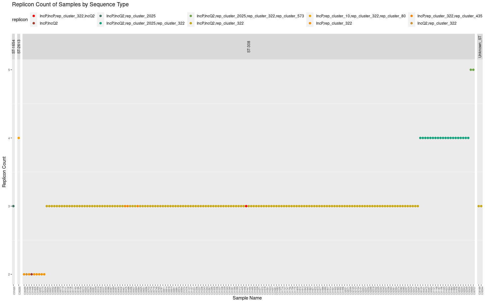

### Step 1: Run mobtyper 

I wrote a shell script (available here: https://github.com/ramadatta/Scripts/blob/master/Shell/mob_typer_OnEachContig.sh) with mobtyper which breaks an assembly into single contig fasta file and run mobtyper on each contig seperately. By doing so, we can know which specific contig has what Inc group. 


```bash
##Bash
time ./mob_typer_OnEachContig.sh &
fgrep '' *_spades.gte1kb.contigs.fasta_Mob/*_spades.gte1kb.contigs.fasta.Mob_report.txt | awk -F/ '{print $2}' | tr ':' '     ' | awk '{print $1 "\t" $2 "\t" $6 "\t" $8 "\t" $14}' | sed 's/_spades.gte1kb.contigs.fasta.Mob_report.txt//g' | grep -v 'file_id' >Mob_Summary.txt

# Extracted below columns from the Mob typer output for all the samples
# SampleName	file_id	rep_type(s)	relaxase_type(s)	PredictedMobility
```

### Step 2: Generate Unicycler Assembly

All the unicycler commands are put in BASH script and ran the script in the BASH console


```bash
time ./unicycler_assembly_filtlong_cmds.sh
```

### Step 3: Generate R plots
From the assembly.fasta, the headers were extracted and an text file **Cmp_RawFilt_Assemblies.txt** is created which is used for plotting using R ggplot function.


```r
setwd("/data02/Analysis/Projects/6_Paeruginosa_183_samples_Shawn/21_Mob/")

library(ggplot2)
library(dplyr)
library(RColorBrewer)
library(ggthemes)
library(paletteer)
library(stringr)
library(wesanderson)
library(scales)
library(kableExtra)


MobDF <- read.table("Mob_Summary.txt",sep = "\t", header = FALSE)
head(MobDF) %>% 
  kbl(caption = "Head sample output") %>%
   kable_classic_2(full_width = F)
```

<table class=" lightable-classic-2" style='font-family: "Arial Narrow", "Source Sans Pro", sans-serif; width: auto !important; margin-left: auto; margin-right: auto;'>
<caption>Head sample output</caption>
 <thead>
  <tr>
   <th style="text-align:left;"> V1 </th>
   <th style="text-align:left;"> V2 </th>
   <th style="text-align:left;"> V3 </th>
   <th style="text-align:left;"> V4 </th>
   <th style="text-align:left;"> V5 </th>
  </tr>
 </thead>
<tbody>
  <tr>
   <td style="text-align:left;"> C00024 </td>
   <td style="text-align:left;"> NODE_10_length_269112_cov_51.232156 </td>
   <td style="text-align:left;"> - </td>
   <td style="text-align:left;"> - </td>
   <td style="text-align:left;"> Non-mobilizable </td>
  </tr>
  <tr>
   <td style="text-align:left;"> C00024 </td>
   <td style="text-align:left;"> NODE_11_length_261444_cov_72.040353 </td>
   <td style="text-align:left;"> - </td>
   <td style="text-align:left;"> - </td>
   <td style="text-align:left;"> Non-mobilizable </td>
  </tr>
  <tr>
   <td style="text-align:left;"> C00024 </td>
   <td style="text-align:left;"> NODE_12_length_250326_cov_70.284369 </td>
   <td style="text-align:left;"> - </td>
   <td style="text-align:left;"> - </td>
   <td style="text-align:left;"> Non-mobilizable </td>
  </tr>
  <tr>
   <td style="text-align:left;"> C00024 </td>
   <td style="text-align:left;"> NODE_13_length_249776_cov_50.252632 </td>
   <td style="text-align:left;"> - </td>
   <td style="text-align:left;"> - </td>
   <td style="text-align:left;"> Non-mobilizable </td>
  </tr>
  <tr>
   <td style="text-align:left;"> C00024 </td>
   <td style="text-align:left;"> NODE_14_length_220228_cov_59.118264 </td>
   <td style="text-align:left;"> - </td>
   <td style="text-align:left;"> MOBH </td>
   <td style="text-align:left;"> Conjugative </td>
  </tr>
  <tr>
   <td style="text-align:left;"> C00024 </td>
   <td style="text-align:left;"> NODE_15_length_180125_cov_56.659818 </td>
   <td style="text-align:left;"> - </td>
   <td style="text-align:left;"> - </td>
   <td style="text-align:left;"> Non-mobilizable </td>
  </tr>
</tbody>
</table>

```r
colnames(MobDF) <- c("sample_name", "contig",	"replicon_type",	"relaxase_type", "PredictedMobility")
head(MobDF) %>% 
  kbl(caption = "Head sample output") %>%
   kable_classic_2(full_width = F)
```

<table class=" lightable-classic-2" style='font-family: "Arial Narrow", "Source Sans Pro", sans-serif; width: auto !important; margin-left: auto; margin-right: auto;'>
<caption>Head sample output</caption>
 <thead>
  <tr>
   <th style="text-align:left;"> sample_name </th>
   <th style="text-align:left;"> contig </th>
   <th style="text-align:left;"> replicon_type </th>
   <th style="text-align:left;"> relaxase_type </th>
   <th style="text-align:left;"> PredictedMobility </th>
  </tr>
 </thead>
<tbody>
  <tr>
   <td style="text-align:left;"> C00024 </td>
   <td style="text-align:left;"> NODE_10_length_269112_cov_51.232156 </td>
   <td style="text-align:left;"> - </td>
   <td style="text-align:left;"> - </td>
   <td style="text-align:left;"> Non-mobilizable </td>
  </tr>
  <tr>
   <td style="text-align:left;"> C00024 </td>
   <td style="text-align:left;"> NODE_11_length_261444_cov_72.040353 </td>
   <td style="text-align:left;"> - </td>
   <td style="text-align:left;"> - </td>
   <td style="text-align:left;"> Non-mobilizable </td>
  </tr>
  <tr>
   <td style="text-align:left;"> C00024 </td>
   <td style="text-align:left;"> NODE_12_length_250326_cov_70.284369 </td>
   <td style="text-align:left;"> - </td>
   <td style="text-align:left;"> - </td>
   <td style="text-align:left;"> Non-mobilizable </td>
  </tr>
  <tr>
   <td style="text-align:left;"> C00024 </td>
   <td style="text-align:left;"> NODE_13_length_249776_cov_50.252632 </td>
   <td style="text-align:left;"> - </td>
   <td style="text-align:left;"> - </td>
   <td style="text-align:left;"> Non-mobilizable </td>
  </tr>
  <tr>
   <td style="text-align:left;"> C00024 </td>
   <td style="text-align:left;"> NODE_14_length_220228_cov_59.118264 </td>
   <td style="text-align:left;"> - </td>
   <td style="text-align:left;"> MOBH </td>
   <td style="text-align:left;"> Conjugative </td>
  </tr>
  <tr>
   <td style="text-align:left;"> C00024 </td>
   <td style="text-align:left;"> NODE_15_length_180125_cov_56.659818 </td>
   <td style="text-align:left;"> - </td>
   <td style="text-align:left;"> - </td>
   <td style="text-align:left;"> Non-mobilizable </td>
  </tr>
</tbody>
</table>

```r
MobDF_mod <- MobDF %>% mutate(interim = str_extract(contig, "_length_.*_cov")) %>% mutate(length = str_extract(interim, "[0-9]+")) %>% select(-interim)
head(MobDF_mod) %>% 
  kbl(caption = "Head sample output") %>%
   kable_classic_2(full_width = F)
```

<table class=" lightable-classic-2" style='font-family: "Arial Narrow", "Source Sans Pro", sans-serif; width: auto !important; margin-left: auto; margin-right: auto;'>
<caption>Head sample output</caption>
 <thead>
  <tr>
   <th style="text-align:left;"> sample_name </th>
   <th style="text-align:left;"> contig </th>
   <th style="text-align:left;"> replicon_type </th>
   <th style="text-align:left;"> relaxase_type </th>
   <th style="text-align:left;"> PredictedMobility </th>
   <th style="text-align:left;"> length </th>
  </tr>
 </thead>
<tbody>
  <tr>
   <td style="text-align:left;"> C00024 </td>
   <td style="text-align:left;"> NODE_10_length_269112_cov_51.232156 </td>
   <td style="text-align:left;"> - </td>
   <td style="text-align:left;"> - </td>
   <td style="text-align:left;"> Non-mobilizable </td>
   <td style="text-align:left;"> 269112 </td>
  </tr>
  <tr>
   <td style="text-align:left;"> C00024 </td>
   <td style="text-align:left;"> NODE_11_length_261444_cov_72.040353 </td>
   <td style="text-align:left;"> - </td>
   <td style="text-align:left;"> - </td>
   <td style="text-align:left;"> Non-mobilizable </td>
   <td style="text-align:left;"> 261444 </td>
  </tr>
  <tr>
   <td style="text-align:left;"> C00024 </td>
   <td style="text-align:left;"> NODE_12_length_250326_cov_70.284369 </td>
   <td style="text-align:left;"> - </td>
   <td style="text-align:left;"> - </td>
   <td style="text-align:left;"> Non-mobilizable </td>
   <td style="text-align:left;"> 250326 </td>
  </tr>
  <tr>
   <td style="text-align:left;"> C00024 </td>
   <td style="text-align:left;"> NODE_13_length_249776_cov_50.252632 </td>
   <td style="text-align:left;"> - </td>
   <td style="text-align:left;"> - </td>
   <td style="text-align:left;"> Non-mobilizable </td>
   <td style="text-align:left;"> 249776 </td>
  </tr>
  <tr>
   <td style="text-align:left;"> C00024 </td>
   <td style="text-align:left;"> NODE_14_length_220228_cov_59.118264 </td>
   <td style="text-align:left;"> - </td>
   <td style="text-align:left;"> MOBH </td>
   <td style="text-align:left;"> Conjugative </td>
   <td style="text-align:left;"> 220228 </td>
  </tr>
  <tr>
   <td style="text-align:left;"> C00024 </td>
   <td style="text-align:left;"> NODE_15_length_180125_cov_56.659818 </td>
   <td style="text-align:left;"> - </td>
   <td style="text-align:left;"> - </td>
   <td style="text-align:left;"> Non-mobilizable </td>
   <td style="text-align:left;"> 180125 </td>
  </tr>
</tbody>
</table>

```r
tail(MobDF_mod) %>% 
  kbl(caption = "Head sample output") %>%
   kable_classic_2(full_width = F)
```

<table class=" lightable-classic-2" style='font-family: "Arial Narrow", "Source Sans Pro", sans-serif; width: auto !important; margin-left: auto; margin-right: auto;'>
<caption>Head sample output</caption>
 <thead>
  <tr>
   <th style="text-align:left;">   </th>
   <th style="text-align:left;"> sample_name </th>
   <th style="text-align:left;"> contig </th>
   <th style="text-align:left;"> replicon_type </th>
   <th style="text-align:left;"> relaxase_type </th>
   <th style="text-align:left;"> PredictedMobility </th>
   <th style="text-align:left;"> length </th>
  </tr>
 </thead>
<tbody>
  <tr>
   <td style="text-align:left;"> 16062 </td>
   <td style="text-align:left;"> C02481 </td>
   <td style="text-align:left;"> NODE_4_length_416647_cov_53.049132 </td>
   <td style="text-align:left;"> - </td>
   <td style="text-align:left;"> - </td>
   <td style="text-align:left;"> Non-mobilizable </td>
   <td style="text-align:left;"> 416647 </td>
  </tr>
  <tr>
   <td style="text-align:left;"> 16063 </td>
   <td style="text-align:left;"> C02481 </td>
   <td style="text-align:left;"> NODE_5_length_401536_cov_46.237651 </td>
   <td style="text-align:left;"> - </td>
   <td style="text-align:left;"> - </td>
   <td style="text-align:left;"> Non-mobilizable </td>
   <td style="text-align:left;"> 401536 </td>
  </tr>
  <tr>
   <td style="text-align:left;"> 16064 </td>
   <td style="text-align:left;"> C02481 </td>
   <td style="text-align:left;"> NODE_6_length_394526_cov_54.294193 </td>
   <td style="text-align:left;"> - </td>
   <td style="text-align:left;"> - </td>
   <td style="text-align:left;"> Non-mobilizable </td>
   <td style="text-align:left;"> 394526 </td>
  </tr>
  <tr>
   <td style="text-align:left;"> 16065 </td>
   <td style="text-align:left;"> C02481 </td>
   <td style="text-align:left;"> NODE_7_length_361670_cov_42.217819 </td>
   <td style="text-align:left;"> IncP </td>
   <td style="text-align:left;"> MOBP </td>
   <td style="text-align:left;"> Mobilizable </td>
   <td style="text-align:left;"> 361670 </td>
  </tr>
  <tr>
   <td style="text-align:left;"> 16066 </td>
   <td style="text-align:left;"> C02481 </td>
   <td style="text-align:left;"> NODE_8_length_327025_cov_50.826220 </td>
   <td style="text-align:left;"> - </td>
   <td style="text-align:left;"> - </td>
   <td style="text-align:left;"> Non-mobilizable </td>
   <td style="text-align:left;"> 327025 </td>
  </tr>
  <tr>
   <td style="text-align:left;"> 16067 </td>
   <td style="text-align:left;"> C02481 </td>
   <td style="text-align:left;"> NODE_9_length_299125_cov_50.301487 </td>
   <td style="text-align:left;"> - </td>
   <td style="text-align:left;"> MOBH </td>
   <td style="text-align:left;"> Conjugative </td>
   <td style="text-align:left;"> 299125 </td>
  </tr>
</tbody>
</table>

ST information is not available in Mobtyper results. SO adding that information from CGE results for each the sample.


```r
# lets add ST from an external file using vlookup
ST <- read.table("cge_resistome_species_ST.txt",sep = "\t", header = TRUE, quote="")
head(ST) %>% 
  kbl(caption = "Head sample output") %>%
   kable_classic_2(full_width = F)
```

<table class=" lightable-classic-2" style='font-family: "Arial Narrow", "Source Sans Pro", sans-serif; width: auto !important; margin-left: auto; margin-right: auto;'>
<caption>Head sample output</caption>
 <thead>
  <tr>
   <th style="text-align:left;"> sample_name </th>
   <th style="text-align:left;"> resistance </th>
   <th style="text-align:left;"> species </th>
   <th style="text-align:left;"> mlst </th>
  </tr>
 </thead>
<tbody>
  <tr>
   <td style="text-align:left;"> C00024 </td>
   <td style="text-align:left;"> aac(3)-Id,aac(6')-Il,aadA10,aph(3'')-Ib,aph(3')-IIb,aph(6)-Id,blaNDM-1,blaOXA-488,blaPAO,catB7,crpP,dfrB5,floR,fosA,msr(E),qnrVC1,sul2 </td>
   <td style="text-align:left;"> Pseudomonas aeruginosa </td>
   <td style="text-align:left;"> ST-308 </td>
  </tr>
  <tr>
   <td style="text-align:left;"> C00027 </td>
   <td style="text-align:left;"> aac(3)-Id,aac(6')-Il,aadA10,aph(3'')-Ib,aph(3')-IIb,aph(6)-Id,blaNDM-1,blaOXA-488,blaPAO,catB7,crpP,dfrB5,floR,fosA,msr(E),qnrVC1,sul2 </td>
   <td style="text-align:left;"> Pseudomonas aeruginosa </td>
   <td style="text-align:left;"> ST-308 </td>
  </tr>
  <tr>
   <td style="text-align:left;"> C00042 </td>
   <td style="text-align:left;"> aac(3)-Id,aac(6')-Il,aadA10,aph(3'')-Ib,aph(3')-IIb,aph(6)-Id,blaNDM-1,blaOXA-488,blaPAO,catB7,crpP,dfrB5,floR,fosA,msr(E),qnrVC1,sul2 </td>
   <td style="text-align:left;"> Pseudomonas aeruginosa </td>
   <td style="text-align:left;"> ST-308 </td>
  </tr>
  <tr>
   <td style="text-align:left;"> C00056 </td>
   <td style="text-align:left;"> aac(3)-Id,aac(6')-Il,aadA10,aph(3'')-Ib,aph(3')-IIb,aph(6)-Id,blaNDM-1,blaOXA-488,blaPAO,catB7,crpP,dfrB5,floR,fosA,msr(E),qnrVC1,sul2 </td>
   <td style="text-align:left;"> Pseudomonas aeruginosa </td>
   <td style="text-align:left;"> ST-308 </td>
  </tr>
  <tr>
   <td style="text-align:left;"> C00068 </td>
   <td style="text-align:left;"> aac(3)-Id,aac(6')-Il,aadA10,aph(3'')-Ib,aph(3')-IIb,aph(6)-Id,blaNDM-1,blaOXA-488,blaPAO,catB7,crpP,dfrB5,floR,fosA,msr(E),qnrVC1,sul2 </td>
   <td style="text-align:left;"> Pseudomonas aeruginosa </td>
   <td style="text-align:left;"> ST-308 </td>
  </tr>
  <tr>
   <td style="text-align:left;"> C00073 </td>
   <td style="text-align:left;"> aac(3)-Id,aac(6')-Il,aadA10,aph(3'')-Ib,aph(3')-IIb,aph(6)-Id,blaNDM-1,blaOXA-488,blaPAO,catB7,crpP,dfrB5,floR,fosA,msr(E),qnrVC1,sul2 </td>
   <td style="text-align:left;"> Pseudomonas aeruginosa </td>
   <td style="text-align:left;"> ST-308 </td>
  </tr>
</tbody>
</table>

```r
# Vlookup in R using the dplyr package
MobDF_mod_ST <- as.data.frame(MobDF_mod %>% right_join(ST, by = 'sample_name') %>% select(-resistance,-species))
head(MobDF_mod_ST) %>% 
  kbl(caption = "Head sample output") %>%
   kable_classic_2(full_width = F)
```

<table class=" lightable-classic-2" style='font-family: "Arial Narrow", "Source Sans Pro", sans-serif; width: auto !important; margin-left: auto; margin-right: auto;'>
<caption>Head sample output</caption>
 <thead>
  <tr>
   <th style="text-align:left;"> sample_name </th>
   <th style="text-align:left;"> contig </th>
   <th style="text-align:left;"> replicon_type </th>
   <th style="text-align:left;"> relaxase_type </th>
   <th style="text-align:left;"> PredictedMobility </th>
   <th style="text-align:left;"> length </th>
   <th style="text-align:left;"> mlst </th>
  </tr>
 </thead>
<tbody>
  <tr>
   <td style="text-align:left;"> C00024 </td>
   <td style="text-align:left;"> NODE_10_length_269112_cov_51.232156 </td>
   <td style="text-align:left;"> - </td>
   <td style="text-align:left;"> - </td>
   <td style="text-align:left;"> Non-mobilizable </td>
   <td style="text-align:left;"> 269112 </td>
   <td style="text-align:left;"> ST-308 </td>
  </tr>
  <tr>
   <td style="text-align:left;"> C00024 </td>
   <td style="text-align:left;"> NODE_11_length_261444_cov_72.040353 </td>
   <td style="text-align:left;"> - </td>
   <td style="text-align:left;"> - </td>
   <td style="text-align:left;"> Non-mobilizable </td>
   <td style="text-align:left;"> 261444 </td>
   <td style="text-align:left;"> ST-308 </td>
  </tr>
  <tr>
   <td style="text-align:left;"> C00024 </td>
   <td style="text-align:left;"> NODE_12_length_250326_cov_70.284369 </td>
   <td style="text-align:left;"> - </td>
   <td style="text-align:left;"> - </td>
   <td style="text-align:left;"> Non-mobilizable </td>
   <td style="text-align:left;"> 250326 </td>
   <td style="text-align:left;"> ST-308 </td>
  </tr>
  <tr>
   <td style="text-align:left;"> C00024 </td>
   <td style="text-align:left;"> NODE_13_length_249776_cov_50.252632 </td>
   <td style="text-align:left;"> - </td>
   <td style="text-align:left;"> - </td>
   <td style="text-align:left;"> Non-mobilizable </td>
   <td style="text-align:left;"> 249776 </td>
   <td style="text-align:left;"> ST-308 </td>
  </tr>
  <tr>
   <td style="text-align:left;"> C00024 </td>
   <td style="text-align:left;"> NODE_14_length_220228_cov_59.118264 </td>
   <td style="text-align:left;"> - </td>
   <td style="text-align:left;"> MOBH </td>
   <td style="text-align:left;"> Conjugative </td>
   <td style="text-align:left;"> 220228 </td>
   <td style="text-align:left;"> ST-308 </td>
  </tr>
  <tr>
   <td style="text-align:left;"> C00024 </td>
   <td style="text-align:left;"> NODE_15_length_180125_cov_56.659818 </td>
   <td style="text-align:left;"> - </td>
   <td style="text-align:left;"> - </td>
   <td style="text-align:left;"> Non-mobilizable </td>
   <td style="text-align:left;"> 180125 </td>
   <td style="text-align:left;"> ST-308 </td>
  </tr>
</tbody>
</table>

```r
# how many samples have plasmids?
sample_replicon_count <- as.data.frame(MobDF_mod_ST %>% 
  filter(!replicon_type == "-")  %>% 
 # head() %>% 
  select(sample_name,replicon_type,mlst) %>% 
  unique() %>% 
  arrange(replicon_type) %>% 
  group_by(sample_name) %>% 
  mutate(replicon = paste0(replicon_type, collapse = ",")) %>% 
  select(-replicon_type) %>% 
  mutate(count = n()) %>% 
  unique() %>% 
  arrange(count,replicon)) 

head(sample_replicon_count) %>% 
  kbl(caption = "Head sample output") %>%
   kable_classic_2(full_width = F)
```

<table class=" lightable-classic-2" style='font-family: "Arial Narrow", "Source Sans Pro", sans-serif; width: auto !important; margin-left: auto; margin-right: auto;'>
<caption>Head sample output</caption>
 <thead>
  <tr>
   <th style="text-align:left;"> sample_name </th>
   <th style="text-align:left;"> mlst </th>
   <th style="text-align:left;"> replicon </th>
   <th style="text-align:right;"> count </th>
  </tr>
 </thead>
<tbody>
  <tr>
   <td style="text-align:left;"> C01448 </td>
   <td style="text-align:left;"> ST-308 </td>
   <td style="text-align:left;"> IncP,IncQ2 </td>
   <td style="text-align:right;"> 2 </td>
  </tr>
  <tr>
   <td style="text-align:left;"> C00499 </td>
   <td style="text-align:left;"> ST-308 </td>
   <td style="text-align:left;"> IncP,rep_cluster_322 </td>
   <td style="text-align:right;"> 2 </td>
  </tr>
  <tr>
   <td style="text-align:left;"> C01248 </td>
   <td style="text-align:left;"> ST-308 </td>
   <td style="text-align:left;"> IncP,rep_cluster_322 </td>
   <td style="text-align:right;"> 2 </td>
  </tr>
  <tr>
   <td style="text-align:left;"> C01835 </td>
   <td style="text-align:left;"> ST-308 </td>
   <td style="text-align:left;"> IncP,rep_cluster_322 </td>
   <td style="text-align:right;"> 2 </td>
  </tr>
  <tr>
   <td style="text-align:left;"> C01958 </td>
   <td style="text-align:left;"> ST-308 </td>
   <td style="text-align:left;"> IncP,rep_cluster_322 </td>
   <td style="text-align:right;"> 2 </td>
  </tr>
  <tr>
   <td style="text-align:left;"> C02091 </td>
   <td style="text-align:left;"> ST-308 </td>
   <td style="text-align:left;"> IncP,rep_cluster_322 </td>
   <td style="text-align:right;"> 2 </td>
  </tr>
</tbody>
</table>

Let us plot how many of Replicons each sample carries from the dataset.


```r
sample_replicon_count$replicon <- as.factor(sample_replicon_count$replicon)
sample_replicon_count$sample_name <- as.factor(sample_replicon_count$sample_name)

# Replicon Count of Samples by Sequence Type
ggplot(sample_replicon_count,aes(reorder(x=sample_name,count),y=count,color=replicon))+
  geom_point(size = 2) +
  facet_grid(~mlst, scales = "free", space = "free") + 
  #scale_color_brewer(palette="Set3") +
  scale_color_manual(values=wes_palette(n=12,  name = "Darjeeling1", type = "continuous"))+
  #scale_shape_manual(values = c(0,1,2,3,4,5,6,7,8,9,10,11,12)) +
  theme(panel.grid.major = element_blank(),
        axis.text.x = element_text(angle = 90, hjust = 1, size = 6),
        axis.text.y = element_text(angle = 0, hjust = 1, size = 7), 
        legend.position = "top", legend.text=element_text(size=9),strip.text.y.right = element_text(angle = 0), strip.text.x.top = element_text(angle = 90)) +
  labs(x="Sample Name",
       y="Replicon Count",
       title = "Replicon Count of Samples by Sequence Type")
```

<!-- -->

The above figure shows mostly ST308 have same kind of the replicon with a count of 3 and an other few with count 4. 

Let us now plot count of samples for each of Replicon type by their ST.


```r
# Replicon Count of Samples by Sequence Type
head(sample_replicon_count) %>% 
  kbl(caption = "Head sample output") %>%
   kable_classic_2(full_width = F)
```

<table class=" lightable-classic-2" style='font-family: "Arial Narrow", "Source Sans Pro", sans-serif; width: auto !important; margin-left: auto; margin-right: auto;'>
<caption>Head sample output</caption>
 <thead>
  <tr>
   <th style="text-align:left;"> sample_name </th>
   <th style="text-align:left;"> mlst </th>
   <th style="text-align:left;"> replicon </th>
   <th style="text-align:right;"> count </th>
  </tr>
 </thead>
<tbody>
  <tr>
   <td style="text-align:left;"> C01448 </td>
   <td style="text-align:left;"> ST-308 </td>
   <td style="text-align:left;"> IncP,IncQ2 </td>
   <td style="text-align:right;"> 2 </td>
  </tr>
  <tr>
   <td style="text-align:left;"> C00499 </td>
   <td style="text-align:left;"> ST-308 </td>
   <td style="text-align:left;"> IncP,rep_cluster_322 </td>
   <td style="text-align:right;"> 2 </td>
  </tr>
  <tr>
   <td style="text-align:left;"> C01248 </td>
   <td style="text-align:left;"> ST-308 </td>
   <td style="text-align:left;"> IncP,rep_cluster_322 </td>
   <td style="text-align:right;"> 2 </td>
  </tr>
  <tr>
   <td style="text-align:left;"> C01835 </td>
   <td style="text-align:left;"> ST-308 </td>
   <td style="text-align:left;"> IncP,rep_cluster_322 </td>
   <td style="text-align:right;"> 2 </td>
  </tr>
  <tr>
   <td style="text-align:left;"> C01958 </td>
   <td style="text-align:left;"> ST-308 </td>
   <td style="text-align:left;"> IncP,rep_cluster_322 </td>
   <td style="text-align:right;"> 2 </td>
  </tr>
  <tr>
   <td style="text-align:left;"> C02091 </td>
   <td style="text-align:left;"> ST-308 </td>
   <td style="text-align:left;"> IncP,rep_cluster_322 </td>
   <td style="text-align:right;"> 2 </td>
  </tr>
</tbody>
</table>

```r
MobDF_mod_ST_table <- as.data.frame(sample_replicon_count %>%  group_by(mlst) %>% count(replicon))
head(MobDF_mod_ST_table) %>% 
  kbl(caption = "Head sample output") %>%
   kable_classic_2(full_width = F)
```

<table class=" lightable-classic-2" style='font-family: "Arial Narrow", "Source Sans Pro", sans-serif; width: auto !important; margin-left: auto; margin-right: auto;'>
<caption>Head sample output</caption>
 <thead>
  <tr>
   <th style="text-align:left;"> mlst </th>
   <th style="text-align:left;"> replicon </th>
   <th style="text-align:right;"> n </th>
  </tr>
 </thead>
<tbody>
  <tr>
   <td style="text-align:left;"> ST-1654 </td>
   <td style="text-align:left;"> IncP,IncQ2,rep_cluster_2025 </td>
   <td style="text-align:right;"> 1 </td>
  </tr>
  <tr>
   <td style="text-align:left;"> ST-2613 </td>
   <td style="text-align:left;"> IncP,rep_cluster_10,rep_cluster_322,rep_cluster_80 </td>
   <td style="text-align:right;"> 1 </td>
  </tr>
  <tr>
   <td style="text-align:left;"> ST-308 </td>
   <td style="text-align:left;"> IncP,IncP,rep_cluster_322,IncQ2 </td>
   <td style="text-align:right;"> 1 </td>
  </tr>
  <tr>
   <td style="text-align:left;"> ST-308 </td>
   <td style="text-align:left;"> IncP,IncQ2 </td>
   <td style="text-align:right;"> 1 </td>
  </tr>
  <tr>
   <td style="text-align:left;"> ST-308 </td>
   <td style="text-align:left;"> IncP,IncQ2,rep_cluster_2025,rep_cluster_322 </td>
   <td style="text-align:right;"> 20 </td>
  </tr>
  <tr>
   <td style="text-align:left;"> ST-308 </td>
   <td style="text-align:left;"> IncP,IncQ2,rep_cluster_2025,rep_cluster_322,rep_cluster_573 </td>
   <td style="text-align:right;"> 2 </td>
  </tr>
</tbody>
</table>

```r
ggplot(MobDF_mod_ST_table,aes(x=replicon,y=n,fill=replicon))+
  geom_bar(stat = "identity", width=0.4) +
  facet_grid(~mlst, scales = "free", space = "free") + 
  #scale_color_brewer(palette="Set3") +
  scale_color_manual(values=wes_palette(n=12,  name = "Darjeeling1", type = "continuous"))+
  #scale_shape_manual(values = c(0,1,2,3,4,5,6,7,8,9,10,11,12)) +
  geom_text(aes(label = n), vjust = -0.09, hjust = 0.07, position = position_dodge(width=0.9),  size=3)+
  theme(panel.grid.major = element_blank(),
        axis.text.x = element_text(angle = 90, hjust = 1, size = 9),
        axis.text.y = element_text(angle = 0, hjust = 1, size = 7), 
        legend.position = "top", legend.text=element_text(size=9),strip.text.y.right = element_text(angle = 0), strip.text.x.top = element_text(angle = 90)) +
  labs(x="Sample Name",
       y="Replicon Count",
       title = "Replicon Count of Samples by Sequence Type") 
```

<!-- -->

From the above we can understand all of our pseudomonas samples have a IncP replicon and IncQ replicon. 
