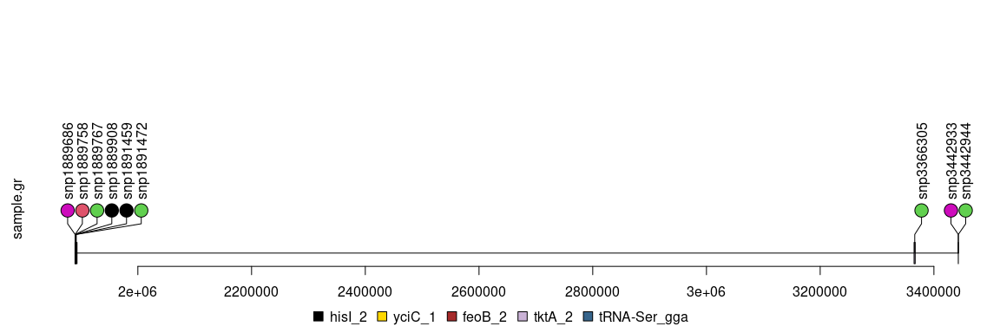

### Step 1: Reference genome annotation

For this step, I have annotated my reference genome using Prokka.


```bash
prokka2 --force --cpus 32 --outdir  SHG10_pKPC2-km_prokka_out --prefix  SHG10_pKPC2-km  SHG10_pKPC2-km_unicycler.gte1kb.contigs.fasta >>prokka_log 2>>prokka_error; 
```

### Step 2: Generate SNPs from using multiple samples

Using the above reference, I have run SNIPPY for multiple samples


```bash
snippy commands
```

### Step 3: Extract SNPs

SNIPPY generates a VCF file for each sample and we want the SNPs.
As we can see below 3 WT files have around 10-16 SNPs


```bash
$ grep "" *WT*/snps.filt.vcf  | grep -v '#' | cut -f1 -d":" | sort | uniq -c
     15 SGH10_WT_G300__1/snps.filt.vcf
     16 SGH10_WT_G300__2/snps.filt.vcf
     10 SGH10_WT_G300__3/snps.filt.vcf
```

### Step 4: Extract SNPs from Single VCF file

Let us use SNPs from `SGH10_WT_G300__3` sample.


```bash
cat snps.filt.vcf | grep -v "#" | awk '{print $1 "\t" $2}' >SGH10_WT_G300__2_snps.list
```

### Step 5: Generate Lollipop Plot R script

I wrote a shell script which generate a R script to generate lollipop plot. 
Basically using SNPs from `SGH10_WT_G300__2_snps.list` file, let us bedtools intersect and extract the regions where the SNPs are falling under.

Once the regions and coordinates are found, we pass this to `trackViewer` which generates lollipop plot


```bash
bash lollipop_rcode_generator.sh >proLolli.R
```

### Step 6: Generate Lollipop Plot using R script


```r
setwd("/home/prakki/Documents/LeaRn/proLolli/SingleVCF/")

source(file = "proLolli.R")
```

<!-- -->

### Step 7: Extract SNPs from Multiple VCF file

Let us use SNPs from `SGH10_WT_G300__3` sample.


```bash
cat *snps.filt.vcf | grep -v "#" | grep "TYPE=snp" | awk '{print $2}' | sort | uniq -c | awk '{print $2 "\t" $1}' >snpCount_multiVCF.list
```

### Step 8: Generate Lollipop Plot R script

I wrote a shell script which generate a R script to generate lollipop plot. 
Basically using SNPs from all files, let us bedtools intersect and extract the regions where the SNPs are falling under.

Once the regions and coordinates are found, we pass this to `trackViewer` which generates lollipop plot


```bash
bash lollipop_rcode_generator_multiVCF.sh >proLolli_multi.R
```
if the reference gff complains with error

```
Error: line number x of file file.gff has 1 fields, but 9 were expected.
```

then
```
sed '/^##FASTA$/,$d' file.gff
```

### Step 9: Generate Lollipop Plot using R script


```r
setwd("/home/prakki/Documents/LeaRn/proLolli/MultiVCF")

source(file = "proLolli_multi.R")
```

<!-- -->

### Step 10: Increase resolution of the Sequence

Having a very big chromosome in MBs or even 40 to 50Kb does not help viewing the gene structures which are few hundred bases apart. They become merged.
So, let us just concentrate on plotting a lollipop plot of ~3Kb regions with 3 genes "hisI_2","yciC_1","feoB_2".


```r
setwd("/home/prakki/Documents/LeaRn/proLolli/MultiVCF")

snpCount_df <- read.table("snpCount_multiVCF.list",sep = "\t", header = FALSE)
colnames(snpCount_df) <- c("SNP","Count")

features <- GRanges("chr1", IRanges(c(1889465,1889903,1891393), width=c(401,1223,1649), names=c("hisI_2","yciC_1","feoB_2"), fill=c("brown", "#CAB2D6", "steelblue4"), height = c(0.08,0.08,0.08)))

SNP <- c(1214150,1214158,1394646,1889686,1889758,1889767,1889908,1891472,3366305,4841537,5431837)

Sample_Count <- GRanges("chr1", IRanges(SNP, width=1, names=paste0("snp", SNP)),
                     color = sample.int(6, length(SNP), replace=TRUE),
                     score = snpCount_df$Count
)
lolliplot(Sample_Count, features)
```

<!-- -->
