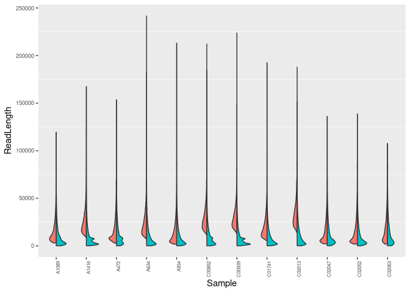

### Step 1: Filter Long reads 

All the raw fastq reads for the samples are processed using the tool "filtlong" using the following command.


```bash
time for d in $(ls *.fastq | sed 's/.fastq//g'); 
do 
filtlong --min_length 1000 --keep_percent 90 --target_bases 500000000 "$d".fastq > "$d".filtlong.fastq & 
done
```

### Step 2: Generate read statistics
Now that we have both raw and filtered fastq files run let us generate readlength distributions using AWK in BASH


```bash
for d in $(ls *.fastq | sed 's/_Nanopore.*//g' | sort -u);
do 
awk -v d="$d" 'NR%4==2{print length($0) "\t" d "\t" FILENAME}' "$d"*.fastq >>11F_melt_readlengths.txt; 
done 
```

### Step 3: Generate R plots

Let us load the **11F_melt_readlengths.txt;** file into R and generate some figures from the data using R ggplot function.

```r
setwd("/data02/Analysis/Projects/8_Aqueos_samples/11F/bbstats/")
library(dplyr)
library(ggplot2)
library(ggunchained)
library(kableExtra)

readlen_melt <- read.table("11F_melt_readlengths.txt", sep = "\t", header = FALSE)

head(readlen_melt) %>%
  kbl(caption = "Head sample output") %>%
   kable_classic_2(full_width = F)
```

<table class=" lightable-classic-2" style='font-family: "Arial Narrow", "Source Sans Pro", sans-serif; width: auto !important; margin-left: auto; margin-right: auto;'>
<caption>Head sample output</caption>
 <thead>
  <tr>
   <th style="text-align:right;"> V1 </th>
   <th style="text-align:left;"> V2 </th>
   <th style="text-align:left;"> V3 </th>
  </tr>
 </thead>
<tbody>
  <tr>
   <td style="text-align:right;"> 3564 </td>
   <td style="text-align:left;"> A1089 </td>
   <td style="text-align:left;"> A1089_Nanopore.fastq </td>
  </tr>
  <tr>
   <td style="text-align:right;"> 1467 </td>
   <td style="text-align:left;"> A1089 </td>
   <td style="text-align:left;"> A1089_Nanopore.fastq </td>
  </tr>
  <tr>
   <td style="text-align:right;"> 3782 </td>
   <td style="text-align:left;"> A1089 </td>
   <td style="text-align:left;"> A1089_Nanopore.fastq </td>
  </tr>
  <tr>
   <td style="text-align:right;"> 3840 </td>
   <td style="text-align:left;"> A1089 </td>
   <td style="text-align:left;"> A1089_Nanopore.fastq </td>
  </tr>
  <tr>
   <td style="text-align:right;"> 2272 </td>
   <td style="text-align:left;"> A1089 </td>
   <td style="text-align:left;"> A1089_Nanopore.fastq </td>
  </tr>
  <tr>
   <td style="text-align:right;"> 1821 </td>
   <td style="text-align:left;"> A1089 </td>
   <td style="text-align:left;"> A1089_Nanopore.fastq </td>
  </tr>
</tbody>
</table>

```r
tail(readlen_melt) %>%
  kbl(caption = "Tail sample output") %>%
   kable_classic_2(full_width = F)
```

<table class=" lightable-classic-2" style='font-family: "Arial Narrow", "Source Sans Pro", sans-serif; width: auto !important; margin-left: auto; margin-right: auto;'>
<caption>Tail sample output</caption>
 <thead>
  <tr>
   <th style="text-align:left;">   </th>
   <th style="text-align:right;"> V1 </th>
   <th style="text-align:left;"> V2 </th>
   <th style="text-align:left;"> V3 </th>
  </tr>
 </thead>
<tbody>
  <tr>
   <td style="text-align:left;"> 1243234 </td>
   <td style="text-align:right;"> 2121 </td>
   <td style="text-align:left;"> C02063 </td>
   <td style="text-align:left;"> C02063_Nanopore.filtlong.fastq </td>
  </tr>
  <tr>
   <td style="text-align:left;"> 1243235 </td>
   <td style="text-align:right;"> 21598 </td>
   <td style="text-align:left;"> C02063 </td>
   <td style="text-align:left;"> C02063_Nanopore.filtlong.fastq </td>
  </tr>
  <tr>
   <td style="text-align:left;"> 1243236 </td>
   <td style="text-align:right;"> 9520 </td>
   <td style="text-align:left;"> C02063 </td>
   <td style="text-align:left;"> C02063_Nanopore.filtlong.fastq </td>
  </tr>
  <tr>
   <td style="text-align:left;"> 1243237 </td>
   <td style="text-align:right;"> 68265 </td>
   <td style="text-align:left;"> C02063 </td>
   <td style="text-align:left;"> C02063_Nanopore.filtlong.fastq </td>
  </tr>
  <tr>
   <td style="text-align:left;"> 1243238 </td>
   <td style="text-align:right;"> 71831 </td>
   <td style="text-align:left;"> C02063 </td>
   <td style="text-align:left;"> C02063_Nanopore.filtlong.fastq </td>
  </tr>
  <tr>
   <td style="text-align:left;"> 1243239 </td>
   <td style="text-align:right;"> 5627 </td>
   <td style="text-align:left;"> C02063 </td>
   <td style="text-align:left;"> C02063_Nanopore.filtlong.fastq </td>
  </tr>
</tbody>
</table>

```r
#renaming column names
colnames(readlen_melt) <- c("ReadLength","Sample","Filename")

head(readlen_melt) %>%
  kbl(caption = "Sample output") %>%
   kable_classic_2(full_width = F)
```

<table class=" lightable-classic-2" style='font-family: "Arial Narrow", "Source Sans Pro", sans-serif; width: auto !important; margin-left: auto; margin-right: auto;'>
<caption>Sample output</caption>
 <thead>
  <tr>
   <th style="text-align:right;"> ReadLength </th>
   <th style="text-align:left;"> Sample </th>
   <th style="text-align:left;"> Filename </th>
  </tr>
 </thead>
<tbody>
  <tr>
   <td style="text-align:right;"> 3564 </td>
   <td style="text-align:left;"> A1089 </td>
   <td style="text-align:left;"> A1089_Nanopore.fastq </td>
  </tr>
  <tr>
   <td style="text-align:right;"> 1467 </td>
   <td style="text-align:left;"> A1089 </td>
   <td style="text-align:left;"> A1089_Nanopore.fastq </td>
  </tr>
  <tr>
   <td style="text-align:right;"> 3782 </td>
   <td style="text-align:left;"> A1089 </td>
   <td style="text-align:left;"> A1089_Nanopore.fastq </td>
  </tr>
  <tr>
   <td style="text-align:right;"> 3840 </td>
   <td style="text-align:left;"> A1089 </td>
   <td style="text-align:left;"> A1089_Nanopore.fastq </td>
  </tr>
  <tr>
   <td style="text-align:right;"> 2272 </td>
   <td style="text-align:left;"> A1089 </td>
   <td style="text-align:left;"> A1089_Nanopore.fastq </td>
  </tr>
  <tr>
   <td style="text-align:right;"> 1821 </td>
   <td style="text-align:left;"> A1089 </td>
   <td style="text-align:left;"> A1089_Nanopore.fastq </td>
  </tr>
</tbody>
</table>

```r
#Create a new column with either 'Raw' or 'Filtlong'

readlen_melt <- readlen_melt %>% 
                mutate(data = case_when(grepl("_Nanopore.fastq", Filename) ~ "Raw",
                                        grepl("filtlong", Filename, ignore.case = TRUE) ~"Filtlong")) %>% 
                select(-Filename) 

head(readlen_melt) %>%
  kbl(caption = "Sample output") %>%
   kable_classic_2(full_width = F)
```

<table class=" lightable-classic-2" style='font-family: "Arial Narrow", "Source Sans Pro", sans-serif; width: auto !important; margin-left: auto; margin-right: auto;'>
<caption>Sample output</caption>
 <thead>
  <tr>
   <th style="text-align:right;"> ReadLength </th>
   <th style="text-align:left;"> Sample </th>
   <th style="text-align:left;"> data </th>
  </tr>
 </thead>
<tbody>
  <tr>
   <td style="text-align:right;"> 3564 </td>
   <td style="text-align:left;"> A1089 </td>
   <td style="text-align:left;"> Raw </td>
  </tr>
  <tr>
   <td style="text-align:right;"> 1467 </td>
   <td style="text-align:left;"> A1089 </td>
   <td style="text-align:left;"> Raw </td>
  </tr>
  <tr>
   <td style="text-align:right;"> 3782 </td>
   <td style="text-align:left;"> A1089 </td>
   <td style="text-align:left;"> Raw </td>
  </tr>
  <tr>
   <td style="text-align:right;"> 3840 </td>
   <td style="text-align:left;"> A1089 </td>
   <td style="text-align:left;"> Raw </td>
  </tr>
  <tr>
   <td style="text-align:right;"> 2272 </td>
   <td style="text-align:left;"> A1089 </td>
   <td style="text-align:left;"> Raw </td>
  </tr>
  <tr>
   <td style="text-align:right;"> 1821 </td>
   <td style="text-align:left;"> A1089 </td>
   <td style="text-align:left;"> Raw </td>
  </tr>
</tbody>
</table>

```r
#Split Violin Plot
ggplot(readlen_melt,aes(x=Sample,y=ReadLength,fill=data)) + geom_split_violin() +
theme(panel.grid.major = element_blank(),
      axis.text.x = element_text(angle = 90, hjust = 1, size = 6),
      axis.text.y = element_text(angle = 0, hjust = 1, size = 7), 
      legend.position = "none", strip.text.y.right = element_text(angle = 0), strip.text.x.top = element_text(angle = 90)) 
```

<!-- -->

```r
ggsave("11F_violin_plot_readlengths.png",dpi = 300, width = 10, height = 5, units = "in")
```

